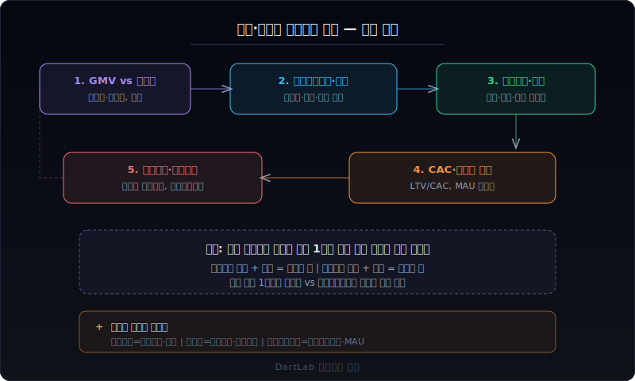
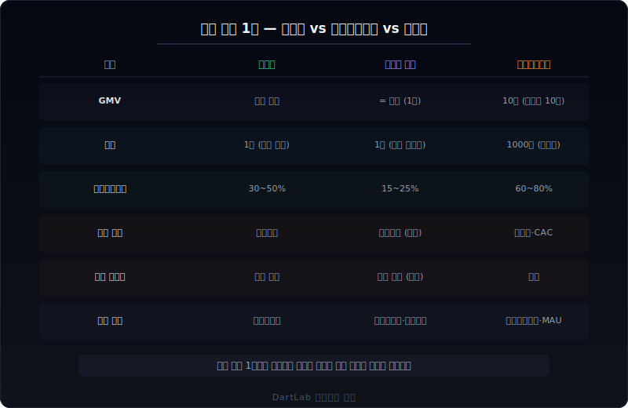
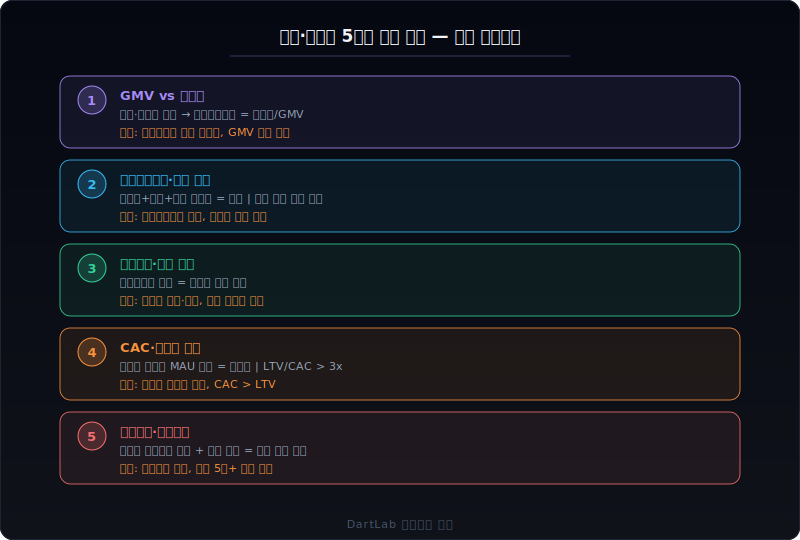
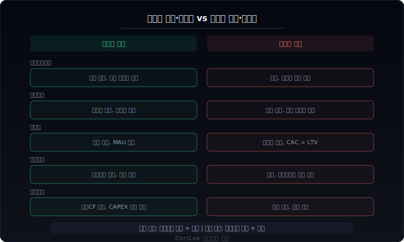
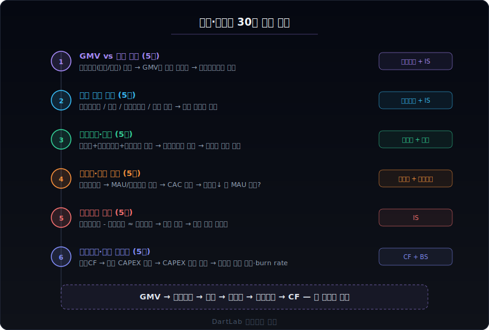

# 유통·플랫폼 사업보고서는 무엇이 다른가

유통과 플랫폼 사업보고서를 제조업처럼 읽으면 매출부터 혼란이 시작된다. 쿠팡의 매출은 30조 원이 넘지만 계속 적자였고, 네이버 쇼핑의 거래액은 수십조인데 매출은 수조다. 오프라인 백화점은 매출이 줄어도 이익이 늘고, 온라인 플랫폼은 매출이 늘어도 적자가 깊어진다. **같은 '유통'이라도 비즈니스 모델이 완전히 다르기 때문에** 읽는 프레임이 달라야 한다.

핵심은 한 문장으로 줄일 수 있다. 유통·플랫폼에서는 `총거래액(GMV) vs 순매출의 차이 → 수수료율(테이크레이트) → 이행비용(물류·배송) → 고객획득비용(CAC)과 마케팅 → 단위경제(unit economics) 수렴 여부`라는 **수익 구조 루프**를 먼저 읽어야 한다. 매출 절대값보다 거래 1건당 남는 돈이 핵심이고, 그 구조가 규모가 커지면서 개선되는지 악화되는지가 판단의 기준이다.

이 글은 유통·플랫폼 사업보고서를 `GMV와 매출 구분 → 테이크레이트와 수익 구조 → 이행비용과 물류 → 고객획득비용과 마케팅 → 단위경제와 손익분기` 순서로 읽는 방법을 정리한다. 오프라인 유통(백화점·마트·편의점), 온라인 커머스(직매입·마켓플레이스), 플랫폼(중개·구독·광고)이라는 세 유형의 차이까지 포함한다.

---

## 같은 매출인데 유통·플랫폼에서 해석이 완전히 달라지는 이유

제조업의 매출은 명확하다. 물건을 만들어서 팔면 그것이 매출이다. 유통·플랫폼에서는 **매출의 정의 자체가 비즈니스 모델마다 다르다.**

**직매입 모델과 마켓플레이스 모델의 매출이 다르다.** 쿠팡이 상품을 직접 사서 소비자에게 팔면 판매가 전체가 매출이다(직매입). 하지만 네이버 쇼핑에서 판매자가 물건을 팔고 네이버가 수수료만 받으면, 수수료만 매출이다(마켓플레이스). 총거래액(GMV)이 같은 10조 원이라도, 직매입은 매출 10조에 마진 5%면 이익 5000억이고, 마켓플레이스는 매출 5000억(수수료 5%)에 이익 2000억일 수 있다. 매출 규모만 보면 직매입이 20배 커 보이지만, 실제 사업의 질은 전혀 다를 수 있다.

**비용의 핵심이 다르다.** 제조업은 원재료비가 비용의 핵심이다. 유통은 **이행비용(fulfillment cost)**이 핵심이다. 물류센터 운영, 재고 보관, 피킹·패킹, 배송, 반품 처리. 쿠팡이 로켓배송을 위해 물류센터를 짓고 배송 인력을 고용하는 비용이 매출의 20~25%를 차지한다. 이 비용이 규모의 경제로 줄어드는지, 아니면 매출과 비례해서 계속 커지는지가 수익성의 핵심이다.

**마케팅의 의미가 다르다.** 제조업은 브랜드 인지도를 위해 광고한다. 유통·플랫폼은 **고객을 획득하기 위해** 마케팅한다. 신규 가입 쿠폰, 첫 구매 할인, 멤버십 무료 체험. 고객 한 명을 데려오는 데 드는 비용(CAC)과 그 고객이 평생 쓸 금액(LTV)의 비율이 사업의 지속 가능성을 결정한다. CAC가 LTV를 초과하면 고객을 늘릴수록 손해다.

**적자의 의미가 다르다.** 제조업에서 적자는 보통 나쁜 신호다. 유통·플랫폼에서 적자는 **의도된 투자일 수도 있고 구조적 문제일 수도 있다**. 초기에 물류 인프라를 깔고 고객을 모으는 단계에서는 적자가 불가피하다. 하지만 그 적자가 규모가 커지면서 줄어드는지(수렴), 아니면 매출과 함께 커지는지(발산)가 결정적 차이다. 쿠팡은 10년간 적자였지만 결국 흑자 전환했고, 많은 이커머스는 적자가 수렴하지 못하고 사라졌다.

**재고의 의미가 다르다.** 제조업 재고는 자사 제품이다. 유통 재고는 남의 물건이다. 직매입 유통사는 재고를 떠안고, 마켓플레이스는 재고가 없다. 직매입 모델에서 재고회전율은 현금 효율의 핵심이고, 마켓플레이스 모델에서는 거래 수수료 구조가 핵심이다.

---

## 유통·플랫폼에서 먼저 봐야 할 5가지 숫자

유통·플랫폼 사업보고서를 처음 펼쳤을 때, 아래 5가지를 이 순서대로 확인하면 비즈니스의 실체가 빠르게 잡힌다.

### 1. 총거래액(GMV) vs 순매출

유통·플랫폼 분석의 출발점이다.

- **총거래액(GMV)**: 플랫폼 위에서 발생한 거래의 총 금액. 배달의민족에서 오늘 5만 원짜리 치킨이 100건 팔리면 GMV는 500만 원이다.
- **순매출(Revenue)**: 회사가 실제로 인식하는 매출. 직매입이면 GMV ≈ 매출이고, 마켓플레이스면 GMV × 수수료율 = 매출이다.
- **GMV 대비 매출 비율**: 이 비율이 사실상 **테이크레이트(take rate)**다. 높을수록 거래당 회사 몫이 크다.
- **GMV 성장률 vs 매출 성장률**: GMV는 빠르게 느는데 매출 성장이 더디면 수수료율이 낮아지고 있거나 직매입 비중이 줄고 있다는 뜻이다.

한국 K-IFRS에서 마켓플레이스 매출은 '순액법'으로 인식하는 것이 원칙이지만, 회사마다 총액법·순액법 적용이 다를 수 있다. 회계 정책 주석에서 매출 인식 기준을 반드시 확인해야 한다. 총액법이면 매출이 부풀려 보인다.

### 2. 테이크레이트와 수익 구조

유통·플랫폼이 거래에서 실제로 가져가는 몫이다.

- **테이크레이트(take rate)**: `순매출 / GMV`. 배달 플랫폼은 15~25%, 오픈마켓은 8~15%, 백화점 특약매입은 25~35%.
- **수수료 구성**: 판매 수수료, 광고 수수료, 이행 수수료(FBA 같은 물류 대행), 결제 수수료. 어떤 수수료가 핵심인지에 따라 사업 모델이 다르다.
- **광고 매출 비중**: 네이버, 쿠팡, 아마존 모두 광고가 핵심 수익원으로 성장 중이다. 광고는 한계비용이 거의 없어서 마진이 극히 높다. 광고 매출 비중이 올라가면 전체 마진이 구조적으로 개선된다.
- **구독(멤버십) 매출**: 쿠팡 와우, 아마존 프라임, 네이버 플러스 등. 선불 구독료는 현금흐름에 유리하고 고객 잠금(lock-in) 효과가 있다.

테이크레이트가 올라가면서 GMV도 유지·성장하면 이상적이다. 반대로 테이크레이트가 내려가면서 GMV만 커지면 수수료 경쟁으로 수익성이 악화되는 신호다.

### 3. 이행비용과 물류 효율

유통·플랫폼의 가장 큰 비용 덩어리다.

- **이행비용(fulfillment cost)**: 물류센터 운영, 재고 관리, 피킹·패킹, 배송, 반품 처리. 직매입 이커머스에서 매출의 15~25%를 차지한다.
- **이행비용률 추이**: `이행비용 / 순매출`. 이 비율이 매출 성장과 함께 줄어들면 규모의 경제가 작동하고 있다. 줄지 않으면 물류가 구조적 비용이다.
- **배송 보조금**: 무료배송, 새벽배송, 당일배송. 배송 보조금이 매출의 몇 %인지. 이 비용을 줄이지 못하면 영업이익률이 구조적으로 낮다.
- **물류 자산 규모**: 물류센터를 자체 보유(CAPEX 모델)하는지, 외주(OPEX 모델)하는지. 자체 보유면 감가상각이 크고, 외주면 유연하지만 단가가 높다.
- **재고회전일수**: 직매입 모델에서 핵심. 회전이 빠르면 현금 효율이 좋고, 느리면 재고 손실 리스크가 크다.

쿠팡이 2023년 흑자 전환한 핵심 요인 중 하나가 이행비용률 개선이었다. 물류 밀도가 높아지면서 배송 건당 비용이 줄었다.

### 4. 고객획득비용(CAC)과 마케팅

플랫폼의 성장 비용이다.

- **고객획득비용(CAC)**: `마케팅비 / 신규 활성 고객 수`. 고객 한 명을 데려오는 데 드는 비용.
- **LTV/CAC 비율**: 고객 생애가치(LTV) 대비 획득비용. 3배 이상이면 건강, 1배 미만이면 고객을 늘릴수록 손해.
- **마케팅비율**: `마케팅비 / 순매출`. 초기 플랫폼은 30~50%도 가능하지만, 성숙기에는 10% 이하로 줄어야 한다.
- **활성 사용자(MAU/WAU) 추이**: 마케팅을 줄여도 사용자가 유지되는지. 마케팅을 줄이자마자 사용자가 빠지면 자연 수요가 약하다는 뜻이다.
- **마케팅 효율 추이**: 마케팅비를 줄이면서도 GMV가 유지·성장하면 브랜드 인지도와 습관이 형성된 것이다.

유통·플랫폼 초기에는 마케팅으로 고객을 확보하고, 성숙기에는 **마케팅 없이도 돌아가는 구조**를 만드는 것이 핵심이다. 5년째 마케팅 비중이 안 줄면 구조적 문제다.

### 5. 단위경제(Unit Economics)와 손익분기

거래 한 건당 남는 돈의 구조다. 전체 손익보다 중요하다.

- **주문당 공헌이익**: `(주문 금액 × 테이크레이트) - 이행비용 - 결제수수료`. 이것이 양수여야 거래가 늘수록 이익이 는다.
- **공헌이익률 추이**: 주문당 공헌이익이 개선되고 있는지. 규모가 커지면서 공헌이익이 양수로 전환하면 흑자 전환의 신호다.
- **고정비 커버리지**: 공헌이익이 양수여도 본사 인건비, 기술개발비, 감가상각 등 고정비를 커버할 만큼 거래량이 충분한지.
- **영업레버리지**: 매출이 10% 늘 때 영업이익이 몇 % 느는지. 레버리지가 높으면 손익분기를 넘기면 이익이 급격히 늘어난다.
- **현금흐름 전환**: 영업이익이 흑자여도 CAPEX(물류센터 투자)가 크면 잉여현금흐름은 적자일 수 있다. 물류 투자가 언제 끝나는지.

단위경제가 양수인 상태에서 성장하면 시간이 해결해준다. 단위경제가 음수인 상태에서 성장하면 규모가 커질수록 적자가 깊어진다. 이 차이가 '좋은 적자'와 '나쁜 적자'를 가른다.

---

## 건강한 유통·플랫폼 vs 위험한 유통·플랫폼

### 건강한 구조

- GMV가 성장하면서 **테이크레이트도 유지 또는 상승**한다. 광고 매출이 새로운 수익원으로 자리 잡고 있다.
- 이행비용률이 **매출 성장과 함께 줄어들고 있다**. 물류 밀도 개선, 규모의 경제가 작동한다.
- 마케팅비율이 **매년 줄어들면서도** 활성 사용자가 유지·성장한다. 습관화·브랜드 충성도가 형성되었다.
- 주문당 공헌이익이 **양수이고 개선 추세**다. 거래가 늘수록 이익이 는다.
- 영업현금흐름이 **흑자이거나 흑자 전환 근접**이다. CAPEX 투자 사이클이 피크를 지났다.

### 위험한 구조

- GMV는 느는데 **테이크레이트가 하락**한다. 수수료 인하 경쟁에 밀리고 있다.
- 이행비용률이 **줄지 않거나 오히려 올라간다**. 배송 보조금, 반품 비용이 통제되지 않는다.
- 마케팅을 줄이면 **GMV가 바로 꺾인다**. 자연 수요 없이 마케팅 의존. CAC가 LTV를 초과한다.
- 주문당 공헌이익이 **음수이고 개선되지 않는다**. 거래가 늘수록 적자가 깊어진다.
- 재고회전이 **느려지고 있다**. 재고 평가손실이 늘어난다. 현금이 재고에 묶여 있다.
- 적자가 **5년 이상 지속**되면서 수렴 신호가 없다. 유상증자나 전환사채로 자금을 조달한다.

---

## 유형별로 다르게 읽어야 하는 포인트

### 오프라인 유통 (백화점·마트·편의점)

전통 유통은 **임차·임대 구조**와 **매장 효율**이 핵심이다.

- **백화점**: 특약매입(수수료 25~35%) 모델. 재고 리스크가 거의 없다. 핵심은 평당 매출(매장 효율)과 임대 수익.
- **대형마트**: 직매입 모델. 재고 리스크를 떠안는 대신 마진이 높다. 핵심은 재고회전율과 PB(자체 브랜드) 비중.
- **편의점**: 프랜차이즈 모델. 가맹점 수와 점당 매출이 핵심. 로열티 수입이 안정적 수익.
- **공통 확인 포인트**: 점포 수 증감, 기존점 성장률(SSS), 리스부채 규모, 온라인 전환 속도.

오프라인 유통은 [리스부채·차입 만기 집중은 어디서 위험해지나](/blog/lease-liabilities-and-debt-maturity)의 프레임이 직접 적용된다. 매장 임차가 핵심 고정비이기 때문이다.

### 온라인 커머스 (직매입·마켓플레이스)

온라인 커머스는 **물류와 단위경제**가 핵심이다.

- **직매입 (쿠팡, SSG)**: 재고를 떠안고 물류를 직접 운영. 매출이 크지만 마진이 낮다. 이행비용률과 재고회전이 핵심.
- **마켓플레이스 (네이버, 11번가)**: 재고 없이 수수료 수입. 매출은 작지만 마진이 높다. 테이크레이트와 판매자 수가 핵심.
- **하이브리드 (쿠팡)**: 직매입 + 마켓플레이스 + 광고 + 구독을 섞는 모델. 매출 인식 방식이 복합적이라 세그먼트 분석 필수.
- **공통 확인 포인트**: GMV 성장률, 테이크레이트 추이, 이행비용률, 활성 구매자 수, 주문 빈도.

### 플랫폼 (중개·구독·광고)

플랫폼은 **네트워크 효과**와 **한계비용 제로**가 핵심이다.

- **중개 플랫폼 (배달의민족, 여기어때)**: 양면 시장. 공급자(가맹점)와 수요자(소비자) 모두 확보해야 한다. 테이크레이트와 주문 빈도가 핵심.
- **구독 플랫폼 (쿠팡 와우, 밀리의서재)**: 월정액 수입이 안정적. 구독자 수, 이탈률(churn rate), 구독자당 매출(ARPU)이 핵심.
- **광고 플랫폼 (네이버, 카카오)**: 트래픽 기반 광고 매출. MAU, 클릭당 단가(CPC), 광고주 수가 핵심. 한계비용이 거의 없어서 마진이 극히 높다.
- **공통 확인 포인트**: MAU/DAU, ARPU, 이탈률, 네트워크 효과 지표(공급자·수요자 증감 상관관계).

---

## 유통·플랫폼 사업보고서 30분 읽기 루프

**1단계 — GMV vs 매출 구분 (5분)**
매출 인식 기준(총액법/순액법)을 회계 정책에서 확인한다. GMV가 공시되어 있으면 GMV와 매출을 나란히 놓고 테이크레이트를 계산한다. 세그먼트별 매출 구성도 확인한다.

**2단계 — 수익 구조 분해 (5분)**
매출을 판매 수수료, 광고 수수료, 이행 수수료, 구독료, 기타로 분해한다. 어떤 수수료가 핵심이고, 어떤 것이 성장하고 있는지 확인한다.

**3단계 — 이행비용과 물류 효율 (5분)**
판관비 중 물류 관련 비용(배송비, 포장비, 물류센터 임차료, 물류 인건비)을 분리한다. 이행비용률(이행비용/매출)이 전기 대비 개선되는지 확인한다.

**4단계 — 마케팅과 고객 지표 (5분)**
마케팅비를 찾고 마케팅비율(마케팅비/매출)을 계산한다. 활성 사용자·구매자 수가 공시되어 있으면 CAC를 추정한다. 마케팅비 변동과 사용자 추이를 대조한다.

**5단계 — 단위경제 추정 (5분)**
주문당 공헌이익을 대략 추정한다. 매출총이익에서 이행비용을 빼면 대략적인 공헌이익이다. 이 비율이 전기 대비 개선되는지 확인한다.

**6단계 — 현금흐름과 투자 사이클 (5분)**
영업CF와 투자CF를 확인한다. 물류 CAPEX가 매출의 몇 %인지, CAPEX 피크가 지났는지 확인한다. 적자 기업이면 현금 소진률(burn rate)과 잔여 현금을 확인한다.

---

## 비교 체크리스트

| 확인 항목 | 건강한 신호 | 위험한 신호 |
|---|---|---|
| GMV vs 매출 | 테이크레이트 유지·상승 | 테이크레이트 하락, 수수료 경쟁 |
| 수익 다변화 | 광고·구독이 새 수익원 | 판매수수료만 의존 |
| 이행비용률 | 개선 추세 (규모의 경제) | 정체·악화, 배송 보조금 과다 |
| 마케팅 효율 | 비중 감소, MAU 유지 | 비중 정체, 마케팅 끊으면 이탈 |
| 단위경제 | 공헌이익 양수, 개선 추세 | 음수, 거래 늘수록 적자 확대 |
| 재고(직매입) | 회전 빠름, 손실 미미 | 회전 둔화, 평가손실 증가 |
| 현금흐름 | 영업CF 흑자 또는 근접 | 적자 지속, 유상증자 반복 |

---

## FAQ

**매출이 큰 회사가 무조건 좋은 것 아닌가?**

유통에서는 아니다. 직매입 모델은 상품 판매가 전체가 매출이라 매출이 크지만 마진이 2~5%에 불과하다. 마켓플레이스 모델은 수수료만 매출이라 매출이 작지만 마진이 30~50%다. 매출보다 **테이크레이트와 공헌이익률**이 사업의 질을 더 정확하게 보여준다.

**계속 적자인 플랫폼에 투자해도 괜찮은가?**

단위경제가 핵심이다. 주문당 공헌이익이 양수이고 개선 추세면, 규모가 커지면서 고정비를 커버하는 시점이 온다. 이것이 '좋은 적자'다. 반대로 주문당 공헌이익이 음수면 규모가 커질수록 적자가 깊어진다. 이것이 '나쁜 적자'다. [영업현금흐름이 순이익을 부정할 때](/blog/operating-cash-flow-vs-net-income)의 프레임으로 현금 소진 속도도 같이 봐야 한다.

**총액법과 순액법은 왜 중요한가?**

같은 거래인데 회계 처리 방식에 따라 매출이 10배 차이 날 수 있다. 1만 원짜리 상품을 중개하고 수수료 1000원을 받는 경우, 총액법이면 매출 1만 원(원가 9000원), 순액법이면 매출 1000원이다. 매출총이익은 같은 1000원인데 매출은 10배 차이다. 매출 성장률, 매출총이익률, 영업이익률이 전부 달라진다. 그래서 회계 정책을 먼저 확인하고, 가능하면 GMV 기준으로 비교해야 한다.

**오프라인 유통은 이제 끝난 것 아닌가?**

그렇지 않다. 백화점은 프리미엄 체험 공간으로 전환하면서 오히려 이익률이 올라갔다. 편의점은 1인 가구·고령화에 수혜를 받으며 점포당 매출이 꾸준히 늘고 있다. 핵심은 온라인과 **어떻게 공존하는가**다. 온라인 주문-오프라인 픽업(BOPIS), O2O 시너지, PB 상품 확대 같은 전략이 작동하는지를 본다.

**재고가 없는 마켓플레이스가 무조건 유리한가?**

구조적으로는 그렇다. 재고 리스크가 없고, 자본 투자가 적으며, 마진이 높다. 하지만 마켓플레이스는 **양면 시장의 닭과 달걀 문제**가 있다. 판매자가 없으면 구매자가 안 오고, 구매자가 없으면 판매자가 안 온다. 초기에 이 문제를 깨는 데 엄청난 마케팅비가 든다. 또한 물류 품질 통제가 어렵다는 약점이 있다. 쿠팡이 직매입으로 시작한 이유가 물류 품질 통제 때문이다.

---

## 기존 글로 더 깊이 들어가기

**원가와 비용 구조**
- [매출원가·판관비 비중이 달라지면 무슨 뜻인가](/blog/sga-growth-vs-sales) — 이행비용과 마케팅비가 판관비에서 차지하는 비중
- [영업현금흐름이 순이익을 부정할 때](/blog/operating-cash-flow-vs-net-income) — 적자 기업의 현금 소진 속도 판단

**재고와 운전자본**
- [재고자산은 언제 사라지거나 부풀어 오르나](/blog/inventory-write-downs-and-low-price-bidding) — 직매입 모델의 재고 리스크

**투자와 자본 조달**
- [건설중인자산은 왜 중요한가](/blog/construction-in-progress) — 물류센터 건설 투자의 의미
- [CAPEX 뒤 감가상각은 언제 보이나](/blog/depreciation-after-capex) — 물류 인프라 투자의 비용화

**리스와 고정비**
- [리스부채·차입 만기 집중은 어디서 위험해지나](/blog/lease-liabilities-and-debt-maturity) — 오프라인 매장·물류센터 임차 부담

---

## 출처

- K-IFRS 제1115호 '고객과의 계약에서 생기는 수익' — 매출 인식(총액법/순액법) 기준
- 금융감독원 전자공시시스템(DART) — 유통·플랫폼 사업보고서 원문
- 공정거래위원회 대규모기업집단 공시 — 내부거래 비중, 수수료 현황

---

## 한 줄 정리

유통·플랫폼 사업보고서는 매출 절대값이 아니라 **GMV 대비 테이크레이트 → 이행비용률 → 마케팅 효율 → 주문당 공헌이익**의 단위경제 루프를 먼저 읽어야 한다. 단위경제가 양수이면 성장이 답이고, 음수이면 성장이 독이다.
