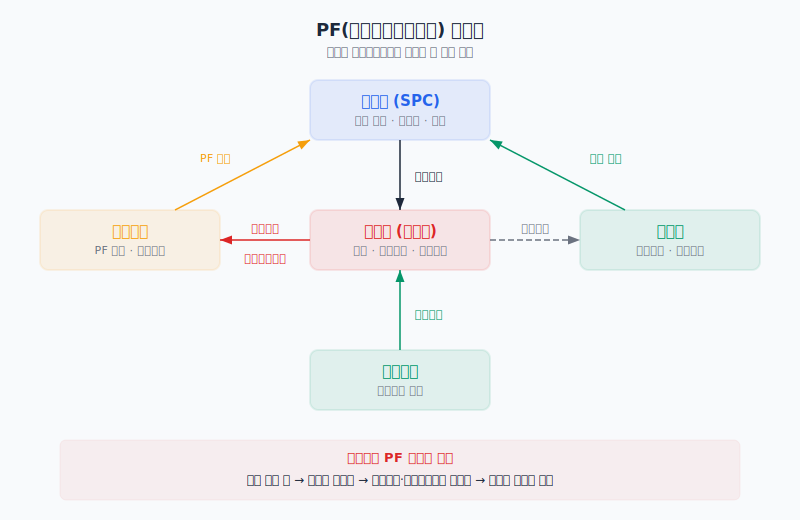
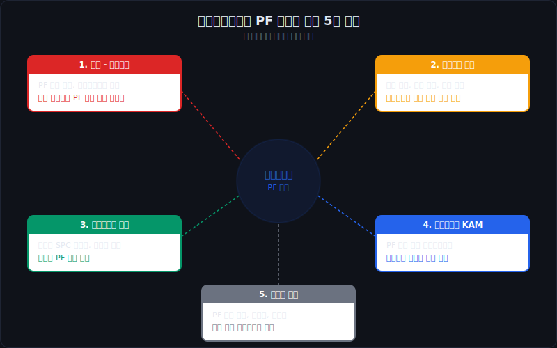
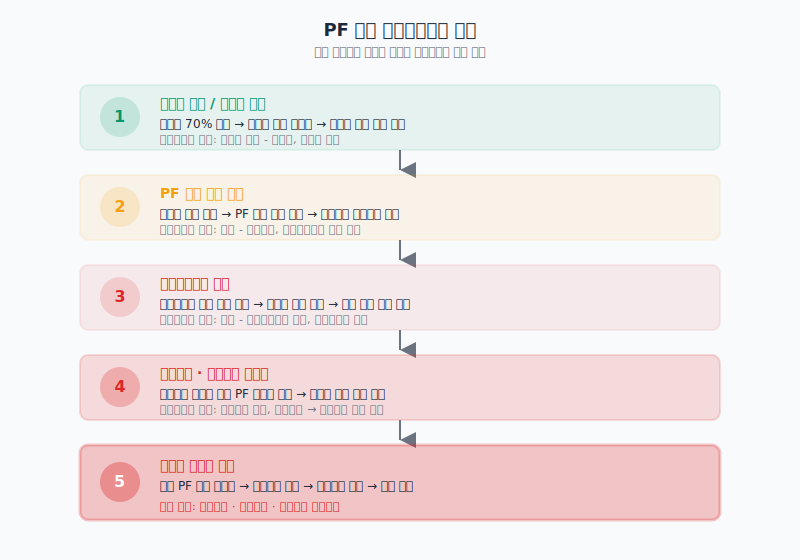
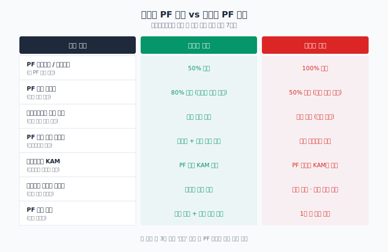
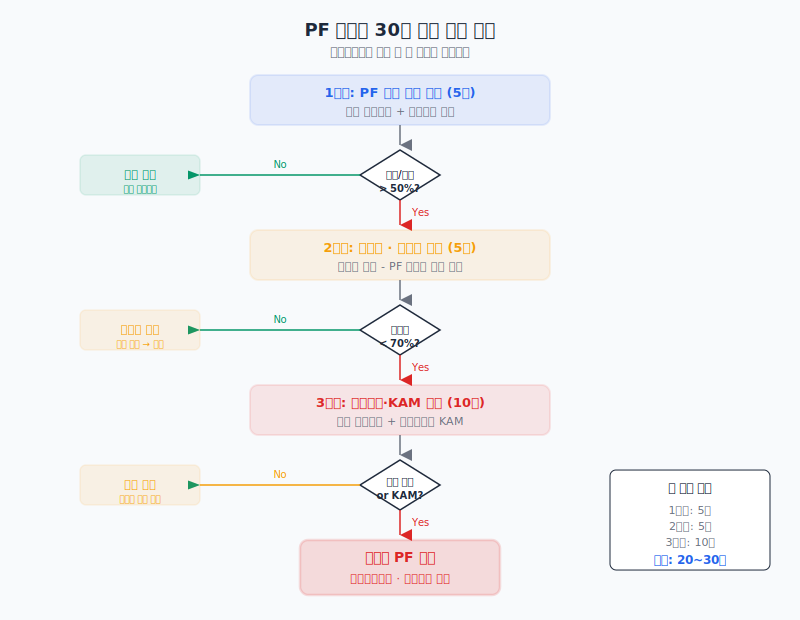

# 건설사 PF 리스크는 사업보고서 어디서 읽어야 하나

건설사 사업보고서에서 PF(프로젝트파이낸싱) 리스크를 읽으려면 재무제표 본문이 아니라 **주석의 우발부채와 지급보증 현황**부터 펼쳐야 한다. PF 보증은 재무상태표에 부채로 잡히지 않는다. 분양이 잘 되면 그대로 사라지고, 분양이 안 되면 어느 날 갑자기 수천억 원의 확정 부채로 올라온다. 이 비대칭이 PF 리스크의 본질이다.

핵심은 한 문장으로 줄일 수 있다. **PF 보증잔액이 자기자본 대비 얼마인지, 그 보증이 걸린 사업의 분양률이 몇 퍼센트인지** — 이 두 숫자만 먼저 확인하면 건설사의 PF 리스크 수준이 즉시 드러난다. 이 글은 PF 구조의 기본부터 사업보고서에서 PF 정보를 찾는 위치, 위험이 단계적으로 악화되는 경로, 그리고 30분 안에 PF 노출을 점검하는 방법까지 정리한다.

---

## PF 구조의 기본 — 누가 돈을 빌리고 누가 보증을 서는가

PF를 이해하려면 먼저 참여자 구조를 알아야 한다. 부동산 개발 PF에는 최소 4개의 주체가 관여한다.

**시행사(SPC)**는 사업의 주체다. 토지를 확보하고 인허가를 받고 분양을 진행한다. 대부분 프로젝트 단위로 설립된 특수목적법인(SPC)이라 자체 신용은 거의 없다. 그래서 돈을 빌리려면 다른 누군가의 보증이 필요하다.

**금융기관**은 PF 대출을 실행한다. 증권사, 저축은행, 캐피탈, 자산운용사까지 다양하다. 시행사의 신용이 아니라 **건설사의 보증과 사업의 분양 가능성**을 보고 대출한다. 이 구조가 문제의 출발점이다.

**건설사(시공사)**는 건물을 짓는 동시에 PF 대출의 **연대보증**, **자금보충약정**, **책임준공확약**을 제공한다. 분양이 잘 되면 기성금을 받고 끝나지만, 분양이 안 되면 시행사가 못 갚는 돈을 대신 갚아야 한다.

**신탁사**는 토지를 신탁받아 관리하고 분양대금을 수취·관리한다. 자금 흐름의 게이트키퍼 역할이다.

이 구조에서 건설사가 지는 의무는 크게 세 가지다.

- **연대보증**: 시행사가 PF 원리금을 못 갚으면 건설사가 대신 갚는다. 가장 직접적인 리스크.
- **자금보충약정**: 시행사의 자금이 부족할 때 건설사가 부족분을 메운다. 이자 연체 방지용으로 먼저 발동된다.
- **책임준공확약**: 건설사가 정해진 기한 안에 건물을 완공하겠다는 약속. 미이행 시 금융기관이 기한이익상실을 선언할 수 있다.

이 세 가지 의무가 모두 사업보고서 주석에 기재된다. 문제는 이것들이 **우발부채**로 분류되어 재무상태표 숫자에는 안 잡힌다는 것이다. 부채비율을 아무리 열심히 봐도 PF 리스크는 보이지 않는다.

---

## 사업보고서에서 PF 정보를 찾는 5개 위치

PF 관련 정보는 사업보고서 한 곳에 모여 있지 않다. 최소 5곳을 교차 확인해야 전체 그림이 잡힌다.

### 1. 주석 — 우발부채 및 약정사항

가장 핵심적인 위치다. K-IFRS 제1037호에 따라 **현재 의무이지만 유출 가능성이 높지 않은 항목**이 우발부채로 공시된다. PF 연대보증과 자금보충약정이 여기에 잡힌다.

확인할 것:
- PF 보증 총액과 개별 프로젝트별 보증 금액
- 자금보충약정 잔액과 이행 이력
- 전기 대비 증감 — 보증이 늘고 있는지, 이행된 약정이 있는지
- "기한이익상실" 또는 "채무불이행" 문구 — 이 단어가 나오면 이미 위기 단계

[지급보증·담보·약정 공시는 어디서 먼저 읽어야 하나](/blog/guarantees-collateral-and-commitments)에서 우발부채와 약정의 기본 읽기 프레임을 상세하게 다뤘다.

### 2. 지급보증 현황

사업보고서 본문의 '기타 재무에 관한 사항' 또는 주석에 **타인을 위해 제공한 지급보증** 테이블이 있다. PF 보증은 여기서 프로젝트별로 쪼개서 볼 수 있다.

확인할 것:
- 보증 대상(시행사명 또는 SPC명)과 보증 금액
- 보증 기간 — 만기가 1년 이내에 집중되면 차환 리스크
- 보증 비율 — 100% 연대보증인지, 일부 보증인지

### 3. 특수관계자 거래

건설사가 자회사 또는 관계사로 설립한 SPC와의 거래가 여기에 나온다. 연결재무제표에서는 상계되지만, **별도재무제표 주석**에서는 대여금, 미수금, 보증 형태로 드러난다. 연결 범위에 포함되지 않는 SPC에 대한 PF 노출은 이 항목에서만 잡힌다.

확인할 것:
- 관계사 SPC에 대한 대여금과 미수금
- SPC에 제공한 보증이 우발부채 총액에 포함되어 있는지 교차 확인

### 4. 감사보고서 핵심감사사항(KAM)

감사인이 **PF 보증의 손실 추정**이나 **우발부채의 완전성**을 핵심감사사항으로 선정했다면, 그 자체로 감사인도 리스크가 높다고 본다는 신호다. KAM에 PF가 등장하면 주석의 우발부채 숫자를 더 꼼꼼히 봐야 한다.

확인할 것:
- KAM 제목에 "프로젝트파이낸싱", "PF 보증", "우발부채" 포함 여부
- 감사인이 어떤 절차로 검증했는지 — 개별 사업 실사를 했는지, 경영진 추정에 의존했는지

### 5. 사업의 내용

PF 사업 포트폴리오의 전체 그림은 사업의 내용에서 잡는다. 진행 중인 개발사업 목록, 분양률, 공정률, 사업 규모가 기재된다. 다만 기재 수준은 회사마다 편차가 크다.

확인할 것:
- PF 사업 목록과 각 사업의 분양률
- 미착공 또는 공사 중단 사업이 있는지
- 지역 분포 — 지방 비수도권 집중 여부

---

## PF 위험이 단계적으로 악화되는 경로

PF 리스크는 하루아침에 터지지 않는다. **미분양에서 시작해서 이자 연체, 기한이익상실, 보증 현실화까지 단계적으로 악화**된다. 각 단계가 사업보고서 어디서 포착되는지 알면 위기를 초기에 감지할 수 있다.

### 1단계: 미분양 증가 — 자금 유입 둔화

분양률이 70%를 넘지 못하면 중도금 대출이 실행되지 않는다. 수분양자의 자금이 안 들어오면 시행사의 현금 유입이 막힌다. 이 단계에서는 사업보고서의 '사업의 내용'에서 분양률 추이를 보면 된다. 분양률이 전년 대비 정체하거나 하락하고 있으면 첫 번째 경고다.

### 2단계: PF 이자 연체 — 자금보충 발동

시행사의 자금이 부족해지면 PF 대출 이자를 못 낸다. 이때 건설사의 자금보충약정이 발동된다. 건설사가 시행사 대신 이자를 메우는 것이다. 주석의 약정사항에서 **"자금보충약정 이행"** 문구를 찾으면 된다. 한 번 이행되면 반복될 가능성이 높다.

### 3단계: 기한이익상실 — 즉시 상환 요구

이자 연체가 일정 기간 지속되거나 약정 위반 사유가 발생하면 금융기관이 **기한이익상실(acceleration)**을 선언한다. 이는 만기와 무관하게 PF 대출 전액을 즉시 상환하라는 요구다. [차입 약정 위반과 기한이익상실 위험은 어디서 먼저 드러나나](/blog/borrowing-covenant-breach-and-acceleration)에서 기한이익상실의 일반적인 패턴을 정리했다.

사업보고서에서 "기한이익상실"이라는 단어가 주석에 등장하면 이미 3단계 이상에 진입한 것이다. 이 단계에서 건설사가 할 수 있는 것은 만기 연장 협상이나 리파이낸싱뿐인데, 부동산 경기가 전체적으로 나쁘면 이마저도 어렵다.

### 4단계: 보증 채무 현실화 — 대규모 현금 유출

시행사가 상환 불능이 되면 연대보증이 현실화된다. 건설사가 PF 원리금을 대신 갚아야 한다. **우발부채가 확정 부채로 전환**되는 순간이다. 주석에서 "보증채무 이행", "대위변제", "구상권 행사" 같은 문구가 나타난다. 지급보증 현황표에서 전기 대비 보증 잔액이 줄었는데 부채가 늘었으면, 보증이 현실화된 것이다.

### 5단계: 건설사 유동성 위기

한두 건의 PF라면 대형 건설사는 감당할 수 있다. 문제는 부동산 경기가 전체적으로 나빠지면 **여러 PF가 동시에 현실화**된다는 것이다. 자기자본이 잠식되고, 신용등급이 강등되고, 회사채 차환이 막히면서 건설사 자체의 유동성 위기로 번진다. [계속기업 관련 불확실성 문구는 어디서 강해지나](/blog/going-concern-uncertainty)에서 이 최종 단계의 징후를 읽는 방법을 다뤘다.

---

## 건강한 PF 노출 vs 위험한 PF 노출

같은 PF 보증이라도 구조에 따라 리스크 수준은 완전히 다르다. 아래 기준으로 나눠 보면 어떤 건설사의 PF가 관리 가능한 수준이고 어떤 건설사가 위험한지 빠르게 판단할 수 있다.

### 건강한 구조의 특징

- **PF 보증잔액이 자기자본 대비 50% 미만**이다. 전액 현실화되더라도 자본잠식까지 가지 않는 규모.
- 보증이 걸린 사업의 **분양률이 80% 이상**이다. 중도금 대출이 정상 실행되고 있어 시행사 자금 흐름이 원활하다.
- **자금보충약정 이행 이력이 없다.** 보증은 있지만 실제로 돈이 나간 적은 없는 상태.
- PF 사업이 **수도권과 주요 광역시에 분산**되어 있다. 지방 특정 지역에 집중되지 않았다.
- 감사보고서 KAM에 PF 관련 항목이 **없다.** 감사인도 중요한 리스크로 보지 않는다는 뜻.
- **책임준공 대상 사업의 공정률이 정상 진행 중**이다. 공사 중단이나 지연이 없다.
- PF 만기가 **분산**되어 있어 특정 시기에 차환이 몰리지 않는다.

### 위험한 구조의 특징

- **PF 보증잔액이 자기자본 대비 100%를 넘는다.** 일부만 현실화되어도 자본이 크게 훼손된다.
- 분양률이 **50% 미만인 사업이 다수**다. 중도금 유입이 막혀 시행사가 이자도 못 내는 상태.
- 자금보충약정을 **이미 여러 차례 이행**했다. 건설사의 현금이 PF 이자 메우기에 쓰이고 있다.
- PF 사업이 **지방 비수도권에 집중**되어 있다. 인구 감소 지역의 미분양은 해소가 거의 불가능하다.
- 감사보고서 KAM에 **PF 보증이 핵심감사사항으로 등장**한다. 감사인도 손실 가능성이 높다고 판단한 것.
- 책임준공 대상 사업 중 **공사가 중단되거나 지연된 건이 있다.** 미이행 시 기한이익상실 사유가 된다.
- **1년 이내 만기 도래 PF가 집중**되어 있다. 차환 시장이 얼어붙으면 동시 위기.

---

## 한국 부동산 PF 위기의 맥락 (2022~2026)

사업보고서를 읽을 때 시장 맥락을 아는 것이 중요하다. 2022년 레고랜드 ABCP 사태로 촉발된 PF 위기는 2026년 현재까지 이어지고 있다. 이 기간에 건설사 사업보고서를 읽으면서 주의해야 할 맥락을 정리한다.

**2022년 하반기**: 레고랜드 ABCP 디폴트로 단기자금시장이 경색됐다. PF ABCP, PF 대출의 차환이 막히면서 유동성 위기가 확산됐다.

**2023년**: 금리 인상 지속 + 지방 미분양 급증. 중소 시행사부터 디폴트가 시작됐고, 연대보증을 선 중소 건설사들의 보증 현실화가 본격화됐다. 태영건설 워크아웃이 대표적 사례다.

**2024~2025년**: PF 구조조정이 본격 진행됐다. 정상, 관심, 주의, 부실 4단계 분류가 이뤄지면서 금융기관이 PF 사업성 재평가에 나섰다. 분양률이 낮은 사업은 사업 포기 또는 경·공매로 넘어갔다.

**2026년 현재**: 구조조정이 상당 부분 진행됐지만 지방 미분양 적체는 여전하다. 대형 건설사는 PF 노출을 줄이는 중이지만, 중견 건설사 중에는 PF 보증잔액이 자기자본을 넘는 곳이 남아 있다.

이 맥락에서 건설사 사업보고서를 읽을 때 특히 확인해야 할 것:
- 전기 대비 PF 보증잔액이 줄고 있는지 (리스크 축소) 아니면 유지·증가하고 있는지
- 자금보충약정 이행 금액이 전기에 처음 등장했거나 늘었는지
- 감사보고서에 계속기업 관련 강조사항이 새로 추가됐는지
- [공사손실충당부채는 언제 뒤늦게 크게 튀어나오나](/blog/construction-loss-provision-signals)에서 다룬 충당부채 급증 패턴과 PF 구조조정이 동시에 나타나는지

---

## PF 리스크 30분 점검법

건설사 사업보고서를 펼쳤을 때 PF 리스크를 30분 안에 점검하는 순서다. 핵심은 **큰 숫자부터 확인하고, 위험 신호가 있을 때만 깊이 들어가는 것**이다.

### 1단계: PF 보증 총액 확인 (5분)

주석에서 **우발부채**와 **지급보증 현황**을 찾는다. PF 연대보증, 자금보충약정, 책임준공확약의 총 잔액을 합산한다. 이 총액을 자기자본(별도재무제표 기준)으로 나눈다.

- **50% 미만**: 기본적인 모니터링 수준. 다음 분기에 다시 확인.
- **50~100%**: 주의. 2단계로 진행해서 분양률을 확인해야 한다.
- **100% 초과**: 높은 노출. 반드시 2, 3단계까지 전부 확인해야 한다.

### 2단계: 분양률과 미분양 확인 (5분)

사업의 내용에서 PF 사업 목록을 찾는다. 각 사업의 분양률과 미분양 세대수를 확인한다. 분양률이 70% 미만인 사업이 있으면 해당 사업에 걸린 보증 금액을 따로 체크한다.

- 분양률 70% 미만 사업의 보증 합계가 자기자본의 **30% 이상**이면 실질적 리스크.
- 미착공 사업이 다수면 향후 추가 PF 노출 가능성도 고려한다.

### 3단계: 자금보충 이행과 KAM 확인 (10분)

주석에서 자금보충약정 **이행 이력**을 찾는다. 실제로 돈이 나갔는지가 핵심이다. 동시에 감사보고서의 핵심감사사항(KAM)을 확인한다.

- 자금보충약정 이행 이력 **있음** + KAM에 PF 등장 → **고위험**. 기한이익상실 가능성과 계속기업 불확실성을 추가 점검해야 한다.
- 자금보충약정 이행 이력 **없음** + KAM에 PF 없음 → 잠재 위험이지만 당장 급하지는 않다. 분기별 추적으로 충분.

### 4단계: 교차 확인 (10분, 고위험인 경우만)

3단계에서 고위험으로 판단되면 추가로 확인한다.
- 특수관계자 거래에서 SPC 관련 대여금·미수금이 늘고 있는지
- [자본잠식과 관리종목 신호는 어디서 먼저 보이나](/blog/capital-erosion-and-delisting-signals)의 기준으로 자본잠식 경로에 있는지
- 현금흐름표에서 PF 관련 자금 유출이 투자활동 또는 재무활동에 잡혀 있는지

---

## 주의해야 할 PF 공시의 함정

사업보고서에서 PF 정보를 읽을 때 흔히 빠지는 함정이 있다.

**연결 vs 별도 차이.** 연결재무제표에서는 연결 대상 SPC의 PF 대출이 부채로 잡히고 보증은 상계된다. 하지만 연결 범위에서 빠진 SPC에 대한 보증은 별도재무제표 주석에서만 보인다. **별도재무제표 주석을 반드시 같이 봐야 한다.**

**자금보충과 연대보증의 중복 계산.** 같은 PF 사업에 대해 자금보충약정과 연대보증이 동시에 기재된 경우가 많다. 단순 합산하면 실제 노출보다 과대 추정할 수 있다. 다만 과소 추정보다는 과대 추정이 안전하다.

**책임준공의 재무적 의미.** 책임준공확약은 돈이 아니라 건물 완공의 약속이지만, 미이행 시 금융기관이 기한이익상실을 선언할 수 있는 트리거가 된다. 직접적인 금전 보증이 아니라고 무시하면 안 된다.

**"해당 사항 없음"의 의미.** 일부 건설사는 PF 관련 항목을 매우 간략하게 공시한다. "해당 사항 없음"이 실제로 PF 노출이 없는 것인지, 공시 기준의 차이로 빠진 것인지 확인이 필요하다. 사업의 내용에서 개발사업이 있으면서 우발부채에 PF가 없으면 의심해볼 수 있다.

---

## 비교 체크리스트

| 확인 항목 | 건강한 신호 | 위험한 신호 |
|---|---|---|
| PF 보증잔액 / 자기자본 | &lt; 50% | &gt; 100% |
| 분양률 70% 미만 사업 비중 | 없거나 1건 이내 | 전체의 30% 이상 |
| 자금보충약정 이행 | 이행 이력 없음 | 반복 이행 중 |
| KAM에 PF 언급 | 없음 | 핵심감사사항으로 선정 |
| PF 만기 집중도 | 2년 이상 분산 | 1년 내 50% 이상 만기 |
| 지방 비수도권 비중 | &lt; 30% | &gt; 60% |
| 공사 중단 사업 | 없음 | 1건 이상 존재 |

---

## FAQ

**PF 보증잔액은 재무제표 어디에서 찾나?**

재무상태표에는 나오지 않는다. **주석의 우발부채(또는 약정사항)** 항목을 찾아야 한다. "프로젝트파이낸싱", "PF", "지급보증", "자금보충"으로 검색하면 된다. 사업보고서 본문의 '기타 재무에 관한 사항' 중 지급보증 현황 테이블에서도 확인할 수 있다. [건설업 사업보고서는 어디부터 읽어야 하나](/blog/construction-company-filings)에서 건설업 사업보고서의 전체 읽기 순서를 정리했다.

**PF 보증이 현실화되면 재무제표에 어떻게 반영되나?**

우발부채에서 빠지고, 재무상태표의 **기타부채 또는 차입금**으로 올라간다. 동시에 시행사에 대한 **구상권(미수금)**이 자산으로 잡히지만, 시행사가 부실하면 이 구상권도 대손충당금으로 상각된다. 손익에는 보증 관련 손실이 영업외비용이나 기타비용으로 잡힌다.

**중소 건설사와 대형 건설사의 PF 리스크는 어떻게 다른가?**

대형 건설사는 다수의 PF 사업에 분산되어 있고 자기자본이 두꺼워서 일부 PF가 현실화되어도 흡수할 수 있다. 중소 건설사는 2~3건의 PF만으로도 자기자본 대비 보증잔액이 수백 퍼센트에 달할 수 있어 한두 건만 터져도 존폐 위기에 처한다.

**PF ABCP와 PF 대출의 차이는?**

PF 대출은 금융기관이 시행사에 직접 돈을 빌려주는 것이고, PF ABCP는 PF 대출채권을 기초자산으로 발행하는 단기 기업어음이다. ABCP는 만기가 짧아(보통 3~6개월) 차환 리스크가 크다. 2022년 레고랜드 사태는 PF ABCP 차환 거부에서 시작됐다.

**책임준공 미이행은 어떤 결과를 가져오나?**

책임준공 기한을 넘기면 금융기관이 기한이익상실을 선언할 수 있다. 건설사가 PF 원리금 전액을 즉시 갚아야 하는 상황이 된다. 또한 책임준공 미이행에 따른 지체상금도 추가로 발생할 수 있다. 사업보고서 주석의 소송 또는 우발부채 항목에서 이런 분쟁이 기재되는 경우가 있다.

---

## 기존 글로 더 깊이 들어가기

이 글은 건설사 PF 리스크를 사업보고서에서 읽는 방법을 정리한 실전 가이드다. 각 하위 주제를 더 깊이 파고 싶으면 아래 글로 들어가면 된다.

**PF 리스크의 기반 — 건설업 읽기**
- [건설업 사업보고서는 어디부터 읽어야 하나](/blog/construction-company-filings) — 건설업 재무제표의 기본 읽기 순서

**보증과 약정**
- [지급보증·담보·약정 공시는 어디서 먼저 읽어야 하나](/blog/guarantees-collateral-and-commitments) — 우발부채와 지급보증의 기본 프레임
- [차입 약정 위반과 기한이익상실 위험은 어디서 먼저 드러나나](/blog/borrowing-covenant-breach-and-acceleration) — 약정 위반에서 기한이익상실까지의 경로

**위기 단계의 징후**
- [공사손실충당부채는 언제 뒤늦게 크게 튀어나오나](/blog/construction-loss-provision-signals) — 충당부채가 왜 항상 늦게 잡히는지
- [계속기업 관련 불확실성 문구는 어디서 강해지나](/blog/going-concern-uncertainty) — 최종 위기 단계의 감사보고서 신호
- [자본잠식과 관리종목 신호는 어디서 먼저 보이나](/blog/capital-erosion-and-delisting-signals) — 자본잠식 경로와 관리종목 지정 기준

---

## 출처

- K-IFRS 제1037호 '충당부채, 우발부채 및 우발자산' — 우발부채 공시 기준
- K-IFRS 제1115호 '고객과의 계약에서 생기는 수익' — 건설계약 수익 인식
- 금융감독원 전자공시시스템(DART) — 건설업 사업보고서 원문
- 금융감독원 'PF 사업장 사업성 평가 기준' (2024) — PF 정상/관심/주의/부실 분류
- 한국건설산업연구원 '건설업 PF 리스크 현황' 보고서

---

## 한 줄 정리

건설사 PF 리스크는 재무상태표가 아니라 **주석의 우발부채와 지급보증 현황**에서 읽어야 한다. PF 보증잔액 대비 자기자본, 보증 사업의 분양률 — 이 두 숫자가 건설사의 PF 체력을 말해준다.
