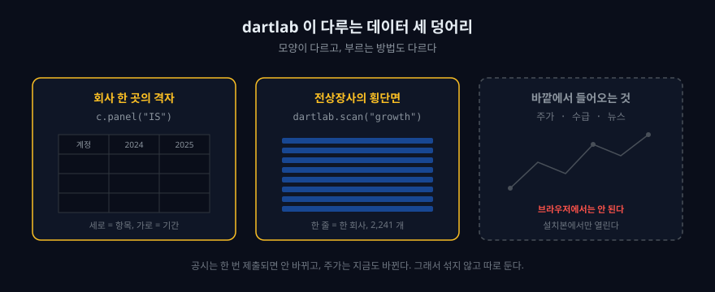

## 공시를 열어 본 적 있다면, 그다음이 늘 문제였다

[전자공시 사이트(DART)](https://dart.fss.or.kr/)에 들어가서 회사 하나를 검색하면 사업보고서가 나온다. PDF를 열면 백 페이지가 넘는다. 재무제표가 어디 있는지 찾아 스크롤을 내리고, 표를 눈으로 읽고, 작년 숫자와 비교하려면 작년 보고서를 다시 열어야 한다. 세 회사를 비교하고 싶으면 창을 세 개 띄운다. 5년치를 보고 싶으면 창이 열다섯 개가 된다.

문제는 공시가 부실해서가 아니다. 공시는 충분히 자세하다. 문제는 **공시가 사람이 한 번 읽으라고 만든 문서**라는 데 있다. 비교하고, 잇고, 계산하려면 그 문서를 표로 바꿔야 한다. 그 변환을 매번 손으로 하면 분석은 시작도 못 한다.


dartlab은 그 변환을 대신 해 두는 도구다. 한국의 [DART](/blog/everything-about-dart)와 미국의 [EDGAR](/blog/everything-about-edgar)에 올라온 공시를 미리 읽어서, 회사 하나의 모든 재무 항목을 **항목 x 기간** 격자 하나로 눕혀 둔다. 그러면 "작년 대비 매출"도, "5년 영업이익률 추이"도, "전상장사 중 부채비율 상위"도 전부 표 연산이 된다.

이 글은 dartlab을 설치하라는 글이 아니다. 아래 코드 칸은 **지금 이 브라우저 안에서** 그대로 돈다. 실행 버튼을 누르면 파이썬이 이 페이지 안에서 켜지고, 공시 데이터를 내려받아 계산한다. 서버로 보내는 것이 없으니 회원가입도 없다. 브라우저에서 파이썬이 도는 원리는 [Pyodide로 만든 브라우저 dartlab](/blog/pyodide-dartlab-lite)에 따로 적어 두었다.

## 첫 줄, 회사 하나를 잡는다

dartlab의 모든 길은 회사 하나를 잡는 데서 열린다.

```python
import dartlab

c = dartlab.Company("005930")   # 삼성전자. 6자리 숫자는 한국, 티커는 미국으로 자동 판정
c.panel("IS").head(3)           # 손익계산서 격자의 첫 세 줄
```

처음 실행하면 20초쯤 걸린다. 브라우저가 파이썬을 통째로 내려받고 dartlab을 설치하는 시간이다. 한 번 끝나면 그다음 칸부터는 즉시 돈다.

방금 나온 표를 보라. 왼쪽에 계정 이름이, 오른쪽에 분기가 늘어서 있다. 매출액, 매출원가, 매출총이익이 분기별로 정렬되어 있다. 사업보고서에서 이 표를 만들려면 여러 해의 PDF를 열어 숫자를 옮겨 적어야 한다. 여기서는 코드 한 칸이다.

`Company`를 만드는 순간 **경로**가 정해진다. 6자리 숫자면 한국 DART로, 알파벳 티커면 미국 EDGAR로 이후의 모든 호출이 흘러간다. 사용자가 어느 쪽인지 신경 쓸 일이 없다.

```python
c.market   # KR 이면 DART, US 면 EDGAR 로 간다
```

## 데이터는 어떤 모양으로 쌓여 있나

dartlab이 다루는 데이터는 크게 세 덩어리다. 세 덩어리는 모양이 다르고, 쓰는 방법도 다르다.

**첫째, 회사 한 곳의 격자.** 손익계산서, 재무상태표, 현금흐름표, 그리고 주석까지 전부 하나의 넓은 표로 눕혀 둔 것이다. 세로축이 계정 항목, 가로축이 기간이다. dartlab은 이 표를 `panel`이라고 부른다. 사업보고서 백 페이지가 여기서는 격자 한 장이다.

```python
bs = c.panel("BS")     # 재무상태표. IS 는 손익계산서, CF 는 현금흐름표
bs.shape               # (항목 수, 열 수)
```

`shape`가 돌려주는 두 숫자가 이 도구의 성격을 요약한다. 앞 숫자가 그 회사 공시에 등장한 계정 항목의 개수, 뒤 숫자가 열의 개수다. 열에는 기간마다 한 칸씩, 그리고 계정 이름을 담는 칸이 앞에 두 개 붙는다. 사람이 손으로 옮겨 적을 수 있는 크기가 아니다.

**둘째, 전상장사의 횡단면.** 회사 하나가 아니라 시장 전체를 한 표로 세운 것이다. "지금 상장사 중 매출이 늘고 있는 회사는 몇 곳인가" 같은 질문은 회사를 하나씩 여는 방식으로는 답할 수 없다. dartlab은 이 질문을 `scan`으로 받는다.

```python
g = dartlab.scan("growth")   # 전상장사 성장 지표를 한 표로
g.shape
```

이 한 줄이 이천 개가 넘는 회사의 공시를 한 번에 훑는다. 브라우저에서도 돈다. 다만 브라우저에서는 자주 쓰는 계정만 담은 경량본을 내려받기 때문에, 서버에서 돌릴 때보다 다룰 수 있는 항목이 적다.



**셋째, 바깥에서 들어오는 것들.** 주가, 수급, 뉴스, 지수처럼 공시가 아닌 데이터다. 이것들은 공시와 성격이 완전히 다르다. 공시는 한 번 제출되면 바뀌지 않지만, 주가는 지금 이 순간에도 바뀐다. 그래서 dartlab은 이 둘을 섞지 않고 따로 둔다.

## 브라우저에서 안 되는 것을 먼저 말해 둔다

여기서 정직하게 짚고 넘어갈 것이 있다. **주가와 뉴스 수집은 이 브라우저에서 안 된다.**

이유는 dartlab이 부족해서가 아니라 브라우저의 보안 정책 때문이다. 웹페이지는 아무 사이트에나 요청을 보낼 수 없다. 주가를 주는 서버들은 대개 다른 도메인에 있고, 브라우저는 그 요청을 막는다. 실행 스레드를 마음대로 만드는 것도 막혀 있다.

같은 이유로 **종목코드를 회사 이름으로 되돌리는 것도 브라우저에서는 안 된다.** 코드와 회사명을 잇는 표는 거래소에서 받아 와야 하는데 그 요청이 막힌다. 그래서 브라우저에서는 회사를 늘 코드로 부른다. 설치본에서는 이름으로도 부를 수 있다.

실시간 시세, 수급, 뉴스, 지수 같은 수집도 파이썬을 실제로 설치한 환경에서만 된다.

```bash
pip install dartlab
```

설치와 첫 설정은 [dartlab 쉽게 시작하기](/blog/dartlab-easy-start)에 정리해 두었다. 패키지 자체는 [PyPI](https://pypi.org/project/dartlab/)에 있고, 소스는 [GitHub](https://github.com/eddmpython/dartlab)에서 볼 수 있다.

설치본에서는 위 모든 것이 열린다. 이 브라우저에서 열리는 것은 **공시에서 나온 것들**이다. 재무제표 격자, 계정 조회, 재무 분석, 신용등급, 서사 보고서, 그리고 전상장사 스캔의 상당 부분. 이 글과 다음 글들이 가르치는 것도 그 범위다.

이 경계를 흐리게 말하면 독자가 첫 실행에서 오류를 만난다. 그래서 매 편마다 "여기서 되는 것"과 "설치본에서만 되는 것"을 분명히 나눠 적는다.

## 데이터는 어떻게 갱신되고 운영되나

도구가 아무리 좋아도 데이터가 낡으면 소용없다. dartlab의 운영은 세 층으로 나뉜다.

**수집.** 공시가 새로 올라오면 자동화된 작업이 이를 받아 내려받는다. [OpenDART](https://opendart.fss.or.kr/)와 [EDGAR](https://www.sec.gov/edgar)의 공개 API가 원천이다. 원본은 손대지 않고 그대로 보관한다. 나중에 파싱이 잘못된 것이 밝혀져도 원본이 있으면 다시 만들 수 있기 때문이다.

**가공.** 받아 온 원본을 격자로 눕히고, 계정 이름이 회사마다 다른 문제를 표준 이름으로 이어 붙인다. 어떤 회사는 "매출액", 어떤 회사는 "영업수익"이라고 쓴다. 이 매핑은 사람이 검수한다. 자동 추론에 맡기면 조용히 틀린 값이 섞인다.

**배포.** 가공된 격자는 공개 데이터 저장소에 올라간다. 여러분이 위 코드를 실행할 때 브라우저가 내려받는 것이 바로 그 파일이다. 코드는 어디서 돌든 같은 데이터를 본다. 여러분의 브라우저도, 서버의 파이썬도, 이 글을 쓰는 사람의 노트북도 같은 원천을 본다.

이 구조에서 중요한 것은 **하나의 진실**이다. 같은 숫자를 여러 군데에 복사해 두지 않는다. 복사본이 생기는 순간, 어느 것이 맞는지 아무도 모르게 된다.

## 격자 하나를 실제로 열어 본다

말로만 하면 와닿지 않는다. 손익계산서에서 매출액 항목 하나를 뽑아 본다.

```python
c.select("IS", ["매출액"], freq="Y")   # 손익계산서에서 매출액 한 줄, 연간
```

`select`는 격자에서 항목을 이름으로 꺼낸다. 앞의 `"IS"`가 어느 표에서 찾을지, 뒤의 목록이 무엇을 찾을지다. 연간이 아니라 분기로 보고 싶으면 `freq="Q"`로 바꾼다.

여기까지 왔다면 여러분은 이미 dartlab의 핵심을 한 번씩 만졌다. 회사를 잡았고, 격자의 크기를 확인했고, 시장 전체를 훑었고, 항목 하나를 꺼냈다. 이 네 가지가 나머지 모든 기능의 바닥이다.

## 이렇게 오해하면 안 된다

세 가지를 미리 정리해 둔다.

첫째, **dartlab은 투자 판단을 대신 하지 않는다.** 신용등급도, 분석 점수도 공시 데이터로 계산한 숫자일 뿐이다. 그 숫자가 왜 그렇게 나왔는지 되짚을 수 있게 만드는 것이 목적이고, 사라는 신호를 주는 것이 목적이 아니다.

둘째, **공시 데이터에는 시차가 있다.** 사업보고서는 결산 이후에 나온다. 오늘 주가가 움직인 이유가 오늘 공시에 있을 리 없다. 공시는 이미 벌어진 일의 기록이다.

셋째, **격자에 있는 항목이 곧 회사의 전부는 아니다.** 회사가 공시에 적지 않은 것은 격자에도 없다. 없는 항목을 dartlab이 추측해 채우지 않는다. 비어 있으면 비어 있다고 말한다.

## 다음 편에서 할 것

이번 편에서는 dartlab이 무엇이고, 데이터가 어떤 모양이며, 그것이 어떻게 갱신되는지를 훑었다. 다음 편 [재무제표를 코드 두 줄로 꺼내는 법](/blog/call-financial-statements)은 손을 더 깊이 넣는다. **재무제표를 실제로 불러오고, 원하는 항목을 골라내고, 그것을 표로 만드는 법**이다.

그 전에, 위 코드 칸 중 아무거나 회사 코드를 바꿔 다시 실행해 보라. `005930` 자리에 `000660`을 넣으면 SK하이닉스가 된다. 코드 한 글자를 바꾸는 것만으로 대상이 바뀐다는 것이 이 도구의 전부이자 시작이다.

첫 코드 칸 아래의 "노트북 생성하기"를 누르면 이 글 전체가 여러분의 노트북 한 권이 된다. 거기서는 마음대로 고치고, 칸을 더하고, 저장할 수 있다.
