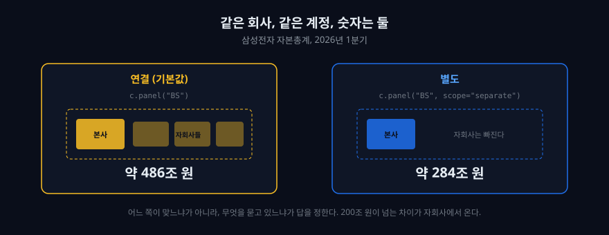

## 재무제표는 세 장이 아니라 한 장이다

회계 교과서는 재무제표를 세 장으로 가르친다. 손익계산서는 얼마를 벌었는지, 재무상태표는 무엇을 가지고 있는지, 현금흐름표는 돈이 실제로 어디로 갔는지 보여 준다고 한다. 맞는 설명이다.

그런데 이 세 장은 각각 한 시점의 사진이다. 사업보고서 하나를 열면 올해와 작년, 두 해치만 나란히 있다. 5년을 보려면 보고서 다섯 개를 열어야 하고, 그 순간 표는 사람 손을 떠난다.

dartlab은 이 문제를 다르게 푼다. 회사 하나의 모든 공시를 미리 읽어서, **세로에 계정 이름, 가로에 기간**을 둔 커다란 표 하나로 눕혀 둔다. 손익계산서를 부르면 그 표의 손익 부분이 통째로 나온다. 두 해치가 아니라 있는 만큼 전부.


[지난 편, DART 공시분석, 설치 없이](/blog/what-is-dartlab)에서 이 표를 한 번 열어 봤다. 이번 편은 그 표를 자유롭게 다루는 법이다. 아래 코드 칸은 전부 이 브라우저 안에서 그대로 돈다. 첫 코드 칸 아래의 "노트북 생성하기"를 누르면 이 글 전체가 여러분의 노트북이 된다.

## 세 장을 각각 불러 본다

먼저 회사를 잡고 손익계산서를 연다.

```python
import dartlab

c = dartlab.Company("005930")   # 삼성전자
c.panel("IS").head(5)           # 손익계산서. 앞에서 다섯 줄만
```

처음 실행은 20초쯤 걸린다. 파이썬과 dartlab을 브라우저로 내려받는 시간이다. 그다음부터는 즉시 돈다.

`panel`이 이 도구의 심장이다. `"IS"`는 손익계산서(Income Statement), `"BS"`는 재무상태표(Balance Sheet), `"CF"`는 현금흐름표(Cash Flow)다. 세 글자만 바꾸면 다른 장이 열린다. 이 세 장이 각각 무엇을 말하는지는 [사업보고서 읽는 법](/blog/reading-business-reports)에 정리해 두었다.

```python
c.panel("BS").head(5)   # 재무상태표
```

```python
c.panel("CF").head(5)   # 현금흐름표
```

세 표는 모양이 똑같다. 왼쪽 두 칸이 계정을 가리키고, 오른쪽으로 기간이 늘어선다. 다루는 방법이 같으니 하나만 익히면 셋을 다 익힌 것이다.

## 표의 앞부분을 먼저 본다

표를 다루기 전에 실제로 어떤 계정과 기간이 있는지 보는 것이 순서다.

```python
is_ = c.panel("IS")
is_.head(8)
```

앞쪽 줄을 보면 회사가 어떤 계정 이름을 쓰는지, 최근 기간 열이 어디까지 있는지 바로 보인다. 매출액, 매출원가, 매출총이익 같은 줄이 실제 숫자와 함께 나온다.

여기서 돌려받는 표는 [polars](https://pola.rs/) DataFrame 이다. `head`, `select`, `null_count` 같은 것이 전부 거기서 온다.

처음에는 크기 숫자보다 실제 줄을 보는 습관이 더 중요하다. 회사마다 계정 이름이 다르고, 상장한 지 얼마 안 된 회사는 기간이 짧다. 표 앞부분을 먼저 보면 없는 계정이나 없는 기간을 억지로 찾다가 빈손으로 끝나는 일을 줄일 수 있다.

## 원하는 계정만 골라낸다

표 전체가 필요한 경우는 드물다. 대개는 몇 줄이면 된다.

```python
c.select("IS", ["매출액", "영업이익"], freq="Y")
```

읽는 법은 이렇다. `"IS"`는 어느 표에서 찾을지, 대괄호 안 목록은 무엇을 찾을지, `freq="Y"`는 연간으로 묶으라는 뜻이다.

`panel`이 표 전체를 주는 문이라면 `select`는 그 표에서 원하는 줄만 뽑는 체다. 계정이 서른 개가 넘는 표에서 두 줄만 보고 싶을 때 쓴다.

분기로 보고 싶으면 한 글자만 바꾼다.

```python
c.select("IS", ["매출액", "영업이익"], freq="Q")
```

연간과 분기는 다른 이야기를 한다. 연간은 추세를 보여 주고, 분기는 변곡을 보여 준다. 매출이 연간으로는 계속 늘었는데 최근 두 분기가 꺾였다면, 연간 표만 본 사람은 그 사실을 모른다.

## 계정 이름이 회사마다 다르다는 문제

여기서 초보자가 반드시 만나는 벽이 있다. **회사마다 같은 것을 다른 이름으로 적는다.**

어떤 회사는 "매출액"이라 쓰고, 어떤 회사는 "영업수익"이라 쓴다. 은행은 "이자수익"부터 시작한다. 공시는 회사가 쓴 그대로 올라오기 때문에, 이름으로 찾으면 어떤 회사에서는 찾히고 어떤 회사에서는 안 찾힌다. 원본이 궁금하면 [DART](https://dart.fss.or.kr/)에서 그 회사의 사업보고서를 열어 재무제표 주석을 보라. 우리가 지금 다루는 표가 거기서 나온 것이다.

dartlab은 이 문제를 표준 이름 한 줄을 더 붙여서 푼다. 원천은 [OpenDART](https://opendart.fss.or.kr/) 가 주는 공시 그대로다. 표의 왼쪽 첫 칸을 보라. `sales`, `cost_of_sales`, `gross_profit` 같은 영문 이름이 있다. 이것이 표준 이름이고, 그 옆의 한글이 회사가 실제로 적은 이름이다.

```python
c.panel("IS").columns[:4]   # 표의 앞쪽 열 이름
```

그래서 여러 회사를 비교할 때는 한글 이름이 아니라 표준 이름으로 잡는 것이 안전하다. 이 매핑은 사람이 검수한다. 자동 추론에 맡기면 "영업수익"을 "영업이익"으로 잘못 이어 붙이는 사고가 조용히 난다.

## 지금 보고 있는 표가 연결인가 별도인가

여기가 초보자가 가장 크게 다치는 자리다. 같은 회사의 같은 계정인데 숫자가 두 개다.

**연결**은 자회사까지 하나의 회사처럼 묶어서 본 재무제표다. **별도**는 그 회사 법인 하나만 본 것이다. 삼성전자는 전 세계에 자회사를 두고 있고, 그 자회사들의 자산과 이익이 연결에는 들어가고 별도에는 안 들어간다.

dartlab은 아무 말이 없으면 **연결**을 준다. 별도를 보려면 그렇게 말해야 한다.

```python
bs = c.panel("BS", freq="Y")                       # 연결
bs.head(5)
```

```python
bs_separate = c.panel("BS", freq="Y", scope="separate")     # 별도
bs_separate.head(5)
```

두 표를 보면 계정명과 기간 값이 모두 보인다. 연결과 별도는 같은 재무상태표처럼 보여도 행 구성과 숫자가 달라질 수 있다. 자회사를 묶으면서 연결에 들어오는 자산과 이익이 있기 때문이다.

2026년 1분기 기준으로 연결 자본총계는 약 486조 원, 별도는 약 284조 원이다. 200조 원이 넘는 차이가 자회사에서 온다. 어느 쪽이 맞느냐는 질문은 틀렸다. **무엇을 묻고 있느냐**가 답을 정한다. 그룹 전체의 체력을 보고 싶으면 연결, 그 법인 자체의 재무 상태를 보고 싶으면 별도다.



인터넷에서 본 숫자와 내가 뽑은 숫자가 안 맞을 때, 열에 아홉은 한쪽이 연결이고 다른 쪽이 별도다.

## 빈칸은 빈칸이다

표를 보다 보면 값이 없는 칸을 만난다. 이때 두 가지를 구분해야 한다.

**회사가 그 계정을 안 쓴 경우.** 제조업 회사의 손익계산서에 "이자수익" 항목이 없는 것은 정상이다. 없는 것이지 누락이 아니다.

**그 기간에 공시가 없는 경우.** 상장 전 기간, 혹은 아직 결산이 안 끝난 최근 분기가 여기 해당한다.

dartlab은 두 경우 모두 빈칸으로 둔다. 0으로 채우지 않는다. 0으로 채우면 "이자수익 0원"과 "이자수익 항목 없음"이 구별되지 않고, 평균을 내는 순간 조용히 틀린 값이 나오기 때문이다.

```python
bs = c.panel("BS")
bs.null_count().to_dicts()[0]   # 열마다 빈칸이 몇 개인지
```

빈칸의 개수가 곧 그 회사 공시의 성긴 정도다. 오래된 기간일수록 빈칸이 많다.

## 회사를 바꿔 본다

지금까지의 코드에서 종목코드 한 곳만 바꾸면 대상이 바뀐다.

```python
sk = dartlab.Company("000660")            # SK하이닉스
sk.panel("IS", freq="Y").head(5)
```

`005930`이 `000660`이 되었을 뿐인데 다른 회사의 손익계산서 격자가 나온다. 종목코드 하나로 회사를 지목하는 이유는 [회사 하나는 종목코드 하나](/blog/company-one-stock-code)에 정리해 두었다. 이것이 격자로 눕혀 둔다는 말의 실제 의미다. 회사가 바뀌어도 다루는 방법이 안 바뀐다.

미국 회사는 티커를 넣는다. 그 경우 데이터가 [EDGAR](https://www.sec.gov/edgar)에서 온다. 다만 지금 이 브라우저에서는 미국 회사 데이터를 받는 데 시간이 더 걸리므로, 이번 편에서는 국내 회사로 익힌다. 미국 공시의 구조는 [EDGAR 전부 알기](/blog/everything-about-edgar)에 따로 적었다.

## 이렇게 오해하면 안 된다

세 가지를 짚어 둔다.

첫째, **`panel`에 있는 숫자는 회사가 공시한 숫자 그대로다.** dartlab이 다시 계산하거나 보정하지 않는다. 회사가 정정공시를 내면 그 값이 바뀐다.

둘째, **연간 값은 분기 네 개의 합이 아닐 수 있다.** 회사가 연간 재무제표에 적은 값을 그대로 쓴다. 감사 과정에서 조정이 들어가면 합이 안 맞는다. 이것은 오류가 아니라 회계의 사실이다.

셋째, **최근 분기가 비어 있다고 회사에 문제가 있는 것이 아니다.** 결산과 공시에는 시차가 있다. 오늘 열어 본 표의 마지막 칸은 대개 두세 달 전 분기다.

## 다음 편에서 할 것

이번 편에서 세 장의 표를 열고, 원하는 계정을 골라내고, 빈칸을 읽는 법을 익혔다. 이제 표를 꺼낼 줄 안다.

브라우저 밖에서 더 큰 데이터를 다루고 싶으면 [pip install dartlab](https://pypi.org/project/dartlab/) 로 설치본을 쓴다. 그 첫걸음은 [dartlab 쉽게 시작하기](/blog/dartlab-easy-start)에 있다.

다음은 그 표로 **무엇을 계산할 것인가**다. 매출은 얼마나 빨리 늘고 있는가, 마진은 개선되고 있는가, 그 개선이 진짜인가. dartlab이 이 질문들을 미리 계산해 둔 것이 있고, 그것을 부르는 법을 다룬다.

그 전에 위 코드 칸에서 계정 이름을 바꿔 보라. `"매출액"` 자리에 `"영업이익"`이나 `"당기순이익"`을 넣으면 무엇이 나오는지, 그리고 없는 이름을 넣으면 어떻게 되는지 직접 확인해 보는 것이 이번 편의 진짜 숙제다.
