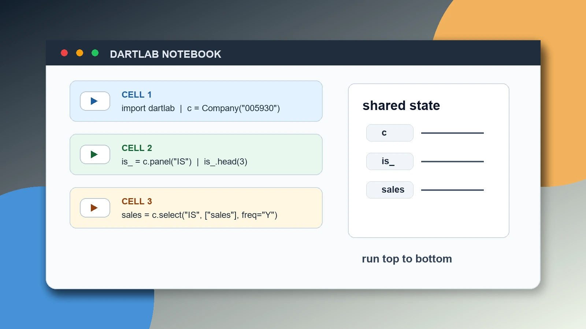
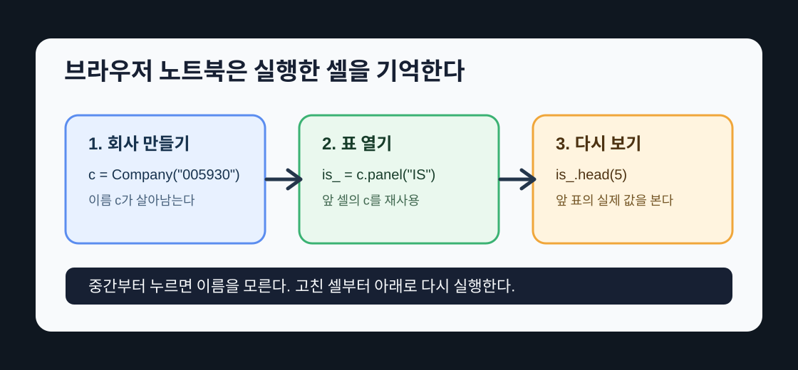

## 어떤 칸은 그 이름을 모른다고 한다

노트북을 처음 쓰면 이런 일이 생긴다. 어떤 칸은 누르면 표가 척 나오는데, 바로 아래 칸을 누르면 빨간 글씨로 그 이름을 모른다고 한다. `NameError`다. 대부분 데이터가 틀린 게 아니다. 그 이름을 만드는 위 셀을 아직 안 눌렀을 뿐이다.

코드셀은 따로 도는 계산기가 아니다. 위 셀이 만든 이름(`c`, `is_`)을 아래 셀이 그대로 받아 쓴다. 그래서 순서가 하나뿐이다. 위에서 아래로 실행하고, 뭔가 바꿨으면 바꾼 곳부터 다시. 이번 편은 그 한 문장이 노트북 안에서 어떻게 작동하는지 손으로 확인하는 편이다.



앞의 두 편은 "누르면 표가 나온다"는 경험이었다. [DART 공시분석, 설치 없이](/blog/what-is-dartlab)에서 브라우저에서 `dartlab.Company("005930")`로 첫 표를 열었고, [재무제표, 파이썬 한 줄](/blog/call-financial-statements)에서 손익계산서, 재무상태표, 현금흐름표를 같은 방식으로 불러왔다. 이번 편은 그 표들이 왜 순서를 타는지를 본다.

## 첫 셀은 회사를 기억시킨다

먼저 회사를 하나 만든다.

```python
import dartlab

c = dartlab.Company("005930")
c.market
```

이 셀은 두 가지 일을 했다. `dartlab`을 불러왔고, `c`라는 이름에 삼성전자를 넣었다. 마지막 줄의 `c.market`은 지금 이 회사가 어느 시장 데이터로 연결되는지 보여 준다. `KR`이면 한국 [DART](https://dart.fss.or.kr/) 쪽으로 간다.

중요한 것은 화면에 `KR`이 찍혔다는 것보다 `c`라는 이름이 생겼다는 것이다. 다음 셀은 `import dartlab`을 다시 하지 않아도 되고, `Company("005930")`을 다시 만들지 않아도 된다. 앞 셀이 만든 `c`를 그대로 쓴다.

```python
is_ = c.panel("IS")
is_.head(3)
```

여기서 `c`는 새로 만든 것이 아니다. 바로 위 셀이 만든 그 회사다. `is_`는 손익계산서 표를 담는 이름이다. 파이썬에서는 `is`가 이미 문법에 쓰이는 단어라서, 변수 이름으로 쓰지 않고 뒤에 밑줄 하나를 붙였다.

이제 손익계산서 표도 노트북에 남았다. 아래 셀은 표를 다시 만들지 않고, 이미 만든 `is_`에서 실제 계정과 최근 기간 일부만 다시 보여 준다.

```python
is_.head(5)
```

여기서 볼 것은 간단하다. 위 셀에서 만든 `is_`를 아래 셀이 다시 썼다. 표를 새로 열지 않고, 이미 만든 손익계산서를 다시 보여 준 것이다.

## 위에서 아래로 실행해야 하는 이유

처음 보는 사람은 글을 읽듯 중간 셀부터 누르기도 한다. 그럴 수 있다. 그런데 `is_.head(5)`를 먼저 누르면 브라우저는 `is_`가 무엇인지 모른다. 아직 그 이름을 만든 적이 없기 때문이다.

노트북은 페이지를 읽었다고 해서 코드를 자동으로 실행하지 않는다. 사용자가 누른 셀만 기억한다. 순서는 다음처럼 잡으면 된다.



첫째, `import dartlab`과 `Company`를 실행한다. 둘째, 그 회사로 `panel`을 실행한다. 셋째, 만들어진 표를 `head`나 `null_count` 같은 표 조작으로 실제 값을 본다.

```python
is_yearly = c.panel("IS", freq="Y")
is_yearly.head(5)
```

```python
is_yearly.head(1)
```

두 번째 셀은 `is_yearly`를 새로 만들지 않는다. 바로 앞 셀에서 만든 표를 한 줄만 다시 보여 줄 뿐이다.

반대로 앞 셀을 고쳤다면 뒤 셀도 다시 눌러야 한다. 예를 들어 `freq="Y"`를 `freq="Q"`로 바꾸고 첫 셀만 다시 실행하면, 아래쪽에 찍힌 예전 표는 그대로 남아 있다. 표를 보는 셀도 다시 눌러야 화면이 바뀐다.

## 이름은 붙이는 순간부터 살아 있다

파이썬에서 `=`는 같다는 뜻보다 "이 이름에 이 값을 붙인다"에 가깝다. 투자자가 처음 데이터 코드를 배울 때 가장 먼저 익혀야 하는 감각이다.

변수와 이름 붙이기 자체가 낯설다면 [Python 공식 튜토리얼](https://docs.python.org/3/tutorial/introduction.html)의 기본 계산과 변수 예시를 먼저 훑어도 좋다. 이 글에서는 그 문법을 공시 데이터 노트북 안에서 어떻게 쓰는지만 다룬다.

```python
target_code = "005930"
company = dartlab.Company(target_code)
company.panel("IS", freq="Y").head(3)
```

여기서는 회사 코드를 `target_code`라는 이름에 넣고, 그 코드를 이용해 `company`를 만들었다. 다음 편 [DART 종목코드, 회사 열기](/blog/pick-company-by-code)에서 이 방식을 더 자세히 쓴다. 지금은 이름이 쌓이는 순서만 보면 된다.

같은 이름에 다른 값을 다시 붙일 수도 있다.

```python
target_code = "000660"
company = dartlab.Company(target_code)
company.panel("IS", freq="Y").head(3)
```

이 셀을 실행하면 `company`는 이제 SK하이닉스를 가리킨다. 위에 찍혀 있던 삼성전자 표가 지워지는 것은 아니다. 화면에 남은 결과는 과거 출력이고, 변수 이름이 가리키는 대상은 새로 바뀐 상태다.

이 차이를 이해하면 노트북이 훨씬 덜 무섭다. 화면에 남은 표는 예전에 실행한 결과이고, 변수는 마지막으로 실행한 값이다. 그래서 중요한 분석은 위에서 아래로 다시 실행하는 습관이 필요하다.

## 노트북 생성은 글을 내 작업장으로 복사하는 일이다

본문의 코드셀은 읽는 사람 모두에게 같은 예제를 준다. 하지만 결국에는 내 회사 코드로 바꿔야 한다. 그래서 글 아래에는 "노트북 생성하기"가 붙는다.

그 버튼은 지금 본문에 있는 코드셀들을 여러분의 노트북 한 권으로 복사한다. 거기서는 셀을 더하고, 삭제하고, 순서를 바꾸고, 회사 코드를 바꿀 수 있다. 다만 위에서 만든 이름을 아래에서 쓴다는 규칙은 그대로다.

[Pyodide로 만든 브라우저 dartlab](/blog/pyodide-dartlab-lite)을 읽으면 이 구조가 왜 설치 없이 가능한지 더 자세히 알 수 있다. 브라우저 안에 파이썬 실행 환경이 올라오고, 그 안에서 [polars](https://pola.rs/) DataFrame이 표를 다룬다. 여러분의 컴퓨터에 파이썬을 따로 설치하지 않아도 되는 이유다.

다만 브라우저는 모든 것을 허용하지 않는다. 주가, 뉴스, 수급처럼 외부 서버에 직접 요청해야 하는 데이터 수집은 여기서 안 된다. 브라우저 보안 정책과 데이터 제공처의 제한 때문이다. 그런 작업은 [dartlab 쉽게 시작하기](/blog/dartlab-easy-start)처럼 로컬 파이썬을 설치한 뒤 다루는 영역이다.

## 저장하는 셀과 보여 주는 셀을 나눈다

노트북을 조금만 쓰다 보면 셀마다 역할을 나누는 편이 편하다. 어떤 셀은 표를 만들고, 어떤 셀은 그 표를 보여 준다. 이렇게 나누면 어디를 다시 눌러야 하는지 보인다.

저장하는 셀은 보통 위쪽에 둔다. 회사 코드, 회사 객체, 자주 쓸 표를 만든다.

```python
code = "005930"
c = dartlab.Company(code)
is_ = c.panel("IS")
```

보여 주는 셀은 그 아래에 둔다. 같은 `is_`를 여러 방식으로 살펴본다.

```python
is_.head(5)
```

```python
is_.null_count()
```

이렇게 나누면 회사 코드를 바꿀 때 어디를 고쳐야 하는지 분명하다. 맨 위 입력 셀의 `code`만 바꾸고, 아래 셀을 순서대로 다시 실행하면 된다. 반대로 표를 보는 방식만 바꾸고 싶다면 아래 출력 셀만 바꾸면 된다.

초보자가 자주 하는 실수는 한 셀에 모든 것을 넣는 것이다. 회사를 만들고, 표를 열고, 계산하고, 해석까지 한 칸에 넣으면 처음에는 빨라 보인다. 하지만 나중에 회사만 바꾸거나 기간만 바꾸고 싶을 때 어디를 고쳐야 할지 모른다. 노트북은 한 번에 긴 코드를 쓰는 곳이 아니라, 생각을 작은 단계로 남기는 곳이다.

이 습관은 다음 편부터 계속 쓴다. 회사 코드는 위에서 정하고, 재무제표 표는 중간에서 만들고, 마지막에 필요한 기간이나 출력만 바꿔 본다.

처음부터 다시 실행해야 하는 순간도 알아 두자. 회사 코드를 바꿨을 때, 기간을 연간에서 분기로 바꿨을 때, 표를 만드는 셀의 계정 이름을 바꿨을 때는 아래 셀을 다시 눌러야 한다. 반대로 마지막 출력 방식만 바꿨다면 그 셀만 다시 실행해도 된다. 어디서 값이 만들어졌는지 알면 다시 누를 범위가 보인다.

나중에 계산식이 들어오면 이 습관이 더 중요해진다. 매출과 영업이익으로 마진을 계산한다면, 매출 표를 만든 셀이 바뀔 때 마진 셀도 다시 눌러야 한다.

## 오류가 났을 때 먼저 볼 것

초보자가 처음 만나는 오류는 대개 셋이다.

첫째, `NameError`다. 이름을 모른다는 뜻이다. 거의 항상 앞 셀을 실행하지 않았거나, 변수 이름을 다르게 적었다는 뜻이다. `sales`를 만들었는데 아래에서 `sale`이라고 쓰면 브라우저는 그것이 무엇인지 모른다.

둘째, 빈 결과다. 계정 이름이 맞지 않거나, 그 회사가 그 계정을 공시하지 않았을 수 있다. 이때는 표 전체를 먼저 보고 실제 항목명을 확인한다.

```python
c.panel("IS").head(10)
```

셋째, 오래 걸리는 첫 실행이다. 처음 셀은 브라우저가 파이썬 환경과 dartlab을 내려받느라 느리다. 첫 실행이 끝난 뒤에는 같은 페이지 안에서 훨씬 빠르게 돈다. 실행이 느리다고 해서 DART 데이터가 틀린 것은 아니다.

원래 공시를 확인하고 싶으면 [OpenDART](https://opendart.fss.or.kr/)와 [SEC EDGAR](https://www.sec.gov/edgar)를 보면 된다. 국내 회사는 DART, 미국 회사는 EDGAR에서 공시를 낸다. dartlab은 그 공시를 표로 바꿔 보여 준다.

## 자주 걸리는 함정 셋

- 셀을 고쳐도 아래 결과는 저절로 다시 계산되지 않는다. 바꾼 셀부터 아래로 손으로 다시 눌러야 화면이 바뀐다.
- 화면에 남은 표가 지금 변수 값과 같으리라는 보장은 없다. 화면은 과거 실행의 기록이고, 변수는 마지막 실행의 결과다. 헷갈리면 위에서 아래로 다시 돌려라.
- 브라우저 노트북은 설치본을 통째로 대신하지 않는다. 공시 표를 읽고 실습하는 데 맞춰져 있고, 가격이나 뉴스 수집은 로컬에서만 된다. 문법 전체(반복문, 함수, 그래프)나 투자 판단도 이번 편의 몫이 아니다. 지금 필요한 건 셀 하나가 다음 셀에 무엇을 남기는지, 그 감각뿐이다.

직접 확인하고 싶으면 첫 셀에 `code = "005930"`, 다음 셀에 `c = dartlab.Company(code)`, 그다음 `c.panel("IS").head(3)`을 순서대로 실행해 보라. 그리고 맨 위 `code`만 `"000660"`으로 바꾸고 아래 셀을 차례로 다시 돌려서 표가 SK하이닉스로 바뀌면, 흐름을 손에 넣은 것이다.

## 다음 편에서 할 것

이제 코드셀을 누르는 법이 아니라, 코드셀이 어떻게 이어지는지 알게 됐다. 다음 편 [DART 회사 찾고 열기](/blog/pick-company-by-code)는 회사를 고르는 일을 다룬다. 회사명, 종목코드, `Company`를 분명히 나누고, 코드 하나를 바꿔 다른 회사의 재무제표를 여는 습관을 만든다.

**오늘 기억할 한 줄: 위에서 아래로 실행하고, 바꾼 곳부터 다시.**
