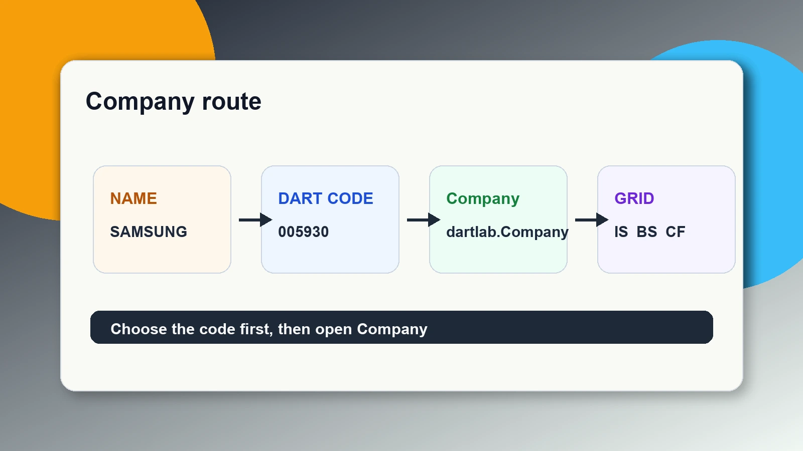
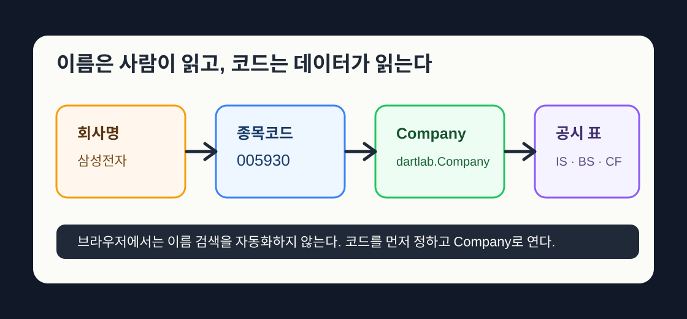

## 005930에서 0 하나가 빠지면 다른 회사다

`005930`에서 0 하나만 빠지면 `5930`이 된다. 삼성전자가 아니라 전혀 다른 입력이다. 회사 이름은 흔들린다. 약칭이 있고, 계열사가 있고, 띄어쓰기가 제각각이다. 종목코드는 안 흔들린다. 그래서 분석 대상은 이름이 아니라 코드로 잡는다. 이 손잡이를 잘못 잡으면 뒤에서 아무리 멋진 표를 열어도 다른 회사를 보고 있게 된다.

국내 상장사는 여섯 자리 종목코드를 쓴다. 삼성전자는 `005930`, SK하이닉스는 `000660`, NAVER는 `035420`이다. 이 번호를 넣으면 dartlab은 국내 회사로 보고 [DART](https://dart.fss.or.kr/) 공시 데이터로 간다. 이번 편은 이름에서 코드로, 코드에서 `Company`로 이어지는 손잡이를 잡는 법이다.

```python
import dartlab

c = dartlab.Company("005930")
c.market
```

`KR`이 나오면 국내 공시 경로가 열린 것이다. 지난 편 [공시 코드셀, 실행 순서](/blog/how-notebook-runs)에서 배운 것처럼, 이제 `c`라는 이름은 아래 셀들이 계속 쓸 수 있다.



여기서 중요한 것은 `Company`가 투자 의견을 내는 버튼이 아니라는 점이다. `Company`는 분석 대상의 주소를 잡는 첫 손잡이다. 이 손잡이를 잘못 잡으면 뒤에서 아무리 멋진 표를 열어도 다른 회사를 보고 있게 된다.

## 회사 목록에서 코드를 찾는다

회사 코드를 모를 때는 외워서 맞히지 않는다. 목록에서 찾는다. 로컬 설치본에서는 `dartlab.listing()`으로 상장사 목록을 볼 수 있다.

아래는 로컬 터미널이나 로컬 Python에서 확인하는 흐름이다. 이 브라우저 글의 실행 버튼은 가벼운 공시 실습용이라 전체 거래소 목록 조회가 비어 있을 수 있다.

```text
>>> import dartlab
>>> companies = dartlab.listing()
>>> companies.select(["회사명", "종목코드"]).head(5)
```

`listing()`은 회사 목록을 표로 돌려준다. 여기서 먼저 `회사명`과 `종목코드`를 본다. 종목코드는 숫자처럼 보여도 계산할 숫자가 아니라 회사 식별자다. 그래서 `005930`처럼 앞의 0까지 문자열로 보관한다.

회사명이 정확히 기억나지 않을 때는 후보를 찾는다.

```text
>>> dartlab.fuzzySearch("삼성", maxResults=5).select(["회사명", "종목코드"])
```

이 결과에는 삼성전자만 나오지 않는다. 삼성SDI, 삼성전기, 삼성물산처럼 비슷한 이름의 회사도 같이 보일 수 있다. 그래서 검색 결과에서 눈으로 회사를 고른 뒤 코드를 확정한다.



dartlab 밖에서 확인할 수도 있다. [OpenDART](https://opendart.fss.or.kr/)에서 회사명을 검색하거나, [KRX 정보데이터시스템](https://data.krx.co.kr/contents/MDC/MAIN/main/index.cmd)에서 종목코드를 확인한다. 헷갈리면 둘 다 본다. 회사명이 비슷한 경우에는 한 곳만 보고 넘기지 않는다.

## 회사명으로 코드도 찾을 수 있다

회사명을 정확히 알고 있으면 코드로 바로 바꿀 수 있다.

```text
>>> import dartlab
>>> dartlab.nameToCode("삼성전자")
'005930'
```

이 호출은 정확히 맞는 회사명을 찾는다. `삼성전자`처럼 목록의 회사명과 맞으면 `005930`을 돌려준다. 하지만 `삼전`처럼 줄인 이름이나 오타는 정확 매칭이 아니다. 그럴 때는 먼저 `fuzzySearch("삼성")`로 후보를 본다.

코드를 회사명으로 되돌리는 것도 가능하다.

```text
>>> dartlab.codeToName("005930")
'삼성전자'
```

초보자에게 중요한 순서는 이렇다. 먼저 `fuzzySearch`로 후보를 찾고, 그다음 `nameToCode`로 정확한 코드를 잡고, 마지막으로 `Company`를 연다. 한 번 찾은 코드는 노트북 위쪽에 적어 둔다.

## 회사명으로 Company를 열 수도 있다

로컬 설치본에서는 `Company`에 회사명을 바로 넣을 수 있다.

```text
>>> import dartlab
>>> c = dartlab.Company("삼성전자")
>>> c.stockCode
'005930'
>>> c.panel("IS", freq="Y").head(5)
```

이 방식은 편하다. 그래도 처음 배우는 글에서는 종목코드도 같이 확인한다. `Company("삼성전자")`가 내부에서 결국 `005930`으로 해석된다는 사실을 알아야, 다른 회사로 바꿀 때 실수하지 않는다.

브라우저 실습 셀은 계속 코드 중심으로 간다. 이유는 기능을 숨기려는 것이 아니라 실행 환경을 안정적으로 맞추기 위해서다. 로컬 설치본은 회사 목록을 내려받고 이름을 코드로 바꿀 수 있지만, 브라우저는 전체 목록 조회가 제한될 수 있다. 그래서 이 글에서 바로 눌러 보는 코드는 `Company("005930")`처럼 이미 확인한 코드를 쓴다.

## 코드 하나를 바꾸면 회사가 바뀐다

이제 같은 코드를 두 회사에 써 보자.

```python
samsung = dartlab.Company("005930")
samsung.panel("IS", freq="Y").head(5)
```

```python
hynix = dartlab.Company("000660")
hynix.panel("IS", freq="Y").head(5)
```

두 셀에서 바뀐 것은 회사 코드뿐이다. 같은 `panel("IS")`를 썼는데 다른 회사 표가 나온다. 이것이 코드의 역할이다.

코드를 변수로 따로 빼면 더 또렷하다.

```python
code = "035420"
c = dartlab.Company(code)
c.panel("IS").head(3)
```

`code`를 바꾸면 `c`가 가리키는 회사도 바뀐다. 여러 회사를 볼 때도 원리는 같다. 회사 코드만 바꾸고, 같은 표를 다시 연다.

## 내 작은 코드북을 만든다

처음에는 매번 검색하지 말고 작은 코드북을 만들어 두는 편이 낫다.

아래에서 쓰는 `{}` 구조는 파이썬의 딕셔너리다. 공식 문법이 궁금하면 [Python 자료구조 문서](https://docs.python.org/3/tutorial/datastructures.html#dictionaries)를 참고하면 된다. 여기서는 딕셔너리를 회사명과 종목코드를 잇는 작은 표로 쓴다.

```python
codes = {
    "삼성전자": "005930",
    "SK하이닉스": "000660",
    "NAVER": "035420",
}

code = codes["SK하이닉스"]
c = dartlab.Company(code)
c.panel("IS", freq="Y").head(5)
```

이 코드는 화려하지 않다. 하지만 초보자에게는 좋은 습관이다. 회사명을 눈으로 고르고, 실제 실행은 코드로 한다. 이름과 코드를 분리해 두면 나중에 회사명을 잘못 적어 생기는 문제를 줄일 수 있다.

이 방식은 [회사 하나는 종목코드 하나](/blog/company-one-stock-code)에서 다룬 문제와 이어진다. 이름은 사람이 읽기 위한 표지판이고, 코드는 시스템이 같은 회사를 다시 찾기 위한 열쇠다. 공시 분석을 반복할수록 이 차이가 커진다.

## 코드북은 노트북의 입력칸이다

코드북을 만들었다면 그다음은 노트북 맨 위에 두는 것이다. 그래야 아래 셀들이 전부 같은 입력을 바라본다. 회사 코드를 본문 중간중간에 흩뿌리면 나중에 바꿀 곳을 놓친다.

```python
codes = {
    "삼성전자": "005930",
    "SK하이닉스": "000660",
    "NAVER": "035420",
}

target = "삼성전자"
code = codes[target]
c = dartlab.Company(code)
c.market
```

이제 아래 셀들은 `target`과 `code`를 직접 몰라도 된다. `c`만 쓰면 된다. 회사를 바꾸고 싶으면 `target = "SK하이닉스"`로 바꾸고, 아래 셀을 차례로 다시 실행한다. 지난 편에서 배운 실행 순서가 여기서 바로 쓰인다.

```python
c.panel("IS", freq="Y").head(5)
```

이렇게 나누면 고칠 곳이 보인다. 위쪽은 회사 선택, 중간은 `Company` 만들기, 아래쪽은 표 보기다. 회사를 바꾸고 싶으면 위쪽만 바꾸고 아래 셀을 다시 실행하면 된다.

회사명 호출 기능이 있어도 코드북은 유용하다. 내가 어떤 회사를 보고 있는지 숨겨지지 않기 때문이다. 특히 초보자는 `삼성전자`라는 이름과 `005930`이라는 코드가 같이 보일 때 실수가 줄어든다.

코드북을 오래 쓰려면 출처도 같이 적어 두는 편이 좋다. 예를 들어 어떤 코드는 DART에서 확인했고, 어떤 코드는 거래소 화면에서 확인했는지 메모해 둔다. 회사명이 비슷한 경우에는 이 메모가 꽤 중요하다. 지주회사, 사업회사, 우선주, 스팩처럼 이름이 닮은 항목이 섞이면 눈으로는 맞아 보이지만 코드가 다를 수 있다.

또 하나의 습관은 첫 출력에 회사의 큰 표를 조금만 여는 것이다. 바로 복잡한 분석으로 들어가지 말고 `panel("IS").head(2)`처럼 앞 두 줄만 확인한다. 화면에 나온 계정이 내가 생각한 업종과 완전히 다르면 코드를 다시 의심해야 한다. 코드 검산은 시간을 낭비하는 절차가 아니라, 뒤에서 더 큰 시간을 아끼는 절차다.

이 원칙은 공시 원문을 열 때도 같다. DART에서 검색한 회사명과 dartlab에서 넣은 코드가 같은 회사를 가리키는지 먼저 맞춘다. 그다음 손익계산서, 재무상태표, 현금흐름표를 본다. 대상을 정확히 잡는 일은 너무 기초라서 건너뛰기 쉽지만, 잘못 잡으면 모든 분석이 처음부터 다른 회사 이야기가 된다.

## 미국 회사는 여섯 자리 코드가 아니다

국내 회사는 여섯 자리 종목코드를 쓴다. 미국 회사는 티커를 쓴다. 애플은 `AAPL`, 엔비디아는 `NVDA` 같은 식이다. 미국 공시의 원천은 [SEC EDGAR](https://www.sec.gov/edgar)다. 구조 자체는 다르지만, "회사를 먼저 정확히 지목한다"는 원칙은 같다.

이번 편의 실행 셀은 국내 회사로 제한한다. 브라우저에서 미국 데이터를 받는 과정은 시간이 더 걸리고, 초보자에게는 코드와 티커의 차이가 먼저 중요하다. 미국 공시의 읽는 법은 [EDGAR 전부 알기](/blog/everything-about-edgar)에 따로 묶어 두었다.

한 가지 경계는 분명히 둔다. 회사 목록 전체를 내려받아 이름으로 찾는 조회는 브라우저에서는 안 된다. 이 글의 실행 셀이 확인된 종목코드를 바로 넣는 이유다. 실시간 시세와 뉴스 수집도 마찬가지로 로컬 설치본에서만 된다.

국내 공시를 깊게 읽으려면 [DART 전부 알기](/blog/everything-about-dart)와 [사업보고서 읽는 법](/blog/reading-business-reports)을 같이 보면 좋다. 지금 우리가 여는 표는 결국 사업보고서와 분기보고서의 재무제표에서 나온다. dartlab은 그 공시를 비교하기 쉬운 표로 바꿔 보여 준다.

## 같은 코드로 표 세 장을 연다

회사를 정확히 잡았다면, 그다음은 2편에서 배운 세 장이다.

```python
c = dartlab.Company("005930")

is_ = c.panel("IS")
bs = c.panel("BS")
cf = c.panel("CF")

is_.head(2)
```

```python
bs.head(2)
```

```python
cf.head(2)
```

손익계산서, 재무상태표, 현금흐름표가 같은 회사 코드 아래 열린다. 화면에 실제 계정과 기간 값이 보이면, 세 표가 같은 대상에서 왔는지 더 쉽게 확인할 수 있다. `IS`는 삼성전자이고 `BS`는 SK하이닉스가 되는 식으로 섞이면 분석은 바로 깨진다.

그래서 노트북에서 회사를 바꿀 때는 보통 맨 위 코드 셀 하나만 바꾸고, 아래 셀들을 차례로 다시 실행한다. 이렇게 해야 모든 표가 같은 회사를 바라본다.

```python
code = "000660"
c = dartlab.Company(code)

c.panel("IS").head(2)
```

이 한 칸을 바꾸고 아래 셀을 다시 누르면, 같은 노트북이 SK하이닉스 분석 노트북으로 바뀐다. 복잡한 도구를 배우는 것이 아니라, 좋은 템플릿을 만들고 대상 코드만 바꾸는 습관을 배우는 것이다.

## 코드가 맞는지 검산하는 습관

코드는 짧지만 틀리기 쉽다. `005930`에서 0 하나를 빼면 다른 형식이 되고, 숫자 하나를 바꾸면 전혀 다른 회사가 된다. 그래서 첫 셀에서는 바로 큰 분석을 하지 말고 시장과 표 일부를 확인한다.

```python
c = dartlab.Company("005930")
c.market
```

```python
c.panel("IS").head(2)
```

시장 확인, 표 앞부분 확인. 이 순서가 안전하다. 회사명으로 열었든 코드로 열었든, 내가 생각한 회사가 맞는지 먼저 본다.

이 습관은 나중에 전종목 스캔을 볼 때도 이어진다. 시장 표에서 후보 회사를 찾고, 다시 그 회사 코드로 돌아와 재무제표를 확인해야 한다. 후보 표만 보고 결론을 내리면 어느 회사 숫자인지 놓치기 쉽다.

## 자주 걸리는 함정 셋

- 종목코드는 영원한 본명이 아니다. 상장폐지, 합병, 분할, 재상장이 얽히면 코드와 대상의 연결이 달라지니, 그런 특수한 기업 사건에서만 원 공시를 다시 확인한다.
- 회사명 호출이 된다고 확인을 건너뛰지 않는다. 지주회사와 사업회사, 보통주와 우선주는 이름만 닮았고 코드가 다르니, DART 화면의 종목코드와 노트북의 코드를 눈으로 맞춰 본다.
- 코드가 맞아도 분석은 끝이 아니다. `005930`을 넣었으면 이제 겨우 올바른 회사를 연 것이고, 기간을 정하고 계정의 뜻을 읽는 일은 그다음이다.

한 가지만 몸으로 겪어 두면 좋다. `005930`을 따옴표 없이 숫자처럼 쓰면 앞의 0이 사라져 `5930`이 된다. 종목코드는 계산할 숫자가 아니라 글자열이라 반드시 따옴표 안에 넣는다. 여섯 자리와 다섯 자리는 서로 다른 입력이다.

## 다음 편에서 할 것

회사를 정확히 여는 법을 배웠으니 다음은 표의 방향이다. 같은 회사라도 매출이 5년 동안 커졌는지 보는 질문과 최근 두 분기가 꺾였는지 보는 질문은 완전히 다르다. 다음 편 [재무제표 기간, Y와 Q 조회](/blog/the-grid)에서는 `freq="Y"`와 `freq="Q"`를 나란히 놓고, 같은 회사 표가 연간과 분기에서 어떻게 달라지는지 직접 확인한다. 회사가 코드로 단단히 고정돼 있어야 이 비교가 성립한다.

**오늘 기억할 한 줄: 분석 대상은 이름이 아니라 코드로 잡는다. 손잡이를 잘못 잡으면 그 뒤 모든 표가 다른 회사 이야기가 된다.**
