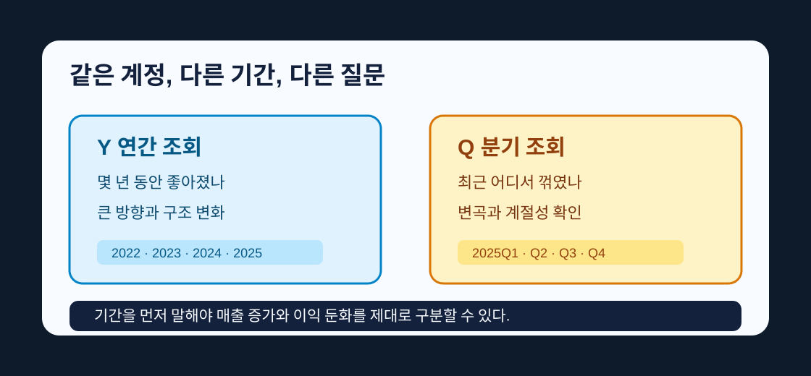

## 같은 매출액인데 Y로 물으면 방향, Q로 물으면 변곡이다

`c.panel("IS", freq="Y")`로 손익계산서를 열면 매출액이 연도별로 한 칸씩 늘어선다. 같은 코드에서 `freq="Y"`를 `freq="Q"`로 딱 한 글자만 바꾸면, 똑같은 매출액이 이번엔 분기별로 잘게 쪼개져 나온다. 숫자가 담긴 계정은 그대로다. 그런데 연간 표를 앞에 두면 "이 회사가 몇 년 동안 어느 방향으로 갔나"가 저절로 눈에 들어오고, 분기 표를 앞에 두면 "최근 어느 분기에서 꺾였나"가 먼저 보인다.

그래서 `freq="Y"`와 `freq="Q"`는 표의 모양만 바꾸는 스위치가 아니다. 던지는 질문 자체를 바꾼다. 연간은 큰 방향을 묻고, 분기는 변곡 지점을 묻는다. 초보자는 이 둘을 단순 옵션으로 보다가, 연간 흐름을 봐야 할 자리에 분기 숫자를 들이대거나 그 반대로 하면서 엉뚱한 결론을 낸다. 이 편은 그 두 질문을 손에 익히는 편이다.


[재무제표, 파이썬 한 줄](/blog/call-financial-statements)에서 손익계산서, 재무상태표, 현금흐름표를 처음 열었다. 이번 편은 그 표에서 기간만 바꾸는 감각을 익힌다. 코드는 짧지만, 이 감각이 없으면 나중에 성장률, 마진, 현금흐름을 읽을 때 기준이 흔들린다.

## 먼저 회사를 열고 같은 계정을 고른다

삼성전자를 다시 열어 보자.

```python
import dartlab

c = dartlab.Company("005930")
annual = c.panel("IS", freq="Y")
annual.head(5)
```

`IS`는 손익계산서, `freq="Y"`는 연간이다. 화면에는 여러 계정이 연도별 숫자와 함께 나온다. `head(5)`는 그 표의 위에서 다섯 줄만 미리 본다는 뜻이다. dartlab이 돌려주는 표는 [Polars](https://pola.rs/) 데이터프레임이라, `head`처럼 표를 다루는 기본 조작이 그대로 통한다.

이번 편에서 볼 것은 어렵지 않다. 같은 손익계산서를 연간으로 열었다가, 분기로 다시 연다. 코드에서 바뀌는 부분은 `freq="Y"`와 `freq="Q"` 딱 한 곳이다. 계정도, 회사도 그대로 두고 기간만 건드린다. 그런데 표를 앞에 두는 순간 읽는 방향이 달라진다는 것이 이 편의 핵심이다.

이번에는 분기로 바꿔 보자.

```python
quarterly = c.panel("IS", freq="Q")
quarterly.head(5)
```

분기 표는 오른쪽으로 더 길다. 연간 표는 1년에 한 칸이고, 분기 표는 1년에 여러 칸이기 때문이다. 같은 회사라도 연간으로 볼 때와 분기로 볼 때 보이는 속도가 다르다. 연간이 한 걸음씩 성큼 걷는다면, 분기는 잰걸음으로 최근 흔들림까지 담아낸다.

## 연간은 큰 방향을 본다

연간 표는 큰 흐름을 볼 때 쓴다. 사업이 몇 년 동안 커졌는지, 영업이익이 좋아졌는지, 어느 해부터 달라졌는지 보기 좋다.

연간 표를 볼 때는 한 해 숫자보다 흐름이 중요하다. 매출액이 한 번 줄었다고 바로 나쁜 회사가 되는 것은 아니다. 반대로 한 해 급증했다고 좋은 회사가 되는 것도 아니다. 왜 급증했는지, 다음 해에도 이어졌는지, 이익도 같이 늘었는지 봐야 한다. 한 해만 튀는 숫자는 대개 자산 매각이나 일회성 손익 같은 사정이 섞인 경우가 많고, 그 사정을 걷어내야 진짜 방향이 보인다.

```python
annual.head(2)
```

이 표에서는 매출액과 영업이익이 같은 연도 칸 위에 놓인다. 그래서 "매출은 늘었는데 영업이익은 줄었나"를 바로 볼 수 있다. 연간 표를 읽는 손동작은 단순하다. 왼쪽에서 오른쪽으로 연도를 훑으면서, 매출액이 향하는 방향과 영업이익이 향하는 방향이 같은지 본다. 둘이 같은 방향이면 사업이 통째로 커지거나 줄어드는 것이고, 매출은 오르는데 이익만 꺾이면 비용이나 마진 쪽에서 무슨 일이 벌어진 것이다. 어느 해부터 기울기가 바뀌었는지도 연간 표에서 가장 눈에 잘 띈다.

연간 데이터의 원천은 사업보고서와 감사보고서에 가깝다. 국내 회사의 원문은 [DART](https://dart.fss.or.kr/)에서 확인할 수 있고, 개발 API와 자료 구조는 [OpenDART](https://opendart.fss.or.kr/)가 출발점이다. dartlab은 이 원천을 사람이 비교하기 쉬운 표로 바꿔 둔다.

## 분기는 변곡을 본다

분기 표는 최근 변화를 볼 때 쓴다. 최근 두 분기 매출이 꺾였는지, 영업이익이 갑자기 나빠졌는지 보기 좋다.

```python
quarterly.head(2)
```

분기 표를 읽는 손동작은 연간과 다르다. 연간이 왼쪽에서 오른쪽으로 방향을 훑는 것이라면, 분기는 최근 몇 칸에 눈을 붙이고 어디서 기울기가 꺾였는지 찾는 것이다. 이번 분기 매출이 직전 분기보다 줄었다고 곧바로 나빠졌다 말하기 어려운 이유는, 어떤 산업은 4분기에 매출이 몰리고 어떤 산업은 특정 분기가 원래 약하기 때문이다. 그래서 분기를 제대로 읽으려면 직전 분기가 아니라 작년 같은 분기와 나란히 놓고 봐야 계절 효과에 속지 않는다. 이번 편에서는 그 계산까지 하지 않는다. 지금은 연간 표와 분기 표가 왜 다르게 보이는지, 그 감각만 잡는다.

[공시 코드셀, 실행 순서](/blog/how-notebook-runs)에서 배운 대로, `quarterly`는 앞 셀에서 만든 변수다. 아래 셀은 그 표를 다시 읽는다. 만약 `freq="Q"`를 `freq="Y"`로 바꾸면, 아래 셀들도 다시 실행해야 한다.

## 재무상태표도 기간을 가진다

손익계산서만 기간을 갖는 것이 아니다. 재무상태표도 기간 열로 펼쳐진다. 다만 읽는 방식이 다르다.

```python
bs_y = c.panel("BS", freq="Y")
bs_q = c.panel("BS", freq="Q")

bs_y.head(5)
```

```python
bs_q.head(5)
```

손익계산서는 일정 기간 동안 벌고 쓴 돈을 보여 준다. 재무상태표는 그날 회사가 가진 자산, 부채, 자본을 보여 준다. 그래서 둘 다 `Y`와 `Q`를 쓰더라도 읽는 느낌이 다르다. 손익계산서의 연간은 1년 동안 번 돈이고, 재무상태표의 연간은 연말에 남아 있는 상태다. 같은 `freq="Q"`라도 손익계산서 분기 칸은 그 석 달 동안 흘러간 돈이고, 재무상태표 분기 칸은 그 분기말 하루의 잔고다. 그래서 재무상태표는 칸과 칸의 변화, 예를 들어 부채가 지난 분기말보다 늘었는지를 보고, 손익계산서는 칸 자체의 크기를 본다. 표 모양이 같다고 같은 방식으로 읽으면 안 되는 지점이 바로 여기다.

이 차이는 [사업보고서 읽는 법](/blog/reading-business-reports)을 보면 더 분명해진다. 사업보고서 안에서도 손익계산서와 재무상태표는 같은 회사의 다른 질문에 답한다. dartlab은 이 둘을 같은 표 조작법으로 열어 주지만, 회계 의미까지 같게 만들지는 않는다.



## `freq="year"`가 아니라 `freq="Y"`다

여기서 작은 문법을 정확히 잡고 가자. dartlab 브라우저 글에서 쓰는 값은 `freq="Y"`와 `freq="Q"`다. `freq="year"`라고 쓰면 지원 값이 아니다. 나중에 누적 분기처럼 더 세밀한 기간을 다룰 때는 별도 편에서 다룬다.

이런 짧은 문자열은 사소해 보이지만 중요하다. 데이터 도구는 사용자의 의도를 추측해 마음대로 바꾸지 않는다. `Y`라고 쓰면 연간, `Q`라고 쓰면 분기다. 틀리게 쓰면 결과가 나오지 않거나 오류가 난다.

```python
c.panel("IS", freq="Y").head(3)
```

```python
c.panel("IS", freq="Q").head(3)
```

두 셀을 이어서 실행하면 같은 손익계산서를 두 속도로 볼 수 있다. 하나는 1년 단위, 하나는 분기 단위다. 같은 계정을 같은 회사에서 뽑았는데도 표가 던지는 질문이 달라지는 것을 눈으로 확인하는 순간이다.

## 기간을 섞어 말하면 오해가 생긴다

투자 글에서 "매출이 늘었다"는 문장을 자주 본다. 그런데 그 문장만으로는 부족하다. 연간 매출이 늘었다는 말인지, 최근 분기 매출이 늘었다는 말인지, 전년 동기 대비인지, 직전 분기 대비인지가 빠져 있기 때문이다.

dartlab에서 표를 볼 때도 마찬가지다. `annual`에서 본 숫자와 `quarterly`에서 본 숫자를 같은 문장 안에 섞을 때는 기준을 밝혀야 한다. "연간으로는 성장했지만 최근 분기는 둔화됐다"는 문장은 가능하다. "성장했다" 한마디는 부족하다. 실제로 이 두 문장은 서로 모순이 아니라 자주 같이 성립한다. 연간 표는 지난 몇 해의 방향을 담고, 분기 표는 가장 최근 몇 달을 담기 때문이다. 그래서 좋은 회사가 최근 분기에 잠깐 꺾이기도 하고, 오래 부진하던 회사의 분기가 먼저 돌아서기도 한다. 어느 기간의 눈으로 보느냐를 밝히지 않으면, 같은 회사를 두고 한 사람은 좋아졌다 하고 다른 사람은 나빠졌다 하며 끝없이 어긋난다.

이 기준을 분명히 하는 습관은 나중에 [기술적 분석이란](/blog/technical-analysis-basics) 같은 투자 글을 읽을 때도 도움이 된다. 주가 차트의 일봉, 주봉, 월봉이 서로 다른 질문을 던지듯, 재무제표의 연간과 분기도 서로 다른 질문을 던진다.

## 표 이름에 기간을 붙여 둔다

노트북을 계속 쓰다 보면 `sales`, `profit`, `bs` 같은 이름이 많아진다. 그때 기간이 이름에 없으면 나중에 헷갈린다. 초보자일수록 변수 이름에 기간을 붙이는 편이 안전하다.

```python
sales_y = c.panel("IS", freq="Y")
sales_q = c.panel("IS", freq="Q")

sales_y.head(5)
```

```python
sales_q.head(5)
```

`sales_y`는 연간 손익계산서, `sales_q`는 분기 손익계산서다. 이름만 봐도 어떤 속도의 표인지 보인다. 코드를 조금 더 길게 쓰는 대신, 표를 잘못 읽을 가능성이 줄어든다. 나중에 특정 계정만 좁힐 때 `select`를 쓸 수 있지만, 먼저 전체 panel에서 계정과 기간을 확인하는 습관이 우선이다.

이 습관은 글을 쓸 때도 그대로 적용된다. "매출이 늘었다"보다 "연간 매출이 늘었다"가 낫고, "최근 매출이 둔화됐다"보다 "분기 매출이 둔화됐다"가 낫다. 기준을 붙이면 독자가 같은 표를 다시 열어 확인할 수 있다.

재무제표 분석에서 좋은 문장은 대개 재현 가능한 문장이다. 어느 회사인지, 어느 표인지, 어느 계정인지, 어느 기간인지가 드러나면 다른 사람이 같은 코드를 실행해 확인할 수 있다. dartlab 글에서 코드셀을 본문에 넣는 이유도 여기에 있다. 주장만 읽는 것이 아니라, 그 주장을 만든 표를 바로 다시 열 수 있어야 한다.

기간 이름을 변수에 붙이는 것은 작은 일처럼 보인다. 하지만 나중에 직접 계산을 시작하면 차이가 커진다. 연간 매출과 분기 영업이익을 실수로 나누면 아무 의미 없는 비율이 나온다. 이름에 `y`와 `q`를 붙이면 그런 실수를 초기에 줄일 수 있다.

표를 만들기 전에 질문을 말로 써 보는 것도 좋다. "삼성전자의 연간 매출 방향을 본다"라고 쓰면 `freq="Y"`가 자연스럽다. "최근 분기 영업이익이 꺾였는지 본다"라고 쓰면 `freq="Q"`가 자연스럽다. 질문을 말로 쓰지 않고 코드부터 치면, 나중에 나온 표를 보고 질문을 맞추게 된다. 순서가 거꾸로다.

문자열과 변수 이름을 나누는 감각이 아직 낯설다면 [Python 공식 튜토리얼](https://docs.python.org/3/tutorial/introduction.html)에서 문자열과 변수 예시를 먼저 보면 된다. `freq="Y"`의 `Y`는 계산할 숫자가 아니라 기간을 가리키는 문자열이다.

좋은 노트북은 질문이 먼저 있고 표가 뒤따른다. 회사, 계정, 기간이 모두 정해져야 표가 의미를 갖는다. 회사만 정하고 기간을 정하지 않으면 숫자는 넓게 펼쳐질 뿐이고, 계정만 정하고 회사가 틀리면 전혀 다른 이야기가 된다. 이 편에서 기간을 따로 떼어 배우는 이유가 바로 여기에 있다.

## 브라우저에서 되는 것과 안 되는 것

이번 편의 모든 코드는 브라우저에서 그대로 실행되는 범위 안에 있다. `Company`, `panel`, 그리고 표의 `head`만 쓴다. 이 범위는 설치 없이 실습할 수 있다.

반면 실시간 주가와 결합해 "분기 실적 발표 뒤 주가가 어떻게 움직였나"를 바로 계산하는 것은 여기서 안 됩니다. 주가 데이터 수집은 외부 요청과 데이터 제공 조건이 걸려 있어서 로컬 설치본 영역이다. 설치본이 필요하면 [dartlab 쉽게 시작하기](/blog/dartlab-easy-start)로 넘어가면 된다.

미국 회사의 분기 공시는 [SEC EDGAR](https://www.sec.gov/edgar)에서 확인할 수 있다. 미국은 10-K와 10-Q의 리듬이 있고, 국내는 사업보고서와 분기보고서의 리듬이 있다. 원천은 다르지만 기간을 먼저 밝히고 숫자를 읽어야 한다는 원칙은 같다.

## 자주 걸리는 함정 셋

- 분기 네 개를 더하면 연간 값이 나올 것 같지만, 감사와 정정공시 때문에 연간 표의 값과 단순 합은 어긋날 수 있다. 연간이 궁금하면 `freq="Y"`로 직접 열어라.
- 최근 분기 하나로 회사의 긴 방향을 단정하지 마라. 분기는 빠른 대신 계절과 일회성에 흔들린다.
- 연간 표만 보고 "최근 변곡은 없다"고 말하지 마라. 연간은 안정적인 대신 늦어서, 이미 꺾인 분기를 아직 못 담고 있을 수 있다.

## 다음 편에서 할 것

이제 회사, 코드셀, 종목코드, 기간까지 잡았다. 다음 편은 그 표에서 필요한 줄만 이름으로 더 정확히 뽑아내는 문제다. "매출액"이라고 썼는데 어떤 회사에서는 "영업수익"으로 나오고, 금융업은 계정 구조가 아예 다르며, 찾던 계정이 없을 수도 있다. 그때 그것이 오류인지 공시 구조의 차이인지 가르는 법을 배운다. 여기서 익힌 `Y`와 `Q` 기준은 그대로 들고 간다. 어느 계정이든 먼저 기간을 정하고 그다음 이름을 확인하는 순서다.

**오늘 기억할 한 줄: `freq="Y"`는 방향을 묻고 `freq="Q"`는 변곡을 묻는다. 표를 열기 전에 내 질문이 둘 중 어느 쪽인지부터 정해라.**
