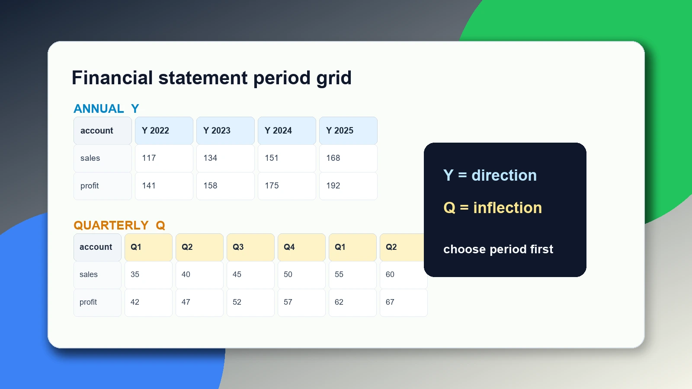

## 같은 계정도 기간을 바꾸면 다른 질문이 된다

지금까지 우리는 회사를 열고, 코드셀을 순서대로 실행하고, 종목코드로 대상을 바꾸는 법을 배웠다. 이제 표를 읽을 때 가장 자주 만나는 선택이 남았다. 연간으로 볼 것인가, 분기로 볼 것인가.

초보자는 `freq="Y"`와 `freq="Q"`를 단순 옵션처럼 본다. 하지만 이것은 표의 모양만 바꾸는 스위치가 아니다. 질문 자체를 바꾼다. 연간은 몇 년 동안 회사의 큰 방향이 어떤지 묻는다. 분기는 최근 변화가 어디서 꺾였는지 묻는다. 같은 매출액을 보더라도 답하는 문제가 다르다.



[재무제표, 파이썬 한 줄](/blog/call-financial-statements)에서 `select`를 처음 썼다. 이번 편은 그 `select`의 기간 감각을 익히는 편이다. 코드는 짧지만, 이 감각이 없으면 나중에 성장률, 마진, 현금흐름을 읽을 때 기준이 흔들린다.

## 먼저 회사를 열고 같은 계정을 고른다

삼성전자를 다시 열어 보자.

```python
import dartlab

c = dartlab.Company("005930")
annual = c.panel("IS", freq="Y")
annual.head(5)
```

`IS`는 손익계산서, `freq="Y"`는 연간이다. 화면에는 여러 계정이 연도별 숫자와 함께 나온다. 실제 화면에서는 공시 갱신에 따라 기간 열이 나중에 달라질 수 있다.

dartlab이 돌려주는 표는 파이썬에서 다루기 좋은 DataFrame 형태다. 표 조작 자체가 궁금하면 [Polars 공식 문서](https://docs.pola.rs/)를 참고할 수 있다. 이 글에서는 Polars 전체 문법보다 `panel(..., freq=...)`와 `head`처럼 기간 차이를 확인하는 데 필요한 손잡이만 쓴다.

같은 계정을 분기로 바꿔 보자.

```python
quarterly = c.panel("IS", freq="Q")
quarterly.head(5)
```

이 표는 훨씬 넓다. 같은 회사, 같은 계정인데 기간 열이 더 촘촘하다. 연간에서는 한 해에 한 칸을 보지만, 분기에서는 한 해가 여러 칸으로 쪼개져 보인다. 같은 계정을 골라도 `Y`와 `Q`는 실제로 보이는 기간을 바꾸고, 기간이 바뀌면 읽는 방식도 바뀐다.

## 연간은 큰 방향을 본다

연간 표는 느리지만 단단하다. 사업이 몇 년 동안 커졌는지, 영업이익이 구조적으로 개선됐는지, 어떤 해부터 체력이 달라졌는지 보기에 좋다.

연간 표를 볼 때는 한 해 숫자보다 흐름이 중요하다. 매출액이 한 번 줄었다고 바로 나쁜 회사가 되는 것은 아니다. 반대로 한 해 급증했다고 좋은 회사가 되는 것도 아니다. 왜 급증했는지, 다음 해에도 이어졌는지, 이익도 같이 늘었는지 봐야 한다.

```python
annual.head(2)
```

이 표에서 매출액과 영업이익은 같은 기간 열 위에 놓인다. 그래서 "매출은 늘었는데 영업이익은 줄었나" 같은 질문을 바로 던질 수 있다. 연간은 이처럼 회사의 큰 방향을 잡는 데 좋다.

연간 데이터의 원천은 사업보고서와 감사보고서에 가깝다. 국내 회사의 원문은 [DART](https://dart.fss.or.kr/)에서 확인할 수 있고, 개발 API와 자료 구조는 [OpenDART](https://opendart.fss.or.kr/)가 출발점이다. dartlab은 이 원천을 사람이 비교하기 쉬운 표로 바꿔 둔다.

## 분기는 변곡을 본다

분기 표는 더 민감하다. 최근 두 분기 매출이 꺾였는지, 영업이익이 갑자기 나빠졌는지, 계절성이 있는지 보기 좋다.

```python
quarterly.head(2)
```

분기를 볼 때 조심할 점도 있다. 모든 분기는 같은 무게가 아니다. 어떤 산업은 4분기에 매출이 몰리고, 어떤 산업은 특정 분기가 약하다. 그래서 분기 숫자는 전분기 비교와 전년 동기 비교를 나눠 봐야 한다. 이번 편에서는 계산까지 하지는 않는다. 지금은 표가 넓어지는 이유와 질문의 차이를 먼저 배운다.

[공시 코드셀, 실행 순서](/blog/how-notebook-runs)에서 배운 대로, `quarterly`는 앞 셀에서 만든 변수다. 아래 셀은 그 표를 다시 읽는다. 만약 `freq="Q"`를 `freq="Y"`로 바꾸면, 아래 셀들도 다시 실행해야 한다.

## 재무상태표도 기간을 가진다

손익계산서만 기간을 갖는 것이 아니다. 재무상태표도 기간 열로 펼쳐진다. 다만 읽는 방식이 다르다.

```python
bs_y = c.panel("BS", freq="Y")
bs_q = c.panel("BS", freq="Q")

bs_y.head(5)
```

```python
bs_q.head(5)
```

손익계산서는 일정 기간 동안 벌고 쓴 돈의 흐름을 보여 준다. 재무상태표는 특정 시점에 가진 자산과 부채, 자본의 상태를 보여 준다. 그래서 같은 `Y`와 `Q`라도 의미가 다르다. 손익계산서의 연간은 1년 동안의 합에 가깝고, 재무상태표의 연간은 연말 시점의 상태에 가깝다.

이 차이는 [사업보고서 읽는 법](/blog/reading-business-reports)을 보면 더 분명해진다. 사업보고서 안에서도 손익계산서와 재무상태표는 같은 회사의 다른 질문에 답한다. dartlab은 이 둘을 같은 표 조작법으로 열어 주지만, 회계 의미까지 같게 만들지는 않는다.


## `freq="year"`가 아니라 `freq="Y"`다

여기서 작은 문법을 정확히 잡고 가자. dartlab 브라우저 글에서 쓰는 값은 `freq="Y"`와 `freq="Q"`다. `freq="year"`라고 쓰면 지원 값이 아니다. 나중에 누적 분기처럼 더 세밀한 기간을 다룰 때는 별도 편에서 다룬다.

이런 짧은 문자열은 사소해 보이지만 중요하다. 데이터 도구는 사용자의 의도를 추측해 마음대로 바꾸지 않는다. `Y`라고 쓰면 연간, `Q`라고 쓰면 분기다. 틀리게 쓰면 결과가 나오지 않거나 오류가 난다.

```python
c.panel("IS", freq="Y").head(3)
```

```python
c.panel("IS", freq="Q").head(3)
```

두 셀을 이어서 실행하면 같은 손익계산서의 두 얼굴을 볼 수 있다. 하나는 긴 호흡, 하나는 짧은 호흡이다.

## 기간을 섞어 말하면 오해가 생긴다

투자 글에서 "매출이 늘었다"는 문장을 자주 본다. 그런데 그 문장만으로는 부족하다. 연간 매출이 늘었다는 말인지, 최근 분기 매출이 늘었다는 말인지, 전년 동기 대비인지, 직전 분기 대비인지가 빠져 있기 때문이다.

dartlab에서 표를 볼 때도 마찬가지다. `annual`에서 본 숫자와 `quarterly`에서 본 숫자를 같은 문장 안에 섞을 때는 기준을 밝혀야 한다. "연간으로는 성장했지만 최근 분기는 둔화됐다"는 문장은 가능하다. "성장했다" 한마디는 부족하다.

이 기준을 분명히 하는 습관은 나중에 [기술적 분석이란](/blog/technical-analysis-basics) 같은 투자 글을 읽을 때도 도움이 된다. 주가 차트의 일봉, 주봉, 월봉이 서로 다른 질문을 던지듯, 재무제표의 연간과 분기도 서로 다른 질문을 던진다.

## 표 이름에 기간을 붙여 둔다

노트북을 계속 쓰다 보면 `sales`, `profit`, `bs` 같은 이름이 많아진다. 그때 기간이 이름에 없으면 나중에 헷갈린다. 초보자일수록 변수 이름에 기간을 붙이는 편이 안전하다.

```python
sales_y = c.panel("IS", freq="Y")
sales_q = c.panel("IS", freq="Q")

sales_y.head(5)
```

```python
sales_q.head(5)
```

`sales_y`는 연간 손익계산서, `sales_q`는 분기 손익계산서다. 이름만 봐도 기준이 보인다. 코드를 조금 더 길게 쓰는 대신, 표를 잘못 읽을 가능성이 줄어든다. 나중에 특정 계정만 좁힐 때 `select`를 쓸 수 있지만, 먼저 전체 panel에서 행과 기간을 확인하는 습관이 우선이다.

이 습관은 글을 쓸 때도 그대로 적용된다. "매출이 늘었다"보다 "연간 매출이 늘었다"가 낫고, "최근 매출이 둔화됐다"보다 "분기 매출이 둔화됐다"가 낫다. 기준을 붙이면 독자가 같은 표를 다시 열어 확인할 수 있다.

재무제표 분석에서 좋은 문장은 대개 재현 가능한 문장이다. 어느 회사인지, 어느 표인지, 어느 계정인지, 어느 기간인지가 드러나면 다른 사람이 같은 코드를 실행해 확인할 수 있다. dartlab 글에서 코드셀을 본문에 넣는 이유도 여기에 있다. 주장만 읽는 것이 아니라, 그 주장을 만든 표를 바로 다시 열 수 있어야 한다.

기간 이름을 변수에 붙이는 것은 작은 일처럼 보인다. 하지만 나중에 직접 계산을 시작하면 차이가 커진다. 연간 매출과 분기 영업이익을 실수로 나누면 아무 의미 없는 비율이 나온다. 이름에 `y`와 `q`를 붙이면 그런 실수를 초기에 줄일 수 있다.

표를 만들기 전에 질문을 말로 써 보는 것도 좋다. "삼성전자의 연간 매출 방향을 본다"라고 쓰면 `freq="Y"`가 자연스럽다. "최근 분기 영업이익이 꺾였는지 본다"라고 쓰면 `freq="Q"`가 자연스럽다. 질문을 말로 쓰지 않고 코드부터 치면, 나중에 나온 표를 보고 질문을 맞추게 된다. 순서가 거꾸로다.

문자열과 변수 이름을 나누는 감각이 아직 낯설다면 [Python 공식 튜토리얼](https://docs.python.org/3/tutorial/introduction.html)에서 문자열과 변수 예시를 먼저 보면 된다. `freq="Y"`의 `Y`는 계산할 숫자가 아니라 기간을 가리키는 문자열이다.

좋은 노트북은 질문이 먼저 있고 표가 뒤따른다. 회사, 계정, 기간이 모두 정해져야 표가 의미를 갖는다. 회사만 정하고 기간을 정하지 않으면 숫자는 넓게 펼쳐질 뿐이고, 계정만 정하고 회사가 틀리면 전혀 다른 이야기가 된다. 이 편에서 기간을 따로 떼어 배우는 이유가 바로 여기에 있다.

## 브라우저에서 되는 것과 안 되는 것

이번 편의 모든 코드는 브라우저에서 실행되는 공개 계약 안에 있다. `Company`, `panel`, 그리고 표의 `head`만 쓴다. 이 범위는 설치 없이 실습할 수 있다.

반면 실시간 주가와 결합해 "분기 실적 발표 뒤 주가가 어떻게 움직였나"를 바로 계산하는 것은 여기서 안 됩니다. 주가 데이터 수집은 외부 요청과 데이터 제공 조건이 걸려 있어서 로컬 설치본 영역이다. 설치본이 필요하면 [dartlab 쉽게 시작하기](/blog/dartlab-easy-start)로 넘어가면 된다.

미국 회사의 분기 공시는 [SEC EDGAR](https://www.sec.gov/edgar)에서 확인할 수 있다. 미국은 10-K와 10-Q의 리듬이 있고, 국내는 사업보고서와 분기보고서의 리듬이 있다. 원천은 다르지만 기간을 먼저 밝히고 숫자를 읽어야 한다는 원칙은 같다.

## 이렇게 오해하면 안 된다

첫째, 분기 네 개를 더하면 항상 연간 값이 된다고 생각하면 안 된다. 감사 과정, 회계 기준, 정정공시 때문에 연간 표의 값과 단순 합이 다를 수 있다.

둘째, 최근 분기 하나만 보고 회사의 긴 방향을 단정하면 안 된다. 분기는 빠르지만 흔들린다.

셋째, 연간 표만 보고 최근 변곡이 없다고 말하면 안 된다. 연간은 안정적이지만 늦다.

## 다음 편으로 넘어가기 전 행동 검사

이번 편의 행동 검사는 같은 문장을 두 기간으로 나눠 말하는 것이다. 먼저 `sales_y`와 `sales_q`를 만든다. 그다음 "연간 매출은 큰 방향을 본다"와 "분기 매출은 최근 변곡을 본다"를 표 옆에 적어 둔다. 이 말이 어색하지 않으면 기간을 구분하기 시작한 것이다.

두 번째 검사는 손익계산서와 재무상태표를 나눠 보는 것이다. `IS`에서는 매출액과 영업이익을 `Y`와 `Q`로 각각 조회한다. `BS`에서는 자산총계와 자본총계를 `Y`와 `Q`로 각각 조회한다. 둘 다 기간 열이 있지만, 손익계산서는 흐름이고 재무상태표는 시점이라는 말을 붙여 본다. 같은 표 모양이라도 회계 의미가 다르다는 점이 보이면 통과다.

세 번째 검사는 문장 고치기다. "이 회사는 성장했다"라는 문장을 "연간 매출 기준으로 성장했다"처럼 고친다. "최근 수익성이 나빠졌다"는 문장은 "분기 영업이익 기준으로 나빠졌다"처럼 고친다. 투자 글이나 뉴스에서 이런 기준이 빠져 있으면, 독자는 같은 숫자를 보고도 서로 다른 말을 하게 된다.

이 행동 검사가 끝나면 여러분은 재무제표 표를 열 때 먼저 기간부터 묻게 된다. 어느 회사인가, 어느 표인가, 어느 계정인가, 어느 기간인가. 이 네 가지가 맞아야 숫자가 말이 된다. 다음 편에서 계정 이름을 더 정확히 고르는 수업도 이 순서를 그대로 따른다. 기간이 먼저 정리되어 있어야 계정 이름의 차이도 제대로 보인다.

## 이번 편에서 일부러 하지 않는 것

이번 편은 성장률을 계산하지 않는다. 연간 매출이 몇 퍼센트 늘었는지, 분기 영업이익률이 몇 퍼센트인지 계산하는 일은 다음 단계다. 지금은 그 계산에 들어가기 전, 어떤 기간 표를 계산의 재료로 쓸지 고르는 수업이다. 재료가 섞이면 계산이 아무리 정확해도 의미가 깨진다.

또한 이번 편은 계정 이름 문제를 깊게 파고들지 않는다. "매출액"이 어떤 회사에서는 "영업수익"으로 보일 수 있고, 금융업은 다른 계정 구조를 가질 수 있다. 하지만 그 문제는 다음 편의 중심이다. 여기서는 같은 계정을 골랐다고 가정하고 기간만 바꿔 본다. 한 번에 하나의 혼란만 다루는 편이 초보자에게 낫다.

마지막으로 연간과 분기 중 하나가 더 우월하다고 말하지 않는다. 연간은 느리지만 안정적이고, 분기는 빠르지만 흔들린다. 둘 중 하나를 고르는 것이 아니라 질문에 맞게 고르는 것이다. 회사의 체질을 볼 때는 연간이 먼저이고, 최근 변화의 시작점을 볼 때는 분기가 먼저다.

## 다음 편에서 할 것

이제 회사, 코드셀, 종목코드, 기간까지 잡았다. 다음 편은 필요한 줄만 이름으로 더 정확히 뽑아내는 문제다. "매출액"이라고 썼는데 어떤 회사에서는 다른 이름으로 나오고, 어떤 계정은 아예 없을 수 있다.

다음 편에서는 계정 이름을 찾고, 없는 계정을 만났을 때 그것이 오류인지 공시 구조의 차이인지 구분한다. 여기서 배운 `Y`와 `Q` 기준을 그대로 가져가면 된다. 같은 계정이라도 어느 기간으로 볼지 먼저 정하고, 그다음 이름을 확인하는 순서다.
