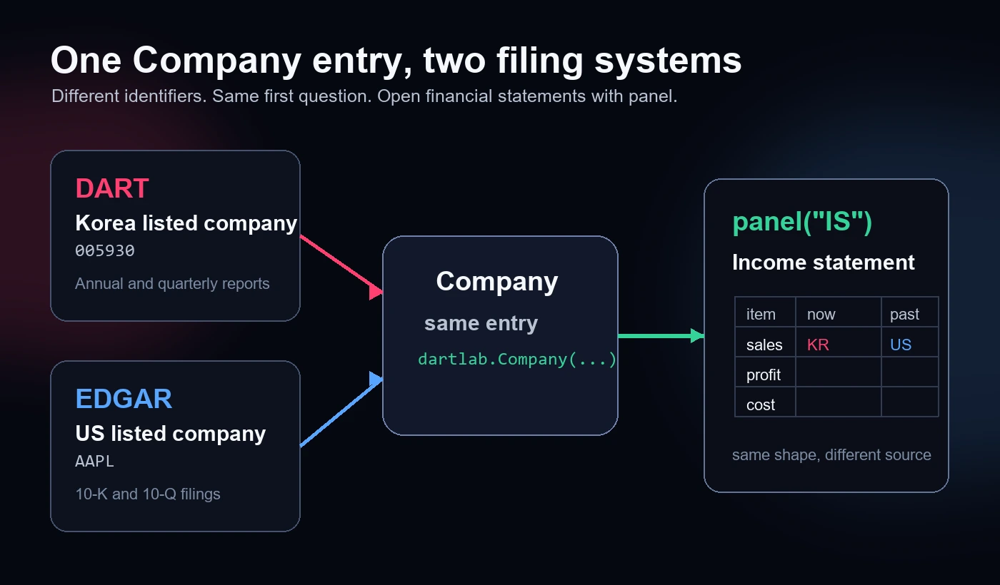
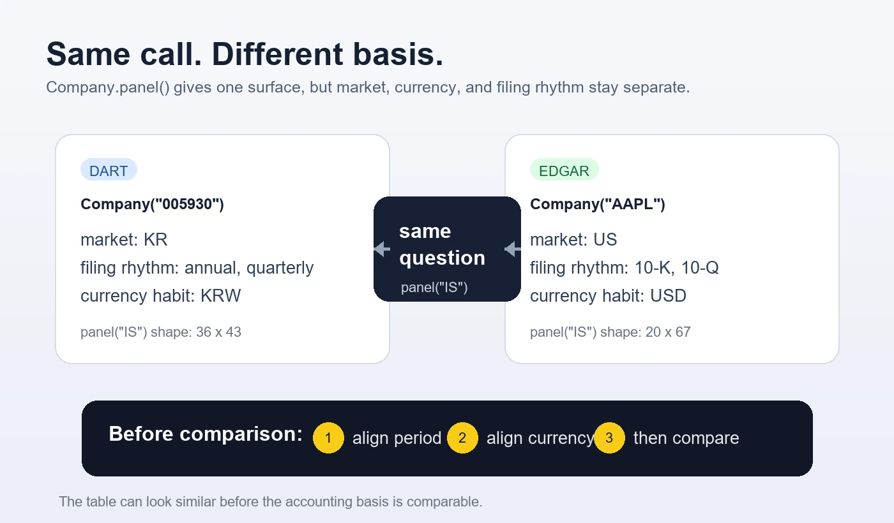

## 한국 회사와 미국 회사도 같은 코드로 연다

지금까지는 삼성전자 같은 국내 회사만 다뤘다. [DART 공시분석, 설치 없이](/blog/what-is-dartlab)에서 처음 본 전체 그림과 [DART 종목코드, 회사 열기](/blog/pick-company-by-code)에서 배운 것처럼 국내 회사는 여섯 자리 종목코드로 시작했다. 삼성전자는 `005930`이다.

그런데 공시는 한국에만 있는 것이 아니다. 미국 회사는 [SEC EDGAR](https://www.sec.gov/edgar)에서 10-K와 10-Q를 낸다. Apple은 `AAPL`이라는 ticker로 부른다. 초보자는 여기서 겁을 먹는다. DART와 EDGAR를 완전히 다른 도구로 배워야 한다고 생각하기 때문이다.

dartlab의 첫 답은 조금 다르다. 둘 다 `Company`로 시작한다. 입력값은 다르지만 첫 문은 같다.

```python
import dartlab

kr = dartlab.Company("005930")
us = dartlab.Company("AAPL")

kr.market, us.market
```

결과는 `KR`과 `US`로 갈라진다. 같은 `Company`로 시작했지만 dartlab은 안쪽에서 한국 회사와 미국 회사를 구분한다. 국내 회사는 DART 공시 데이터로 가고, 미국 회사는 EDGAR 데이터로 간다.

여기서 중요한 것은 두 가지다. **여는 코드는 같다.** 하지만 **숫자를 바로 비교하면 안 된다.** 한국 회사 숫자는 원화이고, 미국 회사 숫자는 달러다. 결산월도 다를 수 있다.



## 같은 표를 열어 본다

[재무제표, 파이썬 한 줄](/blog/call-financial-statements)에서 `panel("IS")`를 배웠다. `IS`는 손익계산서다. 이번에는 삼성전자와 Apple 손익계산서를 같은 코드 모양으로 열어 보자.

```python
kr_is = kr.panel("IS")
us_is = us.panel("IS")

kr_is.head(5)
```

삼성전자 표는 `snakeId`, `항목`, 그리고 `2026Q1`, `2025Q4` 같은 기간 열로 열린다. `snakeId`는 여러 회사의 이름 흔들림을 줄이기 위한 표준 이름이고, `항목`은 사람이 읽는 계정명이다. 중요한 것은 표가 열렸다는 사실만이 아니라, 실제 계정명과 실제 기간 숫자가 함께 보인다는 점이다.

Apple도 같은 방식으로 보자.

```python
us_is.head(5)
```

Apple 표도 왼쪽에 `snakeId`와 `항목`이 있고, 오른쪽으로 기간 열이 펼쳐진다. 한국 회사와 미국 회사 모두 같은 방식으로 "앞줄을 먼저 본다"는 습관을 쓸 수 있다.

하지만 여기서 바로 "삼성전자 매출과 Apple 매출 중 어느 쪽이 더 큰가"라고 말하면 안 된다. 표 모양이 같다고 숫자의 단위까지 같은 것은 아니다. 삼성전자 숫자는 국내 공시의 원화 기준이고, Apple 숫자는 미국 공시의 달러 기준이다. 통화 환산도 하지 않았고, 회계연도 기준도 다를 수 있다.

## 표가 비슷해도 돈 단위는 다르다

표가 비슷하게 생기면 사람은 바로 비교하고 싶어진다. 하지만 조심해야 한다. 삼성전자 숫자는 원화이고, Apple 숫자는 달러다. 표 모양이 같다고 돈 단위까지 같은 것은 아니다.

삼성전자는 DART의 사업보고서와 분기보고서 리듬을 따른다. Apple은 EDGAR의 10-K와 10-Q 리듬을 따른다. 둘 다 연간과 분기 공시가 있지만, 결산월과 fiscal period가 다르면 달력 기준으로 바로 나란히 놓기 어렵다.

[재무제표 기간, Y와 Q 조회](/blog/the-grid)에서 배운 기간 감각이 여기서 다시 필요하다. 국내 회사의 `2025Q4`와 미국 회사의 `2025Q4`가 항상 같은 달력 기간을 뜻한다고 생각하면 안 된다. 특히 미국 기업은 회계연도 말이 회사마다 다를 수 있다.



그래서 6편에서 하는 일은 비교가 아니다. 먼저 둘 다 열린다는 것을 확인하고, 그다음 숫자가 어디서 왔는지 확인한다.

```python
kr_trace = kr.trace("IS")
us_trace = us.trace("IS")

kr_trace["primarySource"], us_trace["primarySource"]
```

두 결과 모두 `finance`를 가리킨다. 지금 보고 있는 손익계산서가 재무제표 데이터에서 왔다는 뜻이다.

여기서도 오해하면 안 된다. `trace("IS")`가 `finance`라고 해서 미국 공시 본문 전체가 한국 사업보고서처럼 열린다는 뜻은 아니다. 이번 편은 재무제표만 확인한다. 사업 설명, 위험 요인, 경영진단 문장은 다음 단계에서 따로 확인해야 한다.

## 세 장을 모두 같은 질문으로 연다

손익계산서만 되는지 보면 부족하다. 재무제표의 기본 세 장은 손익계산서, 재무상태표, 현금흐름표다. 같은 질문을 세 장에 던져 보자.

```python
kr_bs = kr.panel("BS")
us_bs = us.panel("BS")

kr_bs.head(4)
```

```python
us_bs.head(4)
```

재무상태표도 같은 방식으로 열린다. 왼쪽은 계정이고 오른쪽은 기간이다. 다만 항목 이름, 기간 열, 돈 단위는 회사와 시장에 따라 다를 수 있다.

현금흐름표도 확인한다.

```python
kr_cf = kr.panel("CF")
us_cf = us.panel("CF")

kr_cf.head(4)
```

```python
us_cf.head(4)
```

손익계산서, 재무상태표, 현금흐름표가 모두 실제 표로 열린다. 회사가 다르고, 시장이 다르고, 공시 축적 기간도 다르기 때문에 보이는 기간 열과 계정 줄은 다를 수 있다.

그래도 코드는 같다. 새 도구를 처음부터 다시 배우지 않아도 된다. 회사를 만들고, `panel("IS")`, `panel("BS")`, `panel("CF")`를 열고, 앞줄을 확인하면 된다.

1. 회사를 연다.
2. `panel("IS")`, `panel("BS")`, `panel("CF")`로 표를 연다.
3. 표의 앞쪽 계정과 최근 기간 값을 본다.
4. 필요하면 `trace`로 원천을 되짚는다.

이 네 단계는 국내 회사와 미국 회사에서 똑같이 쓸 수 있다. 아직 분석 결론은 아니다. 표를 제대로 연 것이다.

## 왜 바로 비교하지 않는가

초보자가 가장 많이 하는 실수는 같은 표 모양을 보고 바로 비교하는 것이다. 삼성전자 매출은 원화이고 Apple 매출은 달러다. 삼성전자의 공시 리듬과 Apple의 공시 리듬도 다르다. 두 숫자를 그대로 나란히 놓으면 큰 숫자처럼 보이는 쪽이 이기는 착시가 생긴다.

이 편에서 배우는 것은 순위가 아니다. 같은 코드로 표를 여는 법이다. "손익계산서를 열었다"와 "두 회사의 매출을 비교했다"는 전혀 다른 말이다. 비교하려면 통화 환산, 기간 정렬, 회계연도 확인이 더 필요하다.

그래서 좋은 노트북은 순서를 지킨다. 먼저 표를 연다. 다음에 기간을 맞춘다. 그다음 돈 단위를 맞춘다. 마지막에 비교한다. 이 순서를 건너뛰면 코드가 맞아도 문장이 틀린다.

이 원칙은 [DART와 EDGAR, 한 구조로 읽기](/blog/dart-edgar-unified-structure)에서 다룬 큰 구조와도 이어진다. 공시 시스템이 다르다고 질문을 포기할 필요는 없다. 다만 같은 질문으로 연 뒤, 다른 기준을 정직하게 표시해야 한다.

## 원천 페이지도 따로 본다

dartlab은 실행 도구다. 하지만 원천 감각은 따로 가져야 한다. 한국 공시는 [DART 전자공시시스템](https://dart.fss.or.kr/)과 [OpenDART](https://opendart.fss.or.kr/)에서 확인하고, 미국 공시는 [SEC Search Filings](https://www.sec.gov/search-filings), [EDGAR Full Text Search](https://www.sec.gov/edgar/search/), [About EDGAR](https://www.sec.gov/submit-filings/about-edgar)를 참고한다.

이 링크를 외워야 한다는 뜻은 아니다. 코드가 표를 잘 열어도 원천이 어디인지 감각이 있어야 한다는 뜻이다. DART와 EDGAR를 같은 `Company`로 열 수 있다는 말은 출발 방법이 같다는 말이지, 공시 제도까지 하나가 됐다는 말이 아니다.

## 브라우저에서 되는 것과 안 되는 것

이번 편의 코드는 브라우저에서 그대로 실행되는 공개 계약 안에 있다. `dartlab.Company`, `market`, `panel`, `trace`, 그리고 표의 `head`만 쓴다. 첫 실행은 파이썬과 데이터를 내려받느라 느릴 수 있다. 그 뒤에는 같은 커널에서 이어서 돈다.

반대로 실시간 시세, 뉴스, 수급, 최신 거래 데이터 수집은 이 브라우저 글에서 바로 하지 않는다. 그런 데이터는 외부 요청과 제공 조건이 걸려 있어 로컬 설치본에서 다루는 영역이다. 지금은 재무제표 공시 panel을 여는 수업이다.

또 하나의 한계도 분명히 둔다. 이번 편은 Apple의 재무제표가 `panel("IS")`, `panel("BS")`, `panel("CF")`로 열린다는 점을 배운다. EDGAR 원문 본문 섹션을 모두 DART 본문처럼 읽을 수 있다고 말하지 않는다. 확인한 만큼만 쓴다.

## 이렇게 오해하면 안 된다

첫째, 같은 `Company`로 연다고 같은 시장이라는 뜻은 아니다. `kr.market`은 `KR`, `us.market`은 `US`다. 같은 입구 뒤에 다른 원천이 있다.

둘째, 같은 `panel("IS")`로 열린다고 같은 통화라는 뜻은 아니다. 원화와 달러를 그대로 비교하면 안 된다.

셋째, 같은 기간 라벨처럼 보여도 같은 달력 기간이라고 단정하면 안 된다. 미국 회사의 fiscal period는 회사별로 다를 수 있다.

넷째, 재무제표 panel이 된다고 공시 본문 전체가 같은 방식으로 검증됐다고 말하면 안 된다. 이번 편의 범위는 재무제표다.

## 다음 편으로 넘어가기 전 행동 검사

이번 편의 행동 검사는 간단하다. 먼저 `kr`과 `us`를 만들고 `kr.market, us.market`을 실행한다. 둘이 `KR`, `US`로 나뉘는지 본다. 이 결과를 보고 "입구는 같고 원천은 다르다"라고 말할 수 있으면 첫 단계는 통과다.

두 번째 검사는 같은 질문 던지기다. `kr.panel("IS").head(5)`와 `us.panel("IS").head(5)`를 각각 확인한다. 계정명과 기간 열이 다르다는 사실을 보고 놀라지 말아야 한다. 회사가 다르면 보이는 표도 다르다.

세 번째 검사는 문장 고치기다. "Apple과 삼성전자의 매출을 비교했다"라고 쓰지 말고, "Apple과 삼성전자의 손익계산서를 같은 panel 질문으로 열었다"라고 쓴다. 비교는 아직 하지 않았다. 열었을 뿐이다.

마지막 검사는 원천 되짚기다. `trace("IS")` 결과에서 `primarySource`를 확인한다. `finance`가 보이면 지금 보고 있는 표가 재무제표 원천에서 온다는 감각을 얻는다. 이 감각이 있어야 나중에 자동 분석 문장을 그대로 믿지 않고 원 표로 돌아올 수 있다.

## 다음 편에서 할 것

이번 편은 DART와 EDGAR가 같은 `Company` 입구로 시작한다는 감각을 만든다. 다음 편에서는 Apple의 재무제표 panel을 더 깊게 본다. 손익계산서, 재무상태표, 현금흐름표가 어떤 행과 기간 열로 열리는지 확인하고, 미국 공시의 10-K와 10-Q 리듬이 표 위에서 어떻게 보이는지 배운다.

오늘 기억할 한 줄은 이것이다. **같은 질문으로 열되, 같은 기준이라고 말하지 않는다.** 이 한 줄이 DART와 EDGAR를 함께 읽는 첫 안전장치다.
