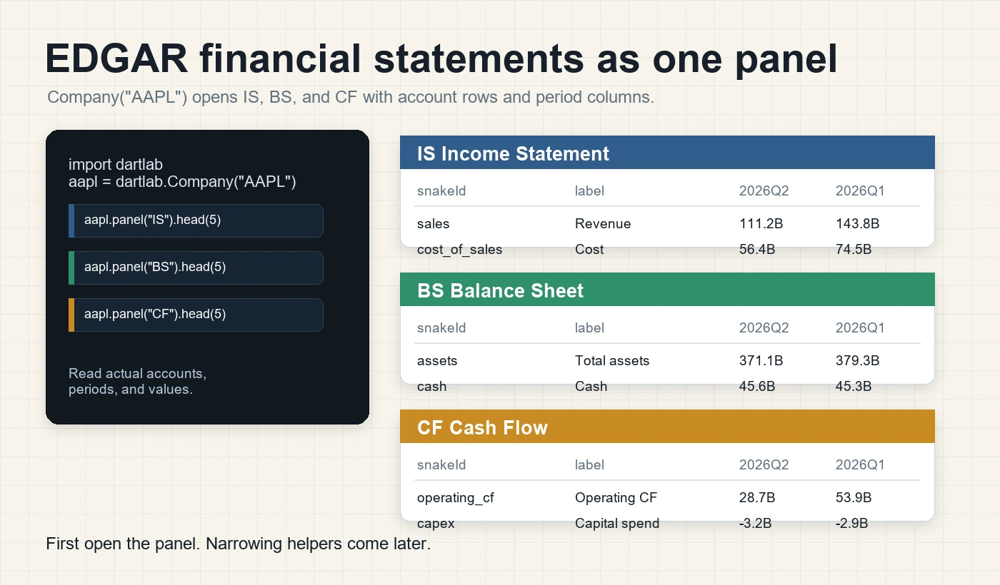
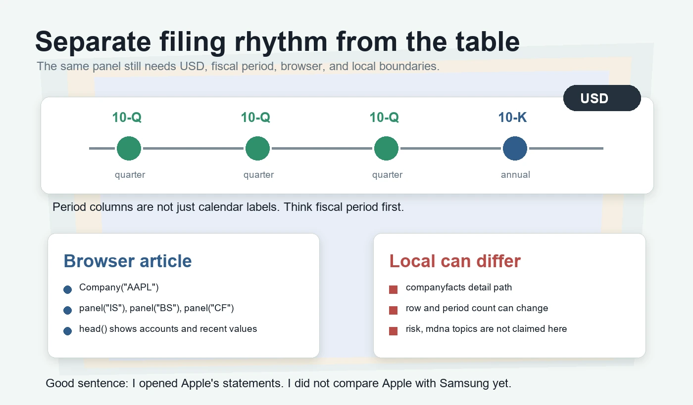

## Apple 재무제표를 먼저 연다

미국 회사도 첫 문은 똑같다. `Company("AAPL")`을 만들고, 이 회사가 미국 회사로 잡히는지 확인한다.

[DART EDGAR, 한 줄로 열기](/blog/dart-edgar-company)에서 삼성전자와 Apple을 같은 `Company` 입구로 열었다. 이번 편은 그다음 한 걸음이다. 이제 비교하지 않는다. Apple 하나만 놓고 EDGAR 재무제표 세 장이 `panel` 위에서 어떻게 펼쳐지는지 본다.

아직 `Company`가 낯설다면 [DART 종목코드, 회사 열기](/blog/pick-company-by-code)를 먼저 보면 된다. 국내 회사는 여섯 자리 종목코드로 열고, 미국 회사는 ticker로 연다. 더 큰 그림은 [DART 공시분석, 설치 없이](/blog/what-is-dartlab)에서 본 `panel`과 `scan`의 역할로 이어진다.

```python
import dartlab

aapl = dartlab.Company("AAPL")
aapl.market
```

결과가 `US`라면 출발은 맞다. `US`는 "미국 회사로 열렸다"는 표시다. 여기서 중요한 말은 "미국 회사가 열렸다"이지 "한국 회사와 비교할 준비가 끝났다"가 아니다. 비교하려면 통화, 기간, 회계연도 기준을 더 맞춰야 한다.

이번 편의 목적은 단순하다. Apple의 손익계산서, 재무상태표, 현금흐름표를 같은 표면으로 열어 본다. 표의 왼쪽에는 계정이 있고, 오른쪽에는 기간 값이 있다. 이 감각이 생기면 나중에 DART 회사와 EDGAR 회사를 같은 질문으로 읽을 수 있다.



## 손익계산서는 매출에서 시작한다

손익계산서는 회사가 얼마나 팔고, 얼마를 비용으로 쓰고, 얼마를 남겼는지 보는 표다. EDGAR에서도 먼저 `panel("IS")`를 연다.

```python
is_panel = aapl.panel("IS")
is_panel.head(5)
```

브라우저에서 이 셀을 실행하면 앞쪽에 `snakeId`와 `항목`이 보인다. 오른쪽에는 `2026Q2`, `2026Q1` 같은 기간 열이 이어진다. 첫 줄 근처에는 `sales`나 `revenue`처럼 매출을 뜻하는 줄이 보이고, 그 아래에는 `cost_of_sales` 같은 매출원가 줄이 보인다.

초보자는 여기서 "값이 너무 크다"라고 먼저 느낀다. 하지만 Apple의 값은 달러 기준이다. 한국 회사 표에서 보던 원화 숫자와 자릿수가 다르다. 이 숫자를 그대로 삼성전자 매출과 붙이면 안 된다.

또 하나 봐야 할 것이 있다. `snakeId`는 사람이 읽는 계정명이 아니다. 여러 회사의 계정 이름 흔들림을 줄이기 위한 표준 이름이다. 사람에게 익숙한 이름은 `항목` 열에 있다. 그래서 표를 볼 때는 왼쪽 두 열을 함께 본다. `snakeId`는 코드가 찾기 좋은 이름이고, `항목`은 사람이 읽기 좋은 이름이다.

[재무제표, 파이썬 한 줄](/blog/call-financial-statements)에서 배운 원칙이 여기서 그대로 이어진다. 먼저 전체 표를 열고, 앞줄을 본다. 바로 좁히지 않는다. 표가 어떤 계정과 기간을 들고 오는지 먼저 확인해야 한다.

## 재무상태표는 남아 있는 것을 본다

손익계산서가 "한 기간 동안 벌고 쓴 것"이라면, 재무상태표는 "그 시점에 남아 있는 것"을 본다. Apple의 자산, 현금, 부채, 자본 같은 줄은 `panel("BS")`에서 확인한다.

```python
bs_panel = aapl.panel("BS")
bs_panel.head(5)
```

앞줄에는 `assets`, `total_assets`, `current_assets`, `cash_and_cash_equivalents` 같은 줄이 나온다. `assets`는 자산총계, `current_assets`는 유동자산, `cash_and_cash_equivalents`는 현금및현금성자산이다.

여기서도 같은 습관을 쓴다. 첫째, 왼쪽 계정명을 본다. 둘째, 최근 기간 값을 본다. 셋째, 값이 비어 있거나 중복처럼 보이는 줄이 있으면 바로 판단하지 않는다. EDGAR 원천의 태그가 여러 방식으로 들어와 같은 의미가 여러 줄로 보일 수 있다.

이런 중복은 실패가 아니다. 오히려 공시 데이터를 기계가 읽을 때 생기는 흔한 장면이다. 처음부터 "한 줄만 정답"이라고 생각하면 표를 오해한다. 먼저 전체 표를 열고, 계정 후보가 어떤 이름으로 들어왔는지 본다. 나중에 분석할 때만 필요한 줄을 좁힌다.

## 현금흐름표는 돈의 이동을 본다

현금흐름표는 이익과 다르다. 회사가 실제로 현금을 얼마나 벌었고, 투자에 얼마나 썼고, 재무활동으로 얼마를 조달하거나 갚았는지 본다.

```python
cf_panel = aapl.panel("CF")
cf_panel.head(5)
```

앞줄에는 `cash_flows_from_operating_activities`, `operating_cashflow`, `operating_cash_flow` 같은 영업활동 현금흐름 줄이 보인다. 이름은 조금 다르지만 질문은 같다. "Apple이 영업으로 현금을 벌고 있는가"를 보기 위한 입구다.

여기서 이익과 현금을 섞으면 안 된다. 손익계산서의 매출과 이익은 발생주의 숫자다. 현금흐름표의 영업활동 현금흐름은 실제 현금 이동에 가까운 숫자다. 둘은 같이 읽어야 하지만 같은 말은 아니다.

초보자에게 좋은 순서는 이것이다.

1. `panel("IS")`로 매출과 비용을 본다.
2. `panel("BS")`로 자산과 현금을 본다.
3. `panel("CF")`로 영업현금흐름을 본다.
4. 세 표를 바로 합치지 말고 각 표가 대답하는 질문을 말로 분리한다.

이 순서를 지키면 표를 열자마자 결론을 쓰는 실수를 줄일 수 있다.

## 10-K와 10-Q 리듬을 따로 본다

Apple 표의 기간 열은 그냥 달력 열이 아니다. 미국 회사는 EDGAR에 10-K와 10-Q를 낸다. 10-K는 연간 보고서이고, 10-Q는 분기 보고서다.

```python
aapl.trace("IS")
```

이 셀은 손익계산서가 어떤 원천으로 선택됐는지 되짚는 용도다. `primarySource`가 `finance`로 나오면 지금 보는 표가 재무제표 원천에서 왔다는 뜻이다.

하지만 `finance`라고 해서 모든 것이 해결되는 것은 아니다. 10-K와 10-Q의 기간 기준은 회사의 회계연도와 연결된다. Apple의 최근 분기 열을 볼 때도 "몇 년 몇 분기"라는 이름만 보지 말고, 그 회사가 어떤 fiscal period로 공시했는지 의식해야 한다.



[재무제표 기간, Y와 Q 조회](/blog/the-grid)에서 배운 기간 감각이 여기서 다시 필요하다. DART 회사의 분기와 EDGAR 회사의 분기를 같은 달력 기간이라고 단정하면 안 된다. `panel`은 표를 열어 주지만, 표의 기간 의미까지 자동으로 투자 문장으로 바꿔 주지는 않는다.

## 원천 페이지를 같이 둔다

코드가 잘 돌아도 원천 페이지 감각은 따로 가져야 한다. dartlab은 표를 빨리 열어 주지만, EDGAR가 무엇을 보관하고 어떤 검색 화면을 제공하는지는 SEC 원천에서 확인하는 습관이 필요하다.

가장 먼저 볼 곳은 [SEC Search Filings](https://www.sec.gov/search-filings)다. 회사명, ticker, CIK, filing type 같은 조건으로 EDGAR 공시를 찾는 공식 입구다. 더 넓게 본문 단어까지 찾고 싶으면 [EDGAR Full Text Search](https://www.sec.gov/edgar/search/)를 쓴다. 이 페이지는 공시 문서 안의 문구를 검색하고 기간, 회사, filing category로 좁히는 화면이다.

데이터 API의 존재도 알아 두면 좋다. [SEC EDGAR Application Programming Interfaces](https://www.sec.gov/search-filings/edgar-application-programming-interfaces)는 companyfacts 같은 EDGAR API 경로를 설명한다. 실제 데이터 API의 입구는 [data.sec.gov](https://data.sec.gov/)다. 이번 편에서 로컬 companyfacts 경로와 브라우저 공개 artifact가 다를 수 있다고 한 이유도 이런 원천 데이터 경로를 생각하면 이해하기 쉽다.

10-K와 10-Q의 의미가 헷갈리면 [Investor.gov의 10-K와 10-Q 읽기 안내](https://www.investor.gov/introduction-investing/general-resources/news-alerts/alerts-bulletins/how-read)를 같이 본다. 10-K는 연간 보고서이고, 10-Q는 첫 세 분기의 분기 보고서라는 감각을 잡는 데 충분하다. EDGAR 자체의 역할은 [About EDGAR](https://www.sec.gov/submit-filings/about-edgar)에서 확인할 수 있다.

이 링크들을 외울 필요는 없다. 중요한 것은 방향이다. 브라우저 글에서는 `panel`로 실제 표를 열고, 원천이 궁금해지면 SEC 검색 화면이나 API 설명으로 돌아간다. 표를 여는 도구와 공시를 제출하고 보관하는 원천을 구분해야 문장이 단단해진다.

## 브라우저와 로컬 결과는 다를 수 있다

이번 글의 코드는 브라우저에서 실행되는 공개 계약 안에 있다. `dartlab.Company`, `market`, `panel`, `head`, `trace`만 쓴다. 독자는 글 안에서 그대로 실행할 수 있다.

다만 브라우저 공개 artifact와 로컬 설치본의 세부 경로가 항상 같은 행과 기간 열을 보여 준다고 말하면 안 된다. 커리큘럼 실측에서는 브라우저 쪽 Apple 재무 panel과 로컬 companyfacts 경로의 행과 기간 열 개수가 서로 달랐다. 이 차이는 글의 실패가 아니라 데이터 공급 경로의 차이다.

그래서 이 편에서는 "몇 행 몇 열이 정답"이라고 외우지 않는다. 더 중요한 것은 표의 구조다. 왼쪽은 계정, 오른쪽은 기간 값이다. IS, BS, CF가 같은 방식으로 열린다. 그리고 원천과 기간 기준은 따로 확인한다.

또 하나 경계를 세운다. 이번 편은 EDGAR 재무제표만 다룬다. `risk`, `mdna`, `item1Business` 같은 EDGAR 본문 섹션이 브라우저에서 DART 사업보고서 본문처럼 모두 열린다고 말하지 않는다. 확인한 것은 Apple의 재무 panel이다. 확인하지 않은 것은 다음 편의 결론으로 끌고 오지 않는다.

## 이렇게 오해하면 안 된다

첫째, Apple 재무제표를 열었다고 Apple을 분석한 것은 아니다. 분석은 숫자의 의미를 비교하고, 기간을 맞추고, 원천을 확인한 뒤에 시작한다. 지금은 표를 제대로 연 것이다.

둘째, Apple 숫자가 달러라는 점을 잊으면 안 된다. 한국 회사의 원화 숫자와 그대로 붙이면 숫자 크기 착시가 생긴다.

셋째, `panel("IS")`, `panel("BS")`, `panel("CF")`가 모두 된다고 EDGAR 본문 전체가 같은 방식으로 된다고 말하면 안 된다. 재무제표와 본문 섹션은 다른 문제다.

넷째, 계정명이 여러 줄로 보인다고 바로 틀렸다고 말하면 안 된다. 공시 원천의 태그와 표준 이름이 겹치면 비슷한 의미의 줄이 여러 개 보일 수 있다. 먼저 표를 보고, 나중에 필요한 줄을 고른다.

## 다음 편으로 넘어가기 전 행동 검사

첫 번째 검사는 시장 확인이다. `aapl.market`을 실행하고 `US`가 나오는지 본다. 이 한 줄을 보고 Apple이 EDGAR 쪽 회사로 열렸다고 말할 수 있어야 한다.

두 번째 검사는 세 표 확인이다. `aapl.panel("IS").head(5)`, `aapl.panel("BS").head(5)`, `aapl.panel("CF").head(5)`를 차례로 실행한다. 세 결과 모두 왼쪽 계정과 오른쪽 기간 값으로 보이는지 확인한다.

세 번째 검사는 문장 고치기다. "Apple과 삼성전자의 매출을 비교했다"라고 쓰지 않는다. "Apple의 EDGAR 손익계산서를 `panel("IS")`로 열었다"라고 쓴다. 비교는 아직 하지 않았다.

네 번째 검사는 원천 되짚기다. `aapl.trace("IS")`를 실행하고 `primarySource`가 무엇인지 본다. 이 검사는 자동 결과를 무조건 믿지 않고, 표가 어디서 왔는지 돌아보는 습관이다.

## 다음 편에서 할 것

이번 편에서는 EDGAR 재무제표 세 장을 같은 `panel` 표면으로 열었다. 손익계산서는 벌고 쓴 것, 재무상태표는 남아 있는 것, 현금흐름표는 돈의 이동을 보여 준다. 세 표는 같은 코드 흐름으로 열리지만 같은 질문을 대답하지 않는다.

다음 편에서는 다시 DART 사업보고서로 돌아간다. 숫자 표만 보는 것이 아니라 `chapter`, `sectionLeaf`, `blockLeaf` 같은 위치 정보를 통해 사업보고서 본문이 `panel` 위에서 어떻게 펼쳐지는지 본다. 오늘 기억할 한 줄은 이것이다. **미국 재무제표도 panel로 열되, 통화와 기간 기준은 따로 확인한다.**
