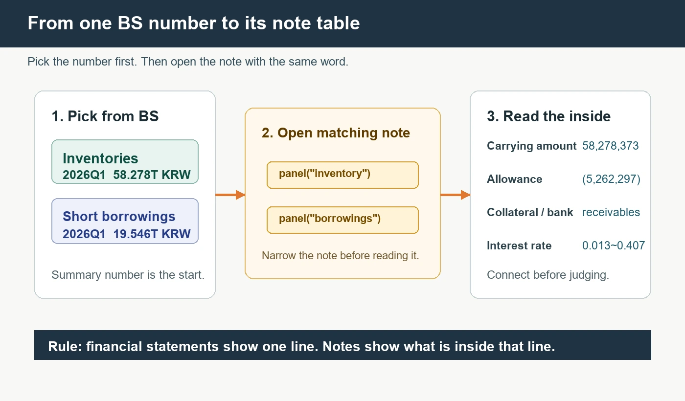
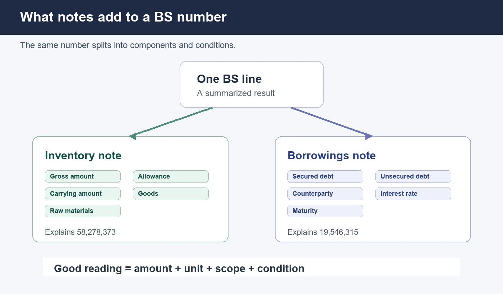

## 재고자산 58조가 주석에서 그대로 다시 나온다

삼성전자 재무상태표에는 재고자산이 딱 한 줄, 약 58.278조원으로 적혀 있다. 그런데 같은 보고서의 주석으로 들어가면 `58,278,373`이라는 숫자가 나온다. 자릿수만 다를 뿐 같은 수다. 재무제표의 한 줄과 주석 표의 합계가 정확히 맞물리는 이 장면이 이번 편의 전부다.

주석은 재무제표 뒤에 붙은 부록처럼 보이지만, 실제로는 그 한 줄이 무엇으로 쪼개지는지 보여 주는 옆방이다. 재고자산 58조는 제품, 반제품, 원재료로 나뉘고 평가충당금이 붙어 장부금액이 된다. 차입금 한 줄은 담보부와 무담보, 거래상대방, 이자율로 갈라진다. 이번 편은 재무상태표(BS)에서 숫자 하나를 고르고, 같은 단어의 주석 표를 열어 그 속을 확인하는 연습이다.

재무제표가 낯설면 [재무제표, 파이썬 한 줄](/blog/call-financial-statements)을, 사업보고서에서 주석이 어디 있는지는 [사업보고서, 코드로 열기](/blog/business-report-panel)를 먼저 보면 된다. 바로 앞 편 [사업보고서, 코드로 읽기](/blog/business-content-panel)에서 사업 본문을 읽었다면, 이번 편은 숫자와 그 숫자의 설명을 잇는 자리다.

```python
import dartlab
import re


def cleanText(value, limit=260):
    text = re.sub(r"<[^>]+>", " ", str(value or ""))
    text = text.replace("\\n", " ").replace("&nbsp;", " ")
    text = re.sub(r"\s+", " ", text).strip()
    return text[:limit] + ("..." if len(text) > limit else "")


def wonToJo(value):
    if value is None:
        return "값 없음"
    return f"{float(value) / 1_000_000_000_000:.3f}조원"


def findAccountRows(frame, keyword):
    rows = frame[["snakeId", "항목", "2026Q1", "2025Q4"]].to_dicts()
    found = []
    for row in rows:
        name = str(row.get("항목") or row.get("snakeId") or "")
        if keyword in name:
            found.append({
                "항목": name,
                "2026Q1": wonToJo(row.get("2026Q1")),
                "2025Q4": wonToJo(row.get("2025Q4")),
            })
    return found


def noteRows(frame, n=4):
    rows = frame[["sectionLeaf", "blockLeaf", "leafType", "2026Q1", "2025Q4"]].to_dicts()
    out = []
    for row in rows:
        now = cleanText(row.get("2026Q1"), 260)
        prev = cleanText(row.get("2025Q4"), 160)
        if not now and not prev:
            continue
        out.append({
            "위치": row["sectionLeaf"],
            "블록": row["blockLeaf"],
            "종류": row["leafType"],
            "2026Q1": now,
            "2025Q4": prev,
        })
        if len(out) >= n:
            break
    return out


c = dartlab.Company("005930")
c.market
```

결과가 `KR`이면 삼성전자가 DART 회사로 열렸다. 위 셀의 헬퍼는 숫자를 조 단위로 바꾸고 주석 원문의 태그를 지워, 앞으로 볼 표에 재고자산과 차입금의 실제 값만 남게 한다.

## 주석 전체 지도를 먼저 훑는다

숫자 하나를 잡기 전에, 주석이라는 방이 어떻게 생겼는지 한 번 본다.

```python
notesMap = c.panel("주석")
noteRows(notesMap, 3)
```

결과에는 `III. 재무에 관한 사항`, `연결재무제표 주석` 같은 위치만 보인다. 아직 재고도 차입도 안 보인다. 이건 주석 전체의 목차이기 때문이다.

주석은 교과서처럼 친절한 순서로 쓰인 글이 아니다. 회계 기준, 회사 범위, 표, 설명이 한 덩어리로 붙어 있어서 처음부터 통째로 읽으면 길을 잃는다. 순서를 뒤집는 게 요령이다. 먼저 BS에서 알고 싶은 숫자 하나를 고르고, 그 이름으로 주석을 좁혀 들어간다.



## BS에서 재고자산을 먼저 본다

재고자산은 회사가 팔기 전 보유한 제품, 상품, 반제품, 재공품, 원재료 같은 자산이다. BS에서는 한 줄 숫자로 보인다. 먼저 BS에서 재고자산 줄만 찾는다.

```python
bs = c.panel("BS")
findAccountRows(bs, "재고")
```

실행 결과는 2026Q1 재고자산이 약 58.278조원, 2025Q4 재고자산이 약 52.637조원이라고 보여 준다. 여기서 멈추면 "재고가 늘었다"는 말밖에 못 한다. 그런데 주석으로 들어가면 이 숫자가 평가전금액, 평가충당금, 장부금액으로 나뉘어 보인다.

이 차이가 중요하다. BS 숫자는 요약이다. 주석은 요약 숫자의 속이다. 재고자산 한 줄만 보고 회사의 재고 부담을 단정하면 안 된다. 어떤 재고가 있는지, 평가충당금이 붙었는지, 장부금액이 얼마인지 같이 봐야 한다.

## 재고 주석에서 장부금액을 본다

이제 재고 주석으로 들어간다.

```python
inventoryNote = c.panel("재고")
noteRows(inventoryNote, 4)
```

연결재무제표 주석의 재고자산 표에는 `평가전금액`, `재고자산 평가충당금`, `장부금액`이 함께 보인다. 2026Q1 연결 재고자산 표의 합계 장부금액은 `58,278,373`으로 나온다. 이것을 백만원 단위 숫자로 읽으면 BS에서 본 재고자산 약 58.278조원과 같은 크기다.

여기서 배울 것은 어려운 회계가 아니다. "BS의 재고자산 한 줄은 주석 표의 장부금액 합계와 이어진다"는 감각이다. 주석 표를 보면 재고가 제품 및 상품, 반제품 및 재공품, 원재료 및 저장품, 미착품으로 나뉜다. 그리고 각 묶음에 평가충당금이 붙어 장부금액이 된다.

나쁜 읽기: "재고자산이 58.278조원이다."

좋은 읽기: "2026Q1 BS 재고자산은 약 58.278조원이고, 재고 주석의 연결 기준 합계 장부금액 `58,278,373`과 같은 크기로 이어진다. 주석 표에서는 제품 및 상품, 반제품 및 재공품, 원재료 및 저장품, 미착품으로 나뉜다."

좋은 문장은 길어서 좋은 것이 아니다. 한 줄 숫자와 그 숫자의 속을 같이 말하기 때문에 좋다.

## 차입금도 같은 방식으로 본다

이번에는 부채 쪽 숫자를 본다. 차입금은 회사가 빌린 돈이다. BS에서는 단기차입금과 장기차입금으로 나뉘어 보인다.

```python
findAccountRows(bs, "차입")
```

2026Q1에는 단기차입금이 약 19.546조원, 장기차입금이 약 7.394조원으로 보인다. 단기와 장기의 차이는 단순히 이름 차이가 아니다. 언제 갚아야 하는지, 어떤 상대방에게 빌렸는지, 담보가 있는지, 이자율이 어느 정도인지가 주석에서 더 보인다.

이 숫자를 볼 때도 결론을 서두르지 않는다. "차입금이 많다"는 문장은 쉽지만 약하다. 주석으로 들어가야 어떤 차입인지 말할 수 있다.

## 차입 주석은 조건을 보여 준다

차입 주석을 연다.

```python
borrowingsNote = c.panel("차입")
noteRows(borrowingsNote, 4)
```

연결재무제표 주석의 차입금 표에는 담보부차입금, 무담보차입금, 거래상대방, 연이자율, 단기차입금 합계가 보인다. 2026Q1 단기차입금 합계는 `19,546,315`로 나온다. 이것은 BS에서 본 단기차입금 약 19.546조원과 같은 크기로 이어진다.

주석 표에는 "담보부차입금과 관련하여 매출채권을 담보로 제공하였습니다" 같은 설명도 붙는다. 이 문장은 단순한 숫자가 아니다. 숫자가 어떤 조건을 갖고 있는지 알려 주는 문장이다.

별도 재무제표 주석 쪽에는 장기차입금 표도 보인다. 거기에는 리스 부채, 은행차입금, 거래상대방, 만기일, 연이자율 같은 말이 같이 나온다. 그래서 차입금은 한 줄 금액만 보면 부족하다. 금액, 기간, 상대방, 이자율, 담보 설명을 함께 봐야 한다.



## 숫자가 안 맞아 보이면 세 가지를 본다

주석을 처음 보면 BS 숫자와 안 맞아 보일 때가 있다. 이때 바로 오류라고 생각하지 말고 세 가지를 확인한다.

첫째, 단위다. 방금 본 재고 주석의 `58,278,373`은 BS의 `58,278,373,000,000`과 같은 수다. 단위만 다르다. 같은 자리로 맞추면 연결이 보인다.

둘째, 범위다. `연결`이 붙은 표는 종속기업까지 포함한 기준이고, 별도 표는 삼성전자 법인 하나만 본 것이다. 재고 주석에도 연결 재고자산 표와 별도 재고자산 표가 따로 있다.

셋째, 줄 이름이다. BS에는 `재고자산`, `단기차입금`처럼 짧은 이름이, 주석에는 제품 및 상품, 담보부차입금처럼 더 잘게 쪼갠 이름이 붙는다. 이름이 많아졌다고 다른 숫자가 아니다.

그리고 늘 기간을 맞춘다. BS에서 `2026Q1` 재고자산을 봤으면 주석에서도 `2026Q1` 칸을 본다. `2025Q4`는 비교 기준일 뿐, 두 기간을 섞어 한 숫자로 만들면 안 된다. 기간 감각은 [재무제표 기간, Y와 Q 조회](/blog/the-grid)에서 다뤘다.

초보자가 가장 자주 틀리는 장면이 여기서 나온다. 재고자산 58.278조원을 보고 주석의 제품 및 상품 13.786조원만 가져와 "재고가 13.786조원"이라고 쓰는 식이다. 제품 및 상품은 재고자산의 한 조각이다. 반제품, 원재료, 미착품이 더해지고 평가충당금이 반영돼야 장부금액 합계가 된다. 차입금도 같다. 단기차입금 합계를 보고 담보부차입금만 읽으면 전체를 착각한다. 한 줄 숫자와 주석 표의 부분 항목을 섞지 않는 것, 이게 주석 읽기의 첫 안전장치다.

## 확인한 것과 확인하지 않은 것

이번 편의 코드는 브라우저 안에서 그대로 돈다. `Company`, `market`, `panel`과 표를 짧게 다듬는 헬퍼가 전부다. 시세, 뉴스, 수급, 공시 알림은 여기서 다루지 않는다.

경계도 분명히 둔다. [EDGAR 재무제표, 코드 실행](/blog/edgar-financial-panel)에서 연 것은 Apple 재무 panel이다. `Company("AAPL")`이 된다고 미국 주석도 DART 주석과 같은 방식으로 열린다고 말하지 않는다. 확인한 것은 삼성전자 재고와 차입 주석뿐이다. 원문이 궁금하면 원천으로 돌아간다. 국내는 [DART 전자공시시스템](https://dart.fss.or.kr/)과 [회사별 검색](https://dart.fss.or.kr/dsab001/main.do), API 흐름은 [OpenDART 공시정보 개발가이드](https://opendart.fss.or.kr/guide/main.do?apiGrpCd=DS001), 미국은 [SEC Search Filings](https://www.sec.gov/search-filings)와 [EDGAR Full Text Search](https://www.sec.gov/edgar/search/)가 입구다.

한 가지만 남는다. 이 글은 재고가 좋은지, 차입금이 위험한지 판단하는 편이 아니다. 숫자와 그 설명을 잇는 편이다. 판단은 연결한 다음에 온다.

## 자주 걸리는 함정 셋

첫째, `panel("주석")`은 주석을 요약하지 않는다. 전체 목차를 펼칠 뿐이다. 숫자 하나를 정하고 그 이름으로 좁혀 들어가야 내용이 나온다.

둘째, 연결과 별도를 섞지 않는다. 같은 `재고자산`이라도 연결 표(종속기업 포함)와 별도 표(법인 하나)는 범위가 다르다. 겹쳐 읽으면 숫자가 어긋난다.

셋째, 부분을 전체로 착각하지 않는다. 주석의 제품 및 상품 약 13.786조원은 재고자산 58.278조원의 한 조각이다. 담보부차입금도 단기차입금 전체가 아니라 그 안의 한 갈래다.

## 다음 편에서 할 것

이번 편은 BS 한 줄 숫자를 주석 표로 이었다. 재고자산은 장부금액과 평가충당금으로, 차입금은 담보와 상대방과 이자율로 쪼개졌다. 다음 편에서는 필요한 줄을 이름으로 더 정확히 찾는다. "매출액이 어디 있지" 같은 질문을 코드로 어떻게 푸는지, 왜 단어보다 표면(IS, BS, CF)을 먼저 골라야 하는지 본다.

오늘 기억할 한 줄은 이것이다. **재무제표 숫자는 한 줄이고, 주석은 그 한 줄의 속이다.**
