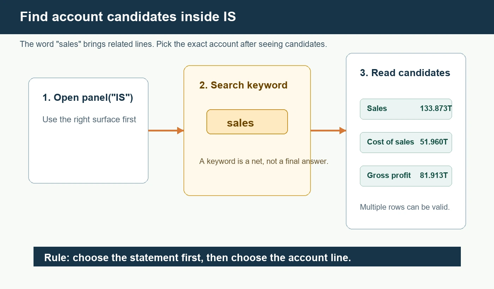
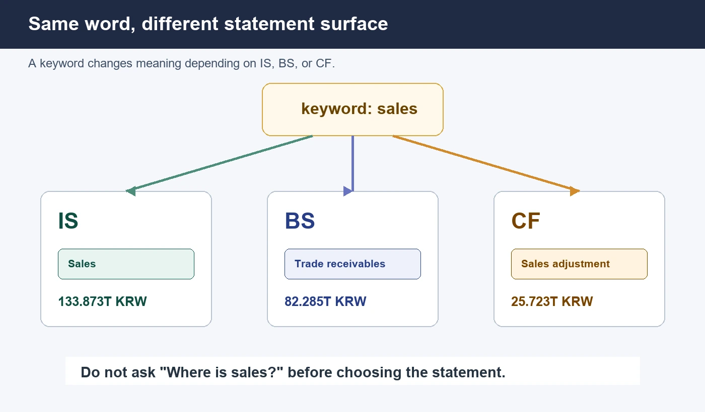

## "매출"로 검색하면 세 줄이 나온다

`매출`로 계정을 찾으면 한 줄이 아니라 세 줄이 뜬다. 매출액, 매출원가, 매출총이익. 셋 다 매출이라는 단어를 달고 있지만 뜻은 전혀 다르다. 계정 찾기의 첫 실수는 못 찾는 게 아니라, 비슷한 이름을 하나 찾고 나서 같은 뜻으로 읽어 버리는 것이다.

숫자로 보면 더 분명하다. 같은 손익계산서에서 `영업`을 찾으면 영업이익이 나오는데, 2026Q1은 약 57.233조원, 2025Q1은 약 6.685조원으로 8배 넘게 뛴다. 이런 값을 정확히 읽으려면 그 줄이 어느 표에서 나온 계정인지부터 분명해야 한다. 단어보다 표면(IS/BS/CF)이 먼저다.

이번 편은 그 순서를 코드로 익힌다. `매출`, `영업`, `순이익`, `현금` 같은 단어를 IS, BS, CF에서 각각 찾아 보고, 같은 단어가 표에 따라 다른 계정을 부른다는 사실을 눈으로 확인한다. 매출액은 손익계산서에, 매출채권은 재무상태표에 있다. 둘 다 `매출`이 들어가지만 같은 줄이 아니다.

바탕은 앞 편들이다. 지난 편 [재무제표 주석, 코드로 연결](/blog/notes-link-to-numbers)에서는 BS 숫자 하나를 골라 같은 단어의 주석 표로 들어갔다. 재무제표 세 장을 처음 여는 법은 [재무제표, 파이썬 한 줄](/blog/call-financial-statements), 기간 칸 감각은 [재무제표 기간, Y와 Q 조회](/blog/the-grid)에 있다. 사업보고서 전체 위치를 먼저 보는 감각은 [사업보고서, 코드로 열기](/blog/business-report-panel)에서 배웠다. 원칙은 같다. 전체를 통째로 외우지 않고, 먼저 표면을 고르고 그다음 필요한 줄을 좁힌다.

```python
import dartlab


def valueText(value):
    if value is None:
        return "값 없음"
    value = float(value)
    if abs(value) >= 1_000_000_000:
        return f"{value / 1_000_000_000_000:.3f}조원"
    return f"{value:,.0f}"


def findRows(frame, keyword, n=8):
    rows = frame[["snakeId", "항목", "2026Q1", "2025Q1"]].to_dicts()
    found = []
    for row in rows:
        name = str(row.get("항목") or row.get("snakeId") or "")
        sid = str(row.get("snakeId") or "")
        if keyword in name or keyword.lower() in sid.lower():
            found.append({
                "항목": name,
                "2026Q1": valueText(row.get("2026Q1")),
                "2025Q1": valueText(row.get("2025Q1")),
            })
        if len(found) >= n:
            break
    return found


c = dartlab.Company("005930")
c.market
```

결과가 `KR`이면 DART 회사로 열렸다. 여기서 `findRows`는 계정 이름 후보를 보여 주는 작은 도구다. 중요한 것은 도구 이름이 아니라 읽는 순서다. 먼저 `panel("IS")`, `panel("BS")`, `panel("CF")` 중 어떤 표를 볼지 정하고, 그 안에서 단어를 찾는다.

## 매출은 IS에서 찾는다

매출액은 손익계산서의 출발점이다. 그래서 먼저 IS를 연다.

```python
isPanel = c.panel("IS")
findRows(isPanel, "매출")
```

결과에는 `매출액`, `매출원가`, `매출총이익`이 같이 나온다. 2026Q1 칸에는 매출액 약 133.873조원, 매출원가 약 51.960조원, 매출총이익 약 81.913조원이 보인다.

여기서 배울 것은 "매출"이라는 단어 하나가 딱 한 줄만 뜻하지 않는다는 점이다. 매출액은 회사가 판 금액이다. 매출원가는 그 매출을 만들기 위해 들어간 비용이다. 매출총이익은 매출액에서 매출원가를 뺀 뒤 남은 큰 이익이다. 셋은 한 묶음으로 가까이 있지만 같은 말이 아니다.

나쁜 읽기: "매출 검색 결과가 세 줄이라 이상하다."

좋은 읽기: "`매출`이라는 단어가 들어간 계정 후보가 세 줄 나온 것이다. 내가 필요한 줄이 매출액인지, 매출원가인지, 매출총이익인지 고른다."

실제로 글을 쓸 때는 여기서 한 번 더 멈춘다. "매출이 133.873조원"이라고 쓰려면 후보 중 `매출액` 줄을 골랐다는 뜻이어야 한다. `매출총이익`을 보고 같은 문장을 쓰면 틀린다. 매출총이익은 매출액에서 매출원가를 뺀 뒤 남은 값이다. 이름이 비슷하다고 같은 계정이 아니다.

반대로 매출원가를 보고 "비용"이라고만 쓰는 것도 약하다. 매출원가는 매출과 직접 연결된 비용이다. 판매비와관리비, 기타비용, 금융비용과는 다른 줄이다. 계정 찾기에서 첫 번째 실수는 못 찾는 것이 아니라, 비슷한 이름을 찾고 나서 같은 뜻으로 읽어 버리는 것이다.



## 영업이익은 매출 옆 질문이다

매출을 봤다면 다음 질문은 보통 이익이다. 회사가 많이 팔아도 비용을 많이 쓰면 영업이익은 작을 수 있다. 이번에는 IS 안에서 `영업`을 찾는다.

```python
findRows(isPanel, "영업")
```

결과에는 `영업이익`이 보인다. 2026Q1 영업이익은 약 57.233조원, 2025Q1 영업이익은 약 6.685조원으로 표시된다. 이 숫자를 보고 바로 투자 판단을 쓰지는 않는다. 지금은 계정을 찾는 연습이다.

중요한 것은 매출액과 영업이익을 같은 표에서 같이 찾았다는 점이다. 둘 다 손익계산서의 흐름 안에 있다. 다음 편에서 이 두 값을 직접 나누면 영업이익률을 계산할 수 있다. 하지만 계산은 다음 단계다. 이번 편은 필요한 줄을 정확히 고르는 단계다.

## 순이익은 단어가 더 넓다

이번에는 `순이익`을 찾는다.

```python
findRows(isPanel, "순이익")
```

결과에는 법인세비용차감전순이익, 당기순이익, 지배주주지분 당기순이익, 주당순이익 같은 후보가 같이 보일 수 있다. 이때 당황하지 않는다. 단어가 넓으면 후보가 넓어진다.

당기순이익은 회사의 최종 이익에 가깝다. 지배주주지분 당기순이익은 연결 기준에서 지배주주 몫을 따로 본 것이다. 주당순이익은 금액 단위가 아니라 주당 금액이다. 그래서 `순이익`이라는 단어가 들어갔다고 전부 같은 숫자로 보면 안 된다.

초보자에게 가장 중요한 습관은 후보를 버리지 않고 이름을 읽는 것이다. 후보가 여러 개 나온 것은 실패가 아니다. 오히려 계정 이름이 얼마나 비슷하게 생겼는지 보여 주는 좋은 결과다.

## 다른 표에서 찾으면 다른 뜻이 나온다

이제 일부러 다른 표에서 `매출`을 찾아 본다. BS를 연다.

```python
bsPanel = c.panel("BS")
findRows(bsPanel, "매출")
```

여기서는 매출액이 아니라 `매출채권및기타채권`이 나온다. 이것은 오류가 아니다. BS는 재무상태표다. 여기서 매출채권은 이미 판 물건이나 서비스 대가를 아직 받지 못한 권리에 가깝다. 손익계산서의 매출액과 이름이 비슷하지만 성격이 다르다.

이 예시는 아주 중요하다. "매출액이 안 보인다"는 말은 두 가지일 수 있다. 첫째, 정말 단어를 잘못 찾았을 수 있다. 둘째, 보고 있는 표가 다를 수 있다. 매출액을 찾고 싶으면 먼저 IS를 열어야 한다.



## 현금은 CF에서 넓게 나온다

현금흐름표에서는 `현금`이라는 단어가 자주 나온다. CF를 열고 찾아 본다.

```python
cfPanel = c.panel("CF")
findRows(cfPanel, "현금")
```

결과에는 영업활동현금흐름, 영업에서창출된현금흐름, 투자활동현금흐름, 재무활동현금흐름, 현금의 증가 같은 후보가 나온다. 여기서도 한 줄만 정답이라고 생각하면 안 된다.

현금흐름표는 현금이 어디서 들어오고 어디로 나갔는지 나누는 표다. 영업활동현금흐름은 본업에서 생긴 현금에 가깝고, 투자활동현금흐름은 설비나 투자자산과 연결되며, 재무활동현금흐름은 차입, 상환, 배당 같은 자금 조달과 연결된다. 그래서 `현금` 검색 결과가 넓게 나오는 것은 자연스럽다.

여기서도 먼저 질문을 좁힌다. "회사가 장사를 해서 현금을 벌었나"가 궁금하면 영업활동현금흐름을 본다. "설비투자나 투자자산 때문에 현금이 나갔나"가 궁금하면 투자활동현금흐름을 본다. "돈을 빌렸나, 갚았나, 배당했나"가 궁금하면 재무활동현금흐름을 본다. 같은 현금이라는 단어가 들어가도 질문이 서로 다르다.

초보자는 현금흐름표 후보를 보고 가장 큰 값 하나를 고르기 쉽다. 하지만 계정 찾기에서 큰 값이 항상 정답은 아니다. 질문에 맞는 줄이 정답이다. 매출액을 찾을 때 매출총이익을 고르면 안 되는 것처럼, 현금을 찾을 때도 영업, 투자, 재무 활동을 구분해야 한다.

## 빈 결과는 실패가 아닐 수 있다

계정 찾기에서 가장 중요한 태도는 빈 결과를 보는 법이다. 어떤 단어를 넣었는데 아무것도 안 나오면 세 가지를 확인한다.

첫째, 표가 맞는가. 매출액은 IS, 재고자산은 BS, 영업활동현금흐름은 CF에 있다.

둘째, 단어가 너무 좁거나 넓지 않은가. `순이익`은 넓고, `지배주주지분`은 더 좁다. `매출`은 매출액, 매출원가, 매출총이익을 함께 부른다.

셋째, 회사와 기준이 맞는가. DART 회사와 EDGAR 회사는 계정 이름과 표시 방식이 다를 수 있다. [EDGAR 재무제표, 코드 실행](/blog/edgar-financial-panel)에서 본 Apple 재무 panel과 이번 DART 예시를 바로 같은 이름 체계로 섞으면 안 된다.

빈 결과는 "데이터가 없다"일 수도 있지만, "질문이 아직 정확하지 않다"일 수도 있다. 그래서 먼저 표면을 고르고, 그다음 단어를 조절한다.

단어를 조절할 때는 넓게 시작하고 좁게 들어간다. `매출`로 후보를 보고, 그다음 `매출액`을 고른다. `순이익`으로 후보를 보고, 그다음 `당기순이익`과 `지배주주지분 당기순이익`을 구분한다. 처음부터 너무 긴 계정명을 완벽히 맞히려고 하면 오히려 실패하기 쉽다.

또 하나의 방법은 반대 단어를 넣어 보는 것이다. 매출액을 찾다가 헷갈리면 `매출원가`와 `매출총이익`도 같이 확인한다. 영업이익을 찾을 때는 `영업`으로 넓게 보고, CF에서는 `영업활동현금흐름`이 전혀 다른 표의 계정이라는 점을 확인한다. 같은 단어가 다른 표면에서 다른 질문에 답한다는 사실을 계속 확인해야 한다.

실전에서는 결과를 지우지 말고 옆에 두는 것이 좋다. 매출 후보, 영업 후보, 순이익 후보를 각각 보고 나면 "내가 계산에 쓸 줄"을 하나씩 표시한다. 이 표시가 없으면 다음 편에서 숫자를 계산할 때 어떤 줄을 가져왔는지 금방 잊는다. 계정 찾기는 계산 전 준비 운동이 아니라 계산의 절반이다.

특히 블로그나 노트북에 결과를 남길 때는 계정 이름을 숫자 옆에 같이 적는다. `133.873조원`만 적으면 나중에 그것이 매출액인지 매출총이익인지 헷갈린다. `매출액 133.873조원`이라고 적어야 다음 계산이 이어진다.

다음 편의 계산은 이 표시를 믿고 시작하니, 오늘 고른 줄이 내일의 계산 근거가 된다. 숫자는 혼자 두면 기억이 흐려지므로 계정 이름과 기간과 표면을 같이 적어야, 다시 열었을 때도 같은 줄을 찾고 계산 결과를 검산할 수 있다.

## 원천 감각을 유지한다

국내 공시 원천은 [DART 전자공시시스템](https://dart.fss.or.kr/)이다. 회사 공시를 직접 찾고 싶으면 [DART 회사별 검색](https://dart.fss.or.kr/dsab001/main.do)을 쓴다. API와 원천 파일 흐름은 [OpenDART 공시정보 개발가이드](https://opendart.fss.or.kr/guide/main.do?apiGrpCd=DS001)에서 확인한다.

미국 공시는 [SEC Search Filings](https://www.sec.gov/search-filings)와 [EDGAR Full Text Search](https://www.sec.gov/edgar/search/)가 원천 검색 입구다. 이 링크들은 외우기용이 아니다. 계정 이름이 이상해 보이거나 같은 단어가 다른 뜻으로 보일 때 원문으로 되돌아가는 길이다.

## 자주 걸리는 함정 셋

- `매출` 결과가 세 줄이라도 실패가 아니다. 매출액, 매출원가, 매출총이익 후보가 함께 나온 것이니 필요한 줄을 하나 고른다.
- BS에서 `매출`을 찾으면 매출액이 아니라 매출채권이 나온다. 표가 다르면 뜻도 다르니, 매출액은 IS에서 찾는다.
- `순이익`이 들어간 줄을 다 같은 숫자로 보면 안 된다. 당기순이익, 지배주주지분 당기순이익, 주당순이익은 서로 다르다.

## 다음 편에서 할 것

이번 편은 필요한 줄을 이름으로 찾았다. 매출액, 매출원가, 매출총이익, 영업이익, 순이익, 현금흐름 후보를 실제 값으로 확인했지만 아직 나누지는 않았다. 여기 쓴 코드는 `dartlab.Company`, `market`, `panel`과 후보를 줄이는 헬퍼만 쓰는, 브라우저에서 그대로 도는 범위다. 다음 편에서는 이 줄들을 가져와 매출액과 영업이익으로 영업이익률을 계산하고, 그 숫자가 어떤 기간과 기준에서 나왔는지 함께 적는다. 오늘 기억할 한 줄은 이것이다. **계정을 찾을 때는 단어보다 표면이 먼저다.**
