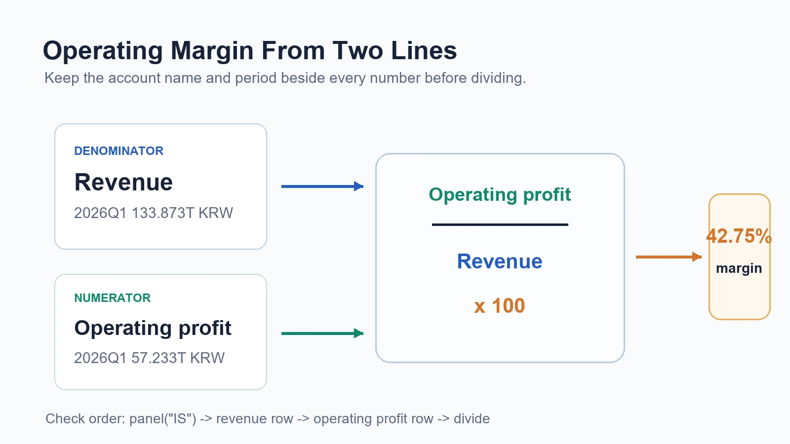
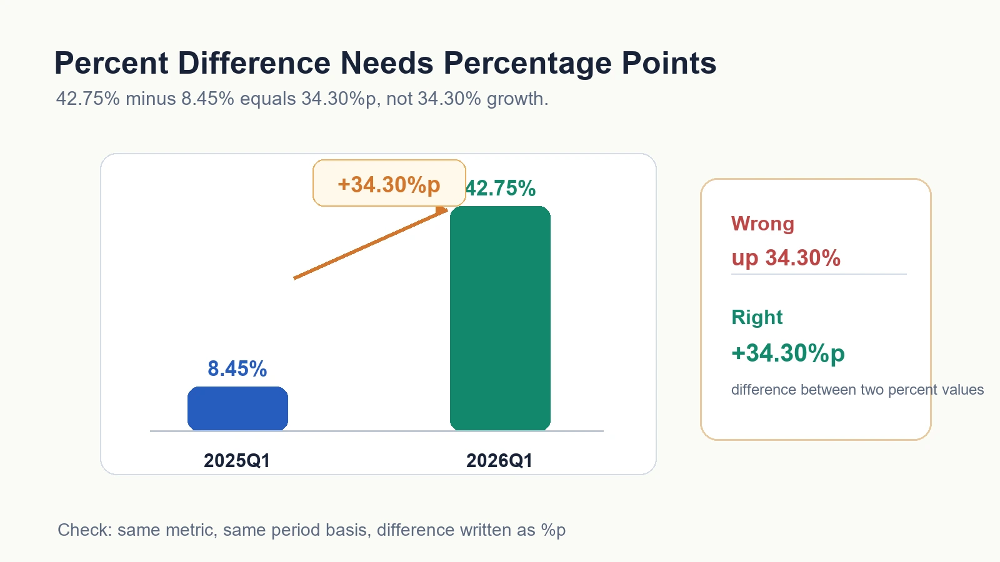

## 삼성전자 영업이익률이 8.45%에서 42.75%로 뛴다

삼성전자 영업이익률은 2025Q1 약 8.45%에서 2026Q1 약 42.75%로 뛴다. 이 변화를 두고 "34.30% 올랐다"고 쓰면 틀린다. 34.30퍼센트포인트(%p)다. 코드는 나눗셈만 해 준다. 어떤 숫자를 분자로 쓰고 어떤 숫자를 분모로 쓸지는 사람이 정한다. 그래서 앞 편의 계정 찾기가 먼저였다.

이번 편은 그 계산을 손으로 따라간다. 손익계산서에서 매출액과 영업이익을 꺼내고, 영업이익률을 직접 나누고, 두 기간의 차이를 퍼센트로 쓸지 퍼센트포인트로 쓸지 가른다. 계산식은 나눗셈 한 번이라 30초면 끝난다. 그런데 그 한 줄을 근거로 묶는 일은 그만큼 짧지 않다. 영업이익률은 영업이익을 매출액으로 나눈 뒤 100을 곱한 값이다. 회사가 매출 100원에서 영업이익을 몇 원 남겼는지 보는 비율이다.

찾은 숫자가 있어야 계산이 시작된다. 매출액과 영업이익 후보를 코드로 고르는 일은 지난 편 [재무제표 계정, 코드로 찾기](/blog/select-rows)에서 했다. 재무제표 세 장을 처음 여는 법은 [재무제표, 파이썬 한 줄](/blog/call-financial-statements), 기간 칸을 읽는 감각은 [재무제표 기간, Y와 Q 조회](/blog/the-grid), 주석 숫자와 연결하는 감각은 [재무제표 주석, 코드로 연결](/blog/notes-link-to-numbers)에서 이어진다.

```python
import dartlab


def valueText(value):
    if value is None:
        return "값 없음"
    return f"{float(value) / 1_000_000_000_000:.3f}조원"


def rowByName(frame, account):
    rows = frame[["항목", "2026Q1", "2025Q1"]].to_dicts()
    for row in rows:
        if row["항목"] == account:
            return row
    return None


def marginText(profit, sales):
    if sales in (None, 0) or profit is None:
        return "계산 불가"
    return f"{float(profit) / float(sales) * 100:.2f}%"


c = dartlab.Company("005930")
c.market
```

결과가 `KR`이면 DART 회사로 열렸다. 위 셀에는 함수가 셋 있다. `valueText`는 원 단위 정수를 조 단위로 줄여 읽기 좋게 바꾼다. `rowByName`은 손익계산서에서 계정 이름 한 줄을 찾아 2026Q1, 2025Q1 두 칸을 같이 들고 온다. `marginText`는 분자와 분모를 받아 나누고 100을 곱해 퍼센트 문자열로 만든다. 함수 이름이 멋있을 필요는 없다. 중요한 것은 계산에 쓸 숫자가 어떤 계정, 어떤 기간에서 왔는지가 코드에 그대로 남는다는 점이다. 나중에 42.75%가 어디서 나온 수인지 되짚을 때, 이 세 함수가 그 경로를 대신 기억해 준다.

## 매출액과 영업이익을 다시 꺼낸다

계산을 시작하기 전에 재료부터 다시 꺼낸다. 영업이익률의 분모는 매출액이고, 분자는 영업이익이다. 둘 다 손익계산서 안에 있다.

```python
isPanel = c.panel("IS")
sales = rowByName(isPanel, "매출액")
operatingProfit = rowByName(isPanel, "영업이익")

marginInputs = [
    {"계정": "매출액", "2026Q1": valueText(sales["2026Q1"]), "2025Q1": valueText(sales["2025Q1"])},
    {"계정": "영업이익", "2026Q1": valueText(operatingProfit["2026Q1"]), "2025Q1": valueText(operatingProfit["2025Q1"])},
]

marginInputs
```

결과에는 2026Q1 매출액 약 133.873조원, 영업이익 약 57.233조원이 보인다. 2025Q1에는 매출액 약 79.141조원, 영업이익 약 6.685조원이 보인다.

패널이 들고 오는 원래 값은 조 단위가 아니라 원 단위 정수다. 매출액 2026Q1 칸에는 133,873,000,000,000처럼 0이 잔뜩 붙은 수가 들어 있고, `valueText`가 그 자릿수를 조 단위로 접어 133.873조원으로 보여 줄 뿐이다. 자릿수를 접는 것과 계정을 고르는 것은 다른 일이다.

여기서 바로 계산하지 않고 계정 이름을 같이 본 이유가 있다. 숫자만 보면 나중에 헷갈린다. 133.873조원이 매출액인지 매출총이익인지, 57.233조원이 영업이익인지 당기순이익인지 잊기 쉽다. 그래서 계산 전에는 항상 계정 이름과 기간을 숫자 옆에 둔다. 이 습관 하나가 다음 편에서 근거 문장을 쓸 때 그대로 재료가 된다.



## 영업이익률을 계산한다

재료를 계정 이름과 함께 확인했으니 이제 나눈다. 아래 셀은 두 기간을 나란히 놓고, 각 줄에서 매출액과 영업이익을 다시 보여 준 다음 영업이익률 한 칸을 덧붙인다. 계산 결과 옆에 재료를 같이 두는 것이 핵심이다.

```python
marginRows = [
    {
        "기간": "2026Q1",
        "매출액": valueText(sales["2026Q1"]),
        "영업이익": valueText(operatingProfit["2026Q1"]),
        "영업이익률": marginText(operatingProfit["2026Q1"], sales["2026Q1"]),
    },
    {
        "기간": "2025Q1",
        "매출액": valueText(sales["2025Q1"]),
        "영업이익": valueText(operatingProfit["2025Q1"]),
        "영업이익률": marginText(operatingProfit["2025Q1"], sales["2025Q1"]),
    },
]

marginRows
```

결과는 2026Q1 영업이익률 약 42.75%, 2025Q1 영업이익률 약 8.45%로 나온다. 계산식은 단순하다. 2026Q1은 57.233조원을 133.873조원으로 나누고 100을 곱한다. 2025Q1은 6.685조원을 79.141조원으로 나누고 100을 곱한다.

코드는 나눗셈을 해 준다. 그 이상은 하지 않는다. 57.233조원을 매출액 133.873조원 대신 매출총이익으로 나누면 파이썬은 아무 불평 없이 다른 숫자를 뱉는다. 어떤 줄을 분자에 놓고 어떤 줄을 분모에 놓을지는 사람이 정한다. 그래서 지난 편에서 계정 이름을 정확히 고르는 일이 먼저였고, 이번 편의 42.75%도 그 선택 위에 서 있다.

## 퍼센트와 퍼센트포인트를 나눈다

두 기간의 이익률이 나오면 차이를 보고 싶어진다. 이때 조심해야 할 말이 있다. 42.75%와 8.45%의 차이는 34.30%포인트다. 그냥 34.30% 올랐다고 쓰면 말이 흐려진다.

```python
margin2026 = float(operatingProfit["2026Q1"]) / float(sales["2026Q1"]) * 100
margin2025 = float(operatingProfit["2025Q1"]) / float(sales["2025Q1"]) * 100

marginDifference = {
    "2026Q1": f"{margin2026:.2f}%",
    "2025Q1": f"{margin2025:.2f}%",
    "차이": f"{margin2026 - margin2025:.2f}%p",
}

marginDifference
```

결과는 2026Q1 42.75%, 2025Q1 8.45%, 차이 34.30%p다. `%p`는 퍼센트포인트의 줄임말이다. 이미 퍼센트로 표시된 두 값을 그냥 빼서 나온 차이를 말할 때 쓴다. 코드에서도 `f"{margin2026 - margin2025:.2f}%p"`처럼 뺄셈 결과에는 `%`가 아니라 `%p`를 붙였다.

초보자가 가장 많이 하는 실수는 "영업이익률이 34.30% 증가했다"라고 쓰는 것이다. 이 문장은 부족하다. 8.45%에서 42.75%로 바뀐 폭은 이익률 자체의 차이로 34.30%p다. 굳이 증가율을 말하려면 34.30을 8.45로 다시 나눠야 하고, 그러면 약 406%라는 전혀 다른 수가 나온다. 34.30%p와 406%는 같은 변화를 가리키는 서로 다른 표현이고, 둘을 섞으면 읽는 사람이 배를 잘못 짐작한다. 오늘은 두 퍼센트를 뺀 34.30%p까지만 한다.

## 분모가 무엇인지 말한다

영업이익률의 분모는 매출액이다. 이것을 말하지 않으면 계산이 흐려진다. 영업이익을 매출총이익으로 나누면 다른 비율이 된다. 영업이익을 자산총계로 나누면 또 다른 비율이 된다.

그래서 계산 결과를 쓸 때는 항상 분모를 같이 적는다.

나쁜 문장: "삼성전자의 2026Q1 이익률은 42.75%다."

좋은 문장: "2026Q1 손익계산서 기준, 영업이익 57.233조원을 매출액 133.873조원으로 나누면 영업이익률은 약 42.75%다."

좋은 문장은 길어서 좋은 것이 아니다. 어떤 표, 어떤 기간, 어떤 분자, 어떤 분모를 썼는지 보이기 때문에 좋다. 나쁜 문장은 42.75%라는 결과만 남기고 그 수가 어디서 왔는지 지운다. 그래서 반박도 재현도 할 수 없다. 좋은 문장은 반대로 읽는 사람이 같은 패널을 열어 57.233을 133.873으로 나눠 보게 만든다. 계산은 짧아도 근거 문장은 짧으면 안 된다.

## 값이 없거나 0이면 계산하지 않는다

계산에서 가장 위험한 것은 없는 값을 억지로 나누는 것이다. 어떤 회사는 특정 기간에 영업이익이 없거나, 매출액이 0에 가까운 경우가 있을 수 있다. 그때는 계산 결과를 예쁘게 만들려고 하면 안 된다.

```python
def safeMargin(rowProfit, rowSales, period):
    salesValue = rowSales.get(period)
    profitValue = rowProfit.get(period)
    if salesValue in (None, 0) or profitValue is None:
        return {"기간": period, "영업이익률": "계산 불가"}
    return {"기간": period, "영업이익률": marginText(profitValue, salesValue)}


safeMarginRows = [safeMargin(operatingProfit, sales, "2026Q1"), safeMargin(operatingProfit, sales, "2025Q1")]

safeMarginRows
```

이번 삼성전자 두 기간은 매출액도 영업이익도 값이 있어 둘 다 계산된다. 하지만 이 작은 검사는 여러 회사를 훑을 때 값을 한다. 신규 상장 직후라 전년 동기가 비어 있거나, 지주회사처럼 개별 재무제표에서 매출액 줄이 0으로 잡히는 회사를 같은 코드로 돌리면, `계산 불가`가 조용히 오답을 막아 준다. 분모가 없거나 0이면 나눗셈은 의미가 없다. `계산 불가`라고 적는 것이 억지로 만든 숫자보다 낫다.

## 숫자 하나로 결론을 쓰지 않는다

영업이익률이 높게 나왔다고 바로 좋은 회사라고 쓰면 안 된다. 한 해 사이 영업이익이 6.685조원에서 57.233조원으로 여덟 배 넘게 뛰었다면, 그 자체가 결론이 아니라 질문의 시작이다. 이 편은 계산 편이지 투자 판단 편이 아니다. 왜 이렇게 뛰었는지 보려면 제품 가격, 원재료 원가, 사업 본문의 설명, 주석의 세부, 전년 동기와 직전 분기, 여러 기간의 추세를 더 봐야 한다. 분자와 분모를 정확히 나눈 42.75%는 그 조사를 시작할 자격을 주는 숫자일 뿐, 조사를 끝내 주는 숫자가 아니다.

사업 본문 근거는 [사업보고서, 코드로 읽기](/blog/business-content-panel)에서 봤다. EDGAR 재무제표와 DART 재무제표를 바로 섞지 않는 경계는 [EDGAR 재무제표, 코드 실행](/blog/edgar-financial-panel)에서 확인했다. 이번 편의 역할은 계산한 숫자를 정확히 만드는 것이다.

국내 공시 원천은 [DART 전자공시시스템](https://dart.fss.or.kr/)이다. 회사 공시는 [DART 회사별 검색](https://dart.fss.or.kr/dsab001/main.do)에서 확인할 수 있고, API와 원천 파일 흐름은 [OpenDART 공시정보 개발가이드](https://opendart.fss.or.kr/guide/main.do?apiGrpCd=DS001)에서 확인한다. 미국 공시는 [SEC Search Filings](https://www.sec.gov/search-filings)와 [EDGAR Full Text Search](https://www.sec.gov/edgar/search/)에서 찾는다.



## 자주 걸리는 함정 셋

분모를 바꿔 놓고 같은 이름을 쓴다. 영업이익을 매출액으로 나누면 영업이익률, 매출총이익으로 나누면 매출총이익 대비 비율, 자산총계로 나누면 또 다른 비율인데 셋 다 이익률이라 뭉뚱그리면 숫자가 흐려진다.

퍼센트를 퍼센트포인트로 착각한다. 8.45%에서 42.75%로 바뀐 폭은 34.30%p지, 34.30% 증가가 아니다. 증가율을 말하려면 34.30을 8.45로 다시 나누는 별도 계산이 있어야 한다.

기간을 섞고 분모가 빈 줄을 나눈다. 2026Q1 매출액과 2025Q1 영업이익을 나누면 말이 안 되고, 매출액이 없거나 0인 줄은 예쁜 숫자 대신 `계산 불가`라고 적는 것이 맞다.

## 다음 편에서 할 것

이번 편은 찾은 숫자를 직접 나눠 영업이익률 42.75%와 8.45%를 만들고, 두 기간의 차이를 34.30%p로 적었다. 다음 편에서는 이 계산 결과를 문장으로 바꾼다. 표를 그대로 복사하지 않고 계정 이름, 기간, 기준, 분자, 분모, 한계를 한 문장에 담는다. 오늘 기억할 한 줄은 이것이다. **코드는 나눗셈만 하고, 어떤 숫자를 분자와 분모로 놓을지는 사람이 정한다.**
