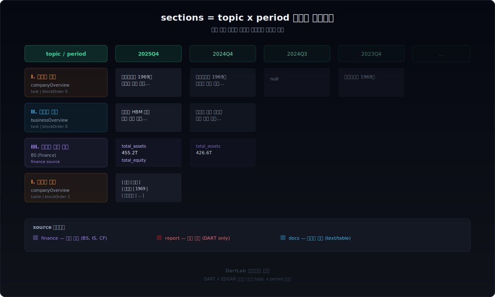
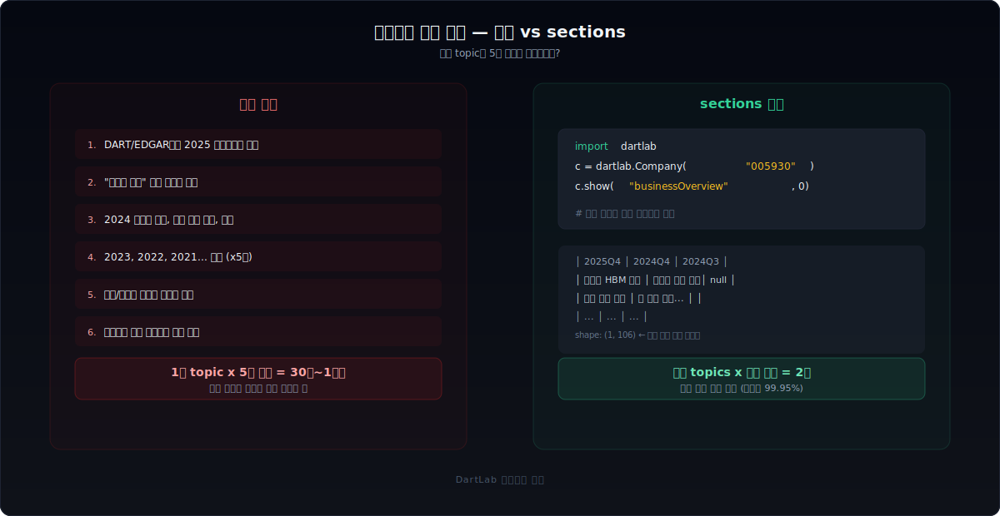
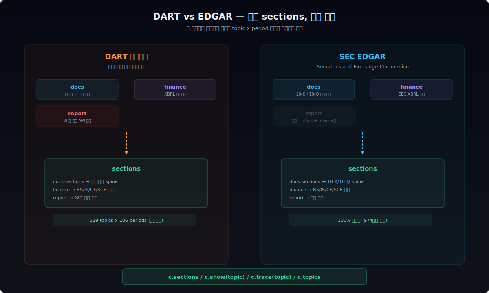
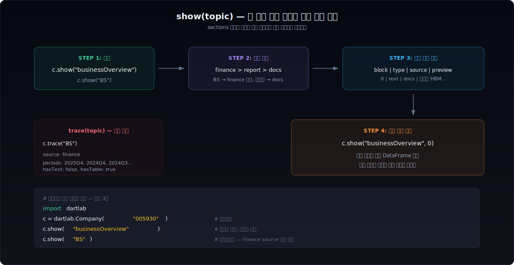
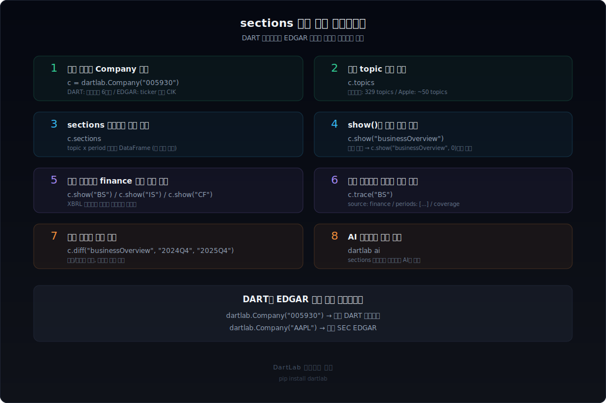

DART 전자공시에서 삼성전자의 "사업의 내용"이 3년 동안 어떻게 바뀌었는지 확인하려면, 보통 6개 보고서를 하나씩 열어서 같은 섹션을 찾고, 복사하고, 나란히 놓는 작업을 반복해야 한다. EDGAR의 10-K도 마찬가지다. Item 1 "Business"를 5년 치 비교하려면 파일 5개를 따로 열어야 한다.

DartLab의 `sections`는 이 작업을 코드 한 줄로 바꾼다. 전자공시 문서 전체를 **topic x period 매트릭스**로 수평화해서, 같은 주제의 텍스트와 테이블을 기간별로 나란히 볼 수 있게 만든다.



## 수동 비교와 sections 비교는 무엇이 다른가

전자공시 문서에서 특정 섹션의 기간별 변화를 추적하는 일은 단순해 보이지만, 실제로 해보면 시간이 많이 든다. DART든 EDGAR든 과정은 비슷하다.

수동으로 하면 보고서를 하나씩 열고, 원하는 섹션을 찾아서 복사하고, 문서나 엑셀에 옮기는 과정을 기간 수만큼 반복한다. 1개 topic을 5개 기간으로 비교하는 데 30분에서 1시간이 걸린다. 여기에 섹션 제목이 연도마다 미묘하게 다르면 — 예를 들어 "사업의 내용"이 "II. 사업의 내용"이었다가 "Ⅱ. 사업의 내용"으로 바뀌면 — 다시 찾아야 한다.

`sections`는 이 전체 과정을 이미 끝낸 상태로 데이터를 준다. 섹션 제목 매핑(DART 매핑률 99.95%, EDGAR 100%)이 자동으로 적용되어 있고, 텍스트와 테이블이 기간별로 정렬되어 있다.



```python
import dartlab

# DART 전자공시
c = dartlab.Company("005930")  # 삼성전자
c.show("businessOverview", 0)  # 사업의 내용 — 모든 기간이 이미 정렬됨

# EDGAR
c = dartlab.Company("AAPL")   # Apple
c.show("business", 0)         # Item 1 Business — 같은 인터페이스
```

## sections는 어떤 구조인가

sections의 핵심은 단순하다. 전자공시 문서의 모든 섹션을 `topic`이라는 표준 이름으로 매핑하고, 각 topic의 내용을 기간별 컬럼으로 펼치는 것이다.

| 구조 컬럼 | 설명 |
|-----------|------|
| `chapter` | 보고서 대분류 (I, II, III...) |
| `topic` | 표준화된 주제명 (`companyOverview`, `businessOverview`, `BS` 등) |
| `blockType` | `text` 또는 `table` |
| `blockOrder` | 같은 topic 안에서의 순서 |
| 기간 컬럼 | `2025Q4`, `2024Q4`, `2024Q3`... (최신 먼저) |

삼성전자의 경우 329개 topic이 106개 기간에 걸쳐 수평화되어 있다. 이 안에 "회사의 개요"부터 "감사보고서" 관련 서술까지, 보고서의 모든 텍스트와 테이블이 들어 있다.

```python
c = dartlab.Company("005930")
c.sections
# shape: (약 1,000행, 110+열)
# 329 topics x text/table 블록 x 106 periods
```

`topics`로 어떤 주제가 있는지 빠르게 확인할 수 있다.

```python
c.topics
# ['companyOverview', 'businessOverview', 'riskOverview',
#  'BS', 'IS', 'CF', 'SCE', 'dividend', 'employee', ...]
```

## DART와 EDGAR는 어떻게 같은 구조로 수렴하는가

[DART 전자공시](/blog/everything-about-dart)와 [EDGAR](/blog/everything-about-edgar)는 원본 형식이 완전히 다르다. DART는 HTML 기반 사업보고서에 XBRL 재무제표가 별도로 붙고, EDGAR는 10-K/10-Q filing 안에 모든 것이 들어 있다. 하지만 sections 수평화를 거치면 같은 `topic x period` 구조가 된다.



차이점은 소스 레이어에 있다.

**DART 전자공시** — 3개 소스가 sections를 구성한다:
- `docs`: 사업보고서 원문 파싱 (서술형 텍스트 + 테이블)
- `finance`: XBRL 재무제표 정규화 (BS, IS, CF, SCE)
- `report`: 28개 정형 API 체계 (배당, 임원, 자기주식 등)

**SEC EDGAR** — 2개 소스만으로 완성된다:
- `docs`: 10-K/10-Q 원문 파싱 (매핑률 100%, 974종목 검증 완료)
- `finance`: SEC XBRL 재무 정규화

EDGAR에는 `report`에 해당하는 정형 API가 없지만, 10-K/10-Q 원문이 충분히 구조화되어 있어서 docs + finance 대체만으로 sections가 완성된다.

두 시스템 모두 **소스 우선순위**가 같다: `finance > report > docs`. 재무제표처럼 숫자가 중요한 topic은 finance가 자동으로 올라가고, 서술형 텍스트는 docs가 담당한다. 사용자는 이 선택을 의식할 필요 없이 `show(topic)`만 호출하면 된다.

## show(topic)은 어떻게 동작하는가

`show()`는 sections 위에서 돌아가는 실전 조회 인터페이스다. topic 이름 하나로 해당 주제의 블록 구조와 데이터를 바로 볼 수 있다.



호출 패턴은 두 가지다:

```python
# 1단계: 블록 목차 조회
c.show("businessOverview")
# block | type   | source | preview
# 0     | text   | docs   | 반도체 HBM 생산 확대...
# 1     | table  | docs   | | 항목 | 내용 | ...

# 2단계: 특정 블록 상세 조회
c.show("businessOverview", 0)
# → 해당 블록의 전체 기간 DataFrame
# 컬럼: 2025Q4 | 2024Q4 | 2024Q3 | 2023Q4 | ...
```

재무 데이터도 같은 방식이다:

```python
c.show("BS")      # 재무상태표 — finance 소스 자동 선택
c.show("IS")      # 손익계산서
c.show("CF")      # 현금흐름표
```

`trace()`로 각 topic의 출처를 확인할 수 있다:

```python
c.trace("BS")
# source: finance
# periods: ['2025Q4', '2024Q4', '2024Q3', ...]
# hasText: False, hasTable: True

c.trace("businessOverview")
# source: docs
# periods: ['2025Q4', '2024Q4', '2023Q4', ...]
# hasText: True, hasTable: True
```

## 텍스트 변화 감지는 어떻게 하는가

[사업보고서에서 텍스트 변화를 읽는 것](/blog/business-section-changes-judgment)은 숫자 변화만큼 중요하다. "사업의 내용"에서 특정 문장이 추가되거나 삭제된 것이 사업 방향의 신호가 될 수 있다.

sections는 모든 기간의 텍스트가 이미 나란히 있으니, `diff()`로 두 기간 사이의 변화를 바로 확인할 수 있다.

```python
# 사업의 내용이 어떻게 바뀌었는지
result = c.diff("businessOverview", "2024Q4", "2025Q4")
# 추가된 문장, 삭제된 문장, 변경률
```

이 기능은 [DartLab의 공시 뷰어](/blog/python-financial-analysis)에서 시각적으로도 확인할 수 있다. 타임라인 바로 기간을 전환하면서 텍스트 변화를 추적하고, 변경 요약 카드에서 추가/삭제된 핵심 문장을 볼 수 있다.

EDGAR도 같은 방식으로 동작한다. 10-K의 "Risk Factors"가 연도별로 어떻게 바뀌었는지, "MD&A"에서 경영진이 강조하는 포인트가 달라졌는지를 기간별 비교로 확인할 수 있다.

## 매핑은 얼마나 정확한가

sections의 핵심은 **섹션 제목 매핑** 정확도다. 회사마다 섹션 제목 표현이 다르기 때문이다.

- "II. 사업의 내용" / "Ⅱ. 사업의 내용" / "사업의 내용" → 모두 `businessOverview`
- "Item 1. Business" / "ITEM 1. BUSINESS" / "Item 1 — Business" → 모두 `business`

**DART 전자공시**: 매핑률 99.95% (245개사, 12,667개 title 검증)
**SEC EDGAR**: 매핑률 100.00% (974종목, 442,025행, 182개 매핑 규칙)

매핑이 실패하는 경우는 극히 드물다. DART에서 잔여 미매핑 title은 3개뿐이고, EDGAR는 전수조사에서 에러 0이다.

재무 데이터 매핑도 마찬가지다. DART finance의 계정 매핑률은 97.07%(34,249개 매핑), BS 항등식 정확도는 99.7%다. 회사마다 다른 XBRL 계정ID와 한글 계정명을 하나의 표준 `snakeId`로 통일한다.

## 실전 비교 — 삼성전자 vs Apple

같은 질문을 한국 기업과 미국 기업에 던졌을 때, sections가 어떻게 응답하는지 직접 비교해 보자.

```python
import dartlab

samsung = dartlab.Company("005930")
apple = dartlab.Company("AAPL")

# 사업 개요 텍스트
samsung.show("businessOverview", 0)  # "사업의 내용" 서술형
apple.show("business", 0)            # Item 1 Business 서술형

# 재무상태표
samsung.show("BS")                   # K-IFRS 기준
apple.show("BS")                     # US-GAAP 기준

# 리스크
samsung.show("riskOverview", 0)      # "위험 관리" 서술
apple.show("riskFactors", 0)         # Item 1A Risk Factors 서술
```

topic 이름은 다르지만 호출 패턴은 동일하다. 아래 표는 자주 쓰는 topic의 DART-EDGAR 대응 관계다.

| 내용 | DART topic | EDGAR topic | 비고 |
|------|-----------|-------------|------|
| 사업 개요 | `businessOverview` | `business` | DART는 II장, EDGAR는 Item 1 |
| 경영 분석 | `mdna` | `mdna` | 같은 이름 |
| 리스크 | `riskOverview` | `riskFactors` | DART는 서술, EDGAR는 Item 1A |
| 재무제표 | `BS` / `IS` / `CF` | `BS` / `IS` / `CF` | finance 소스로 통일 |
| 배당 | `dividend` | — | DART는 report 소스, EDGAR는 docs에 포함 |
| 감사 | `audit` | — | DART report 전용 |
| 법적 절차 | `litigation` | `legalProceedings` | EDGAR Item 3 |
| 임원 보수 | `executivePay` | `executiveCompensation` | 출처 구조가 다름 |

DART에만 있는 `report` 소스(배당, 임원, 감사 등 28개 API)는 EDGAR에 대응 항목이 없다. 대신 EDGAR는 10-K 원문 자체가 구조화되어 있어서, docs 파싱만으로 해당 정보를 충분히 추출한다.

### 매핑 전략의 차이

DART와 EDGAR의 섹션 매퍼는 같은 목표를 다른 방식으로 달성한다.

**DART** — 회사마다 섹션 제목이 천차만별이다. "II. 사업의 내용", "Ⅱ.사업의 내용", "사업의내용" 등 표기 변형이 많다. 그래서 정규화 파이프라인이 복잡하다: 로마자 통일 → 공백/특수문자 정리 → 업종 접두사 제거 → `sectionMappings.json` 조회. 12,667개 title을 245개사에서 검증해서 99.95%를 달성했다.

**EDGAR** — SEC가 filing 구조를 강제하기 때문에 변형이 제한적이다. "Item 1", "ITEM 1", "Item 1." 정도의 차이만 있다. 대소문자 정규화 + 오타 보정 + curly quote 처리 + Reg S-K 3자리 코드 매핑으로 100%를 달성했다. 매핑 규칙 182개면 974종목 전수를 커버한다.

결과적으로 DART 매퍼는 "예외를 많이 학습한 모델"이고, EDGAR 매퍼는 "규칙이 단순하지만 완벽한 모델"이다. 사용자 입장에서는 둘 다 `c.sections`로 접근하면 되니 차이를 느끼지 못한다.

## 실전에서 어떻게 시작하는가



설치부터 분석까지 5분이면 된다:

```bash
pip install dartlab
```

```python
import dartlab

# 한국 전자공시 — DART
c = dartlab.Company("005930")  # 삼성전자
c.topics                        # 어떤 주제가 있는지
c.show("businessOverview")      # 사업의 내용 블록 목차
c.show("businessOverview", 0)   # 첫 번째 텍스트 블록 — 전 기간 비교

# 미국 공시 — EDGAR
c = dartlab.Company("AAPL")    # Apple
c.topics                        # 10-K/10-Q topics
c.show("business")             # Item 1 Business
c.show("mdna")                 # Item 7 MD&A
```

[파이썬으로 재무제표 분석하기](/blog/python-financial-analysis)에서 전체 설치 과정과 기본 사용법을 확인할 수 있다. [OpenDART로 주요사항보고서 읽는 법](/blog/opendart-material-events)에서는 이벤트 공시 접근 방식을 다룬다.

## 자주 묻는 질문

### sections와 재무제표는 어떤 관계인가

sections는 재무제표를 **포함**한다. BS, IS, CF 같은 재무 topic에서는 XBRL 정규화된 숫자(finance 소스)가 자동으로 올라온다. 서술형 텍스트와 재무 숫자가 하나의 topic 체계 안에 공존하는 것이 sections의 핵심이다.

### EDGAR는 어디까지 지원하는가

EDGAR docs/sections 매핑률 100%, finance 정규화 완료, 974종목 전수조사 에러 0이다. 10-K와 10-Q의 의미적 대응도 처리되어 있다 — `riskFactors`, `mdna`, `financialStatements`, `controls`, `legalProceedings`, `exhibits` 6쌍이 10-K/10-Q 간에 자동 연결된다.

### 데이터는 어디서 오는가

DART 데이터는 금융감독원 전자공시시스템(DART)에서 직접 가져온다. EDGAR 데이터는 SEC EDGAR에서 수집한다. DartLab은 이 원본 데이터를 [파싱하고 정규화하는 엔진](/blog/everything-about-dart)이다.

### 특정 기간만 볼 수 있는가

`show(topic, block, period="2025Q4")` 형태로 특정 기간의 데이터만 조회할 수 있다. annual alias도 지원한다 — `period="2025"`로 호출하면 `2025Q4` 데이터가 반환된다.

### sections로 전자공시 감시 자동화가 가능한가

가능하다. `diff()`와 조합하면 특정 topic의 텍스트 변화를 자동으로 감지할 수 있다. 예를 들어 분기마다 `riskOverview`의 변경률을 계산해서, 일정 임계치를 넘으면 알림을 보내는 식이다. sections가 기간별 텍스트를 이미 정렬해두었기 때문에, 비교 로직은 두 컬럼을 `diff()`에 넘기는 것만으로 충분하다.

### 비상장사도 sections를 쓸 수 있는가

DART에 사업보고서를 제출하는 비상장 외감법인이면 가능하다. 상장사와 동일한 `Company("종목코드")` 인터페이스로 접근한다. 다만 비상장사는 보고서 제출 빈도가 낮아서 기간 컬럼이 적을 수 있다.

## 핵심 정리

전자공시 문서의 기간별 비교는 수동으로 하면 시간이 많이 들고, 섹션 제목 차이 때문에 실수하기 쉽다. sections는 이 문제를 **topic x period 매트릭스**로 해결한다.

- DART 전자공시와 EDGAR 모두 같은 인터페이스(`c.sections`, `c.show()`, `c.trace()`)
- 섹션 매핑 자동화 (DART 99.95%, EDGAR 100%)
- 텍스트와 재무 숫자가 하나의 체계에서 공존
- 소스 우선순위 자동 선택 (finance > report > docs)
- 기간별 변화 감지(`diff`)까지 내장

공시를 읽는 것에서 공시를 **비교**하는 것으로 넘어갈 때, sections가 그 구조를 제공한다.
