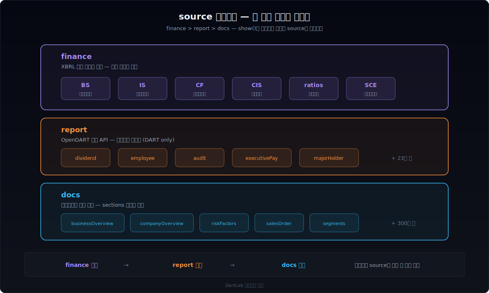
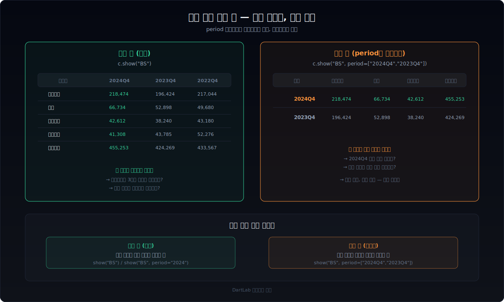

사업보고서를 열면 수백 페이지다. 재무제표, 사업의 내용, 감사보고서, 임원 현황, 주주 구성 — 원하는 숫자 하나를 찾으려면 스크롤만 수십 번이다.

`show(topic)`은 이 문제를 한 줄로 해결한다. topic 이름 하나면 해당 주제의 모든 기간 데이터가 DataFrame으로 돌아온다.


## show()는 왜 2단계로 동작하는가

공시 문서의 한 섹션 안에는 텍스트와 테이블이 섞여 있다. "사업의 내용"을 열면 서술형 설명이 나오고, 중간에 매출 현황 테이블이 끼어 있고, 다시 텍스트가 이어진다. 이 구조를 하나의 DataFrame으로 합치면 텍스트와 숫자가 뒤섞여서 쓸 수 없다.

show()는 이 문제를 **블록 목차 → 실제 데이터**의 2단계로 풀었다.

```python
import dartlab

c = dartlab.Company("005930")  # 삼성전자

# 1단계: 블록 목차
c.show("businessOverview")
```

```
┌───────┬────────┬────────┬──────────────────────────────────────────┐
│ block │ type   │ source │ preview                                  │
├───────┼────────┼────────┼──────────────────────────────────────────┤
│ 0     │ text   │ docs   │ 당사는 DX부문 / DS부문 / SDC / Harman...  │
│ 1     │ table  │ docs   │ | 부문 | 주요 제품 | 2024 | 2023 | ...   │
│ 2     │ text   │ docs   │ 반도체 사업은 메모리와 시스템LSI, 파운...  │
│ 3     │ table  │ docs   │ | 제품 | 생산능력 | 생산실적 | ...        │
│ 4     │ text   │ docs   │ 디스플레이 패널 사업은...                 │
└───────┴────────┴────────┴──────────────────────────────────────────┘
```

`block` 번호, `type`(text/table), `source`(docs/finance/report), `preview`(미리보기)로 구성된 목차다. 여기서 원하는 블록 번호를 골라서 2단계로 들어간다.

```python
# 2단계: 실제 데이터 — 1번 블록(테이블) 꺼내기
c.show("businessOverview", 1)
```

```
┌────────────────┬──────────────┬──────────────┬──────────────┐
│ 항목           │ 2024         │ 2023         │ 2022         │
├────────────────┼──────────────┼──────────────┼──────────────┤
│ DX부문         │ 72,569,841   │ 65,404,122   │ 67,895,401   │
│ DS부문         │ 68,206,024   │ 54,067,842   │ 70,484,013   │
│ SDC            │ 32,786,245   │ 28,946,731   │ 31,725,849   │
│ Harman         │ 13,524,678   │ 12,845,923   │ 12,023,456   │
└────────────────┴──────────────┴──────────────┴──────────────┘
```

항목 × 기간 매트릭스. 바로 분석에 쓸 수 있다.


## 블록이 하나뿐이면 바로 데이터가 나온다

재무제표처럼 블록이 하나뿐인 topic은 목차를 거치지 않고 바로 데이터를 반환한다.

```python
c.show("BS")
```

```
┌──────────────────────┬──────────────┬──────────────┬──────────────┐
│ 계정명               │ 2024Q4       │ 2023Q4       │ 2022Q4       │
├──────────────────────┼──────────────┼──────────────┼──────────────┤
│ 유동자산             │ 218,474,116  │ 196,424,355  │ 217,044,893  │
│ 현금및현금성자산     │ 66,734,456   │ 52,898,012   │ 49,680,175   │
│ 매출채권             │ 42,612,394   │ 38,240,157   │ 43,180,297   │
│ 재고자산             │ 41,308,578   │ 43,785,101   │ 52,276,343   │
│ 비유동자산           │ 236,778,942  │ 227,845,133  │ 216,523,076  │
│ 유형자산             │ 157,234,581  │ 162,048,721  │ 157,893,467  │
│ 자산총계             │ 455,253,058  │ 424,269,488  │ 433,567,969  │
│ ...                  │ ...          │ ...          │ ...          │
└──────────────────────┴──────────────┴──────────────┴──────────────┘
```

BS, IS, CF, CIS, SCE — 재무제표 5종은 `source=finance`로 표시되며, docs 원문이 아니라 XBRL 기반 정규화된 숫자가 나온다. [재무제표를 Python으로 분석하는 첫 단계](/blog/python-financial-analysis)에서 다룬 그 숫자다.

## source 세 가지의 의미

show()가 반환하는 데이터는 세 가지 출처 중 하나에서 온다.

| source | 의미 | 예시 topic |
|--------|------|-----------|
| **docs** | 사업보고서 원문 (텍스트 + 테이블) | businessOverview, companyOverview, riskFactors |
| **finance** | XBRL 재무제표 정규화 숫자 | BS, IS, CF, CIS, SCE, ratios |
| **report** | OpenDART 정형 API 데이터 | dividend, employee, audit, executivePay |

왜 이렇게 나누었는가?

**숫자는 더 강한 소스가 이긴다.** 사업보고서 원문에도 재무제표가 있지만, XBRL로 정규화된 finance 데이터가 더 정확하다. 그래서 finance topic은 docs를 **대체**한다. report도 마찬가지 — OpenDART API가 제공하는 배당, 임원, 감사 데이터는 원문 파싱보다 구조화되어 있다.

```python
# docs에서 온 텍스트 — 서술형 원문
c.show("businessOverview", 0)  # source=docs, type=text

# finance에서 온 숫자 — XBRL 정규화
c.show("BS")                    # source=finance

# report에서 온 정형 데이터 — OpenDART API
c.show("dividend")              # source=report
```

사용자는 source를 신경 쓸 필요 없다. show()가 topic에 맞는 최선의 source를 자동 선택한다.



## 기간을 지정하면 무엇이 달라지는가

기본 show()는 모든 기간을 한꺼번에 보여준다. 삼성전자 기준 106개 기간이 한 번에 나온다. 특정 기간만 보고 싶을 때는 `period` 파라미터를 쓴다.

```python
# 2024년 연간 데이터만
c.show("BS", period="2024")
```

```
┌──────────────────────┬──────────────┐
│ 계정명               │ 2024Q4       │
├──────────────────────┼──────────────┤
│ 유동자산             │ 218,474,116  │
│ 현금및현금성자산     │ 66,734,456   │
│ 자산총계             │ 455,253,058  │
│ ...                  │ ...          │
└──────────────────────┴──────────────┘
```

`period="2024"`는 `2024Q4`로 자동 매칭된다. 연간 데이터는 Q4 시점 숫자이기 때문이다.

### 세로 뷰 — 기간을 행으로 전환

기간을 리스트로 넘기면 가로-세로가 뒤집힌다.

```python
c.show("BS", period=["2024Q4", "2023Q4", "2022Q4"])
```

```
┌────────┬──────────────┬──────────────┬──────────────┬──────────────┐
│ 기간   │ 유동자산     │ 현금및현금성 │ 자산총계     │ ...          │
├────────┼──────────────┼──────────────┼──────────────┼──────────────┤
│ 2024Q4 │ 218,474,116  │ 66,734,456   │ 455,253,058  │ ...          │
│ 2023Q4 │ 196,424,355  │ 52,898,012   │ 424,269,488  │ ...          │
│ 2022Q4 │ 217,044,893  │ 49,680,175   │ 433,567,969  │ ...          │
└────────┴──────────────┴──────────────┴──────────────┴──────────────┘
```

가로 뷰는 "한 계정의 시계열"을, 세로 뷰는 "한 시점의 전체 구조"를 한눈에 본다. 기간 비교를 할 때는 세로 뷰가 더 직관적이다. [sections 기반 기간 비교](/blog/sections-compare-dart-edgar)에서 다룬 수평화 구조가 여기서 소비된다.



## 실전: topic 탐색부터 데이터 추출까지

회사를 처음 열었을 때 어떤 topic이 있는지부터 봐야 한다.

```python
c = dartlab.Company("005930")

# 전체 topic 목록
c.topics
```

```
['companyOverview', 'businessOverview', 'businessResult',
 'salesOrder', 'segments', 'employee', 'dividend',
 'BS', 'IS', 'CF', 'CIS', 'SCE', 'ratios', ...]
```

더 상세한 메타데이터가 필요하면 `index`를 본다.

```python
c.index
```

```
┌─────────┬──────────────────────┬───────────────┬────────┬─────────┬─────────┬─────────┐
│ chapter │ topic                │ label         │ kind   │ source  │ periods │ shape   │
├─────────┼──────────────────────┼───────────────┼────────┼─────────┼─────────┼─────────┤
│ I       │ companyOverview      │ 회사의 개요   │ text   │ docs    │ 8       │ [3, 8]  │
│ II      │ businessOverview     │ 사업의 내용   │ mixed  │ docs    │ 8       │ [12, 8] │
│ III     │ mdna                 │ 경영진단 및..  │ text   │ docs    │ 8       │ [4, 8]  │
│ —       │ BS                   │ 재무상태표    │ table  │ finance │ 12      │ [45, 12]│
│ —       │ IS                   │ 손익계산서    │ table  │ finance │ 12      │ [28, 12]│
│ —       │ dividend             │ 배당          │ table  │ report  │ 6       │ [8, 6]  │
│ ...     │ ...                  │ ...           │ ...    │ ...     │ ...     │ ...     │
└─────────┴──────────────────────┴───────────────┴────────┴─────────┴─────────┴─────────┘
```

chapter(사업보고서 장 번호), kind(text/table/mixed), source, periods(기간 수), shape(행×열) — 이 메타데이터만으로도 어떤 topic이 풍부한 데이터를 가지고 있는지 판단할 수 있다.

### 텍스트 원문 추출

서술형 데이터가 필요할 때는 text 블록을 꺼낸다.

```python
# "사업의 내용" 서술형 원문 — 기간별 비교
text = c.show("businessOverview", 0)  # block 0 = text
```

각 기간 컬럼에 해당 기간의 원문 텍스트가 들어 있다. `2024` 컬럼과 `2023` 컬럼을 나란히 놓으면 경영진 설명이 어떻게 바뀌었는지 바로 보인다. [사업의 내용이 바뀔 때 무엇이 달라졌는지 판단하는 법](/blog/business-section-changes-judgment)에서 다룬 변화 감지가 이 텍스트 위에서 동작한다.

### 테이블 수평화

```python
# "사업의 내용" 안의 매출 현황 테이블
table = c.show("businessOverview", 1)  # block 1 = table
```

원본 사업보고서의 markdown 테이블이 항목 × 기간 매트릭스로 수평화되어 나온다. 2024년 테이블과 2023년 테이블의 같은 항목이 같은 행에 정렬된다.

### EDGAR도 같은 인터페이스

```python
e = dartlab.Company("AAPL")

# EDGAR 10-K의 Risk Factors
e.show("riskFactors")

# EDGAR 재무제표
e.show("BS")
```

DART든 EDGAR든 `show(topic)`은 동일한 2단계 구조를 따른다. topic 이름만 다를 뿐이다. EDGAR의 topic은 `riskFactors`, `mdna`, `financialStatements` 등 SEC filing 구조를 따른다.

## 실전 시나리오별 show() 활용

topic을 이름으로 알고 있어도, 실제 분석에서 어떤 순서로 꺼내는지가 중요하다. 자주 쓰는 시나리오를 정리한다.

### 시나리오 1: 특정 기업의 사업 구조 파악

회사를 처음 분석할 때 가장 먼저 보는 세 가지가 있다.

```python
c = dartlab.Company("000660")  # SK하이닉스

# 1. 뭘 하는 회사인지 — 사업 개요 텍스트
c.show("businessOverview", 0)

# 2. 돈을 얼마나 버는지 — 손익계산서
c.show("IS")

# 3. 부채 수준은 어느 정도인지 — 재무상태표
c.show("BS")
```

`businessOverview`의 text 블록은 사업부 구조, 주력 제품, 시장 현황을 서술형으로 담고 있다. 여기서 핵심 키워드를 잡고, `IS`와 `BS` 숫자로 실적을 확인하는 순서가 자연스럽다.

### 시나리오 2: 배당 정책 추적

배당 투자자라면 `dividend` topic을 기간별로 비교한다.

```python
c = dartlab.Company("005930")

# 배당 데이터 — report 소스 (OpenDART API)
c.show("dividend")
```

`source=report`로 표시되는 이 데이터는 OpenDART의 정형 API에서 오기 때문에, 사업보고서 원문을 파싱한 것보다 구조가 깔끔하다. 주당 배당금, 배당 수익률, 배당 총액이 기간별로 정렬되어 나온다.

### 시나리오 3: 리스크 변화 감지

분기마다 리스크 서술이 어떻게 바뀌는지 확인하려면 text 블록을 기간별로 나란히 본다.

```python
c = dartlab.Company("035420")  # NAVER

# 리스크 서술형 텍스트 — 모든 기간
risk_text = c.show("riskOverview", 0)

# EDGAR 기업이라면
e = dartlab.Company("GOOGL")
e.show("riskFactors", 0)
```

각 기간 컬럼에 해당 시점의 리스크 서술이 들어 있다. 2024Q4 컬럼에 새로 등장한 문장이 있다면, 그것이 새로운 리스크 인식의 신호일 수 있다. `diff()`를 걸면 추가/삭제된 문장을 자동으로 뽑아준다.

### topic 카테고리 정리

DART 기준으로 자주 쓰는 topic을 source별로 정리하면 다음과 같다.

| source | topic 예시 | 데이터 형태 |
|--------|-----------|-------------|
| **docs** | `companyOverview`, `businessOverview`, `riskOverview`, `governanceOverview` | 서술형 텍스트 + 내장 테이블 |
| **finance** | `BS`, `IS`, `CF`, `CIS`, `SCE`, `ratios` | 계정명 × 기간 숫자 매트릭스 |
| **report** | `dividend`, `employee`, `audit`, `executivePay`, `treasury`, `largestShareholder` | 정형 항목 × 기간 |

docs topic은 text 블록과 table 블록이 섞여 있어서 show()의 2단계 구조가 빛난다. finance와 report topic은 블록이 하나뿐이라 바로 데이터가 나온다.

## 어디서 어떻게 꺼내는지 — trace로 추적

show()로 꺼낸 데이터가 원본 어디에서 왔는지 추적하고 싶을 때는 `trace()`를 쓴다.

```python
c.trace("businessOverview")
```

```
┌─────────┬──────────────────────┬───────────────┬────────┬─────────┬────────────┐
│ chapter │ topic                │ label         │ source │ periods │ hasText    │
├─────────┼──────────────────────┼───────────────┼────────┼─────────┼────────────┤
│ II      │ businessOverview     │ 사업의 내용   │ docs   │ 8       │ true       │
└─────────┴──────────────────────┴───────────────┴────────┴─────────┴────────────┘
```

데이터의 출처(source), 기간 수(periods), 텍스트 존재 여부(hasText), 테이블 존재 여부(hasTable)까지 확인할 수 있다. show()가 준 데이터를 **검증**하는 수단이다.

## 사용 패턴 요약

| 패턴 | 코드 | 결과 |
|------|------|------|
| 어떤 topic이 있는지 | `c.topics` | 문자열 리스트 |
| topic 메타데이터 | `c.index` | chapter, source, shape |
| 블록 목차 | `c.show("topic")` | block, type, source, preview |
| 특정 블록 데이터 | `c.show("topic", N)` | 항목 × 기간 DataFrame |
| 재무제표 바로 꺼내기 | `c.show("BS")` | 계정명 × 기간 DataFrame |
| 특정 기간만 | `c.show("BS", period="2024")` | 해당 기간 컬럼만 |
| 세로 비교 뷰 | `c.show("BS", period=["2024Q4", "2023Q4"])` | 기간 × 계정 전치 |
| 출처 추적 | `c.trace("topic")` | source, periods, hasText |


## show()가 가능한 이유 — sections 수평화

show()가 한 줄로 동작하는 이유는 뒤에서 [sections](/blog/sections-compare-dart-edgar)가 이미 모든 문서를 topic × period 매트릭스로 정렬해두었기 때문이다.

```
원본 사업보고서 (수백 페이지 × 여러 기간)
    ↓ sections 수평화 (pipeline.py)
topic × period 매트릭스 (blockType으로 text/table 분리)
    ↓ show(topic)
블록 목차 → 실제 DataFrame
```

사용자가 `show("businessOverview")`를 호출하면:

1. `sections`에서 `topic == "businessOverview"` 행을 필터한다
2. `blockType`(text/table)과 `blockOrder`(순서)로 블록 목차를 만든다
3. 블록 번호를 지정하면 해당 행의 기간 컬럼을 DataFrame으로 반환한다

finance topic은 `sections`를 거치지 않고 바로 XBRL 정규화 엔진에서 가져온다. 숫자가 더 정확한 소스를 쓰는 것이다.

## FAQ

### show()와 sections의 차이는 무엇인가?

`sections`는 전체 회사 지도다. 모든 topic, 모든 기간, 모든 블록이 하나의 거대한 DataFrame에 들어 있다. `show(topic)`은 그 지도에서 **원하는 한 조각을 꺼내는 인터페이스**다. sections를 직접 필터해도 같은 결과를 얻을 수 있지만, show()는 블록 분리, 기간 필터, 세로 뷰 전환, source 자동 선택을 한 번에 처리한다.

### 모든 회사에서 같은 topic이 있는가?

아니다. topic 목록은 회사마다 다르다. 건설업은 수주잔고 topic이 있지만 IT 기업에는 없다. `c.topics`로 해당 회사에서 사용 가능한 topic을 먼저 확인해야 한다. 다만 BS, IS, CF 같은 재무제표 topic은 거의 모든 상장사에 존재한다.

### DART와 EDGAR의 topic 이름이 다른가?

다르다. DART는 한국 사업보고서 장 구조를 따르고(`companyOverview`, `businessOverview`, `dividend`), EDGAR는 SEC filing 구조를 따른다(`riskFactors`, `mdna`, `financialStatements`). 하지만 인터페이스는 동일하다 — `show(topic)`으로 꺼내고, `trace(topic)`으로 추적한다.

### show()가 None을 반환하면 무엇을 확인해야 하나?

해당 회사에 그 topic 데이터가 없다는 뜻이다. `c.topics`에 해당 topic이 포함되어 있는지 먼저 확인한다. 포함되어 있는데 None이면, 해당 기간에 데이터가 비어 있을 수 있다 — `c.index`에서 periods 수를 확인한다.

### show()로 여러 회사를 비교할 수 있는가?

show()는 단일 회사 인터페이스다. 여러 회사를 비교하려면 각 Company에서 show()를 호출한 뒤 DataFrame을 직접 합치면 된다.

```python
samsung = dartlab.Company("005930")
sk = dartlab.Company("000660")

samsung_bs = samsung.show("BS")
sk_bs = sk.show("BS")
# 두 DataFrame을 원하는 기준으로 join
```

재무제표 topic은 `snakeId`로 계정명이 표준화되어 있으므로, 회사 간 행 단위 매칭이 바로 된다.

### show()에서 가져온 숫자의 단위는 무엇인가?

DART finance 숫자는 원본 전자공시 그대로 **원(KRW)** 단위다. 백만 원이나 억 원으로 변환하지 않는다. EDGAR finance는 **달러(USD)** 단위다. 단위 변환은 사용자 몫이다 — sections는 원본 숫자를 건드리지 않는다는 원칙이다.
