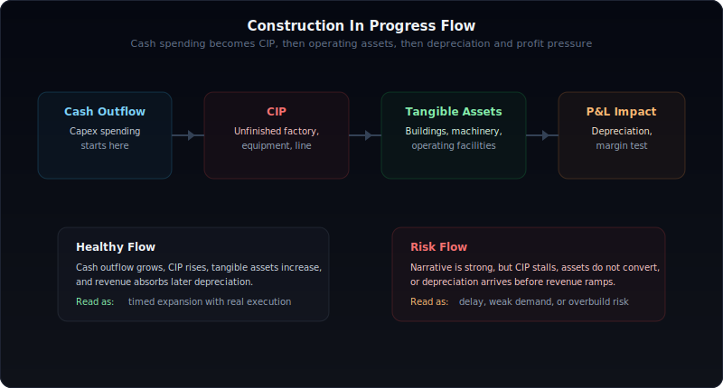
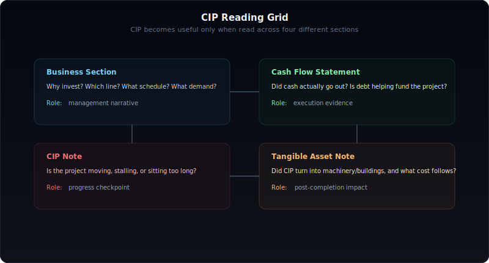
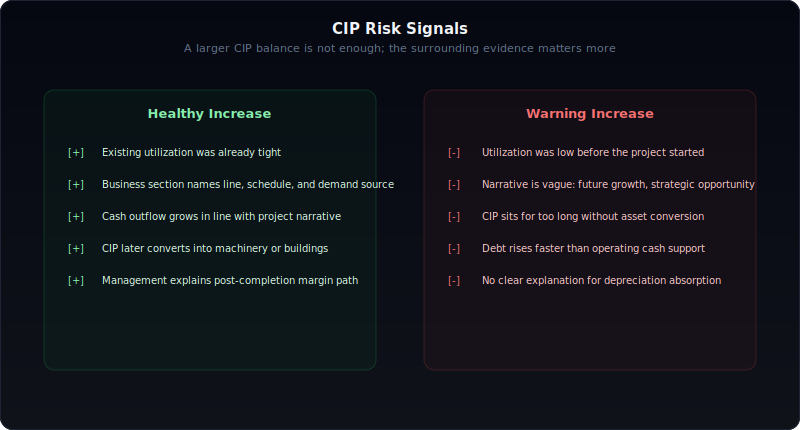

# 사업보고서에서 건설중인자산 읽는 법

사업보고서에서 설비투자를 읽을 때 가장 자주 놓치는 숫자가 있다.

바로 **건설중인자산**이다.

많은 투자자는 CAPEX가 늘었는지, 공장 증설 발표가 있었는지, 생산능력이 확대됐는지만 본다. 하지만 그 사이에는 중요한 빈칸이 있다. 돈을 쓰겠다고 말하는 것과, 실제로 공사와 설비 반입이 진행되고 있는 것, 그리고 그 투자가 완공 후 매출과 이익으로 이어지는 것은 전혀 다른 문제다.

건설중인자산은 그 중간 단계를 보여준다. 그래서 사업보고서에서 건설중인자산을 읽을 수 있으면 단순히 "투자를 많이 한다"가 아니라, **그 투자가 실제로 움직이고 있는지**, **지연되고 있는지**, **과잉투자로 흐르는지**, **감가상각 부담을 감당할 수 있는지**까지 볼 수 있다.

이 글은 `건설중인자산이 무엇인가`, `건설중인자산이 늘면 무조건 호재인가`, `현금흐름표와 왜 같이 봐야 하는가`, `유형자산 주석과 감가상각까지 어떻게 연결하는가`를 하나의 프레임으로 정리한 실전 가이드다.

---

## 건설중인자산은 무엇이고 왜 중요한가

건설중인자산은 아직 완공되지 않았거나, 사용 가능한 상태에 도달하지 않은 설비와 자산이다.

쉽게 말하면:

- 공장 증설 공사 중인 건물
- 설치 중인 기계장치
- 라인 증설을 위한 장비 반입
- 아직 완전히 가동되지 않은 신규 생산시설

같은 것들이 여기에 모인다.

중요한 이유는 이 항목이 **설비투자의 진행도**를 보여주기 때문이다.

CAPEX는 "돈을 쓰겠다"는 의사결정과 집행을 보여주지만, 건설중인자산은 그 돈이 아직 완성되지 않은 설비 형태로 쌓이고 있는지 보여준다. 그리고 완공되면 건물, 기계장치, 구축물 같은 유형자산으로 대체된다.

즉 건설중인자산은 다음 세 가지를 동시에 의미한다.

- 진행 중인 투자
- 아직 매출로 연결되지 않은 설비
- 미래 감가상각 부담의 예고편

그래서 건설중인자산이 커졌다는 사실 하나만으로 호재라고 말할 수 없다. 그건 `진행 중`이라는 뜻이지, `성공적으로 회수될 것`이라는 뜻은 아니기 때문이다.

---

## 건설중인자산과 CAPEX, 유형자산, 감가상각은 무엇이 다른가

이 항목을 오해하는 가장 큰 이유는 비슷한 단어들이 한꺼번에 등장하기 때문이다.

| 항목 | 무엇을 뜻하나 | 실전 해석 |
|------|---------------|-----------|
| CAPEX | 설비와 자산에 들어가는 전체 투자 | 의사결정 + 집행 규모 |
| 건설중인자산 | 아직 완공되지 않은 투자 자산 | 진행 중인 증설의 현재 상태 |
| 유형자산 | 완공되어 장부에 잡힌 건물·기계장치 등 | 운영에 투입된 설비 |
| 감가상각 | 완공된 자산의 비용화 | 이후 마진에 반영될 부담 |

관계는 단순하다.

1. 회사가 설비투자를 결정한다.  
2. 현금이 나간다.  
3. 공사와 장비 설치가 진행되면 건설중인자산이 쌓인다.  
4. 완공되면 건물·기계장치 등 유형자산으로 대체된다.  
5. 이후 감가상각비가 손익계산서에 반영된다.

여기서 핵심은 타이밍이다.

CAPEX는 먼저 보이고, 건설중인자산은 그 진행 상태를 보여주고, 감가상각은 나중에 실적에 나타난다. 따라서 건설중인자산을 읽는다는 건, 실적에 아직 본격 반영되지 않은 미래 비용 구조를 미리 읽는 일이다.

---

## 사업보고서에서 건설중인자산은 어디서 확인해야 하나

검색으로 `건설중인자산`만 찾으면 숫자 하나는 볼 수 있다. 하지만 그 숫자의 의미는 다른 표와 연결해야만 살아난다.

실전에서는 아래 네 곳을 같이 봐야 한다.

### 1. II. 사업의 내용

이 섹션에서는 회사가 **왜 투자하는지**를 말한다.

- 증설 목적
- 수요 근거
- 투자 일정
- 라인/공장별 대상 사업

즉 서사의 시작점이다.

### 2. 현금흐름표

여기서는 회사가 **실제로 돈을 썼는지**를 본다.

- 유형자산 취득 현금유출
- 투자활동 현금흐름 악화 여부
- 차입 증가와의 동행 여부

말은 공격적인데 현금유출이 약하면, 아직 계획 단계일 수 있다.

### 3. 건설중인자산 주석

여기서는 **진행 중인지, 멈췄는지, 얼마나 쌓였는지**를 본다.

- 전기 대비 증가
- 항목별 구성
- 장기 정체 여부

숫자가 단순 증가인지, 장기간 정체인지가 중요하다.

### 4. 유형자산 주석

여기서는 **완공 후 어떤 자산으로 대체됐는지**를 본다.

- 기계장치 증가
- 건물 증가
- 감가상각비 확대

건설중인자산이 실제 운영 자산으로 전환되는지 확인하는 마지막 단계다.

이 네 곳이 같은 방향을 가리켜야 한다.

- 본문은 공격적 증설이라고 말하는데
- 현금유출은 약하고
- 건설중인자산도 안 늘고
- 유형자산 전환도 없으면

그 투자는 아직 실행력이 약한 이야기일 수 있다.

---

## 건설중인자산이 늘면 무조건 좋은 신호인가

아니다.

건설중인자산 증가는 그 자체로 중립적이다. 중요한 건 **왜 늘었는지**, **얼마나 오래 쌓이는지**, **무엇으로 전환되는지**다.

좋은 경우는 보통 이렇다.

- 기존 가동률이 높다
- 수요 근거가 분명하다
- 투자 일정이 구체적이다
- 현금흐름표에서 실제 집행이 확인된다
- 이후 유형자산 전환 가능성이 보인다

반대로 위험한 경우는 이렇다.

- 기존 가동률이 낮다
- 수요 근거가 추상적이다
- 건설중인자산만 오래 쌓이고 진척이 느리다
- 차입은 늘지만 운영현금은 약하다
- 완공 후 수익성 설명이 빈약하다

| 건설중인자산 증가 패턴 | 좋은 해석 | 위험한 해석 |
|------------------------|-----------|-------------|
| 고가동 + 증가 | 병목 해소를 위한 정상적 증설 | 대응이 늦으면 외주/비용 압력 가능 |
| 저가동 + 증가 | 사업 전환 가능성 점검 필요 | 과잉설비 위험 |
| 현금유출 동반 증가 | 실제 집행 진행 | 자금 부담 확대도 함께 점검 |
| 장기간 누적 | 대형 프로젝트일 수 있음 | 지연, 인허가, 수요 약화 가능성 |

즉 건설중인자산이 늘었다는 사실보다, **그 증가가 정상적인 진척인지 비정상적인 체류인지**를 보는 게 더 중요하다.

---

## 현금흐름표와 건설중인자산을 왜 같이 봐야 하나

건설중인자산 숫자 하나만 보면 착시가 생긴다.

어떤 회사는 공격적 투자 계획을 내세우지만, 실제 현금지출이 약하다. 반대로 어떤 회사는 현금이 크게 나가는데 건설중인자산 변화는 작다. 이 둘은 완전히 다른 상황이다.

현금흐름표와 같이 보면 아래가 보인다.

### 1. 집행 속도

유형자산 취득 현금유출이 커졌다면, 적어도 돈은 나가고 있다는 뜻이다.

### 2. 자금 구조

운영현금흐름이 약한데 차입으로 투자만 늘고 있으면, 프로젝트가 길어질수록 재무 부담이 커질 수 있다.

### 3. 말과 실행의 차이

사업보고서 본문에 증설 이야기가 많아도 현금흐름표가 조용하면 아직 실행력이 낮다.

### 4. 비용 반영 시차

현금은 지금 나가지만, 감가상각은 완공 이후에 나타난다. 그래서 투자 초기에 실적이 덜 나빠 보일 수도 있다.

핵심은 이것이다.

현금흐름표는 "회사가 정말 돈을 썼는가"를 보여주고, 건설중인자산은 "그 돈이 아직 완공되지 않은 상태로 쌓이고 있는가"를 보여준다.

둘을 같이 봐야 투자 설명이 현실로 움직이는지 판단할 수 있다.

---

## 유형자산 주석으로 넘어갈 때 무엇을 확인해야 하나

건설중인자산은 영원히 머무는 계정이 아니다.

진짜 중요한 순간은 이 숫자가 **유형자산으로 대체되는 시점**이다.

그때 확인할 것은 세 가지다.

### 1. 어떤 자산으로 대체됐는가

건물인지, 기계장치인지, 구축물인지에 따라 해석이 달라진다.

- 기계장치 증가: 생산라인 직접 확대 가능성
- 건물 증가: 장기 프로젝트, 부지/공장 확장 가능성
- 기타 설비 증가: 보조 인프라일 수 있음

### 2. 감가상각 부담이 얼마나 커지는가

완공과 동시에 미래 손익 압력이 생긴다.

증설이 성공하려면 늘어난 자산이 감가상각비를 흡수할 만큼 충분한 매출과 마진을 만들어야 한다.

### 3. 완공 후 가동과 매출이 실제로 따라오는가

자산이 전환됐다고 바로 성과가 나는 건 아니다.

초기 램프업 구간에서는:

- 불량률
- 시운전 비용
- 교육 비용
- 외주와 내부 생산의 혼선

같은 문제가 생길 수 있다.

즉 건설중인자산을 읽는다는 건 완공 전 숫자를 보는 일에서 끝나지 않는다. **완공 후 비용 구조까지 연결해서 읽는 일**이다.

---

## 좋은 건설중인자산 증가와 위험한 증가를 어떻게 구분하나

아래처럼 구분하면 실전에서 거의 틀리지 않는다.

| 구분 | 좋은 증가 | 위험한 증가 |
|------|-----------|-------------|
| 기존 가동률 | 이미 높음 | 아직 낮음 |
| 수요 근거 | 수주, 장기계약, 고객 확대 | 추상적 성장 전망 |
| 일정 | 착공/완공 시점 구체적 | 일정 표현 모호 |
| 현금흐름 | 실제 집행 동반 | 집행 약함 또는 차입 의존 과도 |
| 전환 경로 | 유형자산 대체가 보임 | 장기 정체 |
| 수익성 설명 | 감가상각 이후 논리 존재 | 완공 후 마진 설명 부재 |

좋은 증가는 미래 매출로 이어질 가능성이 있는 진행형 투자다.

위험한 증가는 완공도 늦고, 회수 구조도 흐리고, 시간이 지날수록 재무 부담만 키우는 투자다.

차이는 숫자 크기가 아니라 **전환 가능성**에 있다.

---

## 숫자가 커도 위험한 4가지 케이스

건설중인자산은 커질수록 좋아 보일 수 있다. 하지만 아래 네 가지는 실전에서 매우 위험하다.

### 1. 건설중인자산은 급증하지만 매출은 뒤따르지 않는다

수요 예측이 틀렸거나, 완공 속도가 늦거나, 주력 사업이 아닌 영역일 수 있다.

### 2. 증설 설명은 강한데 현금유출이 약하다

프로젝트가 아직 초기 단계이거나, 발표 중심의 서사일 가능성이 있다.

### 3. 건설중인자산이 오랫동안 쌓이는데 유형자산 대체가 없다

인허가, 장비 반입, 프로젝트 재검토, 수요 둔화, 공정 지연 가능성을 의심해야 한다.

### 4. 완공 직후 감가상각과 램프업 비용으로 마진이 꺾인다

투자 성공 여부는 완공이 아니라, 완공 후 수익성 방어에서 결정된다.

| 함정 케이스 | 왜 위험한가 |
|------------|-------------|
| 매출 지연 | 투자 회수 시점이 밀린다 |
| 현금유출 약함 | 실행 속도가 느리거나 과장일 수 있다 |
| 장기 정체 | 프로젝트 리스크가 커진다 |
| 완공 후 마진 악화 | 투자 효율이 낮을 수 있다 |

---

## 산업별로 건설중인자산 해석이 왜 달라지나

모든 산업에서 건설중인자산을 같은 방식으로 읽으면 안 된다.

| 산업군 | 중요하게 볼 것 | 해석 포인트 |
|--------|----------------|-------------|
| 반도체·배터리·소재 | 대규모 공정 투자, 장비 반입 | 완공 지연과 수요 사이클 민감도 큼 |
| 자동차부품·기계 | 고객사 수주와 연동된 증설 | 고객 의존도와 라인 전환 확인 |
| 식품·소비재 제조 | 생산라인 증설과 물류 인프라 | 수요 탄력성보다 운영 효율 중요 |
| 자산 경량 산업 | 상대적으로 중요도 낮음 | 같은 프레임을 그대로 적용하면 오판 가능 |

예를 들어 반도체나 배터리처럼 대규모 장치산업은 건설중인자산이 장기간 크게 쌓이는 게 자연스러울 수 있다. 반면 상대적으로 짧은 투자 사이클을 가진 산업에서 장기 정체가 보이면 지연 신호일 가능성이 높다.

즉 건설중인자산 숫자는 절대값보다 **산업의 투자 리듬** 안에서 읽어야 한다.

---

## 10분 실전 체크리스트

시간이 없으면 이것만 봐도 된다.

1. 건설중인자산이 전년 대비 크게 늘었는가  
2. 그 증가에 맞는 현금유출이 실제로 보이는가  
3. 기존 가동률이 높았는가  
4. 수요 근거가 구체적인가  
5. 착공/완공 일정이 명확한가  
6. 장기간 정체된 프로젝트가 있는가  
7. 이후 유형자산으로 대체되는 흐름이 보이는가  
8. 감가상각 부담 설명이 있는가  
9. 차입 증가가 과도하지 않은가  
10. 완공 후 매출과 마진 회수 논리가 있는가

이 중 세 개 이상이 흐리면, 그 회사의 설비투자 스토리는 한 번 더 검증해야 한다.

---

## FAQ

### 건설중인자산이 증가하면 무조건 좋은가

아니다. 진행 중인 투자가 있다는 뜻일 뿐이다. 고가동, 수요 근거, 현금집행, 일정 구체성이 함께 있어야 좋은 신호로 볼 수 있다.

### 건설중인자산과 CAPEX는 어떻게 다른가

CAPEX는 투자 전체 규모이고, 건설중인자산은 그중 아직 완공되지 않은 자산 상태다. CAPEX가 커도 건설중인자산이 안 늘 수 있고, 반대로 건설중인자산이 커도 회수 가능성은 별개다.

### 건설중인자산이 줄면 나쁜 신호인가

항상 그렇지 않다. 유형자산으로 성공적으로 대체된 것일 수 있다. 중요한 건 감소 이후 기계장치나 건물이 늘고, 이후 매출과 이익이 따라오는지다.

### 건설중인자산이 유형자산으로 대체되면 무엇을 봐야 하나

어떤 자산으로 바뀌는지, 감가상각 부담이 얼마나 커지는지, 그리고 완공 후 가동과 매출이 실제로 반영되는지를 봐야 한다.

### 어떤 산업에서 특히 중요하게 봐야 하나

반도체, 배터리, 소재, 화학, 자동차부품, 철강, 식품가공처럼 설비 제약이 큰 제조업에서 특히 중요하다.

---

## 결국 건설중인자산은 "말과 실행" 사이를 보여준다

사업보고서에서 건설중인자산을 읽는 이유는 단순하다.

우리는 기업이 투자를 말하는지 알고 싶은 게 아니라, **그 투자가 정말로 움직이고 있는지** 알고 싶다.

건설중인자산은 아직 완공되지 않은 숫자다. 그래서 오히려 중요하다. 실적에 아직 완전히 반영되지 않았고, 감가상각도 본격화되지 않았고, 성과도 아직 확정되지 않았기 때문이다.

즉 이 숫자는 완료된 과거가 아니라, **진행 중인 미래**를 보여준다.

현금흐름표, 건설중인자산 주석, 유형자산 주석, 감가상각 흐름을 같이 보면 설비투자의 말과 실행이 갈린다.

좋은 투자자는 완공 이후의 숫자만 보는 사람이 아니다.

완공 이전의 진행도를 읽을 수 있는 사람이다.
