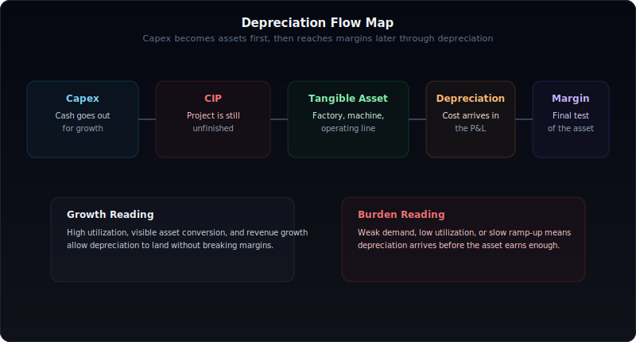
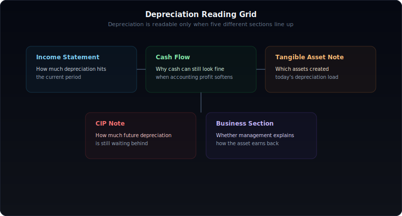
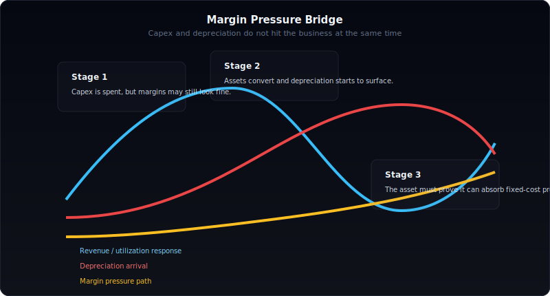
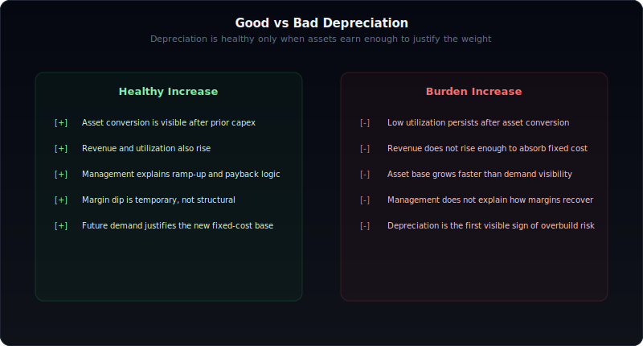
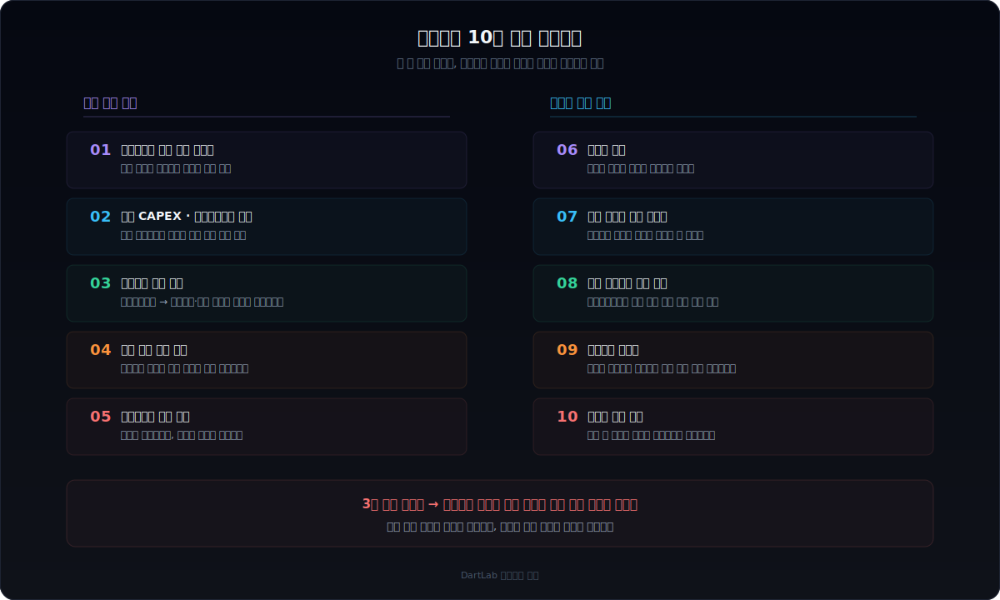

# 사업보고서에서 감가상각 읽는 법

사업보고서를 읽을 때 감가상각은 자주 무시된다.

"현금이 안 나가는 비용이니까 크게 중요하지 않다"는 식으로 넘어가는 경우가 많다.

하지만 그 해석은 절반만 맞다. 감가상각은 지금 막 생긴 비용이 아니라, **과거 설비투자가 현재 손익계산서에 도착한 결과**다. 그래서 감가상각을 읽는다는 것은 단순한 회계 지식을 확인하는 일이 아니라, 기업이 그동안 어떤 투자를 했고 그 투자가 지금 수익성을 얼마나 압박하는지를 읽는 일이다 (CAPEX와 가동률의 선행 신호는 [사업보고서에서 생산능력·가동률·CAPEX 읽는 법](/blog/capacity-utilization-capex)에서 다룬다).

사업보고서에서 감가상각비 증가를 제대로 읽을 수 있으면 다음이 보인다.

- 설비투자가 실제로 운영 자산으로 전환됐는지
- 그 자산이 매출과 이익을 만들어내고 있는지
- 이익률 둔화가 일시적인지 구조적인지
- 고정비 구조가 얼마나 무거워졌는지

이 글은 `감가상각이 무엇인가`, `감가상각비가 늘면 무조건 악재인가`, `현금흐름표와 왜 다르게 보이는가`, `유형자산 주석과 건설중인자산을 어떻게 연결해야 하는가`, `설비투자 후 이익률이 왜 늦게 꺾이는가`를 하나의 프레임으로 정리한 실전 가이드다.

---

## 왜 감가상각을 비용이 아니라 투자 흔적으로 읽어야 하나

감가상각은 과거 투자의 그림자다.

회사가 공장과 기계장치를 짓고, 설비를 들여오고, 그 자산을 운영에 투입하면 그 비용이 한 번에 끝나지 않는다. 장부에서는 그 자산의 사용 기간 동안 나눠서 비용으로 반영한다. 그게 감가상각이다.

그래서 감가상각비가 커진다는 것은 대개 아래 둘 중 하나를 의미한다.

- 과거에 대규모 설비투자가 있었고 지금 그 비용이 손익에 반영되기 시작했다.
- 혹은 이미 무거운 자산 구조를 가진 회사가 더 무거워지고 있다.

이 둘은 숫자는 비슷해 보여도 해석은 완전히 다르다.

첫 번째는 성장 투자의 도착일 수 있다. 두 번째는 과잉투자의 부담일 수 있다.

결국 중요한 건 감가상각비 자체가 아니라, **그 비용이 어떤 자산에서 나왔고 그 자산이 지금 어떤 수익성을 만들고 있는가**다.

---

## 감가상각, CAPEX, 건설중인자산, 유형자산은 무엇이 다른가

감가상각을 읽을 때 가장 흔한 오류는 이 네 개를 서로 다른 시간축에서 보지 않는 것이다.

| 항목 | 무엇을 뜻하나 | 시간축 |
|------|---------------|--------|
| CAPEX | 설비와 자산에 들어가는 투자 | 가장 먼저 |
| 건설중인자산 | 아직 완공되지 않은 진행형 자산 | 중간 |
| 유형자산 | 완공되어 운영 중인 자산 | 전환 완료 |
| 감가상각 | 운영 자산의 비용화 | 손익 도착 |

관계는 단순하다.

1. 회사가 CAPEX를 집행한다.  
2. 공사와 장비 설치가 진행되면 건설중인자산이 쌓인다.  
3. 완공되면 건물·기계장치 같은 유형자산으로 대체된다.  
4. 이후 감가상각비가 손익계산서와 비용 성격 분류에 반영된다.

따라서 감가상각은 단독 항목이 아니다.

그건 투자 사이클의 마지막에 가까운 숫자다. 즉 감가상각을 제대로 해석하려면, 반드시 앞단의 CAPEX, 건설중인자산, 유형자산 변동까지 같이 읽어야 한다.

---

## 사업보고서에서 감가상각은 어디서 확인해야 하나

손익계산서에서 감가상각비를 보는 것만으로는 충분하지 않다.

실전에서는 아래 다섯 곳을 같이 봐야 한다.

### 1. 손익계산서 또는 비용 성격별 분류

여기서는 감가상각비 규모와 전년 대비 증가율을 본다.

### 2. 현금흐름표

감가상각은 비현금성 비용이기 때문에 영업활동 현금흐름 조정 항목에서 같이 읽는다.

### 3. 유형자산 주석

어떤 자산이 늘었는지, 감가상각 누계와 장부가가 어떻게 변했는지를 본다.

### 4. 건설중인자산 주석

지금 반영되는 감가상각의 다음 물량이 뒤에서 얼마나 대기 중인지 본다 (건설중인자산을 읽는 구체적인 방법은 [사업보고서에서 건설중인자산 읽는 법](/blog/construction-in-progress-capex) 참고).

### 5. 사업보고서 본문

증설 목적, 생산능력 확대, 수요 근거, 가동 계획을 읽는다.

이 다섯 곳이 연결돼야 감가상각이 단순 비용인지, 성장 투자 후행 비용인지 구분할 수 있다.

---

## 감가상각비가 늘면 무조건 나쁜 신호인가

아니다.

감가상각비 증가는 대개 마진에 부담을 준다. 하지만 그것이 자동으로 악재는 아니다.

좋은 경우는 보통 이렇다.

- 고가동 또는 수요 확대 후 증설이 실제로 완료됐다
- 유형자산 증가와 감가상각 증가가 함께 보인다
- 생산능력 확대가 매출 증가로 연결된다
- 영업이익률이 약간 눌려도 절대 이익이 더 커진다

위험한 경우는 이렇다.

- 가동률이 충분히 높지 않았는데 감가상각만 커진다
- 유형자산은 커졌는데 매출이 안 따라온다
- 건설중인자산이 유형자산으로 전환된 뒤에도 수요 근거가 약하다
- 감가상각 부담을 이길 만큼 가격 권한이 없다

| 감가상각비 증가 패턴 | 좋은 해석 | 위험한 해석 |
|----------------------|-----------|-------------|
| 매출 동반 증가 | 성장 투자 도착 | 일시적 램프업인지 점검 필요 |
| 자산 전환 후 증가 | 정상적 비용 반영 | 과잉설비 가능성도 열어둬야 함 |
| 감가상각만 빠르게 증가 | 초기 투자 후행 반영 | 수익성 압박 심화 |
| 가동률 낮은 상태의 증가 | 구조 전환 여부 확인 | 투자 효율 저하 가능성 큼 |

즉 감가상각비 증가를 볼 때는 `비용이 늘었다`가 아니라 `그 비용을 만든 자산이 지금 돈을 벌고 있는가`를 물어야 한다.

---

## 감가상각이 이익률을 왜곡하는 방식은 무엇인가

설비투자 후 이익률은 자주 늦게 흔들린다.

이유는 간단하다.

- 현금은 CAPEX 시점에 먼저 나간다
- 건설중인자산 단계에서는 아직 비용이 크게 안 보인다
- 유형자산 전환 이후 감가상각이 본격 반영된다

즉 투자와 손익 압력 사이에는 시차가 있다.

그래서 투자 초기에 기업은 생각보다 괜찮아 보일 수 있다. 아직 감가상각이 충분히 올라오지 않았기 때문이다. 반대로 완공 직후에는 매출이 충분히 안 붙었는데 감가상각이 먼저 올라와 이익률이 예상보다 빨리 꺾일 수 있다.

실무적으로 가장 중요한 건 아래 두 가지다.

1. 감가상각비 증가가 일시적 램프업 부담인지  
2. 아니면 구조적으로 무거워진 고정비인지

이걸 구분하지 못하면, 같은 영업이익률 둔화도 전혀 다르게 읽게 된다.

---

## 유형자산 주석과 건설중인자산 주석을 어떻게 같이 봐야 하나

감가상각은 뒤에서 튀어나오지 않는다.

그 전 단계가 반드시 있다.

### 1. 건설중인자산이 먼저 쌓였는가

뒤늦은 감가상각 증가는 대부분 앞선 기간의 건설중인자산 축적을 동반한다.

### 2. 이후 어떤 유형자산으로 대체됐는가

기계장치인지, 건물인지에 따라 생산성과 회수 속도가 달라질 수 있다.

### 3. 감가상각 부담이 어느 비용 라인으로 보이는가

매출원가, 판관비, 비용 성격별 분류 중 어디에 더 크게 나타나는지에 따라 해석이 달라진다.

### 4. 다음 감가상각 물량이 또 대기 중인가

건설중인자산이 여전히 크다면, 지금 보이는 감가상각은 시작에 불과할 수 있다.

즉 감가상각을 읽는다는 건 현재 비용만 보는 게 아니라, **다음 해 비용 압력까지 미리 보는 일**이다.

---

## 좋은 감가상각 증가와 위험한 증가를 어떻게 구분하나

아래 기준으로 보면 실전 해석이 쉬워진다.

| 구분 | 좋은 증가 | 위험한 증가 |
|------|-----------|-------------|
| 투자 배경 | 고가동, 병목 해소, 수요 확대 | 낮은 활용도, 불분명한 수요 |
| 자산 전환 | 건설중인자산 -> 유형자산 전환 명확 | 전환은 됐지만 활용도 낮음 |
| 매출 연결 | 매출과 생산능력이 함께 증가 | 자산만 커지고 매출 정체 |
| 마진 설명 | 램프업 이후 회수 논리 존재 | 감가상각 흡수 논리 부재 |
| 다음 단계 | 이후 수익성 개선 가능 | 고정비만 무거워짐 |

좋은 감가상각 증가는 성장 투자의 비용 도착이다.

위험한 감가상각 증가는 아직 돈을 못 버는 자산의 무게가 손익으로 내려오는 것이다.

차이는 비용의 존재가 아니라, **그 비용을 정당화할 매출과 마진이 있는가**다.

---

## 숫자가 비슷해도 해석이 갈리는 4가지 케이스

같은 감가상각비 증가도 상황에 따라 전혀 다르게 읽힌다.

### 1. 매출은 늘지만 감가상각이 더 빨리 늘어 이익률이 둔화한다

정상적 램프업 구간일 수 있다. 다만 회수 속도가 늦으면 구조적 부담으로 바뀐다.

### 2. 감가상각은 늘었는데 현금흐름은 안정적이다

감가상각은 비현금성 비용이기 때문에 가능하다. 이 경우 현금창출력은 괜찮지만, 회계상 수익성이 눌리는 구간일 수 있다.

### 3. 증설 후 감가상각이 올라왔지만 가동률이 낮다

투자가 너무 빨랐거나, 수요가 예상보다 약한 경우다. 가장 위험한 패턴 중 하나다.

### 4. 유형자산은 커졌는데 수익성 회수 논리가 약하다

자산은 운영에 들어갔지만 가격 권한이 약하거나, 제품 믹스가 나쁘거나, 생산 효율이 기대에 못 미칠 수 있다.

| 케이스 | 핵심 질문 |
|--------|-----------|
| 이익률 둔화 | 일시적 램프업인가, 구조적 부담인가 |
| 현금흐름 안정 | 비현금 비용이라는 점을 어떻게 해석할까 |
| 저가동 + 고감가상각 | 자산 활용도가 낮은가 |
| 회수 논리 약함 | 이 자산이 정말 돈을 벌고 있는가 |

---

## 산업별로 감가상각 해석이 왜 달라지나

감가상각은 모든 산업에서 중요하지만, 읽는 방식은 다르다.

| 산업군 | 중요하게 볼 것 | 해석 포인트 |
|--------|----------------|-------------|
| 반도체·배터리·소재 | 대규모 장치 투자 | 감가상각 레버리지와 사이클 민감도 큼 |
| 자동차부품·기계 | 고객 수주와 설비 매칭 | 고정비 선행 위험 점검 |
| 식품·소비재 제조 | 생산라인 자동화·확장 | 효율 개선과 판가 전가력 확인 |
| 자산 경량 산업 | 상대적 중요도 낮음 | 같은 프레임을 그대로 적용하면 왜곡 가능 |

예를 들어 반도체나 배터리 같은 산업은 감가상각 자체가 사업 구조의 핵심일 수 있다. 반면 자산이 가벼운 산업에서는 감가상각 증가보다 인건비나 마케팅 비용이 더 중요할 수 있다.

즉 감가상각비 증가는 절대 숫자보다 **산업의 자산 집약도 안에서** 읽어야 한다.

---

## 10분 실전 체크리스트

시간이 없으면 이것만 봐도 된다.

1. 감가상각비가 전년 대비 얼마나 늘었는가  
2. 그 전에 CAPEX와 건설중인자산 축적이 있었는가  
3. 유형자산 전환이 실제로 확인되는가  
4. 감가상각 증가와 매출 증가가 같이 나타나는가  
5. 영업이익률 둔화가 일시적인가 구조적인가  
6. 가동률이 충분히 높은가  
7. 감가상각 부담을 흡수할 가격 권한이 있는가  
8. 다음 감가상각 물량이 건설중인자산에 남아 있는가  
9. 현금흐름은 여전히 건전한가  
10. 경영진이 회수 논리를 구체적으로 설명하는가

이 중 세 개 이상이 흐리면, 감가상각비 증가는 성장의 신호보다 부담의 신호일 가능성이 높다.

---

## FAQ

### 감가상각비가 늘면 무조건 악재인가

아니다. 성장 투자 이후 정상적으로 도착한 비용일 수 있다. 다만 그 자산이 실제 매출과 이익을 만들고 있는지 반드시 확인해야 한다.

### 감가상각과 CAPEX는 어떻게 다른가

CAPEX는 현금이 나가는 투자 단계이고, 감가상각은 그 투자 자산이 운영에 들어간 뒤 비용으로 반영되는 단계다.

### 감가상각은 현금이 빠져나가는 비용인가

아니다. 감가상각 자체는 비현금성 비용이다. 하지만 과거에 실제 현금이 나간 투자와 연결돼 있다.

### 감가상각비 증가는 어디서 먼저 확인해야 하나

손익계산서와 비용 성격별 분류에서 먼저 보고, 이어서 유형자산 주석과 건설중인자산 주석으로 원인을 확인해야 한다.

### 어떤 산업에서 특히 중요하게 봐야 하나

반도체, 배터리, 소재, 자동차부품, 철강, 화학, 식품가공처럼 설비 비중이 큰 제조업에서 특히 중요하다.

---

### 관련 글

- [재무제표, 숫자만 보면 안 되는 이유](/blog/beyond-the-numbers) — 재무 숫자의 맥락을 읽는 기본 프레임

## 결국 감가상각은 과거 투자와 미래 수익성 사이의 다리다

사업보고서에서 감가상각을 읽는 이유는 단순하다.

우리는 비용 한 줄을 보는 게 아니라, 과거 설비투자가 지금 어떤 무게로 손익에 도착하고 있는지 알고 싶다.

감가상각은 회계 처리이지만, 해석은 절대 회계에서 끝나지 않는다.

그 안에는 CAPEX가 있고, 건설중인자산이 있고, 유형자산 전환이 있고, 그 자산을 감당할 수 있는 매출과 가동률이 있다.

결국 좋은 투자자는 감가상각을 "비현금성 비용"으로만 보지 않는다.

그걸 **미래 수익성의 시험지**로 읽는다.
