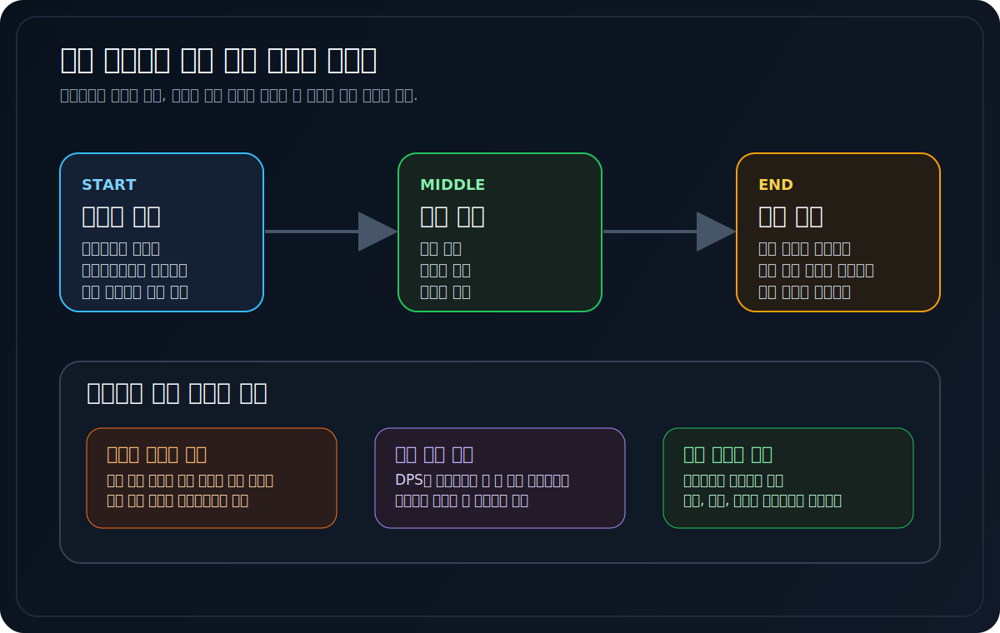
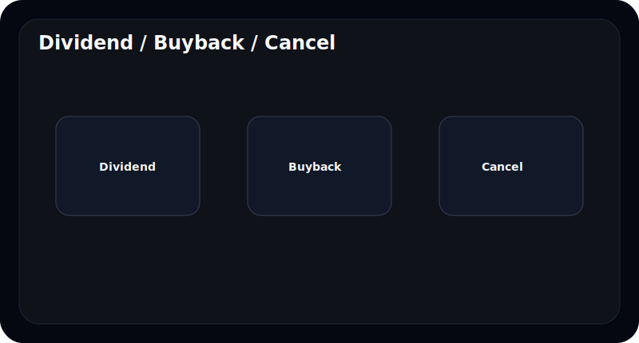
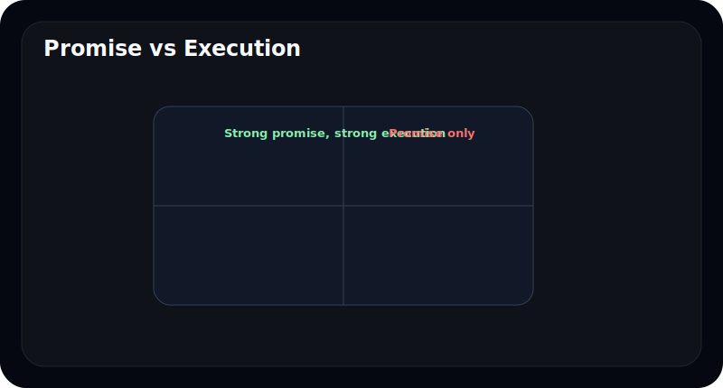
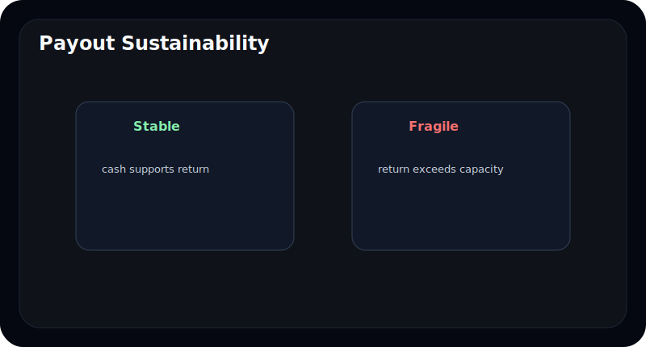
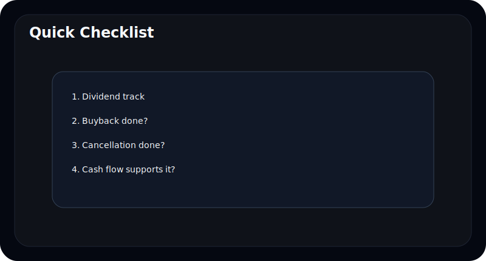

# 주주환원 정책은 말과 숫자 중 무엇을 봐야 하나

주주환원은 초보자에게도 익숙한 단어다. 배당 확대, 자사주 매입, 자사주 소각 같은 표현은 기사 제목에도 자주 나온다.

문제는 많은 사람이 발표 문구 자체를 곧바로 좋은 신호로 받아들인다는 점이다. 하지만 주주환원은 말보다 **실행 숫자**가 훨씬 중요하다.

이 글은 주주환원 정책을 처음 보는 사람도 쉽게 이해할 수 있도록, 배당과 자사주, 소각을 어떤 순서로 보고 무엇을 경계해야 하는지 정리한다.

---

## 주주환원에서 제일 먼저 구분해야 할 것은 무엇인가

주주환원은 보통 세 가지로 많이 이야기된다.

| 방식 | 의미 |
| --- | --- |
| 배당 | 현금을 직접 주주에게 돌려줌 |
| 자사주 매입 | 시장에서 자기 주식을 사들임 |
| 자사주 소각 | 주식 수를 줄여 주당 가치에 영향 |

초보자는 이 세 가지를 한 덩어리로 보지만, 실제 의미는 다르다. 특히 자사주 매입은 `소각까지 가는지`, `그냥 들고 있는지`에 따라 느낌이 달라진다.

---

## 왜 발표보다 실행을 먼저 봐야 하나

주주환원은 약속하기는 쉽지만, 꾸준히 실행하기는 어렵다. 그래서 초보자는 아래를 먼저 보는 편이 좋다.

- 실제 배당이 계속 늘어왔는가
- 자사주 매입이 있었는가
- 매입 후 소각까지 이어졌는가
- 한 번의 이벤트인지 지속 정책인지

| 발표 | 숫자로 확인할 것 |
| --- | --- |
| 주주환원 강화 | 실제 배당총액, DPS, payout ratio |
| 자사주 매입 | 매입 금액, 수량, 시점 |
| 주주가치 제고 | 소각 여부, 반복성 |

주주환원은 "무슨 말을 했는가"보다 "실제로 무엇을 했는가"가 훨씬 중요하다.

---

## 초보자가 특히 헷갈리는 것은 무엇인가

가장 흔한 혼동은 이거다.

- 배당 확대 기사 = 항상 좋은 것
- 자사주 매입 = 무조건 주주 친화적
- 소각 언급 = 이미 가치 제고 완료

하지만 실제로는:

- 배당은 지속 가능해야 하고
- 자사주 매입은 가격, 규모, 반복성이 중요하고
- 소각은 실제 실행 여부가 중요하다

---

## 좋은 주주환원과 경계할 주주환원은 어떻게 다른가

| 구분 | 상대적으로 좋은 경우 | 경계할 경우 |
| --- | --- | --- |
| 배당 | 꾸준함 | 일회성 과시 |
| 자사주 | 매입 후 소각 또는 명확한 목적 | 매입만 하고 활용 불명확 |
| 설명 | 장기 정책이 보임 | 이벤트성 언급만 많음 |
| 재무여력 | 현금흐름이 뒷받침 | 무리한 환원 |

좋은 주주환원은 크기보다 **지속성과 일관성**이 더 중요하다.

---

## 무엇과 같이 봐야 하나

주주환원 정책은 아래와 같이 보면 더 잘 읽힌다.

- 영업현금흐름
- 차입금 부담
- CAPEX 계획
- 실적 사이클

현금흐름이 약하고 투자 부담이 큰데도 환원을 과하게 강조하면, 초보자는 오히려 더 조심할 필요가 있다.

---

## 자주 틀리는 해석 4가지

### 1. 자사주 매입은 무조건 좋다고 본다

매입 후 어떻게 처리하는지가 중요하다.

### 2. 배당이 높으면 무조건 안전하다고 본다

지속 가능성이 더 중요하다.

### 3. 소각 계획만 나와도 끝났다고 생각한다

실제 실행 여부를 봐야 한다.

### 4. 주주환원은 숫자가 아니라 태도라고 본다

태도도 중요하지만, 결국 숫자가 확인해준다.

---

## 10분 체크리스트

- 배당이 꾸준한가
- 자사주 매입이 실제로 있었는가
- 소각까지 이어졌는가
- 현금흐름이 뒷받침되는가
- 이벤트성이 아니라 정책으로 보이는가

---

## FAQ

### 자사주 매입이 왜 항상 좋은 건 아닌가

매입만 하고 소각하지 않거나, 목적이 불명확할 수 있기 때문이다.

### 배당이 높으면 좋은 회사인가

항상 그렇지는 않다. 지속 가능성과 재무여력을 같이 봐야 한다.

### 초보자는 어떤 숫자부터 보면 되나

DPS, payout ratio, 매입 금액, 소각 여부 정도면 충분하다.

### 가장 중요한 한 가지는 무엇인가

발표보다 실제 실행이다.

---

## 참고한 공식 자료

- DART 보고서정보: https://dart.fss.or.kr/introduction/content2.do
- 금융감독원 전자공시시스템: https://dart.fss.or.kr/
- OpenDART 개발가이드: https://opendart.fss.or.kr/guide/main.do

---

## 정리

주주환원은 좋은 단어다. 하지만 초보자가 정말 봐야 하는 것은 단어가 아니라 숫자와 실행이다.

배당, 자사주, 소각은 발표보다 반복성과 실제 실행 흐름으로 읽을 때 의미가 커진다.
