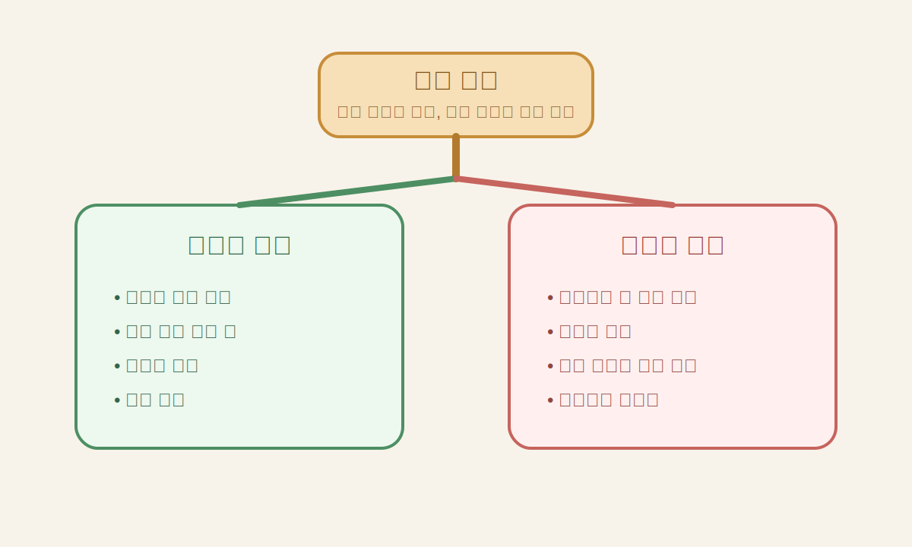
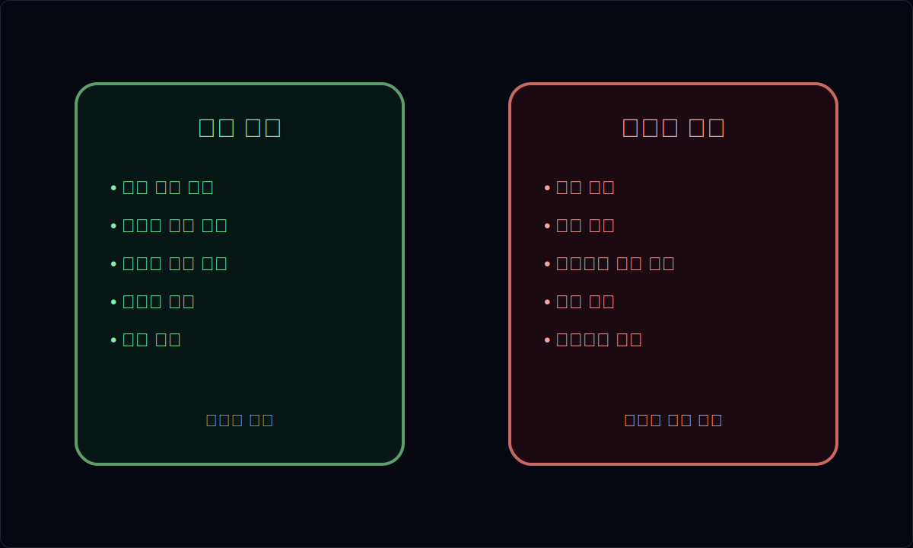
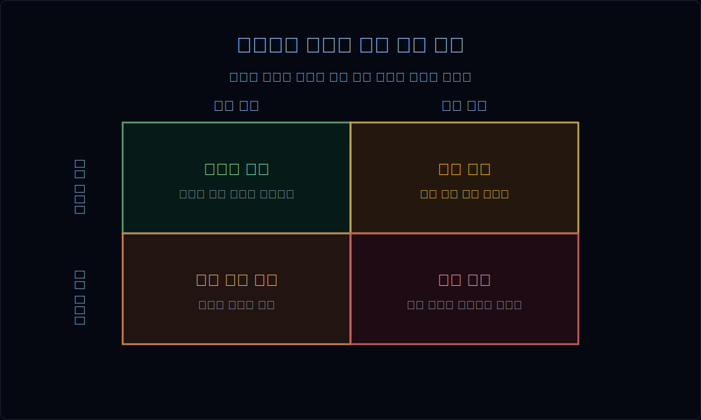
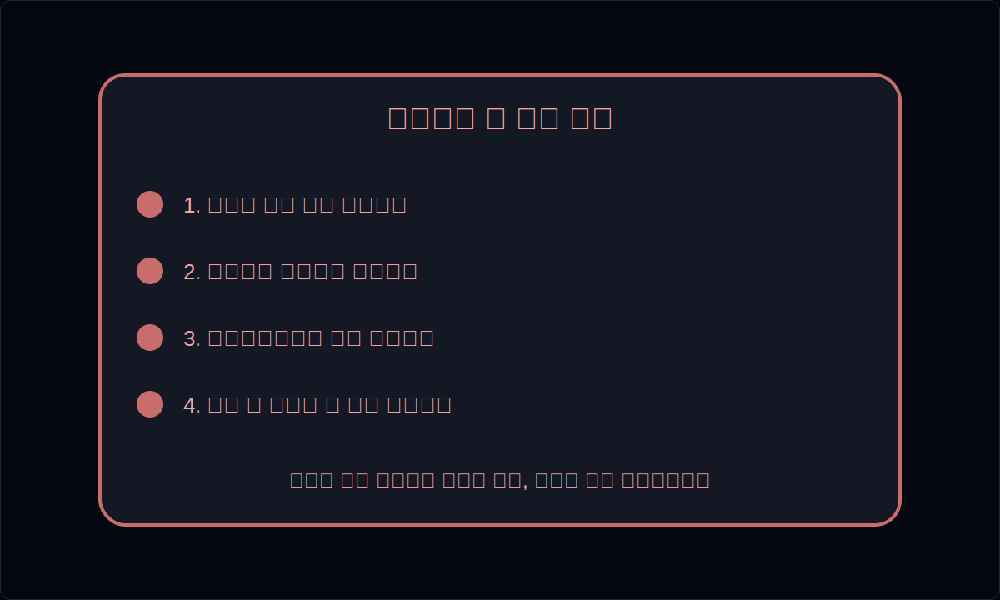
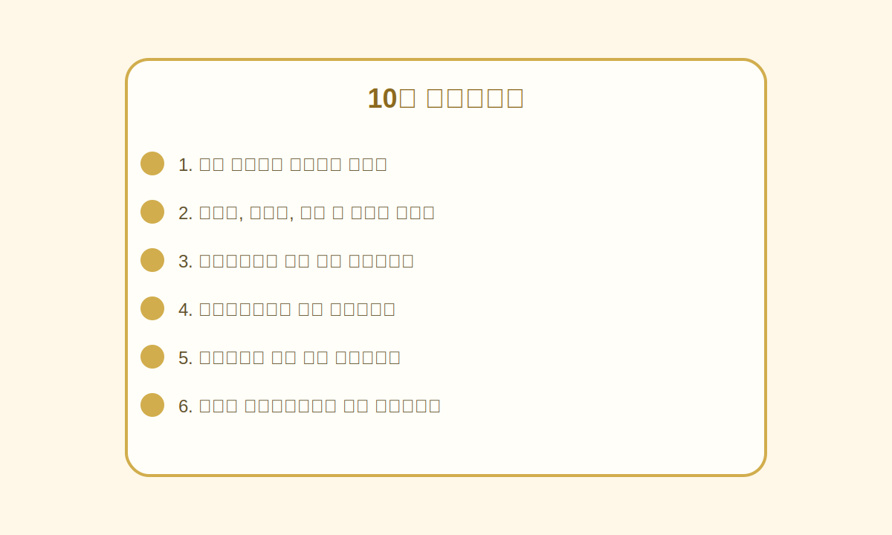

# 재고자산과 평가손실 읽는 법

재고가 늘면 많은 사람은 먼저 "앞으로 더 팔 준비를 하나 보다"라고 생각한다. 실제로 그럴 때도 있다.

하지만 재고는 매출보다 먼저 경고를 주는 숫자이기도 하다. 팔릴 것이라고 믿고 만든 물건이 실제 수요를 못 따라가면, 그 신호가 가장 먼저 쌓이는 곳이 재고다.

이 글은 재고자산과 평가손실을 통해 **수요의 질과 이익의 질**을 읽는 방법을 정리한다. 재고 증가가 좋은 경우와 위험한 경우, 재고 구성표에서 봐야 할 것, 회전율과 매출총이익률의 관계, 평가손실이 진짜 경고가 되는 순간을 실전 기준으로 설명한다.

---

## 재고는 왜 매출보다 먼저 경고를 주나

매출은 이미 팔린 결과다. 반면 재고는 회사가 예상한 수요와 생산 계획이 얼마나 쌓여 있는지를 보여준다.

그래서 재고가 빠르게 쌓이면 두 가지 가능성을 생각해야 한다.

- 수요가 실제로 좋아서 생산과 준비가 늘고 있다
- 수요를 낙관적으로 봤지만 판매 속도가 기대에 못 미친다

| 숫자 | 질문 |
| --- | --- |
| 매출 | 실제로 얼마나 팔렸나 |
| 재고 | 예상 수요와 생산 판단이 얼마나 쌓였나 |
| 매출총이익률 | 그 판매가 수익성 있게 이뤄졌나 |
| 평가손실 | 쌓인 재고의 가치가 훼손되기 시작했나 |

즉 재고는 단순 자산이 아니라, 경영진의 수요 판단이 맞고 있는지 보여주는 숫자다.

## 재고 증가가 좋은 경우와 나쁜 경우는 어떻게 다른가

재고 증가 자체는 중립적이다. 중요한 것은 **왜 늘었고, 무엇과 같이 늘었는가**다.

좋은 경우는 대체로 이런 모습이다.

- 신규 제품 출시나 계절성 수요를 앞두고 일시적으로 늘었다
- 매출과 출하가 같이 늘고 있다
- 회전율이 크게 무너지지 않는다
- 매출총이익률과 영업현금흐름이 버틴다

위험한 경우는 대개 이렇다.

- 매출보다 재고가 더 빨리 늘어난다
- 여러 분기 연속 누적된다
- 회전율이 떨어지고 평가손실이 붙기 시작한다
- 마진도 함께 약해진다

| 구분 | 상대적으로 건강한 경우 | 위험한 경우 |
| --- | --- | --- |
| 재고 증가 배경 | 신규 제품, 계절성, 증설 준비 | 판매 둔화, 수요 착시, 채널 적체 |
| 매출과의 관계 | 매출도 같이 성장 | 매출은 둔한데 재고만 누적 |
| 회전율 | 안정적이거나 일시 둔화 | 연속 악화 |
| 마진 | 유지 또는 방어 | 할인 판매로 하락 |
| 평가손실 | 제한적 | 반복적 또는 급증 |

## 재고 구성표에서 무엇을 봐야 하나

재고 합계만 보면 놓친다. 원재료, 재공품, 제품, 상품 중 어디가 늘고 있는지가 더 중요하다.

재고 구성은 회사가 어디에서 막히고 있는지 보여준다.

- 원재료 증가: 생산 계획은 강한데 실제 판매 전개는 아직 불확실할 수 있다
- 재공품 증가: 공정 중 병목이나 출하 지연 가능성을 생각해야 한다
- 제품 증가: 완성품이 팔리지 않고 쌓일 수 있다
- 상품 증가: 유통/리테일 채널 수요 판단이 틀릴 수 있다

| 재고 항목 | 주로 뜻하는 것 | 더 봐야 할 것 |
| --- | --- | --- |
| 원재료 | 생산 준비 | 원가 압력, 생산 계획 |
| 재공품 | 공정 중 누적 | 생산 병목, 주문 지연 |
| 제품 | 완성품 누적 | 판매 둔화, 할인 가능성 |
| 상품 | 매입 상품 누적 | 채널 재고, 수요 착시 |

특히 완성품 성격의 재고가 길게 쌓이면, 그다음은 보통 할인 판매나 평가손실 가능성으로 이어진다.

## 회전율과 매출총이익률을 같이 읽어야 하는 이유

재고를 볼 때 가장 많이 놓치는 조합이 `회전율 + 매출총이익률`이다.

회전율만 떨어지면 일시적인 생산 조정일 수도 있다. 하지만 회전율이 떨어지는데 매출총이익률도 같이 약해지면 얘기가 달라진다. 쌓인 재고를 팔기 위해 가격을 낮추거나, 원가 부담을 충분히 전가하지 못하고 있을 수 있기 때문이다.

| 조합 | 해석 |
| --- | --- |
| 회전율 안정 + 마진 안정 | 비교적 건강한 상태 |
| 회전율 둔화 + 마진 안정 | 수요 속도 점검 필요 |
| 회전율 둔화 + 마진 하락 | 재고 압력 가능성 큼 |
| 회전율 급락 + 마진 급락 | 할인 판매, 평가손실 가능성 |

이 지점은 [`매출은 느는데 왜 위험할 수 있나`](/blog/why-rising-sales-can-still-be-risky)와도 연결되지만, 이번 글은 그중에서도 재고만 따로 깊게 보는 글이다.

## 평가손실은 언제 진짜 위험 신호가 되나

평가손실이 한 번 나왔다고 무조건 나쁜 것은 아니다. 오히려 늦게라도 손실을 인식하면 현실을 반영하고 있다는 뜻일 수도 있다.

문제는 이런 패턴이다.

- 재고가 여러 분기 쌓인 뒤 뒤늦게 손실이 크게 잡힌다
- 업황 둔화가 분명한데도 평가손실 반영이 너무 약하다
- 제품 믹스가 바뀌었는데 구형 재고 정리가 늦다
- 마진 하락과 재고 누적, 평가손실이 동시에 나타난다

좋은 질문은 "평가손실이 나왔는가"가 아니라 "왜 지금 나왔고, 이전부터 보이던 신호를 얼마나 늦게 반영한 것인가"다.

| 패턴 | 해석 |
| --- | --- |
| 재고 증가 + 평가손실 미미 | 아직 위험이 적을 수도 있으나 과소반영 가능성도 있음 |
| 재고 증가 + 회전율 악화 + 평가손실 시작 | 본격적 경고 신호 |
| 대규모 평가손실 한 번에 인식 | 문제가 누적되다 늦게 반영됐을 가능성 |
| 평가손실 후에도 재고 누적 지속 | 구조적 수요 문제 가능성 |

## 좋은 재고와 위험한 재고를 빠르게 구분하는 법

재고를 볼 때는 아래 순서가 가장 효율적이다.

1. 재고 증가율이 매출 증가율보다 빠른가
2. 어떤 항목의 재고가 늘고 있는가
3. 회전율이 둔화되고 있는가
4. 매출총이익률이 같이 약해지는가
5. 평가손실이 붙고 있는가

이 다섯 질문만으로도 대부분의 초보자는 재고를 훨씬 덜 막연하게 볼 수 있다.

이때 재고만 보지 말고 [`매출채권과 대손충당금 읽는 법`](/blog/receivables-and-allowance)도 같이 보면 좋다. 채권과 재고가 동시에 쌓이면 성장의 질이 더 약해질 가능성이 크기 때문이다.

## 자주 틀리는 해석 4가지

### 1. 재고 증가는 성장 준비라고만 본다

준비일 수도 있지만, 판매 둔화의 결과일 수도 있다.

### 2. 평가손실이 적으니 안전하다고 본다

반대로 위험을 아직 덜 반영했을 수도 있다.

### 3. 재고 회전율만 본다

회전율은 매출총이익률과 같이 볼 때 의미가 커진다.

### 4. 완성품 재고와 원재료 재고를 같은 의미로 본다

어느 층에서 쌓이는지에 따라 해석이 완전히 달라진다.

## 10분 체크리스트

- 재고 증가율이 매출 증가율보다 빠른가
- 원재료, 재공품, 제품 중 어디가 늘고 있는가
- 재고회전율이 여러 분기 연속 둔화되는가
- 매출총이익률이 같이 약해지는가
- 평가손실이 붙기 시작했거나 늦게 크게 반영됐는가
- 채권과 영업현금흐름도 같이 나빠지고 있지 않은가

## FAQ

### 재고가 늘면 무조건 나쁜가

아니다. 신규 제품, 계절성, 증설 준비처럼 정상적인 이유도 많다. 다만 매출, 회전율, 마진과 같이 봐야 한다.

### 어떤 재고가 가장 위험한가

보통 완성품 성격의 재고가 길게 쌓일 때 위험 신호가 더 강하다.

### 평가손실이 크면 무조건 나쁜가

무조건 그렇지는 않다. 다만 그 손실이 너무 늦게 반영된 것이라면 더 문제다.

### 초보자는 어떤 숫자부터 같이 보면 되나

재고 증가율, 재고회전율, 매출총이익률, 영업현금흐름 순서가 가장 실용적이다.

### 제조업과 유통업은 같은 방식으로 봐도 되나

기본 원리는 같지만, 유통업은 상품 재고와 할인 압력, 제조업은 원재료·재공품과 가동률까지 더 봐야 한다.

## 참고한 공식 자료

- IFRS Foundation IAS 2 Inventories: https://www.ifrs.org/issued-standards/list-of-standards/ias-2-inventories/
- IFRS Foundation IAS 2 Supporting Materials: https://www.ifrs.org/supporting-implementation/supporting-materials-by-ifrs-standards/ias-2/
- DART 보고서정보: https://dart.fss.or.kr/introduction/content2.do

## 정리

재고는 단순히 창고에 쌓인 물건이 아니다. 경영진이 본 수요 전망, 생산 계획, 가격 전략, 그리고 그 판단의 성공 여부가 먼저 드러나는 숫자다.

좋은 분석은 재고 증가를 보고 끝나지 않는다. 어떤 재고가 쌓였는지, 회전율과 마진이 어떻게 움직이는지, 그리고 결국 평가손실로 이어지는지를 같이 본다.
