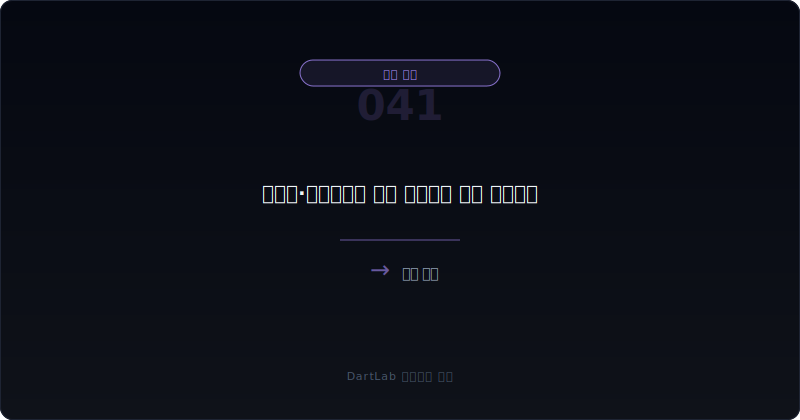
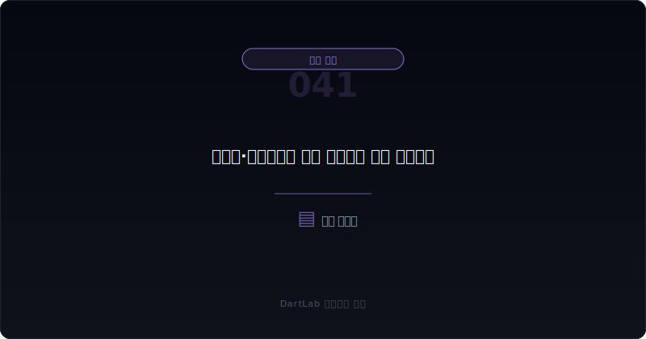
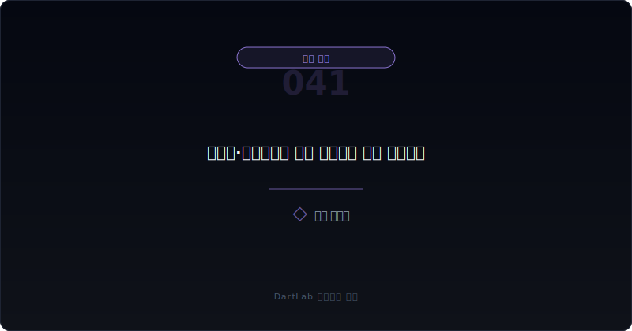
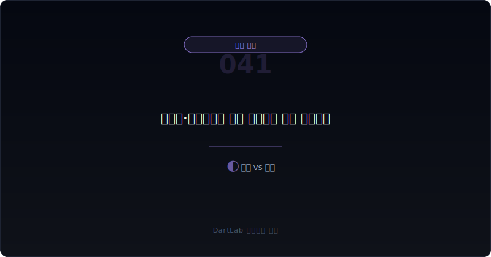
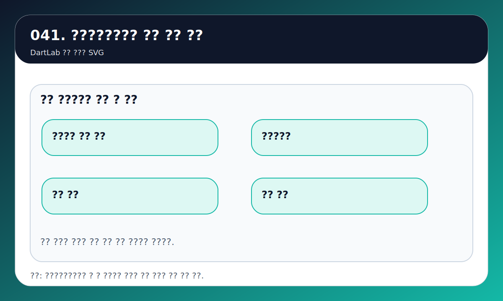

# 선수금·계약부채는 좋은 신호인가 위험 신호인가

선수금과 계약부채는 처음 보면 대체로 좋아 보인다. 고객이 먼저 돈을 넣었다는 뜻처럼 느껴지기 때문이다. 실제로 선지급 구조는 회사 입장에서 강한 현금 버퍼가 될 수 있다. 그런데 이 항목도 숫자 하나만 보고 해석하면 자주 틀린다.

같은 선수금·계약부채라도 어떤 회사는 강한 수요와 협상력을 보여주고, 어떤 회사는 인도 지연과 이행 의무 부담, 환불 위험, 일시적인 선주문 효과를 보여준다. 그래서 핵심은 잔액 자체가 아니라 `왜 생겼고, 어떻게 줄고, 어떤 현금흐름과 연결되는가`를 보는 것이다.

이 글은 선수금·계약부채를 `발생 원인 -> 영업현금흐름 연결 -> 매출 인식 속도 -> 환불·이행 부담 -> 다음 보고서 추적` 순서로 읽는 법을 정리한다. 현금흐름 축은 [영업현금흐름이 순이익을 부정할 때](/blog/operating-cash-flow-vs-net-income), 채권 축은 [매출채권과 대손충당금 읽는 법](/blog/receivables-and-allowance), 재고 축은 [재고자산과 평가손실 읽는 법](/blog/inventory-and-write-downs)와 같이 보면 훨씬 정확해진다.

---

## 왜 이 숫자가 좋아 보이기만 해서는 안 되나

선수금과 계약부채는 고객이 먼저 돈을 넣었다는 점에서 분명 강점이 될 수 있다. 현금이 먼저 들어오고, 회사는 나중에 제품이나 서비스를 이행한다. 그래서 성장기 기업이나 프로젝트형 사업에서는 좋은 신호로 읽히는 경우가 많다.

하지만 실전에서는 아래 질문이 바로 뒤따라야 한다.

- 이 돈은 반복적으로 들어오는가
- 이행 의무가 무겁지 않은가
- 환불, 취소, 납기 지연 위험이 없는가
- 매출이 커지는데 선수금·계약부채는 오히려 줄고 있지 않은가

즉 선수금과 계약부채는 `좋은 현금`일 수도 있고 `미뤄진 부담`일 수도 있다. 이 차이를 가르는 가장 좋은 방법은 손익, 영업현금흐름, 채권, 재고와 같이 보는 것이다.

---

## 같은 항목인데 해석이 갈리는 이유

| 먼저 볼 항목 | 왜 중요한가 |
| --- | --- |
| 선수금·계약부채 잔액 | 선지급 구조의 크기를 본다 |
| 영업현금흐름 | 선지급 구조가 실제 현금 완충으로 작동하는지 본다 |
| 매출 인식 속도 | 얼마나 빠르게 수익으로 전환되는지 본다 |
| 채권 | 선지급 구조와 외상 매출 구조가 동시에 악화되는지 본다 |
| 재고·이행 준비 | 공급과 납품 준비가 따라가는지 본다 |
| 환불·취소·지연 | 좋은 선수금이 위험 신호로 바뀌는 지점을 본다 |

예를 들어 계약부채가 크고 영업현금흐름도 강하면 좋은 구조일 수 있다. 하지만 계약부채가 줄어드는데 매출만 커지고 채권이 늘고 있다면 해석이 달라진다. 과거에는 고객이 먼저 돈을 넣었는데, ఇప్పుడు는 회사가 외상 매출에 더 의존하고 있을 수 있기 때문이다.

반대로 계약부채가 늘어도 무조건 좋은 것은 아니다. 납기 지연과 이행 부담이 같이 커지고, 재고나 원가 압박이 심해지면 나중에 수익성 훼손으로 이어질 수 있다. 그래서 계약부채는 현금 신호이면서 동시에 수행 부담 신호이기도 하다.

---

## 건강한 구조 vs 위험한 구조

가장 실용적인 질문은 이것이다. `이 선수금이 강한 수요의 결과인가, 아니면 앞으로 이행해야 할 부담인가`.

여기서 먼저 세 갈래로 나누면 좋다.

1. 반복적인 선지급 구조
2. 프로젝트·수주형 일시 버퍼
3. 납기 지연과 환불 위험이 섞인 부담 구조

반복적인 선지급 구조라면 고객 관계와 서비스 모델이 강한 경우가 많다. 이 경우 계약부채가 영업현금흐름과 같이 버텨 주는 경향이 있다. 반면 프로젝트형 일시 버퍼는 수주 초기에는 좋아 보여도, 수행 부담과 원가 통제 실패가 뒤따르면 생각보다 빨리 약해질 수 있다.

위험한 경우는 세 번째다. 계약부채는 커졌는데 재고와 원가 부담도 같이 늘고, 납기 지연이 생기고, 다음 보고서에서 계약부채가 빠르게 줄면서 채권이 늘면 해석이 바뀐다. 이때는 좋은 선지급 구조라기보다 `앞당겨 받은 돈으로 버티던 구간이 끝나는 중`일 수 있다.

---

## 업종과 맥락에 따라 달라지는 기준

| 관찰 포인트 | 상대적으로 건강한 경우 | 더 조심해야 하는 경우 |
| --- | --- | --- |
| 현금흐름 | 계약부채와 영업현금흐름이 같이 버틴다 | 매출은 늘지만 현금은 약하다 |
| 매출 인식 | 이행 속도와 매출 인식이 자연스럽다 | 인식 지연과 설명 부족이 반복된다 |
| 채권 | 선지급 구조 덕분에 채권 부담이 낮다 | 계약부채는 줄고 채권은 늘어난다 |
| 재고·원가 | 공급 준비가 비교적 안정적이다 | 수행 부담과 원가 압박이 커진다 |
| 후속 보고서 | 계약부채 변화가 설명 가능하다 | 감소 이유와 환불 부담이 흐리다 |

핵심은 `선수금이 많다`가 아니라 `그 구조가 다음 보고서에서도 건강하게 이어지는가`다. 고객이 먼저 돈을 넣는 구조는 분명 강할 수 있다. 하지만 그 돈이 반복되지 않고, 이행 부담만 남고, 환불 가능성이나 수익성 훼손이 커지면 오히려 위험 신호가 된다.

그래서 선수금·계약부채는 매출 성장 이야기보다 질의 문제에 더 가깝다. [매출은 느는데 왜 위험할 수 있나](/blog/why-rising-sales-can-still-be-risky)와 같이 읽으면 이 차이가 더 빨리 보인다. 매출 자체보다 어떤 조건으로 매출이 만들어지는지, 그 과정에서 현금이 유지되는지가 중요하기 때문이다.

---

## 어떤 조합이면 좋은 신호에 더 가깝나

실전에서는 선수금·계약부채가 좋으냐 나쁘냐를 단독으로 판단하지 않는다. 몇 가지 숫자 조합을 같이 보면 훨씬 빨리 갈린다.

첫째, `계약부채 유지 + 영업현금흐름 강세 + 채권 안정` 조합은 비교적 건강하다. 고객이 먼저 돈을 넣고 있고, 회사는 그 구조를 현금으로도 지키고 있기 때문이다. 둘째, `계약부채 증가 + 재고·원가 안정` 조합도 좋다. 수행 부담이 통제되고 있다는 뜻일 수 있다.

반대로 `계약부채 감소 + 매출 증가 + 채권 증가` 조합은 더 조심해야 한다. 과거 선지급 구조가 약해지고 외상 매출 비중이 커질 수 있다. 또 `계약부채 증가 + 재고 급증 + 납기 설명 악화` 조합은 좋은 수요보다 수행 부담 누적일 수 있다.

이 네 조합만 익혀도 선수금과 계약부채를 훨씬 덜 단순하게 읽게 된다. 고객이 먼저 돈을 냈다는 사실보다, 그 구조가 이후에도 건강하게 유지되는지가 더 중요하다.

---

## 업종에 따라 왜 해석이 달라지나

선수금과 계약부채는 업종마다 의미가 많이 다르다. 프로젝트형 산업에서는 초기 선수금이 일반적일 수 있고, 구독형 사업에서는 계약부채가 반복적으로 유지되는 것이 자연스럽다. 반면 일회성 판촉이나 단기 이벤트성 주문으로 생긴 선수금은 지속성이 약할 수 있다.

그래서 이 항목을 볼 때는 `원래 이 회사는 어떤 구조였는가`를 먼저 떠올리는 편이 좋다. 원래 반복 선지급 구조가 강한 회사라면 그 강도가 약해지는 순간이 중요하고, 원래 후불 구조가 강한 회사라면 अचानक 선수금이 크게 늘어나는 배경을 따로 봐야 한다.

하지만 업종 차이를 감안해도 변하지 않는 질문이 있다. 다음 보고서에서 같은 구조가 건강하게 이어지는가 하는 점이다. 업종 특성은 출발점이지 결론이 아니다.

---

## 비교에서 자주 빠지는 함정

### 1. 선수금이 많으면 무조건 좋은 회사라고 본다

반복 구조인지, 일시 버퍼인지부터 구분해야 한다.

### 2. 계약부채가 줄면 무조건 나쁘다고 본다

정상적인 매출 인식 결과일 수도 있다. 다만 채권과 현금흐름을 같이 봐야 한다.

### 3. 환불과 취소 위험을 빼고 해석한다

좋은 선수금이 실제 부담으로 바뀌는 지점은 여기서 자주 생긴다.

### 4. 이행 부담과 재고 준비를 따로 본다

계약부채는 공급과 납품 능력과 같이 볼 때 의미가 생긴다.

---

## 다음 분기 비교에서 다시 확인할 것

| 이번에 본 것 | 다음에 다시 볼 것 |
| --- | --- |
| 계약부채 증가 | 다음 분기에도 반복되는가 |
| 계약부채 감소 | 매출 인식 때문인지 환불·취소 때문인지 |
| 영업현금흐름 | 선지급 구조가 실제 현금을 지켜주는가 |
| 매출채권 | 계약부채 감소와 함께 채권이 늘어나는가 |
| 재고·원가 | 수행 부담이 커지는가 |
| 사업 설명 | 주문, 납기, 이행 일정 설명이 바뀌는가 |

선수금과 계약부채는 단독 숫자로는 해석이 약하다. 그러나 다음 보고서에서 어떻게 변하는지 추적하면 질이 보인다. 건강한 회사는 이 숫자의 변화가 설명 가능하고, 위험한 회사는 설명보다 괴리가 먼저 커진다.

---

## 비교 체크리스트

- 선수금·계약부채가 왜 생겼는가
- 영업현금흐름이 같이 강한가
- 매출 인식 속도가 자연스러운가
- 채권이 같이 늘고 있지 않은가
- 재고와 원가 부담이 따라오지 않는가
- 다음 보고서에서 환불·취소와 감소 이유를 추적할 계획이 있는가

## 계약부채 감소를 언제 좋은 신호로 볼 수 있나

계약부채가 줄었다고 해서 바로 나쁘다고 볼 필요는 없다. 정상적인 인도와 매출 인식이 이루어지면서 줄어드는 것이라면 오히려 건강한 흐름일 수 있다. 중요한 것은 그 과정에서 영업현금흐름이 유지되는지, 채권이 급격히 늘지 않는지, 환불이나 취소 설명이 붙지 않는지다.

즉 감소 자체보다 감소의 이유가 중요하다. 다음 보고서에서 이유가 자연스럽게 설명되고 다른 숫자와도 맞아떨어지면 좋은 감소다. 반대로 설명 없이 줄고 채권만 늘면 경계하는 편이 맞다.

## 좋은 선수금이 나쁜 신호로 바뀌는 순간

가장 조심해야 하는 순간은 고객이 먼저 돈을 냈다는 사실은 그대로인데, 회사가 그 약속을 건강하게 이행하지 못하기 시작할 때다. 납기 지연, 원가 상승, 환불 가능성, 채권 증가가 같이 붙으면 좋은 선수금 구조도 부담으로 바뀔 수 있다.

그래서 선수금과 계약부채는 많으냐 적으냐보다, 그 돈이 실제로 얼마나 편한 돈인지 계속 묻는 편이 더 실전적이다.

## FAQ

### 선수금이 많으면 무조건 좋은 신호인가

아니다. 반복적인 선지급 구조인지, 일시적 버퍼인지, 이행 부담이 큰지 같이 봐야 한다.

### 계약부채가 줄면 무조건 위험한가

항상 그렇지는 않다. 정상적인 매출 인식 결과일 수 있지만 채권과 현금흐름이 같이 나빠지면 해석이 달라진다.

### 무엇을 먼저 같이 보나

영업현금흐름, 매출채권, 재고, 납기와 환불 관련 설명 순서가 가장 실용적이다.

### 어떤 글과 같이 보면 좋은가

현금흐름, 채권, 재고, 매출 성장의 질 글을 같이 붙여 보면 훨씬 정확해진다.

## 함께 비교하면 좋은 글

- [영업현금흐름이 순이익을 부정할 때](/blog/operating-cash-flow-vs-net-income)
- [매출채권과 대손충당금 읽는 법](/blog/receivables-and-allowance)
- [재고자산과 평가손실 읽는 법](/blog/inventory-and-write-downs)
- [매출은 느는데 왜 위험할 수 있나](/blog/why-rising-sales-can-still-be-risky)

## 출처

- [IFRS 15 Revenue from Contracts with Customers](https://www.ifrs.org/content/dam/ifrs/publications/pdf-standards/english/2021/issued/part-a/ifrs-15-revenue-from-contracts-with-customers.pdf)
- [IFRS IAS 7 Statement of Cash Flows](https://www.ifrs.org/issued-standards/list-of-standards/ias-7-statement-of-cash-flows.html/)
- [DART 소개 - 보고서정보](https://dart.fss.or.kr/introduction/content2.do)

## 한 줄 정리

선수금·계약부채는 좋은 신호일 수도 있고 위험 신호일 수도 있다. 잔액 자체보다 왜 생겼고, 영업현금흐름과 어떻게 연결되고, 다음 보고서에서 어떻게 줄거나 늘어나는지가 훨씬 중요하다.

결국 좋은 해석은 `고객이 먼저 돈을 냈다`에서 멈추지 않는다. 그 돈이 반복 가능한 구조인지, 아니면 앞으로 수행해야 할 부담인지를 끝까지 구분하는 데서 시작한다.
