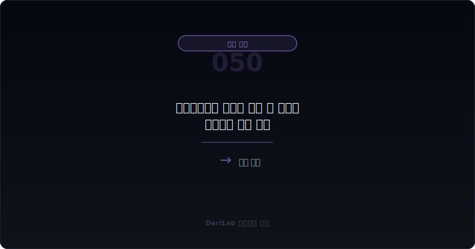
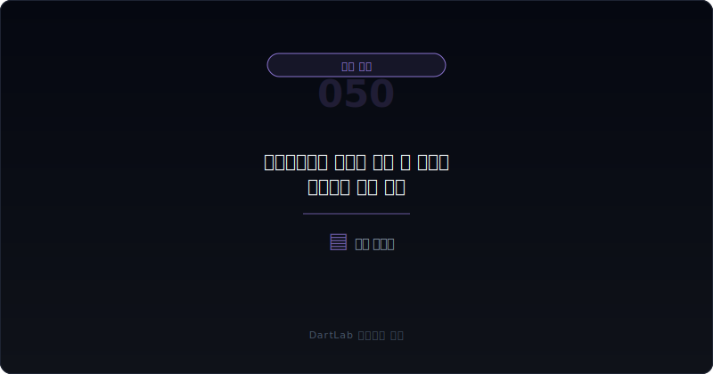
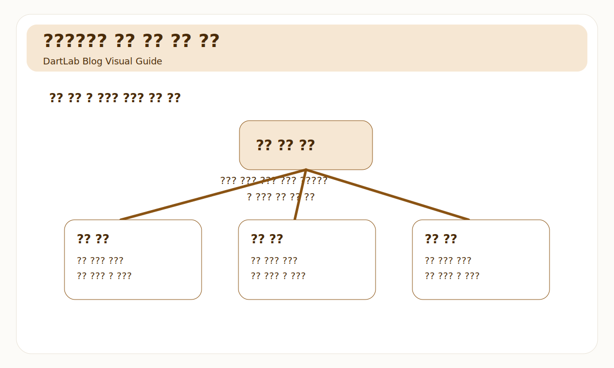
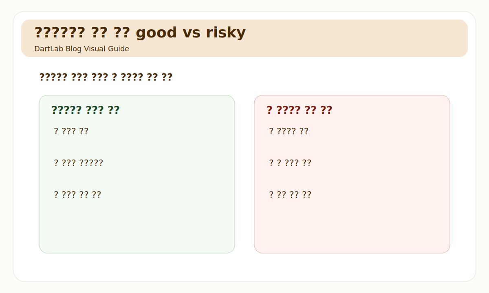
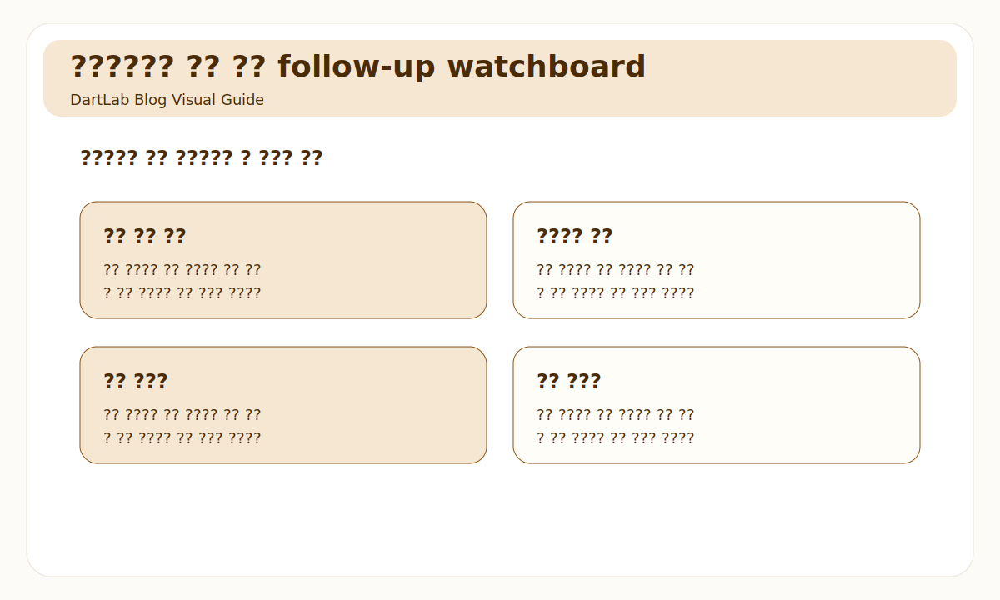

# 영업외손익이 본업을 가릴 때 무엇을 분리해서 봐야 하나

순이익이 좋아 보이는데 뭔가 찜찜할 때가 있다. 매출이 크게 늘지도 않았고 영업이익도 아주 강하지 않은데, 순이익만 유난히 좋아 보이는 경우다. 많은 초보자가 여기서 "세후 기준이 좋아졌나 보다" 정도로 넘긴다. 하지만 실전에서는 가장 먼저 해야 할 일이 있다. `영업외손익을 떼어 내는 것`이다.

영업외손익은 그 자체로 중요하지 않다는 뜻이 아니다. 금융손익, 처분손익, 외환 손익, 지분법손익, 평가손익은 실제로 회사 가치에 영향을 줄 수 있다. 다만 본업 경쟁력과 같은 속도로 움직이지 않을 때가 많다. 그래서 순이익이 좋아도 영업외손익이 큰 비중을 차지하면, 먼저 "무엇이 본업이고 무엇이 비본업인가"를 분리해 보는 편이 맞다.

이 글은 영업외손익을 `순이익 -> 영업이익 -> 영업외 항목 분해 -> 현금 여부 -> 다음 기수 반복성` 순서로 읽는 방법을 정리한다. 기본 숫자 분해는 [숫자만 보면 왜 자주 틀리나](/blog/beyond-the-numbers), 현금 검증은 [영업현금흐름이 순이익을 부정할 때](/blog/operating-cash-flow-vs-net-income), 투자손익 분리는 [관계기업·공동기업투자는 본업 숫자를 어떻게 흐리나](/blog/associates-joint-ventures-and-equity-method), 말과 숫자 충돌은 [사업보고서에서 CEO 말보다 숫자가 중요한 순간](/blog/when-numbers-matter-more-than-ceo-words)과 같이 보면 좋다.

---

## 왜 순이익만 보면 자주 틀리나

순이익은 최종 숫자라서 매력적이다. 기사 제목도 순이익을 크게 쓴다. 문제는 이 숫자 안에 본업 외 항목이 적지 않게 섞여 있다는 점이다. 그래서 순이익이 좋다고 바로 본업이 좋아졌다고 해석하면 오판이 생긴다.

대표적으로 아래 항목이 해석을 흐린다.

- 금융수익·금융비용
- 외환 관련 손익
- 유형자산·투자자산 처분손익
- 지분법손익
- 평가손익과 각종 환입

이 항목들은 한 번에 크게 튈 수 있고, 다음 분기에는 사라질 수도 있다. 즉 순이익을 좋게 보이게 만들 수는 있어도, 반복 가능한 본업 경쟁력과는 다른 이야기일 수 있다. 그래서 실전에서는 `영업이익과 순이익의 간격이 왜 생겼는가`를 먼저 봐야 한다.

---

## 무엇을 먼저 붙여서 봐야 하나

| 먼저 볼 항목 | 왜 중요한가 |
| --- | --- |
| 영업이익 | 본업의 출발점을 본다 |
| 영업외손익 합계 | 순이익을 얼마나 밀었는지 본다 |
| 항목별 분해 | 금융, 처분, 지분법, 평가손익을 나눈다 |
| 영업현금흐름 | 실제 현금 회수가 같은 방향인지 본다 |
| 반복 여부 | 일회성인지 구조적인지 본다 |
| 경영진 설명 | 좋은 설명인지, 좋은 숫자인지 구분한다 |

가장 먼저 해야 할 일은 `영업이익에서 순이익까지의 다리`를 그리는 것이다. 영업외손익이 크면, 순이익이 좋아도 본업이 좋아졌다고 결론 내리기 어렵다. 그래서 영업이익, 영업외손익 합계, 순이익 세 줄을 먼저 놓고, 그다음에 항목별로 분해해야 한다.

이때 특히 유용한 것은 현금 여부다. 처분이익, 평가이익, 외환차익, 지분법손익은 순이익을 좋게 만들 수 있지만 영업현금흐름을 같은 속도로 올려주지 않을 수 있다. 그래서 [영업현금흐름이 순이익을 부정할 때](/blog/operating-cash-flow-vs-net-income)와 같이 보면 숫자 착시를 더 빨리 걷어낼 수 있다.

또 하나 중요한 것은 반복성이다. 영업외손익이 한 번 크게 들어온 것과, 매년 비슷한 패턴으로 반복되는 것은 다르게 읽어야 한다. 일회성은 분리해서 보되 과장할 필요가 없고, 반복되는 경우는 본업과 함께 구조적으로 해석해야 한다.

---

## 어디서부터 해석을 가르면 되나

가장 실용적인 질문은 이것이다. `이 순이익은 본업에서 온 것인가, 본업 밖 항목이 크게 보정한 것인가`.

보통 아래 세 갈래로 나누면 좋다.

1. 영업이익도 좋아지고 영업외손익도 보조적으로 플러스인 구조
2. 영업이익은 평범하지만 영업외손익이 결과 숫자를 많이 바꾸는 혼합 구조
3. 영업이익은 약한데 영업외손익이 순이익을 사실상 떠받치는 구조

첫 번째는 상대적으로 건강할 수 있다. 본업이 버텨 주고 영업외손익이 덤처럼 붙는 경우다. 두 번째는 분리해서 읽어야 한다. 세 번째는 더 조심해야 한다. 특히 경영진 설명이 본업 개선처럼 들리는데 실제로는 처분이익, 평가이익, 지분법손익이 대부분을 만들고 있다면 해석을 크게 보수적으로 잡는 편이 낫다.

이때는 [관계기업·공동기업투자는 본업 숫자를 어떻게 흐리나](/blog/associates-joint-ventures-and-equity-method), [개발비·무형자산은 어디서 과열 신호가 보이나](/blog/development-costs-and-intangibles)와 같이 "본업 밖 숫자가 해석을 흐리는" 다른 구간과 함께 보면 도움이 된다.

---

## 상대적으로 건강한 경우와 더 조심해야 하는 경우는 무엇이 다른가

| 관찰 포인트 | 상대적으로 건강한 경우 | 더 조심해야 하는 경우 |
| --- | --- | --- |
| 영업이익 기반 | 본업이 먼저 버텨 준다 | 본업은 약한데 순이익만 좋다 |
| 영업외손익 비중 | 보조적 역할에 가깝다 | 결과 숫자를 크게 좌우한다 |
| 현금 연결 | 영업현금흐름도 비슷한 방향이다 | 현금은 약한데 순이익만 좋다 |
| 항목 설명 | 무엇이 일회성인지 읽힌다 | 항목은 큰데 설명이 얕다 |
| 반복성 | 일시 요인과 구조 요인이 구분된다 | 매번 다른 항목으로 숫자를 보정한다 |

핵심은 영업외손익을 나쁜 숫자로 보는 것이 아니다. 중요한 것은 `본업과 분리해서 읽을 수 있느냐`다. 건강한 경우는 본업이 먼저 설명되고 영업외손익은 보조적이다. 더 조심해야 하는 경우는 본업이 약한데 영업외 항목이 결과 숫자를 계속 예쁘게 만든다.

특히 자산 처분이익, 금융상품 평가이익, 지분법손익이 한 번에 붙으면 기사 제목은 좋아 보이기 쉽다. 하지만 투자 판단에서는 그 항목이 다음 기수에도 반복되는지, 현금과 어떤 관계인지, 본업 숫자와 얼마나 따로 노는지를 먼저 따져야 한다.

---

## 기사 제목과 실적 발표가 다르게 느껴질 때는 무엇을 믿어야 하나

현장에서는 기사 제목이 순이익이나 흑자전환을 크게 쓰는 경우가 많다. 그런데 정작 실적 자료를 보면 영업외손익이 결과 숫자를 거의 다 바꿔 놓은 경우가 있다. 이런 괴리가 느껴질 때는 감정보다 숫자 다리를 먼저 보는 편이 맞다.

특히 `영업이익 -> 영업외손익 -> 법인세 -> 순이익` 흐름을 직접 적어 보면, 무엇이 headline을 만들었는지 금방 드러난다. 영업이익은 약한데 처분이익이나 평가이익이 크게 붙은 경우, 기사 제목이 틀린 것은 아닐 수 있어도 본업 해석에는 큰 도움이 안 될 수 있다.

그래서 실적 발표를 볼 때는 `좋은 숫자`와 `좋은 사업`을 구분해야 한다. 영업외손익은 좋은 숫자를 만들 수 있지만, 좋은 사업을 자동으로 증명하지는 않는다.

---

## 반복되는 영업외손익 패턴은 어떻게 읽어야 하나

영업외손익은 일회성이 많다고 알려져 있지만, 실제로는 반복되는 패턴도 적지 않다. 외환 손익이 사업 구조상 계속 중요할 수 있고, 지분법손익이 순이익의 큰 부분을 차지할 수도 있으며, 자산 매각이 반복적으로 숫자를 보정할 수도 있다.

이 경우에는 무조건 무시할 것이 아니라, `본업과 별도로 하나의 축으로 추적`하는 편이 좋다. 반복된다면 그건 더 이상 예외가 아니라 구조의 일부이기 때문이다. 다만 구조의 일부라고 해서 본업과 같은 것으로 봐서는 안 된다. 어디까지나 별도 축으로 붙여 읽어야 한다.

결국 영업외손익 해석의 핵심은 한 번 튄 숫자를 과장하지 않는 것과, 반복되는 숫자를 가볍게 넘기지 않는 것 사이 균형이다. 이 균형이 잡히면 순이익 headline에 훨씬 덜 흔들린다.

실전에서는 이 균형이 생각보다 중요하다. 숫자를 무조건 배제하는 것도, 그대로 본업처럼 받아들이는 것도 둘 다 틀리기 쉽기 때문이다.

그래서 영업외손익은 늘 따로 적어 두는 편이 좋다. 한 번 습관이 붙으면 headline보다 구조가 먼저 보인다.

특히 순이익이 크게 튄 분기에는 더 그렇다. 본업 다리를 먼저 그려 보면 불필요한 낙관이 많이 줄어든다.

이 습관 하나만으로도 해석 오류가 크게 줄어든다.

영업외손익은 무시할 숫자도 아니고 그대로 믿을 숫자도 아니다. 그래서 본업과 분리해 적어 두고, 반복성과 현금 연결성을 같이 보는 편이 가장 안전하다.

실전에서 특히 효과가 좋다.

정말.

---

## 자주 놓치는 해석 4가지

### 1. 순이익이 늘면 본업도 좋아졌다고 본다

영업외손익이 큰 경우에는 자주 틀린다.

### 2. 영업외손익은 다 일회성이니 무시하면 된다고 생각한다

반복되는 항목은 구조적일 수 있다.

### 3. 현금과 상관없이 이익이면 충분하다고 본다

평가이익과 지분법손익은 현금과 거리가 있을 수 있다.

### 4. 경영진 설명을 그대로 본업 설명으로 받아들인다

실제 숫자 다리를 먼저 그려 봐야 한다.

---

## 다음 보고서와 후속 숫자에서 무엇을 다시 봐야 하나

| 이번에 본 것 | 다음에 다시 볼 것 |
| --- | --- |
| 영업외손익 비중 | 다음 기수에도 크게 반복되는가 |
| 주요 항목 | 금융, 처분, 지분법, 평가손익이 어떻게 바뀌는가 |
| 영업이익 | 본업 숫자가 실제로 회복되는가 |
| 영업현금흐름 | 순이익과 현금이 다시 가까워지는가 |
| 경영진 설명 | 본업과 비본업을 더 명확히 설명하는가 |
| 후속 이벤트 | 자산 매각, 투자 처분, 조달 구조가 이어지는가 |

영업외손익은 한 번 보고 넘기기보다, `같은 종류의 항목이 반복되는가`를 보는 편이 중요하다. 반복되면 본업과 함께 해석해야 하고, 사라지면 일회성으로 분리해서 보면 된다. 결국 핵심은 지속성과 현금 연결성이다.

가능하면 `영업이익`, `영업외손익`, `순이익`, `영업현금흐름` 네 줄을 매번 같이 적어 두는 편이 좋다. 이 네 줄만 있어도 숫자가 어디서 좋아졌는지 감이 훨씬 빨리 온다.

---

## 10분 체크리스트

- 영업이익과 순이익의 차이를 먼저 봤는가
- 영업외손익을 항목별로 나눠 봤는가
- 현금이 따라오는 항목인지 생각해 봤는가
- 일회성인지 반복성인지 구분했는가
- 경영진 설명과 실제 숫자가 같은 방향인가
- 다음 기수에 같은 항목이 반복되는지 추적할 계획이 있는가

## FAQ

### 영업외손익이 크면 무조건 나쁜가

아니다. 다만 본업과 분리해서 읽어야 해석이 정확해진다.

### 무엇이 가장 먼저 중요한가

영업이익에서 순이익까지 어떤 항목이 숫자를 바꿨는지 보는 것이다.

### 무엇을 같이 보면 좋은가

영업현금흐름, 지분법손익, 자산 처분, 경영진 설명을 같이 보면 좋다.

### 가장 먼저 적어볼 한 줄은 무엇인가

이번 순이익은 본업이 만든 것인지, 본업 밖 항목이 보정한 것인지다.

## 같이 읽으면 좋은 글

- [숫자만 보면 왜 자주 틀리나](/blog/beyond-the-numbers)
- [영업현금흐름이 순이익을 부정할 때](/blog/operating-cash-flow-vs-net-income)
- [관계기업·공동기업투자는 본업 숫자를 어떻게 흐리나](/blog/associates-joint-ventures-and-equity-method)
- [개발비·무형자산은 어디서 과열 신호가 보이나](/blog/development-costs-and-intangibles)
- [사업보고서에서 CEO 말보다 숫자가 중요한 순간](/blog/when-numbers-matter-more-than-ceo-words)
- [공시에서 신규사업 계획은 어디까지 믿어야 하나](/blog/how-far-to-trust-new-business-plans)

## 참고한 공식 자료

- [IAS 1 Presentation of Financial Statements](https://www.ifrs.org/content/dam/ifrs/publications/pdf-standards/english/2021/issued/part-a/ias-1-presentation-of-financial-statements.pdf?bypass=on)
- [DART 소개 - 보고서정보](https://dart.fss.or.kr/introduction/content2.do)
- [OpenDART 단일회사 주요계정 조회](https://opendart.fss.or.kr/disclosureinfo/fnltt/singlacnt/main.do)
- [OpenDART 단일회사 주요 재무지표 조회](https://opendart.fss.or.kr/disclosureinfo/fnltt/singlindx/main.do)
- [OpenDART XBRL 재무제표 원문 내려받기](https://opendart.fss.or.kr/disclosureinfo/fnltt/xbrl/main.do)

## 정리

영업외손익은 순이익을 크게 바꿀 수 있지만, 본업 경쟁력과 같은 이야기를 하지 않을 때가 많다. 그래서 영업이익, 영업외손익, 순이익, 영업현금흐름을 같이 놓고 항목별로 분해해 봐야 의미가 드러난다.

결국 이 영역의 핵심은 `순이익이 좋나`가 아니라 `무엇이 그 순이익을 만들었나`다. 이 질문을 먼저 잡으면 본업 착시에 덜 흔들린다.
