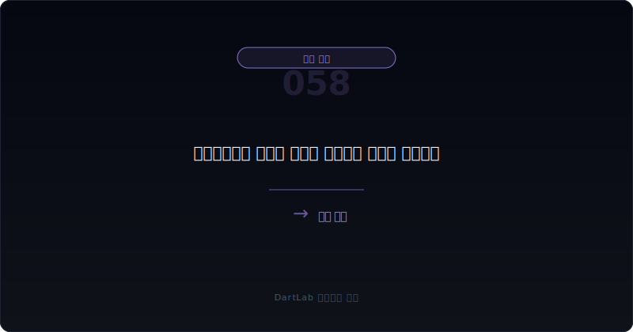
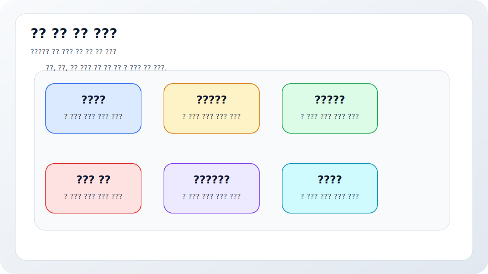
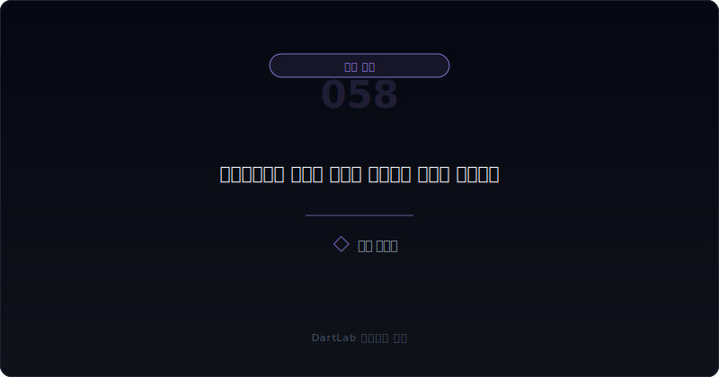
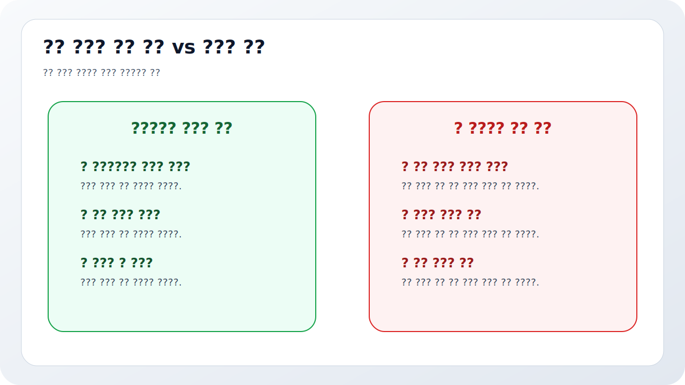
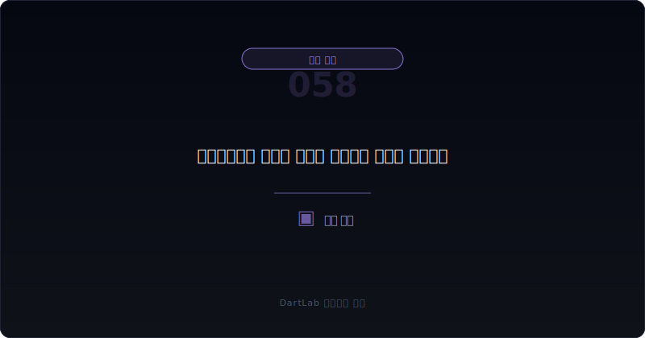

# 이연법인세와 법인세 비용은 순이익을 어떻게 왜곡하나

순이익을 볼 때 많은 사람이 세전이익보다 마지막 숫자에 더 끌린다. 그런데 실전에서는 세금이 그 마지막 숫자를 꽤 크게 바꿔 놓을 수 있다. 세전이익은 약한데 순이익이 생각보다 덜 나쁘게 보이거나, 심지어 손실인데도 법인세 효과 때문에 결과가 좋아 보이는 경우가 있다. 이때 핵심은 `세금이 본업을 설명하는지, 아니면 시차와 회계효과를 보여주는지`를 구분하는 것이다.

현재법인세와 이연법인세는 같은 세금처럼 보이지만 의미가 다르다. 현재법인세는 지금 실제로 내야 하거나 돌려받을 세금에 가깝고, 이연법인세는 자산과 부채의 장부금액과 세무상 기준 차이에서 생기는 미래의 세금 효과를 반영한다. 그래서 순이익이 좋아 보여도 그 개선의 상당 부분이 이연법인세 효과라면 본업 경쟁력과는 다른 이야기일 수 있다.

이 글은 이연법인세와 법인세 비용을 `세전이익 확인 -> 현재법인세와 이연법인세 분리 -> 일시적 차이 원인 확인 -> 세액공제·결손금 효과 확인 -> 다음 기수 반복성 확인` 순서로 읽는 방법을 정리한다. 기본 착시 프레임은 [영업외손익이 본업을 가릴 때 무엇을 분리해서 봐야 하나](/blog/non-operating-income-vs-core-earnings), 환율·파생 보정은 [환율 손익과 파생상품은 본업을 어떻게 왜곡하나](/blog/foreign-exchange-gains-and-derivatives), 기대 자산 문제는 [개발비·무형자산은 어디서 과열 신호가 보이나](/blog/development-costs-and-intangibles), 현금 검증은 [영업현금흐름이 순이익을 부정할 때](/blog/operating-cash-flow-vs-net-income)와 같이 보면 좋다.

---

## 왜 순이익만 보면 자주 틀리나

세금은 최종 숫자에 붙기 때문에 headline 효과가 크다. 특히 세전손실이 컸는데 법인세수익이 붙어 손실 폭이 줄거나, 세전이익은 약한데 낮은 세율과 이연세 효과로 순이익이 생각보다 괜찮아 보이면 많은 사람이 "세금 효율이 좋아졌나 보다" 정도로 넘긴다. 하지만 실제로는 일시적 차이와 회계 인식 변화일 수 있다.

즉 법인세 비용은 단순한 비용 항목이 아니라, 때로는 순이익을 보정하는 마지막 레이어가 된다. 그래서 순이익이 이상하게 좋거나 이상하게 덜 나빠 보이면, 영업외손익만 볼 것이 아니라 세금 레이어도 반드시 분리해야 한다. 이 분리가 안 되면 본업이 좋아진 것처럼 착시가 생길 수 있다.

또 하나 중요한 점은 이연법인세 자산의 인식과 회수 가능성이다. 미래에 과세소득이 충분할 것이라는 전제가 붙어야 의미가 생기는 경우가 많기 때문이다. 따라서 세금 효과는 숫자라기보다 `전제`로 읽어야 할 때도 있다.

이럴 때 가장 실용적인 습관은 세율 다리를 직접 적어 보는 것이다. 세전이익에서 시작해 현재법인세, 이연법인세, 세액공제와 조정 항목을 거쳐 최종 순이익으로 내려오는 흐름을 한 줄로 적어 보면, 순이익을 좋게 만든 것이 사업인지 세금인지 금방 드러난다. 회사 설명이 길어도 이 다리가 안 그려지면 세금 효과를 아직 제대로 읽지 못한 경우가 많다.

---

## 구조가 작동하는 순서

| 먼저 볼 항목 | 왜 중요한가 |
| --- | --- |
| 세전이익 | 본업과 비본업을 합친 출발점을 본다 |
| 현재법인세 | 지금 실제 세금 부담이 어느 정도인지 본다 |
| 이연법인세 | 미래 세금 효과가 이번 숫자를 얼마나 바꾸는지 본다 |
| 일시적 차이 원인 | 무엇이 세금 시차를 만들었는지 본다 |
| 결손금·세액공제 | 미래 이익 전제가 붙어 있는지 본다 |
| 다음 기수 반복성 | 일회성인지 구조적인지 본다 |

실전에서는 먼저 세전이익과 법인세 비용을 같은 줄에 놓고, 그다음에 현재법인세와 이연법인세를 분리하는 편이 좋다. 이 두 단계만 거쳐도 순이익이 왜 달라졌는지 감이 훨씬 빨리 온다. 특히 세전이익은 약한데 법인세수익이 크게 붙으면, 본업 해석과 순이익 해석을 분리해서 봐야 한다.

그다음에는 원인을 찾아야 한다. 감가상각과 세무상 차이인지, 개발비와 무형자산 인식 차이인지, 평가손실과 충당금 관련 시차인지, 결손금 이월과 세액공제인지에 따라 해석이 달라진다. 그래서 [감가상각 읽는 법](/blog/depreciation-after-capex), [개발비·무형자산은 어디서 과열 신호가 보이나](/blog/development-costs-and-intangibles), [매출채권과 대손충당금 읽는 법](/blog/receivables-and-allowance) 같은 글과 연결해 원인을 추적하면 좋다.

여기에 현금도 붙여 봐야 한다. 순이익이 좋아졌는데 실제 납부세액과 영업현금흐름이 전혀 따라오지 않으면, 세금 레이어가 headline을 과하게 보정하고 있을 수 있다. 반대로 현재세 부담은 있지만 본업 현금이 버텨 준다면 세금 효과를 지나치게 나쁘게 해석할 필요는 없다. 결국 세금은 손익계산서 안의 숫자이지만, 해석은 현금흐름까지 이어서 해야 균형이 잡힌다.

---

## 어디에서 왜곡이 생기나

가장 실용적인 질문은 이것이다. `이번 순이익 변화는 본업 개선인가, 세금 시차 효과인가, 미래 전제를 당겨온 회계효과인가`.

본업 개선이라면 세전이익과 영업현금흐름이 어느 정도 같이 움직일 가능성이 크다. 세금 시차 효과라면 세전이익은 크게 안 바뀌었는데 법인세 비용만 크게 흔들릴 수 있다. 미래 전제 반영이라면 이연법인세 자산 인식이나 세액공제 활용 전제가 순이익에 상당한 영향을 줄 수 있다.

이 구분이 중요한 이유는 headline이 같은 흑자라도 질이 다르기 때문이다. 본업이 만든 순이익과 세금 효과가 보정한 순이익은 지속 가능성이 다를 수 있다. 그래서 세금 레이어는 본업을 설명하는 숫자가 아니라 `순이익 해석을 조정하는 숫자`로 보는 편이 맞다.

---

## 왜곡을 걸러내는 숫자 조합

| 관찰 포인트 | 상대적으로 건강한 경우 | 더 조심해야 하는 경우 |
| --- | --- | --- |
| 세전이익과 순이익 | 큰 방향이 비슷하다 | 법인세 효과가 결과를 크게 바꾼다 |
| 현재세 vs 이연세 | 차이가 있어도 이유가 읽힌다 | 이연세 효과가 큰데 설명이 약하다 |
| 원인 | 일시적 차이와 세액공제가 비교적 분명하다 | 숫자는 큰데 어디서 생겼는지 흐리다 |
| 반복성 | 다음 기수에도 어느 정도 예측 가능하다 | 특정 분기만 순이익이 예쁘다 |
| 현금 연결 | 세전이익과 현금 해석이 크게 어긋나지 않는다 | 순이익은 버티는데 현금과 본업은 약하다 |

상대적으로 건강한 경우는 세금 효과가 있어도 본업과 크게 따로 놀지 않는다. 세전이익이 개선되고, 세금 효과는 그 결과를 일부 보정하는 정도다. 반대로 더 조심해야 하는 경우는 세전이익은 약한데 법인세수익이나 낮은 세율 효과로 순이익이 예상보다 좋아 보인다. 이런 경우 headline보다 세전 숫자를 먼저 봐야 한다.

특히 [관계기업·공동기업투자는 본업 숫자를 어떻게 흐리나](/blog/associates-joint-ventures-and-equity-method)나 [영업외손익이 본업을 가릴 때 무엇을 분리해서 봐야 하나](/blog/non-operating-income-vs-core-earnings) 같은 비본업 숫자와 법인세 효과가 동시에 붙으면 해석은 더 어려워진다. 이럴수록 `세전이익 -> 법인세 -> 순이익` 다리를 직접 적어 두는 편이 좋다.

---

## 세금 효과가 왜 손실 회사를 덜 나빠 보이게 만들 수 있나

손실 회사에서 특히 자주 보이는 장면이 있다. 세전손실은 큰데 법인세수익이 붙어 최종 손실이 줄어드는 경우다. 이때 많은 사람이 "그래도 순손실은 생각보다 적네"라고 받아들이기 쉽다. 하지만 본업이 좋아졌다는 뜻은 아닐 수 있다. 미래에 쓸 수 있는 결손금이나 일시적 차이 효과가 회계상 먼저 반영된 것일 수 있기 때문이다.

그래서 적자 기업일수록 법인세수익을 더 천천히 읽는 편이 맞다. 그 수익이 진짜 현금 회복의 신호인지, 아니면 미래 과세소득 전제를 현재 순이익에 당겨온 것인지 봐야 한다. 이 구분이 안 되면 적자의 질을 과소평가하기 쉽다.

특히 구조조정, 대규모 손상, 개발비 상각, 충당금 인식이 겹친 뒤 법인세수익이 크게 붙는 회사는 더 조심해서 봐야 한다. 손실 자체도 큰데 세금 레이어가 마지막 숫자를 부드럽게 만들어 주면, 투자자는 실제 상처보다 덜 심각하게 느낄 수 있기 때문이다. 그래서 적자 회사에서는 `세전손실의 원인`과 `법인세수익의 원인`을 반드시 따로 적어 두는 편이 좋다.

이 한 줄 정리만 해도 체감이 크게 달라진다. 세금이 손실을 덜 나빠 보이게 만든 것인지, 아니면 본업 회복이 실제로 시작된 것인지가 분리되기 때문이다. 세금 레이어는 늘 마지막에 붙지만, 해석에서는 가장 늦게 보면 안 된다.

---

## 왜곡이 안 보일 때 의심할 것

### 1. 순이익이 괜찮으면 본업도 괜찮다고 본다

법인세 효과가 마지막 숫자를 크게 바꿀 수 있다.

### 2. 현재세와 이연세를 구분하지 않는다

둘은 의미와 지속 가능성이 다르다.

### 3. 세금 효과를 다 일회성이라며 무시한다

일시적 차이도 반복적으로 나타날 수 있다.

### 4. 세금 효과를 현금처럼 받아들인다

이연법인세는 미래 전제를 반영하는 회계효과일 수 있다.

---

## 놓치기 쉬운 예외

| 이번에 본 것 | 다음에 다시 볼 것 |
| --- | --- |
| 세전이익과 순이익 차이 | 다시 같은 패턴이 반복되는가 |
| 현재법인세와 이연법인세 | 어느 쪽이 더 크게 움직이는가 |
| 결손금·세액공제 | 실제로 활용이 진행되는가 |
| 일시적 차이 원인 | 자산화, 충당금, 감가상각 차이가 유지되는가 |
| 영업현금흐름 | 본업 현금이 순이익과 가까워지는가 |
| 경영진 설명 | 세금 효과를 과장 없이 설명하는가 |

법인세 효과는 한 분기만 보고 결론 내리기보다 다음 분기 반복성을 보는 편이 훨씬 정확하다. 이번에 큰 법인세수익이 붙었다면, 다음 분기에도 같은 효과가 가능한지, 아니면 한 번성 조정이었는지 확인해야 한다. 그래서 가능하면 `세전이익`, `현재법인세`, `이연법인세`, `순이익`, `영업현금흐름` 다섯 줄을 함께 적어 두는 편이 좋다.

이 다섯 줄만 있어도 순이익이 본업에서 왔는지, 세금 레이어가 크게 보정했는지 금방 드러난다.

---

## 빠른 점검 체크리스트

- 세전이익과 순이익 차이를 먼저 봤는가
- 현재법인세와 이연법인세를 분리했는가
- 일시적 차이 원인이 무엇인지 확인했는가
- 결손금과 세액공제 전제가 붙어 있는지 봤는가
- 영업현금흐름과 같이 비교했는가
- 다음 분기에도 같은 세금 효과가 반복되는지 추적할 계획이 있는가

## 자주 묻는 질문

### 이연법인세가 크면 무조건 나쁜가

항상 그렇지는 않다. 다만 본업과 분리해서 읽어야 해석이 정확해진다.

### 무엇이 가장 먼저 중요한가

세전이익과 법인세 비용을 분리해 보는 것이다.

### 무엇을 같이 보면 좋은가

영업외손익, 환율·파생 손익, 개발비, 감가상각, 현금흐름을 같이 보면 좋다.

### 가장 먼저 적어볼 한 줄은 무엇인가

이번 순이익은 사업이 만든 것인가, 세금 레이어가 보정한 것인가다.

## 구조를 더 깊이 이해하는 글

- [영업외손익이 본업을 가릴 때 무엇을 분리해서 봐야 하나](/blog/non-operating-income-vs-core-earnings)
- [환율 손익과 파생상품은 본업을 어떻게 왜곡하나](/blog/foreign-exchange-gains-and-derivatives)
- [개발비·무형자산은 어디서 과열 신호가 보이나](/blog/development-costs-and-intangibles)
- [매출채권과 대손충당금 읽는 법](/blog/receivables-and-allowance)
- [영업현금흐름이 순이익을 부정할 때](/blog/operating-cash-flow-vs-net-income)
- [숫자만 보면 왜 자주 틀리나](/blog/beyond-the-numbers)

## 참고 자료

- [IAS 12 Income Taxes](https://www.ifrs.org/issued-standards/list-of-standards/ias-12-income-taxes/)
- [IAS 1 Presentation of Financial Statements](https://www.ifrs.org/issued-standards/list-of-standards/ias-1-presentation-of-financial-statements.html/)
- [DART 소개 - 보고서정보](https://dart.fss.or.kr/introduction/content2.do)
- [OpenDART 주석 일괄다운로드](https://opendart.fss.or.kr/disclosureinfo/fnltt/xbrlnote/main.do)
- [OpenDART 단일회사 주요계정 조회](https://opendart.fss.or.kr/disclosureinfo/fnltt/singlacnt/main.do)

## 핵심 구조 요약

이연법인세와 법인세 비용은 순이익을 크게 바꿀 수 있지만, 본업 경쟁력과 같은 이야기를 하지 않을 때가 많다. 그래서 세전이익, 현재법인세, 이연법인세, 순이익을 분리해 놓고 원인과 반복성을 같이 봐야 의미가 드러난다.

핵심은 `순이익이 좋다`보다 `무엇이 그 순이익을 만들었나`를 다시 한 번 세금 레이어까지 내려가 확인하는 것이다. 이 질문을 붙이면 세금 효과 headline에 훨씬 덜 흔들린다.
