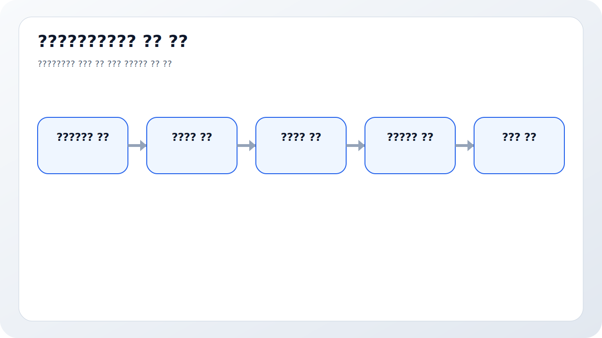
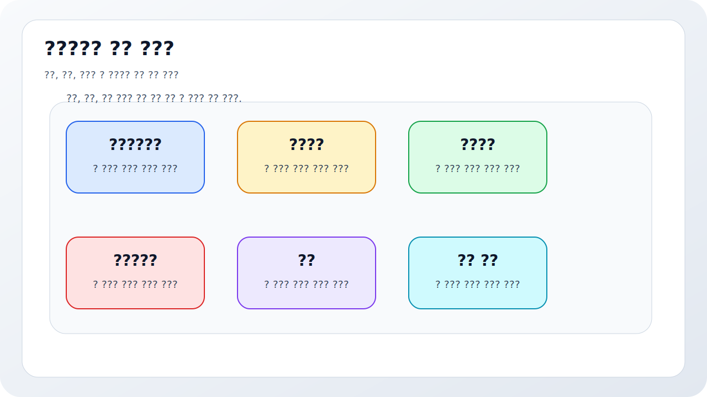
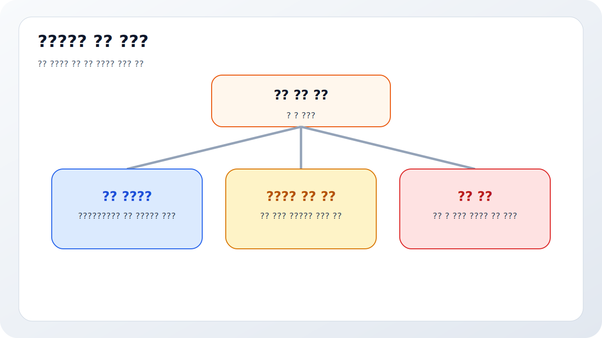
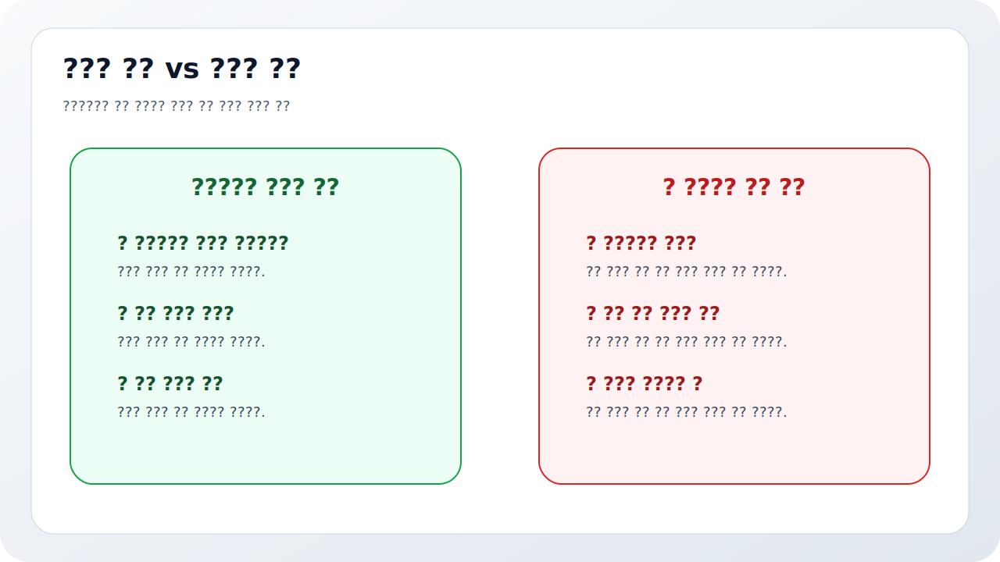
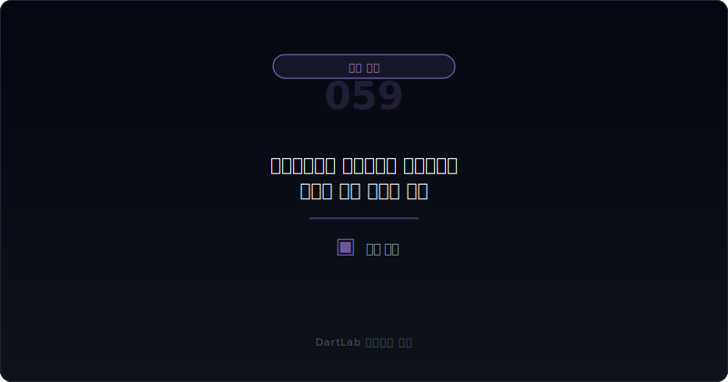

# 공급망금융과 매입채무는 현금흐름을 어떻게 좋게 보이게 하나

영업현금흐름이 좋아지면 많은 사람이 먼저 안심한다. 그런데 그 개선이 `판매 대금 회수`에서 온 것인지, 아니면 `매입 대금 지급을 더 늦추거나 공급망금융 구조를 활용한 결과`인지에 따라 해석은 꽤 달라진다. 특히 공급망금융은 표면상으로는 운전자본 효율화처럼 보일 수 있지만, 실제로는 매입채무를 금융구조로 늘려 현금흐름 headline을 좋게 보이게 만드는 장치일 수도 있다.

이 구조가 항상 나쁜 것은 아니다. 대형 구매기업이 공급업체의 자금 부담을 덜어 주고, 자사도 결제 일정을 안정화하는 정상 운영일 수 있다. 문제는 투자자가 이를 `본업 개선`으로 과대 해석하기 쉽다는 점이다. 공급망금융이 깊어질수록 영업현금흐름과 매입채무는 좋아 보이는데, 실제 현금 창출력이나 거래 조건은 오히려 더 금융기관 의존적으로 바뀔 수 있다.

이 글은 공급망금융과 매입채무 구조를 `영업현금흐름 변화 확인 -> 매입채무 증가 확인 -> 금융기관 개입 여부 확인 -> 거래조건 변화와 비용 부담 확인 -> 다음 분기 되돌림 여부 확인` 순서로 읽는 방법을 정리한다. 기본 토대는 [영업현금흐름이 순이익을 부정할 때](/blog/operating-cash-flow-vs-net-income), 운전자본 프레임은 [선수금·계약부채는 좋은 신호인가 위험 신호인가](/blog/advance-payments-and-contract-liabilities), 반대편 구조는 [매출채권 팩토링과 유동화는 현금흐름을 어떻게 좋게 보이게 하나](/blog/receivables-factoring-and-securitization)와 같이 보면 더 선명하다.

---

## 왜 영업현금흐름 개선으로 오해하기 쉬운가

영업현금흐름은 보통 `좋은 숫자`로 읽힌다. 그래서 영업현금흐름이 개선된 분기를 보면 본업 체력이 좋아졌다고 받아들이기 쉽다. 하지만 공급망금융이 들어가면 해석이 달라질 수 있다. 매입 대금 지급 시점을 뒤로 미루거나 금융기관을 끼워 거래를 재배치하면, 현금은 회사 안에 더 오래 남고 영업현금흐름은 좋아 보일 수 있기 때문이다.

이때 핵심은 `현금이 늘었다`가 아니라 `왜 덜 나갔는가`다. 매입채무가 자연스럽게 늘어난 것인지, 공급업체와 금융기관 구조 변화로 지급 시기가 밀린 것인지, 혹은 본업이 약해져 지급을 늦추고 있는 것인지 구분해야 한다. 이 구분이 안 되면 영업현금흐름 개선을 생산성 향상이나 협상력 강화로 잘못 읽기 쉽다.

또 하나 중요한 것은 비용과 조건이다. 공급망금융은 조달비용과 거래조건을 다시 배분하는 구조일 수 있다. 따라서 현금흐름이 좋아 보이더라도 대가가 공급업체 가격 인상, 금융비용 증가, 조건 악화로 돌아올 수 있다. 그래서 [판관비가 매출보다 빨리 불어날 때 무엇을 먼저 봐야 하나](/blog/sga-growth-vs-sales), [영업외손익이 본업을 가릴 때 무엇을 분리해서 봐야 하나](/blog/non-operating-income-vs-core-earnings)와 같이 비용과 최종 숫자 레이어도 함께 봐야 해석이 균형을 잡는다.

실전에서는 표현도 중요하다. 회사가 이를 `결제조건 개선`, `협력사 지원`, `매입채무 관리`처럼 부드럽게 적어도, 투자자가 확인해야 할 질문은 같다. 진짜 협상력이 좋아진 것인지, 금융기관이 시간을 대신 제공하고 있는 것인지, 그리고 그 대가가 나중에 비용과 의존도로 돌아오는지다. 그래서 이 구조는 좋은 문장보다 `다음 분기에도 그대로 유지되는가`로 판별하는 편이 더 정확하다.

결국 공급망금융은 현금흐름을 설명하는 문장이 아니라 현금흐름의 질을 다시 묻게 만드는 문장이다.

---

## 구조가 작동하는 순서

| 먼저 볼 항목 | 왜 중요한가 |
| --- | --- |
| 영업현금흐름 변화 | 현금이 언제 얼마나 좋아졌는지 본다 |
| 매입채무 잔액과 회전 | 지급 지연이 실제로 커졌는지 본다 |
| 공급망금융 설명 | 금융기관 개입 구조가 있는지 본다 |
| 결제 조건 변화 | 지급 기일이 길어졌는지 본다 |
| 비용 전가 여부 | 가격, 수수료, 조달비용이 바뀌었는지 본다 |
| 다음 분기 반전 여부 | 일시적 보정인지 구조 변화인지 본다 |

실전에서는 먼저 영업현금흐름과 매입채무 변화를 같은 줄에 놓는 편이 좋다. 영업현금흐름이 좋아졌는데 매입채무가 동시에 비정상적으로 늘어나면, 그 개선의 상당 부분이 지급 지연에서 왔을 수 있다. 그다음에는 주석과 사업보고서 설명에서 금융기관이 거래에 개입하는지, 공급망금융 arrangement가 있는지, 결제조건이 달라졌는지를 찾는다.

이때 포인트는 `좋은 협상력`과 `늦어진 지급`을 구분하는 것이다. 협상력이 좋아져 정상적으로 결제조건이 유리해진 것이라면 본업 경쟁력과 연결될 수 있다. 반대로 금융구조에 더 기대거나 공급업체 부담을 외부 금융으로 넘기고 있다면, headline은 좋아도 본업 체력과는 다른 이야기일 수 있다. 그래서 [매출채권과 대손충당금 읽는 법](/blog/receivables-and-allowance), [재고자산과 평가손실 읽는 법](/blog/inventory-and-write-downs)과 함께 운전자본 전체를 한 번에 붙여 보는 습관이 유용하다.

---

## 어디에서 왜곡이 생기나

가장 실용적인 질문은 이것이다. `이번 현금 개선은 본업 협상력 강화인가, 금융기관을 통한 지급 지연 구조인가, 분기 말 숫자 보정인가`.

정상적 운전자본 관리라면 매출과 매입, 재고, 현금흐름이 함께 자연스럽게 움직일 가능성이 크다. 금융기관 개입 확대라면 공급망금융, reverse factoring, 결제지원 구조 같은 설명이 따라붙고 매입채무나 관련 금융부채의 성격을 더 자세히 봐야 한다. 숫자 보정이라면 분기 말 영업현금흐름만 좋아지고 이후 다시 되돌리는 패턴이 나타나기 쉽다.

이 구분이 중요한 이유는 영업현금흐름의 질 때문이다. 고객이 더 빨리 돈을 내고 재고가 더 잘 돌고 구매조건이 개선된 현금흐름과, 지급시점만 밀어 얻은 현금흐름은 지속 가능성이 다를 수 있다. 그래서 영업현금흐름을 볼 때는 `얼마`보다 `얼마나 오래 유지될 구조인가`를 같이 묻는 편이 맞다.

---

## 왜곡을 걸러내는 숫자 조합

| 관찰 포인트 | 상대적으로 건강한 경우 | 더 조심해야 하는 경우 |
| --- | --- | --- |
| 매입채무 증가 | 매출·재고 흐름과 함께 자연스럽다 | 현금만 좋아지고 매입채무만 급증한다 |
| 구조 설명 | 공급망금융 역할과 범위가 읽힌다 | 금융기관 개입과 실질 부담이 흐리다 |
| 비용 | 조건 변화와 비용이 감당 가능해 보인다 | 보이지 않는 조달비용이 커질 수 있다 |
| 반복성 | 특정 상황 대응으로 제한적이다 | 매 분기 비슷한 방식으로 반복된다 |
| 후속 숫자 | 다음 분기에도 본업 현금이 버틴다 | 다음 분기 되돌림과 압박이 나타난다 |

상대적으로 건강한 경우는 회사가 이 구조를 숨기지 않는다. 왜 쓰는지, 어느 범위인지, 공급업체와 회사에 어떤 영향이 있는지, 비용이 무엇인지 설명이 비교적 읽힌다. 반대로 더 조심해야 하는 경우는 `운전자본 효율화`처럼 부드러운 표현만 있고, 실제로는 매입채무가 급증하며 영업현금흐름 headline만 예뻐지는 흐름이다.

특히 [리스부채와 차입 만기 구조는 어디서 먼저 터지나](/blog/lease-liabilities-and-debt-maturity), [차입 약정 위반과 기한이익상실 위험은 어디서 먼저 드러나나](/blog/debt-covenant-breach-and-acceleration-risk)와 같이 보면 도움이 된다. 공급망금융은 부채 총액이 아니라 시간표를 바꾸는 구조일 수 있고, 이런 변화는 다른 유동성 압박과 같이 움직일 때 의미가 더 커지기 때문이다.

---

## 매입채무가 늘었는데 왜 본업 개선이 아닐 수 있나

매입채무 증가는 흔히 협상력 신호로 읽힌다. 물론 그럴 수도 있다. 하지만 공급망금융 구조가 깊어지면 매입채무 증가는 `회사가 더 강해졌다`가 아니라 `지급 구조가 금융화됐다`는 뜻일 수도 있다. 공급업체는 빨리 돈을 받고, 회사는 늦게 돈을 내는 사이에 금융기관이 들어오면 표면상 회사의 현금은 좋아 보일 수 있다.

이때 투자자가 확인해야 할 것은 두 가지다. 첫째, 그 구조가 본업 운영을 더 효율적으로 만들었는가. 둘째, 그 구조가 없어졌을 때 현금흐름은 얼마나 되돌아갈 수 있는가. 이 두 질문에 답이 약하면, 매입채무 증가는 본업 개선보다 `미뤄진 현금유출`에 가까울 수 있다.

즉 공급망금융을 볼 때는 `매입채무가 늘었다`보다 `누가 시간을 제공했고 그 대가가 무엇인가`를 먼저 물어야 한다. 이 질문이 붙으면 영업현금흐름 개선에 훨씬 덜 속게 된다.

---

## 왜곡이 안 보일 때 의심할 것

### 1. 영업현금흐름이 좋아졌으니 본업도 좋아졌다고 본다

지급 지연 구조가 headline을 좋게 만들 수 있다.

### 2. 매입채무 증가는 다 협상력 개선이라고 본다

금융기관 개입과 조건 변화가 원인일 수 있다.

### 3. 공급업체가 빨리 돈을 받으니 모두에게 좋은 구조라고 본다

회사의 비용과 장기 의존도는 별개로 봐야 한다.

### 4. 분기 한 번만 보면 충분하다고 본다

다음 분기 되돌림 여부를 같이 봐야 의미가 드러난다.

---

## 놓치기 쉬운 예외

| 이번에 본 것 | 다음에 다시 볼 것 |
| --- | --- |
| 영업현금흐름 개선 | 다음 분기에도 유지되는가 |
| 매입채무 급증 | 재고·매출과 함께 자연스럽게 움직이는가 |
| 공급망금융 설명 | 범위와 조건이 더 커지는가 |
| 비용과 조건 | 가격·수수료 부담이 늘어나는가 |
| 다른 유동성 신호 | 차입, 약정, 지급보증과 같이 악화되는가 |
| 경영진 설명 | 본업 개선과 금융기법을 구분해 설명하는가 |

공급망금융은 한 번 읽고 끝내면 거의 항상 얕게 읽힌다. 다음 분기에도 같은 구조가 반복되는지, 매입채무가 계속 누적되는지, 본업 현금이 스스로 버티는지 봐야 의미가 잡힌다. 그래서 가능하면 `영업현금흐름`, `매입채무`, `공급망금융 설명`, `비용`, `다음 분기 되돌림` 다섯 줄을 적어 두는 편이 좋다.

이 다섯 줄만 있어도 현금이 본업 경쟁력에서 나온 것인지, 결제 구조의 금융화에서 나온 것인지 구분이 훨씬 쉬워진다.

---

## 빠른 점검 체크리스트

- 영업현금흐름 개선과 매입채무 변화를 같이 봤는가
- 공급망금융 또는 금융기관 개입 설명이 있는지 확인했는가
- 결제 조건이 실제로 길어졌는지 적어봤는가
- 비용과 조건 변화가 있는지 봤는가
- 이번 현금 개선이 다음 분기에도 유지될지 생각해 봤는가
- 다른 유동성 압박과 함께 움직이는지 추적할 계획이 있는가

## 자주 묻는 질문

### 공급망금융은 무조건 나쁜가

아니다. 다만 본업 개선과 현금유출 지연을 구분해서 읽어야 한다.

### 무엇이 가장 먼저 중요한가

영업현금흐름 개선이 왜 일어났는지, 매입채무와 같이 보는 것이다.

### 무엇을 같이 보면 좋은가

영업현금흐름, 매입채무, 재고, 차입 구조, 다음 분기 되돌림을 같이 보면 좋다.

### 가장 먼저 적어볼 한 줄은 무엇인가

이번 현금 개선은 본업 협상력의 결과인가, 지급 시점 금융화의 결과인가다.

## 구조를 더 깊이 이해하는 글

- [영업현금흐름이 순이익을 부정할 때](/blog/operating-cash-flow-vs-net-income)
- [매출채권 팩토링과 유동화는 현금흐름을 어떻게 좋게 보이게 하나](/blog/receivables-factoring-and-securitization)
- [선수금·계약부채는 좋은 신호인가 위험 신호인가](/blog/advance-payments-and-contract-liabilities)
- [매출채권과 대손충당금 읽는 법](/blog/receivables-and-allowance)
- [재고자산과 평가손실 읽는 법](/blog/inventory-and-write-downs)
- [리스부채와 차입 만기 구조는 어디서 먼저 터지나](/blog/lease-liabilities-and-debt-maturity)

## 참고 자료

- [IAS 7 Statement of Cash Flows](https://www.ifrs.org/issued-standards/list-of-standards/ias-7-statement-of-cash-flows/)
- [IFRS 7 Financial Instruments: Disclosures](https://www.ifrs.org/issued-standards/list-of-standards/ifrs-7-financial-instruments-disclosures/)
- [DART 소개 - 보고서정보](https://dart.fss.or.kr/introduction/content2.do)
- [OpenDART 주석 일괄다운로드](https://opendart.fss.or.kr/disclosureinfo/fnltt/xbrlnote/main.do)
- [OpenDART 단일회사 주요계정 조회](https://opendart.fss.or.kr/disclosureinfo/fnltt/singlacnt/main.do)

## 핵심 구조 요약

공급망금융과 매입채무 구조는 영업현금흐름을 좋게 보이게 만들 수 있지만, 그 개선이 본업 경쟁력에서 온 것인지 지급 구조의 금융화에서 온 것인지는 다를 수 있다. 그래서 영업현금흐름, 매입채무, 조건 변화, 금융기관 개입, 다음 분기 되돌림을 같이 봐야 해석이 정확해진다.

핵심은 `현금이 좋아졌다`보다 `왜 덜 나갔는가`를 먼저 묻는 것이다. 이 질문을 붙이면 공급망금융과 매입채무 headline에 훨씬 덜 속게 된다.
