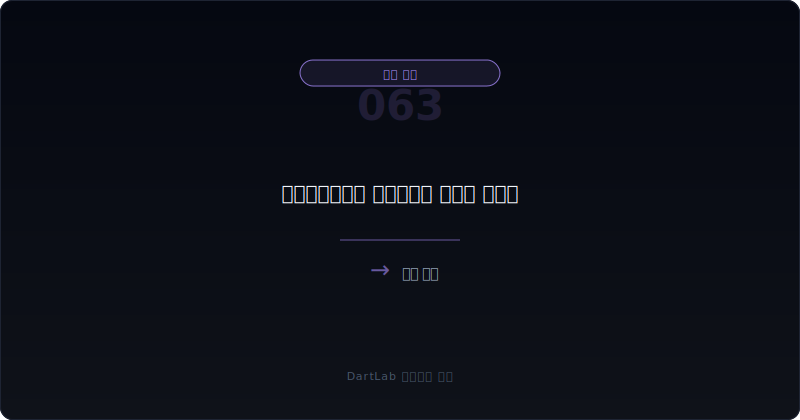
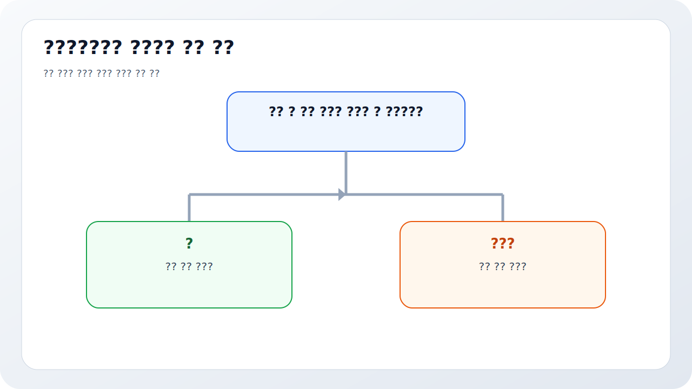
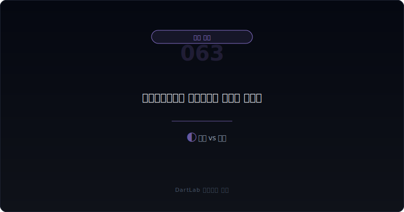

# 매각예정자산과 중단영업은 무엇을 가리나

회사가 `매각예정자산`, `처분예정`, `중단영업` 같은 표현을 쓰면 많은 투자자는 일단 `나쁜 사업을 정리하니 깔끔해지는 것 아닌가`라고 생각한다. 실제로 그런 경우도 있다. 하지만 이 문구는 동시에 본업 부진, 급한 유동성 대응, 일회성 처분이익, 비교 기준 변화까지 한꺼번에 숨길 수 있다. 그래서 headline만 보면 구조 개선처럼 보여도, 숫자를 다시 붙이면 전혀 다른 그림이 나오는 일이 많다.

특히 중단영업은 손익계산서를 더 좋아 보이게 만들 수 있다. 적자 사업이 아래로 분리되면 계속영업 손익은 상대적으로 좋아 보이고, 매각손익이나 세금 효과까지 섞이면 당기순이익도 왜곡될 수 있다. 그래서 이 주제는 `무엇을 팔았는가`보다 `무엇을 남겼는가`와 `비교 기준이 어떻게 바뀌었는가`가 더 중요하다.

이 글은 매각예정자산과 중단영업을 `무엇이 분리됐는지 확인 -> 일회성 손익을 분리 -> 계속영업 숫자를 다시 계산 -> 현금과 부채 영향을 확인 -> 다음 보고서에서 남은 회사가 정말 나아졌는지 추적` 순서로 읽는 방법을 정리한다. 본업과 비본업 분리는 [영업외손익이 본업을 가릴 때 무엇을 분리해서 봐야 하나](/blog/non-operating-income-vs-core-earnings), 세금 층은 [이연법인세와 법인세 비용은 순이익을 어떻게 왜곡하나](/blog/deferred-tax-and-tax-expense-distortion), 자본 누적 항목은 [기타포괄손익 누적은 무엇을 가리나](/blog/accumulated-oci-what-it-hides)와 같이 보면 더 잘 읽힌다.

---

## 왜 구조 개선처럼 보이는데도 조심해야 하나

중단영업은 남은 회사의 실적을 더 좋아 보이게 만든다. 적자 사업을 아래로 떼어 내면 계속영업 손익은 당연히 좋아진다. 그런데 그 개선이 실제 체질 개선 때문인지, 단순히 적자 사업을 분리해서 보이게 만든 것인지는 별개 문제다. 이 차이를 안 보면 투자자는 `남은 사업이 강해졌다`고 쉽게 오해할 수 있다.

매각예정자산 분류도 마찬가지다. 자산을 팔기로 했다는 뜻이지만, 왜 파는지부터 달라질 수 있다. 전략적 정리인지, 급한 현금 확보인지, 차입 압박 대응인지, 회복이 어려운 자산을 정리하는 것인지 먼저 가려야 한다. 같은 매각이라도 의미가 전혀 다르다.

또 하나는 비교 가능성이다. 중단영업이 들어오면 전기 숫자도 재표시될 수 있고, 계속영업 기준으로 다시 보여 줄 수 있다. 이때 headline만 보면 `실적이 좋아졌다`고 느끼지만, 실제로는 비교 기준이 바뀐 결과일 수 있다. 그래서 [관계기업·공동기업투자는 본업 숫자를 어떻게 흐리나](/blog/associates-joint-ventures-and-equity-method), [기타포괄손익 누적은 무엇을 가리나](/blog/accumulated-oci-what-it-hides)처럼 `분류가 숫자를 어떻게 바꾸는지`를 같이 보는 습관이 중요하다.

---

## 무엇을 먼저 붙여서 봐야 하나

| 먼저 볼 항목 | 왜 중요한가 |
| --- | --- |
| 무엇이 분리됐는가 | 자산 하나인지 사업부 전체인지 다르다 |
| 계속영업 vs 중단영업 | 남은 회사 숫자가 실제로 나아졌는지 본다 |
| 처분손익 | 일회성 이익이 headline을 부풀리는지 본다 |
| 현금 유입 | 장부이익과 실제 현금 유입이 같은지 본다 |
| 차입·약정 영향 | 급한 유동성 대응인지 읽을 수 있다 |
| 세금 효과 | 순이익이 세금으로 더 좋아 보이는지 본다 |
| 후속 재분류 | 다음 보고서에서 남은 사업이 흔들리는지 본다 |

실전에서는 먼저 `무엇이 나가는가`를 적는 것이 핵심이다. 공장, 토지, 종속회사, 사업부문, 비핵심 투자자산은 의미가 다르다. 사업부문 전체가 나가면 중단영업 해석이 붙고, 개별 자산 처분이면 운영 구조보다 현금 확보의 의미가 더 클 수 있다. 이 첫 줄을 적지 않으면 뒤 숫자가 다 섞여 보인다.

그다음은 계속영업 숫자를 따로 봐야 한다. 중단영업을 제외한 매출, 영업이익, 영업현금흐름이 실제로 개선되는지 확인해야 한다. 단순히 적자 사업이 빠졌기 때문에 상대적으로 좋아 보이는 것과, 남은 사업의 체력이 실제로 좋아진 것은 다르다. 이 구분은 [영업현금흐름이 순이익을 부정할 때](/blog/operating-cash-flow-vs-net-income), [판관비가 매출보다 빨리 불어날 때 무엇을 먼저 봐야 하나](/blog/sga-growth-vs-sales)와 같이 보면 더 빨리 잡힌다.

처분손익과 세금도 따로 봐야 한다. 자산 처분이익이 커서 순이익이 갑자기 좋아질 수 있고, 세금 효과가 붙어 headline이 더 매끈해질 수 있다. 하지만 그 숫자는 남은 사업의 반복 가능한 이익이 아니다. 그래서 중단영업은 `좋아졌다`가 아니라 `무엇이 빠져서 좋아 보이는가`로 읽는 편이 맞다.

---

## 어디서부터 해석을 가르면 되나

가장 실용적인 질문은 이것이다. `이 분리는 체질 개선인가, 급한 현금 확보인가, 아니면 숫자 보기 좋게 만드는 분류 변화인가`.

체질 개선에 가까운 경우는 남은 사업의 수익성, 현금창출력, 자본 효율이 실제로 좋아진다. 단순히 적자 사업이 빠져서가 아니라, 회사 설명과 후속 숫자가 같이 개선된다. 반대로 급한 현금 확보에 가까운 경우는 차입 압박, 약정 위반, 유동성 부족과 함께 자산 처분이 붙는다. 이때는 매각 자체가 문제 해결이 아니라 버티기일 수 있다.

숫자 정리용 분류 변화에 가까운 경우는 headline은 좋아졌는데, 남은 사업의 매출 성장, 마진, 현금흐름, 판관비 구조가 딱히 개선되지 않는다. 비교 기준만 바뀌고 체질은 그대로인 셈이다. 그래서 이 주제는 항상 [차입 약정 위반과 기한이익상실 위험은 어디서 먼저 드러나나](/blog/debt-covenant-breach-and-acceleration-risk), [계속기업 관련 불확실성 문구는 어디서 강해지나](/blog/going-concern-uncertainty-signals)와 같이 붙여 보는 편이 좋다.

---

## 상대적으로 건강한 경우와 더 조심해야 하는 경우는 무엇이 다른가

| 관찰 포인트 | 상대적으로 건강한 경우 | 더 조심해야 하는 경우 |
| --- | --- | --- |
| 처분 대상 | 비핵심 자산이나 명확한 비주력 사업이다 | 핵심 현금창출 자산까지 판다 |
| 설명 | 왜 파는지와 이후 계획이 구체적이다 | 목적이 추상적이고 반복된다 |
| 계속영업 숫자 | 분리 후에도 매출·현금흐름이 읽힌다 | 적자 분리 후에도 남은 회사가 약하다 |
| 현금 유입 | 실제 현금 유입과 차입 완화가 보인다 | 장부손익은 큰데 현금 개선이 약하다 |
| 반복성 | 일회성 정리로 보인다 | 자산 매각이 계속 이어진다 |
| 후속 공시 | 다음 보고서에서 남은 구조가 안정된다 | 추가 정정, 추가 매각, 조건 변경이 이어진다 |

상대적으로 건강한 경우는 회사가 무엇을 정리하고 무엇에 집중할지 분명하다. 남은 사업의 매출, 마진, 현금흐름, 투자 계획이 논리적으로 이어지고, 자산 처분이 단순한 미봉책이 아니라 구조 정리로 읽힌다.

반대로 더 조심해야 하는 경우는 자산을 팔았는데도 유동성 압박이 계속되고, 같은 해에 차입 재조정, 메자닌 조건 변경, 정정공시까지 같이 붙는다. 이런 경우 자산 매각은 문제 해결이 아니라 시간을 버는 수단일 수 있다. 그래서 [메자닌 보호조항과 리픽싱은 누구에게 유리한가](/blog/mezzanine-protections-and-refixing), [감사 전 재무제표 정정과 재감사는 어디서 위험 신호가 보이나](/blog/restatement-before-audit-and-reaudit-signals)와의 연결이 중요하다.

---

## 왜 일회성 이익과 세금을 꼭 떼어 봐야 하나

매각예정자산과 중단영업이 위험한 이유 중 하나는 `실적이 좋아졌다`는 착시를 만들기 쉽다는 점이다. 처분이익이 붙고, 세금 효과가 붙고, 적자 사업이 아래로 내려가면 headline은 매우 좋아 보일 수 있다. 하지만 투자자가 실제로 사는 것은 이미 팔린 사업이 아니라 앞으로 남을 사업이다.

그래서 이 주제는 당기순이익보다 계속영업 영업이익, 계속영업 영업현금흐름, 계속영업 마진을 다시 보는 편이 맞다. 장부상 처분이익이 아무리 커도 남은 사업의 회수 구조와 현금창출력이 약하면, 구조조정 이후 회사는 여전히 불안할 수 있다. 이 점에서 [매출채권 팩토링과 유동화는 현금흐름을 어떻게 좋게 보이게 하나](/blog/receivables-factoring-and-securitization), [공급망금융과 매입채무는 현금흐름을 어떻게 좋게 보이게 하나](/blog/supply-chain-finance-and-payables) 같은 글과도 연결된다. 현금이 정말 좋아졌는지, 아니면 보기 좋게 정리됐는지가 중요하기 때문이다.

또한 세금 효과는 투자자가 자주 놓치는 층이다. 중단영업과 처분손익은 세전 숫자만 보면 의미를 오해하기 쉽고, 세후 기준으로 headline이 더 좋아 보일 수 있다. 그래서 중단영업을 볼 때는 `처분손익`, `세금`, `계속영업`, `현금` 네 줄을 따로 적는 편이 가장 실용적이다.

---

## 자주 놓치는 해석 4가지

### 1. 중단영업이면 자동으로 좋아졌다고 본다

좋아진 것이 아니라 적자 사업을 분리했을 수도 있다.

### 2. 처분이익을 반복 가능한 이익처럼 본다

일회성 숫자일 가능성이 높다.

### 3. 현금 유입을 확인하지 않는다

장부손익과 실제 현금 유입은 다를 수 있다.

### 4. 남은 회사의 숫자를 다시 계산하지 않는다

투자자는 이미 정리한 사업이 아니라 남은 회사를 사게 된다.

---

## 다음 보고서와 후속 숫자에서 무엇을 다시 봐야 하나

| 이번에 본 것 | 다음에 다시 볼 것 |
| --- | --- |
| 처분 대상 | 실제 매각이 완료됐는가 |
| 계속영업 손익 | 분리 효과를 빼도 개선이 이어지는가 |
| 현금 유입 | 부채 상환과 유동성 개선으로 이어졌는가 |
| 세금 효과 | 일회성 효과가 사라진 뒤에도 숫자가 버티는가 |
| 후속 공시 | 추가 매각, 추가 정정, 추가 조달이 붙는가 |
| 경영진 설명 | 선택과 집중이 실제 투자와 비용 구조로 이어지는가 |

이 주제는 한 번 보고 끝내면 안 된다. 자산을 판 뒤 남은 회사가 실제로 나아졌는지 봐야 하기 때문이다. 다음 보고서에서는 계속영업 기준 매출, 영업이익, 영업현금흐름, 판관비, 차입금, 세금을 다시 확인해야 한다. 만약 추가 자산 매각이나 추가 조달이 계속 붙는다면, 첫 매각은 구조 개선이 아니라 임시 대응이었을 가능성이 크다.

결국 이 글에서 기억할 핵심은 하나다. 매각예정자산과 중단영업은 `무엇을 팔았는가`가 아니라 `남은 회사를 정말 더 낫게 만들었는가`를 묻는 항목이다.

---

## 10분 체크리스트

- 무엇이 분리됐는지 한 줄로 적었는가
- 계속영업 숫자를 따로 봤는가
- 처분손익과 세금 효과를 분리했는가
- 현금 유입이 실제로 있었는지 확인했는가
- 차입 압박 완화로 이어졌는지 봤는가
- 다음 보고서에서 남은 회사의 숫자를 다시 추적할 계획이 있는가

## FAQ

### 중단영업이면 남은 회사는 자동으로 좋아진 것 아닌가

아니다. 적자 사업이 빠져서 좋아 보일 수 있으므로 계속영업 숫자를 다시 봐야 한다.

### 가장 먼저 봐야 할 것은 무엇인가

무엇이 분리됐는지와 계속영업 기준 숫자가 실제로 나아졌는지다.

### 처분이익은 어떻게 봐야 하나

반복 가능한 이익이 아니라 일회성 숫자로 보는 편이 안전하다.

### 무엇을 같이 보면 좋은가

영업외손익, 이연법인세, 영업현금흐름, 계속기업 관련 불확실성 문구를 같이 보면 좋다.

## 같이 읽으면 좋은 글

- [영업외손익이 본업을 가릴 때 무엇을 분리해서 봐야 하나](/blog/non-operating-income-vs-core-earnings)
- [이연법인세와 법인세 비용은 순이익을 어떻게 왜곡하나](/blog/deferred-tax-and-tax-expense-distortion)
- [기타포괄손익 누적은 무엇을 가리나](/blog/accumulated-oci-what-it-hides)
- [영업현금흐름이 순이익을 부정할 때](/blog/operating-cash-flow-vs-net-income)
- [차입 약정 위반과 기한이익상실 위험은 어디서 먼저 드러나나](/blog/debt-covenant-breach-and-acceleration-risk)
- [계속기업 관련 불확실성 문구는 어디서 강해지나](/blog/going-concern-uncertainty-signals)

## 참고한 공식 자료

- [IFRS 5 Non-current Assets Held for Sale and Discontinued Operations](https://www.ifrs.org/issued-standards/list-of-standards/ifrs-5-non-current-assets-held-for-sale-and-discontinued-operations/)
- [IAS 7 Statement of Cash Flows](https://www.ifrs.org/issued-standards/list-of-standards/ias-7-statement-of-cash-flows/)
- [IAS 12 Income Taxes](https://www.ifrs.org/issued-standards/list-of-standards/ias-12-income-taxes/)
- [DART 소개 - 보고서정보](https://dart.fss.or.kr/introduction/content2.do)
- [OpenDART 단일회사 주요계정](https://opendart.fss.or.kr/disclosureinfo/fnltt/singlacnt/main.do)
- [OpenDART XBRL 주석](https://opendart.fss.or.kr/disclosureinfo/fnltt/xbrlnote/main.do)

## 정리

매각예정자산과 중단영업은 구조 개선 신호일 수도 있지만, 동시에 일회성 이익과 비교 기준 변화, 유동성 압박을 가리는 장치일 수도 있다. 그래서 무엇이 분리됐는지, 계속영업 숫자가 실제로 나아졌는지, 처분이익과 세금 효과를 뗀 뒤에도 남은 회사가 버티는지를 같이 봐야 한다.

핵심은 `무엇을 팔았는가`보다 `남은 회사가 정말 더 강해졌는가`를 묻는 것이다. 이 질문을 붙이면 중단영업 숫자를 훨씬 덜 쉽게 믿게 된다.
