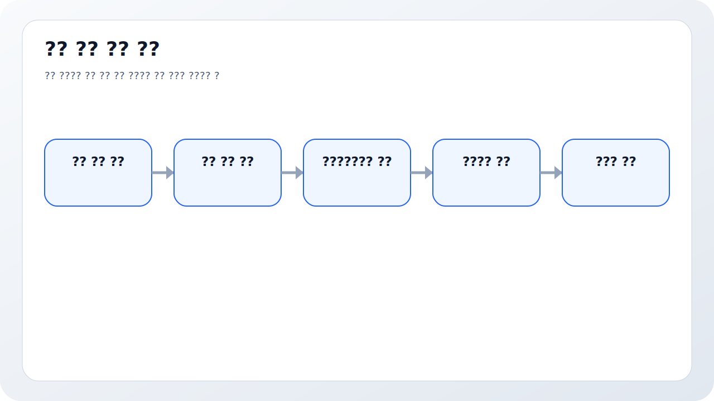
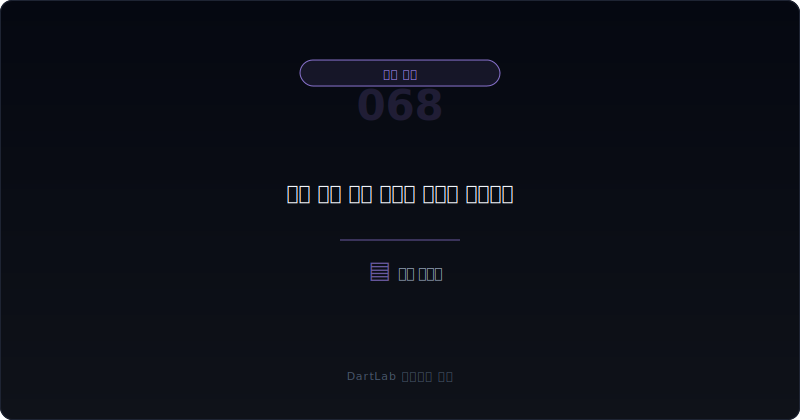
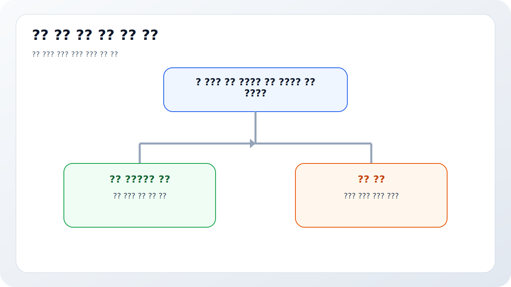
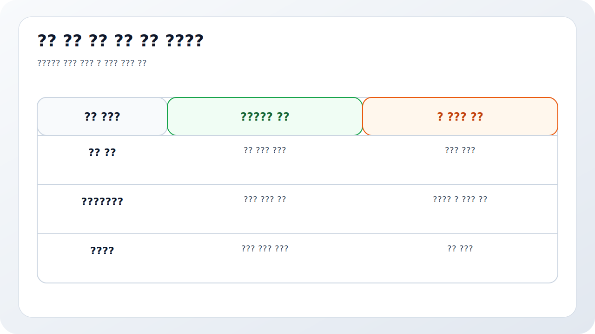
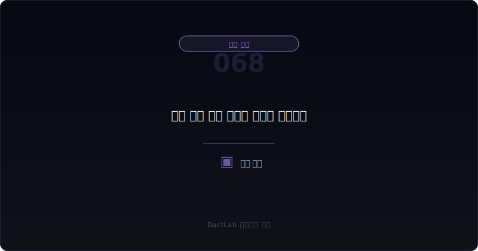

# 매출 인식 시점 변경은 어디가 신호인가

매출이 좋아졌다는 뉴스보다 먼저 봐야 할 것이 있다. 그 매출이 `언제` 잡혔는가다. 같은 계약이라도 어느 시점에 수익을 인식하느냐에 따라 분기 숫자는 크게 달라질 수 있다. 그래서 매출 성장 자체보다 `매출 인식 시점이 바뀌었는지`, `설명이 달라졌는지`, `현금과 매출채권이 따라왔는지`를 먼저 봐야 할 때가 많다.

특히 매출 인식 시점 변경은 headline을 매끈하게 만든다. 납품 시점, 진행률 기준, 고객 검수 시점, 본인·대리인 판단, 계약변경 처리 방식이 달라지면 매출과 이익의 타이밍이 앞당겨질 수 있다. 숫자는 개선돼 보여도 실제 현금과 리스크 이전은 그대로일 수 있다. 그래서 이 주제는 단순 회계정책 메모가 아니라 `성장 착시`를 판별하는 핵심 질문이다.

이 글은 매출 인식 시점 변화를 `수익 인식 설명 확인 -> 무엇이 달라졌는지 비교 -> 매출채권·계약자산·계약부채와 연결 -> 현금흐름과 비교 -> 다음 분기에도 같은 패턴이 이어지는지 추적` 순서로 읽는 방법을 정리한다. 기본 토대는 [선수금·계약부채는 좋은 신호인가 위험 신호인가](/blog/advance-payments-and-contract-liabilities), 현금 검증은 [영업현금흐름이 순이익을 부정할 때](/blog/operating-cash-flow-vs-net-income), 분류 변화는 [매각예정자산과 중단영업은 무엇을 가리나](/blog/held-for-sale-and-discontinued-operations)와 같이 보면 좋다.

---

## 왜 매출 성장보다 먼저 시점을 봐야 하나

매출은 타이밍에 민감하다. 같은 계약을 이번 분기에 잡느냐 다음 분기에 잡느냐에 따라 성장률과 마진 인상이 달라 보인다. 그래서 기업이 매출 인식 시점을 조금만 앞당겨도 headline은 좋아질 수 있다. 문제는 그 차이가 사업 실질 개선인지, 회계 판단 변화인지가 쉽게 섞인다는 점이다.

수익 인식 설명이 바뀌는 경우는 특히 주의해야 한다. 전에는 인도 시점이라고 하던 설명이 검수 완료 시점으로 바뀌거나, 진행률 기준의 가정이 달라지거나, 본인·대리인 판단이 바뀌면 매출 총액과 총이익 구조까지 달라질 수 있다. 투자자는 `설명이 더 정교해졌다`고 볼 수도 있지만, 동시에 `숫자를 움직인 정책 변화인가`를 물어야 한다.

또한 매출 인식 시점은 현금과 직접 연결되지 않을 수 있다. 그래서 매출이 빨리 잡힐수록 매출채권, 계약자산, 미청구공사, 계약부채, 반품충당부채 같은 항목이 같이 움직이는지 확인해야 한다. 이 연결이 없으면 숫자는 좋아졌는데 회수는 아직 안 된 상태일 수 있다.

---

## 어떤 숫자 조합이 먼저 경고하나

| 먼저 볼 항목 | 왜 중요한가 |
| --- | --- |
| 수익 인식 정책 설명 | 언제 매출을 잡는지 기준점이 된다 |
| 변경된 문구 | 무엇이 실제로 달라졌는지 보인다 |
| 매출채권·계약자산 | 매출 선인식 가능성을 가늠할 수 있다 |
| 계약부채 | 현금 선수와 매출 인식의 균형을 본다 |
| 영업현금흐름 | 숫자가 현금으로 이어졌는지 확인한다 |
| 총이익률 변화 | 회계정책과 본업 개선을 구분하는 데 도움된다 |
| 다음 분기 패턴 | 일회성인지 반복성인지 판단할 수 있다 |

실전에서는 먼저 주석의 수익 인식 설명을 전기와 비교하는 것이 핵심이다. 많은 투자자가 숫자 테이블만 보지만, 정책 문구가 더 빨리 변화를 드러내는 경우가 많다. `한 시점에 인식`, `기간에 걸쳐 인식`, `검수 완료`, `고객 인수`, `진행률` 같은 표현이 달라지는지 체크해야 한다.

그다음은 숫자 연결이다. 매출이 늘었는데 매출채권과 계약자산이 더 빠르게 늘고, 영업현금흐름은 따라오지 않는다면 시점 변경이나 선인식 가능성을 더 강하게 의심할 수 있다. 반대로 매출 증가와 함께 계약부채나 선수금도 안정적으로 움직이고 현금이 따라오면 오해를 줄일 수 있다. 이때 [매출채권 팩토링과 유동화는 현금흐름을 어떻게 좋게 보이게 하나](/blog/receivables-factoring-and-securitization), [공급망금융과 매입채무는 현금흐름을 어떻게 좋게 보이게 하나](/blog/supply-chain-finance-and-payables)와 함께 보면 회수 구조가 더 선명해진다.

총이익률도 같이 봐야 한다. 본인·대리인 판단이 바뀌면 매출 총액은 줄거나 늘지만 총이익률이 크게 변할 수 있다. 정책 변화와 사업 변화가 겹칠 수 있으므로, 매출과 마진을 따로 보는 것이 중요하다.

---

## 신호가 강해지는 순서

가장 실용적인 질문은 이것이다. `이 변화는 사업 실질의 변화인가, 회계 정책의 이동인가, 아니면 성장 착시를 만드는 신호인가`.

실질 변화에 가까운 경우는 계약 구조, 납품 방식, 검수 절차, 사업 모델 자체가 달라졌고, 그 변화가 현금과 채권·계약부채 숫자에도 어느 정도 일관되게 반영된다. 정책 이동에 가까운 경우는 설명 문구와 공시 표현이 달라졌지만 현금과 사업 내용도 함께 읽으면 논리가 맞는다.

성장 착시 신호에 가까운 경우는 매출과 이익은 좋아졌는데 채권, 계약자산, 미청구 항목이 더 빠르게 늘고, 현금은 따라오지 않으며, 경영진 설명도 추상적이다. 이때는 숫자보다 회수 구조를 먼저 봐야 한다. 그래서 [매출이 늘어도 위험할 수 있는 이유는 무엇인가](/blog/why-rising-sales-can-still-be-risky), [영업현금흐름이 순이익을 부정할 때](/blog/operating-cash-flow-vs-net-income)와 연결이 중요하다.

---

## 위험도를 나누는 기준

| 관찰 포인트 | 상대적으로 건강한 경우 | 더 조심해야 하는 경우 |
| --- | --- | --- |
| 정책 설명 | 변경 이유와 기준이 분명하다 | 문구가 모호하고 비교가 어렵다 |
| 매출채권·계약자산 | 매출과 비슷한 속도로 움직인다 | 매출보다 더 빠르게 불어난다 |
| 계약부채 | 선수와 인식이 균형 있게 보인다 | 현금 선수가 약한데 매출만 빠르다 |
| 영업현금흐름 | 시간이 지나며 따라온다 | 장기간 뒤처진다 |
| 총이익률 | 사업 구조 변화와 같이 읽힌다 | 회계정책 변화만으로 좋아 보인다 |
| 반복성 | 다음 분기에도 설명과 숫자가 일치한다 | 한 번만 급하게 좋아지고 다시 흔들린다 |

상대적으로 건강한 경우는 정책 변화가 사업 현실과 연결된다. 예를 들어 고객 검수 프로세스나 납품 구조가 실제로 바뀌었고, 채권·현금 흐름도 같은 방향으로 움직이면 설명에 힘이 생긴다. 반대로 더 조심해야 하는 경우는 숫자는 좋아졌는데 회수 구조와 현금이 따라오지 않고, 회사 설명도 추상적인 경우다.

특히 매출 인식 시점 변경은 분기말 숫자를 예쁘게 만드는 데 쓰이기 쉽다. 그래서 좋은 경우와 위험한 경우를 가르는 기준은 결국 `현금과 회수`다. 매출이 아니라 회수가 진짜인지 물어야 한다.

---

## 왜 선수금·채권·현금을 같이 봐야 하나

매출 인식은 혼자 보면 거의 항상 오해가 생긴다. 그래서 최소한 세 줄은 같이 적는 편이 좋다. `매출채권·계약자산`, `계약부채·선수금`, `영업현금흐름`이다. 이 세 줄을 붙이면 수익 인식이 앞당겨졌는지, 오히려 현금이 먼저 들어오고 있는지, 숫자와 회수가 엇갈리는지를 빨리 볼 수 있다.

이 구조는 특히 성장주에서 중요하다. 신규 고객, 장기계약, 플랫폼 수수료, 에이전트 계약, 프로젝트성 매출이 많은 회사는 수익 인식 타이밍이 headline을 크게 움직일 수 있다. 그래서 성장 숫자를 볼수록 회계정책 문구를 더 꼼꼼히 봐야 한다.

결국 매출 인식 시점은 회계의 기술 문제가 아니라 투자자의 `언제 돈이 된 것처럼 보이는가`를 결정하는 문제다. 이 질문을 놓치면 좋아 보이는 성장률이 실제보다 더 앞서 보일 수 있다.

실전 메모로는 `정책 문구 변화`, `채권·계약자산 변화`, `현금 추적 여부` 세 줄이면 충분하다. 이 세 줄만 있어도 다음 분기에 숫자가 또 좋아졌을 때 그 성장이 진짜인지, 단순히 더 빨리 잡힌 것인지 훨씬 빠르게 구분할 수 있다.

좋아 보이는 매출일수록 이 메모가 더 필요하다.

---

## 자주 놓치는 해석 함정

### 1. 매출 증가를 실질 개선으로 바로 본다

시점 이동만으로도 숫자는 좋아질 수 있다.

### 2. 정책 문구를 안 읽는다

설명 변화가 숫자 변화보다 먼저 신호를 주는 경우가 많다.

### 3. 채권과 계약자산을 안 붙여 본다

매출 선인식 여부를 놓치기 쉽다.

### 4. 현금흐름 검증을 뒤로 미룬다

회수 없는 성장률은 오래 못 간다.

---

## 다음 분기에 다시 확인할 숫자

| 이번에 본 것 | 다음에 다시 볼 것 |
| --- | --- |
| 수익 인식 설명 | 다시 바뀌거나 더 세분화되는가 |
| 매출채권·계약자산 | 계속 누적되는가 회수되는가 |
| 계약부채 | 선수 흐름이 유지되는가 |
| 영업현금흐름 | 뒤늦게라도 따라오는가 |
| 총이익률 | 정책 효과가 사라져도 버티는가 |
| 경영진 설명 | 사업 구조 변화와 일치하는가 |

매출 인식 시점 변화는 한 분기만 보면 결론 내리기 어렵다. 다음 분기에도 같은 설명이 유지되는지, 채권과 계약자산이 회수되는지, 현금흐름이 뒤늦게라도 따라오는지 봐야 한다. 만약 매출만 계속 좋고 회수는 늦어지면 그 성장은 점점 더 의심스러워진다.

특히 분기말에만 채권과 계약자산이 튀고 다음 분기에 바로 되돌아오면 시점 효과일 가능성을 더 강하게 봐야 한다. 반대로 다음 분기에도 현금 회수가 이어지면, 정책 변화가 실제 사업 구조 변화를 반영했을 수 있다.

분기 마지막 며칠에 매출이 과하게 몰린 흔적이 반복되면 계절성보다 인식 타이밍을 먼저 의심하는 편이 안전하다.

가장 실용적인 메모는 다섯 줄이다. `정책 문구`, `매출채권`, `계약자산`, `계약부채`, `영업현금흐름`. 이 다섯 줄만 적어도 성장 숫자를 훨씬 덜 순진하게 보게 된다.

---

## 실전 점검 체크리스트

- 수익 인식 설명을 전기와 비교했는가
- 한 시점·기간 기준이 달라졌는지 봤는가
- 매출채권과 계약자산이 더 빨리 늘었는가
- 계약부채와 선수금 흐름을 같이 봤는가
- 영업현금흐름이 뒤따르는지 확인했는가
- 다음 분기에도 같은 패턴을 추적할 계획이 있는가

## 자주 묻는 질문

### 매출 인식 시점이 바뀌면 항상 위험한가

아니다. 하지만 숫자를 움직이는 힘이 크므로 반드시 현금과 회수 구조를 같이 봐야 한다.

### 가장 먼저 봐야 할 것은 무엇인가

수익 인식 정책 설명과 매출채권·계약자산 변화다.

### 현금이 따라오면 괜찮다고 볼 수 있나

상대적으로 안심할 수 있지만, 반복성과 총이익률까지 같이 봐야 한다.

### 무엇을 같이 보면 좋은가

계약부채, 선수금, 영업현금흐름, 매출채권, 성장의 질 관련 글을 같이 보면 좋다.

## 관련 분석 글

- [선수금·계약부채는 좋은 신호인가 위험 신호인가](/blog/advance-payments-and-contract-liabilities)
- [영업현금흐름이 순이익을 부정할 때](/blog/operating-cash-flow-vs-net-income)
- [매출채권과 대손충당금 읽는 법](/blog/receivables-and-allowance)
- [매출채권 팩토링과 유동화는 현금흐름을 어떻게 좋게 보이게 하나](/blog/receivables-factoring-and-securitization)
- [공급망금융과 매입채무는 현금흐름을 어떻게 좋게 보이게 하나](/blog/supply-chain-finance-and-payables)
- [매출이 늘어도 위험할 수 있는 이유는 무엇인가](/blog/why-rising-sales-can-still-be-risky)

## 공식 출처와 근거

- [IFRS 15 Revenue from Contracts with Customers PDF](https://www.ifrs.org/content/dam/ifrs/publications/pdf-standards/english/2021/issued/part-a/ifrs-15-revenue-from-contracts-with-customers.pdf)
- [Clarifications to IFRS 15 Revenue from Contracts with Customers](https://www.ifrs.org/projects/completed-projects/2016/clarifications-to-ifrs-15-revenue-from-contracts-with-customers/)
- [IFRS 15 Post-implementation Review](https://www.ifrs.org/projects/work-plan/post-implementation-review-of-ifrs-15-revenue-from-contracts-with-customers/)
- [DART 소개 - 보고서정보](https://dart.fss.or.kr/introduction/content2.do)
- [OpenDART XBRL 주석](https://opendart.fss.or.kr/disclosureinfo/fnltt/xbrlnote/main.do)
- [OpenDART 단일회사 주요계정](https://opendart.fss.or.kr/disclosureinfo/fnltt/singlacnt/main.do)

## 핵심 정리

매출 인식 시점 변경은 작은 회계정책 메모처럼 보이지만, 실제로는 성장률과 이익의 타이밍을 크게 움직일 수 있다. 그래서 정책 설명, 매출채권과 계약자산, 계약부채, 영업현금흐름을 같이 봐야 실질 개선과 회계 이동을 구분할 수 있다.

핵심은 `매출이 늘었는가`보다 `언제 돈이 된 것처럼 보이게 되었는가`를 묻는 것이다. 이 질문을 붙이면 성장 숫자를 훨씬 덜 쉽게 믿게 된다.
