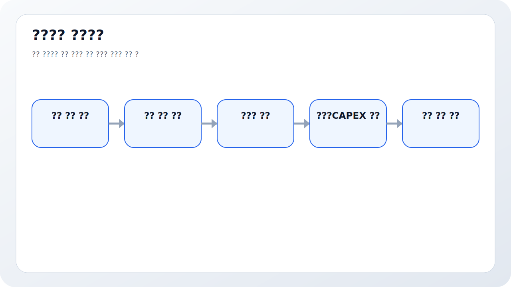
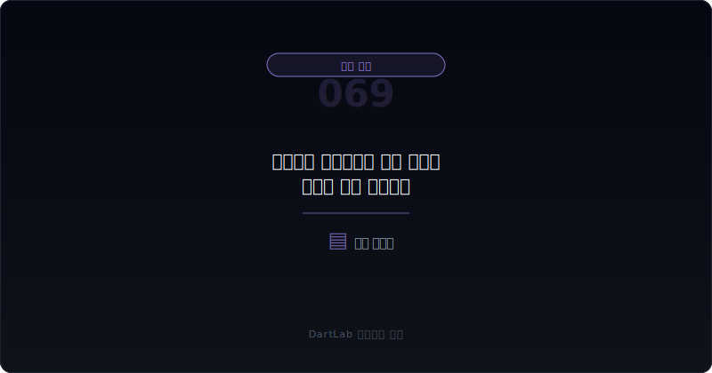
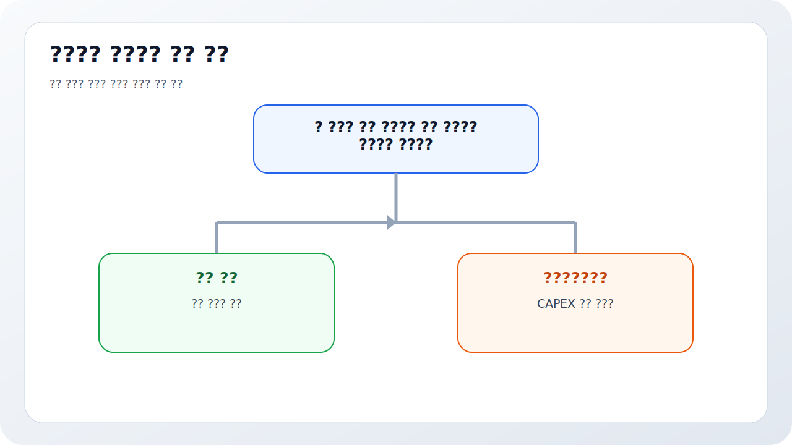
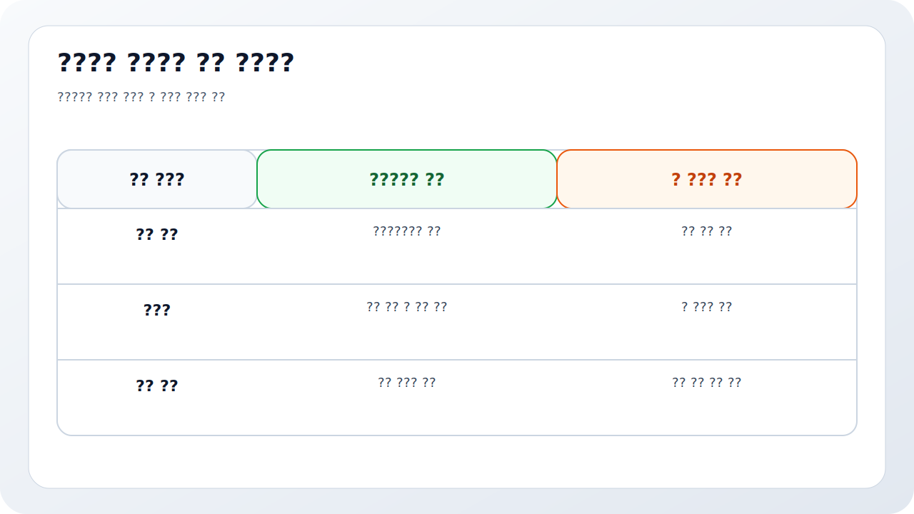
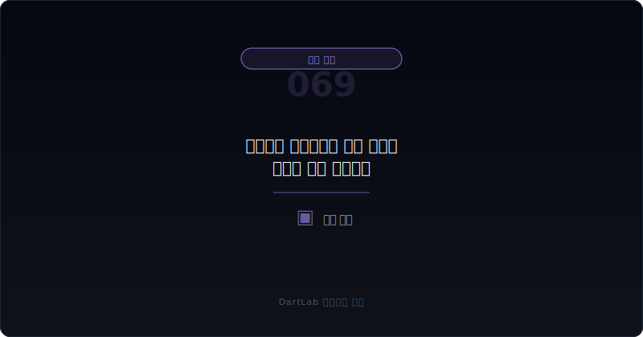

# 유형자산 손상차손은 경기 둔화를 어떻게 먼저 말해주나

유형자산 손상차손은 보통 늦게 드러난다. 공장, 설비, 점포, 물류센터 같은 자산은 기대가 좋을 때 장부에 크게 쌓이고, 수요가 꺾이거나 가동률이 내려가도 바로 손실로 잡히지 않는다. 그래서 손상차손이 공시에 나오기 시작하면 그 자체보다 `기대와 현실의 간극이 이미 꽤 벌어졌을 가능성`을 먼저 생각해야 한다.

특히 설비투자 사이클이 긴 회사일수록 유형자산 손상은 경기 둔화와 사업 실패의 늦은 진단서가 될 수 있다. 가동률 하락, 증설 후 저수요, 계획보다 늦은 매출화, 예상보다 낮은 마진, 자산 매각 검토가 이어지다 보면 결국 장부가를 낮춰야 하는 순간이 온다. 그래서 손상차손은 단순 회계비용이 아니라 CAPEX 이후 실패 신호를 압축한 결과일 수 있다.

이 글은 유형자산 손상차손을 `어느 자산이 손상됐는지 확인 -> 왜 지금 손상됐는지 확인 -> 가동률·매출·현금흐름과 연결 -> 일시적 둔화인지 구조적 실패인지 판단 -> 다음 보고서에서 추가 손상과 증설 계획을 같이 추적` 순서로 읽는 방법을 정리한다. 기본 토대는 [생산능력과 가동률, 무엇이 중요한가](/blog/capacity-utilization-capex), [건설중인자산은 무엇을 말해주나](/blog/construction-in-progress), [감가상각비는 CAPEX 이후를 어떻게 말해주나](/blog/depreciation-after-capex)와 같이 보면 좋다.

---

## 왜 손상차손은 늦게 나오는 신호인가

손상차손은 장부 기대가 더 이상 유지되기 어렵다고 인정하는 순간에 나온다. 다시 말해 수요 둔화, 가동률 하락, 사업 차질, 가격 경쟁 심화 같은 문제가 이미 한동안 누적됐을 가능성이 크다. 회사는 보통 손상차손을 먼저 잡기보다 증설 계획 조정, 비용 절감, 자산 전환 활용 같은 대안을 먼저 시도하기 때문이다.

그래서 손상차손은 `오늘 갑자기 나빠졌다`보다 `예전의 낙관이 지금 깨지고 있다`는 신호에 가깝다. 투자자는 손상 금액 자체보다 그 전 단계의 힌트를 찾는 편이 더 중요하다. 가동률이 몇 분기째 내려왔는지, 건설중인자산이 완공 후에도 기대만큼 매출화되지 않았는지, 감가상각 부담이 늘었는데 수익성이 못 따라왔는지를 같이 봐야 한다.

또한 손상차손은 단순한 비용 처리가 아니라 미래 기대 수정이다. 자산의 회수가능액이 장부가보다 낮아졌다는 뜻이므로, 사업 전망과 투자 효율이 동시에 낮아졌을 수 있다. 그래서 손상차손은 과거 투자 판단의 오류를 뒤늦게 드러내는 경우가 많다.

---

## 무엇을 먼저 붙여서 봐야 하나

| 먼저 볼 항목 | 왜 중요한가 |
| --- | --- |
| 손상된 자산 종류 | 공장, 설비, 점포, 물류센터마다 의미가 다르다 |
| 손상 시점 | 왜 이번 분기에 인식됐는지 배경을 본다 |
| 가동률·생산능력 | 수요 둔화와 연결되는지 확인한다 |
| 매출·마진 변화 | 투자 실패가 손익으로 이어졌는지 본다 |
| 영업현금흐름 | 비현금 손실 뒤 현금 압박까지 있는지 본다 |
| 추가 CAPEX 계획 | 손상 이후에도 같은 투자 전략을 반복하는지 본다 |
| 자산 매각·중단영업 | 구조조정 단계로 넘어가는지 확인한다 |

실전에서는 먼저 손상된 자산이 무엇인지 정확히 적는 것이 핵심이다. 공장과 생산설비 손상은 수요 둔화나 증설 실패와 연결되기 쉽고, 점포 손상은 점포 효율 악화나 상권 문제와 연결되며, 특정 사업부 자산 손상은 구조조정 가능성과 가까울 수 있다. 같은 손상차손이라도 자산 종류에 따라 해석이 달라진다.

그다음은 왜 지금인지 봐야 한다. 갑작스러운 경기 악화, 제품 가격 하락, 고객 이탈, 신규 설비 미가동, 해외 법인 부진, 사업 철수 검토 등 배경이 다를 수 있다. 이때 [공시에서 신규사업 계획은 어디까지 믿어야 하나](/blog/how-far-to-trust-new-business-plans), [매각예정자산과 중단영업은 무엇을 가리나](/blog/held-for-sale-and-discontinued-operations)와 같이 보면 투자 기대가 어떻게 현실에서 꺾였는지 더 잘 보인다.

마지막으로 현금과 후속 투자를 같이 봐야 한다. 손상차손은 비현금 비용이지만, 그 앞과 뒤에는 실제 현금 문제가 붙는 경우가 많다. 설비가 놀고 있으면 현금 회수는 느려지고, 추가 투자 여력도 줄어들 수 있다. 그래서 [영업현금흐름이 순이익을 부정할 때](/blog/operating-cash-flow-vs-net-income), [리스부채와 차입 만기 구조는 어디서 먼저 터지나](/blog/lease-liabilities-and-debt-maturity)와의 연결이 중요하다.

---

## 어디서부터 해석을 가르면 되나

가장 실용적인 질문은 이것이다. `이 손상은 일시적 경기 둔화인가, 투자 과열의 결과인가, 아니면 구조조정의 시작인가`.

일시적 둔화에 가까운 경우는 특정 기간 가동률과 수요가 흔들렸지만 핵심 경쟁력과 현금흐름이 아직 유지된다. 투자 과열에 가까운 경우는 증설 규모가 수요보다 앞섰고, 기대했던 매출과 마진이 따라오지 못한다. 구조조정 시작에 가까운 경우는 손상차손 뒤에 자산 매각, 사업 축소, 중단영업, 인력 재배치가 붙는다.

이 구분이 중요한 이유는 같은 손상차손이라도 미래가 다르기 때문이다. 일시적 둔화라면 회복 여지가 있지만, 투자 과열이라면 CAPEX 전략을 다시 의심해야 하고, 구조조정 단계라면 남은 사업의 체력과 자산 처분 방향을 다시 봐야 한다.

---

## 상대적으로 건강한 경우와 더 조심해야 하는 경우는 무엇이 다른가

| 관찰 포인트 | 상대적으로 건강한 경우 | 더 조심해야 하는 경우 |
| --- | --- | --- |
| 손상 대상 | 비핵심·저효율 자산 중심이다 | 핵심 설비와 주요 사업 자산이다 |
| 가동률 | 일시 하락 후 회복 가능성이 보인다 | 몇 분기째 낮고 추가 하락한다 |
| 매출·마진 | 손상 이후에도 본업이 버틴다 | 손상과 함께 수익성이 급격히 약해진다 |
| 현금흐름 | 비현금 손실로 그친다 | 차입과 유동성 압박이 같이 커진다 |
| 후속 전략 | CAPEX 축소와 구조 조정이 읽힌다 | 같은 증설 계획을 계속 반복한다 |
| 후속 사건 | 추가 손상이 제한적이다 | 자산 매각, 중단영업, 차환 압박이 붙는다 |

상대적으로 건강한 경우는 오래 끌던 저효율 자산을 정리하고, 남은 사업의 현금과 마진은 비교적 버티는 경우다. 반대로 더 조심해야 하는 경우는 핵심 설비가 손상되고, 가동률과 매출이 계속 약하며, 손상 뒤에도 같은 투자 서사가 반복되는 경우다. 이때는 사업 방향 자체를 다시 봐야 한다.

특히 CAPEX 이후 감가상각 부담이 커졌는데 손상차손까지 붙으면, 회사는 `투자 실수 + 수익성 약화 + 회복 지연`을 동시에 안고 있을 수 있다. 그래서 손상차손은 숫자 하나보다 투자 역사 전체를 다시 읽게 만드는 이벤트다.

---

## 왜 감가상각과 건설중인자산을 같이 봐야 하나

손상차손은 혼자 오지 않는 경우가 많다. 그 앞에는 건설중인자산이 있었고, 그 사이에는 감가상각 증가가 있었으며, 그 뒤에는 가동률 하락과 손익 둔화가 붙는다. 그래서 손상차손을 볼 때는 `그 자산이 어떻게 만들어졌고 언제부터 부담이 됐는가`까지 같이 따라가야 한다.

이 연결이 중요한 이유는 투자자의 질문이 바뀌기 때문이다. `왜 손상됐는가`만 물으면 현재 사건만 보게 된다. 하지만 `처음부터 과열 투자였는가`, `완공 이후 얼마나 빨리 수익으로 이어졌는가`, `감가상각 부담을 견딜 만큼 매출이 나왔는가`를 묻기 시작하면 사업과 자본배분의 질이 보인다.

결국 손상차손은 미래 경기 둔화의 예언이 아니라, 이미 진행 중인 둔화를 장부가 따라 인정한 순간일 수 있다. 그래서 숫자가 나온 뒤보다, 그 숫자가 나오기 전의 흐름을 찾는 편이 훨씬 중요하다.

실전 메모로는 `어떤 자산`, `왜 지금`, `그 뒤 투자 계획이 달라졌는가` 세 줄이 가장 유용하다. 손상 금액만 적어 두면 다음 보고서에서 아무것도 비교할 수 없지만, 이 세 줄이 있으면 추가 손상과 구조조정의 방향까지 이어서 읽을 수 있다.

손상은 숫자보다 맥락이 더 큰 사건이다.

---

## 자주 놓치는 해석 4가지

### 1. 손상차손은 비현금이라 가볍게 본다

비현금이지만 투자 실패 신호일 수 있다.

### 2. 손상 금액만 본다

어떤 자산이 손상됐는지가 더 중요하다.

### 3. 가동률과 연결하지 않는다

경기 둔화와 CAPEX 과열이 같이 숨어 있을 수 있다.

### 4. 후속 자산 매각을 안 본다

손상 뒤 구조조정으로 넘어갈 수 있다.

---

## 다음 보고서와 후속 숫자에서 무엇을 다시 봐야 하나

| 이번에 본 것 | 다음에 다시 볼 것 |
| --- | --- |
| 손상 대상 자산 | 추가 손상이 이어지는가 |
| 가동률 | 회복되는가 계속 낮은가 |
| 매출·마진 | 설비가 다시 돈을 벌기 시작하는가 |
| 영업현금흐름 | 비현금 손실 뒤 현금도 약해지는가 |
| CAPEX 계획 | 투자 축소와 우선순위 조정이 있는가 |
| 자산 매각 | 구조조정 단계로 넘어가는가 |

손상차손은 다음 보고서가 중요하다. 추가 손상이 이어지는지, 가동률이 회복되는지, CAPEX 계획이 현실적으로 낮아지는지, 자산 매각이나 중단영업이 붙는지를 보면 이번 손상이 일회성인지 구조적 문제인지 더 분명해진다. 손상 이후에도 회사가 같은 투자 서사를 반복한다면 투자자는 더 보수적으로 봐야 한다.

손상 뒤에 곧바로 자산 매각, 공장 축소, 신규 CAPEX 연기 공시가 붙는지도 중요하다. 이런 후속 조치가 이어지면 손상이 단순 회계 반영이 아니라 실제 사업 축소의 시작일 수 있다.

가장 실용적인 메모는 다섯 줄이다. `손상 자산`, `가동률`, `매출·마진`, `영업현금`, `추가 CAPEX`. 이 다섯 줄만 적어도 설비투자 실패 신호를 훨씬 빨리 읽게 된다.

---

## 10분 체크리스트

- 어떤 유형자산이 손상됐는지 적었는가
- 왜 이번 분기에 손상 인식이 나왔는지 확인했는가
- 가동률과 생산능력이 어떻게 변했는지 봤는가
- 감가상각과 영업현금흐름을 같이 봤는가
- 추가 CAPEX 계획이 유지되는지 확인했는가
- 자산 매각·중단영업으로 이어지는지 추적할 계획이 있는가

## FAQ

### 유형자산 손상차손은 비현금이니 덜 중요하지 않나

비현금이지만 과거 CAPEX 기대가 꺾였다는 신호일 수 있어 중요하다.

### 가장 먼저 봐야 할 것은 무엇인가

어떤 자산이 손상됐는지와 가동률·매출이 어떻게 움직였는지다.

### 손상이 한 번 나왔다고 바로 구조조정인가

아니다. 하지만 자산 매각과 중단영업이 붙는지 확인해야 한다.

### 무엇을 같이 보면 좋은가

생산능력, 건설중인자산, 감가상각, 영업현금흐름, 중단영업 글을 같이 보면 좋다.

## 같이 읽으면 좋은 글

- [생산능력과 가동률, 무엇이 중요한가](/blog/capacity-utilization-capex)
- [건설중인자산은 무엇을 말해주나](/blog/construction-in-progress)
- [감가상각비는 CAPEX 이후를 어떻게 말해주나](/blog/depreciation-after-capex)
- [영업현금흐름이 순이익을 부정할 때](/blog/operating-cash-flow-vs-net-income)
- [매각예정자산과 중단영업은 무엇을 가리나](/blog/held-for-sale-and-discontinued-operations)
- [개발비·무형자산은 어디서 과열 신호가 보이나](/blog/development-costs-and-intangibles)

## 참고한 공식 자료

- [IAS 36 Impairment of Assets](https://www.ifrs.org/issued-standards/list-of-standards/ias-36-impairment-of-assets/)
- [IAS 36 Impairment of Assets PDF](https://www.ifrs.org/content/dam/ifrs/publications/pdf-standards/english/2021/issued/part-a/ias-36-impairment-of-assets.pdf)
- [IAS 16 Property, Plant and Equipment PDF](https://www.ifrs.org/content/dam/ifrs/publications/pdf-standards/english/2021/issued/part-a/ias-16-property-plant-and-equipment.pdf?bypass=on)
- [DART 소개 - 보고서정보](https://dart.fss.or.kr/introduction/content2.do)
- [OpenDART XBRL 주석](https://opendart.fss.or.kr/disclosureinfo/fnltt/xbrlnote/main.do)
- [OpenDART 단일회사 주요계정](https://opendart.fss.or.kr/disclosureinfo/fnltt/singlacnt/main.do)

## 정리

유형자산 손상차손은 단순한 비현금 손실이 아니라, 이전의 설비투자 기대가 지금의 수요와 수익성에 맞지 않는다는 신호일 수 있다. 그래서 손상 금액보다 손상된 자산, 가동률, 매출과 마진, 현금흐름, 추가 CAPEX 계획을 같이 봐야 의미가 드러난다.

핵심은 `얼마를 손상했는가`보다 `왜 이제서야 손상을 인정했는가`를 묻는 것이다. 이 질문을 붙이면 경기 둔화와 투자 과열의 흔적을 훨씬 빨리 읽게 된다.
