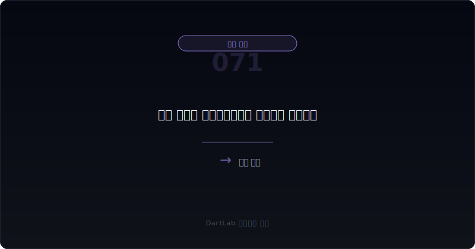
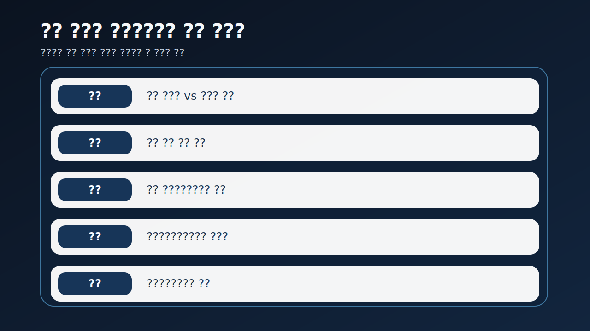
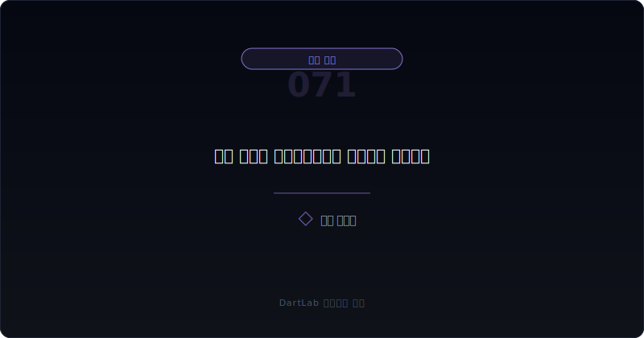
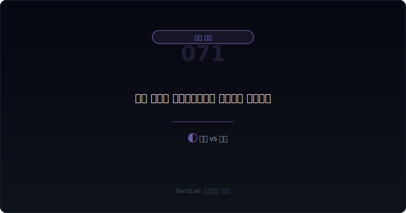
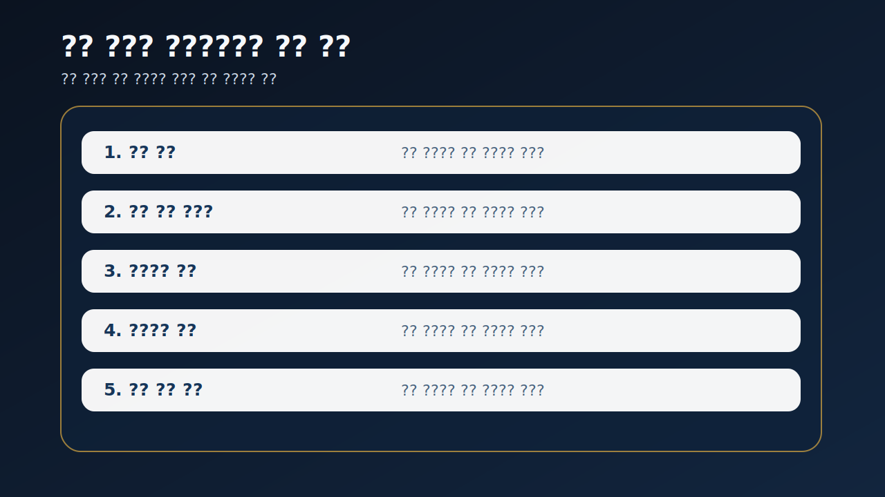

# 리스 개정과 세일앤리스백은 누구에게 유리한가

리스 개정이나 세일앤리스백 공시를 보면 많은 사람이 먼저 `현금이 들어왔다`, `부채 부담이 줄었다`, `자산을 유연하게 쓴다`는 headline부터 본다. 물론 그렇게 읽을 수 있는 경우도 있다. 하지만 실전에서는 그보다 먼저 `오늘의 현금이 내일의 어떤 지급 의무로 바뀌었는가`를 확인해야 한다.

특히 세일앤리스백은 자산을 팔아 현금을 확보하면서도 계속 같은 자산을 쓰는 구조다. 그래서 겉으로는 자산 매각처럼 보이지만, 실제로는 미래 임차료와 사용권 의무를 다시 짜는 거래일 수 있다. 리스 개정도 마찬가지다. 당장 리스료를 낮추거나 유예해도 총 지급액이 늘고 만기가 길어지면, 단기 안도감 대신 장기 부담이 커질 수 있다.

이 글은 리스 개정과 세일앤리스백을 `거래 목적 확인 -> 현금 유입과 회계 효과 분리 -> 임차 조건 재배치 확인 -> 영업현금흐름·만기 구조와 연결 -> 다음 보고서에서 실제 부담이 줄었는지 추적` 순서로 읽는 방법을 정리한다. 기본 토대는 [리스부채와 차입 만기 구조는 어디서 먼저 터지나](/blog/lease-liabilities-and-debt-maturity), 현금 착시는 [매출채권 팩토링과 유동화는 현금흐름을 어떻게 좋게 보이게 하나](/blog/receivables-factoring-and-securitization), 자산 처분 맥락은 [매각예정자산과 중단영업은 무엇을 가리나](/blog/held-for-sale-and-discontinued-operations), 숫자 분리는 [영업외손익이 본업을 가릴 때 무엇을 분리해서 봐야 하나](/blog/non-operating-income-vs-core-earnings)와 같이 보면 좋다.

---

## 왜 현금 유입보다 의무 재배치가 더 중요한가

세일앤리스백은 한 번에 큰 현금을 만들 수 있다. 그래서 유동성 압박이 있는 회사는 이 구조를 꽤 매력적으로 쓸 수 있다. 문제는 여기서 현금만 보고 끝내면 거의 항상 절반만 읽게 된다는 점이다. 팔고 다시 빌려 쓰는 순간, 회사는 자산을 팔아 얻은 현금과 미래 임차료를 맞바꾼 것일 수 있기 때문이다.

리스 개정도 비슷하다. 몇 개 분기의 리스료가 유예되거나 감면되면 당장 현금흐름은 좋아 보인다. 하지만 그 대신 만기가 길어지고 총 지급액이 늘거나, 다른 약정과 묶여 더 무거운 구조가 될 수 있다. 그래서 리스 개정은 `부담 완화`가 아니라 `부담 재배치`인지 먼저 확인해야 한다.

결국 투자자가 물어야 할 핵심은 이것이다. `이번 거래가 진짜 구조 개선인가, 아니면 시간을 사는 거래인가`. 이 질문을 먼저 붙이면 리스 관련 공시를 훨씬 덜 순진하게 읽게 된다.

---

## 구조가 작동하는 순서

| 먼저 볼 항목 | 왜 중요한가 |
| --- | --- |
| 거래 목적 | 유동성 확보인지 운영 효율화인지 구분한다 |
| 현금 유입 규모 | 지금 확보한 현금이 얼마나 큰지 본다 |
| 후속 리스 조건 | 임차 기간, 지급액, 옵션이 어떻게 바뀌는지 본다 |
| 사용권자산·리스부채 변화 | 회계상 부담이 어디로 이동했는지 본다 |
| 영업현금흐름 | 새 구조를 스스로 버틸 현금이 있는지 본다 |
| 차입 만기·후속 조달 | 리스 재편이 다른 자금조달 압박과 겹치는지 본다 |

실전에서는 먼저 거래 목적과 현금 유입을 같은 줄에 적는 편이 좋다. 자산을 판 목적이 단순 포트폴리오 조정인지, 당장 차입 상환과 운영자금 방어인지가 다르면 해석이 크게 달라지기 때문이다. 목적 설명이 모호한데 현금 유입이 큰 경우는 더 주의해야 한다.

그다음에는 반드시 후속 리스 조건을 내려가서 읽어야 한다. 임차 기간이 길어졌는지, 옵션이 붙었는지, 유예된 지급이 뒤로 몰렸는지, 고정 지급이 늘었는지 같은 정보가 핵심이다. 이 부분은 [리스부채와 차입 만기 구조는 어디서 먼저 터지나](/blog/lease-liabilities-and-debt-maturity)와 붙이면 훨씬 잘 보인다.

또 하나 중요한 것은 영업현금흐름과 같이 보는 습관이다. 세일앤리스백으로 한 번 큰 현금이 들어와도 본업에서 현금이 계속 약하면 그 거래는 구조 개선보다 `일시적 완충 장치`로 읽는 편이 맞다.

---

## 어디에서 왜곡이 생기나

가장 실용적인 질문은 이것이다. `이번 거래는 운영 효율화인가, 유동성 보완인가, 아니면 장기 부담을 미루는 구조인가`.

운영 효율화라면 자산 활용 방식이 분명하고, 현금 유입 이후에도 영업현금흐름과 리스 부담이 비교적 안정적으로 읽힌다. 유동성 보완이라면 지금은 숨통이 트이지만 이후 임차료와 만기 구조를 계속 확인해야 한다. 장기 부담 이연 구조라면 당장 숫자는 편해 보여도 미래 지급과 후속 조달 의존이 더 커질 수 있다.

이 구분이 중요한 이유는 세일앤리스백과 리스 개정이 보통 `좋은 뉴스처럼 보이기 쉬운 거래`이기 때문이다. 현금 유입, 자산 매각 이익, 부채 재조정 같은 단어가 headline을 부드럽게 만들지만, 실제 부담은 뒤로 숨어 있을 수 있다. 그래서 이 영역은 회계 처리보다 현금과 계약 조건의 방향을 먼저 읽는 편이 맞다.

특히 자산 매각 이익이 함께 잡히면 투자자는 더 헷갈리기 쉽다. 이럴 때는 [영업외손익이 본업을 가릴 때 무엇을 분리해서 봐야 하나](/blog/non-operating-income-vs-core-earnings)와 같이 보며, 이번 거래가 이익 착시와 현금 완충을 동시에 만들고 있는지 확인하는 편이 좋다.

---

## 왜곡을 걸러내는 숫자 조합

| 관찰 포인트 | 상대적으로 건강한 경우 | 더 조심해야 하는 경우 |
| --- | --- | --- |
| 거래 목적 | 자산 효율화와 운영 목적이 읽힌다 | 유동성 방어 목적이 강한데 설명이 흐리다 |
| 현금 유입 | 이후 구조와 함께 해석 가능하다 | 현금 유입만 강조되고 후속 부담 설명이 약하다 |
| 리스 조건 | 만기와 지급 구조가 비교적 합리적이다 | 총 지급 부담이 뒤로 더 커진다 |
| 영업현금흐름 | 새 구조를 버틸 여력이 있다 | 본업 현금이 약해 거래 의존이 크다 |
| 후속 이벤트 | 추가 차입·증자 의존이 제한적이다 | 다른 조달 이벤트와 연속으로 붙는다 |

상대적으로 건강한 경우는 거래 목적과 조건, 후속 부담이 비교적 일관되게 설명된다. 반대로 더 조심해야 하는 경우는 매각과 현금 유입만 크게 보이는데, 리스 조건과 장기 부담은 흐리게 적혀 있다. 이런 구조는 숫자를 잠깐 예쁘게 만들 수는 있어도, 미래 부담을 줄였다고 보기 어렵다.

특히 자산을 팔고 다시 빌려 쓰는 거래가 반복되거나, 같은 시기에 [유상증자 공시 읽는 법](/blog/rights-offering-disclosure), [전환사채와 BW 공시 읽는 법](/blog/convertible-bond-and-bw-disclosure) 같은 외부 조달이 겹치면 해석은 훨씬 더 무거워진다. 한 번의 거래가 아니라 `현금 확보 수단을 계속 바꿔 쓰는 구조`일 수 있기 때문이다.

---

## 왜 세일앤리스백 이익과 현금흐름을 따로 봐야 하나

세일앤리스백은 때때로 장부상 이익과 현금 유입을 동시에 만든다. 그래서 숫자만 보면 재무가 좋아진 것처럼 느껴질 수 있다. 하지만 투자자는 이 둘을 반드시 분리해서 봐야 한다. 이익은 회계상 처리 결과일 수 있지만, 현금은 실제로 들어온 돈이고, 그 돈의 대가로 어떤 지급 약속이 생겼는지는 또 다른 문제이기 때문이다.

이 분리가 중요한 이유는 회사가 `자산 매각 이익`으로 손익을 부드럽게 만들고, 동시에 `현금 유입`으로 유동성 걱정을 잠깐 덮을 수 있기 때문이다. 이 경우 headline은 좋아지지만 본업 체력은 별로 달라지지 않을 수 있다. 그래서 세일앤리스백은 늘 `이익`, `현금`, `미래 리스료` 세 줄을 같이 적는 편이 좋다.

리스 개정도 같은 방식으로 읽을 수 있다. 리스료 유예나 감면이 잡혀 있더라도 그게 실제 비용 절감인지, 단순한 시점 이동인지 분리해야 한다. 당장 숫자가 편해졌다는 이유만으로 구조가 좋아졌다고 결론 내리면 빠르게 틀릴 수 있다.

실전 메모로는 `현금 얼마나 들어왔나`, `앞으로 무엇을 더 내야 하나`, `본업 현금이 그 구조를 버티나` 세 줄이면 충분하다. 이 세 줄이 적히면 리스 관련 공시를 훨씬 덜 추상적으로 읽게 된다.

---

## 실전에서 가장 빨리 구분되는 조합은 무엇인가

이 주제에서 가장 빨리 경고가 되는 조합은 `세일앤리스백 현금 유입 + 영업현금흐름 약세 + 후속 차입 또는 증자`다. 이 셋이 같이 보이면 거래가 효율화보다 시간 벌기일 가능성을 더 강하게 봐야 한다. 반대로 `리스 개정 + 총지급 구조 안정 + 본업 현금 회복` 조합이 보이면 조건 재편이 실제 운영 정상화로 이어질 여지가 있다.

또 하나 자주 나오는 조합은 `자산 매각 이익 + 본업 마진 둔화`다. 이 경우 headline 이익은 좋아 보여도 본업 체력은 그대로 약할 수 있다. 그래서 자산 거래가 이익을 가린 것인지, 진짜 부담 완화가 일어난 것인지 꼭 분리해서 읽어야 한다.

---

## 놓치기 쉬운 예외

| 이번에 본 것 | 다음에 다시 볼 것 |
| --- | --- |
| 현금 유입 | 실제 유동성 압박이 완화됐는가 |
| 리스 개정 조건 | 추가 변경이 반복되는가 |
| 사용권자산·리스부채 | 새 구조가 장부에 어떻게 남는가 |
| 영업현금흐름 | 본업에서 부담을 감당하기 시작하는가 |
| 차입 만기 | 리스 재편 뒤 단기 압박이 줄었는가 |
| 후속 조달 | 또 다른 자산 매각, 증자, 사채가 붙는가 |

리스 개정과 세일앤리스백은 한 번 공시로 끝내면 거의 항상 얕게 읽힌다. 다음 보고서에서 리스부채가 어떻게 남았는지, 영업현금흐름이 실제로 회복됐는지, 단기 차입 압박이 줄었는지 확인해야 의미가 드러난다. 그래서 가능하면 `현금 유입`, `미래 리스료`, `영업현금`, `차입 만기`, `후속 조달` 다섯 줄을 적어 두는 편이 좋다.

특히 같은 구조가 반복되면 해석이 달라진다. 세일앤리스백이 한 번의 효율화인지, 아니면 현금이 부족할 때마다 자산을 팔아 시간을 사는 패턴인지는 다음 보고서에서 훨씬 더 잘 드러난다.

---

## 빠른 점검 체크리스트

- 거래 목적이 운영 효율화인지 유동성 확보인지 적었는가
- 현금 유입과 장부상 이익을 분리해서 봤는가
- 후속 리스 조건과 만기 구조를 확인했는가
- 사용권자산과 리스부채 변화를 같이 봤는가
- 영업현금흐름이 새 구조를 버틸 수 있는지 확인했는가
- 후속 증자·사채·자산매각이 또 붙는지 추적할 계획이 있는가

## 자주 묻는 질문

### 세일앤리스백은 무조건 나쁜가

아니다. 다만 현금 유입과 미래 리스 부담을 같이 봐야 한다.

### 리스 개정이 있으면 부담이 줄었다고 봐도 되나

항상 그렇지 않다. 단기 유예 대신 장기 총지급이 늘 수 있다.

### 무엇이 가장 먼저 중요한가

현금이 얼마나 들어왔는지보다 그 대가로 어떤 의무가 재배치됐는지다.

### 무엇을 같이 보면 좋은가

영업현금흐름, 차입 만기, 자산 매각, 후속 조달 공시를 같이 보면 좋다.

## 구조를 더 깊이 이해하는 글

- [리스부채와 차입 만기 구조는 어디서 먼저 터지나](/blog/lease-liabilities-and-debt-maturity)
- [영업현금흐름이 순이익을 부정할 때](/blog/operating-cash-flow-vs-net-income)
- [매출채권 팩토링과 유동화는 현금흐름을 어떻게 좋게 보이게 하나](/blog/receivables-factoring-and-securitization)
- [영업외손익이 본업을 가릴 때 무엇을 분리해서 봐야 하나](/blog/non-operating-income-vs-core-earnings)
- [매각예정자산과 중단영업은 무엇을 가리나](/blog/held-for-sale-and-discontinued-operations)
- [유상증자 공시 읽는 법](/blog/rights-offering-disclosure)
- [전환사채와 BW 공시 읽는 법](/blog/convertible-bond-and-bw-disclosure)

## 참고 자료

- [IFRS 16 Leases](https://www.ifrs.org/issued-standards/list-of-standards/ifrs-16-leases/)
- [IFRS 16 PDF](https://www.ifrs.org/content/dam/ifrs/publications/pdf-standards/english/2024/issued/part-a/ifrs-16-leases.pdf?bypass=on)
- [IFRIC agenda paper on sale and leaseback](https://www.ifrs.org/content/dam/ifrs/meetings/2020/march/ifric/ap02-ifrs16-sale-and-leaseback.pdf)
- [OpenDART XBRL 주석](https://opendart.fss.or.kr/disclosureinfo/fnltt/xbrlnote/main.do)
- [DART 소개 - 보고서정보](https://dart.fss.or.kr/introduction/content2.do)

## 핵심 구조 요약

리스 개정과 세일앤리스백은 현금 유입이나 부채 완화 headline만 보면 거의 항상 얕게 읽힌다. 실제로는 미래 지급 의무가 어떻게 재배치됐는지, 그 구조를 본업 현금이 버틸 수 있는지가 더 중요하다.

핵심은 `지금 좋아졌는가`보다 `무엇을 뒤로 미뤘는가`를 먼저 묻는 것이다. 이 질문을 붙이면 리스 관련 공시를 훨씬 덜 늦게 이해하게 된다.
