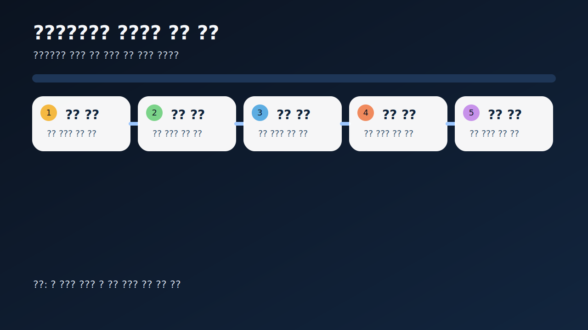
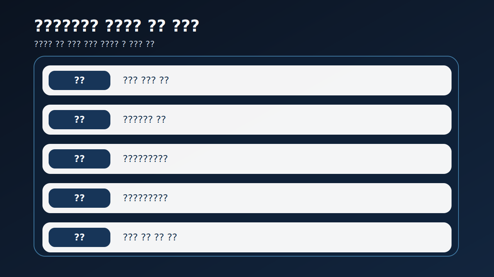
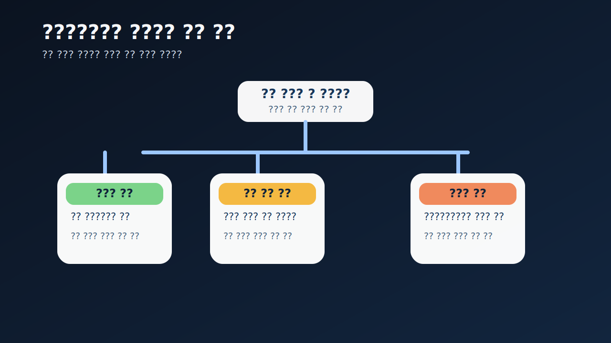
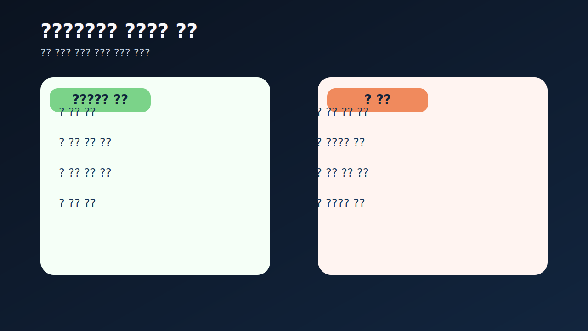
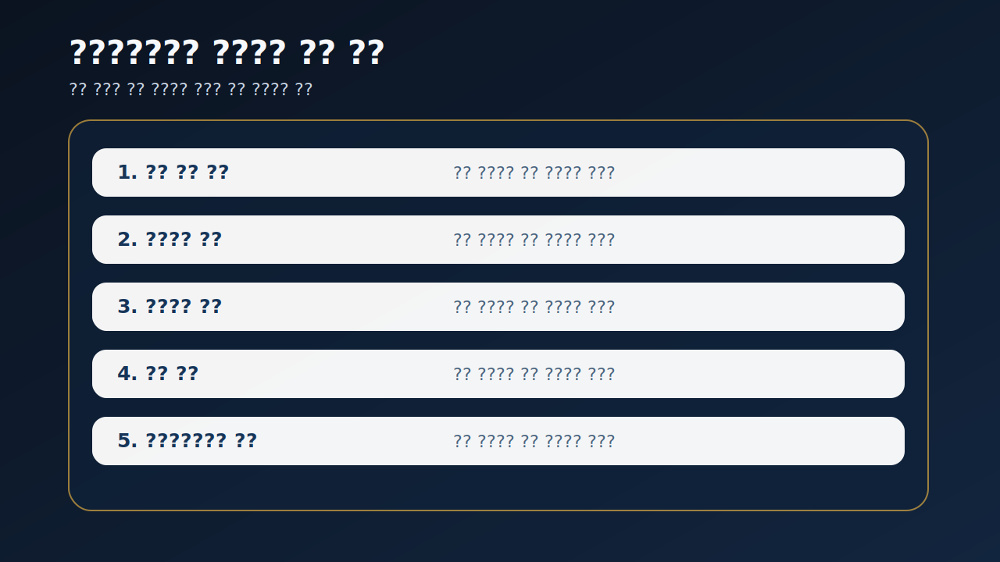

# 재고평가손실과 저가수주 압박은 어떻게 이어지나

재고평가손실과 저가수주 압박은 보통 별개의 문제처럼 보인다. 하나는 재고자산 평가의 문제이고, 다른 하나는 수주 가격과 마진의 문제처럼 느껴진다. 하지만 실전에서는 둘이 같은 방향을 가리킬 때가 많다. 잘 팔릴 줄 알았던 재고가 장부에서 깎이기 시작하고, 새로 따오는 일감마저 낮은 가격 경쟁에 묶이면 회사는 과거와 미래에서 동시에 마진 압박을 받게 된다.

특히 제조업과 건설·플랜트·조선 같은 수주형 업종에서는 이 연결이 더 중요하다. 이미 쌓여 있는 재고나 원가 부담은 과거의 낙관을 보여 주고, 저가수주는 앞으로 벌어질 마진 약화를 예고할 수 있기 때문이다. 그래서 이 주제는 재고 한 줄이나 수주 뉴스 한 건으로 보면 거의 항상 늦는다.

이 글은 재고평가손실과 저가수주 압박을 `재고와 마진 흐름 확인 -> 어떤 재고와 어떤 계약이 문제인지 분리 -> 평가손실과 충당부채 연결 -> 현금흐름과 회수 구조 검증 -> 다음 보고서에서 반복되는지 추적` 순서로 읽는 방법을 정리한다. 기본 토대는 [재고자산과 평가손실 읽는 법](/blog/inventory-and-write-downs), 마진 구조는 [판관비가 매출보다 빨리 불어날 때 무엇을 먼저 봐야 하나](/blog/sga-growth-vs-sales), 인식 시점 착시는 [매출 인식 시점 변경은 어디가 신호인가](/blog/revenue-recognition-timing-signals), 현금 검증은 [영업현금흐름이 순이익을 부정할 때](/blog/operating-cash-flow-vs-net-income)와 같이 보면 좋다.

---

## 왜 재고평가손실과 저가수주를 같이 봐야 하나

재고평가손실은 보통 과거 판단이 어긋났다는 신호다. 팔릴 줄 알고 쌓아 둔 재고, 유지될 줄 알았던 판매가격, 버틸 줄 알았던 원가 구조가 현실과 맞지 않기 시작할 때 장부에 손실이 나온다. 반면 저가수주는 미래 판단이 약해졌다는 신호일 수 있다. 일감을 유지하기 위해 낮은 가격으로 계약을 따오면 앞으로의 마진이 얇아질 가능성이 커진다.

이 둘이 동시에 보이면 해석은 더 무거워진다. 회사가 과거 재고의 가치도 지키지 못하고, 미래 일감의 가격도 방어하지 못하고 있을 수 있기 때문이다. 그래서 투자자는 재고평가손실을 단순한 일회성 손실로 넘기기보다, 수주 경쟁력과 마진 방어력이 같이 흔들리는지 확인해야 한다.

결국 핵심 질문은 이것이다. `이 회사는 과거에 쌓인 물건과 앞으로 따올 계약 모두에서 가격 방어를 잃고 있는가`. 이 질문을 붙이면 숫자의 의미가 훨씬 빨리 드러난다.

---

## 같은 항목인데 해석이 갈리는 이유

| 먼저 볼 항목 | 왜 중요한가 |
| --- | --- |
| 재고 구성과 증가 속도 | 어떤 층에서 부담이 쌓였는지 본다 |
| 매출총이익률 | 가격 방어력이 약해졌는지 본다 |
| 평가손실·충당부채 | 과거와 미래 손실 인식이 어디서 시작되는지 본다 |
| 수주 설명·계약 구조 | 저가수주가 일시적 경쟁인지 구조적 압박인지 본다 |
| 영업현금흐름 | 낮은 마진 구조를 현금으로 버티는지 본다 |
| 매출채권·계약자산 | 저가수주가 회수 부담까지 키우는지 본다 |

실전에서는 먼저 재고 증가와 매출총이익률을 같은 줄에 두는 편이 좋다. 재고가 늘고 회전율이 둔화되는데 마진까지 약해지면 경고는 더 분명해진다. 그다음에는 평가손실과 충당부채를 본다. 제조업은 재고평가손실에서, 수주형 업종은 불리한 계약 관련 충당부채에서 먼저 신호가 나올 수 있기 때문이다.

또 하나 중요한 것은 저가수주 설명을 너무 낙관적으로 읽지 않는 것이다. `시장 점유율 확대`, `전략적 수주`, `향후 확장 기반` 같은 표현이 붙어도, 실제로는 낮은 가격 경쟁을 택한 것일 수 있다. 이럴 때는 [사업보고서에서 CEO 말보다 숫자가 중요한 순간](/blog/when-numbers-matter-more-than-ceo-words)처럼 설명보다 후속 마진과 현금을 먼저 확인하는 편이 맞다.

---

## 건강한 구조 vs 위험한 구조

가장 실용적인 질문은 이것이다. `이번 신호는 일시적 믹스 변화인가, 가격 경쟁 심화인가, 구조적 마진 붕괴의 시작인가`.

일시적 변화라면 특정 제품군이나 특정 프로젝트에 한정되고, 다음 보고서에서 재고나 마진이 비교적 빨리 정상화될 수 있다. 가격 경쟁 심화라면 저가수주가 반복되고 재고 부담이 할인 판매나 평가손실로 이어질 가능성이 커진다. 구조적 마진 붕괴라면 재고, 마진, 현금흐름, 충당부채가 동시에 나빠지며 설명도 점점 방어적으로 바뀐다.

이 구분이 중요한 이유는 같은 평가손실도 해석이 다르기 때문이다. 늦게라도 손실을 인식하고 재고를 정리하는 경우는 오히려 현실 반영일 수 있다. 반면 저가수주가 계속되고 평가손실이 반복되면, 회사는 가격을 지키지 못하는 구조 속에서 장부 정리만 뒤늦게 하고 있을 수 있다.

그래서 이 영역은 손실 금액 하나보다 `과거 재고 손실`과 `미래 계약 손실`이 동시에 커지는지 보는 편이 훨씬 실전적이다.

---

## 업종과 맥락에 따라 달라지는 기준

| 관찰 포인트 | 상대적으로 관리 가능한 경우 | 더 조심해야 하는 경우 |
| --- | --- | --- |
| 재고 부담 | 특정 품목 중심이고 정리 경로가 보인다 | 여러 분기 누적되고 제품 전반에 퍼진다 |
| 마진 흐름 | 일시적으로 약해져도 회복 가능성이 읽힌다 | 매출총이익률이 계속 밀린다 |
| 수주 설명 | 저가 수주의 이유와 범위가 비교적 분명하다 | 전략적 수주라는 말만 반복된다 |
| 손실 인식 | 평가손실과 충당부채 반영이 비교적 솔직하다 | 반영이 늦거나 작게 보인다 |
| 현금 구조 | 영업현금흐름이 어느 정도 버텨 준다 | 현금까지 같이 약해진다 |

상대적으로 관리 가능한 경우는 어떤 재고와 어떤 계약이 문제였는지 비교적 분명하고, 손실 반영도 늦지 않다. 반대로 더 조심해야 하는 경우는 재고가 쌓이고 마진이 무너지는데, 회사 설명은 계속 미래 성장 이야기만 반복한다. 이때는 저가수주가 일시적이 아니라 구조적 약세일 가능성을 더 강하게 봐야 한다.

특히 [공급망금융과 매입채무는 현금흐름을 어떻게 좋게 보이게 하나](/blog/supply-chain-finance-and-payables), [매출채권 팩토링과 유동화는 현금흐름을 어떻게 좋게 보이게 하나](/blog/receivables-factoring-and-securitization)와 같은 현금 보정 장치가 함께 보이면 해석은 더 무거워진다. 마진이 약한데 현금까지 금융기법에 기대면 구조 문제가 더 길어질 수 있기 때문이다.

---

## 왜 현금과 회수 구조를 같이 봐야 하나

재고평가손실과 저가수주 압박은 손익계산서에서 먼저 보이는 것 같지만, 실제로는 현금과 회수 구조에서 더 빨리 무거워질 수 있다. 낮은 가격으로 따온 일감은 매출을 만들 수 있어도 현금을 남기지 못할 수 있고, 쌓여 있는 재고는 할인과 손실 인식으로 이어지며 현금 회복을 더 늦출 수 있다.

그래서 이 주제는 `재고`, `마진`, `영업현금흐름`, `매출채권·계약자산` 네 줄을 같이 보는 편이 가장 좋다. 마진이 낮고 회수도 느리면 저가수주는 매출 성장처럼 보여도 실제로는 체력을 깎는 구조일 수 있다.

실전 메모로는 `어떤 재고가 문제인가`, `왜 낮은 가격을 받았는가`, `현금은 남는가` 세 줄이면 충분하다. 이 세 줄이 있으면 같은 회사의 다음 보고서를 볼 때도 해석이 훨씬 빨라진다.

특히 분기말에만 매출이 좋아 보이고 다음 분기에 마진과 현금이 바로 꺾이면, 저가수주 압박이 뒤늦게 숫자에 반영된 것일 수 있다. 이럴수록 headline보다 후속 분기 숫자를 더 중요하게 봐야 한다.

---

## 실전에서 가장 빨리 구분되는 조합은 무엇인가

이 주제에서 가장 빨리 경고가 되는 조합은 `재고 증가 + 매출총이익률 하락 + 영업현금흐름 약화`다. 이 셋이 같이 보이면 판매 속도와 가격 방어, 현금 회수 중 두세 곳이 동시에 흔들리고 있을 가능성이 크다. 평가손실이 아직 작아 보여도 이 조합이 먼저 나오면 늦지 않게 의심하는 편이 좋다.

수주형 업종에서는 `전략적 수주 설명 반복 + 충당부채 증가 + 계약자산 누적` 조합도 강한 신호다. 말로는 미래 물량 확보라고 설명하지만, 실제로는 낮은 가격 계약과 회수 부담이 같이 커질 수 있기 때문이다. 그래서 저가수주 뉴스는 늘 다음 분기의 마진과 현금으로 다시 검증해야 한다.

반대로 `재고 정리 진행 + 마진 방어 + 현금 회복` 조합이 보이면 손실 인식이 현실 반영에 그쳤을 가능성도 있다. 중요한 것은 손실 자체보다 그 뒤의 정상화 속도다.

같은 고객군에서 낮은 가격 수주가 반복되면 일시적 판촉보다 구조적 협상력 약화로 보는 편이 안전하다. 이때는 물량 증가보다 남는 현금과 마진을 더 우선해서 봐야 한다.

결국 수주보다 채산성이 먼저 무너지면 숫자는 오래 못 버틴다.

---

## 다음 분기 비교에서 다시 확인할 것

| 이번에 본 것 | 다음에 다시 볼 것 |
| --- | --- |
| 재고 증가·평가손실 | 재고가 실제로 줄어드는가 |
| 매출총이익률 | 낮아진 마진이 회복되는가 |
| 저가수주 설명 | 같은 논리가 또 반복되는가 |
| 충당부채 | 불리한 계약 손실이 더 커지는가 |
| 영업현금흐름 | 낮은 가격 구조를 현금이 버티는가 |
| 매출채권·계약자산 | 수주 증가가 회수 부담으로 이어지는가 |

이 영역은 한 분기만 보고 결론 내리기 어렵다. 재고가 실제로 풀리는지, 마진이 방어되는지, 저가수주 설명이 또 나오는지, 충당부채가 더 커지는지 다음 보고서에서 확인해야 의미가 드러난다. 그래서 가능하면 `재고`, `마진`, `충당부채`, `현금`, `회수` 다섯 줄을 적어 두는 편이 좋다.

같은 조합이 두세 번 반복되면 해석이 달라진다. 그때부터는 일시적 업황보다 구조적 가격 약세로 읽는 편이 맞다.

---

## 비교 체크리스트

- 재고 증가 속도와 재고 구성을 같이 봤는가
- 매출총이익률이 같이 약해지는지 확인했는가
- 평가손실과 충당부채를 분리해서 봤는가
- 저가수주 설명이 반복되는지 확인했는가
- 영업현금흐름과 회수 구조가 버티는지 봤는가
- 다음 보고서에서 재고와 마진이 정상화되는지 추적할 계획이 있는가

## FAQ

### 재고평가손실이 나오면 무조건 최악인가

아니다. 다만 그 손실이 늦게 반영된 것인지 함께 봐야 한다.

### 저가수주는 항상 나쁜가

항상 그렇지는 않다. 다만 반복되면 마진 구조를 의심해야 한다.

### 무엇이 가장 먼저 중요한가

재고와 마진, 그리고 현금이 같은 방향으로 약해지는지다.

### 무엇을 같이 보면 좋은가

재고 구성, 매출총이익률, 충당부채, 영업현금흐름, 매출채권을 같이 보면 좋다.

## 함께 비교하면 좋은 글

- [재고자산과 평가손실 읽는 법](/blog/inventory-and-write-downs)
- [영업현금흐름이 순이익을 부정할 때](/blog/operating-cash-flow-vs-net-income)
- [매출 인식 시점 변경은 어디가 신호인가](/blog/revenue-recognition-timing-signals)
- [판관비가 매출보다 빨리 불어날 때 무엇을 먼저 봐야 하나](/blog/sga-growth-vs-sales)
- [매출채권과 대손충당금 읽는 법](/blog/receivables-and-allowance)
- [공급망금융과 매입채무는 현금흐름을 어떻게 좋게 보이게 하나](/blog/supply-chain-finance-and-payables)

## 출처

- [IAS 2 Inventories](https://www.ifrs.org/issued-standards/list-of-standards/ias-2-inventories/)
- [IAS 2 supporting materials](https://www.ifrs.org/supporting-implementation/supporting-materials-by-ifrs-standards/ias-2/)
- [IAS 37 Provisions, Contingent Liabilities and Contingent Assets](https://www.ifrs.org/issued-standards/list-of-standards/ias-37-provisions-contingent-liabilities-and-contingent-assets/)
- [OpenDART XBRL 주석](https://opendart.fss.or.kr/disclosureinfo/fnltt/xbrlnote/main.do)
- [DART 소개 - 보고서정보](https://dart.fss.or.kr/introduction/content2.do)

## 한 줄 정리

재고평가손실과 저가수주 압박은 각각 과거와 미래의 마진 약세를 보여주는 신호일 수 있다. 그래서 재고, 매출총이익률, 충당부채, 영업현금흐름을 같이 봐야 그 무게가 드러난다.

핵심은 `손실이 나왔는가`보다 `가격 방어력이 과거와 미래에서 동시에 약해지고 있는가`를 먼저 묻는 것이다. 이 질문을 붙이면 재고와 수주 관련 공시를 훨씬 덜 늦게 이해하게 된다.
