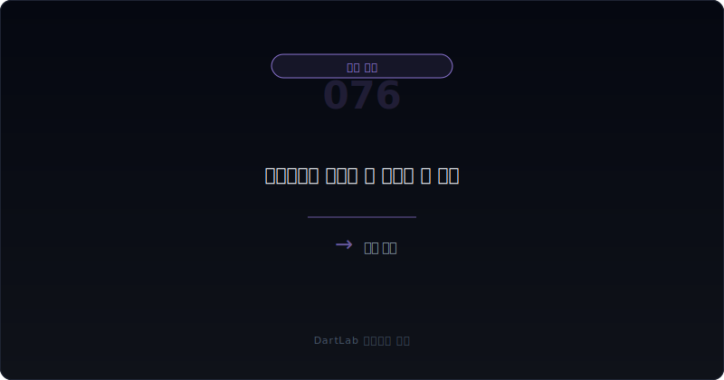
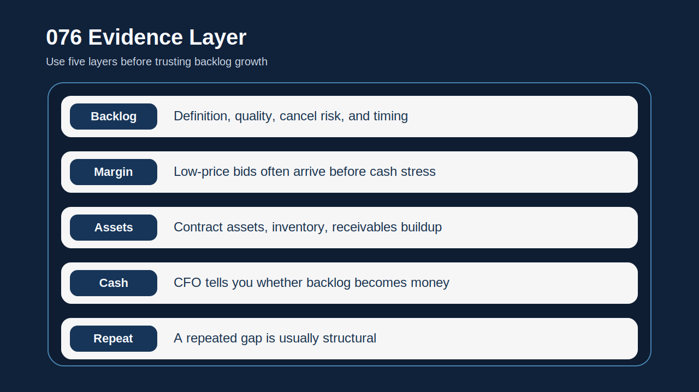
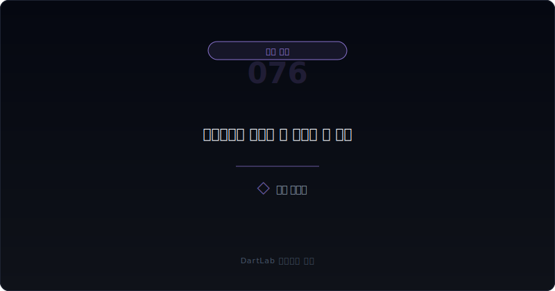
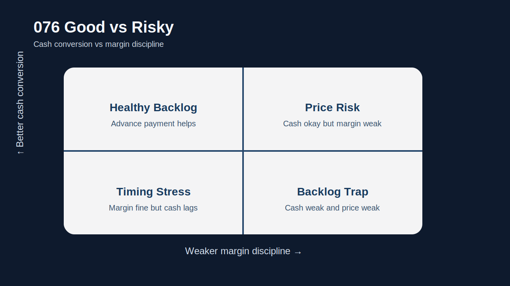

# 수주잔고는 늘는데 왜 현금은 안 남나

수주잔고가 늘면 많은 사람이 먼저 안도한다. `앞으로 일감이 있다`, `매출이 이어질 것이다`, `가동률이 버틸 수 있다`는 해석이 자연스럽기 때문이다. 물론 그럴 때도 있다. 하지만 실전에서는 수주잔고가 늘어도 현금이 안 남는 회사가 생각보다 많다. 이유는 단순하다. **수주잔고는 미래 매출의 가능성이지, 미래 현금의 보장이 아니기 때문**이다.

특히 제조와 건설형 회사에서는 수주잔고가 늘수록 오히려 재고와 미청구, 원가 부담, 선수금 구조, 저가수주 위험을 같이 봐야 한다. 가격을 깎아서 일감을 늘린 경우, 청구가 늦게 이뤄지는 경우, 원재료와 외주비가 먼저 나가는 경우에는 수주잔고가 커질수록 현금이 더 빠듯해질 수 있다.

그래서 이 주제는 `잔고가 많다`는 문장보다 `그 잔고가 어떤 가격과 어떤 회수 조건으로 쌓였는가`를 먼저 읽는 편이 맞다. 수주가 늘었다는 사실만 보고 안심하면 가장 중요한 질문을 놓친다. 바로 `회사가 잔고를 돈으로 바꾸는 속도`다.

이 글은 수주잔고와 현금의 괴리를 `잔고 정의 확인 -> 가격과 마진 구조 점검 -> 계약자산·재고·미청구 확인 -> 영업현금흐름과 연결 -> 다음 분기 되돌림 추적` 순서로 읽는 방법을 정리한다. 기본 토대는 [재고평가손실과 저가수주 압박은 어떻게 이어지나](/blog/inventory-write-downs-and-low-price-bidding), 수익 인식은 [매출 인식 시점 변경은 어디가 신호인가](/blog/revenue-recognition-timing-signals), 현금 검증은 [영업현금흐름이 순이익을 부정할 때](/blog/operating-cash-flow-vs-net-income), 공급망 압박은 [공급망금융은 영업현금흐름을 어떻게 좋게 보이게 하나](/blog/supply-chain-finance-and-payables)와 같이 보면 좋다.

---

## 왜 수주잔고가 곧 현금이 아니라고 봐야 하나

수주잔고는 계약이 남아 있다는 뜻이지, 그 계약이 높은 마진과 좋은 회수 조건을 가진다는 뜻은 아니다. 가격이 너무 낮거나, 원가가 먼저 나가고 청구가 늦거나, 발주처와의 정산이 늘어지면 잔고가 커질수록 현금은 오히려 더 묶일 수 있다.

건설형 회사에서는 미청구공사와 계약자산이 문제를 숨기기 쉽다. 제조형 회사에서는 재고와 외상매출금, 선수금 구조가 비슷한 역할을 한다. 숫자만 다를 뿐 핵심은 같다. 회사가 `일감`을 `현금`으로 바꾸는 중간 단계가 길어지면, 수주잔고는 좋은 뉴스보다 부담의 예고편이 될 수 있다.

그래서 이 영역은 backlog를 긍정적으로 읽기 전에 반드시 `청구 시점`, `마진`, `운전자본 압박`을 같이 붙여 봐야 한다. 수주잔고가 늘었다는 문장만 보고 끝내면 회사가 어떤 조건으로 버티고 있는지 거의 보이지 않는다.

---

## 같은 항목인데 해석이 갈리는 이유

| 먼저 볼 항목 | 왜 중요한가 |
| --- | --- |
| 수주잔고 정의 | 취소 가능 물량인지, 확정 계약인지 본다 |
| 평균 마진 | 가격을 지키는 잔고인지 확인한다 |
| 계약자산·미청구 | 매출은 잡혔는데 돈은 못 받는 구간이 늘어나는지 본다 |
| 재고와 원가 | 납품 전 자금 부담이 커지는지 본다 |
| 선수금·계약부채 | 고객이 먼저 돈을 주는 구조인지 확인한다 |
| 영업현금흐름 | 잔고 증가가 실제 현금 개선으로 이어지는지 본다 |

실전에서는 먼저 잔고의 질을 물어야 한다. 취소나 조건 변경 가능성이 큰 잔고와, 이미 대금 회수 구조가 정리된 잔고는 무게가 다르다. 그다음에는 평균 마진을 본다. 잔고가 늘었는데 매출총이익률이나 영업이익률이 같이 약해지면 가격을 깎아 일감을 받은 것일 수 있다.

또 하나 중요한 것은 계약자산과 미청구다. 매출은 잡히는데 청구와 회수가 늦어지는 구조면 backlog는 좋아 보여도 현금은 안 남는다. 이 부분은 [선수금·계약부채는 좋은 신호인가 위험 신호인가](/blog/advance-payments-and-contract-liabilities), [매출채권과 대손충당금은 어떻게 봐야 하나](/blog/receivables-and-allowance)와 같이 보면 훨씬 잘 보인다.

재고와 원가도 같이 봐야 한다. 잔고를 소화하려고 재고가 늘고 원재료 선투입이 커졌는데, 정작 선수금은 없고 현금 회수도 느리면 회사는 수주잔고를 돈으로 바꾸기 전에 먼저 자기 현금을 태우고 있을 가능성이 높다.

---

## 건강한 구조 vs 위험한 구조

가장 실용적인 질문은 이것이다. `이번 수주잔고 증가는 건강한 확장인가, 현금 묶임이 커지는 성장인가, 아니면 저가수주 압박의 시작인가`.

건강한 확장이라면 잔고 증가와 함께 선수금, 회수 속도, 마진 방어, 영업현금흐름 개선이 어느 정도 같이 보인다. 현금 묶임 성장이라면 잔고는 늘지만 계약자산, 재고, 매출채권이 더 빨리 커진다. 저가수주 압박이라면 잔고가 늘어도 마진이 무너지고 평가손실이나 충당부채가 뒤늦게 붙기 시작한다.

이 구분이 중요한 이유는 headline과 실제 체력이 자주 반대로 움직이기 때문이다. 잔고가 늘었다는 한 문장만 보면 좋아 보이지만, 현금과 마진을 붙이면 오히려 더 불안해질 수 있다.

특히 건설형 회사에서 `수주잔고 증가 + 미청구 증가 + 영업현금흐름 약세` 조합은 굉장히 무겁다. 제조형 회사에선 `수주잔고 증가 + 재고 증가 + 매출총이익률 하락`이 비슷한 의미를 가진다.

---

## 업종과 맥락에 따라 달라지는 기준

| 관찰 포인트 | 상대적으로 건강한 경우 | 더 조심해야 하는 경우 |
| --- | --- | --- |
| 잔고 증가 | 회수 구조와 함께 좋아진다 | 잔고만 늘고 회수 구조는 악화된다 |
| 마진 | 총이익률과 영업이익률이 버틴다 | 가격 인하로 마진이 먼저 무너진다 |
| 계약자산·미청구 | 제한적으로 관리된다 | 매출보다 더 빨리 늘어난다 |
| 재고 | 생산 계획 범위 안에서 움직인다 | 재고 부담이 먼저 커진다 |
| 영업현금흐름 | 잔고 증가가 현금 개선으로 이어진다 | 잔고 증가에도 현금이 계속 약하다 |

상대적으로 건강한 경우는 backlog와 cash conversion이 함께 움직인다. 반대로 더 조심해야 하는 경우는 backlog는 늘지만 현금과 마진이 따라오지 않는다. 이 차이가 투자 판단을 거의 다 바꾼다.

특히 [판관비가 매출보다 빨리 불어날 때 무엇을 먼저 봐야 하나](/blog/sga-growth-vs-sales), [재고자산과 평가손실 읽는 법](/blog/inventory-and-write-downs), [영업현금흐름이 순이익을 부정할 때](/blog/operating-cash-flow-vs-net-income)와 겹치면 해석은 더 무거워진다. 잔고가 늘어도 조직과 생산 구조, 판매 조건, 회수 구조가 동시에 나빠지고 있을 수 있기 때문이다.

---

## 왜 매출보다 계약자산과 현금을 먼저 봐야 할 때가 많나

수주잔고가 실적 기대를 만드는 건 맞다. 하지만 투자자가 실전에서 더 자주 맞닥뜨리는 문제는 `매출은 잡혔는데 왜 돈이 안 들어오나`다. 이때 가장 먼저 봐야 하는 것이 계약자산, 미청구, 재고, 그리고 영업현금흐름이다.

매출은 회계 기준에 따라 인식될 수 있지만, 현금은 계약 상대방이 실제로 돈을 줄 때만 들어온다. 그래서 수주잔고가 늘고 매출도 늘었는데 계약자산과 재고가 더 빨리 늘고 영업현금흐름이 약하면, 성장은 있어도 cash conversion은 나빠지고 있는 것이다.

이 구조는 초반엔 잘 안 보인다. 하지만 몇 분기 누적되면 평가손실, 충당부채, 공급망금융, 단기차입 증가 같은 형태로 뒤늦게 튀어나온다. 그래서 backlog 이야기가 커질수록 오히려 cash conversion 질문을 더 세게 붙여야 한다.

실전 메모로는 `잔고`, `마진`, `현금`, `계약자산`, `재고` 다섯 줄이면 충분하다. 이 다섯 줄이 있으면 잔고 증가를 훨씬 덜 낙관적으로 읽게 된다.

---

## 실전에서 가장 빨리 구분되는 조합은 무엇인가

이 주제에서 가장 빨리 위험해지는 조합은 `수주잔고 증가 + 계약자산·미청구 증가 + 영업현금흐름 약세`다. 이 셋이 같이 보이면 backlog가 cash conversion을 따라가지 못하고 있을 가능성이 높다. 거기에 `매출총이익률 하락`까지 붙으면 저가수주나 원가 부담 가능성을 더 강하게 봐야 한다.

반대로 `수주잔고 증가 + 선수금·계약부채 유지 + 영업현금흐름 개선` 조합이 보이면 상대적으로 건강한 구조일 수 있다. 즉, 같은 잔고 증가라도 돈을 누가 먼저 내는지, 회사가 얼마나 오래 자기 현금을 묶어야 하는지가 핵심이다.

또 자주 나오는 조합이 `잔고 증가 + 팩토링·유동화 활용 증가`다. 이 경우 backlog는 늘지만 회수 구조가 이미 버거워졌을 수 있다. 이런 패턴은 [매출채권 팩토링과 유동화는 현금흐름을 어떻게 좋게 보이게 하나](/blog/receivables-factoring-and-securitization), [공급망금융은 영업현금흐름을 어떻게 좋게 보이게 하나](/blog/supply-chain-finance-and-payables)까지 같이 봐야 잘 보인다.

반대로 정말 건강한 조합은 생각보다 단순하다. `수주잔고 증가 + 선수금 유지 또는 확대 + 재고와 계약자산 안정 + 영업현금흐름 개선`이다. 이 네 줄이 같이 움직이면 회사가 잔고를 무리 없이 돈으로 바꾸고 있을 가능성이 높다. 결국 backlog를 믿는다는 말은 숫자 하나를 믿는 것이 아니라, 그 숫자가 현금으로 바뀌는 과정까지 믿는다는 뜻이어야 한다.

---

## 다음 분기 비교에서 다시 확인할 것

| 이번에 본 것 | 다음에 다시 볼 것 |
| --- | --- |
| 수주잔고 증가 | 실제 매출과 현금으로 전환되는가 |
| 계약자산·미청구 | 더 빠르게 커지는가 줄어드는가 |
| 재고 | 생산 준비 범위인지 부담 누적인지 확인한다 |
| 마진 | 저가수주 흔적이 더 강해지는가 |
| 영업현금흐름 | backlog 증가가 현금 개선으로 이어지는가 |
| 자금조달 | 차입, 팩토링, 공급망금융 의존이 커지는가 |

수주잔고와 현금의 괴리는 한 분기만 보고 결론 내리기 어렵다. 다음 보고서에서 계약자산과 재고가 어떻게 움직였는지, 마진이 회복되는지, 영업현금흐름이 좋아지는지 봐야 의미가 드러난다. 그래서 가능하면 `잔고`, `마진`, `계약자산`, `재고`, `현금` 다섯 줄을 적어 두는 편이 좋다.

같은 패턴이 두세 번 반복되면 해석이 달라진다. 그때부터는 일시적 timing issue보다 구조적 cash conversion 문제로 읽는 편이 맞다.

---

## 비교 체크리스트

- 수주잔고의 정의와 취소 가능성을 확인했는가
- 잔고 증가와 마진 방어가 같이 보이는지 확인했는가
- 계약자산·미청구와 재고가 더 빨리 늘고 있는지 봤는가
- 선수금·계약부채가 buffer 역할을 하는지 확인했는가
- 영업현금흐름이 backlog 증가를 뒷받침하는지 봤는가
- 팩토링·공급망금융 같은 보조 수단 의존이 커지는지 추적할 계획이 있는가

## FAQ

### 수주잔고가 늘면 무조건 좋은가

아니다. 가격과 회수 조건이 나쁘면 현금은 오히려 더 빠듯해질 수 있다.

### 무엇이 가장 먼저 중요한가

수주잔고 증가가 마진과 영업현금흐름 개선으로 이어지는지다.

### 제조와 건설에서 보는 포인트가 다른가

표현은 다르지만 본질은 같다. 재고·매출채권·계약자산처럼 돈이 묶이는 중간 단계가 핵심이다.

### 무엇을 같이 보면 좋은가

재고, 계약자산, 선수금, 영업현금흐름, 공급망금융을 같이 보면 좋다.

## 함께 비교하면 좋은 글

- [재고평가손실과 저가수주 압박은 어떻게 이어지나](/blog/inventory-write-downs-and-low-price-bidding)
- [재고자산과 평가손실 읽는 법](/blog/inventory-and-write-downs)
- [매출 인식 시점 변경은 어디가 신호인가](/blog/revenue-recognition-timing-signals)
- [영업현금흐름이 순이익을 부정할 때](/blog/operating-cash-flow-vs-net-income)
- [선수금·계약부채는 좋은 신호인가 위험 신호인가](/blog/advance-payments-and-contract-liabilities)
- [매출채권과 대손충당금은 어떻게 봐야 하나](/blog/receivables-and-allowance)
- [공급망금융은 영업현금흐름을 어떻게 좋게 보이게 하나](/blog/supply-chain-finance-and-payables)

## 출처

- [IFRS 15 Revenue from Contracts with Customers](https://www.ifrs.org/issued-standards/list-of-standards/ifrs-15-revenue-from-contracts-with-customers/)
- [IAS 2 Inventories](https://www.ifrs.org/issued-standards/list-of-standards/ias-2-inventories/)
- [IAS 7 Statement of Cash Flows](https://www.ifrs.org/issued-standards/list-of-standards/ias-7-statement-of-cash-flows/)
- [IAS 37 Provisions, Contingent Liabilities and Contingent Assets](https://www.ifrs.org/issued-standards/list-of-standards/ias-37-provisions-contingent-liabilities-and-contingent-assets/)
- [DART 소개 - 보고서정보](https://dart.fss.or.kr/introduction/content2.do)
- [OpenDART XBRL 주석](https://opendart.fss.or.kr/disclosureinfo/fnltt/xbrlnote/main.do)

## 한 줄 정리

수주잔고는 미래 매출의 가능성을 보여줄 수는 있어도 미래 현금을 보장하지는 않는다. 그래서 잔고 증가를 볼 때는 반드시 마진, 계약자산·미청구, 재고, 선수금, 영업현금흐름을 같이 붙여 봐야 한다.

핵심은 `얼마나 많이 수주했나`보다 `얼마나 빨리 돈으로 바꾸나`를 먼저 묻는 것이다. 이 질문을 붙이면 backlog를 훨씬 덜 순진하게 읽게 된다.
