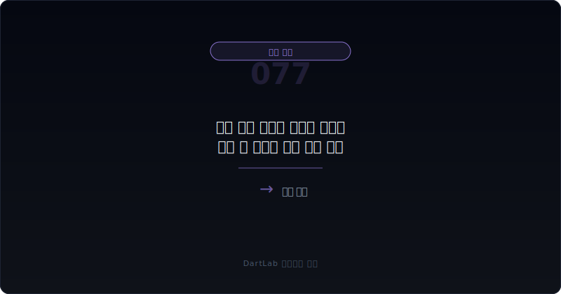
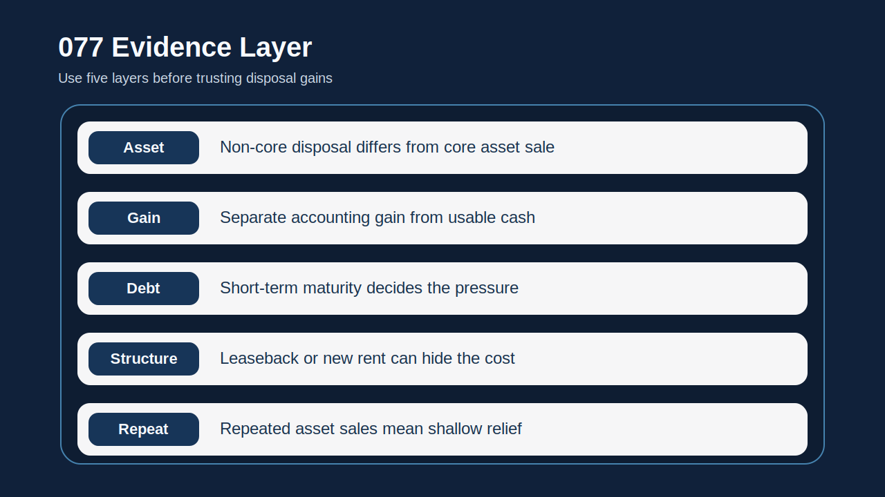
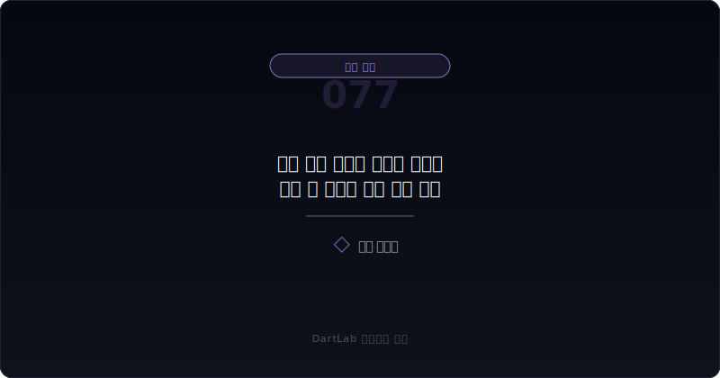
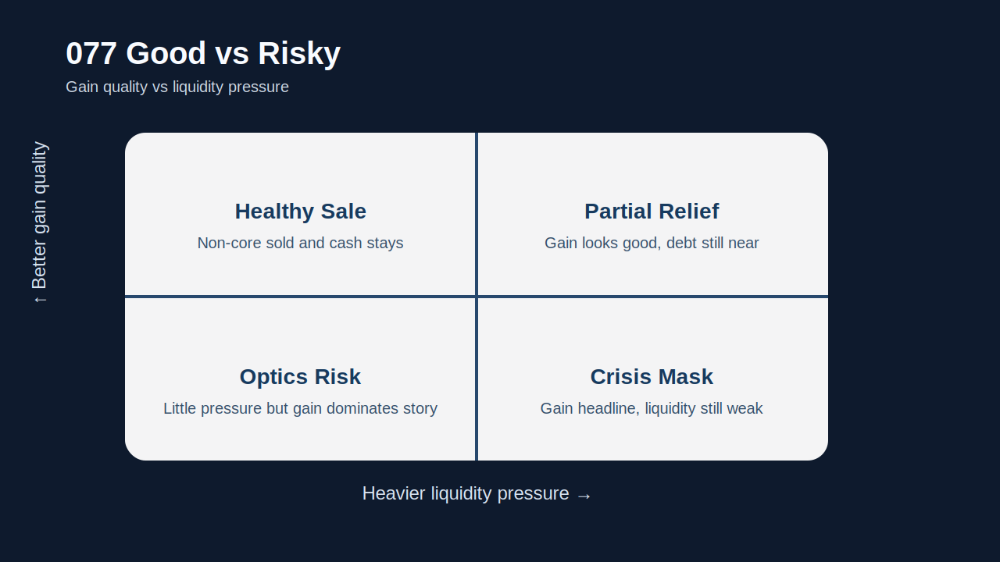
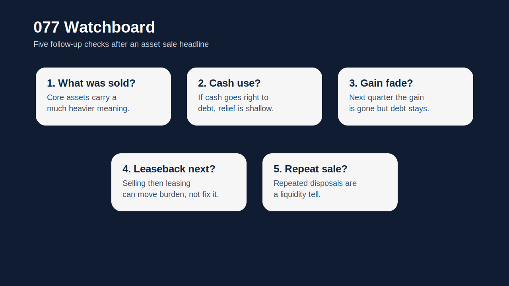

# 자산 매각 이익이 유동성 위기를 가릴 때 무엇을 먼저 봐야 하나

자산 매각 이익이 크게 잡히면 headline은 좋아 보인다. 순이익이 살아나고, 부채 부담이 낮아질 것처럼 보이며, `자산 효율화` 같은 말도 붙기 쉽다. 하지만 실전에서는 그보다 먼저 `왜 지금 그 자산을 팔았는가`를 물어야 한다. 자산 매각은 때로는 포트폴리오 정리일 수 있지만, 때로는 유동성 위기를 덮기 위해 시간을 사는 거래일 수도 있기 때문이다.

특히 자산 매각 이익은 본업과 무관한 이익을 손익계산서에 크게 보이게 만들 수 있다. 이때 투자자가 가장 자주 틀리는 지점은 `이익이 났으니 체력이 좋아졌다`고 읽는 것이다. 실제로는 이익은 늘었어도 영업현금흐름은 약하고, 차입 만기와 상환 압박은 그대로 남아 있을 수 있다.

그래서 이 주제는 단순한 일회성 손익 분리 문제가 아니다. `처분이익`, `현금 유입`, `차입 압박`, `후속 운영 구조`를 한 묶음으로 읽어야 진짜 의미가 드러난다. 자산을 판 뒤 다시 빌려 쓰는 구조인지, 비핵심 자산 정리인지, 채무 상환을 위한 급한 대응인지에 따라 해석은 완전히 달라진다.

이 글은 자산 매각 이익과 유동성 위기의 간극을 `무엇을 팔았는지 확인 -> 처분이익과 현금 유입 분리 -> 차입·만기 구조와 연결 -> 후속 운영 구조 확인 -> 다음 보고서에서 되돌림 추적` 순서로 읽는 방법을 정리한다. 기본 토대는 [매각예정자산과 중단영업은 무엇을 가리나](/blog/held-for-sale-and-discontinued-operations), 리스 재편은 [리스 개정과 세일앤리스백은 누구에게 유리한가](/blog/lease-modifications-and-sale-leaseback), 손익 분리는 [영업외손익이 본업을 가릴 때 무엇을 분리해서 봐야 하나](/blog/non-operating-income-vs-core-earnings), 부채 압박은 [리스부채와 차입 만기 구조는 어디서 먼저 터지나](/blog/lease-liabilities-and-debt-maturity)와 같이 보면 좋다.

---

## 왜 처분이익보다 현금 유입의 쓰임새가 더 중요한가

자산 매각 이익은 회계상 이익이다. 현금 유입은 실제 돈이다. 둘은 겹칠 수도 있지만 같지 않다. 자산을 팔아 이익이 나도, 그 돈이 곧바로 차입 상환과 운영자금 방어에 쓰이고 본업에서 새 현금이 안 들어오면 회사 체력은 생각보다 빨리 다시 약해질 수 있다.

이 점이 중요한 이유는 자산 매각 이익이 투자자의 시선을 매우 쉽게 빼앗기 때문이다. 영업이익은 약한데 순이익이 좋아지고, headline은 `자산 효율화`나 `구조 개선`으로 포장되기 쉽다. 하지만 그 뒤에서 현금은 단기채무를 막는 데 거의 다 쓰이고, 다음 분기엔 다시 자금조달 이슈가 등장할 수 있다.

그래서 자산 매각을 읽을 때는 늘 `얼마 벌었나`보다 `그 돈이 어디로 갔나`를 먼저 적는 편이 맞다. 이 한 줄이 없으면 처분이익은 거의 항상 실제보다 좋아 보인다.

---

## 같은 항목인데 해석이 갈리는 이유

| 먼저 볼 항목 | 왜 중요한가 |
| --- | --- |
| 매각 자산 종류 | 비핵심 자산인지, 본업 자산인지 구분한다 |
| 처분이익 | 손익 headline을 얼마나 바꾸는지 본다 |
| 현금 유입 | 실제 유동성 완충 규모를 확인한다 |
| 차입 상환·만기 | 들어온 현금이 어디로 바로 빠지는지 본다 |
| 후속 운영 구조 | 세일앤리스백, 임차, 외주 전환이 붙는지 본다 |
| 다음 분기 현금흐름 | 일회성 개선인지 구조 개선인지 확인한다 |

실전에서는 먼저 무엇을 팔았는지 적는 편이 좋다. 비핵심 부동산이나 투자자산을 판 것과, 생산 설비나 운영 핵심 자산을 판 것은 의미가 다르다. 후자가 더 무거운 이유는 오늘의 현금을 위해 내일의 운영 유연성을 줄였을 가능성이 있기 때문이다.

그다음에는 처분이익과 현금 유입을 분리해서 봐야 한다. 이익이 크게 잡혀도 실제 현금 유입이 제한적일 수 있고, 반대로 현금은 들어왔지만 그 대가로 새로운 리스료나 임차료 부담이 생길 수 있다. 이 부분은 [리스 개정과 세일앤리스백은 누구에게 유리한가](/blog/lease-modifications-and-sale-leaseback)와 붙이면 더 잘 보인다.

또 차입 만기 구조도 같이 봐야 한다. 자산 매각으로 현금이 들어왔는데, 바로 갚아야 할 단기차입과 약정 압박이 여전히 크다면 해석은 `구조 개선`보다 `시간 벌기`에 가깝다.

---

## 건강한 구조 vs 위험한 구조

가장 실용적인 질문은 이것이다. `이번 자산 매각은 포트폴리오 정리인가, 유동성 완충인가, 아니면 위기를 늦추는 거래인가`.

포트폴리오 정리라면 매각 자산이 비핵심이고, 매각 이후에도 본업 운영과 현금흐름이 안정적이다. 유동성 완충이라면 당장 숨통은 트이지만 들어온 현금의 대부분이 상환과 운영자금으로 바로 빠져나간다. 위기 지연 구조라면 본업 현금이 약한데 자산 매각, 세일앤리스백, 증자, 사채가 연속으로 붙는다.

이 구분이 중요한 이유는 같은 처분이익도 회사 상태에 따라 완전히 다른 의미를 갖기 때문이다. 안정적인 회사의 자산 정리는 효율화일 수 있지만, 현금이 부족한 회사의 자산 매각은 위기 대응일 수 있다.

특히 `매각예정자산`, `중단영업`, `세일앤리스백`, `영업외손익 확대`가 함께 보이면 숫자 headline보다 유동성 압박 구조를 먼저 읽는 편이 맞다.

---

## 업종과 맥락에 따라 달라지는 기준

| 관찰 포인트 | 상대적으로 건강한 경우 | 더 조심해야 하는 경우 |
| --- | --- | --- |
| 매각 자산 | 비핵심 자산 중심이다 | 운영 핵심 자산이 포함된다 |
| 처분이익 | 본업과 분리해도 해석이 안정적이다 | 처분이익이 headline을 거의 다 만든다 |
| 현금 사용처 | 재무 유연성 확대로 이어진다 | 단기차입 상환에 즉시 소진된다 |
| 후속 구조 | 운영 차질 없이 이어진다 | 세일앤리스백, 재임차, 추가 조달이 붙는다 |
| 반복성 | 일회성 정리로 끝난다 | 자산 매각이 반복된다 |

상대적으로 건강한 경우는 자산 매각이 본업의 약함을 가리기보다 자산 구조를 정리하는 데 가깝다. 반대로 더 조심해야 하는 경우는 처분이익이 순이익을 거의 다 만들고, 현금은 잠깐 들어왔지만 만기 압박과 운영 부담은 그대로 남아 있다.

특히 [리스부채와 차입 만기 구조는 어디서 먼저 터지나](/blog/lease-liabilities-and-debt-maturity), [차입 약정 위반과 기한이익상실 위험은 어디서 먼저 드러나나](/blog/debt-covenant-breach-and-acceleration-risk), [자본잠식과 관리종목 신호는 어디서 먼저 보이나](/blog/capital-impairment-and-watchlist-signals)와 겹치면 해석은 훨씬 더 무거워진다. 자산 매각이 해법이 아니라 버티기 수단일 수 있기 때문이다.

---

## 왜 순이익보다 영업현금흐름과 만기표를 같이 봐야 하나

자산 매각 이익은 순이익을 빠르게 좋아 보이게 한다. 하지만 회사를 지탱하는 것은 결국 반복 가능한 현금흐름이다. 본업에서 현금이 안 남는데 자산 처분으로만 숨통을 틔우고 있다면, 오늘의 좋은 숫자는 내일의 더 큰 압박을 숨길 수 있다.

그래서 자산 매각을 볼 때는 손익계산서보다 현금흐름표와 차입 만기표를 같이 봐야 한다. 처분이익이 얼마나 컸는지보다, 그 돈이 얼마나 빨리 빠져나갔는지, 이후에도 같은 회사가 스스로 현금을 만들 수 있는지가 더 중요하다.

또 매각 뒤에 외주화, 임차 전환, 가동률 저하, 추가 리스 부담이 붙는지도 봐야 한다. 이 부분이 빠지면 투자자는 `자산을 잘 팔았다`는 headline만 보고 운영 기반이 약해진 사실을 놓칠 수 있다.

실전 메모로는 `무엇을 팔았나`, `얼마 벌었나`, `얼마 들어왔나`, `어디에 썼나`, `다음에 또 팔아야 하나` 다섯 줄이 가장 유용하다.

---

## 실전에서 가장 빨리 구분되는 조합은 무엇인가

이 주제에서 가장 빨리 위험해지는 조합은 `처분이익 확대 + 영업현금흐름 약세 + 단기차입 만기 압박`이다. 이 셋이 같이 보이면 자산 매각은 구조 개선보다 유동성 방어일 가능성이 높다. 여기에 `세일앤리스백`이나 `추가 증자·사채`까지 붙으면 위기 지연 구조로 해석하는 편이 맞다.

반대로 `비핵심 자산 매각 + 본업 현금 유지 + 차입 만기 완화` 조합이면 상대적으로 건강한 자산 재편일 수 있다. 즉, 같은 매각이라도 매각 이후의 운영과 현금 구조가 훨씬 중요하다.

또 자주 나오는 조합이 `중단영업 이익 + 잔존 본업 둔화`다. 이 경우 headline 숫자는 좋아 보여도 남아 있는 사업의 체력은 더 약할 수 있다. 그래서 [매각예정자산과 중단영업은 무엇을 가리나](/blog/held-for-sale-and-discontinued-operations)와 반드시 붙여 봐야 한다.

---

## 다음 분기 비교에서 다시 확인할 것

| 이번에 본 것 | 다음에 다시 볼 것 |
| --- | --- |
| 처분이익 | 다음 분기엔 사라진 뒤 본업이 버티는가 |
| 현금 유입 | 실제 만기 압박이 줄었는가 |
| 차입 구조 | 단기차입과 약정 위험이 완화됐는가 |
| 운영 구조 | 세일앤리스백, 임차 부담이 커졌는가 |
| 추가 조달 | 또 다른 자산 매각, 증자, 사채가 붙는가 |
| 반복성 | 자산 매각이 상시 수단이 되는가 |

자산 매각 이익은 다음 보고서에서 더 정확하게 읽힌다. 이익이 빠진 뒤에도 본업이 버티는지, 현금 압박이 실제로 완화됐는지, 같은 회사가 또 다른 자산을 팔아야 하는지 확인해야 의미가 드러난다. 그래서 가능하면 `처분이익`, `현금 사용처`, `만기표`, `리스 구조`, `추가 조달` 다섯 줄을 적어 두는 편이 좋다.

같은 패턴이 반복되면 해석은 빠르게 무거워진다. 그때부터는 자산 효율화보다 구조적 유동성 약점으로 읽는 편이 맞다.

---

## 비교 체크리스트

- 무엇을 팔았는지와 그 자산이 본업에 얼마나 중요한지 적었는가
- 처분이익과 현금 유입을 분리해서 봤는가
- 들어온 현금이 어디로 바로 빠져나가는지 확인했는가
- 차입 만기와 약정 압박이 실제로 줄었는지 봤는가
- 세일앤리스백이나 후속 임차 구조가 붙는지 확인했는가
- 다음 분기에도 자산 매각이 반복되는지 추적할 계획이 있는가

## FAQ

### 자산 매각 이익이 크면 좋은 신호인가

항상 그렇지 않다. 본업과 분리해서 보고 현금 사용처를 꼭 확인해야 한다.

### 무엇이 가장 먼저 중요한가

무엇을 팔았는지와 그 돈이 어디로 가는지다.

### 세일앤리스백이 붙으면 왜 더 조심해야 하나

현금은 들어오지만 미래 지급 의무가 다시 생길 수 있기 때문이다.

### 무엇을 같이 보면 좋은가

영업현금흐름, 차입 만기, 중단영업, 영업외손익을 같이 보면 좋다.

## 함께 비교하면 좋은 글

- [매각예정자산과 중단영업은 무엇을 가리나](/blog/held-for-sale-and-discontinued-operations)
- [리스 개정과 세일앤리스백은 누구에게 유리한가](/blog/lease-modifications-and-sale-leaseback)
- [영업외손익이 본업을 가릴 때 무엇을 분리해서 봐야 하나](/blog/non-operating-income-vs-core-earnings)
- [리스부채와 차입 만기 구조는 어디서 먼저 터지나](/blog/lease-liabilities-and-debt-maturity)
- [영업현금흐름이 순이익을 부정할 때](/blog/operating-cash-flow-vs-net-income)
- [차입 약정 위반과 기한이익상실 위험은 어디서 먼저 드러나나](/blog/debt-covenant-breach-and-acceleration-risk)
- [자본잠식과 관리종목 신호는 어디서 먼저 보이나](/blog/capital-impairment-and-watchlist-signals)

## 출처

- [IFRS 5 Non-current Assets Held for Sale and Discontinued Operations](https://www.ifrs.org/issued-standards/list-of-standards/ifrs-5-non-current-assets-held-for-sale-and-discontinued-operations/)
- [IAS 7 Statement of Cash Flows](https://www.ifrs.org/issued-standards/list-of-standards/ias-7-statement-of-cash-flows/)
- [IFRS 16 Leases](https://www.ifrs.org/issued-standards/list-of-standards/ifrs-16-leases/)
- [IAS 1 Presentation of Financial Statements](https://www.ifrs.org/issued-standards/list-of-standards/ias-1-presentation-of-financial-statements.html/)
- [DART 소개 - 보고서정보](https://dart.fss.or.kr/introduction/content2.do)
- [OpenDART XBRL 주석](https://opendart.fss.or.kr/disclosureinfo/fnltt/xbrlnote/main.do)

## 한 줄 정리

자산 매각 이익은 순이익을 좋아 보이게 만들 수 있지만, 그 자체로 유동성 위기가 해결됐다는 뜻은 아니다. 그래서 무엇을 팔았는지, 얼마가 들어왔는지, 그 돈이 어디로 갔는지, 이후 운영 구조가 어떻게 바뀌는지를 같이 봐야 한다.

핵심은 `얼마 벌었나`보다 `얼마나 더 버틸 수 있게 됐나`를 먼저 묻는 것이다. 이 질문을 붙이면 자산 매각 headline을 훨씬 덜 순진하게 읽게 된다.
