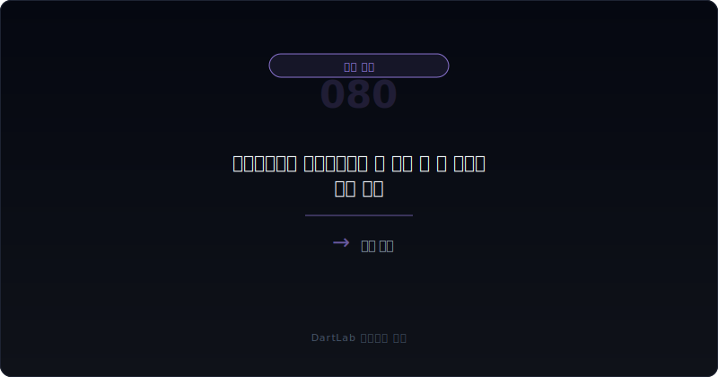
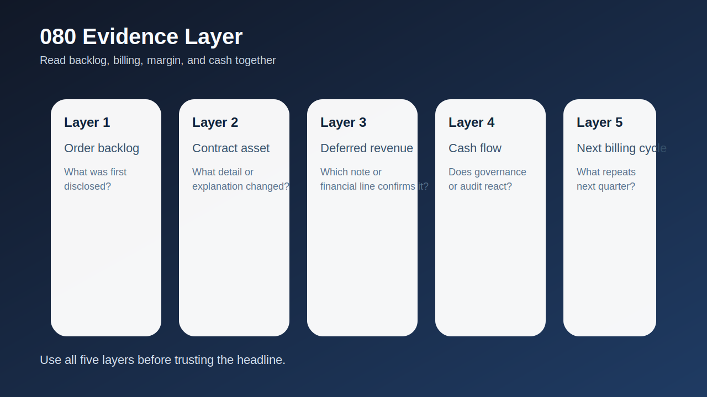
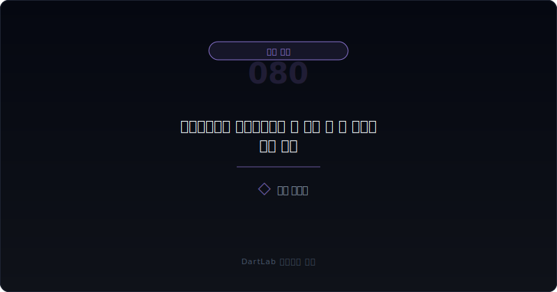
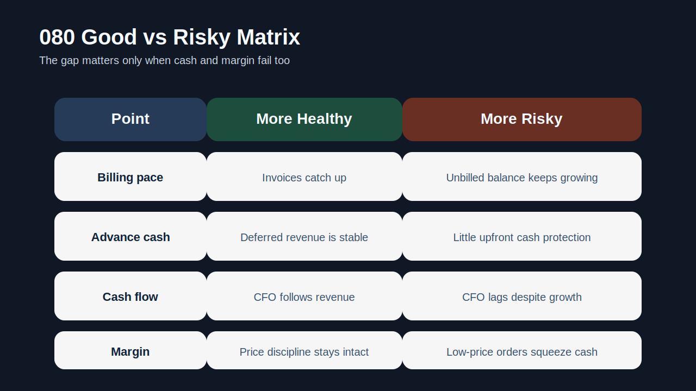
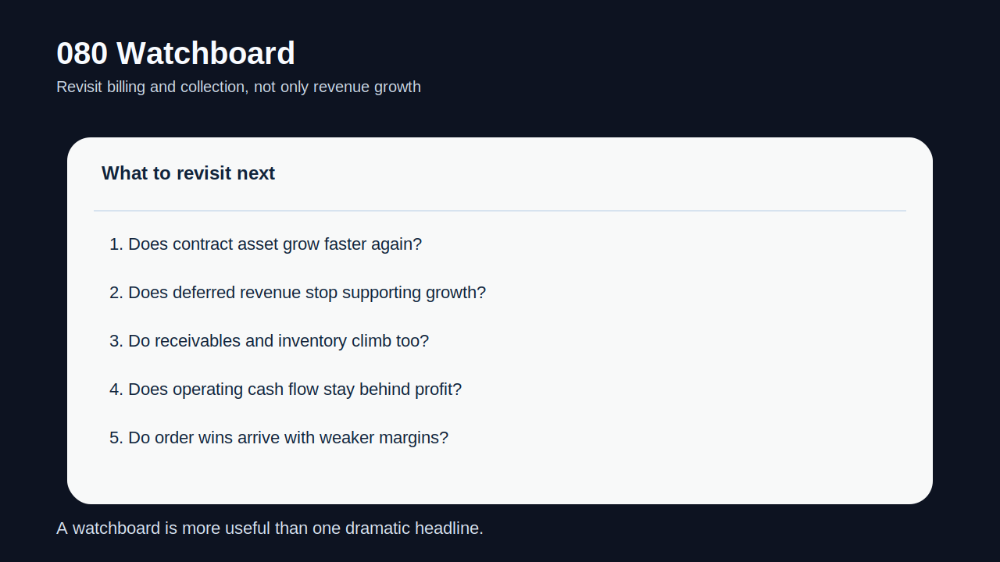

# 선수수익보다 미청구공사가 더 빨리 늘 때 무엇을 봐야 하나

건설형 회사나 프로젝트형 회사에서 가장 자주 나오는 착시는 `매출은 잘 잡히는데 현금은 왜 안 남는가`다. 이때 빠르게 볼 항목이 미청구공사, 계약자산, 선수수익, 계약부채다. **미청구공사나 계약자산이 선수수익보다 더 빨리 늘면, 회사가 매출을 먼저 잡고 현금은 나중에 받는 구조가 강해지고 있을 가능성**이 있다.

이 자체가 무조건 나쁜 것은 아니다. 프로젝트 초반에는 청구 시점과 공정률 사이에 시간차가 생길 수 있고, 일부 산업은 원래 선청구보다 후청구가 많다. 다만 이 흐름이 길어지고, 여기에 `낮아지는 마진`, `느린 영업현금흐름`, `늘어나는 재고·매출채권`이 같이 붙으면 해석이 급격히 무거워진다. 그때부터는 성장의 문제가 아니라 회수 구조와 가격 질의 문제가 된다.

그래서 이 글은 [수주잔고는 늘는데 왜 현금은 안 남나](/blog/order-backlog-vs-cash-flow), [매출 인식 시점 변경은 어디가 신호인가](/blog/revenue-recognition-timing-signals), [선수금·계약부채는 좋은 신호인가 위험 신호인가](/blog/advance-payments-and-contract-liabilities), [영업현금흐름이 순이익을 부정할 때](/blog/operating-cash-flow-vs-net-income)의 다음 단계다. 여기서는 `미청구공사가 빨리 커질 때 무엇을 먼저 의심하고, 무엇과 붙여서 검증해야 하는지`를 더 직접적으로 정리한다.

이 글은 미청구공사·계약자산과 선수수익·계약부채를 `잔고 확인 -> 청구 구조 확인 -> 마진과 가격 검증 -> 영업현금흐름 대조 -> 반복 패턴 추적` 순서로 읽는 방법을 정리한다.

---

## 왜 미청구공사가 선수수익보다 빨리 늘면 경계해야 하나

선수수익이나 계약부채는 고객이 먼저 돈을 준 상태다. 회사 입장에서는 현금이 앞서 들어온다. 반면 미청구공사나 계약자산은 회사가 먼저 일을 했고, 회계상 수익도 일부 잡았지만 아직 청구하거나 받지 못한 금액이다. 즉, 현금보다 회계가 앞서간 상태다.

그래서 두 항목의 상대 속도가 중요하다. 계약부채가 함께 늘면 `돈이 먼저 들어오는 성장`일 수 있지만, 계약자산만 빠르게 커지면 `매출은 앞서가고 현금은 뒤처지는 성장`일 수 있다. 이때는 성장보다 회수 구조를 먼저 의심해야 한다.

문제는 이 격차가 단독으로 끝나지 않는다는 점이다. 미청구공사가 커질 때 종종 같이 보이는 것이 매출채권 증가, 재고 증가, 저가수주, 영업현금흐름 둔화다. 즉, 숫자 하나의 문제가 아니라 회사 전반의 현금 전환 능력이 약해지는 흐름일 수 있다.

---

## 같은 항목인데 해석이 갈리는 이유

| 먼저 볼 항목 | 왜 중요한가 |
| --- | --- |
| 미청구공사·계약자산 | 매출이 먼저 잡힌 규모를 보여준다 |
| 선수수익·계약부채 | 현금이 먼저 들어온 방어막이 있는지 보여준다 |
| 수주잔고 | 앞으로 일감이 많은지보다 계약 구조가 어떤지 가늠한다 |
| 마진 | 낮은 가격으로 수주했는지 확인한다 |
| 영업현금흐름 | 회계상 진전이 실제 현금으로 이어지는지 본다 |
| 매출채권·재고 | 운전자본 부담이 함께 커지는지 본다 |

실전에서는 먼저 미청구공사와 선수수익을 절대 금액보다 `증가 속도`로 본다. 둘 다 늘 수는 있지만, 미청구공사가 더 빠르게 커지면 `회사가 고객보다 먼저 자금을 쓰고 있는 구조`일 수 있다. 그다음엔 수주잔고와 마진을 붙인다. 수주잔고가 늘어도 마진이 낮아지고 있다면 `싼 가격으로 일감을 확보했지만 현금이 뒤따르지 않는 구조`일 수 있다.

여기서 영업현금흐름이 가장 중요하다. 회사는 공정률이 올라가면 매출 인식상 좋아 보일 수 있다. 하지만 현금이 받쳐주지 않으면 결국 추가 차입이나 외부 조달에 의존하게 된다. 이 부분은 [매출채권 팩토링과 유동화는 무엇을 숨기나](/blog/receivables-factoring-and-securitization), [공급망금융은 영업현금흐름을 어떻게 왜곡하나](/blog/supply-chain-finance-and-payables)와도 붙여 봐야 한다.

---

## 건강한 구조 vs 위험한 구조

가장 실용적인 질문은 `이번 성장은 현금이 따라오는 성장인가, 아니면 청구와 회수가 밀리는 성장인가`다.

건강한 성장이라면 계약자산이 늘어도 계약부채나 현금유입이 일정 부분 함께 움직인다. 청구가 조금 늦더라도 다음 분기에는 따라잡히고, 마진도 크게 무너지지 않는다. 이런 경우에는 공정률과 청구 사이의 시간차로 볼 수 있다.

경계 구간은 계약자산이 늘지만 그 이유가 비교적 명확하고 일시적일 때다. 예를 들어 특정 대형 프로젝트의 청구 일정이 한 분기 밀린 것이라면 다음 분기를 꼭 확인하면 된다.

현금 스트레스 구간은 계약자산이 빠르게 커지는데 선수수익이 따라오지 않고, 영업현금흐름도 약하고, 마진이나 가격 질도 낮아질 때다. 이 조합이면 회계상 진전이 실제 현금 창출보다 앞서가고 있다는 뜻일 수 있다.

---

## 업종과 맥락에 따라 달라지는 기준

| 관찰 포인트 | 상대적으로 건강한 경우 | 더 조심해야 하는 경우 |
| --- | --- | --- |
| 청구 속도 | 다음 분기에 청구가 따라온다 | 미청구 잔고가 계속 쌓인다 |
| 선수수익 | 계약부채가 방어막 역할을 한다 | 선수수익이 약하거나 줄어든다 |
| 영업현금흐름 | 매출 증가와 함께 따라온다 | 이익은 늘지만 현금은 뒤처진다 |
| 마진 | 가격 질이 크게 무너지지 않는다 | 낮은 가격 수주가 드러난다 |
| 운전자본 | 채권·재고 부담이 제한적이다 | 채권·재고까지 같이 불어난다 |

건강한 경우는 미청구공사가 있더라도 결국 `청구 -> 회수 -> 현금`으로 이어진다. 즉, 시간차는 있어도 현금이 뒤따른다. 반대로 더 조심해야 하는 경우는 미청구공사가 커질수록 회수 구조가 나빠진다. 이때는 외형 성장보다 자금 압박이 먼저 온다.

특히 [재고평가손실과 저가수주 압박은 어떻게 이어지나](/blog/inventory-write-downs-and-low-price-bidding), [수주잔고는 늘는데 왜 현금은 안 남나](/blog/order-backlog-vs-cash-flow), [영업현금흐름이 순이익을 부정할 때](/blog/operating-cash-flow-vs-net-income)를 같이 보면 더 좋다. 미청구공사만 따로 읽으면 회계적 시간차처럼 보일 수 있지만, 다른 운전자본 지표와 붙이면 구조가 보인다.

---

## 왜 backlog가 늘어도 안심할 수 없는가

수주잔고 증가는 보통 좋은 뉴스처럼 보인다. 하지만 backlog는 `약속된 일감`이지 `들어온 현금`이 아니다. 프로젝트형 산업에서는 backlog가 늘어도 청구 구조가 나쁘고, 고객이 대금을 늦게 지급하고, 회사가 낮은 가격으로 수주했다면 그 backlog는 현금 압박으로 돌아올 수 있다.

그래서 backlog를 볼 때는 항상 `얼마나 남았나`보다 `어떤 조건으로 남았나`를 묻는 편이 낫다. 계약자산이 빠르게 늘고 계약부채가 약하면, 회사가 고객보다 먼저 운영자금을 떠안고 있을 수 있다. 이때 외형 성장은 오히려 자금 수요를 키운다.

또 이 구조는 분기 한 번으로 끝나지 않는다. 청구가 뒤처진 분기가 여러 번 반복되면 회사는 추가 차입, 팩토링, 공급망금융 같은 보조 수단에 의존할 가능성이 높아진다. 그 시점부터는 이익보다 자금 조달 구조를 먼저 읽어야 한다.

---

## 왜 계약부채가 방어막인지 같이 봐야 하나

계약부채나 선수수익은 단순히 회계 항목 하나가 아니다. 프로젝트형 회사에서는 `고객이 먼저 일부 자금을 넣어준 상태`라는 의미가 있기 때문에, 회사 입장에서는 운영자금 부담을 크게 줄여준다. 그래서 계약자산만 빠르게 늘고 계약부채가 약해지면, 회사가 성장할수록 오히려 자기 돈을 더 먼저 투입해야 하는 구조일 수 있다.

이 차이는 위기 국면에서 더 크게 드러난다. 수주가 늘어도 계약부채가 받쳐주면 회사는 현금 압박을 덜 받는다. 하지만 계약자산이 앞서가고 계약부채가 따라오지 않으면, 조금만 마진이 흔들려도 현금 부족이 바로 커질 수 있다. 그래서 투자자는 `계약자산 증가`를 볼 때 항상 `그 반대편에 선수금 방어막이 있는가`를 같이 확인해야 한다.

---

## 왜 다음 분기 되돌림을 꼭 확인해야 하나

미청구공사와 계약자산은 한 분기만 보면 쉽게 오해할 수 있다. 어떤 회사는 특정 프로젝트의 검수나 청구 일정 때문에 한 분기 동안만 계약자산이 튈 수 있다. 그래서 진짜 중요한 것은 `다음 분기에 다시 내려오는가`다. 다음 분기 청구가 따라오고, 선수수익과 영업현금흐름이 회복되면 그전 분기의 급증은 시간차로 해석할 수 있다.

반대로 다음 분기에도 계약자산이 더 늘고, 계약부채는 약하고, 현금은 여전히 안 따라오면 그때는 구조 문제로 보는 편이 맞다. 즉, 이 주제는 단면보다 흐름이 중요하다. 투자자는 한 번의 높은 잔고보다 `되돌림이 있는지`, `청구가 회복되는지`, `현금이 결국 들어오는지`를 확인해야 한다.

---

## 실전에서 가장 빨리 구분되는 조합은 무엇인가

가장 빨리 위험해지는 조합은 `계약자산 급증 + 계약부채 정체 + 영업현금흐름 둔화`다. 여기에 `낮아지는 마진`과 `늘어나는 매출채권`이 붙으면 해석은 훨씬 무거워진다. 이때는 매출 인식의 기술적 문제가 아니라 자금 회수 구조와 가격 질 문제가 같이 나타나고 있을 가능성이 크다.

반대로 상대적으로 건강한 조합은 `계약자산 증가 + 계약부채 유지 + 다음 분기 청구 회복 + CFO 동행`이다. 이런 경우에는 프로젝트 특성상 생기는 시간차로 볼 수 있다.

실전 메모로는 다섯 줄이면 충분하다. `계약자산`, `계약부채`, `CFO`, `마진`, `채권·재고`. 이 다섯 줄을 같은 방향으로 보면 현금이 따라오는 성장인지 아닌지를 빠르게 가를 수 있다.

---

## 다음 분기 비교에서 다시 확인할 것

| 이번에 본 것 | 다음에 다시 볼 것 |
| --- | --- |
| 계약자산 증가 | 다음 분기 청구가 따라오는가 |
| 계약부채 약화 | 선수금 방어막이 더 약해지는가 |
| 영업현금흐름 둔화 | 매출보다 현금이 계속 뒤처지는가 |
| 마진 하락 | 저가수주 흔적이 더 커지는가 |
| 운전자본 부담 | 채권·재고까지 같이 늘어나는가 |
| 자금조달 | 팩토링·공급망금융 의존이 커지는가 |

이 주제의 핵심은 미청구공사 자체가 아니라 `그 증가를 누가 자금으로 버티고 있는가`다. 고객이 먼저 돈을 주는 구조인지, 회사가 먼저 자금을 쓰는 구조인지가 훨씬 중요하다.

---

## 비교 체크리스트

- 미청구공사·계약자산과 선수수익·계약부채 증가 속도를 비교했는가
- 수주잔고와 마진을 같이 봤는가
- 영업현금흐름이 매출 증가를 따라오는지 확인했는가
- 매출채권·재고도 같이 불어나는지 봤는가
- 다음 분기에 청구가 따라오는지 추적할 계획을 세웠는가
- 외부 자금조달 의존이 커지는지 확인했는가

## FAQ

### 미청구공사가 늘면 무조건 나쁜가

그렇지는 않다. 프로젝트 산업에서는 일시적 청구 시차가 생길 수 있다. 다만 그 속도가 선수수익과 현금흐름보다 훨씬 빠르면 경계해야 한다.

### 무엇이 가장 중요한 보조 지표인가

영업현금흐름이다. 회계상 진전이 실제 현금 유입으로 이어지는지를 확인해 준다.

### 선수수익이 적으면 바로 위험한가

산업마다 다르다. 중요한 것은 계약자산이 커질 때 현금 방어막과 청구 회복이 있는지다.

### 어디와 같이 읽으면 도움이 되나

수주잔고, 매출 인식 시점, 영업현금흐름, 팩토링·공급망금융 글과 같이 보면 회수 구조가 더 분명해진다.

## 함께 비교하면 좋은 글

- [수주잔고는 늘는데 왜 현금은 안 남나](/blog/order-backlog-vs-cash-flow)
- [매출 인식 시점 변경은 어디가 신호인가](/blog/revenue-recognition-timing-signals)
- [선수금·계약부채는 좋은 신호인가 위험 신호인가](/blog/advance-payments-and-contract-liabilities)
- [영업현금흐름이 순이익을 부정할 때](/blog/operating-cash-flow-vs-net-income)
- [재고평가손실과 저가수주 압박은 어떻게 이어지나](/blog/inventory-write-downs-and-low-price-bidding)
- [매출채권 팩토링과 유동화는 무엇을 숨기나](/blog/receivables-factoring-and-securitization)
- [공급망금융은 영업현금흐름을 어떻게 왜곡하나](/blog/supply-chain-finance-and-payables)

## 출처

- [IFRS 15 Revenue from Contracts with Customers](https://www.ifrs.org/issued-standards/list-of-standards/ifrs-15-revenue-from-contracts-with-customers/)
- [IAS 7 Statement of Cash Flows](https://www.ifrs.org/issued-standards/list-of-standards/ias-7-statement-of-cash-flows/)
- [DART 소개 - 보고서정보](https://dart.fss.or.kr/introduction/content2.do)
- [OpenDART XBRL 주석](https://opendart.fss.or.kr/disclosureinfo/fnltt/xbrlnote/main.do)

## 한 줄 정리

미청구공사와 계약자산이 선수수익보다 더 빨리 늘면, 회사는 매출을 먼저 잡고 현금은 나중에 받는 구조로 기울고 있을 수 있다. 이 흐름이 계속되면 성장보다 자금 회수 구조가 더 중요한 문제가 된다.

핵심은 `매출이 늘었나`가 아니라 `청구와 현금이 따라왔나`를 묻는 것이다. 그 질문을 붙이면 외형 성장과 현금 스트레스를 훨씬 빨리 구분할 수 있다.
