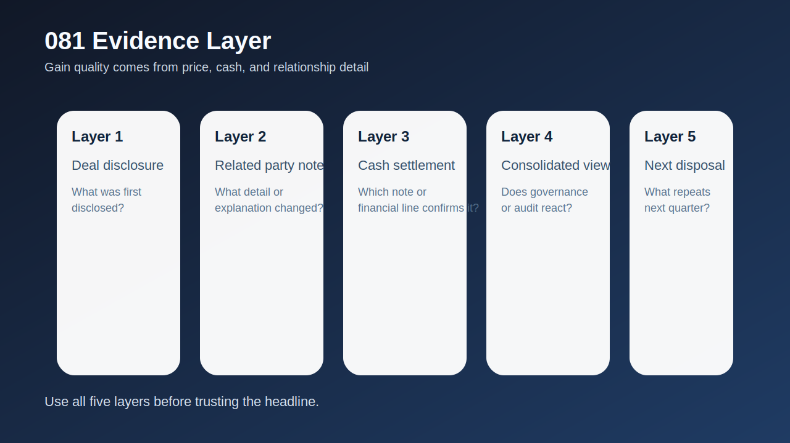
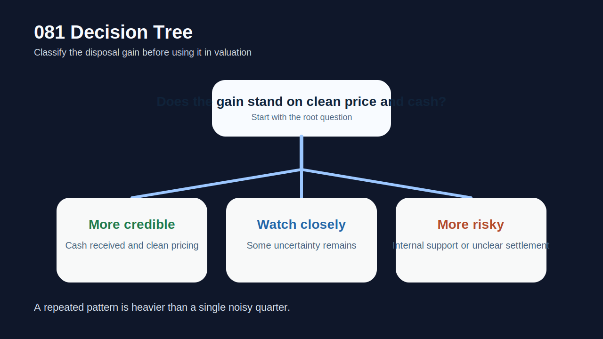
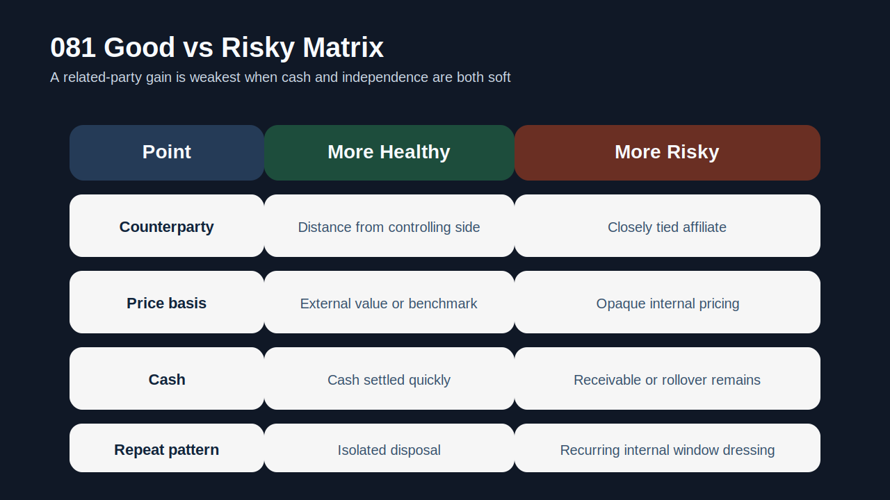
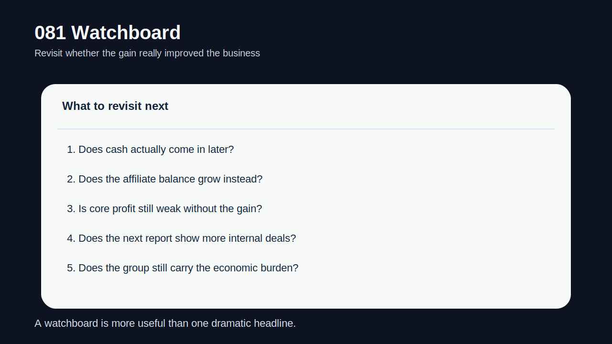

# 관계사 자산 매각 이익은 왜 더 조심해야 하나

자산 매각 이익은 겉으로 보면 간단하다. 팔아서 이익이 나면 숫자는 좋아 보인다. 하지만 상대방이 관계사라면 이야기가 달라진다. **관계사 자산 매각 이익은 `가격이 독립적인가`, `현금이 실제로 들어왔는가`, `연결 기준에서도 진짜로 이익이 남는가`를 더 엄격하게 봐야 하는 숫자**다.

특히 관계사 거래는 경제적 부담이 그룹 안에 남아 있을 수 있고, 가격 산정이 외부 거래만큼 선명하지 않을 수 있으며, 현금이 아니라 미수금이나 차환 구조로 남을 수도 있다. 이런 경우 headline 숫자로는 이익처럼 보여도, 실질적으로는 유동성 보완이나 장부 정리 성격이 더 클 수 있다.

그래서 이 글은 [자산 매각 이익이 유동성 위기를 가릴 때 무엇을 먼저 봐야 하나](/blog/asset-sale-gains-vs-liquidity-risk)의 다음 단계다. 이전 글이 비경상 자산 매각 이익 전반을 다뤘다면, 여기서는 `왜 관계사 매각 이익은 더 보수적으로 읽어야 하는가`, `무엇을 확인해야 그 이익을 본업과 분리할 수 있는가`를 정리한다. 함께 읽으면 좋은 글은 [영업외손익이 본업을 가릴 때 무엇을 분리해서 봐야 하나](/blog/non-operating-income-vs-core-earnings), [관계기업·공동기업투자는 본업 숫자를 어떻게 흐리나](/blog/associates-joint-ventures-and-equity-method), [대주주와 특수관계인 거래는 무엇을 먼저 봐야 하나](/blog/major-shareholder-and-related-parties), [지급보증·담보·약정은 어디서 위험 신호가 보이나](/blog/guarantees-collateral-and-commitments)다.

이 글은 관계사 자산 매각 이익을 `거래 상대 확인 -> 가격 근거 확인 -> 현금 유입 확인 -> 연결 기준 재검토 -> 반복 패턴 추적` 순서로 읽는 방법을 정리한다.

---

## 왜 관계사 매각 이익은 같은 금액이어도 더 무겁게 봐야 하나

외부 제3자에게 판 자산은 적어도 시장가격 검증 가능성이 상대적으로 높다. 반면 관계사 거래는 가격, 시점, 정산 조건이 지배주주 구조와 맞물릴 수 있다. 즉, 숫자는 같아도 `독립성`이 약하다. 그래서 같은 매각 이익이어도 관계사 거래는 더 많은 질문이 필요하다.

첫째, 가격이 정말 독립적인지 봐야 한다. 외부 감정평가나 비교 거래가 있는지, 아니면 내부 협의 가격인지에 따라 이익의 질이 달라진다. 둘째, 현금이 실제로 들어왔는지 봐야 한다. 자산은 팔았지만 대금이 장기간 미수금이나 다른 관계사 채권으로 남아 있으면, 장부상 이익과 현금 현실은 크게 다를 수 있다.

셋째, 연결 기준에서 경제적 부담이 남아 있는지도 중요하다. 그룹 안에서 자산을 옮기고 이익을 잡았더라도, 실질적 위험과 수익이 아직 그룹 안에 남아 있다면 투자자가 본업 개선으로 받아들일 숫자는 아니다. 그래서 관계사 자산 매각 이익은 단순 처분이익보다 `누구에게, 어떤 조건으로, 돈은 어떻게 들어왔는가`를 더 먼저 물어야 한다.

---

## 구조가 작동하는 순서

| 먼저 볼 항목 | 왜 중요한가 |
| --- | --- |
| 거래 상대 | 특수관계인인지, 얼마나 가까운지 확인한다 |
| 가격 근거 | 외부 기준이 있는지, 내부 협상인지 본다 |
| 정산 방식 | 현금 유입인지, 채권·상계인지 본다 |
| 연결 영향 | 연결 재무에서 이익이 그대로 남는지 본다 |
| 후속 거래 | 같은 패턴의 거래가 반복되는지 본다 |
| 본업 숫자 | 이익 제거 후에도 사업 체력이 남는지 본다 |

실전에서는 먼저 거래 상대를 적는다. 자회사, 관계기업, 대주주 측 회사, 기타 특수관계인 중 어디에 가까운지에 따라 해석이 달라진다. 그런 다음 가격 근거를 본다. 공시나 주석에 외부 평가, 입찰, 비교 거래가 있으면 조금 낫지만, 그런 설명이 약하면 보수적으로 읽는 편이 맞다.

다음으로는 정산 방식을 확인해야 한다. 많은 투자자가 매각 이익 숫자만 보고 지나가지만, 정말 중요한 것은 현금 유입이다. 현금이 아니라 미수금, 관계사 대여금 상계, 차환 구조로 처리되면 유동성 개선 효과는 훨씬 약할 수 있다. 이 부분은 [지급보증·담보·약정은 어디서 위험 신호가 보이나](/blog/guarantees-collateral-and-commitments)와도 연결된다.

마지막으로, 본업 숫자와 분리해 보는 습관이 중요하다. 관계사 자산 매각 이익을 빼면 영업흐름이 여전히 약한지, 현금 창출이 개선되지 않았는지, 다음 분기에도 비슷한 내부 거래가 이어지는지를 봐야 한다.

---

## 어디에서 왜곡이 생기나

가장 실용적인 질문은 `이 이익이 독립적인 거래에서 나온 실질 이익인가, 아니면 내부 재배치 성격이 강한가`다.

상대적으로 신뢰 가능한 경우는 가격 근거가 명확하고, 대금이 현금으로 들어오며, 연결 기준에서도 경제적 효과가 분명할 때다. 이 경우에도 비경상 이익이기는 하지만 최소한 `실제 처분`에 가깝다.

경계 구간은 거래는 있었지만 가격 설명이 약하거나, 현금 정산이 늦거나, 연결 효과가 다소 복잡한 경우다. 이때는 다음 보고서에서 미수금 회수와 관련 주석을 꼭 확인해야 한다.

더 위험한 경우는 관계사와의 거래를 통해 이익은 크게 보이는데, 현금 유입이 약하고, 가격 근거가 불투명하며, 비슷한 내부 거래가 반복되는 경우다. 이런 숫자는 본업 개선보다 장부 보정에 가깝게 읽어야 한다.

---

## 왜곡을 걸러내는 숫자 조합

| 관찰 포인트 | 상대적으로 건강한 경우 | 더 조심해야 하는 경우 |
| --- | --- | --- |
| 거래 상대 | 그룹과 거리가 있다 | 지배주주 측과 가깝다 |
| 가격 근거 | 외부 평가·비교 근거가 있다 | 내부 산정에 가깝다 |
| 정산 방식 | 현금이 빠르게 유입된다 | 장기 미수금·상계로 남는다 |
| 연결 효과 | 경제적 부담이 실제로 줄어든다 | 부담이 그룹 안에 남아 있다 |
| 반복성 | 일회성 정리 성격이다 | 비슷한 내부 거래가 이어진다 |

건강한 경우는 관계사 거래라도 독립성 보완 장치가 있다. 가격 근거가 보이고, 돈이 실제로 들어오고, 다음 보고서에서도 관련 잔액이 빠르게 정리된다. 반대로 더 조심해야 하는 경우는 숫자는 좋아졌는데 현금과 독립성이 둘 다 약하다.

여기서 핵심은 `누가 이익을 인식했나`보다 `누가 부담을 안고 있나`다. 관계사에 자산을 팔아 장부상 이익을 잡았더라도, 결국 대금을 회수하지 못하거나 그룹 내부에서 위험이 남아 있으면 투자자 입장에서는 질이 낮은 이익이다.

---

## 왜 본업 숫자와 반드시 분리해서 봐야 하나

관계사 자산 매각 이익은 회사가 실제 영업으로 돈을 벌었는지와는 별개일 수 있다. 그래서 이 숫자를 영업이익, 영업현금흐름, 본업 마진과 섞어 해석하면 쉽게 착시가 생긴다. 특히 실적이 약한 시기에 관계사 매각 이익이 크게 들어오면, `회사가 좋아지고 있다`는 착각을 만들기 쉽다.

이럴 때는 아주 단순하게 두 줄로 분리하면 된다. `이익에서 관계사 매각 이익을 뺀 본업은 어떤가`, `현금은 실제로 들어왔는가`. 이 두 질문에 답이 약하면 숫자가 크더라도 보수적으로 읽는 편이 맞다.

또 관계사 매각 이익은 종종 다른 보정 숫자와 같이 나타난다. 예를 들어 [영업외손익이 본업을 가릴 때 무엇을 분리해서 봐야 하나](/blog/non-operating-income-vs-core-earnings), [관계기업·공동기업투자는 본업 숫자를 어떻게 흐리나](/blog/associates-joint-ventures-and-equity-method)와 겹치면 실적 해석이 더 어렵다. 그래서 이익의 출처를 한 번 더 분리해야 한다.

---

## 왜 현금 회수가 최종 검증이 되나

관계사 거래에서는 계약서보다 더 중요한 것이 실제 현금 흐름일 때가 많다. 공시상 매각이익이 크게 잡혀도, 대금이 장기간 미수금으로 남거나 다른 관계사 채권과 상계되면 회사의 유동성은 생각보다 나아지지 않을 수 있다. 결국 투자자 입장에서는 `이익이 났다`보다 `돈이 들어왔는가`가 더 강한 검증 기준이 된다.

특히 실적이 약한 회사일수록 관계사 매각 이익은 시간을 버는 장치로 쓰이기 쉽다. 그래서 다음 보고서에서 관계사 채권이 줄었는지, 현금이 실제로 유입됐는지, 비슷한 내부 거래가 또 등장하는지를 반드시 확인해야 한다. 이 점을 빼고 보면 관계사 매각 이익은 너무 쉽게 좋은 숫자로 오해된다.

---

## 실전에서 가장 빨리 구분되는 조합은 무엇인가

가장 빨리 위험해지는 조합은 `관계사 거래 + 현금 유입 약함 + 가격 근거 불명확`이다. 여기에 `본업 약세`와 `비슷한 내부 거래 반복`이 붙으면 해석은 더 무거워진다. 이 조합이면 매각 이익은 실적 개선이 아니라 내부 재배치 또는 시간 벌기 성격일 수 있다.

반대로 상대적으로 덜 무거운 조합은 `관계사 거래라도 외부 가격 근거가 있고, 현금이 빨리 들어오며, 다음 보고서에서 관련 잔액이 정리되는 경우`다. 그래도 본업과는 분리해서 보는 편이 맞지만, 적어도 현금과 독립성 측면에서는 덜 불안하다.

실전 메모는 다섯 줄이면 충분하다. `상대`, `가격`, `현금`, `연결`, `반복`. 이 다섯 줄을 적으면 관계사 자산 매각 이익이 왜 더 보수적으로 읽혀야 하는지 금방 보인다.

---

## 놓치기 쉬운 예외

| 이번에 본 것 | 다음에 다시 볼 것 |
| --- | --- |
| 거래 상대 | 같은 관계사와 비슷한 거래가 반복되는가 |
| 정산 구조 | 현금 회수가 실제로 이뤄졌는가 |
| 미수금 | 관계사 채권이 남아 있거나 늘어나는가 |
| 본업 실적 | 매각 이익 제거 후에도 개선이 남는가 |
| 연결 주석 | 경제적 부담이 그룹 안에 남아 있는가 |
| 자금 사정 | 유동성 보완용 거래였는지 드러나는가 |

이 주제의 핵심은 간단하다. 관계사 자산 매각 이익은 숫자보다 구조를 먼저 봐야 한다. 가격, 현금, 연결, 반복성까지 확인하지 않으면 headline 숫자에 쉽게 속는다.

---

## 빠른 점검 체크리스트

- 거래 상대가 얼마나 가까운 특수관계인인지 적었는가
- 가격 근거가 외부 기준인지 확인했는가
- 대금이 현금으로 들어오는지 확인했는가
- 연결 재무 기준에서도 효과가 남는지 봤는가
- 본업 숫자에서 해당 이익을 분리해 봤는가
- 다음 보고서에서 미수금과 반복 거래를 추적할 계획을 세웠는가

## 자주 묻는 질문

### 관계사에게 자산을 팔아 이익이 나면 무조건 나쁜가

그렇지는 않다. 다만 외부 거래보다 가격과 현금, 연결 효과를 더 엄격하게 확인해야 한다.

### 무엇이 가장 중요한 검증 포인트인가

현금 유입과 가격 근거다. 숫자가 커도 돈이 실제로 안 들어오면 의미가 약해진다.

### 왜 연결 기준을 봐야 하나

그룹 안에서 경제적 부담이 여전히 남아 있으면, 장부상 이익이 실질 개선을 과장할 수 있기 때문이다.

### 어디와 같이 읽으면 도움이 되나

자산 매각 이익, 영업외손익, 관계기업·특수관계인 거래 글과 같이 보면 본업과 비본업을 더 잘 분리할 수 있다.

## 구조를 더 깊이 이해하는 글

- [자산 매각 이익이 유동성 위기를 가릴 때 무엇을 먼저 봐야 하나](/blog/asset-sale-gains-vs-liquidity-risk)
- [영업외손익이 본업을 가릴 때 무엇을 분리해서 봐야 하나](/blog/non-operating-income-vs-core-earnings)
- [관계기업·공동기업투자는 본업 숫자를 어떻게 흐리나](/blog/associates-joint-ventures-and-equity-method)
- [대주주와 특수관계인 거래는 무엇을 먼저 봐야 하나](/blog/major-shareholder-and-related-parties)
- [지급보증·담보·약정은 어디서 위험 신호가 보이나](/blog/guarantees-collateral-and-commitments)

## 참고 자료

- [IAS 24 Related Party Disclosures](https://www.ifrs.org/issued-standards/list-of-standards/ias-24-related-party-disclosures/)
- [IFRS 5 Non-current Assets Held for Sale and Discontinued Operations](https://www.ifrs.org/issued-standards/list-of-standards/ifrs-5-non-current-assets-held-for-sale-and-discontinued-operations/)
- [IAS 1 Presentation of Financial Statements](https://www.ifrs.org/issued-standards/list-of-standards/ias-1-presentation-of-financial-statements.html)
- [DART 소개 - 보고서정보](https://dart.fss.or.kr/introduction/content2.do)
- [OpenDART XBRL 주석](https://opendart.fss.or.kr/disclosureinfo/fnltt/xbrlnote/main.do)

## 핵심 구조 요약

관계사 자산 매각 이익은 겉보기 이익보다 `가격의 독립성`, `현금 유입`, `연결 기준`, `반복성`을 더 먼저 봐야 하는 숫자다. 이 네 가지가 약하면 headline 이익은 커도 실질 개선은 약할 수 있다.

결국 이 주제의 핵심은 `얼마나 벌었나`보다 `누구와 어떤 조건으로 거래했나`를 묻는 것이다. 그 질문을 붙이면 관계사 매각 이익을 훨씬 덜 느슨하게 읽게 된다.
