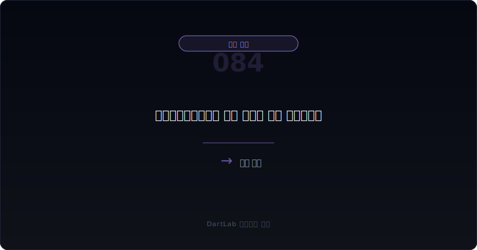
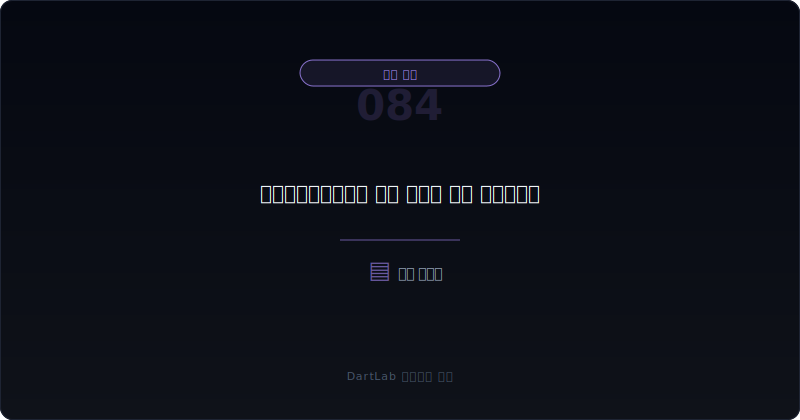
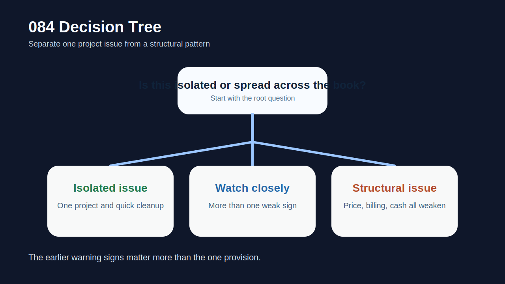
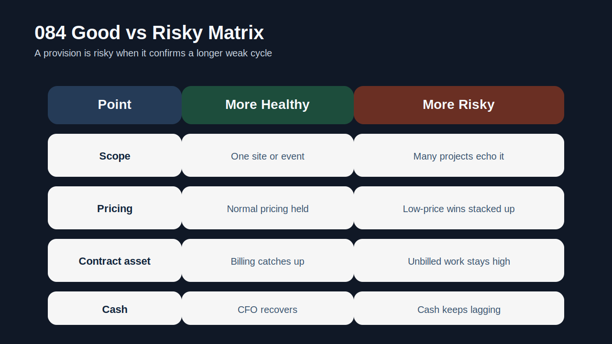
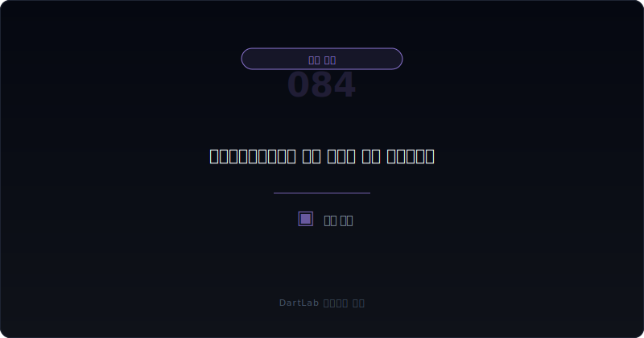

# 공사손실충당부채는 언제 뒤늦게 크게 튀어나오나

공사손실충당부채는 처음 보면 갑자기 튀어나온 숫자처럼 보인다. 하지만 실전에서는 대부분 갑자기 생기지 않는다. **이미 `낮아진 수주 가격`, `과도한 공정률 매출`, `계약자산 증가`, `늦은 청구`, `반복되는 원가 추정 수정`이 누적되다가 어느 시점에 한꺼번에 드러나는 경우**가 많다.

그래서 투자자가 봐야 할 것은 손실충당부채가 찍힌 시점보다 그 전에 있었던 신호다. 회사가 오랫동안 낮은 마진으로 수주하고, 공정률은 앞서가는데 현금이 안 따라오고, 계약자산은 불어나고, 뒤늦게 원가 추정이 올라가면 손실충당부채는 마지막 결과물에 가깝다. 즉, 숫자 자체보다 `왜 이렇게 늦게 인식됐는가`를 먼저 물어야 한다.

이 글은 [선수수익보다 미청구공사가 더 빨리 늘 때 무엇을 봐야 하나](/blog/unbilled-construction-vs-deferred-revenue), [재고평가손실과 저가수주 압박은 어떻게 이어지나](/blog/inventory-write-downs-and-low-price-bidding), [매출 인식 시점 변경은 어디가 신호인가](/blog/revenue-recognition-timing-signals), [수주잔고는 늘는데 왜 현금은 안 남나](/blog/order-backlog-vs-cash-flow)의 다음 단계다. 여기서는 `왜 손실충당부채가 뒤늦게 크게 튀는가`, `어떤 조합이 가장 위험한가`를 정리한다.

이 글은 공사손실충당부채를 `수주 가격 확인 -> 원가 추정과 공정률 해석 -> 계약자산·현금흐름 대조 -> 충당부채 인식 시점 판단 -> 다음 프로젝트와 반복성 추적` 순서로 읽는 방법을 설명한다.

---

## 왜 손실충당부채는 갑자기 생긴 것처럼 보여도 대개 늦게 드러난 결과인가

프로젝트형 산업에서는 손실이 숫자로 확정되기 전까지 경영진이 여러 추정으로 시간을 벌 수 있다. 공정률 조정, 추가 원가 추정 보수화 지연, 변경계약 기대, 클레임 회수 기대, 원재료 가격 정상화 기대 같은 설명이 붙는다. 그래서 겉으로는 아직 손실이 확정되지 않은 것처럼 보일 수 있다.

하지만 시간이 지나면 피할 수 없는 비용이 더 명확해지고, 남은 계약 이익보다 손실 가능성이 커진다. 이때 비로소 손실충당부채가 한꺼번에 잡힌다. 즉, 손실충당부채는 사건의 시작이 아니라 `더는 미룰 수 없어진 시점`일 때가 많다.

그래서 공사손실충당부채를 볼 때는 `이번 분기에 왜 생겼나`보다 `이전 몇 분기 동안 어떤 경고가 누적됐나`를 먼저 보는 편이 더 실용적이다. 앞선 경고를 놓치면 손실충당부채를 매번 놀라운 숫자로만 받아들이게 된다.

---

## 어떤 숫자 조합이 먼저 경고하나

| 먼저 볼 항목 | 왜 중요한가 |
| --- | --- |
| 수주 가격·마진 | 문제의 출발점이 가격인지 본다 |
| 공정률·매출 인식 | 수익이 너무 앞서 잡혔는지 본다 |
| 계약자산·미청구공사 | 청구와 회수가 밀리고 있는지 본다 |
| 영업현금흐름 | 공사 진전이 실제 현금으로 이어지는지 본다 |
| 원가 추정 변경 | 손실 인식이 늦어진 흔적이 있는지 본다 |
| 다음 프로젝트 | 특정 현장 이슈인지 구조 문제인지 가른다 |

실전에서는 먼저 가격과 마진을 확인해야 한다. 저가수주가 반복되면 손실충당부채는 나중에 나와도 이미 씨앗이 뿌려진 상태다. 그다음엔 공정률 매출을 본다. 매출은 잘 잡히는데 계약자산이 늘고 현금이 안 따라오면, 회사가 이익을 너무 일찍 인식하고 있을 수 있다.

또 원가 추정 변경 흔적을 꼭 봐야 한다. 분기마다 원가율이 조금씩 올라가거나, 특정 프로젝트에서 갑자기 예상 총원가가 뛰는 흐름이 있었다면 손실충당부채는 그 누적의 결과일 가능성이 크다. 즉, 손실충당부채는 단일 회계 이벤트가 아니라 앞선 여러 추정 실패의 집계판으로 읽는 편이 맞다.

---

## 신호가 강해지는 순서

핵심 질문은 이것이다. `이번 손실충당부채는 개별 프로젝트 정리인가, 아니면 수주 전략과 매출 인식이 함께 무너지는 구조 신호인가?`

개별 정리에 가까운 경우는 특정 현장의 일회성 비용 증가, 예외적 지연, 특정 발주처 이슈처럼 원인이 좁고 이후 다른 프로젝트로 전염되지 않는 경우다. 이런 상황에서는 충당부채가 커도 구조 신호로까지 보지 않을 수 있다.

경계 구간은 몇 개 프로젝트에서 비슷한 원가 상승과 청구 지연이 보이지만, 아직 전사 전략 문제로 단정하기 어려운 경우다. 이때는 다음 분기 backlog와 계약자산, 마진을 반드시 이어서 봐야 한다.

구조 문제로 읽어야 하는 경우는 저가수주, 계약자산 누적, 영업현금흐름 약화, 원가율 상승, 뒤늦은 손실충당부채 인식이 같이 보일 때다. 이 조합이면 문제는 특정 현장이 아니라 `수주와 인식 방식 전체`일 가능성이 높다.

---

## 위험도를 나누는 기준

| 관찰 포인트 | 상대적으로 관리 가능한 경우 | 더 조심해야 하는 경우 |
| --- | --- | --- |
| 원인 범위 | 특정 프로젝트에 국한된다 | 여러 프로젝트에서 반복된다 |
| 수주 가격 | 예외적 사건이다 | 저가수주 흔적이 누적된다 |
| 계약자산 | 빠르게 줄어든다 | 계속 늘거나 높은 수준을 유지한다 |
| 현금흐름 | 다음 분기에 회복된다 | 이익과 현금 괴리가 계속된다 |
| 후속 인식 | 추가 손실이 제한적이다 | 다시 충당부채나 원가율 상승이 붙는다 |

상대적으로 관리 가능한 경우는 손실을 한 번 크게 인식한 뒤 다음 분기부터 숫자가 정리된다. 충당부채 인식이 오히려 보수적 정리였을 수 있다. 반대로 더 조심해야 하는 경우는 손실충당부채가 나왔는데도 계약자산과 현금흐름이 개선되지 않고, 비슷한 프로젝트에서 다시 손실이 드러나는 경우다.

특히 [선수수익보다 미청구공사가 더 빨리 늘 때 무엇을 봐야 하나](/blog/unbilled-construction-vs-deferred-revenue), [수주잔고는 늘는데 왜 현금은 안 남나](/blog/order-backlog-vs-cash-flow), [영업현금흐름이 순이익을 부정할 때](/blog/operating-cash-flow-vs-net-income)를 같이 보면 좋다. 손실충당부채는 보통 혼자 오지 않는다.

---

## 왜 손실충당부채보다 원가 추정의 움직임을 먼저 봐야 하나

손실충당부채는 결과지만, 원가 추정 변경은 과정이다. 프로젝트형 회사는 손실이 커지기 전에 먼저 원가 추정이 흔들린다. 예상 총원가가 계속 올라가고, 공정률 계산이 바뀌고, 마진이 줄어드는 흐름이 먼저 보인다. 따라서 원가 추정의 움직임을 읽으면 손실충당부채를 한두 분기 먼저 의심할 수 있다.

또 회사는 처음부터 손실충당부채라는 표현을 쓰지 않을 수 있다. 대신 `원가율 상승`, `프로젝트 지연`, `원자재 가격`, `설계 변경`, `발주처 협의` 같은 문구가 먼저 나온다. 이때 투자자는 숫자 하나만 기다리지 말고, 그 문구가 어떤 방향으로 쌓이고 있는지 봐야 한다.

---

## 실전에서 가장 빨리 구분되는 조합은 무엇인가

가장 빨리 위험해지는 조합은 `저가수주 흔적 + 계약자산 급증 + 영업현금흐름 둔화 + 뒤늦은 원가율 상승`이다. 여기에 손실충당부채가 붙으면 이미 결과가 눈앞에 온 경우가 많다.

반대로 상대적으로 덜 무거운 조합은 `특정 현장 일회성 손실 + 계약자산 축소 + 다음 분기 현금 회복`이다. 이 경우에는 충당부채 자체보다 정리 이후 정상화 여부가 더 중요하다.

실전 메모는 다섯 줄이면 충분하다. `가격`, `공정률`, `계약자산`, `CFO`, `원가 추정`. 이 다섯 줄을 함께 보면 손실충당부채가 왜 늦게 튀는지 빠르게 이해할 수 있다.

---

## 왜 발주처 협의나 일시적 변수 설명만으로 기다리면 늦어지나

프로젝트형 회사는 손실이 커지기 시작할 때 거의 항상 시간을 벌 수 있는 설명을 갖고 있다. 발주처와 정산 협의를 진행 중이라고 말할 수 있고, 설계 변경 승인이 남아 있다고 말할 수도 있으며, 원재료 가격이 정상화되면 수익성이 회복된다고 설명할 수도 있다. 이런 문구는 완전히 틀린 말이 아닐 수 있다. 문제는 그 설명이 실제로 숫자를 회복시키는지와 별개로, 투자자에게 판단 유예를 반복하게 만든다는 점이다.

실전에서는 설명보다 먼저 숫자의 조합을 봐야 한다. 발주처 협의가 진행 중이라는데 계약자산이 계속 늘고, 공정률 매출은 앞서가고, 영업현금흐름은 약하고, 원가율이 매 분기 올라간다면 협의 문구는 방어 논리일 뿐일 수 있다. 특히 여러 현장에서 비슷한 표현이 반복되면 그 문제는 특정 발주처가 아니라 회사의 수주 심사와 원가 추정 체계에 더 가깝다.

따라서 공사손실충당부채를 읽을 때는 회사가 왜 늦게 손실을 확정했는지보다, 그 전까지 어떤 설명으로 손실 인식을 미뤘는지 보는 편이 더 유용하다. 기다리는 동안 숫자가 계속 나빠졌다면 손실충당부채는 단순 충격이 아니라 오래 지연된 인정으로 읽는 편이 맞다.

결국 투자자는 협의가 잘 끝나길 기대하기보다, 협의가 끝나지 않아도 회사가 버틸 수 있는지부터 봐야 한다. 버티는 힘이 약하면 설명은 길어지고 손실은 더 늦게, 더 크게 나온다.

---

## 다음 분기에 다시 확인할 숫자

| 이번에 본 것 | 다음에 다시 볼 것 |
| --- | --- |
| 충당부채 인식 | 추가 손실이 더 붙는가 |
| 계약자산 수준 | 청구가 따라오며 줄어드는가 |
| 원가율 변화 | 다른 프로젝트로 번지는가 |
| 영업현금흐름 | 실제 회복이 나타나는가 |
| 수주 전략 | 저가수주 패턴이 계속되는가 |

공사손실충당부채는 `이번 분기 충격`보다 `다음 분기 정리 여부`가 더 중요하다. 한 번 크게 인식하고 끝나는지, 아니면 구조적으로 같은 문제가 반복되는지가 회사의 체력을 가른다.

---

## 실전 점검 체크리스트

- 손실충당부채가 특정 프로젝트인지 전사 패턴인지 구분했는가
- 저가수주와 마진 하락 흐름을 확인했는가
- 계약자산·미청구공사와 영업현금흐름을 같이 봤는가
- 원가 추정이 이전부터 흔들렸는지 확인했는가
- 다음 분기에 추가 손실이 이어지는지 추적할 계획을 세웠는가
- 수주잔고 증가를 무조건 좋은 뉴스로 읽지 않기로 했는가

## 자주 묻는 질문

### 공사손실충당부채가 한 번 나오면 무조건 구조 문제인가

아니다. 특정 현장 일회성 사건일 수도 있다. 다만 계약자산, 현금흐름, 저가수주 흔적까지 같이 나쁘면 구조 문제일 가능성이 크다.

### 무엇이 가장 빠른 선행 신호인가

계약자산 증가와 영업현금흐름 둔화, 그리고 반복되는 원가율 상승이다.

### 왜 손실충당부채가 늦게 잡히는가

프로젝트형 산업에서는 원가 추정과 공정률 판단으로 시간을 벌 수 있기 때문이다. 그래서 결과가 한꺼번에 드러나는 경우가 많다.

### 어디와 같이 읽으면 도움이 되나

미청구공사, 수주잔고, 매출 인식 시점, 영업현금흐름 글과 같이 보면 좋다.

## 관련 분석 글

- [선수수익보다 미청구공사가 더 빨리 늘 때 무엇을 봐야 하나](/blog/unbilled-construction-vs-deferred-revenue)
- [재고평가손실과 저가수주 압박은 어떻게 이어지나](/blog/inventory-write-downs-and-low-price-bidding)
- [매출 인식 시점 변경은 어디가 신호인가](/blog/revenue-recognition-timing-signals)
- [수주잔고는 늘는데 왜 현금은 안 남나](/blog/order-backlog-vs-cash-flow)
- [영업현금흐름이 순이익을 부정할 때](/blog/operating-cash-flow-vs-net-income)
- [선수금·계약부채는 좋은 신호인가 위험 신호인가](/blog/advance-payments-and-contract-liabilities)

## 공식 출처와 근거

- [IAS 37 Provisions, Contingent Liabilities and Contingent Assets](https://www.ifrs.org/issued-standards/list-of-standards/ias-37-provisions-contingent-liabilities-and-contingent-assets/)
- [IFRS 15 Revenue from Contracts with Customers](https://www.ifrs.org/issued-standards/list-of-standards/ifrs-15-revenue-from-contracts-with-customers/)
- [DART 소개 - 보고서정보](https://dart.fss.or.kr/introduction/content2.do)
- [OpenDART XBRL 주석](https://opendart.fss.or.kr/disclosureinfo/fnltt/xbrlnote/main.do)

## 핵심 정리

공사손실충당부채는 갑자기 생긴 숫자처럼 보여도, 실제로는 낮은 가격, 앞선 매출 인식, 계약자산 누적, 원가 추정 실패가 오래 쌓인 뒤늦은 결과일 때가 많다. 그래서 손실충당부채를 볼 때는 이번 분기 숫자보다 그 전에 누적된 신호를 먼저 봐야 한다.

핵심은 `왜 지금 크게 튀었나`보다 `왜 더 일찍 안 보였나`를 묻는 것이다. 그 질문을 붙이면 프로젝트형 회사의 위험을 훨씬 빨리 읽게 된다.
