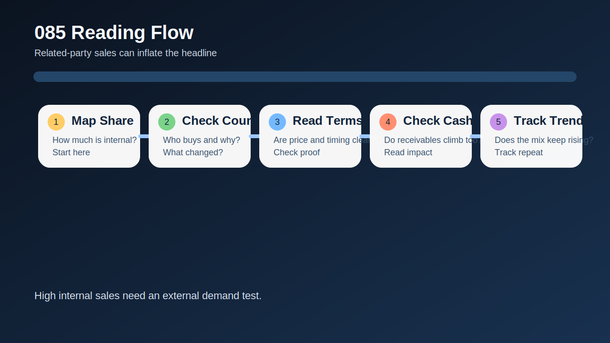
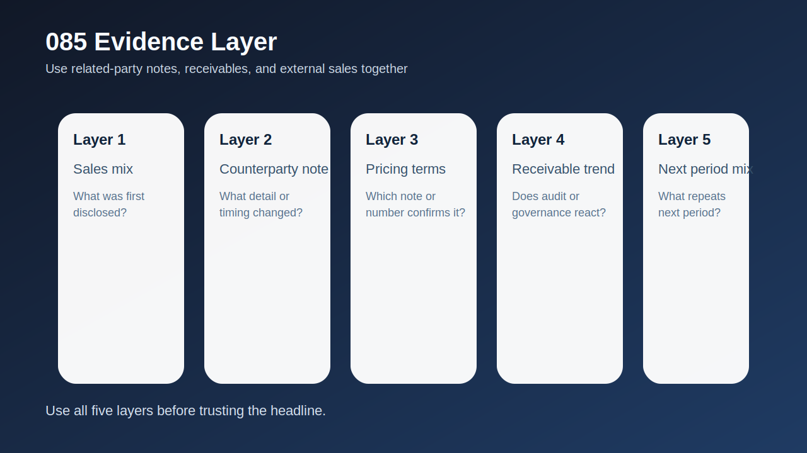
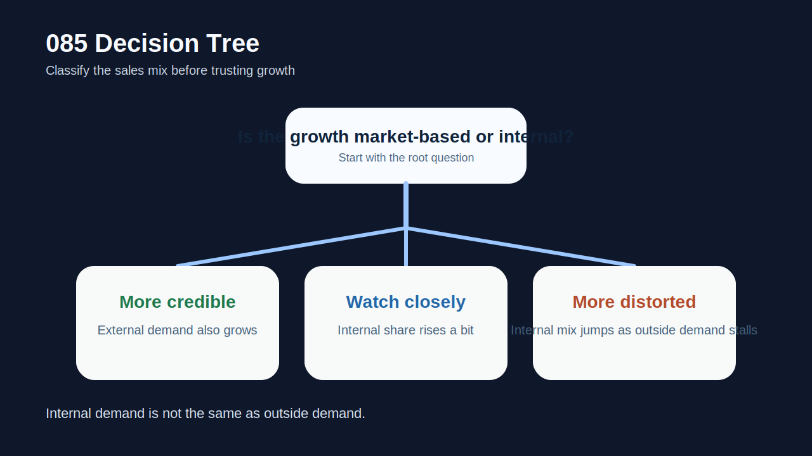
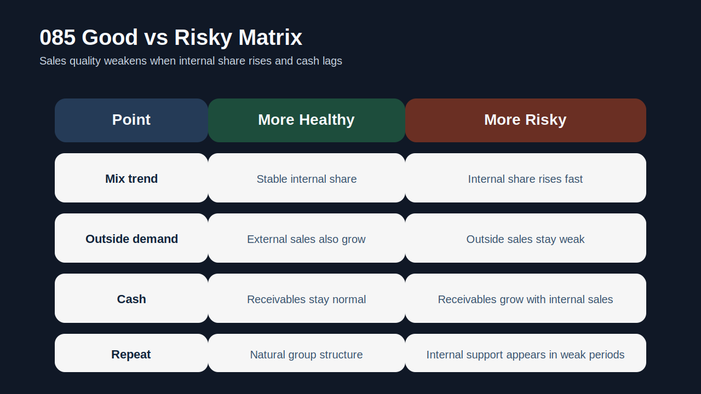
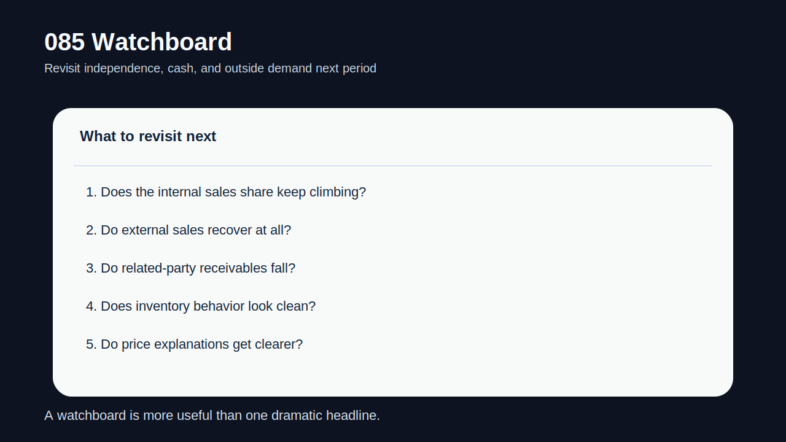

# 관계사 매출 비중이 높을 때 본업 숫자는 어떻게 왜곡되나

매출은 늘었는데도 어딘가 찜찜한 회사가 있다. 그중 가장 대표적인 경우가 관계사 매출 비중이 높은 회사다. **관계사 매출이 크다고 해서 무조건 나쁜 것은 아니지만, 그 비중이 높아질수록 `성장률`, `마진`, `수요의 독립성`, `회수 안정성`을 그대로 믿기 어려워질 수 있다.**

이유는 간단하다. 관계사 거래는 외부 시장 수요보다 그룹 내부 의사결정에 더 크게 좌우될 수 있다. 가격과 물량이 외부 경쟁만으로 정해지지 않을 수 있고, 재고 조정이나 실적 관리 목적이 일부 섞일 수도 있으며, 대금 회수도 외부 거래만큼 단단하지 않을 수 있다. 그래서 headline 매출을 바로 본업 체력으로 읽으면 쉽게 과대평가가 생긴다.

이 글은 [관계사 자산 매각 이익은 왜 더 조심해야 하나](/blog/related-party-asset-sale-gains), [관계기업·공동기업투자는 본업 숫자를 어떻게 흐리나](/blog/associates-joint-ventures-and-equity-method), [영업외손익이 본업을 가릴 때 무엇을 분리해서 봐야 하나](/blog/non-operating-income-vs-core-earnings), [대주주와 특수관계인 거래는 무엇을 먼저 봐야 하나](/blog/major-shareholder-and-related-parties)의 다음 단계다. 여기서는 `관계사 매출 비중이 높을 때 본업 숫자를 어떻게 다시 읽어야 하는가`를 정리한다.

이 글은 관계사 매출을 `거래 상대와 집중도 확인 -> 가격·조건 독립성 확인 -> 회수와 현금 검증 -> 재고·채권과 연결 -> 반복성으로 구조 여부 판단` 순서로 읽는 방법을 설명한다.

---

## 왜 관계사 매출이 많으면 성장률을 그대로 믿기 어려운가

외부 매출은 기본적으로 시장이 수요를 검증한다. 반면 관계사 매출은 그룹 내부 공급망, 전략적 배치, 일시적 재고 이동, 실적 보완 목적까지 일부 섞일 수 있다. 그래서 숫자는 같아도 의미가 다르다. 외형은 성장처럼 보여도 독립적인 고객 기반 확대를 그대로 뜻하지 않을 수 있다.

특히 관계사 매출 비중이 갑자기 커지는 경우는 더 조심해야 한다. 외부 매출이 정체된 상황에서 내부 거래 비중이 높아지면, 회사는 성장률과 가동률을 방어할 수 있지만 시장 경쟁력까지 같이 좋아졌다고 보기는 어렵다. 따라서 관계사 매출이 높은 회사는 `총매출`보다 `외부매출`, `관계사 비중 추이`, `현금 회수 질`을 같이 보는 편이 맞다.

또 관계사 매출은 마진 해석도 흐릴 수 있다. 내부 가격이 외부 가격과 다르거나, 원가 전가 구조가 특수하면 이익률이 실제 경쟁력을 보여주지 않을 수 있다. 그래서 매출 비중이 높을수록 숫자를 한 번 더 분리해야 한다.

---

## 구조가 작동하는 순서

| 먼저 볼 항목 | 왜 중요한가 |
| --- | --- |
| 관계사 매출 비중 | 외부 수요 의존도와 분리해서 본다 |
| 거래 상대 집중도 | 몇 개 관계사에 몰려 있는지 본다 |
| 가격·조건 | 외부 거래와 비슷한지 확인한다 |
| 매출채권 회수 | 실제 현금으로 이어지는지 본다 |
| 재고 변화 | 밀어내기나 내부 재고 이동이 있는지 본다 |
| 반복성 | 일시적 구조인지 고착된 모델인지 본다 |

실전에서는 먼저 관계사 매출 비중의 방향을 기록하는 것이 좋다. 한 분기 높다는 사실보다 `비중이 올라가는가`가 더 중요하다. 그다음에는 거래 상대를 본다. 특정 한두 관계사에 크게 의존하면 숫자 해석은 더 조심해야 한다. 거래가 유지되는 이유가 시장 경쟁력보다 그룹 구조일 수 있기 때문이다.

다음으로는 회수와 재고를 같이 봐야 한다. 관계사 매출이 늘었는데 매출채권이 같이 불어나거나 재고가 이상하게 움직이면, 그 매출은 현금과 독립성 측면에서 약할 수 있다. 이 부분은 [매출채권과 대손충당금은 어떻게 읽어야 하나](/blog/receivables-and-allowance), [영업현금흐름이 순이익을 부정할 때](/blog/operating-cash-flow-vs-net-income)와 붙여 보면 더 빨리 보인다.

---

## 어디에서 왜곡이 생기나

핵심 질문은 이것이다. `이 회사의 매출 증가는 독립적 수요 확대인가, 아니면 관계사 거래 비중 확대로 만들어진 외형인가?`

상대적으로 건강한 경우는 관계사 매출이 있더라도 비중이 안정적이고, 가격과 조건 설명이 비교적 명확하며, 회수가 잘 되고, 외부 매출도 함께 성장한다. 이런 경우 관계사 매출은 사업 구조의 일부일 수 있다.

경계 구간은 관계사 매출이 다소 높지만 외부 매출과 혼합되어 있고, 회수와 가격 조건이 아직 크게 흔들리지 않는 경우다. 이때는 다음 분기 비중 추이와 채권 회수를 추적하면 된다.

왜곡이 강한 경우는 관계사 매출 비중이 빠르게 높아지고, 외부 수요는 약한데 성장률은 좋아 보이며, 채권과 재고가 같이 움직이는 경우다. 이 조합이면 headline 성장률을 본업 체력으로 읽기 어렵다.

---

## 왜곡을 걸러내는 숫자 조합

| 관찰 포인트 | 상대적으로 건강한 경우 | 더 조심해야 하는 경우 |
| --- | --- | --- |
| 비중 추이 | 안정적이거나 낮다 | 빠르게 높아진다 |
| 외부 매출 | 함께 성장한다 | 외부 수요는 정체된다 |
| 회수 구조 | 현금 회수가 안정적이다 | 채권이 같이 늘어난다 |
| 가격 설명 | 비교적 명확하다 | 내부 조건 설명이 약하다 |
| 반복성 | 사업 구조상 자연스럽다 | 실적이 약할 때만 커진다 |

관계사 매출이 많아도 사업 구조상 필수적인 경우가 있다. 하지만 더 조심해야 하는 패턴은 `실적이 약할 때마다 관계사 비중이 커지는 경우`다. 이런 경우 관계사 거래는 실적 완충재처럼 작동할 수 있다.

특히 [관계사 자산 매각 이익은 왜 더 조심해야 하나](/blog/related-party-asset-sale-gains), [대주주와 특수관계인 거래는 무엇을 먼저 봐야 하나](/blog/major-shareholder-and-related-parties), [지급보증·담보·약정은 어디서 위험 신호가 보이나](/blog/guarantees-collateral-and-commitments)까지 같이 보면 관계사 매출이 단순한 매출 구조인지, 더 넓은 내부 지원 체계의 일부인지 판단하는 데 도움이 된다.

---

## 왜 회수와 재고를 같이 봐야 하나

관계사 매출은 손익계산서만 보면 과대평가되기 쉽다. 그래서 반드시 자산 쪽을 같이 봐야 한다. 관계사 매출이 늘 때 매출채권이 같이 늘고, 재고 움직임도 비정상적이면 회사가 실제 현금을 만들었다기보다 장부상 매출을 먼저 만들었을 수 있다.

이 조합은 특히 실적이 약한 시기에 중요하다. 외형 성장을 방어하기 위해 관계사 매출을 키웠는데 회수가 늦고 재고 부담이 남으면, 그 성장률은 질이 낮다. 따라서 관계사 매출 해석에서는 항상 `매출`, `채권`, `재고`, `현금` 네 줄을 같이 적는 편이 좋다.

---

## 실전에서 가장 빨리 구분되는 조합은 무엇인가

가장 빨리 위험해지는 조합은 `관계사 매출 비중 급증 + 외부 매출 정체 + 매출채권 증가 + 현금흐름 약화`다. 여기에 `재고 부담`과 `가격 설명 부재`가 더해지면 headline 성장률은 강하게 할인해서 보는 편이 맞다.

반대로 상대적으로 덜 무거운 조합은 `관계사 매출 존재 + 외부 매출 동반 성장 + 회수 안정 + 비중 안정`이다. 이 경우에도 분리는 필요하지만 구조 자체를 바로 위험하다고 보지는 않을 수 있다.

실전 메모는 다섯 줄이면 충분하다. `비중`, `상대`, `조건`, `채권`, `외부매출`. 이 다섯 줄을 적으면 관계사 매출이 본업 숫자를 얼마나 왜곡하는지 빠르게 보인다.

---

## 왜 관계사 매출은 절대 규모보다 비중 변화가 더 중요하나

관계사 매출 해석에서 자주 놓치는 부분은 절대 금액보다 방향이다. 어떤 회사는 구조적으로 관계사 거래가 필요할 수 있다. 이 경우 절대 금액이 크더라도 오랜 기간 비중이 안정적이고 외부 매출도 함께 자라면 해석은 비교적 단순하다. 반대로 평소에는 낮던 비중이 실적이 약해질 때마다 빠르게 높아진다면, 그 변화 자체가 훨씬 더 중요한 신호가 된다.

비중 변화가 중요한 이유는 회사가 어떤 매출로 외형을 방어하고 있는지를 보여주기 때문이다. 외부 수요가 둔화되는데도 전체 매출 성장률이 유지된다면, 그 성장의 상당 부분이 관계사 거래에서 왔는지부터 확인해야 한다. 이때 관계사 매출은 단순한 사업 구조가 아니라 실적 완충 장치처럼 보일 수 있다. 특히 몇 개 핵심 관계사에 집중되어 있고 조건 설명이 약하면 숫자의 독립성은 더 떨어진다.

따라서 관계사 매출은 `많다`보다 `늘어나는 방식이 이상한가`를 먼저 봐야 한다. 비중이 높아지는 시점, 외부 매출과의 반대 방향 움직임, 채권과 재고의 동반 변화까지 같이 보면 관계사 매출이 본업 경쟁력을 얼마나 가리고 있는지 훨씬 빨리 드러난다.

같은 금액이라도 외부 매출이 강한 분기에 붙은 관계사 매출과, 외부 매출이 약한 분기에 대신 채워 넣은 관계사 매출은 의미가 다르다. 그래서 숫자를 읽을 때는 절대 규모보다 타이밍과 의존도 변화를 먼저 기록하는 편이 훨씬 실전적이다.

---

## 놓치기 쉬운 예외

| 이번에 본 것 | 다음에 다시 볼 것 |
| --- | --- |
| 관계사 매출 비중 | 더 높아지는가, 다시 낮아지는가 |
| 외부 매출 | 독립 수요가 회복되는가 |
| 채권 회수 | 관계사 채권이 줄어드는가 |
| 재고 흐름 | 내부 이동 흔적이 남는가 |
| 설명 문구 | 가격·조건 설명이 더 구체화되는가 |

관계사 매출은 숫자 하나보다 추세가 더 중요하다. 비중이 계속 올라가고 외부 매출이 약하면, 그 회사의 headline 성장률은 독립적인 본업 성장보다 약한 신호일 수 있다.

---

## 빠른 점검 체크리스트

- 관계사 매출 비중 추이를 적었는가
- 거래 상대가 몇 곳에 집중되는지 확인했는가
- 외부 매출과 분리해서 성장률을 봤는가
- 매출채권과 재고 움직임을 같이 봤는가
- 현금 회수 질을 확인했는가
- 다음 분기에도 비중이 더 높아지는지 추적할 계획을 세웠는가

## 자주 묻는 질문

### 관계사 매출이 많으면 무조건 나쁜가

그렇지는 않다. 다만 비중이 높아질수록 외부 수요와 구분해서 봐야 한다.

### 무엇이 가장 중요한 보조 지표인가

매출채권 회수와 외부 매출 추이다. 둘이 약하면 headline 성장률의 질이 낮을 수 있다.

### 왜 재고까지 같이 봐야 하나

내부 거래는 재고 이동과 함께 숫자를 보기 좋게 만들 수 있기 때문이다. 재고가 줄지 않거나 이상하게 움직이면 더 조심해야 한다.

### 어디와 같이 읽으면 도움이 되나

관계사 자산 매각 이익, 특수관계인 거래, 영업외손익, 채권·현금흐름 글과 같이 보면 좋다.

## 구조를 더 깊이 이해하는 글

- [관계사 자산 매각 이익은 왜 더 조심해야 하나](/blog/related-party-asset-sale-gains)
- [관계기업·공동기업투자는 본업 숫자를 어떻게 흐리나](/blog/associates-joint-ventures-and-equity-method)
- [영업외손익이 본업을 가릴 때 무엇을 분리해서 봐야 하나](/blog/non-operating-income-vs-core-earnings)
- [대주주와 특수관계인 거래는 무엇을 먼저 봐야 하나](/blog/major-shareholder-and-related-parties)
- [지급보증·담보·약정은 어디서 위험 신호가 보이나](/blog/guarantees-collateral-and-commitments)
- [매출채권과 대손충당금은 어떻게 읽어야 하나](/blog/receivables-and-allowance)
- [영업현금흐름이 순이익을 부정할 때](/blog/operating-cash-flow-vs-net-income)

## 참고 자료

- [IAS 24 Related Party Disclosures](https://www.ifrs.org/issued-standards/list-of-standards/ias-24-related-party-disclosures/)
- [DART 소개 - 보고서정보](https://dart.fss.or.kr/introduction/content2.do)
- [OpenDART XBRL 주석](https://opendart.fss.or.kr/disclosureinfo/fnltt/xbrlnote/main.do)

## 핵심 구조 요약

관계사 매출 비중이 높을수록 headline 성장률과 마진을 그대로 본업 경쟁력으로 읽기 어렵다. 그래서 관계사 매출은 항상 외부 매출, 회수, 재고, 현금과 분리해서 봐야 한다.

핵심은 `얼마나 팔았나`보다 `누구에게 어떤 조건으로 팔았고, 그 매출이 실제로 얼마나 독립적인가`를 묻는 것이다. 그 질문을 붙이면 본업 숫자의 왜곡을 훨씬 빨리 읽게 된다.
