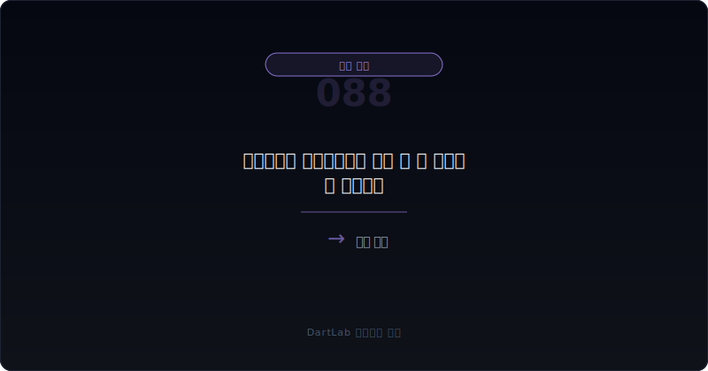
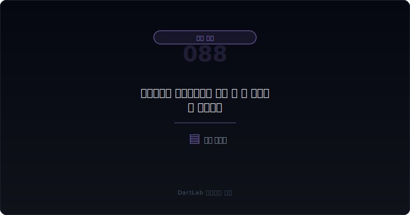
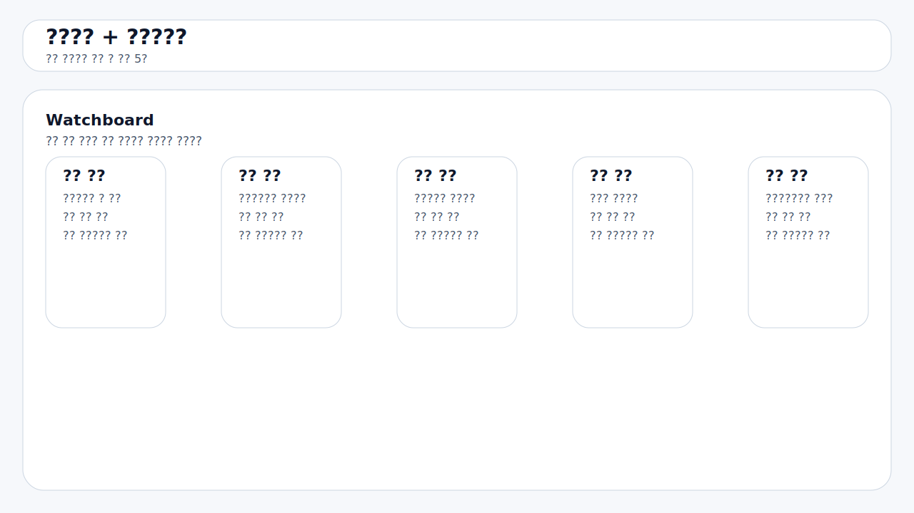

# 추가원가와 공사미수금이 함께 늘 때 무엇이 더 위험한가

프로젝트형 회사에서 추가원가가 늘어나는 것만으로도 부담은 커진다. 공사미수금이 늘어나는 것만으로도 회수 리스크는 높아진다. 하지만 **두 가지가 함께 움직이면 문제는 한 단계 더 무거워진다. `더 쓰고 있는데 못 받고 있다`는 뜻이 될 수 있기 때문이다.**

이 조합이 위험한 이유는 간단하다. 추가원가는 마진을 깎고, 공사미수금은 현금화를 늦춘다. 즉 하나는 손익을 약하게 만들고 다른 하나는 현금을 묶어 버린다. 그래서 둘이 같이 늘면 회사는 장부상 매출을 유지하더라도 실제 체력은 빠르게 약해질 수 있다.

이 글은 [공사손실충당부채는 언제 뒤늦게 크게 튀어나오나](/blog/construction-loss-provision-signals), [선수수익보다 미청구공사가 더 빨리 늘 때 무엇을 봐야 하나](/blog/unbilled-construction-vs-deferred-revenue), [수주잔고는 늘는데 왜 현금은 안 남나](/blog/order-backlog-vs-cash-flow), [매출 인식 시점 변경은 어디가 신호인가](/blog/revenue-recognition-timing-signals)의 다음 단계다. 여기서는 `추가원가`와 `공사미수금`이 동시에 커질 때 무엇을 더 먼저 의심해야 하는지 정리한다.

이 글은 이 조합을 `추가원가 원인 확인 -> 공사미수금 성격 분리 -> 계약자산·영업현금흐름 대조 -> 손실과 회수 중 무엇이 먼저 터지는지 판단 -> 다음 프로젝트와 반복성 추적` 순서로 읽는 방법을 설명한다.

---

## 왜 추가원가와 공사미수금이 같이 늘면 더 무겁게 봐야 하나

추가원가만 늘면 아직 해석의 여지가 있다. 일시적 자재비 상승, 설계 변경, 특정 현장 지연일 수 있다. 공사미수금만 늘면 청구 일정이나 발주처 결제 관행 문제일 수 있다. 하지만 둘이 같이 늘면 이야기가 달라진다. 회사는 예상보다 더 쓰고 있고, 그 비용을 회수할 속도는 느려지고 있다는 뜻일 수 있기 때문이다.

이때 가장 자주 나오는 착시는 `나중에 정산되면 된다`는 기대다. 회사는 추가원가 일부를 발주처에 전가하거나 클레임으로 회수할 수 있다고 설명할 수 있다. 하지만 공사미수금까지 같이 커지고 있다면, 그 기대는 이미 현금화 지연이라는 문제를 안고 있다. 즉 비용을 더 쓴 사실도 부담인데, 그 비용을 돌려받을 속도까지 느리면 위험은 더 커진다.

그래서 이 조합은 `마진 문제`와 `현금 문제`를 따로 보지 않고 같이 보는 것이 맞다. 둘이 동시에 악화되면 나중에 [공사손실충당부채는 언제 뒤늦게 크게 튀어나오나](/blog/construction-loss-provision-signals)로도 이어질 수 있다.

---

## 어떤 숫자 조합이 먼저 경고하나

| 먼저 볼 항목 | 왜 중요한가 |
| --- | --- |
| 추가원가 발생 이유 | 설계 변경, 지연, 원가 상승, 품질 문제인지 본다 |
| 공사미수금 성격 | 단순 결제 지연인지 분쟁성 채권인지 본다 |
| 계약자산·미청구공사 | 매출이 앞서 잡혔는지 확인한다 |
| 영업현금흐름 | 실제 현금이 따라오는지 본다 |
| 발주처 협의 | 추가원가 전가 가능성이 실질적인지 본다 |
| 후속 손실 인식 | 충당부채, 대손, 원가율 상승으로 이어지는지 본다 |

실전에서는 먼저 추가원가의 이유를 좁혀야 한다. 원재료 가격 급등처럼 외부 변수인지, 견적 실패나 공정 관리 문제처럼 내부 변수인지가 다르기 때문이다. 내부 변수 비중이 높을수록 구조적 위험에 가깝다.

그다음에는 공사미수금의 성격을 봐야 한다. 단순히 청구했지만 결제일이 남아 있는 채권과, 발주처와 다투고 있어 회수가 불확실한 채권은 전혀 다르다. 회수 불확실성이 높을수록 추가원가 부담은 더 무겁게 돌아온다. 이때 [매출채권과 대손충당금은 어떻게 읽어야 하나](/blog/receivables-and-allowance), [영업현금흐름이 순이익을 부정할 때](/blog/operating-cash-flow-vs-net-income)를 같이 보면 좋다.

---

## 신호가 강해지는 순서

핵심 질문은 이것이다. `이 회사는 비용이 먼저 흔들리는가, 회수가 먼저 막히는가, 아니면 둘이 동시에 무너지는가?`

관리 가능한 경우는 추가원가가 일시적이고 공사미수금 회수 일정이 비교적 명확한 경우다. 이런 상황에서는 비용 충격이 있어도 현금 회복 경로가 남아 있다.

경계 구간은 추가원가와 공사미수금이 모두 커지지만, 발주처 협의가 구체적이고 계약자산이나 현금흐름이 너무 심하게 무너지지 않는 경우다. 이때는 다음 분기 회수와 원가율을 반드시 다시 봐야 한다.

동시 악화 구조는 추가원가 원인이 반복되고, 공사미수금이 분쟁성으로 길어지며, 계약자산과 영업현금흐름까지 함께 악화되는 경우다. 이 조합이면 문제는 특정 현장 하나보다 `수주·집행·청구` 전체 프로세스에 가까울 수 있다.

---

## 위험도를 나누는 기준

| 관찰 포인트 | 상대적으로 관리 가능한 경우 | 더 조심해야 하는 경우 |
| --- | --- | --- |
| 추가원가 이유 | 일시적이고 범위가 좁다 | 여러 현장에서 반복된다 |
| 공사미수금 | 회수 일정이 비교적 명확하다 | 분쟁성·장기화 조짐이 있다 |
| 계약자산 | 빠르게 안정된다 | 계속 불어나거나 줄지 않는다 |
| 영업현금흐름 | 다음 분기에 회복된다 | 이익과 현금 괴리가 커진다 |
| 후속 숫자 | 충당부채·대손이 제한적이다 | 손실충당부채·대손이 뒤따른다 |

상대적으로 관리 가능한 경우는 추가원가가 생겨도 발주처와의 정산 경로가 분명하고, 공사미수금도 오래 묶이지 않는다. 반대로 더 조심해야 하는 경우는 비용도 더 쓰고, 청구도 밀리고, 회수도 늦고, 그 와중에 현금흐름까지 나빠지는 경우다.

즉 `비용 증가`와 `회수 지연` 중 하나만 있으면 관리 여지가 남을 수 있지만, 둘이 같이 붙으면 회사는 스스로 문제를 해결할 시간과 현금을 동시에 잃기 쉽다.

실전에서는 여기에 한 줄을 더 적어 두면 판단이 빨라진다. `이번 추가원가가 공정 후반 정산 문제인지, 공정 중 반복 설계 변경인지`를 구분하는 것이다. 후반 정산 문제는 시간이 지나면 정리될 수 있지만, 공정 중 반복 변경은 남은 현장들까지 같은 문제가 번질 수 있다. 그래서 추가원가와 공사미수금을 볼 때는 숫자만이 아니라 `문제가 끝나가는 국면인가, 아직 퍼지는 국면인가`를 함께 물어야 한다.

---

## 왜 공사미수금 단독 증가보다 추가원가가 같이 붙을 때 더 위험한가

공사미수금만 늘어나는 상황은 아직 설명 가능성이 남아 있다. 청구 타이밍, 검사 지연, 발주처 결제 주기 문제일 수 있기 때문이다. 하지만 여기에 추가원가가 붙는 순간 해석은 달라진다. 회사가 더 많은 자원을 투입했는데도 회수 속도는 느려진다는 뜻이기 때문이다.

이런 상태가 지속되면 회사는 두 가지 압박을 동시에 받는다. 하나는 예상 이익률이 낮아지는 압박이고, 다른 하나는 추가 운전자본이 묶이는 압박이다. 그래서 표면상 매출이 유지돼도 실제로는 프로젝트의 경제성이 빠르게 나빠질 수 있다.

결국 추가원가가 붙는 순간 공사미수금은 단순 채권이 아니라 `더 써야 했던 비용이 아직 못 돌아온 자리`로 읽어야 한다.

---

## 실전에서 가장 빨리 구분되는 조합은 무엇인가

가장 빨리 위험해지는 조합은 `추가원가 반복 + 공사미수금 증가 + 계약자산 확대 + 영업현금흐름 둔화`다. 여기에 발주처 협의 문구가 길어지고 실제 회수는 지연되면, 회사는 손실과 현금 압박을 동시에 안고 있을 가능성이 높다.

반대로 상대적으로 덜 무거운 조합은 `일시적 추가원가 + 단기 공사미수금 증가 + 다음 분기 회수 확인`이다. 이 경우에는 충격이 있어도 구조 문제로 바로 보지 않을 수 있다.

실전 메모는 다섯 줄이면 충분하다. `추가원가 이유`, `공사미수금 성격`, `계약자산`, `CFO`, `발주처 협의`. 이 다섯 줄을 함께 적으면 무엇이 더 먼저 터질지 빠르게 가를 수 있다.

---

## 왜 발주처 클레임 기대만으로 판단을 미루면 늦어지나

프로젝트형 회사는 문제가 생기면 자주 `향후 정산`, `변경 계약`, `발주처 협의`, `클레임 회수`를 이야기한다. 이런 설명이 틀린 것은 아니다. 하지만 투자자 입장에서는 기대보다 실현 속도가 더 중요하다. 클레임 기대가 진짜라면 시간이 갈수록 공사미수금과 계약자산이 안정되고, 현금흐름도 따라와야 한다.

반대로 설명은 계속되는데 추가원가와 공사미수금이 함께 커지고 있으면, 그 기대는 이미 장부를 떠받치는 가정에 가까울 수 있다. 그래서 이런 회사는 말보다 `얼마나 빨리 받고 있나`, `다음 분기에도 비용이 더 붙나`를 먼저 봐야 한다.

즉 발주처 협의는 해답이 아니라 가설일 수 있다. 숫자가 그 가설을 증명하지 못하면 보수적으로 읽는 편이 맞다.

---

## 다음 분기에 다시 확인할 숫자

| 이번에 본 것 | 다음에 다시 볼 것 |
| --- | --- |
| 추가원가 이유 | 같은 원인이 다시 반복되는가 |
| 공사미수금 | 실제 회수가 시작되는가 |
| 계약자산 | 줄어드는가, 더 늘어나는가 |
| 영업현금흐름 | 매출이 아니라 현금이 회복되는가 |
| 후속 인식 | 손실충당부채·대손으로 번지는가 |

추가원가와 공사미수금은 이번 분기 숫자보다 다음 분기 정리 여부가 더 중요하다. 둘 중 하나라도 빨리 풀리면 관리 가능성이 남지만, 둘 다 계속 나빠지면 구조 문제로 보는 편이 맞다.

특히 프로젝트형 회사는 분기 하나만 보면 항상 설명이 가능해 보인다. 그래서 다음 보고서에서는 문장보다 `실제 감소`를 확인해야 한다. 공사미수금이 줄었는지, 계약자산이 안정됐는지, 추가원가 원인이 다시 등장하지 않았는지 세 가지를 같이 보면 회사가 문제를 정리하는 중인지, 시간을 사는 중인지 구분하기 쉬워진다.

---

## 실전 점검 체크리스트

- 추가원가의 원인이 일시적인지 구조적인지 적었는가
- 공사미수금이 단순 결제 지연인지 분쟁성인지 구분했는가
- 계약자산·미청구공사와 같이 봤는가
- 영업현금흐름이 실제로 따라오는지 확인했는가
- 발주처 협의가 숫자로 증명되는지 추적할 계획을 세웠는가
- 손실과 회수 중 어느 쪽이 더 먼저 악화되는지 판단했는가

## 자주 묻는 질문

### 추가원가와 공사미수금이 같이 늘면 무조건 큰 문제인가

무조건은 아니다. 다만 비용 증가와 회수 지연이 동시에 나타나는 만큼 훨씬 보수적으로 봐야 한다.

### 무엇이 가장 빠른 위험 신호인가

계약자산 확대와 영업현금흐름 둔화가 같이 붙는 경우다.

### 발주처 협의 중이면 안심해도 되나

그렇지 않다. 협의는 기대일 뿐이고, 실제 회수와 원가 안정이 확인돼야 의미가 있다.

### 어디와 같이 읽으면 도움이 되나

공사손실충당부채, 미청구공사, 수주잔고, 매출 인식, 영업현금흐름 글과 같이 보면 좋다.

## 관련 분석 글

- [공사손실충당부채는 언제 뒤늦게 크게 튀어나오나](/blog/construction-loss-provision-signals)
- [선수수익보다 미청구공사가 더 빨리 늘 때 무엇을 봐야 하나](/blog/unbilled-construction-vs-deferred-revenue)
- [수주잔고는 늘는데 왜 현금은 안 남나](/blog/order-backlog-vs-cash-flow)
- [재고평가손실과 저가수주 압박은 어떻게 이어지나](/blog/inventory-write-downs-and-low-price-bidding)
- [매출 인식 시점 변경은 어디가 신호인가](/blog/revenue-recognition-timing-signals)
- [영업현금흐름이 순이익을 부정할 때](/blog/operating-cash-flow-vs-net-income)
- [매출채권과 대손충당금은 어떻게 읽어야 하나](/blog/receivables-and-allowance)

## 공식 출처와 근거

- [IFRS 15 Revenue from Contracts with Customers](https://www.ifrs.org/issued-standards/list-of-standards/ifrs-15-revenue-from-contracts-with-customers/)
- [IAS 37 Provisions, Contingent Liabilities and Contingent Assets](https://www.ifrs.org/issued-standards/list-of-standards/ias-37-provisions-contingent-liabilities-and-contingent-assets/)
- [DART 소개 - 보고서정보](https://dart.fss.or.kr/introduction/content2.do)
- [OpenDART XBRL 주석](https://opendart.fss.or.kr/disclosureinfo/fnltt/xbrlnote/main.do)

## 핵심 정리

추가원가와 공사미수금이 함께 늘면, 회사는 더 쓰고 있는데 더 늦게 받는 상황일 수 있다. 그래서 이 조합은 마진 악화와 현금 압박을 동시에 보여주는 신호가 된다.

핵심은 `얼마나 못 받았나`만 보는 것이 아니라 `왜 더 쓰게 됐고, 그 돈이 얼마나 늦게 돌아오고 있나`를 함께 묻는 것이다. 그 질문을 붙이면 프로젝트형 회사의 위험을 훨씬 더 빨리 읽게 된다.
