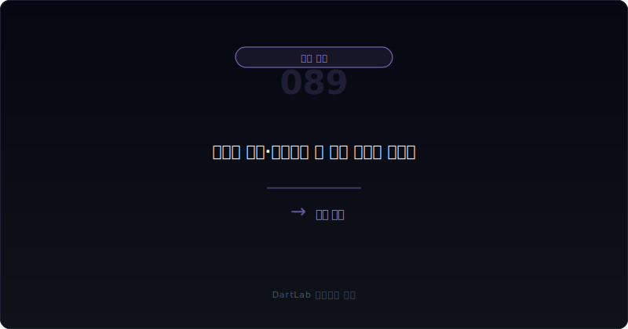
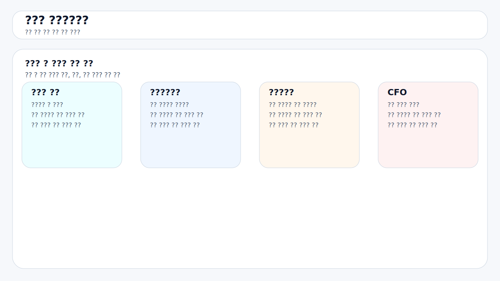
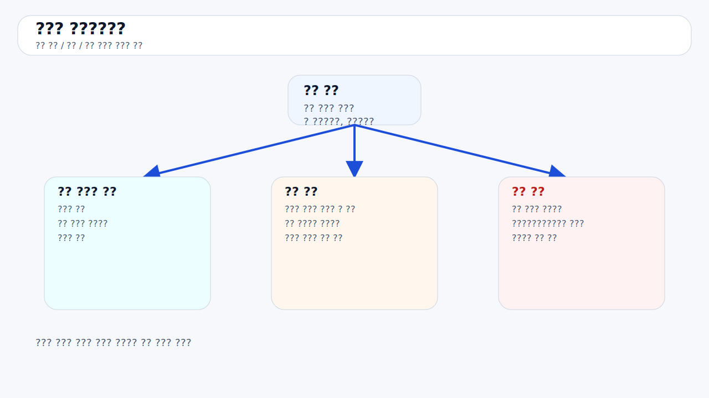
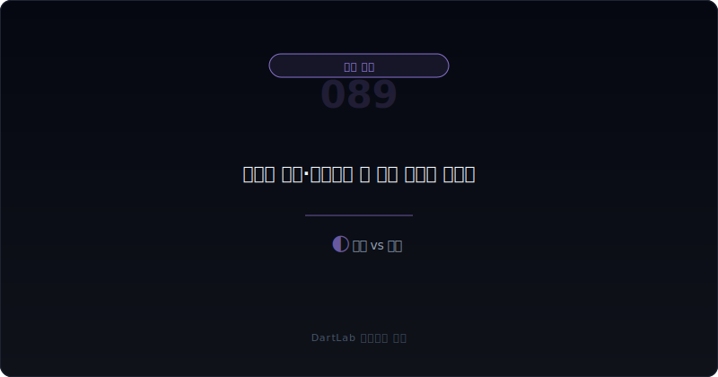
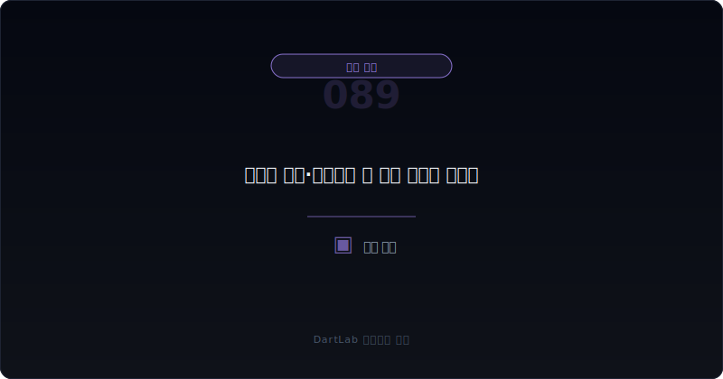

# 관계사 채권·대여금은 왜 본업 현금을 흐리나

손익은 괜찮아 보이는데 현금이 남지 않는 회사를 보면, 많은 사람이 운전자본이나 CAPEX부터 떠올린다. 하지만 실전에서는 `관계사 채권`과 `관계사 대여금`이 본업 현금을 조용히 잡아먹는 경우도 적지 않다. **회사가 본업에서 벌어들인 현금을 관계사 지원, 임시 자금대여, 내부 정산 지연에 쓰고 있다면, 겉보기 이익과 실제 남는 현금의 의미는 달라질 수 있다.**

이 조합이 중요한 이유는 본업과 비본업 경계를 흐리기 때문이다. 관계사 매출은 적어도 손익계산서에서 보이지만, 관계사 대여금과 채권은 자산 항목 안에서 비교적 조용히 커질 수 있다. 그래서 투자자는 이 숫자를 그냥 `그룹 내부 정리`로 넘기기 쉽다. 하지만 현금이 왜 밖으로 나갔는지, 언제 돌아오는지, 실제로 돌아온 적이 있는지를 물어야 해석이 달라진다.

이 글은 [관계사 매출 비중이 높을 때 본업 숫자는 어떻게 왜곡되나](/blog/related-party-sales-distortion), [관계사 자산 매각 이익은 왜 더 조심해야 하나](/blog/related-party-asset-sale-gains), [영업현금흐름이 순이익을 부정할 때](/blog/operating-cash-flow-vs-net-income), [대주주와 특수관계인 거래는 무엇을 먼저 봐야 하나](/blog/major-shareholder-and-related-parties)의 다음 단계다. 여기서는 `관계사 채권·대여금`이 현금 해석을 어떻게 바꾸는지 정리한다.

이 글은 관계사 채권·대여금을 `상대방 확인 -> 왜 돈이 나갔는지 분류 -> 만기와 회수 이력 점검 -> 충당금·현금흐름 대조 -> 본업과 분리해 판단` 순서로 읽는 방법을 설명한다.

---

## 왜 관계사 채권과 대여금은 손익보다 현금 해석을 더 크게 바꾸나

관계사 채권과 대여금은 손익계산서에 즉시 큰 흔적을 남기지 않을 수 있다. 그래서 회사는 매출, 영업이익, 순이익이 비교적 안정적으로 보일 수 있다. 하지만 자산 쪽에서 관계사 자금 지원이 커지고 있다면, 본업이 만든 현금이 그룹 내부 다른 곳을 떠받치는 데 쓰이고 있을 수 있다.

이 경우 투자자가 놓치기 쉬운 질문은 `이 돈이 본업 확장에 쓰인 것인가, 아니면 관계사 버팀목으로 나간 것인가`다. 후자라면 본업 숫자는 멀쩡해 보여도 실제 주주가 가져갈 수 있는 현금은 줄어든다. 특히 회수 시점이 불분명하거나 계속 연장되면 그 채권은 단순 자산이 아니라 `현금 유출의 흔적`으로 읽는 편이 맞다.

즉 관계사 채권·대여금은 이익률보다 현금 배분의 방향을 보여준다. 그래서 이 숫자는 작아 보여도 해석은 생각보다 무거울 수 있다.

---

## 구조가 작동하는 순서

| 먼저 볼 항목 | 왜 중요한가 |
| --- | --- |
| 상대방 관계 | 누구를 왜 지원하는지 본다 |
| 발생 이유 | 매출채권, 운영자금 대여, 보증 이행 등 성격을 가른다 |
| 만기·이자 조건 | 형식적 채권인지 실질 회수 채권인지 본다 |
| 회수 이력 | 실제로 줄어든 적이 있는지 확인한다 |
| 충당금·손상 | 회수 불확실성이 반영됐는지 본다 |
| 영업현금흐름 | 본업 현금이 관계사 지원으로 새는지 본다 |

실전에서는 먼저 상대방을 적어야 한다. 핵심 자회사인지, 부실 관계사인지, 특수목적회사인지에 따라 해석이 달라진다. 그다음에는 왜 돈이 나갔는지 본다. 매출채권이면 거래 구조를 봐야 하고, 대여금이면 사실상 금융 지원인지 운영상 브리지인지 구분해야 한다.

그다음에는 만기와 회수 이력을 붙여 봐야 한다. 계약서상 만기가 짧아도 실제로 매번 연장되면 그건 단기 채권이 아니라 사실상 상시 지원일 수 있다. 이 부분은 [지급보증·담보·약정은 어디서 위험 신호가 보이나](/blog/guarantees-collateral-and-commitments), [매출채권과 대손충당금은 어떻게 읽어야 하나](/blog/receivables-and-allowance)와 같이 보면 더 잘 보인다.

---

## 어디에서 왜곡이 생기나

핵심 질문은 이것이다. `이 관계사 채권·대여금은 정상적인 내부 운영의 일부인가, 아니면 본업 현금을 다른 곳에 묶어 두는 구조인가?`

정상 운영에 가까운 경우는 발생 이유가 명확하고, 상대방이 핵심 운영 축이며, 회수 이력이 꾸준하고, 영업현금흐름과 큰 충돌이 없는 경우다. 이런 상황에서는 그룹 운영상 필요한 자금 순환일 수 있다.

경계 구간은 채권과 대여금이 다소 커졌지만 만기·이자·회수 계획이 비교적 구체적인 경우다. 이때는 다음 분기 실제 회수 여부가 핵심이다.

현금 왜곡 구조로 읽어야 하는 경우는 관계사 채권·대여금이 커지는데 회수는 느리고, 만기는 반복 연장되고, 충당금은 약하며, 본업 현금흐름까지 약한 경우다. 이 조합이면 회사는 이익을 내고도 현금을 관계사에 묶어 두고 있을 수 있다.

---

## 왜곡을 걸러내는 숫자 조합

| 관찰 포인트 | 상대적으로 관리 가능한 경우 | 더 조심해야 하는 경우 |
| --- | --- | --- |
| 상대방 | 핵심 운영 관계사다 | 부실·비핵심 관계사다 |
| 만기 구조 | 짧고 실제 회수가 있다 | 연장이 반복된다 |
| 이자·조건 | 비교적 명확하다 | 느슨하거나 설명이 약하다 |
| 충당금 | 보수적으로 반영된다 | 거의 없거나 늦다 |
| 현금흐름 | 본업 현금이 안정적이다 | 현금이 약한데 지원이 계속된다 |

상대적으로 관리 가능한 경우는 관계사 자금 지원이 있어도 회수와 운영 목적이 분명하다. 반대로 더 조심해야 하는 경우는 돈이 나간 이유는 많지만 돌아온 기록은 약하고, 회수 불확실성도 장부에 늦게 반영되는 경우다.

특히 [관계사 매출 비중이 높을 때 본업 숫자는 어떻게 왜곡되나](/blog/related-party-sales-distortion), [관계사 자산 매각 이익은 왜 더 조심해야 하나](/blog/related-party-asset-sale-gains), [대주주와 특수관계인 거래는 무엇을 먼저 봐야 하나](/blog/major-shareholder-and-related-parties)까지 같이 보면 한 회사의 관계사 의존 구조가 손익, 자산, 현금 전체를 어떻게 흔드는지 더 잘 보인다.

여기서 한 단계 더 들어가면 `관계사에 돈이 나가는 방향이 한쪽으로만 계속 누적되는가`를 확인해야 한다. 매출, 대여금, 보증, 자산 거래가 모두 같은 관계사로 모이면 숫자는 각각 따로 보이지만 실질 위험은 한곳에 쏠릴 수 있다. 이런 구조는 한 번 문제가 터지면 손익, 자산건전성, 현금흐름이 동시에 흔들리기 쉽다.

---

## 왜 만기보다 돈이 나간 이유를 먼저 봐야 하나

많은 사람이 관계사 대여금을 보면 만기와 이자율부터 확인한다. 물론 중요하다. 하지만 그보다 먼저 봐야 할 것은 `왜 이 돈이 나갔는가`다. 이유가 불분명하면 만기와 이자율이 좋아 보여도 해석은 가벼워지지 않는다.

예를 들어 일시적 결제 브리지를 위해 나간 돈과, 반복적으로 부실 관계사를 떠받치기 위해 나간 돈은 전혀 다르다. 둘 다 1년 만기일 수 있지만 실질은 다르다. 그래서 관계사 채권·대여금은 계약 조건보다 자금의 목적과 반복성을 먼저 기록하는 편이 실전적이다.

결국 이유가 약한 자금 지원은 회수 계획이 있어도 쉽게 믿기 어렵다. 반대로 목적이 명확하고 실제 회수가 확인되면 숫자를 더 가볍게 볼 수 있다.

---

## 실전에서 가장 빨리 구분되는 조합은 무엇인가

가장 빨리 위험해지는 조합은 `관계사 채권·대여금 증가 + 회수 연장 반복 + 충당금 약함 + 영업현금흐름 약화`다. 여기에 [지급보증·담보·약정은 어디서 위험 신호가 보이나](/blog/guarantees-collateral-and-commitments)에서 보증이나 담보까지 붙으면, 관계사 지원 구조는 더 무거워진다.

반대로 상대적으로 덜 무거운 조합은 `단기 증가 + 회수 확인 + 목적 명확 + 본업 현금 안정`이다. 이런 경우는 운영상 필요 자금으로 볼 여지가 있다.

실전 메모는 다섯 줄이면 충분하다. `상대`, `이유`, `만기`, `회수`, `CFO`. 이 다섯 줄을 적으면 관계사 채권·대여금이 본업 현금을 얼마나 흐리는지 빠르게 보인다.

---

## 왜 대손충당금이 아직 없다고 안심하면 안 되나

관계사 채권과 대여금은 늦게까지 멀쩡해 보일 수 있다. 그룹 내부 거래라는 이유로 회수 가능성을 낙관적으로 보거나, 실질 위험을 장부에 늦게 반영할 수 있기 때문이다. 그래서 충당금이 아직 작다고 해서 안전하다고 보면 안 된다.

중요한 것은 충당금이 아니라 회수의 실제 기록이다. 몇 년째 연장만 되고 있거나, 본업 현금이 약한데도 계속 돈이 묶여 있다면 그 자산은 이미 현금 관점에서 약해졌을 수 있다. 장부 반영은 나중에 따라오는 경우가 많다.

즉 충당금은 종착점일 수 있다. 그 전에 현금이 이미 묶이고 있다는 사실을 먼저 읽는 것이 더 중요하다.

---

## 놓치기 쉬운 예외

| 이번에 본 것 | 다음에 다시 볼 것 |
| --- | --- |
| 채권·대여금 잔액 | 실제로 줄어드는가 |
| 만기 구조 | 다시 연장되는가 |
| 충당금 | 보수화가 시작되는가 |
| 영업현금흐름 | 본업 현금이 회복되는가 |
| 관계사 구조 | 추가 지원이 더 붙는가 |

관계사 채권·대여금은 이익보다 현금과 회수의 문제다. 그래서 다음 보고서에서 가장 먼저 봐야 할 것은 손익이 아니라 `정말 돈이 돌아왔는가`다.

같은 맥락에서 주석 문구가 조금 바뀌는지도 중요하다. 회수 예정, 만기 연장, 담보 설정, 대손 인식 같은 표현이 하나씩 붙기 시작하면 회사가 관계사 지원을 정상 거래가 아니라 관리 이슈로 다루기 시작했다는 뜻일 수 있다. 그래서 숫자 변화와 함께 설명 문구의 무게도 같이 추적하는 편이 좋다.

또 하나 중요한 것은 회수가 일부만 이뤄져도 바로 안심하지 않는 것이다. 관계사 채권과 대여금은 소액 상환으로 장부를 잠시 안정시킬 수 있지만, 큰 잔액이 계속 남아 있으면 현금 왜곡 구조는 그대로일 수 있다. 그래서 다음 보고서에서는 줄었는지보다 `얼마나 의미 있게 줄었는가`, `같은 관계사에 다시 돈이 나가지 않았는가`를 함께 봐야 한다.

결국 이 항목은 재무상태표의 숫자 하나가 아니라 자금 배분의 우선순위를 보여주는 신호다. 본업 투자와 차입 상환보다 관계사 지원이 먼저라면, 회사는 눈에 보이는 이익과 별개로 현금 선택지를 스스로 좁히고 있을 수 있다. 이런 회사는 경기 둔화나 차환 압박이 오면 생각보다 빠르게 설명이 바뀌기 쉽다.

---

## 빠른 점검 체크리스트

- 상대방 관계사를 정확히 적었는가
- 왜 돈이 나갔는지 이유를 구분했는가
- 만기와 회수 이력이 실제로 지켜졌는지 확인했는가
- 충당금보다 현금 회수 사실을 먼저 봤는가
- 영업현금흐름이 약한데 지원이 커지는지 확인했는가
- 이 자산이 본업과 무관한 현금 묶임인지 판단했는가

## 자주 묻는 질문

### 관계사 채권·대여금이 있으면 무조건 나쁜가

그렇지는 않다. 다만 목적, 회수 이력, 현금 여력과 같이 봐야 한다.

### 무엇이 가장 무거운 신호인가

회수 연장이 반복되고 본업 현금이 약한데도 지원이 계속되는 경우다.

### 충당금이 아직 없으면 안전한가

아니다. 회수가 실제로 이뤄지는지가 더 중요하다.

### 어디와 같이 읽으면 도움이 되나

관계사 매출, 특수관계인 거래, 보증·담보, 영업현금흐름, 채권 글과 같이 보면 좋다.

## 구조를 더 깊이 이해하는 글

- [관계사 매출 비중이 높을 때 본업 숫자는 어떻게 왜곡되나](/blog/related-party-sales-distortion)
- [관계사 자산 매각 이익은 왜 더 조심해야 하나](/blog/related-party-asset-sale-gains)
- [영업현금흐름이 순이익을 부정할 때](/blog/operating-cash-flow-vs-net-income)
- [대주주와 특수관계인 거래는 무엇을 먼저 봐야 하나](/blog/major-shareholder-and-related-parties)
- [지급보증·담보·약정은 어디서 위험 신호가 보이나](/blog/guarantees-collateral-and-commitments)
- [매출채권과 대손충당금은 어떻게 읽어야 하나](/blog/receivables-and-allowance)
- [관계기업·공동기업투자는 본업 숫자를 어떻게 흐리나](/blog/associates-joint-ventures-and-equity-method)

## 참고 자료

- [IAS 24 Related Party Disclosures](https://www.ifrs.org/issued-standards/list-of-standards/ias-24-related-party-disclosures/)
- [IFRS 9 Financial Instruments](https://www.ifrs.org/issued-standards/list-of-standards/ifrs-9-financial-instruments/)
- [DART 소개 - 보고서정보](https://dart.fss.or.kr/introduction/content2.do)
- [OpenDART XBRL 주석](https://opendart.fss.or.kr/disclosureinfo/fnltt/xbrlnote/main.do)

## 핵심 구조 요약

관계사 채권·대여금은 장부상 자산이지만, 현금 관점에서는 본업에서 만든 돈이 다른 곳에 묶여 있는 흔적일 수 있다. 그래서 이 숫자는 손익보다 회수와 목적을 먼저 봐야 한다.

핵심은 `얼마가 나갔나`보다 `왜 나갔고 언제 정말 돌아오나`를 묻는 것이다. 그 질문을 붙이면 본업 현금의 왜곡을 훨씬 더 정확하게 읽게 된다.
