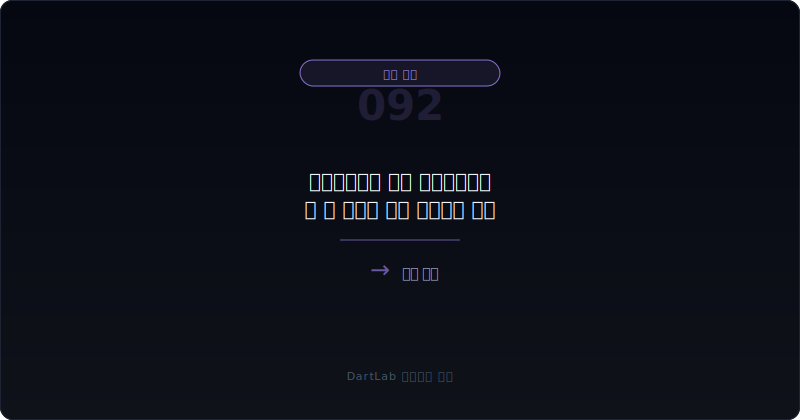
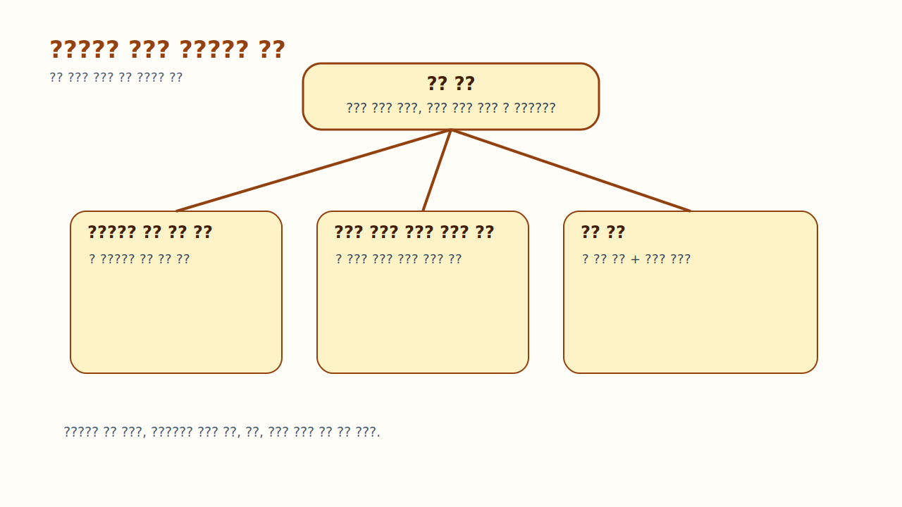
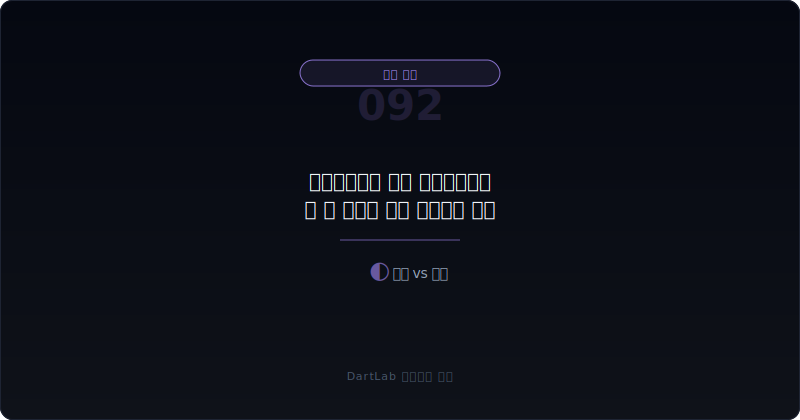
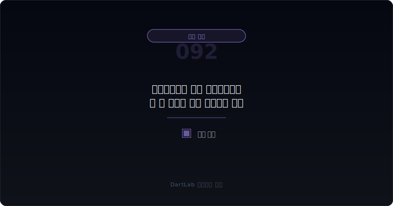

# 공사선수금은 줄고 공사미수금은 늘 때 무엇을 먼저 의심해야 하나

프로젝트형 회사에서 공사선수금이 줄고 공사미수금이 늘면, 많은 사람은 그냥 청구 타이밍 문제라고 넘긴다. 하지만 **실전에서는 이 조합을 `현금 버퍼가 사라지고 회사 쪽 선투입 부담이 커지는 방향`으로 먼저 읽어야 한다. 발주처가 먼저 줬던 돈은 줄고, 회사가 나중에 받아야 할 돈은 늘어난다면 프로젝트의 체감 난이도는 생각보다 빠르게 높아질 수 있다.**

이 조합이 무거운 이유는 선수금과 미수금이 현금의 방향을 반대로 말해주기 때문이다. 선수금은 고객이 먼저 준 돈이고, 공사미수금은 회사가 먼저 집행하고 아직 받지 못한 돈에 가깝다. 따라서 하나는 버퍼를 만들고, 다른 하나는 버퍼를 소모한다. 둘이 동시에 나빠지면 매출이나 수주잔고가 괜찮아 보여도 실제 유동성은 약해질 수 있다.

이 글은 [추가원가와 공사미수금이 함께 늘 때 무엇이 더 위험한가](/blog/additional-costs-and-construction-receivables), [선수수익보다 미청구공사가 더 빨리 늘 때 무엇을 봐야 하나](/blog/unbilled-construction-vs-deferred-revenue), [선수금·계약부채는 좋은 신호인가 위험 신호인가](/blog/advance-payments-and-contract-liabilities), [수주잔고는 늘는데 왜 현금은 안 남나](/blog/order-backlog-vs-cash-flow)의 다음 단계다. 여기서는 `공사선수금 감소 + 공사미수금 증가`를 어떤 순서로 읽어야 하는지 정리한다.

이 글은 이 조합을 `선수금 감소 이유 확인 -> 공사미수금 성격 분리 -> 계약조건·청구 속도 점검 -> 영업현금흐름과 같이 대조 -> 다음 분기 회복 여부 추적` 순서로 읽는 방법을 설명한다.

---

## 왜 이 조합은 현금 버퍼 악화로 먼저 읽어야 하나

공사선수금은 프로젝트 회사에 매우 중요한 버퍼다. 발주처가 미리 준 돈이 있으면 회사는 재료비, 외주비, 현장비를 일부 선제적으로 감당할 수 있다. 반대로 공사미수금은 이미 나간 돈이 아직 돌아오지 않은 상태에 가깝다. 그래서 선수금이 줄고 미수금이 늘면, 회사는 이전보다 더 많은 자금을 자기 돈이나 차입으로 메워야 할 수 있다.

이때 흔한 착시는 `매출이 유지되니 괜찮다`는 판단이다. 하지만 매출은 진행 기준으로 잡혀도 현금은 다르게 움직일 수 있다. 선수금이 줄어드는 와중에 미수금이 늘면, 회사는 같은 매출을 올리면서도 현금을 덜 받고 더 오래 묶이는 구조로 바뀔 수 있다.

따라서 이 조합은 단순한 운전자본 변동이 아니라 `프로젝트 주도권이 발주처 쪽으로 기울고 있는가`를 보여주는 신호일 수 있다. 발주처가 더 늦게 주고, 더 나중에 정산하고, 회사가 더 오래 버텨야 하는 구조라면 해석은 훨씬 무거워진다.

---

## 어떤 숫자 조합이 먼저 경고하나

| 먼저 볼 항목 | 왜 중요한가 |
| --- | --- |
| 선수금 감소 이유 | 프로젝트 마무리인지 조건 변화인지 본다 |
| 공사미수금 성격 | 정상 회수 지연인지 분쟁성인지 본다 |
| 청구·정산 조건 | 청구 시점이 뒤로 밀렸는지 확인한다 |
| 계약자산·미청구공사 | 매출이 앞서 잡혔는지 본다 |
| 영업현금흐름 | 실제 현금이 같이 약해지는지 본다 |
| 추가원가·충당부채 | 손실이 뒤따르는지 본다 |

실전에서는 먼저 선수금이 왜 줄었는지 적어야 한다. 공사 후반으로 가면서 자연스럽게 줄어드는 것인지, 아니면 발주처가 더 이상 먼저 돈을 주지 않는 구조로 바뀌었는지가 다르기 때문이다. 전자는 정상일 수 있지만, 후자는 프로젝트 협상력 변화일 수 있다.

그다음에는 공사미수금의 성격을 붙인다. 검사 지연, 승인 지연, 분쟁, 설계 변경, 클레임 정산 등 원인이 다르면 해석도 달라진다. 이때 [매출 인식 시점 변경은 어디가 신호인가](/blog/revenue-recognition-timing-signals), [영업현금흐름이 순이익을 부정할 때](/blog/operating-cash-flow-vs-net-income), [공사손실충당부채는 언제 뒤늦게 크게 튀어나오나](/blog/construction-loss-provision-signals)까지 함께 보면 버퍼가 사라지는 이유를 더 빨리 가를 수 있다.

---

## 신호가 강해지는 순서

핵심 질문은 이것이다. `선수금 감소가 정상 소진인가, 아니면 회사가 더 불리한 조건으로 프로젝트를 끌고 가는 신호인가?`

정상 소진에 가까운 경우는 프로젝트 후반으로 가며 선수금이 줄고, 그와 함께 공사미수금도 빠르게 회수되거나 계약자산이 안정되는 경우다. 이런 경우는 진행 단계 변화일 수 있다.

경계 구간은 선수금은 줄지만 공사미수금 증가 폭이 제한적이고, 영업현금흐름도 아주 크게 무너지지 않는 경우다. 이때는 다음 분기 청구와 회수 속도를 꼭 확인해야 한다.

현금 버퍼 악화 구조는 선수금이 줄고, 공사미수금이 늘고, 계약자산과 영업현금흐름까지 함께 흔들리는 경우다. 여기에 추가원가나 저가수주 압박이 붙으면 회사는 `받는 속도`와 `쓰는 속도` 모두에서 밀릴 수 있다.

---

## 위험도를 나누는 기준

| 관찰 포인트 | 상대적으로 관리 가능한 경우 | 더 조심해야 하는 경우 |
| --- | --- | --- |
| 선수금 감소 이유 | 자연스러운 공정 진행이다 | 계약 조건이 불리하게 바뀐다 |
| 공사미수금 | 단기 회수가 가능하다 | 장기화·분쟁성 조짐이 있다 |
| 계약자산 | 빠르게 안정된다 | 계속 불어난다 |
| 영업현금흐름 | 일시 둔화 후 회복된다 | 매출과 괴리가 커진다 |
| 후속 손실 | 제한적이다 | 추가원가·충당부채가 붙는다 |

상대적으로 관리 가능한 경우는 발주처가 먼저 준 돈이 줄어도 회사가 곧 청구와 회수로 빈자리를 메운다. 반대로 더 조심해야 하는 경우는 발주처가 먼저 주던 돈은 줄었는데, 회사는 더 오래 기다려야 하고, 그 사이 비용도 더 든다.

실전에서는 `선수금이 줄었다`는 사실 하나보다 `그 빈자리를 무엇이 메우고 있는가`를 같이 봐야 한다. 그 자리를 영업현금흐름이 메우면 덜 무겁고, 차입과 미수금이 메우면 해석은 무거워진다.

---

## 왜 수주잔고 증가가 이 신호를 덮지 못하나

많은 회사가 이런 상황에서 수주잔고를 강조한다. 앞으로 할 일이 많으니 결국 괜찮아질 것처럼 말한다. 하지만 수주잔고는 미래 일감이고, 선수금과 공사미수금은 현재 현금 구조다. 미래 일감이 현재 현금 압박을 자동으로 해결해 주지는 않는다.

특히 수주잔고가 늘어도 신규 계약이 선수금 없이 시작되거나, 기존 프로젝트의 정산이 늦어지면 회사는 더 많은 현금을 스스로 넣어야 한다. 그러면 `일은 많다`와 `돈은 돈다`가 완전히 다른 문장이 된다.

따라서 수주잔고는 보조 지표로만 보고, 이 조합이 나타날 때는 먼저 `누가 먼저 돈을 내고 있는가`를 따져야 한다. 그 답이 회사 쪽으로 기울면 리스크는 이미 커지고 있다.

---

## 실전에서 가장 빨리 구분되는 조합은 무엇인가

가장 빨리 위험해지는 조합은 `공사선수금 감소 + 공사미수금 증가 + 계약자산 확대 + 영업현금흐름 둔화`다. 여기에 [추가원가와 공사미수금이 함께 늘 때 무엇이 더 위험한가](/blog/additional-costs-and-construction-receivables)에서 본 추가원가가 붙으면, 손실과 현금 압박이 동시에 커질 수 있다.

반대로 상대적으로 덜 무거운 조합은 `선수금 감소 + 공정 마무리 + 미수금 단기 회수 + 다음 분기 현금 회복`이다. 이런 경우에는 단순한 단계 변화로 볼 여지가 있다.

실전 메모는 다섯 줄이면 충분하다. `선수금 감소 이유`, `미수금 성격`, `청구 조건`, `계약자산`, `CFO`. 이 다섯 줄을 적으면 프로젝트 현금 버퍼가 사라지는지 빠르게 읽을 수 있다.

---

## 왜 발주처와 계약 조건 변화 문구를 같이 읽어야 하나

숫자만 보면 선수금과 미수금의 움직임만 보인다. 하지만 실제 이유는 계약 조건 변화에 숨어 있는 경우가 많다. 발주처가 선지급을 줄였는지, 검수 기준을 더 엄격하게 바꿨는지, 정산 절차가 길어졌는지가 중요하다.

이런 조건 변화는 처음에는 문장으로만 보일 수 있다. 하지만 시간이 지나면 미수금과 계약자산, 영업현금흐름에서 숫자로 드러난다. 그래서 숫자가 나빠졌을 때 이유를 뒤늦게 찾기보다, 처음부터 계약 조건 변화 문구를 같이 읽는 편이 좋다.

즉 이 조합은 숫자만의 문제가 아니다. 발주처와 회사 사이 `돈이 움직이는 규칙`이 바뀌고 있다는 뜻일 수 있다.

---

## 다음 분기에 다시 확인할 숫자

| 이번에 본 것 | 다음에 다시 볼 것 |
| --- | --- |
| 선수금 감소 | 계속 줄어드는가, 안정되는가 |
| 공사미수금 | 실제 회수가 시작되는가 |
| 계약자산 | 줄어드는가, 더 늘어나는가 |
| 영업현금흐름 | 프로젝트 현금 구조가 회복되는가 |
| 손실 인식 | 추가원가·충당부채가 붙는가 |

이 조합은 이번 분기 숫자만 보면 과장되거나 축소되기 쉽다. 그래서 다음 보고서에서 가장 먼저 봐야 할 것은 `선수금이 다시 늘었는가`보다 `미수금이 실제로 줄었는가`다. 줄지 않으면 회사 쪽 선투입 부담은 계속 남아 있을 가능성이 높다.

또한 이번 글과 [선수금·계약부채는 좋은 신호인가 위험 신호인가](/blog/advance-payments-and-contract-liabilities)을 같이 보면, 선수금이 늘 때와 줄 때 해석이 어떻게 완전히 달라지는지 더 잘 보인다.

실전에서는 이 구간에서 회사의 차입 의존도가 같이 올라가는지 보는 것도 중요하다. 발주처가 먼저 주던 돈이 줄면, 그 빈자리를 회사 현금이나 차입이 메우는 경우가 많기 때문이다. 그래서 선수금 감소와 미수금 증가가 함께 나타나면 재무상태표의 차입과 이자 부담도 같이 살펴보는 편이 좋다.

결국 이 조합은 단순한 프로젝트 진행 문제가 아니라 `누가 먼저 돈을 내고 있는가`의 문제다. 이전에는 발주처가 일부를 앞서 부담했는데 지금은 회사가 더 오래 버티고 있다면, 같은 매출이라도 체감 위험은 훨씬 커질 수 있다.

---

## 실전 점검 체크리스트

- 선수금 감소가 정상 진행인지 조건 변화인지 적었는가
- 공사미수금이 단순 지연인지 분쟁성인지 구분했는가
- 계약자산·미청구공사와 같이 봤는가
- 영업현금흐름이 실제로 약해지는지 확인했는가
- 추가원가나 손실충당부채가 붙는지 확인했는가
- 발주처가 먼저 내던 돈을 회사가 대신 메우는 구조인지 판단했는가

## 자주 묻는 질문

### 공사선수금이 줄고 공사미수금이 늘면 무조건 위험한가

무조건은 아니다. 다만 현금 버퍼가 약해지는 방향이므로 더 보수적으로 봐야 한다.

### 무엇이 가장 빠른 위험 신호인가

계약자산 확대와 영업현금흐름 둔화가 같이 붙는 경우다.

### 수주잔고가 많으면 안심해도 되나

아니다. 수주잔고는 미래 일감이고, 현재 현금 압박을 바로 해결해 주지는 않는다.

### 어디와 같이 읽으면 도움이 되나

088, 080, 041, 076, 084, 068과 같이 보면 프로젝트 현금 구조를 더 잘 읽을 수 있다.

## 관련 분석 글

- [추가원가와 공사미수금이 함께 늘 때 무엇이 더 위험한가](/blog/additional-costs-and-construction-receivables)
- [선수수익보다 미청구공사가 더 빨리 늘 때 무엇을 봐야 하나](/blog/unbilled-construction-vs-deferred-revenue)
- [선수금·계약부채는 좋은 신호인가 위험 신호인가](/blog/advance-payments-and-contract-liabilities)
- [수주잔고는 늘는데 왜 현금은 안 남나](/blog/order-backlog-vs-cash-flow)
- [공사손실충당부채는 언제 뒤늦게 크게 튀어나오나](/blog/construction-loss-provision-signals)
- [매출 인식 시점 변경은 어디가 신호인가](/blog/revenue-recognition-timing-signals)
- [영업현금흐름이 순이익을 부정할 때](/blog/operating-cash-flow-vs-net-income)

## 공식 출처와 근거

- [IFRS 15 Revenue from Contracts with Customers](https://www.ifrs.org/issued-standards/list-of-standards/ifrs-15-revenue-from-contracts-with-customers/)
- [IAS 7 Statement of Cash Flows](https://www.ifrs.org/issued-standards/list-of-standards/ias-7-statement-of-cash-flows/)
- [DART 소개 - 보고서정보](https://dart.fss.or.kr/introduction/content2.do)
- [OpenDART XBRL 주석](https://opendart.fss.or.kr/disclosureinfo/fnltt/xbrlnote/main.do)

## 핵심 정리

공사선수금이 줄고 공사미수금이 늘면, 회사는 발주처가 먼저 대주던 현금 버퍼를 잃고 스스로 더 오래 버텨야 할 수 있다. 그래서 이 조합은 매출보다 현금 체력을 먼저 의심하게 만드는 신호다.

핵심은 `얼마나 받을 돈이 늘었나`만이 아니라 `왜 먼저 받던 돈은 줄고 나중에 받을 돈만 늘고 있나`를 묻는 것이다. 그 질문을 붙이면 프로젝트형 회사의 현금 구조 변화를 훨씬 더 빨리 읽게 된다.
