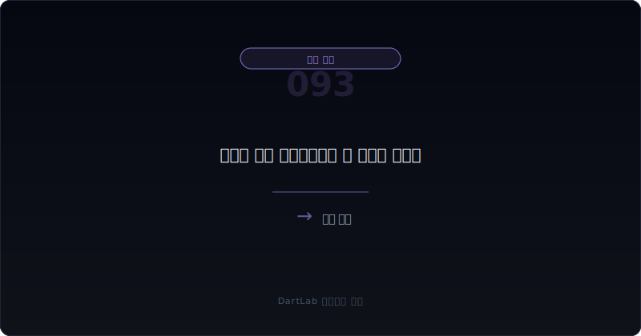
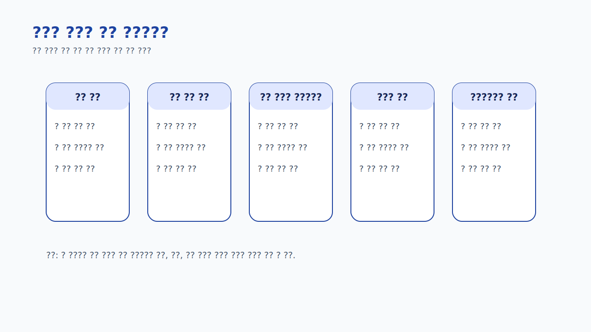
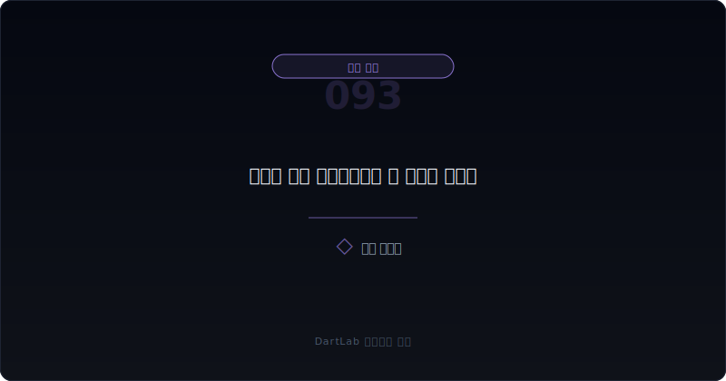
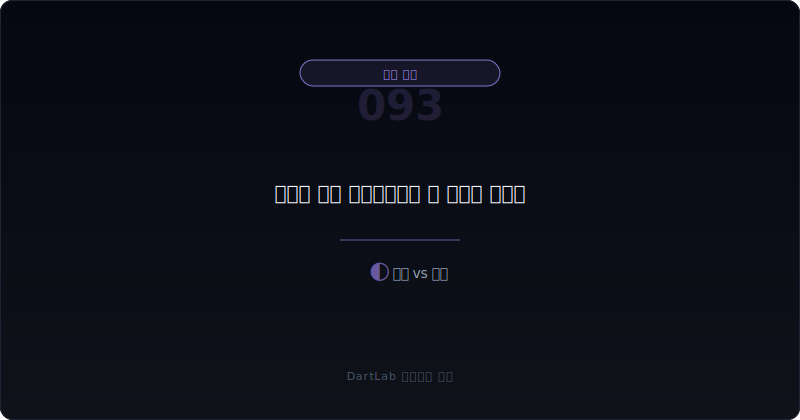
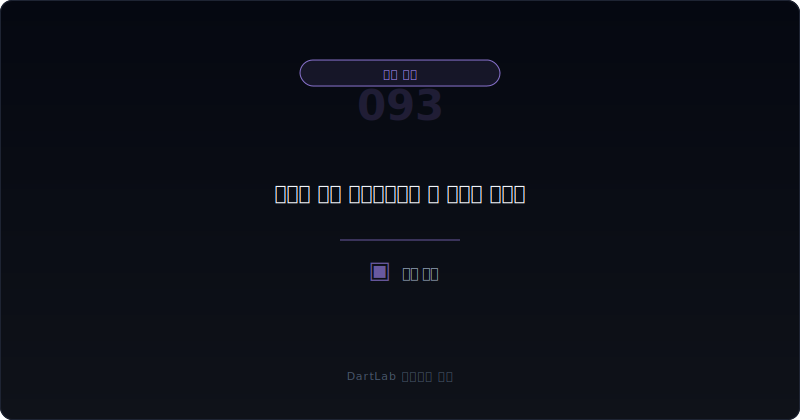

# 관계사 채권 대손충당금은 왜 뒤늦게 커지나

관계사 채권은 오랫동안 멀쩡해 보일 수 있다. 같은 그룹 안 거래라서 회수 가능성을 낙관적으로 보기 쉽고, 만기도 자주 연장되며, 당장 손실로 인식하지 않아도 설명이 가능하기 때문이다. 하지만 **실전에서는 이 자산이 오래 버티다가 어느 순간 갑자기 대손충당금이 커지는 경우가 적지 않다. 그 이유는 위험이 갑자기 생겨서가 아니라, 이미 쌓여 있던 회수 불확실성을 더 이상 늦출 수 없는 시점이 오기 때문이다.**

이 질문이 중요한 이유는 장부 반영 시점과 현금 현실이 다를 수 있기 때문이다. 관계사 채권은 몇 년 동안 같은 잔액이 유지되다가 어느 해 갑자기 손실이 인식될 수 있다. 많은 사람은 그 해에 문제가 생겼다고 생각하지만, 실제로는 오래전부터 현금 회수 가능성이 약해지고 있었을 수 있다.

이 글은 [관계사 채권·대여금은 왜 본업 현금을 흐리나](/blog/related-party-loans-and-receivables), [매출채권과 대손충당금은 어떻게 읽어야 하나](/blog/receivables-and-allowance), [관계사 자산 매각 이익은 왜 더 조심해야 하나](/blog/related-party-asset-sale-gains), [관계사 매출 비중이 높을 때 본업 숫자는 어떻게 왜곡되나](/blog/related-party-sales-distortion)의 다음 단계다. 여기서는 `왜 늦게 충당금이 커지는가`를 중심으로 읽는 방법을 정리한다.

이 글은 관계사 채권을 `잔액보다 연장 이력 확인 -> 회수 근거와 상대방 상태 점검 -> 충당금 반영 속도 비교 -> 현금흐름과 자금 지원 구조 대조 -> 어느 시점에 손실이 현실화되는지 추적` 순서로 읽는 방법을 설명한다.

---

## 왜 관계사 채권 대손충당금은 늦게 커지는 경우가 많나

관계사 채권은 일반 매출채권과 달리 회수 실패를 곧바로 인정하지 않는 경우가 많다. 이유는 간단하다. 거래 상대가 외부가 아니라 그룹 안에 있고, 경영진이 사업 정상화나 구조조정을 기대하며 시간을 벌 수 있기 때문이다. 그래서 장부상으로는 `조금 더 기다릴 수 있다`는 논리가 오래 유지되기 쉽다.

하지만 시간이 길어진다고 위험이 사라지는 것은 아니다. 만기 연장이 반복되고, 상대 관계사의 현금 사정이 나빠지고, 본업에서 만든 돈이 계속 그쪽에 묶이면 회수 가능성은 이미 약해져 있을 수 있다. 그럼에도 충당금이 늦게 붙는 이유는 기대와 현실의 차이를 장부가 나중에 따라가기 때문이다.

즉 대손충당금이 늦게 커지는 것은 회계가 갑자기 보수적으로 변한 사건일 수 있지만, 더 자주 나타나는 본질은 `이미 약해진 자산을 이제야 숫자로 인정한 결과`다.

---

## 최초 문서에서 잡아야 할 것

| 먼저 볼 항목 | 왜 중요한가 |
| --- | --- |
| 관계사 채권 잔액 | 문제의 규모를 본다 |
| 만기 연장 이력 | 계속 미뤄지는 자산인지 본다 |
| 상대 관계사 상태 | 회수 능력이 실제로 있는지 본다 |
| 회수 근거 문구 | 구체적 근거인지 기대 문장인지 본다 |
| 충당금 반영 속도 | 보수화가 늦었는지 본다 |
| 영업현금흐름 | 본업 현금이 같이 약한지 본다 |

실전에서는 잔액보다 만기 연장 이력을 먼저 적는 편이 좋다. 큰 잔액도 빨리 회수되면 해석이 가벼울 수 있지만, 작은 잔액도 몇 년째 연장만 반복되면 의미가 달라진다. 관계사 채권의 위험은 크기보다 `시간`에서 더 자주 드러난다.

그다음에는 상대 관계사의 상태를 붙여 봐야 한다. 영업이익, 현금흐름, 차입 압박, 자본 훼손, 추가 지원 필요 여부가 함께 보이면 회수 가능성을 더 현실적으로 읽을 수 있다. 이때 [자본잠식과 관리종목 신호는 어디서 먼저 보이나](/blog/capital-impairment-and-watchlist-signals), [차입 약정 위반과 기한이익상실 위험은 어디서 먼저 드러나나](/blog/debt-covenant-breach-and-acceleration-risk), [지급보증·담보·약정은 어디서 위험 신호가 보이나](/blog/guarantees-collateral-and-commitments)와 같이 보면 좋다.

---

## 후속 문서에서 바뀌는 것과 안 바뀌는 것

핵심 질문은 이것이다. `이 충당금은 갑자기 생긴 문제의 결과인가, 아니면 오래 미뤄온 회수 불확실성을 이제야 인정한 결과인가?`

정상 회수에 가까운 경우는 잔액이 일시적으로 커져도 실제 상환이 확인되고, 만기 연장이 제한적이며, 상대 관계사의 운영 상태가 비교적 안정적인 경우다. 이때는 충당금이 작아도 큰 문제가 아닐 수 있다.

경계 구간은 잔액이 유지되지만 일부 회수와 일부 연장이 섞이고, 충당금도 아주 크지 않은 경우다. 이때는 다음 분기나 다음 해의 실제 상환이 중요하다.

늦은 손실 현실화로 읽어야 하는 경우는 연장이 반복되고, 회수는 거의 없고, 상대 관계사는 약해지는데, 충당금은 오랫동안 작다가 어느 시점에 갑자기 커지는 경우다. 이런 경우 대손 인식은 원인보다 결과에 가깝다.

---

## 기간 비교에서 놓치기 쉬운 변화

| 관찰 포인트 | 상대적으로 관리 가능한 경우 | 더 조심해야 하는 경우 |
| --- | --- | --- |
| 만기 구조 | 단기이며 실제 상환이 있다 | 연장이 반복된다 |
| 상대 상태 | 영업과 현금이 버틴다 | 자본과 현금이 약하다 |
| 회수 근거 | 구체적이고 실행된다 | 기대 문구가 길다 |
| 충당금 | 잔액 변화와 비슷하게 보수화된다 | 늦게 한 번에 커진다 |
| 현금 영향 | 본업 현금과 충돌이 적다 | 지원이 계속 누적된다 |

상대적으로 관리 가능한 경우는 관계사 채권이 있어도 시간이 갈수록 줄어들고, 회수 근거가 실제로 확인된다. 반대로 더 조심해야 하는 경우는 연장과 기대만 길어지고, 어느 순간 충당금이 크게 뛰면서 과거 낙관이 뒤늦게 숫자로 정리된다.

여기서 중요한 것은 충당금의 크기만이 아니다. `왜 지금에서야 붙었는가`를 묻는 것이다. 늦게 붙은 충당금은 한 해 문제보다 누적된 판단 지연의 흔적일 수 있다.

---

## 왜 잔액보다 연장 이력을 먼저 봐야 하나

많은 사람이 관계사 채권을 보면 잔액의 절대 규모부터 본다. 물론 중요하다. 하지만 실전에서는 `연장 이력`이 더 많은 것을 말해주는 경우가 많다. 잔액은 작아도 몇 년째 안 줄어들고 있으면 위험은 오히려 더 선명하다.

연장 이력은 두 가지를 보여준다. 하나는 상대 관계사가 제때 갚지 못하고 있다는 사실이고, 다른 하나는 회사가 그 사실을 계속 받아 주고 있다는 사실이다. 즉 연장은 상대의 문제와 회사의 판단을 동시에 드러낸다.

그래서 관계사 채권은 잔액표만 보면 반밖에 안 보인다. 만기와 연장 기록, 상환 이력, 주석 설명까지 같이 봐야 비로소 현금 현실이 드러난다.

---

## 실전에서 가장 빨리 구분되는 조합은 무엇인가

가장 빨리 위험해지는 조합은 `관계사 채권 유지 또는 증가 + 만기 연장 반복 + 상대 관계사 약화 + 충당금 늦음`이다. 여기에 [관계사 채권·대여금은 왜 본업 현금을 흐리나](/blog/related-party-loans-and-receivables)에서 본 본업 현금 악화까지 붙으면, 이 자산은 이미 오래전부터 약해졌을 수 있다.

반대로 상대적으로 덜 무거운 조합은 `잔액 일시 증가 + 일부 회수 확인 + 연장 제한 + 상대 운영 정상화`다. 이런 경우는 충당금이 작아도 지나친 우려는 아닐 수 있다.

실전 메모는 다섯 줄이면 충분하다. `잔액`, `연장 횟수`, `상대 상태`, `회수 기록`, `충당금 시점`. 이 다섯 줄을 적으면 왜 늦게 손실이 터지는지 빠르게 보인다.

---

## 왜 주석 문구 변화가 숫자보다 먼저 신호를 주나

관계사 채권은 숫자가 한동안 거의 안 바뀔 수 있다. 그래서 위험이 없는 것처럼 느껴진다. 하지만 주석 문구는 더 먼저 흔들릴 수 있다. 회수 예정, 담보 확보, 구조조정 진행, 연장 협의, 경영 정상화 기대 같은 표현이 늘어나면 회사가 이미 회수 문제를 관리 이슈로 보고 있다는 뜻일 수 있다.

이런 문구 변화는 장부 손실보다 먼저 나온다. 즉 숫자는 멀쩡한데 설명은 무거워지는 구간이 존재한다. 이때를 놓치면 나중에 충당금이 커졌을 때 `갑자기 나빠졌다`고 오해하게 된다.

그래서 관계사 채권은 금액 변화만 보지 말고 문구의 무게 변화도 함께 추적해야 한다. 설명이 무거워지는데 숫자가 안 움직이면 오히려 더 조심해야 한다.

---

## 후속 보고서에서 반드시 재확인할 항목

| 이번에 본 것 | 다음에 다시 볼 것 |
| --- | --- |
| 채권 잔액 | 실제로 줄어드는가 |
| 만기 연장 | 또 연장되는가 |
| 상대 상태 | 영업과 현금이 회복되는가 |
| 충당금 | 단계적으로 늘어나는가, 한 번에 튀는가 |
| 지원 구조 | 새 대여금·보증이 더 붙는가 |

이 글의 핵심은 단순하다. 대손충당금이 늦게 커졌다면 그 순간만 보지 말고, 그 전에 어떤 연장과 기대가 누적됐는지를 같이 봐야 한다. 그래야 손실의 시점이 아니라 손실의 형성 과정을 읽게 된다.

특히 089와 093을 같이 보면 좋다. 089가 `관계사 채권·대여금이 현금을 묶는 구조`를 읽는 글이라면, 093은 `그 구조가 언제 장부 손실로 현실화되는가`를 읽는 글이다.

대손충당금이 한 번에 커지는 해는 종종 그 해 실적만 나빠 보이게 만든다. 하지만 투자자는 그 해 숫자만 보지 말고, 과거 몇 년 동안 왜 연장과 기대가 반복됐는지 되짚어 봐야 한다. 그래야 손실이 갑자기 생긴 것인지, 이미 약했던 자산이 뒤늦게 드러난 것인지 구분할 수 있다.

또한 관계사 채권은 손실 인식 뒤에도 끝나지 않을 수 있다. 추가 지원, 출자전환, 담보 재설정 같은 후속 조치가 붙으면 손실은 단순 회계 처리보다 그룹 구조조정의 일부가 될 수 있다. 그래서 충당금이 커진 뒤에도 `정리됐는가`를 바로 단정하면 안 된다.

---

## 추적 체크리스트

- 관계사 채권 잔액보다 연장 이력을 먼저 적었는가
- 상대 관계사의 현금과 자본 상태를 확인했는가
- 회수 근거가 기대 문구인지 실제 상환인지 구분했는가
- 충당금이 늦게 붙는 패턴인지 확인했는가
- 본업 현금이 약한데 지원이 계속되는지 봤는가
- 다음 보고서에서 실제 회수와 추가 지원을 같이 추적할 계획을 세웠는가

## 자주 묻는 질문

### 관계사 채권 대손충당금이 늦게 커지면 그 해에만 문제가 생긴 건가

대개는 그렇지 않다. 이미 누적된 회수 불확실성을 뒤늦게 숫자로 인정한 경우가 많다.

### 무엇이 가장 무거운 신호인가

연장이 반복되고 상대 관계사가 약해지는데도 충당금이 오래 작다가 한 번에 커지는 경우다.

### 잔액이 작으면 안심해도 되나

아니다. 작아도 몇 년째 줄지 않고 연장만 반복되면 의미가 무거워질 수 있다.

### 어디와 같이 읽으면 도움이 되나

089, 015, 081, 085, 022, 039와 같이 보면 관계사 숫자의 흐림을 더 잘 읽을 수 있다.

## 추적에 필요한 배경 글

- [관계사 채권·대여금은 왜 본업 현금을 흐리나](/blog/related-party-loans-and-receivables)
- [매출채권과 대손충당금은 어떻게 읽어야 하나](/blog/receivables-and-allowance)
- [관계사 자산 매각 이익은 왜 더 조심해야 하나](/blog/related-party-asset-sale-gains)
- [관계사 매출 비중이 높을 때 본업 숫자는 어떻게 왜곡되나](/blog/related-party-sales-distortion)
- [대주주와 특수관계인 거래는 무엇을 먼저 봐야 하나](/blog/major-shareholder-and-related-parties)
- [지급보증·담보·약정은 어디서 위험 신호가 보이나](/blog/guarantees-collateral-and-commitments)
- [영업현금흐름이 순이익을 부정할 때](/blog/operating-cash-flow-vs-net-income)

## 관련 공식 자료

- [IAS 24 Related Party Disclosures](https://www.ifrs.org/issued-standards/list-of-standards/ias-24-related-party-disclosures/)
- [IFRS 9 Financial Instruments](https://www.ifrs.org/issued-standards/list-of-standards/ifrs-9-financial-instruments/)
- [DART 소개 - 보고서정보](https://dart.fss.or.kr/introduction/content2.do)
- [OpenDART XBRL 주석](https://opendart.fss.or.kr/disclosureinfo/fnltt/xbrlnote/main.do)

## 추적 포인트 요약

관계사 채권 대손충당금이 늦게 커지는 것은 위험이 갑자기 생겼다는 뜻보다, 오래 미뤄 온 회수 불확실성을 이제야 장부가 인정했다는 뜻에 더 가깝다. 그래서 충당금이 붙은 해보다 그 전에 누적된 연장과 기대를 읽는 것이 더 중요하다.

핵심은 `얼마가 손실 처리됐나`보다 `왜 그 손실을 이제야 인정했나`를 묻는 것이다. 그 질문을 붙이면 관계사 채권의 잠복 리스크를 훨씬 더 빨리 읽게 된다.
