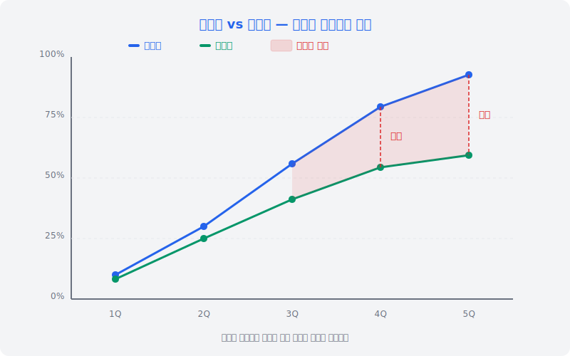
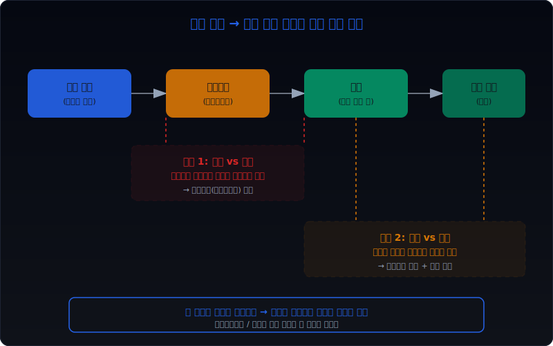
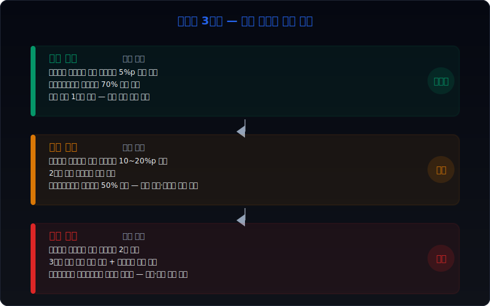
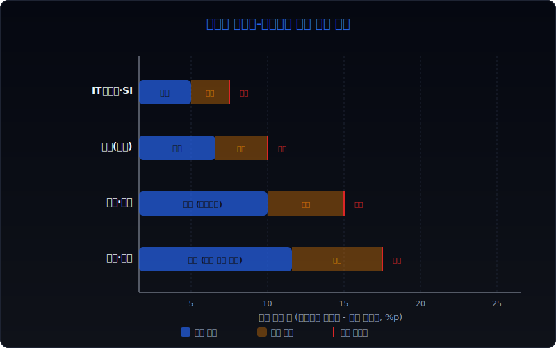
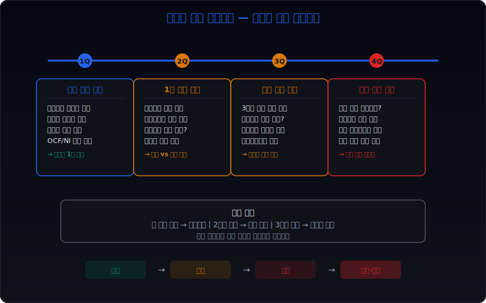

# 진행률은 오르는데 계약자산 회전이 느려질 때 무엇을 먼저 의심해야 하나

건설, 조선, 플랜트처럼 프로젝트 단위로 매출을 인식하는 업종에서는 **진행률이 올라가면 매출도 따라오는 것이 정상**이다. 투입법이든 산출법이든, 진행률이 올라간다는 것은 프로젝트가 예정대로 앞으로 가고 있다는 뜻이다. 하지만 여기서 놓치기 쉬운 것이 있다. 매출을 인식했다는 것과 그 매출이 현금으로 돌아왔다는 것은 같지 않다.

진행률은 순조롭게 오르는데 **계약자산 회전이 느려진다**면, 이 간극이 벌어지고 있다는 뜻이다. 매출은 장부에 잡혔지만 발주처에 아직 청구하지 못했거나, 청구는 했지만 검수·정산이 밀려 현금 수취가 지연되고 있을 수 있다. 실전에서는 이 조합을 `인식은 앞서가고, 현금화는 뒤처지는 구조`로 먼저 읽어야 한다.

이 글은 [매출 인식 시점 변경은 어디가 신호인가](/blog/revenue-recognition-timing-signals), [선수수익보다 미청구공사가 더 빨리 늘 때 무엇을 봐야 하나](/blog/unbilled-construction-vs-deferred-revenue), [공사선수금은 줄고 공사미수금은 늘 때 무엇을 먼저 의심해야 하나](/blog/advances-down-and-construction-receivables-up)의 연장선에 있다. 여기서는 진행률과 계약자산 회전을 같이 놓고 볼 때 어디를 먼저 의심해야 하는지, 어떤 순서로 검증해야 하는지를 정리한다.

---

## 왜 진행률과 계약자산 회전을 같이 봐야 하나

진행률은 프로젝트의 `원가 기준 완성도`를 보여준다. 투입법 기준으로 총예정원가 대비 실제 투입원가가 얼마나 진행되었는지를 나타낸다. 이 숫자가 올라가면 회사는 그 비율만큼 매출을 인식한다. 여기까지는 회계 기준이 허용하는 정상적인 흐름이다.

문제는 매출 인식과 현금 수취 사이에 시차가 생길 때 발생한다. 진행률이 60%에서 75%로 올라가며 매출을 15%p만큼 추가 인식했는데, 발주처에 실제로 청구한 금액이 그만큼 늘지 않으면 그 차이는 계약자산(미청구공사)으로 쌓인다. 계약자산은 `매출은 인식했지만 아직 대금 청구 권리가 확정되지 않은 금액`이다.

계약자산 회전율은 이 자산이 얼마나 빠르게 현금으로 전환되는지를 보여준다. 회전율이 떨어진다는 것은 장부에 올린 매출이 현금으로 바뀌는 데 시간이 더 오래 걸린다는 뜻이다. 결국 진행률과 계약자산 회전을 같이 봐야 하는 이유는 명확하다. **진행률은 인식 속도를 보여주고, 계약자산 회전은 현금화 속도를 보여주기 때문이다.** 둘의 방향이 다르면 어딘가에 누수가 생기고 있다.

건설·조선·플랜트에서 이 괴리가 중요한 이유가 하나 더 있다. 이런 업종은 프로젝트 단가가 수백억에서 수조 원에 이른다. 괴리가 1~2%p만 벌어져도 금액으로는 수십억 원 단위다. 그리고 이 괴리는 보통 한 분기에 갑자기 생기지 않는다. 2~3분기에 걸쳐 서서히 벌어지다가 어느 시점에 충당금이나 손실 인식으로 한꺼번에 터지는 패턴을 보인다.

---

## 어떤 숫자 조합이 먼저 경고하나

| 먼저 볼 항목 | 왜 중요한가 |
| --- | --- |
| 계약자산 증가율 vs 매출 증가율 | 계약자산이 매출보다 빠르게 늘면 청구가 밀리고 있다 |
| 미청구공사 잔액 추이 | 3분기 연속 증가하면 구조적 지연 가능성이 높다 |
| 진행률 변동폭 | 한 분기에 15%p 이상 점프하면 원가 추정 변경을 의심한다 |
| 청구율(billing ratio) | 진행률 대비 청구율이 떨어지면 간극이 벌어지고 있다 |
| 영업현금흐름 vs 순이익 | 이익은 나는데 현금이 안 들어오면 인식이 앞서간 것이다 |
| 계약부채(선수금) 변동 | 선수금이 동시에 줄면 현금 버퍼까지 약해진다 |

실전에서는 먼저 **계약자산 증가율과 매출 증가율의 차이**를 본다. 매출이 10% 느는데 계약자산이 30% 늘었다면, 인식한 매출의 상당 부분이 아직 청구도 되지 못한 상태라는 뜻이다. 이 차이가 2분기 이상 지속되면 단순한 타이밍 문제가 아닐 수 있다.

그다음으로 **영업현금흐름과 순이익의 방향**을 대조한다. [영업현금흐름이 순이익을 부정할 때](/blog/operating-cash-flow-vs-net-income)에서 다룬 것처럼, 이익은 나오는데 현금이 안 따라오면 매출 인식의 질을 의심해야 한다. 특히 프로젝트형 매출에서 이 괴리가 나타나면 진행률 추정이 낙관적이었거나, 발주처 쪽 정산이 지연되고 있을 가능성이 높다.

마지막으로 **계약부채(선수금)까지 동시에 줄어드는지** 확인한다. 계약자산은 늘고 계약부채는 줄면 현금의 양방향에서 불리해지는 구조다. 이 조합은 [공사선수금은 줄고 공사미수금은 늘 때](/blog/advances-down-and-construction-receivables-up)와 정확히 같은 맥락이며, 현금 버퍼의 이중 악화를 의미한다.

---

## 신호가 강해지는 순서

진행률과 계약자산 회전의 괴리가 단순한 타이밍 차이인지, 아니면 구조적 문제의 전조인지를 가르는 핵심은 **신호가 점차 강해지는 패턴을 보이는가**이다.

**1단계: 진행률 낙관 조짐** — 총예정원가 추정이 변경되면서 진행률이 기존 추세보다 빠르게 올라간다. 이 단계에서는 계약자산이 아직 크게 늘지 않을 수 있다. 하지만 원가 추정 변경 공시를 확인하면 진행률 상승이 실질적 공정 진전 때문인지, 아니면 총원가를 낮게 재추정해서 진행률이 자동으로 올라간 것인지 구분할 수 있다.

**2단계: 청구 지연 가시화** — 진행률은 올라갔는데 발주처 측 검수, 기성 승인, 설계 변경 합의가 밀리면서 청구가 늦어진다. 이 단계에서 계약자산(미청구공사)이 눈에 띄게 늘기 시작한다. [선수수익보다 미청구공사가 더 빨리 늘 때](/blog/unbilled-construction-vs-deferred-revenue)에서 설명한 신호가 여기서 나타난다.

**3단계: 현금 수취 지연** — 청구가 밀리니 당연히 현금 수취도 밀린다. 영업현금흐름이 순이익 대비 뒤처지기 시작한다. 운전자본 부담이 커지면서 단기 차입이 늘거나 매출채권 회전일이 길어진다.

**4단계: 충당·손실 인식 리스크** — 괴리가 오래 지속되면 계약자산 회수 가능성 자체에 의문이 생긴다. [공사손실충당부채는 언제 뒤늦게 크게 튀어나오나](/blog/construction-loss-provision-signals)에서 다룬 것처럼, 진행률 낙관으로 미뤄뒀던 손실이 한꺼번에 인식되는 시점이 온다. 이때 충당부채가 급증하고, 영업이익률이 급락하며, 계약자산에 대한 손상 검토가 필요해진다.

실전에서 가장 주의해야 할 구간은 **2단계에서 3단계로 넘어가는 지점**이다. 청구 지연까지는 회사 측에서 `일시적 타이밍 차이`로 설명할 수 있지만, 현금 수취까지 밀리기 시작하면 설명이 어려워진다. 이 전환 지점을 놓치면 4단계에서 갑자기 큰 손실을 만나게 된다.

---

## 위험도를 나누는 기준

진행률과 계약자산 회전의 괴리를 **세 단계로 나눠서 관리**하면 과잉 반응과 과소 반응을 모두 피할 수 있다.

**관찰 구간 (낮은 위험)** — 계약자산 증가율이 매출 증가율을 5%p 이내로 초과하고, 영업현금흐름이 여전히 순이익의 70% 이상을 커버하며, 청구 지연이 1분기 이내인 경우다. 이 수준은 프로젝트 특성상 발생할 수 있는 정상 범위다. 다만 다음 분기에 회복되는지 추적한다.

**경계 구간 (중간 위험)** — 계약자산 증가율이 매출 증가율을 10~20%p 초과하거나, 2분기 연속 계약자산 회전이 느려지거나, 영업현금흐름이 순이익의 50% 미만으로 떨어진 경우다. 이 단계에서는 원가 추정 변경 이력, 발주처 재무 상태, 기성 검수 일정을 구체적으로 확인해야 한다.

**위험 구간 (높은 위험)** — 계약자산 증가율이 매출 증가율의 2배 이상이거나, 3분기 이상 계약자산 회전이 연속 악화하거나, 영업현금흐름이 마이너스이면서 순이익은 플러스인 경우다. 여기에 계약부채(선수금) 감소까지 동반되면 현금 버퍼 이중 악화다. 충당부채 설정 가능성, 프로젝트 손실 전환 가능성을 적극적으로 검토해야 한다.

각 구간의 핵심 차이는 **괴리의 크기가 아니라 괴리의 지속 기간**이다. 한 분기 큰 괴리는 프로젝트 기성 일정 때문일 수 있지만, 3분기 연속 작은 괴리도 구조적 문제를 가리킬 수 있다. 따라서 단일 시점의 숫자보다 추세를 봐야 한다.

---

## 진행률 낙관과 청구 지연은 왜 함께 움직이나

실전에서 진행률 낙관과 청구 지연이 동시에 나타나는 경우가 많은데, 이것은 우연이 아니다. 둘 사이에는 구조적 연결 고리가 있다.

첫째, **총예정원가를 낮게 잡으면 진행률은 자동으로 올라간다.** 투입법에서 진행률은 `누적투입원가 / 총예정원가`다. 분모인 총예정원가를 줄이면 같은 투입 금액으로도 진행률은 더 높아진다. 회사 입장에서는 이렇게 하면 매출을 앞당겨 인식할 수 있다. 하지만 발주처 입장에서 기성 검수의 근거가 되는 실물 공정은 변하지 않는다. 회사가 장부에 매출을 더 빨리 잡았을 뿐, 발주처는 여전히 실물 기준으로 기성을 승인한다. 이 차이가 계약자산(미청구공사)으로 쌓인다.

둘째, **설계 변경이나 클레임이 발생하면 양쪽에 동시에 영향을 준다.** 설계 변경으로 추가 원가가 발생했지만 변경 합의가 아직 완료되지 않으면, 회사는 추가 원가를 반영해서 진행률을 조정하면서도 그에 대응하는 매출은 클레임 성공 기대를 반영해 인식할 수 있다. 하지만 발주처와 합의가 안 되었으니 청구는 못 한다. 결과적으로 진행률은 올라가고 청구는 밀린다.

셋째, **경영진의 인센티브 구조가 같은 방향을 가리킨다.** 분기 실적 압박을 받는 경영진은 진행률을 높게 유지하고 싶어하고, 동시에 청구 지연 문제는 `일시적`이라고 설명하고 싶어한다. 두 가지 모두 실적을 좋게 보이게 하면서 문제를 다음 분기로 미루는 효과가 있다.

이런 구조적 연결 때문에 진행률 상승과 계약자산 회전 둔화가 동시에 나타나면 각각을 따로 보지 말고 **하나의 연결된 신호로 읽어야 한다.** 진행률 낙관은 청구 지연의 원인이기도 하고, 청구 지연은 진행률 낙관의 결과이기도 하다.

---

## 업종별로 허용되는 괴리 폭은 어떻게 다른가

진행률과 계약자산 회전의 괴리를 읽을 때 모든 업종에 같은 잣대를 적용하면 안 된다. 프로젝트 기간, 기성 검수 주기, 발주처 특성에 따라 **정상 범위가 다르다.**

**건설(토건·건축)** — 기성 검수가 보통 월별 또는 분기별로 이루어진다. 발주처가 공공기관인 경우 검수 절차가 정형화되어 있어서 청구 지연이 상대적으로 짧다. 따라서 계약자산 증가율이 매출 증가율을 5%p 이상 초과하면 주의할 필요가 있다. 민간 발주의 경우 검수가 느릴 수 있어 허용 폭이 약간 더 넓지만, 10%p를 넘기면 확인이 필요하다.

**조선·해양플랜트** — 프로젝트 기간이 2~5년으로 길고, 기성 검수가 마일스톤 기반이다. 선박이나 해양구조물은 특정 공정 완료 시점에 큰 금액이 한꺼번에 청구되는 구조다. 따라서 분기별 괴리가 15~20%p까지 발생할 수 있으며, 이것이 바로 위험 신호는 아닐 수 있다. 다만 마일스톤 시점을 지났는데도 계약자산이 줄지 않으면 문제다. 조선업에서는 **반기 단위 추세**를 보는 것이 더 적절하다.

**IT서비스·SI** — 프로젝트 규모가 상대적으로 작고 기간도 6개월~2년으로 짧다. 검수도 단계별로 자주 이루어진다. 따라서 계약자산 회전이 둔화되면 건설·조선보다 더 빠르게 문제가 드러난다. 괴리가 5%p만 넘어도 청구 분쟁이나 프로젝트 범위 변경을 의심할 수 있다.

**방산·우주항공** — 발주처가 정부인 경우가 대부분이고, 보안 등의 이유로 기성 검수와 청구가 매우 느릴 수 있다. 괴리 허용 폭이 가장 넓은 업종이지만, 그만큼 계약자산 잔액 자체가 크다. 여기서는 괴리 비율보다 **계약자산 절대 금액의 변화**와 정부 예산 집행 일정을 같이 봐야 한다.

핵심은 **업종 특성에 맞는 기준선을 먼저 잡고, 그 기준선에서 얼마나 벗어나는지를 보는 것**이다. 건설업에서 10%p 괴리와 조선업에서 10%p 괴리는 전혀 다른 의미를 가진다.

---

## 다음 분기에 다시 확인할 숫자

이번 분기에 진행률과 계약자산 회전 사이에 괴리를 발견했다면, 다음 분기에 반드시 아래 항목을 다시 확인해야 한다.

**계약자산 잔액 변동** — 괴리가 줄었는지, 유지되는지, 더 벌어졌는지를 본다. 줄었다면 청구가 정상화되고 있다는 뜻이고, 유지 이상이면 구조적 지연 가능성이 높아진다.

**총예정원가 변경 여부** — 주석이나 사업보고서에서 주요 프로젝트의 총예정원가가 변경되었는지 확인한다. 총예정원가가 올라갔다면 진행률이 자동으로 내려가면서 직전 분기의 낙관이 교정된 것일 수 있다. 반대로 또 낮아졌다면 낙관이 지속되고 있다.

**충당부채 신규 설정** — 공사손실충당부채나 계약자산 손상이 새로 설정되었는지 확인한다. 이것은 4단계 진입 신호다.

**영업현금흐름 회복 여부** — 직전 분기에 순이익 대비 영업현금흐름이 부족했다면, 이번 분기에 회복되었는지가 중요하다. 2분기 연속 괴리가 지속되면 인식 품질 문제로 격상해야 한다.

**발주처 재무 상태** — 발주처가 상장사이거나 공공기관이면 재무 상태를 확인할 수 있다. 발주처의 유동성이 악화되고 있다면 청구 지연이 발주처 측 자금난 때문일 수 있다. 이 경우 계약자산의 회수 가능성 자체에 대한 재평가가 필요하다.

---

## 실전 점검 체크리스트

| 순서 | 점검 항목 | 확인 방법 | 위험 기준 |
| --- | --- | --- | --- |
| 1 | 계약자산 증가율 vs 매출 증가율 | 재무상태표 계약자산, 손익계산서 매출액 비교 | 계약자산 증가율이 매출 증가율의 1.5배 초과 |
| 2 | 진행률 변동폭 | 주석 진행률 공시, 전분기 대비 변동 | 한 분기 15%p 이상 점프 |
| 3 | 청구율(billing ratio) 추이 | 계약자산 / (계약자산 + 매출채권) 추세 | 3분기 연속 상승 (미청구 비중 증가) |
| 4 | 총예정원가 변경 이력 | 사업보고서 주석, 감사보고서 핵심감사사항 | 2회 이상 하향 조정 |
| 5 | 영업현금흐름 / 순이익 비율 | 현금흐름표 영업활동, 손익계산서 순이익 | 50% 미만이 2분기 이상 지속 |
| 6 | 계약부채(선수금) 동반 감소 여부 | 재무상태표 계약부채 추이 | 계약자산 증가와 계약부채 감소 동시 발생 |
| 7 | 공사손실충당부채 신규·증가 | 충당부채 주석, 전분기 대비 변동 | 신규 설정 또는 20% 이상 증가 |
| 8 | 발주처 재무 건전성 | 발주처 공시, 신용등급 변동 | 발주처 유동비율 100% 미만 또는 등급 하락 |
| 9 | 매출채권 회전일 변동 | 매출채권 / 일평균 매출 | 전년 대비 15일 이상 증가 |
| 10 | 핵심감사사항 포함 여부 | 감사보고서 핵심감사사항 | 수익인식 또는 계약자산이 핵심감사사항에 포함 |

이 체크리스트는 한 번에 다 확인하는 것이 아니라 **위에서부터 순서대로** 진행한다. 1~3번에서 이상이 없으면 나머지는 모니터링 수준이고, 1~3번에서 경고가 나오면 4번 이하를 반드시 확인해야 한다.

---

## 자주 묻는 질문

**Q1. 계약자산과 미청구공사는 같은 것인가?**

IFRS 15 도입 이후 `계약자산`이 공식 용어이고, `미청구공사`는 이전 기준서(K-IFRS 1011호) 용어다. 실무적으로 같은 성격을 가리키지만 범위가 약간 다를 수 있다. 계약자산은 고객에게 재화나 용역을 이전했지만 대가에 대한 권리가 시간의 경과 외 다른 조건에도 달려 있는 금액이고, 미청구공사는 공사 진행분 중 아직 청구하지 않은 금액이다. 대부분의 건설·플랜트 회사에서는 사실상 같은 항목으로 봐도 무방하다.

**Q2. 진행률이 올라가는데 계약자산이 줄면 좋은 신호인가?**

일반적으로 그렇다. 진행률이 올라가면서 계약자산이 줄어든다면 청구와 현금 수취가 인식보다 빠르게 이루어지고 있다는 뜻이다. 다만 계약자산이 급격히 줄면서 매출채권이 그만큼 늘었는지도 확인해야 한다. 청구는 했지만 수금이 안 되는 상황이면 문제가 이동한 것일 뿐 해결된 것이 아니다.

**Q3. 투입법과 산출법에서 괴리 해석이 달라지나?**

달라진다. 투입법은 원가 투입 기준이라 원가 추정 변경에 진행률이 민감하게 반응한다. 산출법은 물리적 공정 완성도 기준이라 진행률 자체의 조작 여지는 적지만, 공정 완료 판단 기준이 주관적일 수 있다. 일반적으로 투입법을 쓰는 회사에서 진행률-계약자산 괴리가 더 자주, 더 크게 나타난다.

**Q4. 계약자산 회전율은 어떻게 계산하나?**

계약자산 회전율은 `매출액 / 평균 계약자산`으로 계산한다. 평균 계약자산은 기초와 기말의 산술평균을 쓴다. 회전율이 높을수록 계약자산이 빠르게 현금화되고 있다는 뜻이다. 분기별로 계산하면 계절성을 잡을 수 있고, 연간 기준으로 계산하면 추세를 보기 좋다. 동종 업종 내 비교가 가장 유의미하다.

**Q5. 이 괴리가 감사 의견에 영향을 줄 수 있나?**

직접적으로 감사 의견을 바꾸지는 않지만, 계약자산이 중요한 비중을 차지하는 회사에서는 감사보고서의 **핵심감사사항(KAM)** 에 수익인식이나 계약자산 평가가 포함될 가능성이 높다. 감사인이 계약자산의 회수 가능성, 진행률 추정의 적절성, 총예정원가 변경의 합리성을 중점 감사했다면, 이 괴리가 실제로 중요한 리스크로 인식되고 있다는 뜻이다.

---

## 관련 분석 글

- [매출 인식 시점 변경은 어디가 신호인가](/blog/revenue-recognition-timing-signals) — 진행률 추정 변경이 매출 인식 시점에 미치는 영향
- [선수수익보다 미청구공사가 더 빨리 늘 때 무엇을 봐야 하나](/blog/unbilled-construction-vs-deferred-revenue) — 계약자산과 계약부채의 불균형
- [공사선수금은 줄고 공사미수금은 늘 때 무엇을 먼저 의심해야 하나](/blog/advances-down-and-construction-receivables-up) — 현금 버퍼의 양방향 악화
- [공사손실충당부채는 언제 뒤늦게 크게 튀어나오나](/blog/construction-loss-provision-signals) — 진행률 낙관이 충당부채로 터지는 패턴
- [영업현금흐름이 순이익을 부정할 때](/blog/operating-cash-flow-vs-net-income) — 인식과 현금의 괴리를 잡는 기본 프레임

---

## 공식 출처와 근거

- **K-IFRS 제1115호 (고객과의 계약에서 생기는 수익)** — 계약자산의 정의, 진행률 측정 방법, 변동대가 추정 기준
- **K-IFRS 제1037호 (충당부채, 우발부채, 우발자산)** — 공사손실충당부채 인식 기준
- **금융감독원 회계감독국, 건설업 회계처리 감독 관련 보도자료** — 진행률 추정 변경, 미청구공사 급증에 대한 감독 관점
- **한국공인회계사회, 감사실무지침** — 핵심감사사항(KAM) 선정 기준, 수익인식 감사 절차
- **각 사 사업보고서 및 감사보고서** — 계약자산·계약부채 주석, 진행률 공시, 총예정원가 변경 이력

---

## 핵심 정리

진행률은 프로젝트가 잘 가고 있는지를 보여주고, 계약자산 회전은 그 매출이 현금으로 돌아오고 있는지를 보여준다. **둘의 방향이 다르면 인식과 현금화 사이에 간극이 벌어지고 있다는 뜻**이고, 이 간극은 시간이 지나면 충당금이나 손실로 터질 수 있다.

가장 중요한 것은 **신호의 지속 기간**이다. 한 분기 괴리는 타이밍 문제일 수 있지만, 2~3분기 지속되면 구조적 문제를 의심해야 한다. 체크리스트의 앞 3개 항목(계약자산 증가율, 진행률 변동폭, 청구율 추이)에서 경고가 나오면 나머지를 반드시 확인하고, 업종별 허용 범위를 감안해서 위험도를 판단해야 한다.

프로젝트형 매출의 핵심은 `인식 속도와 현금화 속도가 같은 방향으로 가고 있는가`를 계속 묻는 것이다. 진행률이 아무리 높아도 현금이 안 따라오면 그 매출은 아직 검증되지 않은 숫자다.
