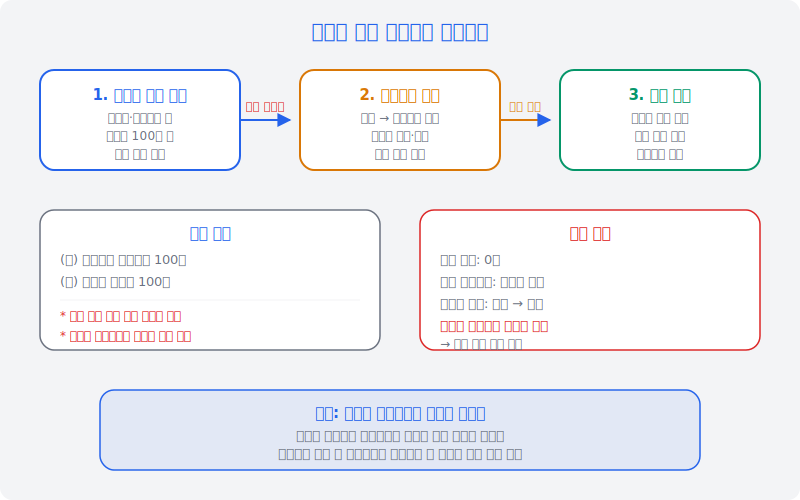
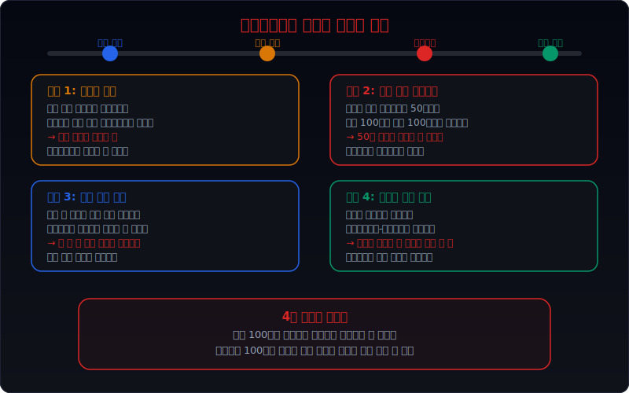
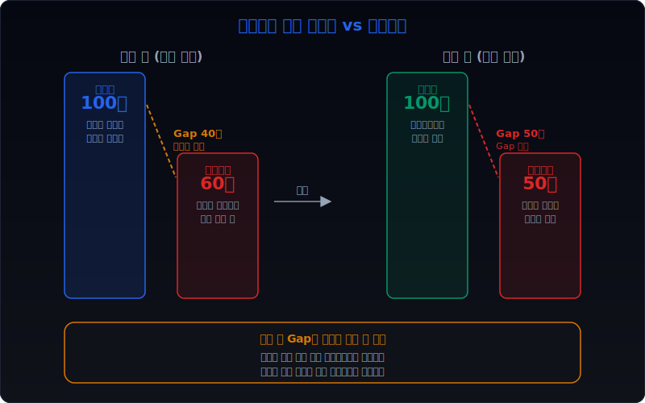
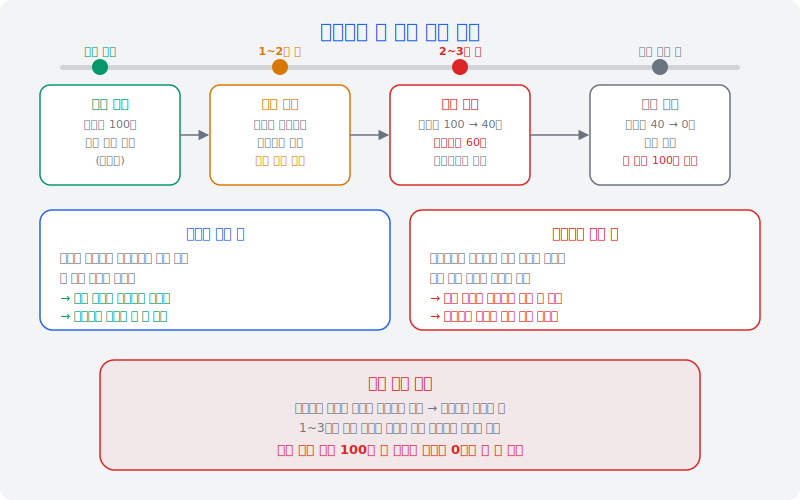
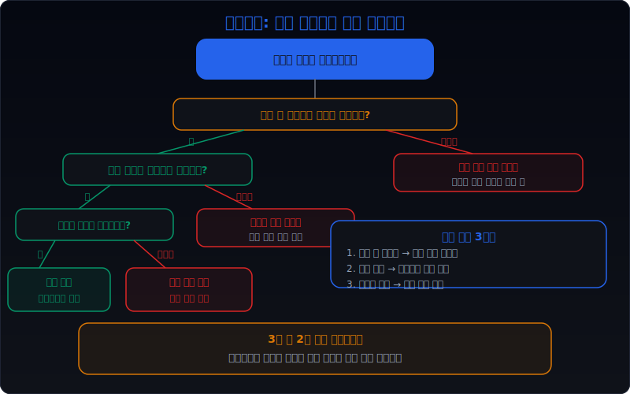

# 관계사 채권 출자전환은 왜 회수보다 손실 정리 신호에 가깝나

관계사에 빌려준 돈이 돌아오지 않을 때, 회사가 자주 쓰는 수단 중 하나가 `출자전환`이다. 채권을 포기하는 대신 관계사 주식을 받는 구조다. 장부에서 채권이 사라지므로 표면적으로는 회수가 끝난 것처럼 보인다. 하지만 **실제로 현금이 들어온 것은 아니다.** 회수 불확실성이 `채권`이라는 형태에서 `지분`이라는 형태로 옮겨갔을 뿐이다.

이 글은 [관계사 채권·대여금은 왜 본업 현금을 흐리나](/blog/related-party-loans-and-receivables), [관계사 매출채권 대손충당금은 왜 늦게 잡히나](/blog/related-party-receivables-allowance-delay), [관계사 자산 매각 이익은 왜 더 조심해야 하나](/blog/related-party-asset-sale-gains)의 다음 단계다. 관계사 채권이 출자전환이라는 형식을 거쳐 장부에서 사라질 때, 실질적으로 무엇이 달라지고 무엇이 그대로인지를 정리한다.

출자전환의 핵심을 한 문장으로 요약하면 이렇다. **채권이 사라진 것은 맞지만 현금이 돌아온 것은 아니며, 손실이 해소된 것도 아니다.**

---

## 왜 출자전환은 채권 회수와 다른 신호인가

채권을 회수한다는 것은 상대방이 약속한 금액을 현금으로 갚는 것이다. 현금이 들어오므로 자산의 질이 올라간다. 반면 출자전환은 상대방이 현금을 갚지 못하는 상황에서 채권을 지분으로 바꾸는 행위다. 돈을 돌려받는 대신 상대방 회사의 주인이 되는 것이다.

표면적으로 보면 채권이 사라지고 투자자산이 생긴다. 대차대조표상 자산 총액은 바뀌지 않을 수 있다. 손익계산서에도 즉각적인 비용이 잡히지 않는 경우가 있다. 그래서 투자자는 이 거래를 `정상적인 자산 재배치` 정도로 넘기기 쉽다.

하지만 채권과 지분은 본질적으로 다른 성격의 자산이다. 채권은 약속된 금액을 받을 권리이고, 지분은 회사의 잔여 가치에 참여할 권리다. **관계사가 이미 채권을 갚지 못할 정도로 재무가 악화된 상태에서 그 회사의 지분을 취득하는 것은, 좋은 투자가 아니라 나쁜 채권을 다른 형태로 바꾼 것에 가깝다.**

이것은 채권의 회수라기보다 사실상 `손실 정리`의 시작이다. 현금이 들어오지 않았으므로 경제적 실질은 회수가 아니다. 그리고 관계사의 재무가 악화된 상태라면 취득한 지분의 공정가치는 채권 장부가에 한참 못 미칠 가능성이 크다.

---

## 구조가 작동하는 순서

| 순서 | 단계 | 핵심 체크 |
| --- | --- | --- |
| 1 | 관계사 채권 발생 | 왜 빌려줬고, 얼마이고, 조건은 무엇인가 |
| 2 | 회수 지연·실패 | 만기 연장이 반복되거나 원금 회수가 안 되고 있다 |
| 3 | 출자전환 결정 | 이사회가 채권 대신 지분을 받기로 결의한다 |
| 4 | 회계 처리 | 채권 소멸, 투자주식 계상 (현금 유입 없음) |
| 5 | 전환 후 평가 | 취득한 지분의 공정가치와 장부가를 비교한다 |
| 6 | 손상 검사 | 공정가치가 장부가에 못 미치면 손상차손을 인식한다 |

실전에서 이 순서의 핵심은 2단계와 4단계 사이에 있다. 회수가 지연되는 채권에 대해 **충당금을 먼저 쌓았는지, 아니면 충당금 없이 곧바로 출자전환으로 넘어갔는지**가 해석을 가른다. 충당금 없이 넘어갔다면 손실 인식을 우회한 것이다.

또 하나 중요한 것은 전환 비율이다. 채권 100억 원을 주식 100억 원 가치로 전환했다고 기록하더라도, 그 주식의 실제 공정가치가 50억 원이면 50억 원의 손실이 숨어 있는 것이다. 비상장 관계사라면 이 공정가치 산정 자체가 주관적이므로 문제가 더 복잡해진다.

이 구조를 이해하려면 [관계기업·공동기업과 지분법은 어떻게 읽어야 하나](/blog/associates-joint-ventures-and-equity-method)의 기본 프레임이 필요하다. 지분법 적용 여부에 따라 전환 후 손실 반영 경로가 완전히 달라지기 때문이다.

---

## 어디에서 왜곡이 생기나

출자전환에서 왜곡이 들어오는 지점은 크게 네 가지다.

**첫째, 충당금 지연이다.** 관계사 채권의 회수 가능성이 낮아졌는데 충당금을 쌓지 않고 출자전환으로 넘기면, 손실 인식을 우회한 것이다. 충당금을 먼저 충분히 쌓았다면 장부가가 이미 공정가치에 가까워진 상태이므로 전환 시 왜곡이 줄어든다. 하지만 충당금 없이 전환하면 장부가와 공정가치 사이에 큰 갭이 생기고, 이 갭은 손익계산서에 반영되지 않은 채 숨어 있게 된다.

**둘째, 전환 가격 부풀리기다.** 관계사 주식의 공정가치를 실제보다 높게 산정하면, 전환 시 손실이 줄어든다. 비상장 관계사의 경우 외부 감정 없이 내부 평가로 처리하는 경우가 있으므로, 전환 비율이 어떤 근거로 결정되었는지를 봐야 한다.

**셋째, 후속 손상 지연이다.** 전환 후에도 관계사 재무가 계속 악화되면 취득한 지분에 대해 손상을 인식해야 하지만, 이 시점 판단에 경영진 재량이 크다. 특히 비상장 지분을 기타포괄손익-공정가치로 분류한 경우, 손상을 언제 잡을지에 대한 명확한 기준이 약하다.

**넷째, 지분법 적용 회피다.** 유의적 영향력이 있는데도 기타포괄손익-공정가치 측정 금융자산으로 분류하면, 관계사의 순손실이 투자자의 손익에 자동 반영되지 않는다. 지분법이 적용되면 관계사 손실의 지분율만큼이 매 분기 자동으로 반영되므로 숨기기가 어렵다.

이 네 가지 왜곡이 겹치면 채권 100억 원이 장부에서 조용히 사라지고, 투자자산 100억 원이 남지만 실질 가치는 그보다 훨씬 작을 수 있다. 관계사 채권 관련 왜곡 구조는 [관계사 매출채권 대손충당금은 왜 늦게 잡히나](/blog/related-party-receivables-allowance-delay)에서 다룬 충당금 지연 패턴과 연결된다.

---

## 왜곡을 걸러내는 숫자 조합

| 점검 항목 | 상대적으로 양호한 경우 | 왜곡이 의심되는 경우 |
| --- | --- | --- |
| 전환 전 충당금 | 채권 잔액 대비 충분히 쌓았다 | 충당금 거의 없이 전환했다 |
| 전환 비율 근거 | 외부 감정 또는 공인 평가 기반이다 | 내부 평가만으로 결정했다 |
| 관계사 재무 상태 | 자본잠식 없고 영업이 유지된다 | 자본잠식이거나 영업적자가 지속된다 |
| 전환 후 지분 분류 | 지분법 적용 (손실 자동 반영) | 공정가치 측정 (손상 재량 큼) |
| 후속 손상 여부 | 전환 후 1~2년 내 적절히 반영한다 | 수년간 장부가 변동 없다 |
| 현금흐름 변화 | 영업현금흐름에 영향이 제한적이다 | 현금이 약한데 추가 지원도 계속된다 |

숫자를 읽을 때 가장 먼저 봐야 하는 것은 **전환 직전 충당금 잔액과 전환 금액의 비율**이다. 충당금이 전환 금액의 절반도 안 되면 손실 인식이 불충분한 상태에서 형태만 바꾼 것이다.

그다음은 **전환 후 1~2년 사이에 손상차손을 인식했는지**를 본다. 전환 직후에는 손상이 없다가 2~3년 뒤에 대규모 손상이 한꺼번에 잡히면, 전환 시점의 평가가 과대했던 것이다.

마지막으로 **관계사 재무제표**를 직접 확인해야 한다. 관계사가 자본잠식이면 취득한 지분의 실질 가치는 거의 0에 가까울 수 있다. 이 경우 출자전환 전체가 사실상 대여금을 포기한 것과 다를 바 없다.

---

## 출자전환 전후 장부가와 공정가치가 갈리는 이유

출자전환 전과 후에서 장부가와 공정가치가 벌어지는 이유는 구조적이다.

**전환 전 채권 상태에서는** 장부가가 원금 기준으로 남아 있다. 충당금을 쌓으면 순장부가가 줄어들지만, 충당금을 쌓지 않으면 장부가는 원금 그대로다. 반면 공정가치는 관계사가 실제로 갚을 수 있는 금액을 반영한다. 관계사 재무가 악화되었으면 공정가치는 장부가보다 낮다.

**전환 후 지분 상태에서는** 장부가가 채권 장부가를 그대로 승계하는 경우가 많다. 채권 100억 원이 투자주식 100억 원이 되는 것이다. 하지만 공정가치는 관계사의 순자산에 지분율을 곱한 값이 된다. 관계사가 자본잠식이거나 순자산이 적으면, 이 공정가치는 장부가 100억 원에 한참 못 미친다.

더 중요한 것은 **전환 후에 갭이 오히려 커질 수 있다는 점**이다. 채권일 때는 부분 회수 가능성이라도 있었다. 원금의 일부를 돌려받거나, 담보를 처분할 수 있었다. 하지만 지분으로 바뀌면 채권자로서의 우선권이 사라지고, 관계사의 전체 재무상태에 종속된다. 관계사가 계속 적자를 내면 지분 가치는 계속 떨어진다.

K-IFRS에서 전환 시 공정가치 차이를 어떻게 처리하는지는 전환 조건에 따라 다르다. 채권의 장부가와 취득한 지분의 공정가치가 다르면 그 차이를 당기손익으로 인식해야 하는 경우가 있다. 하지만 공정가치 산정 자체가 주관적이면 이 차이를 최소화하는 방향으로 평가가 이루어질 수 있다.

실전에서 봐야 할 포인트는 간단하다. **전환 공시에서 `전환 가격`과 관계사의 `1주당 순자산`을 비교한다.** 전환 가격이 1주당 순자산보다 현저히 높으면 장부가 과대 계상이 의심된다.

---

## 관계사 지분 취득 후 후속 손상 경로

출자전환으로 취득한 지분은 그 뒤로 두 가지 경로를 탄다.

**경로 1: 지분법 적용.** 유의적 영향력(통상 20% 이상)이 있으면 관계기업으로 분류하고 지분법을 적용한다. 이 경우 관계사의 당기순손실 중 지분율만큼이 매 분기 자동으로 투자자의 손익에 반영된다. 관계사가 연간 20억 원 적자이고 지분율이 30%면, 매년 6억 원이 지분법 손실로 잡힌다. 투자자 입장에서는 손실이 분산되어 보이므로 추세를 미리 파악할 수 있다.

**경로 2: 공정가치 측정.** 유의적 영향력이 없거나, 기타포괄손익-공정가치로 선택 분류한 경우다. 이 경우 매 결산기에 공정가치를 재평가하지만, 비상장 지분이면 공정가치 산정이 주관적이다. 경영진이 손상 시점을 늦추면 장부가가 수년간 유지되다가 한꺼번에 대규모 손상이 잡힐 수 있다. 투자자는 징후를 미리 보기 어렵다.

두 경로 모두 최종 결과는 비슷할 수 있다. 관계사 재무가 계속 악화되면 결국 전액 손상으로 귀결된다. 차이는 **손실이 인식되는 타이밍**이다. 지분법은 점진적이고, 공정가치 측정은 한꺼번에 몰릴 수 있다.

후속 손상 경로에서 특히 주의해야 할 시나리오는 이렇다.

- **관계사가 추가 출자를 요청하는 경우**: 출자전환 후에도 관계사가 자금이 부족하면 추가 출자를 요청할 수 있다. 이미 한 번 지분을 받았는데 또 돈을 넣어야 한다면, 최초 출자전환 시점의 판단 자체가 잘못된 것일 수 있다.
- **관계사가 청산이나 회생 절차에 들어가는 경우**: 이때 지분 가치는 0이 된다. 결국 최초에 빌려준 돈 전액이 손실이다.
- **관계사를 흡수합병하는 경우**: 부실 관계사를 합병하면 그 부실이 모회사 재무에 직접 들어온다. 출자전환 → 추가 손상 → 합병이라는 3단계를 거치면서 손실이 여러 기간에 나눠 잡히므로, 전체 손실 규모를 한 눈에 보기 어렵다.

---

## 놓치기 쉬운 예외

**1. 정상적인 구조조정의 일부일 수 있다.** 모든 출자전환이 손실 위장은 아니다. 관계사가 일시적 유동성 위기에 빠졌지만 사업 자체는 건전한 경우, 채권자가 지분으로 전환하여 경영에 참여하고 구조조정을 주도하는 것은 합리적인 판단일 수 있다. 이 경우에는 전환 후 관계사 실적이 실제로 개선되는지가 핵심이다.

**2. 법원 회생 절차에 따른 출자전환은 성격이 다르다.** 법원이 주도하는 회생계획에 따른 출자전환은 채권자의 자발적 선택이 아니라 법적 절차의 결과다. 이 경우 전환 비율도 법원이 정하므로 경영진의 재량에 의한 왜곡 가능성은 상대적으로 작다. 다만 취득한 지분의 후속 가치는 여전히 불확실하다.

**3. 전환사채(CB)를 통한 출자전환과 구분해야 한다.** 관계사가 발행한 전환사채를 보유하고 있다가 주식으로 전환하는 것은 애초에 계약에 포함된 권리 행사다. 이것은 회수 실패에 따른 출자전환과 성격이 다르다. 전환사채의 전환은 관계사 주가가 전환가를 상회할 때 이루어지는 것이 정상이므로, 주가가 전환가 아래인데 전환했다면 별도로 따져 봐야 한다.

**4. 연결 범위가 바뀌면 숫자가 달라질 수 있다.** 출자전환으로 지분율이 올라가서 관계사가 종속기업이 되면 연결 대상에 포함된다. 이 경우 관계사의 자산·부채·손익이 연결재무제표에 직접 올라온다. 개별재무제표에서는 보이지 않던 관계사의 부실이 연결에서 한꺼번에 드러날 수 있다.

**5. 세무상 손금 인정과 회계 처리가 다를 수 있다.** 세법에서 출자전환에 따른 채권 포기 손실을 손금으로 인정하는 조건과 K-IFRS 회계 처리는 다를 수 있다. 세무상 손금 처리를 위해 회계 장부에서의 손상 인식 시점을 조절하는 유인이 생길 수 있으므로, 세무 관련 주석도 함께 봐야 한다.

---

## 빠른 점검 체크리스트

| 순서 | 점검 항목 | 확인 방법 |
| --- | --- | --- |
| 1 | 전환 전 충당금 수준 | 주석에서 관계사 채권 충당금 잔액을 확인한다 |
| 2 | 전환 비율 근거 | 공시에서 전환 가격 산정 방법을 확인한다 |
| 3 | 관계사 재무 상태 | 관계사 개별 재무제표에서 자본잠식 여부를 본다 |
| 4 | 전환 후 지분 분류 | 지분법인지 공정가치 측정인지 주석에서 확인한다 |
| 5 | 후속 손상 이력 | 전환 후 1~3년간 손상차손 인식 여부를 추적한다 |
| 6 | 추가 자금 지원 | 전환 후에도 관계사에 추가 대여·출자가 있는지 본다 |
| 7 | 현금흐름 대조 | 투자활동 현금흐름에서 출자전환 관련 항목을 확인한다 |
| 8 | 연결 범위 변동 | 지분율 변동으로 연결 대상이 바뀌었는지 본다 |

이 체크리스트에서 1번과 2번이 가장 중요하다. 충당금이 부족한 상태에서 내부 평가 기반으로 전환했다면, 나머지 항목이 모두 양호해도 왜곡이 숨어 있을 가능성이 크다.

---

## 자주 묻는 질문

**Q1. 출자전환은 무조건 나쁜 신호인가?**

아니다. 관계사가 일시적 유동성 위기에 빠졌지만 사업 모델 자체가 건전한 경우, 채권을 지분으로 전환하여 구조조정에 참여하는 것은 합리적일 수 있다. 핵심은 전환 후 관계사 실적이 실제로 개선되는지다. 전환 후 2~3년간 매출과 영업이익이 회복되고 추가 자금 요청이 없다면 정상적인 구조조정으로 볼 수 있다. 반대로 전환 후에도 적자가 계속되고 추가 출자까지 요청한다면 그때는 최초 판단이 잘못된 것이다.

**Q2. 출자전환과 채권 포기(탕감)는 무엇이 다른가?**

채권 포기는 채권을 그냥 없애는 것이다. 장부에서 채권이 사라지고 그만큼 손실이 즉시 손익계산서에 잡힌다. 반면 출자전환은 채권 대신 지분을 받으므로 자산의 형태만 바뀌고 손실이 즉시 잡히지 않을 수 있다. 결과적으로 채권 포기가 더 투명하다. 손실을 바로 인식하기 때문이다. 출자전환은 손실 인식을 지연시킬 수 있는 구조이므로 더 주의 깊게 봐야 한다.

**Q3. 비상장 관계사의 지분 공정가치는 어떻게 산정하나?**

비상장 주식의 공정가치 산정 방법은 크게 세 가지다. 순자산가치법(장부 순자산 기준), 수익가치법(미래 현금흐름 할인), 시장접근법(유사 상장사 비교)이다. 관계사 재무가 악화된 상태에서는 수익가치법을 적용하기 어렵고, 순자산가치법이 가장 보수적인 기준이 된다. 주석에서 어떤 방법을 썼는지, 외부 감정을 받았는지를 확인해야 한다. 내부 평가만으로 처리했다면 공정가치가 과대 산정되었을 가능성을 열어 두어야 한다.

**Q4. 지분법과 공정가치 측정 중 어느 쪽이 투자자에게 더 정보가 많은가?**

지분법이 더 많은 정보를 준다. 지분법에서는 관계사의 당기순손익 중 지분율만큼이 매 분기 자동으로 반영되므로, 투자자는 관계사 실적의 추세를 직접 볼 수 있다. 반면 공정가치 측정에서는 비상장 지분의 경우 재평가 빈도와 정밀도가 경영진 재량에 따라 달라진다. 특히 기타포괄손익-공정가치로 분류하면 공정가치 변동이 당기순이익에 반영되지 않으므로 손익계산서만 보는 투자자는 악화를 모를 수 있다.

**Q5. 출자전환 공시에서 가장 먼저 봐야 할 숫자는 무엇인가?**

세 가지를 먼저 본다. 첫째, **전환 대상 채권의 장부가**와 **이미 설정된 충당금 금액**이다. 충당금이 거의 없으면 손실 인식이 밀린 상태다. 둘째, **전환 가격(1주당 취득 가격)**과 **관계사 1주당 순자산**의 비교다. 전환 가격이 순자산의 2배 이상이면 과대 평가를 의심해야 한다. 셋째, **전환 후 지분율**이다. 20% 이상이면 지분법 적용 대상이 되어 후속 손실이 자동 반영되므로, 지분법을 피하기 위해 20% 미만으로 맞추지는 않았는지 확인한다.

---

## 구조를 더 깊이 이해하는 글

- [관계사 채권·대여금은 왜 본업 현금을 흐리나](/blog/related-party-loans-and-receivables) — 출자전환 이전 단계, 관계사 채권이 현금 해석을 어떻게 바꾸는지
- [관계사 매출채권 대손충당금은 왜 늦게 잡히나](/blog/related-party-receivables-allowance-delay) — 충당금 지연 패턴, 출자전환 전 단계의 왜곡과 연결된다
- [관계사 자산 매각 이익은 왜 더 조심해야 하나](/blog/related-party-asset-sale-gains) — 관계사 간 자산 이전에서 생기는 왜곡의 다른 형태
- [관계기업·공동기업과 지분법은 어떻게 읽어야 하나](/blog/associates-joint-ventures-and-equity-method) — 출자전환 후 지분법 적용의 기본 프레임
- [관계사 매출 비중이 높을 때 본업 숫자는 어떻게 왜곡되나](/blog/related-party-sales-distortion) — 관계사 거래 전반의 왜곡 구조

---

## 참고 자료

- K-IFRS 제1028호 관계기업과 공동기업에 대한 투자 — 지분법 적용 기준
- K-IFRS 제1109호 금융상품 — 금융자산의 분류와 측정, 손상 기준
- K-IFRS 제1113호 공정가치 측정 — 비상장 지분의 공정가치 산정 방법
- 금융감독원 회계감독국 감리 사례 — 출자전환 시 공정가치 평가 부적정 사례
- 한국공인회계사회 회계기준 해석 — 관계사 채권 출자전환의 회계 처리 기준

---

## 핵심 구조 요약

관계사 채권 출자전환의 본질은 **현금 없는 형태 전환**이다. 채권이 사라졌으므로 표면적으로는 회수된 것처럼 보이지만, 실제로 현금이 들어온 것은 아니다. 회수 불확실성이 채권에서 지분으로 옮겨갔을 뿐이다.

왜곡은 네 곳에서 들어온다. 충당금 지연, 전환 가격 부풀리기, 후속 손상 지연, 지분법 적용 회피다. 이 네 가지가 겹치면 실질 손실이 수년간 장부에 반영되지 않을 수 있다.

투자자가 봐야 할 것은 세 가지다. **전환 전 충당금이 충분했는가, 전환 가격이 공정가치에 기반했는가, 전환 후 관계사 재무가 개선되었는가.** 이 세 가지에 모두 부정적이면 출자전환은 회수가 아니라 손실 정리로 읽는 것이 안전하다.
