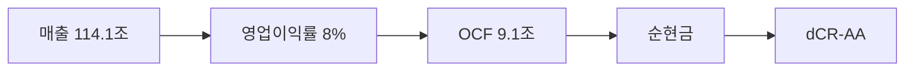

> ⚠️ **면책**: 본 보고서는 dartlab dCR v4.0 방법론에 따라 공시 데이터만으로 작성되었습니다. 제도권 신용등급과 다를 수 있으며, 투자 권유가 아닙니다. [방법론](https://github.com/eddmpython/dartlab/blob/master/ops/credit.md)

> **dCR-AA** | 투자적격 상위 | 2026-04-05 | 방법론 v4.0

## 1. 등급 요약

| 항목 | 값 |
|------|------|
| **신용등급** | **dCR-AA** (투자적격 상위) |
| 카테고리 | 최우량 (투자적격) |
| 종합 점수 | 7.2 / 100 |
| 부도확률(1Y) | 0.02% |
| 현금흐름등급 | eCR-3 |
| 등급 전망 | 부정적 |
| 업종 | 경기관련소비재 |
| 기준 기간 | 2025Q4 |

```
건전도: [██████████████████░░] 93/100
```

## 2. Executive Summary

기아는 매출 114.1조 규모의 경기관련소비재 기업으로, **dCR-AA** (건전도 93/100) 등급이다.

dCR-AA는 [매출 114.1조원 규모]에서 출발하는 [영업이익률 8%의 수익 기반]이 [OCF 9.1조원의 현금창출력]를 유지하게 하고, [부채 부담 없는 순현금 구조]가 등급을 뒷받침하는 구조를 반영한다. 핵심 강점인 채무상환능력, 자본구조, 재무신뢰성, 공시리스크이 업황 변동 시에도 등급을 방어하는 완충 역할을 한다.

**인과 연결**: 인과 요약: 매출 114.1조원 → 영업이익률 8%로, OCF 9.1조원를 창출하며 → 순현금 포지션을 유지한다. 종합 dCR-AA.

## 3. 재무 하이라이트

| 지표 | 값 | 전년비 |
|------|-----:|------:|
| 매출 | 114.1조 | +6.2% |
| 영업이익 | 9.1조 | -28.3% |
| EBITDA | 9.1조 | - |
| 영업현금흐름 | 9.1조 | - |
| 순차입금 | 순현금 | - |
| Debt/EBITDA | 0.1x | ↑악화 |

## 4. 사업 분석

### 4.1 기업 개요

- 섹터: 경기관련소비재 > 자동차와부품
- 주요제품: 승용차,중대형버스,트럭,민수특수차량,군수차량 제조,판매,정비
- 매출 규모: 114.1조


> **사업보고서 발췌**: "II. 사업의 내용 1. 사업의 개요 당사와 연결 종속회사는 보고서 작성 기준일 현재 완성차 및 부분품의 제조ㆍ판매, 렌트 및 정비용역을 사업으로 영위하고 있습니다. 렌트 및 정비부문은 연결실체 전체 매출에서 차지하는 비중이 중요하지 않음에 따라 연결실체는 하나의 보고 부문으로 구성됩니다. 주요 제품은 완성차로 승용, RV, 상용 등으로 구분하고 있습니다."

### 4.2 부문별 매출 구성

| 부문 | 매출 | 비중 |
|------|-----:|-----:|
| 영업 | 114.1조 | 100.0% |

## 5. 등급 근거 상세

dCR-AA는 [매출 114.1조원 규모]에서 출발하는 [영업이익률 8%의 수익 기반]이 [OCF 9.1조원의 현금창출력]를 유지하게 하고, [부채 부담 없는 순현금 구조]가 등급을 뒷받침하는 구조를 반영한다. 핵심 강점인 채무상환능력, 자본구조, 재무신뢰성, 공시리스크이 업황 변동 시에도 등급을 방어하는 완충 역할을 한다. 다만 유동성은 등급 하방 압력 요인으로 모니터링이 필요하다.

**인과 요약: 매출 114.1조원 → 영업이익률 8%로, OCF 9.1조원를 창출하며 → 순현금 포지션을 유지한다. 종합 dCR-AA.**

### 등급 결정 요인 분해

| 축 | 점수 | 가중치 | 기여도 | 비고 |
|------|-----:|------:|------:|------|
| 채무상환능력 | 0 | 25% | 0.0점 | 우수 |
| 자본구조 | 1 | 20% | 0.3점 | 우수 |
| 유동성 | 34 | 15% | 5.1점 | 보통 ← 등급 하방 압력 |
| 현금흐름 | 12 | 15% | 1.8점 | 양호 |
| 사업안정성 | 23 | 10% | 2.3점 | 보통 |
| 재무신뢰성 | 0 | 10% | 0.0점 | 우수 |
| **합계** | | | **7.2점** | **→ dCR-AA** |

### 강점
- **채무상환능력**: 채무상환능력은 경기관련소비재 업종 기준 매우 우수하다.
- **자본구조**: 자본구조는 매우 건전하다.
- **재무신뢰성**: 재무 신뢰성은 우수하다.
- **공시리스크**: 공시 리스크 신호가 감지되지 않았다.

### 약점
- **유동성**: 유동성은 주의가 필요한 수준이다.

### 양호
- **현금흐름**: 현금흐름 창출 능력은 양호하다.
- **사업안정성**: 사업 안정성은 양호한 수준이다.




## 6. 재무 분석

| 축 | 비중 | 판정 | 점수 |
|------|:---:|:---:|------|
| 채무상환능력 | 25% | **우수** | █████████░ 0/100 |
| 자본구조 | 20% | **우수** | █████████░ 1/100 |
| 유동성 | 15% | 보통 | ██████░░░░ 34/100 |
| 현금흐름 | 15% | 양호 | ████████░░ 12/100 |
| 사업안정성 | 10% | 양호 | ███████░░░ 23/100 |
| 재무신뢰성 | 10% | **우수** | ██████████ 0/100 |
| 공시리스크 | 5% | - | ░░░░░░░░░░ 평가 불가 |

### 6.* 차입금 구성

| 구분 | 금액 | 비중 |
|------|-----:|-----:|
| 단기차입금 | 2,113억 | 37.7% |
| 유동차입금(사채포함) | 2,209억 | 39.4% |
| 유동차입금 | 1,288억 | 23.0% |
| **합계** | **5,609억** | **100%** |

### 6.1 채무상환능력 (25%)

**판정: 우수** (0점/100)

채무상환능력은 경기관련소비재 업종 기준 매우 우수하다. 매출 114.1조원 기반 EBITDA 9.1조원을 창출한다. 총차입금 1.2조원 대비 이자 부담이 사실상 없어 무차입에 준하는 재무구조다. Debt/EBITDA 0.1배로 차입금을 1년 내 상환 가능한 수준이다. FFO/총차입금 785%로 우수한 내부 현금 창출력을 보인다.

| 지표 | 점수 | 판정 |
|------|:---:|:---:|
| FFO/총차입금 | 0 | 우수 |
| Debt/EBITDA | 0 | 우수 |
| FOCF/Debt | 0 | 우수 |
| EBITDA/이자비용 | 0 | 우수 |

### 6.2 자본구조 (20%)

**판정: 우수** (1점/100)

자본구조는 매우 건전하다. 부채비율 62%로 건전한 재무구조를 유지한다. 순차입금이 마이너스(순현금 포지션)로 실질적 부채 부담이 없다.

| 지표 | 점수 | 판정 |
|------|:---:|:---:|
| 부채비율 | 3 | 우수 |
| 차입금의존도 | 0 | 우수 |
| 순차입금/EBITDA | 1 | 우수 |

### 6.3 유동성 (15%)

**판정: 주의** (34점/100)

유동성은 주의가 필요한 수준이다. 유동비율 157%로 단기 유동성이 양호하다. 단기차입금 비중 100%로 차환 리스크가 존재한다. 현금비율 49%로 즉시 동원 가능한 현금이 충분하다. 유동비율(157%)과 현금비율은 우수하나, 단기차입금 비중(100%)이 높아 차환 시점의 유동성 관리가 필요하다. 현금 보유량이 충분하므로 실질적 차환 위험은 낮다.

| 지표 | 점수 | 판정 |
|------|:---:|:---:|
| 유동비율 | 11 | 양호 |
| 현금비율 | 0 | 우수 |
| 단기차입금비중 | 90 | 주의 |

### 6.4 현금흐름 (15%)

**판정: 양호** (12점/100)

현금흐름 창출 능력은 양호하다. OCF/매출 7.9%로 현금 창출이 양호하다. 투자 이후에도 잉여현금흐름(FCF)이 양수로 자체 성장 여력이 있다. 영업현금흐름이 3기 연속 양수로 안정적이다.

| 지표 | 점수 | 판정 |
|------|:---:|:---:|
| OCF/매출 | 20 | 양호 |
| FCF/매출 | 15 | 양호 |
| OCF추세 | 0 | 우수 |

### 6.5 사업안정성 (10%)

**판정: 양호** (23점/100)

사업 안정성은 양호한 수준이다. 매출 변동계수 27.6%로 실적 변동성이 크다. 매출 규모 114조원으로 대형 기업의 사업 안정성을 보유한다.

| 지표 | 점수 | 판정 |
|------|:---:|:---:|
| 매출안정성 | 39 | 보통 |
| 이익안정성 | 30 | 양호 |
| 규모 | 0 | 우수 |

### 6.6 재무신뢰성 (10%)

**판정: 우수** (0점/100)

재무 신뢰성은 우수하다. Piotroski F-Score 7/9로 재무 펀더멘탈이 강건하다. 감사의견은 적정으로 재무제표 신뢰성에 문제가 없다.

| 지표 | 점수 | 판정 |
|------|:---:|:---:|
| Piotroski F | 0 | 우수 |
| 감사의견 | 0 | 우수 |

### 6.7 공시리스크 (5%)

**판정: 우수** (평가 불가)

공시 리스크 신호가 감지되지 않았다. scan 데이터 범위 내 특이 신호 없음.

## 7. 5개년 재무 시계열

| 기간 | 매출 | 영업이익 | EBITDA/이자 | Debt/EBITDA | 부채비율 | 유동비율 | OCF/매출 |
|------|------|------|------|------|------|------|------|
| 2025Q4 | 114.1조 | 9.1조 | 무차입 | 0.1x ↑ | 62% ↓ | 157% → | 7.9% |
| 2024Q4 | 107.4조 | 12.7조 | 무차입 | 0.1x ↓ | 66% ↓ | 155% ↑ | 11.7% |
| 2023Q4 | 99.8조 | 11.6조 | 무차입 | 0.1x ↓ | 73% ↓ | 146% ↑ | 11.3% |
| 2022Q4 | 86.6조 | 7.2조 | 무차입 | 0.4x ↓ | 87% → | 135% → | 10.8% |
| 2021Q4 | 69.9조 | 5.1조 | 무차입 | 0.6x | 91% | 135% | 10.5% |

## 8. 리스크 진단

### 8.1 감사 리스크

- 감사의견: **적정**
  - 적정 의견 **8기 연속** 유지, 재무제표 신뢰도 양호

### 8.2 우발부채

- 우발부채 만성화 신호 없음

### 8.3 공시 리스크 키워드

- 리스크 키워드(횡령/배임/과징금 등) 감지 없음

### 8.4 구조 변화

- 감사인/계열 구조 변화 없음

### 8.5 전기 대비 주요 변화

- **계열사현황**: 전기 대비 대폭 변화 (변화 블록 4개)
- **investmentInOtherDetail**: 전기 대비 대폭 변화 (변화 블록 1개)
- **appendixSchedule**: 전기 대비 대폭 변화 (변화 블록 6개)

## 9. 등급 전망

현재 전망: **부정적**

### 하향 트리거
- 대규모 차입으로 이자보상배율이 5배 이하로 하락
- 부채비율이 현 62%에서 112% 이상으로 증가
- Debt/EBITDA가 현 0.1배에서 5배 이상으로 악화

## 10. 신평사 등급 대조

### 구조적 참고
- 외부 신용등급 데이터 없음 — data/credit/external_grades.json에 등록 필요.


## 11. 등급 괴리 분석

외부 신평사 등급과 dartlab dCR 등급이 일치합니다.
이는 공시 재무 데이터만으로도 이 기업의 신용 건전성을 정확히 포착할 수 있음을 의미합니다.

주요 등급 지지 요인:
- **채무상환능력**: 채무상환능력은 경기관련소비재 업종 기준 매우 우수하다.
- **자본구조**: 자본구조는 매우 건전하다.
- **재무신뢰성**: 재무 신뢰성은 우수하다.

dartlab dCR 등급이 외부 신평사 등급과 다를 수 있는 이유:

- 유동성 축이 34점으로 등급 하방 압력
- dartlab dCR은 공시 정량 데이터 기반. 시장 지위, 경영진, 그룹 지원 등 정성 요소는 미반영

## 12. 방법론 참조

- dartlab 독립 신용분석(dCR) v4.0
- 방법론 상세: [ops/credit.md](https://github.com/eddmpython/dartlab/blob/master/ops/credit.md)
- 발행일: 2026-04-05
