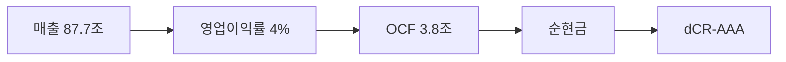

> **dCR-AAA** | 최우량 (notch 조정) | 2026-04-04 | 방법론 v4.0

## 1. 등급 요약

| 항목 | 값 |
|------|------|
| **신용등급** | **dCR-AAA** (최우량 (notch 조정)) |
| 카테고리 | 최우량 (투자적격) |
| 종합 점수 | 12.1 / 100 |
| 부도확률(1Y) | 0.00% |
| 현금흐름등급 | eCR-4 |
| 등급 전망 | 긍정적 |
| 업종 | IT |
| 기준 기간 | 2024Q4 |

```
건전도: [█████████████████░░░] 88/100
```

## 2. Executive Summary

LG전자는 매출 87.7조 규모의 IT 기업으로, **dCR-AAA** (건전도 88/100) 등급이다.

dCR-AAA는 [매출 87.7조원 규모]에서 출발하는 [영업이익률 4%의 수익 기반]이 [OCF 3.8조원의 현금창출력]를 유지하게 하고, [부채 부담 없는 순현금 구조]가 등급을 뒷받침하는 구조를 반영한다. 핵심 강점인 채무상환능력, 사업안정성, 공시리스크이 업황 변동 시에도 등급을 방어하는 완충 역할을 한다. 다만 재무신뢰성은 등급 하방 압력 요인으로 모니터링이 필요하다.

**인과 연결**: 인과 요약: 매출 87.7조원 → 영업이익률 4%에 불과하여, EBITDA 3.4조원 이상의 현금(OCF 3.8조원)을 창출하고 → 순현금 포지션을 유지한다. 종합 dCR-AAA.

## 3. 재무 하이라이트

| 지표 | 값 | 전년비 |
|------|-----:|------:|
| 매출 | 87.7조 | +4.2% |
| 영업이익 | 3.4조 | -3.7% |
| EBITDA | 3.4조 | - |
| 영업현금흐름 | 3.8조 | - |
| 순차입금 | 순현금 | - |
| Debt/EBITDA | 0.0x | - |

## 4. 사업 분석

### 4.1 기업 개요

- 섹터: IT > 기술하드웨어와장비
- 주요제품: 이동통신단말기,C-TV,V.C.R.,컴퓨터,완전평면 TV,플라즈마 디스플레이 패널 TV,전자제품(세탁기외),CDMA(코드분할다중접속)이동통신,전자교환기,전송기기
- 매출 규모: 87.7조

### 4.2 부문별 매출 구성

| 부문 | 매출 | 비중 |
|------|-----:|-----:|
| 냉장고, 세탁기, 청소기 등 | 44.4조 | 50.6% |
| HS | 12.8조 | 14.6% |
| 이노텍 | 10.7조 | 12.2% |
| MS | 9.7조 | 11.0% |
| VS | 5.5조 | 6.3% |
| ES | 4.6조 | 5.3% |

## 5. 등급 근거 상세

dCR-AAA는 [매출 87.7조원 규모]에서 출발하는 [영업이익률 4%의 수익 기반]이 [OCF 3.8조원의 현금창출력]를 유지하게 하고, [부채 부담 없는 순현금 구조]가 등급을 뒷받침하는 구조를 반영한다. 핵심 강점인 채무상환능력, 사업안정성, 공시리스크이 업황 변동 시에도 등급을 방어하는 완충 역할을 한다. 다만 재무신뢰성은 등급 하방 압력 요인으로 모니터링이 필요하다.

**인과 요약: 매출 87.7조원 → 영업이익률 4%에 불과하여, EBITDA 3.4조원 이상의 현금(OCF 3.8조원)을 창출하고 → 순현금 포지션을 유지한다. 종합 dCR-AAA.**

### 강점
- **채무상환능력**: 채무상환능력은 IT 업종 기준 매우 우수하다.
- **사업안정성**: 사업 안정성은 매우 높다.
- **공시리스크**: 공시 리스크 신호가 감지되지 않았다.

### 약점
- **재무신뢰성**: 재무 신뢰성은 주의가 필요하다.

### 양호
- **자본구조**: 자본구조는 양호하다.
- **유동성**: 유동성은 적정 수준이다.
- **현금흐름**: 현금흐름 창출 능력은 양호하다.




## 6. 재무 분석

| 축 | 비중 | 판정 | 점수 |
|------|:---:|:---:|------|
| 채무상환능력 | 25% | **우수** | ██████████ 0/100 |
| 자본구조 | 20% | 양호 | ████████░░ 14/100 |
| 유동성 | 15% | 양호 | ████████░░ 15/100 |
| 현금흐름 | 15% | 양호 | ████████░░ 17/100 |
| 사업안정성 | 10% | **우수** | █████████░ 7/100 |
| 재무신뢰성 | 10% | 보통 | ███████░░░ 25/100 |
| 공시리스크 | 5% | - | ░░░░░░░░░░ 평가 불가 |

### 6.1 채무상환능력 (25%)

**판정: 우수** (0점/100)

채무상환능력은 IT 업종 기준 매우 우수하다. 매출 87.7조원 기반 EBITDA 3.4조원을 창출한다. 이자 부담이 사실상 없어 무차입에 준하는 재무구조다. Debt/EBITDA 0.0배로 차입금을 1년 내 상환 가능한 수준이다.

| 지표 | 점수 | 판정 |
|------|:---:|:---:|
| FFO/총차입금 | 0 | 우수 |
| Debt/EBITDA | 0 | 우수 |
| FOCF/Debt | 0 | 우수 |
| EBITDA/이자비용 | 0 | 우수 |

### 6.2 자본구조 (20%)

**판정: 양호** (14점/100)

자본구조는 양호하다. 부채비율 160%로 적정 수준의 레버리지를 활용한다. 순차입금/EBITDA 0.0배로 실질 부채 부담이 낮다.

| 지표 | 점수 | 판정 |
|------|:---:|:---:|
| 부채비율 | 39 | 보통 |
| 차입금의존도 | 0 | 우수 |
| 순차입금/EBITDA | 3 | 우수 |

### 6.3 유동성 (15%)

**판정: 양호** (15점/100)

유동성은 적정 수준이다. 유동비율 124%로 단기 유동성이 적정하다.

| 지표 | 점수 | 판정 |
|------|:---:|:---:|
| 유동비율 | 19 | 양호 |
| 현금비율 | 10 | 양호 |

### 6.4 현금흐름 (15%)

**판정: 양호** (17점/100)

현금흐름 창출 능력은 양호하다. OCF/매출 4.4%로 현금 창출이 제한적이다. 투자 이후에도 잉여현금흐름(FCF)이 양수로 자체 성장 여력이 있다. 영업현금흐름이 3기 연속 양수로 안정적이다.

| 지표 | 점수 | 판정 |
|------|:---:|:---:|
| OCF/매출 | 35 | 보통 |
| FCF/매출 | 15 | 양호 |
| OCF추세 | 0 | 우수 |

### 6.5 사업안정성 (10%)

**판정: 우수** (7점/100)

사업 안정성은 매우 높다. 매출 변동계수 15.0%로 적정한 안정성을 보인다. 매출 규모 88조원으로 대형 기업의 사업 안정성을 보유한다.

| 지표 | 점수 | 판정 |
|------|:---:|:---:|
| 매출안정성 | 20 | 양호 |
| 이익안정성 | 0 | 우수 |
| 규모 | 0 | 우수 |

### 6.6 재무신뢰성 (10%)

**판정: 주의** (25점/100)

재무 신뢰성은 주의가 필요하다.

| 지표 | 점수 | 판정 |
|------|:---:|:---:|
| Piotroski F | 25 | 양호 |

### 6.7 공시리스크 (5%)

**판정: 우수** (평가 불가)

공시 리스크 신호가 감지되지 않았다. scan 데이터 범위 내 특이 신호 없음.

## 7. 5개년 재무 시계열

| 기간 | 매출 | 영업이익 | EBITDA/이자 | Debt/EBITDA | 부채비율 | 유동비율 | OCF/매출 |
|------|------|------|------|------|------|------|------|
| 2024Q4 | 87.7조 | 3.4조 | 무차입 | 0.0x → | 160% → | 124% → | 4.4% |
| 2023Q4 | 84.2조 | 3.5조 | 무차입 | 0.0x ↓ | 156% ↑ | 126% → | 7.0% |
| 2022Q4 | 83.6조 | 3.5조 | 무차입 | 3.2x ↑ | 145% ↓ | 123% ↑ | 3.7% |
| 2021Q4 | 75.7조 | 3.6조 | 무차입 | 2.8x ↑ | 166% → | 116% → | 3.5% |
| 2020Q4 | 63.3조 | 3.2조 | 무차입 | 0.0x | 175% | 115% | 7.3% |

## 8. 등급 전망

현재 전망: **긍정적**

### 상향 트리거
- 부채비율이 현 160%에서 80% 이하로 축소

### 하향 트리거
- 대규모 차입으로 이자보상배율이 5배 이하로 하락
- 부채비율이 현 160%에서 210% 이상으로 증가
- Debt/EBITDA가 현 0.0배에서 5배 이상으로 악화

## 9. 신평사 등급 대조

### 구조적 참고
- 외부 신용등급 데이터 없음 — data/credit/external_grades.json에 등록 필요.


## 10. 등급 괴리 분석

외부 신평사 등급과 dartlab dCR 등급이 일치합니다.
이는 공시 재무 데이터만으로도 이 기업의 신용 건전성을 정확히 포착할 수 있음을 의미합니다.

주요 등급 지지 요인:
- **채무상환능력**: 채무상환능력은 IT 업종 기준 매우 우수하다.
- **사업안정성**: 사업 안정성은 매우 높다.
- **공시리스크**: 공시 리스크 신호가 감지되지 않았다.

dartlab dCR 등급이 외부 신평사 등급과 다를 수 있는 이유:

- dartlab dCR은 공시 정량 데이터 기반. 시장 지위, 경영진, 그룹 지원 등 정성 요소는 미반영

## 11. Notch Adjustment 상세

총 조정: **-4 notch (상향)**

적용 규칙:
- 대형기업 (매출 88조)
- 시가총액 23조
- 연속 8기 영업흑자 (경영 안정성)

## 12. 면책 + 방법론

- dartlab 독립 신용분석(dCR) v4.0
- 공시 데이터 기반 정량 분석. 비공개 면담/정성 판단 미포함.
- dCR 등급은 제도권 신용등급과 다를 수 있으며, 투자 권유가 아닙니다.
- 방법론 상세: [ops/credit.md](https://github.com/eddmpython/dartlab/blob/master/ops/credit.md)
- 발행일: 2026-04-04
