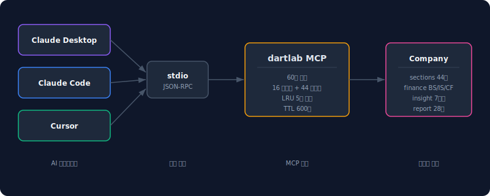
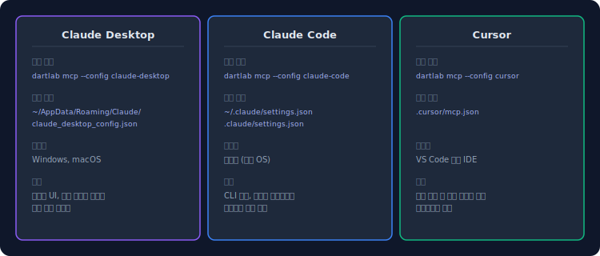
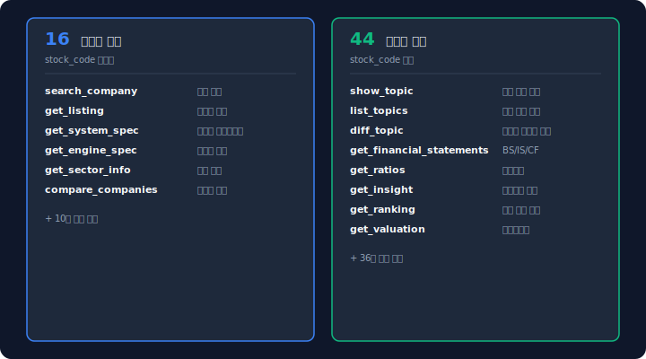
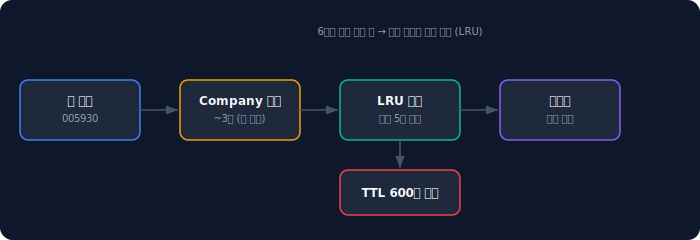
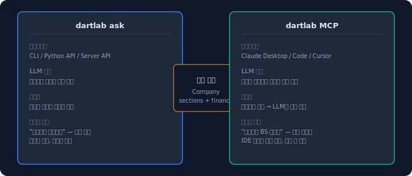

전자공시를 분석하려면 DART 사이트에서 보고서를 열고, 필요한 숫자를 복사하고, 스프레드시트에 붙여넣고, 다시 AI에게 물어본다. 탭을 4개 이상 오가는 이 흐름은 비효율적이다.

MCP(Model Context Protocol)는 이 문제를 해결한다. AI 클라이언트가 외부 도구를 직접 호출할 수 있게 하는 프로토콜이다. dartlab MCP 서버를 연결하면 Claude Desktop, Claude Code, Cursor 안에서 — 탭 전환 없이 — 전자공시 데이터를 바로 조회한다.

## MCP가 무엇이고 왜 전자공시에 쓰는가

MCP는 Anthropic이 만든 개방형 프로토콜이다. AI 모델과 외부 데이터 소스를 표준화된 방식으로 연결한다. 핵심은 간단하다 — **AI 클라이언트가 "도구 목록"을 받고, 필요할 때 도구를 호출**한다.

기존 방식과 비교하면 차이가 명확하다.

| 기존 방식 | MCP 방식 |
|---|---|
| DART 사이트 → 보고서 열기 → 복사 → AI에 붙여넣기 | "삼성전자 BS 보여줘" → AI가 직접 조회 |
| 탭 4개 전환 | 하나의 대화창 |
| 수동 데이터 입력 | 구조화된 데이터 자동 전달 |
| 매번 같은 작업 반복 | 한 번 설정하면 영구 사용 |

dartlab MCP 서버는 **60개 도구**를 노출한다. 기업 검색, 재무제표, 사업보고서 섹션, 재무비율, 인사이트 등급, 시장 순위 — 전자공시 분석에 필요한 모든 것이 도구로 존재한다.



## 구조가 작동하는 순서

1. **서버 시작** — `dartlab mcp`를 실행하면 stdio 기반 MCP 서버가 뜬다
2. **도구 목록 전달** — 클라이언트가 연결하면 60개 도구의 이름·설명·파라미터를 JSON으로 전달한다
3. **도구 호출** — 사용자가 "삼성전자 재무비율 보여줘"라고 하면, LLM이 `get_ratios(stock_code="005930")`를 호출한다
4. **Company 캐시** — 처음 요청된 종목은 Company 객체를 생성하고 LRU 캐시에 저장한다. 같은 종목 재요청은 즉시 반환된다
5. **결과 반환** — 구조화된 데이터(DataFrame → JSON)가 클라이언트로 돌아가고, LLM이 이를 해석해서 답변한다

## 3분 만에 Claude Desktop에서 첫 조회하기

```bash
# 1. dartlab 설치 (MCP 의존성 포함)
pip install "dartlab[mcp]"

# 2. Claude Desktop 설정 자동 생성
dartlab mcp --config claude-desktop
```

이 명령은 Claude Desktop의 설정 파일에 dartlab MCP 서버를 등록한다. 설정 파일 위치는 운영체제에 따라 다르다.

- **Windows**: `%APPDATA%\Claude\claude_desktop_config.json`
- **macOS**: `~/Library/Application Support/Claude/claude_desktop_config.json`

생성되는 설정 내용:

```json
{
  "mcpServers": {
    "dartlab": {
      "command": "uv",
      "args": ["run", "dartlab", "mcp"]
    }
  }
}
```

Claude Desktop을 재시작하면 dartlab 도구가 활성화된다. 이제 대화창에서 바로 질문하면 된다.

```
"삼성전자 최근 재무제표 보여줘"
"현대차와 기아 영업이익률 비교해줘"
"005930 사업의 내용 중 매출 현황 테이블"
```

## Claude Code와 Cursor에서 설정하기



**Claude Code:**

```bash
dartlab mcp --config claude-code
```

설정이 `~/.claude/settings.json` 또는 프로젝트의 `.claude/settings.json`에 추가된다.

**Cursor:**

```bash
dartlab mcp --config cursor
```

설정이 `.cursor/mcp.json`에 추가된다.

모든 클라이언트의 설정은 같은 구조다 — `dartlab mcp` 명령을 stdio로 실행하는 것. 차이는 설정 파일 경로뿐이다.

## 60개 도구 — 무엇을 조회할 수 있는가

dartlab MCP 서버는 **16개 글로벌 도구**와 **44개 기업별 도구**를 제공한다.



**글로벌 도구** (stock_code 불필요):

| 도구 | 용도 |
|---|---|
| `search_company` | 기업 검색 (이름, 코드, 업종) |
| `get_listing` | 상장사 목록 |
| `get_system_spec` | dartlab 시스템 메타데이터 |
| `get_engine_spec` | 특정 엔진 스펙 |
| `compare_companies` | 기업간 비교 |

**기업별 도구** (stock_code 필수):

| 도구 | 용도 |
|---|---|
| `show_topic` | 공시 주제(44개 모듈) 조회 |
| `list_topics` | 조회 가능한 주제 목록 |
| `diff_topic` | 기간별 텍스트 변화 감지 |
| `get_financial_statements` | 재무제표 (BS/IS/CF) |
| `get_ratios` | 재무비율 |
| `get_timeseries` | 특정 계정 시계열 |
| `get_insight` | 인사이트 등급 (7영역) |
| `get_ranking` | 시장 규모 순위 |
| `get_valuation` | 밸류에이션 |

실제 사용에서는 "삼성전자 부채비율 추세"라고 말하면 LLM이 알아서 `get_ratios(stock_code="005930")`를 호출한다. 도구 이름을 외울 필요가 없다.

## 어디에서 왜곡이 생기나

**LRU 캐시 5개 제한.** MCP 서버는 메모리 보호를 위해 최대 5개 Company만 캐시에 보관한다. 6번째 종목을 요청하면 가장 오래된 종목이 퇴출된다. 퇴출된 종목을 다시 요청하면 처음부터 로드한다.



**TTL 600초.** 캐시에 있는 Company 객체는 600초(10분) 후 자동 만료된다. 이후 같은 종목을 요청하면 새로 로드한다. 공시 데이터가 변경되는 주기를 고려하면 10분은 적절한 값이다.

**첫 로딩이 느리다.** Company 객체를 처음 생성할 때 공시 데이터를 다운로드한다. 종목에 따라 2~5초가 걸린다. 두 번째 요청부터는 캐시 덕분에 즉시 반환된다.

## 놓치기 쉬운 예외

**MCP SDK 미설치.** `pip install dartlab`만으로는 MCP 의존성이 설치되지 않는다. 반드시 `pip install "dartlab[mcp]"` (또는 `uv add "dartlab[mcp]"`)로 설치해야 한다.

**uv 경로 문제.** Claude Desktop 설정에서 `"command": "uv"`를 사용할 때, uv가 시스템 PATH에 있어야 한다. 찾을 수 없다는 에러가 나면 절대 경로를 사용한다.

```json
{
  "mcpServers": {
    "dartlab": {
      "command": "/path/to/uv",
      "args": ["run", "dartlab", "mcp"]
    }
  }
}
```

**Windows vs macOS 경로.** 설정 파일 경로가 OS마다 다르다. `dartlab mcp --config` 명령이 자동으로 올바른 경로에 설정을 생성하므로 수동 편집 없이 쓰는 것을 권장한다.

## 빠른 점검 체크리스트

- [ ] `pip install "dartlab[mcp]"` (MCP 의존성 포함 설치)
- [ ] `dartlab mcp --config claude-desktop` (설정 생성)
- [ ] Claude Desktop 재시작
- [ ] "삼성전자 검색해줘" — `search_company` 도구 호출 확인
- [ ] "삼성전자 재무제표 보여줘" — `get_financial_statements` 호출 확인
- [ ] 두 번째 요청이 즉시 반환되는지 확인 (캐시 동작)

## FAQ

### MCP 서버를 띄우면 어떤 리소스를 소모하나요?

MCP 서버 자체는 가벼운 Python 프로세스다. 메모리 소모는 캐시된 Company 객체 수에 비례한다 — Company 1개당 200~500MB. LRU 5개 제한으로 최대 ~2.5GB를 사용할 수 있다.

### 한 번에 몇 개 회사를 동시에 조회할 수 있나요?

캐시 제한은 5개이지만, 6번째 종목을 요청하면 가장 오래된 것이 퇴출될 뿐 에러가 나지는 않는다. 다만 캐시 밖 종목은 매번 새로 로드해야 하므로 느려진다.

### EDGAR(미국 기업)도 MCP로 조회할 수 있나요?

가능하다. ticker(예: AAPL, MSFT)를 stock_code로 넘기면 EDGAR Company로 자동 전환된다. 현재 베타 단계이며 10-K/10-Q 기반 데이터를 지원한다.

### `dartlab mcp --config`는 설정을 자동으로 써주나요?

그렇다. 기존 설정 파일이 있으면 `mcpServers` 섹션에 dartlab을 추가한다. 기존 설정은 건드리지 않는다. 파일이 없으면 새로 생성한다.

### Cursor에서 dartlab MCP를 쓰려면 추가 설정이 필요한가요?

`dartlab mcp --config cursor`만 실행하면 된다. `.cursor/mcp.json`이 생성되고, Cursor를 재시작하면 활성화된다. 추가 설정이나 확장 설치는 필요 없다.

### MCP 서버에서 AI 분석(ask)도 할 수 있나요?

MCP 서버는 **데이터 조회 도구**를 제공한다. AI 분석은 클라이언트(Claude Desktop 등)의 LLM이 담당한다. 즉, MCP로 데이터를 가져오고 Claude가 해석하는 구조다. `dartlab ask`와는 역할 분담이 다르다.

### OpenAI API 키 없이 MCP만으로도 쓸 수 있나요?

MCP 서버는 LLM API 키가 필요 없다. 데이터를 제공하는 서버일 뿐이다. LLM은 클라이언트(Claude Desktop, Cursor 등)가 제공한다. 즉, Claude Desktop 구독만 있으면 dartlab MCP를 바로 쓸 수 있다.

## 참고 자료

- [dartlab 설치 및 설정 가이드](https://eddmpython.github.io/dartlab/docs/getting-started)
- [MCP 공식 문서](https://modelcontextprotocol.io)
- [파이썬으로 재무제표 분석하기](/blog/python-financial-analysis) — dartlab의 기본 사용법
- [dartlab ask — GPT 하나로 전자공시 AI 분석하는 법](/blog/dartlab-ask-ai-disclosure-analysis) — MCP의 반대편, 자연어 종합 분석

## 핵심 구조 요약



dartlab MCP의 구조는 세 문장으로 요약된다.

1. **60개 도구가 전자공시 전체를 커버한다** — 기업 검색, 재무제표, 사업보고서, 재무비율, 인사이트, 시장 순위까지 하나의 MCP 서버로 접근한다.
2. **설정은 한 줄이다** — `dartlab mcp --config claude-desktop` 하나면 Claude Desktop에서 바로 사용할 수 있다.
3. **ask와 MCP는 같은 엔진이다** — 둘 다 dartlab Company를 소비한다. ask는 LLM이 해석하고, MCP는 LLM이 도구를 호출한다. 상황에 맞게 선택하면 된다.
