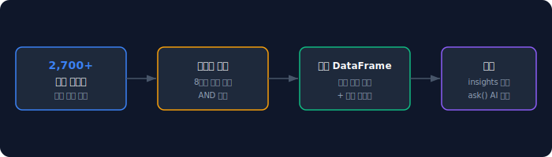
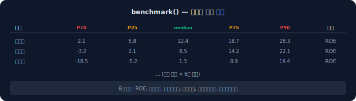
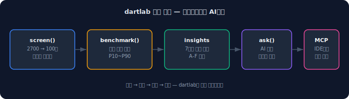

2700개 상장사에서 원하는 조건의 종목을 찾으려면, HTS에서 필터를 걸거나 엑셀에서 하나씩 비교해야 한다. 필터 조건이 복잡할수록 시간이 기하급수적으로 늘어난다.

dartlab의 `screen()`은 8가지 검증된 프리셋으로 전체 상장사를 한 줄에 필터링한다. `benchmark()`는 섹터별 핵심 비율의 분포(P10~P90)를 돌려줘서, 개별 종목의 위치를 즉시 파악할 수 있게 한다.

## screen() — 한 줄 스크리닝

```python
import dartlab

df = dartlab.screen("가치주")
# DataFrame: 종목코드, 종목명, 섹터, ROE, 부채비율, 영업이익률, ...
```

프리셋 이름을 넣으면, 해당 조건에 맞는 상장사만 필터링된 Polars DataFrame이 반환된다.



## 8가지 프리셋

| 프리셋 | 핵심 조건 | 찾는 기업 |
|---|---|---|
| **가치주** | ROE≥10, 부채≤100, 영업마진≥5, 유동비≥150 | 저평가 우량주 |
| **성장주** | ROE≥15, 영업마진≥10, 매출≥1,000억 | 고성장 대형주 |
| **턴어라운드** | ROE 0 미만(단 -30 초과), 부채≤80, 유동비≥150 | 회복 가능성 있는 적자 기업 |
| **현금부자** | FCF>0, 영업CF마진≥10, 부채≤60 | 현금 창출력 우수 |
| **고위험** | 부채≥200, 이자보상배수 3 미만 | 재무 위험 기업 |
| **자본잠식** | 자기자본비율 20 미만, ROE 0 미만 | 자본잠식 위험 |
| **소형고수익** | 자산 10~100억, ROE≥15, 영업마진≥10 | 숨은 소형 우량주 |
| **대형안정** | 자산≥1조, 부채≤150, ROE≥5, 유동비≥100 | 대형 안정주 |


## 프리셋이 작동하는 방식

각 프리셋은 재무비율 조건의 조합이다. 내부적으로 전체 상장사의 비율 데이터를 미리 계산해두고, 조건에 맞는 종목만 필터링한다.

```python
# "가치주" 프리셋의 내부 로직 (간략화)
# ROE >= 10
# debtRatio <= 100
# operatingMargin >= 5
# currentRatio >= 150
```

조건은 AND 결합이다. 모든 조건을 동시에 만족하는 종목만 결과에 포함된다.

## benchmark() — 섹터별 비율 분포

```python
df = dartlab.benchmark()
# DataFrame: sector, roe_p10, roe_median, roe_p90, debtRatio_p10, ...
```

전체 상장사의 핵심 비율을 섹터별로 집계한다. 각 섹터의 P10(하위 10%), P25, 중앙값(median), P75, P90(상위 10%)을 계산한다.



**포함되는 비율 6개:**
- ROE (자기자본이익률)
- 부채비율
- 영업이익률
- 유동비율
- 총자산회전율
- 매출총이익률

## screen()과 benchmark()를 함께 쓰기

스크리닝으로 종목을 뽑고, 벤치마크로 해당 종목이 섹터 내 어디에 위치하는지 확인하는 것이 전형적인 사용 패턴이다.

```python
import dartlab

# 1. 가치주 스크리닝
value_stocks = dartlab.screen("가치주")

# 2. 섹터 벤치마크
bench = dartlab.benchmark()

# 3. 특정 종목의 섹터 내 위치 확인
from dartlab import Company
c = Company("005930")
c.market  # 시장 순위, 섹터 내 위치 정보
```

## RankInfo — 종목별 시장 위치

개별 종목의 시장 내 위치는 `c.market`으로 접근한다.

```python
c = Company("005930")
rank = c.market

rank.revenueRank          # 전체 매출 순위 (예: 1)
rank.revenueRankInSector  # 섹터 내 매출 순위
rank.sizeClass            # 'large' | 'mid' | 'small'
rank.sector               # WICS 섹터명
rank.revenueGrowth3Y      # 3년 매출 CAGR
```

## 어디에서 왜곡이 생기나

**비율 데이터 시점.** screen()과 benchmark()는 가장 최근 제출된 재무데이터 기준이다. 분기 보고서 제출 직후가 가장 정확하고, 제출 전에는 이전 분기 데이터를 기반으로 한다.

**금융업 필터.** 은행·보험은 유동비율, 재고회전율 등이 구조적으로 다르다. 프리셋 필터 중 유동비율이나 부채비율 조건이 있으면 금융업이 자동으로 제외될 수 있다.

**소형주 데이터 품질.** 소형주 중 XBRL 제출이 불완전한 종목은 비율 계산이 불가능해서 스크리닝에서 자동 제외된다.

## 놓치기 쉬운 예외

**커스텀 프리셋은 아직 지원하지 않는다.** 현재 8가지 고정 프리셋만 제공된다. 커스텀 조건이 필요하면 `benchmark()` DataFrame에서 직접 Polars 필터를 적용하면 된다.

**턴어라운드 프리셋의 ROE 범위.** ROE가 -30 미만인 극단적 적자 기업은 턴어라운드 프리셋에서 제외된다. 이는 회복 가능성이 매우 낮은 종목을 걸러내기 위함이다.

**결과는 캐시되지 않는다.** screen()과 benchmark()는 호출할 때마다 전체 상장사 데이터를 스캔한다. 같은 세션에서 반복 호출하면 동일한 결과가 나오지만, 새 세션에서는 최신 데이터로 갱신된다.

## 빠른 점검 체크리스트

- [ ] `dartlab.screen("가치주")` — DataFrame 반환 확인
- [ ] 8가지 프리셋 모두 작동 확인
- [ ] `dartlab.benchmark()` — 섹터별 분포 DataFrame 확인
- [ ] `Company("005930").market` — 시장 순위 확인
- [ ] 결과를 `.to_pandas()` 또는 `.write_csv()`로 내보내기

## FAQ

### 프리셋 조건을 바꿀 수 있나요?

현재는 고정 프리셋만 제공된다. 커스텀 조건이 필요하면 `dartlab.benchmark()` DataFrame을 직접 필터링하거나, `c.ratios`에서 원하는 비율을 직접 조합할 수 있다.

### 결과에 주가 데이터가 포함되나요?

현재 screen()은 재무비율 기반이다. 주가, PER, PBR 등 시장 밸류에이션 데이터는 포함되지 않는다.

### 전체 상장사 중 몇 개나 통과하나요?

프리셋에 따라 다르다. "가치주"는 보통 100~200개, "자본잠식"은 20~50개, "대형안정"은 50~100개 수준이다. 시장 상황에 따라 변동한다.

### benchmark()의 섹터 분류 기준은?

WICS(Wise Industry Classification Standard) 기준이다. 한국거래소 업종 분류와는 다를 수 있다.

### screen()과 insights의 차이는?

screen()은 전체 시장을 비율 조건으로 필터링하는 것이고, insights는 개별 기업을 7영역으로 심층 분석하는 것이다. screen()으로 후보를 좁히고, insights로 깊이 파는 것이 일반적인 흐름이다.

### 미국 주식도 스크리닝할 수 있나요?

현재 screen()과 benchmark()는 한국 상장사(DART) 전용이다. EDGAR 기업 개별 분석은 `Company("AAPL")`로 가능하지만, 전체 미국 시장 스크리닝은 지원하지 않는다.

### 결과를 엑셀로 내보낼 수 있나요?

Polars DataFrame이므로 `.write_csv("output.csv")`나 `.to_pandas().to_excel("output.xlsx")`로 즉시 내보낼 수 있다.

## 참고 자료

- [dartlab 재무제표 가이드](/blog/dartlab-finance-ratios-one-line) — 스크리닝의 기반이 되는 재무비율
- [dartlab 인사이트 등급](/blog/dartlab-insights-7area-grading) — 스크리닝 후 개별 심층 분석
- [dartlab signal — 시장 전체 키워드 감지](/blog/dartlab-signal-digest-market-scan) — 공시 텍스트 기반 시장 스캔

## 핵심 구조 요약



dartlab 스크리닝의 구조는 세 문장으로 요약된다.

1. **8가지 프리셋 × 2700개 종목** — 가치주, 성장주, 턴어라운드 등 검증된 조건으로 전체 상장사를 한 줄에 필터링한다.
2. **섹터별 P10~P90 벤치마크** — 개별 종목이 섹터 내 어디에 위치하는지 즉시 파악한다.
3. **스크리닝 → 인사이트 → AI 분석** — screen()으로 좁히고, insights로 파고, ask()로 해석하는 것이 dartlab의 분석 흐름이다.
