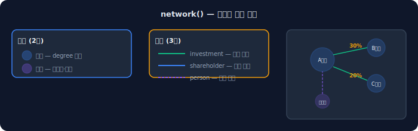
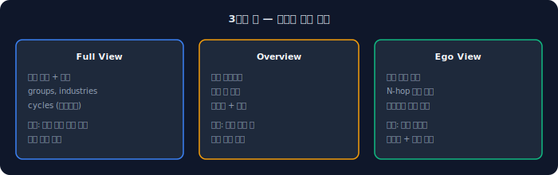
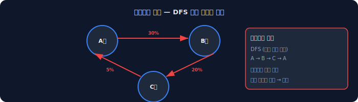
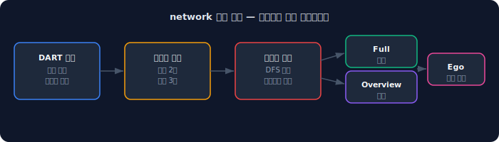

기업 A가 기업 B의 주식을 30% 보유하고, B가 C를 20% 보유하고, C가 다시 A를 5% 보유한다 — 이런 관계를 찾으려면 공시를 하나씩 추적해야 한다. 2700개 상장사 전체로 확장하면 사실상 불가능하다.

dartlab의 `network()`는 전체 상장사의 투자·주주·인적 관계를 그래프로 구축하고, 순환출자를 자동으로 감지한다. 코드 한 줄이면 된다.

## network() — 전체 관계 지도

```python
import dartlab

result = dartlab.network()
# 전체 상장사 관계 그래프 + 인터랙티브 시각화
```

네트워크는 두 종류의 노드와 세 종류의 엣지로 구성된다.

**노드:**
- **기업 노드** — 상장사, degree(연결 수) 포함
- **인물 노드** — 대주주·임원, 기업과의 관계 포함

**엣지:**
- **investment** — A 기업이 B 기업에 투자 (지분율 포함)
- **shareholder** — A 기업이 B 기업의 주주
- **person_shareholder** — 인물이 기업의 주주



## 3가지 뷰

네트워크 데이터는 3가지 뷰로 소비할 수 있다.

### Full View — 전체 그래프

전체 상장사의 모든 노드와 엣지를 포함한 완전한 그래프다.

```python
# 내부적으로 build_graph() → export_full()
# nodes, edges, groups, industries, cycles
```

- **nodes**: 기업 + 인물 (degree, inDegree, outDegree 계산)
- **edges**: 투자, 주주, 인적 관계
- **groups**: 재무상태 기반 기업 분류
- **industries**: 섹터별 클러스터링
- **cycles**: 순환출자 경로

### Overview — 그룹 슈퍼노드

기업을 그룹 단위로 묶어서 그룹 간 관계만 보여주는 축약 뷰다.

- **nodes**: 그룹 클러스터 (구성 기업 수, 집계된 degree)
- **edges**: 그룹 간 관계 (가중치, 관계 유형)

### Ego — 특정 기업 중심

특정 기업을 중심으로 N-hop 이내의 관계만 추출한 뷰다.

```python
# 삼성전자 중심 2-hop 네트워크
# ego view: center + neighbors within 2 hops
```

연결이 적은 기업은 동종업계(industry peers)를 자동으로 추가해서 비교 맥락을 제공한다.



## 순환출자 자동 감지

네트워크 엔진은 DFS(깊이 우선 탐색) 기반 순환 감지를 내장하고 있다. A→B→C→A 같은 순환 경로를 자동으로 찾아낸다.

```python
# cycles 필드에 순환출자 경로가 담긴다
# [["005930", "000810", "005930"], ...]
# 각 리스트가 하나의 순환 경로
```



순환출자는 기업지배구조의 핵심 이슈다. 수동으로 찾는 데 수일이 걸리는 작업을 자동으로 수행한다.

## 관련 스캔 함수들

network() 외에도 관계망 기반 분석 함수들이 있다.

```python
# 지배구조 전체 스캔
dartlab.governance()

# 인력/급여 스캔
dartlab.workforce()

# 주주환원 스캔
dartlab.capital()

# 부채 구조 스캔
dartlab.debt()

# 그룹사 건전성
dartlab.groupHealth()
```

이 함수들은 network()의 관계 데이터 위에서 특화된 분석을 수행한다.

## 어디에서 왜곡이 생기나

**공시 시차.** 지분 변동 공시가 실제 거래일보다 늦게 제출될 수 있다. 네트워크는 가장 최근 공시 기준이므로, 실시간 지분 상태와 차이가 있을 수 있다.

**간접 보유.** 현재 네트워크는 직접 보유 관계만 추적한다. A가 B를 통해 간접적으로 C를 보유하는 관계는 엣지로 직접 표현되지 않지만, 그래프를 순회하면 추적 가능하다.

**인물 동명이인.** 같은 이름의 다른 인물이 하나의 노드로 합쳐질 수 있다. 현재 이름 기반 매칭이므로 완벽하지 않다.

## 놓치기 쉬운 예외

**비상장 관계사.** 네트워크는 상장사 간 관계가 중심이다. 비상장 중간지주사를 통한 관계는 부분적으로만 포착된다.

**해외 자회사.** DART 공시에 보고된 해외 자회사만 포함된다. 현지에서만 공시되는 관계는 포착되지 않는다.

**메모리 사용량.** 전체 상장사 네트워크를 구축하므로 상당한 메모리를 사용한다. 다른 무거운 작업과 동시 실행은 피하는 것이 좋다.

## 빠른 점검 체크리스트

- [ ] `dartlab.network()` — 전체 관계 그래프 생성 확인
- [ ] 노드와 엣지 데이터 구조 확인
- [ ] 순환출자(cycles) 감지 결과 확인
- [ ] `dartlab.governance()` — 지배구조 스캔
- [ ] `dartlab.groupHealth()` — 그룹사 건전성

## FAQ

### 시각화가 자동으로 나오나요?

`dartlab.network()`는 인터랙티브 시각화를 자동 생성한다. 별도의 시각화 라이브러리 설치가 필요 없다.

### 특정 그룹사만 볼 수 있나요?

Ego View를 사용하면 특정 기업 중심의 네트워크를 추출할 수 있다. 그룹사 전체를 보려면 Overview의 그룹 노드에서 시작하면 된다.

### 순환출자가 없으면 cycles가 비어 있나요?

그렇다. 순환출자가 감지되지 않으면 빈 리스트가 반환된다. 실제로 한국 시장에서 순환출자는 점점 줄어들고 있다.

### 지분율 기준이 있나요?

현재 공시에 보고된 모든 지분 관계를 포함한다. 최소 지분율 필터는 적용하지 않는다.

### EDGAR(미국) 기업 네트워크도 지원하나요?

현재 network()는 DART(한국) 전용이다. 미국 기업의 지분 관계 네트워크는 향후 지원 예정이다.

### governance()와 network()의 차이는?

network()는 관계 그래프 자체를 구축하는 것이고, governance()는 그 관계 데이터 위에서 지배구조 이슈를 분석하는 것이다. network()가 데이터, governance()가 분석이다.

### 실시간으로 업데이트되나요?

아니다. DART에 새 공시가 제출되면 다음 데이터 업데이트 시점에 반영된다. 일중 실시간 지분 변동은 추적하지 않는다.

## 참고 자료

- [dartlab 인사이트 등급](/blog/dartlab-insights-7area-grading) — 개별 기업 건강 분석
- [dartlab 스크리닝 가이드](/blog/dartlab-screen-benchmark-2700) — 시장 전체 필터링
- [dartlab signal — 키워드 트렌드](/blog/dartlab-signal-digest-market-scan) — 공시 텍스트 기반 시장 스캔

## 핵심 구조 요약



dartlab network의 구조는 세 문장으로 요약된다.

1. **2700개 상장사 × 3종 엣지** — 투자, 주주, 인적 관계를 하나의 그래프로 구축한다.
2. **3가지 뷰** — Full(전체), Overview(그룹), Ego(기업 중심)로 목적에 맞게 소비한다.
3. **순환출자 자동 감지** — DFS 기반으로 A→B→C→A 같은 순환 경로를 코드 없이 찾아낸다.
