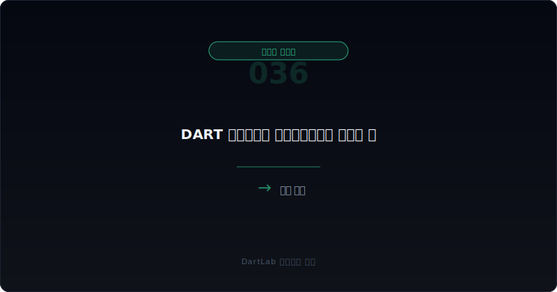
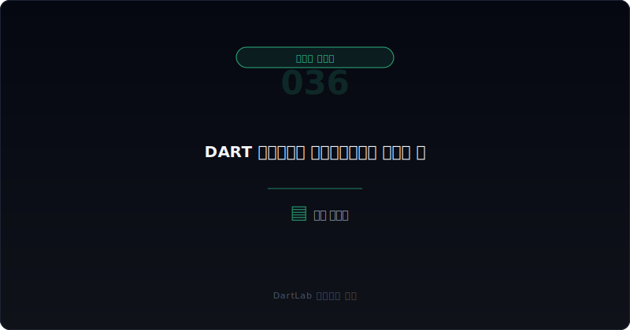
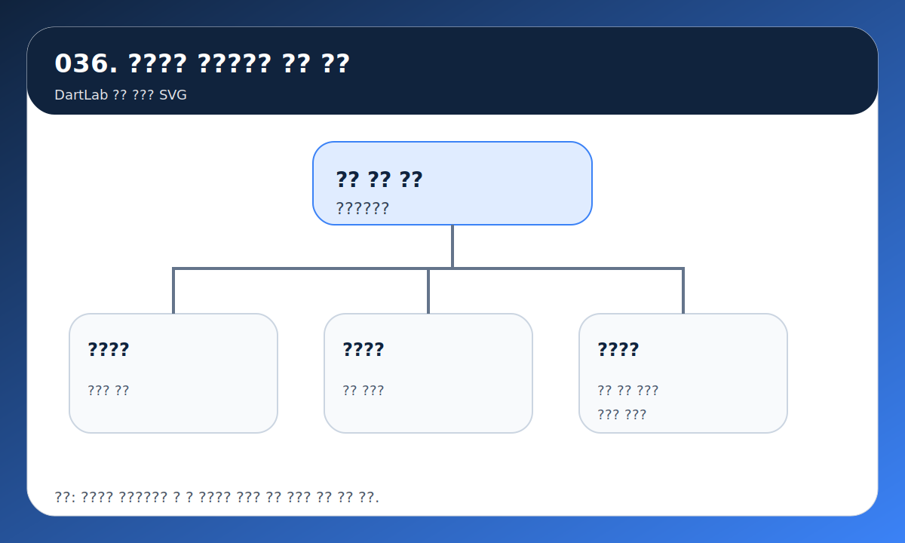
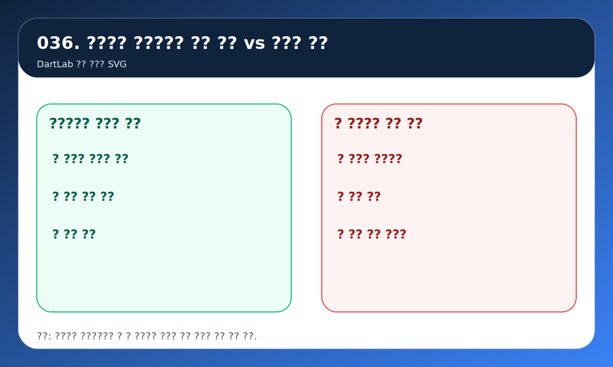
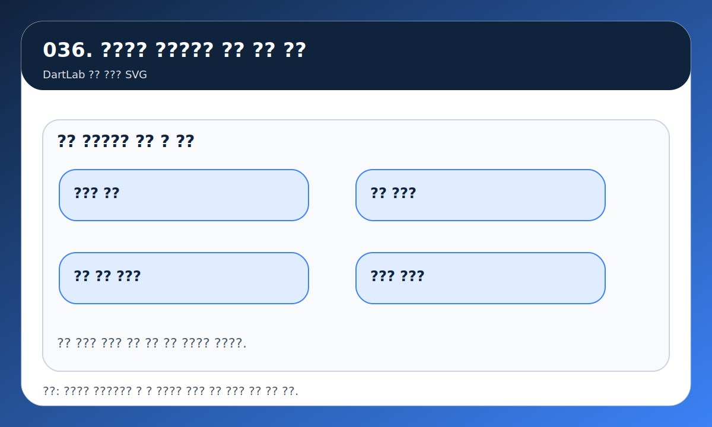

---
title: DART 정정공시를 파이프라인에서 다루는 법
date: 2026-03-18
description: 정정공시는 수집기를 가장 쉽게 망가뜨리는 영역이다. 검색 결과, 접수번호, 원문, 최종 유효본을 어떤 구조로 묶어야 안정적인 DART 파이프라인이 되는지 실전 기준으로 정리한다.
category: data-automation
series: data-automation
seriesOrder: 5
thumbnail: /avatar-study.png
---

# DART 정정공시를 파이프라인에서 다루는 법

정정공시는 DART 수집기에서 가장 쉽게 무시되는 영역이다. 많은 사람이 최신 공시만 다시 받으면 된다고 생각한다. 하지만 실제로는 정정공시가 들어오는 순간, 검색 결과 레이어부터 원문, 첨부, 파싱 캐시, 최종 유효본 판정까지 전부 다시 엮어야 하는 경우가 많다.

그래서 정정공시는 `파일 하나를 더 받는 문제`가 아니다. 훨씬 정확하게 말하면 `버전 체인과 최종 유효본을 어떻게 관리할 것인가`의 문제다.

이 글은 `검색 결과 -> 접수번호 체인 -> 원문 재수집 -> 최종 유효본 판정 -> 변경 로그 보관` 순서로 정정공시를 파이프라인에 넣는 방법을 정리한다. 기본 수집 구조는 [corp_code부터 filing 원문까지 DART 수집 파이프라인 설계](/blog/corp-code-to-filing-pipeline), 주석/XBRL 레이어는 [XBRL 재무제표 원문과 주석 다운로드 파이프라인](/blog/opendart-xbrl-notes-pipeline), 사건 감지는 [OpenDART로 주요사항보고서 읽는 법](/blog/opendart-material-events)과 같이 보면 더 잘 맞물린다.

---

## endpoint 하나로 끝나지 않는 이유

정정공시는 같은 회사, 같은 연도, 비슷한 제목의 보고서가 여러 버전으로 존재하게 만든다. 이때 회사명과 보고서명만으로 묶으면 금방 꼬인다. 제목은 비슷한데 접수번호가 다르고, 첨부 구조가 달라지고, 본문 일부가 바뀌고, 최종적으로 투자자에게 보여줘야 하는 문서가 달라질 수 있기 때문이다.

즉 정정공시는 검색 API 한 번 더 호출하는 문제보다 `문서 식별과 버전 관리` 문제에 더 가깝다. 이 차이를 이해하지 못하면 아래 문제가 자주 생긴다.

- 최신 정정본으로 무조건 덮어써서 최초 제출본을 잃는다
- 정정 사유는 바뀌었는데 원문은 다시 받지 않는다
- 첨부정정과 본문정정을 같은 수준으로 처리한다
- 최종 유효본은 무엇인지, 이전 버전은 무엇인지 설명할 수 없게 된다

---

## 어떤 레이어 순서로 묶어야 하나

| 레이어 | 역할 |
| --- | --- |
| 검색 결과 | 정정 여부와 접수번호 체인을 잡는다 |
| 문서 원장 | 원본·정정본·철회본을 한 그룹으로 묶는다 |
| 원문 레이어 | 정정 전후 본문과 첨부 파일을 다시 받는다 |
| 데이터 레이어 | 기존 숫자와 텍스트 캐시를 무조건 덮어쓰지 않는다 |
| 유효본 판정 | 최종 소비용 버전과 이력 보관 버전을 분리한다 |

파이프라인이 안정적인지 여부는 각 레이어를 따로 이해하는 데서 끝나지 않는다. 검색 결과에서 잡은 접수번호가 원문, 첨부, 파싱 캐시, 최종 유효본 판정까지 일관되게 이어져야 한다.

특히 검색 API의 `report_nm`과 비고 정보는 매우 중요하다. OpenDART 공시검색 가이드는 보고서명에 `[기재정정]`, `[첨부정정]`, `[첨부추가]` 같은 문자열이 붙을 수 있고, 비고에도 정정 여부가 표시된다는 점을 명시한다. 이 정보는 나중에 정정 사유와 변경 범위를 추적할 때 핵심 키가 된다.

---

## 실패 패턴은 어디서 생기나

가장 실용적인 질문은 이것이다. `정정공시가 들어왔을 때 파이프라인이 가장 먼저 해야 할 일은 무엇인가`.

정답은 보통 아래 세 단계다.

1. 버전 체인 갱신
2. 원문·첨부 재수집
3. 최종 유효본 재판정

많은 수집기는 2번부터 한다. 파일을 다시 받는 것이다. 하지만 실제로는 1번이 더 먼저다. 버전 체인을 갱신하지 않으면 어떤 문서가 무엇을 대체하는지 설명할 수 없고, 나중에 diff나 rollback도 할 수 없다.

그다음이 원문·첨부 재수집이다. 정정은 본문만 바뀌는 것이 아니다. 첨부 구조나 표, 조건표, 투자위험 설명까지 바뀔 수 있다. 마지막으로 최종 유효본 판정을 다시 해야 한다. 사용자에게 보여줄 것은 최신 유효본일 수 있지만, 운영자는 이전 버전도 같이 보관해야 한다.

---

## 좋은 운영과 위험한 운영은 무엇이 다른가

| 관찰 포인트 | 상대적으로 안정적인 경우 | 더 취약한 경우 |
| --- | --- | --- |
| 식별 기준 | rcept_no와 문서 그룹 키를 함께 쓴다 | 회사명과 보고서명만으로 덮어쓴다 |
| 보관 방식 | 이력과 최신 유효본을 분리한다 | 최신 한 건만 남긴다 |
| 정정 사유 | 기재정정·첨부정정·첨부추가를 메타로 남긴다 | 정정 이유를 버린다 |
| 재수집 범위 | 원문·첨부·파싱 캐시를 함께 본다 | JSON 한 층만 다시 받는다 |
| 검증 | 정정 전후 diff를 남긴다 | 성공 여부를 로그 없이 넘긴다 |

핵심은 overwrite보다 provenance다. 왜 바뀌었는지 설명할 수 있어야 하고, 최종 결과가 무엇인지도 설명할 수 있어야 한다. 이 둘이 빠지면 정정공시가 늘어날수록 데이터는 더 많아지는데 신뢰성은 오히려 떨어진다.

정정공시가 잦은 회사일수록 이 차이는 더 커진다. 반복 정정은 파이프라인 문제이기도 하지만, 동시에 공시 품질과 내부 통제 신호이기도 하다. 그래서 기술적 처리와 해석적 경계가 분리되지 않는다.

---

## 문서 원장을 어떻게 잡아야 덜 흔들리나

정정공시를 안정적으로 처리하려면 결국 문서 원장이 강해야 한다. 실전에서는 보통 `회사 + 문서군 + 최초 제출 접수번호 + 현재 유효 접수번호` 정도를 한 묶음으로 관리하는 편이 가장 안정적이다. 이렇게 해야 최초본, 정정본, 첨부추가본, 최종 유효본을 한 체인 안에서 설명할 수 있다.

특히 원장에서 중요한 것은 최신값 하나가 아니다. 아래 네 칸이 모두 있어야 한다.

- 최초 제출 시점
- 각 정정 시점과 정정 사유
- 원문과 첨부의 재수집 여부
- 현재 소비용으로 노출할 최종 유효본

이 구조가 있으면 투자자용 노출과 내부 감사 로그를 분리할 수 있다. 사용자에게는 최신 유효본만 보여주더라도, 운영자는 언제 어떤 변경이 있었는지 바로 복구할 수 있다. 반대로 이력이 없는 수집기는 결국 어느 시점엔가 `왜 이 숫자가 바뀌었는지 설명할 수 없는 상태`로 무너진다.

---

## 운영자가 자주 틀리는 기준은 무엇인가

정정공시 처리에서 가장 자주 틀리는 기준은 `정정이면 무조건 전체 재처리`와 `정정이면 본문만 다시 받기`라는 양극단이다. 실제로는 영향 범위를 분리하는 편이 맞다. 기재정정이면 본문 파서와 요약 레이어가 흔들릴 수 있고, 첨부정정이면 표와 첨부 자산이 더 중요할 수 있다.

또 하나 자주 놓치는 것이 캐시 무효화 범위다. 검색 결과 캐시만 갱신하고 원문 HTML, 첨부 파일, 파싱 산출물을 그대로 두면 운영 로그에는 성공처럼 보이는데 실제 데이터는 옛 버전을 가리키는 일이 생긴다. 그래서 정정 처리는 수집 성공보다 `어느 레이어까지 다시 만들었는지`를 남기는 편이 훨씬 안전하다.

마지막으로, 정정은 기술 이슈이면서 품질 이슈다. 어떤 회사가 반복 정정을 내는지, 어떤 공시군에서 자주 꼬이는지까지 집계하면 단순 수집기를 넘어 공시 품질 감시 도구가 된다. 이 관점이 붙어야 정정공시 허브 글이 실제 운영 원칙으로 연결된다.

---

## 수집기가 흔들리는 4가지

### 1. 정정공시를 최신 파일 하나로 덮어쓴다

이렇게 하면 최초 제출본과 변경 이유가 사라진다.

### 2. 첨부정정과 본문정정을 같은 수준으로 본다

둘은 영향 범위가 다르다. 재수집 범위도 달라져야 한다.

### 3. 최초 접수번호를 잃어버린다

나중에 같은 문서 그룹 안에서 무슨 일이 있었는지 설명할 수 없게 된다.

### 4. 정정 후 파싱 결과만 남기고 왜 바뀌었는지 기록하지 않는다

최종 숫자는 남지만 provenance가 사라진다.

---

## 운영 체크리스트

- 정정 플래그를 검색 레이어에서 잡는가
- rcept_no 기반 버전 체인을 남기는가
- 최종 유효본을 별도로 판정하는가
- 원문·첨부·파싱 캐시를 함께 재처리하는가
- 정정 사유와 변경 범위를 로그에 남기는가
- 이전 버전을 복구 가능하게 보관하는가

정정공시는 한 번 맞춰놓고 끝나는 문제가 아니다. 계속 들어오는 구조이기 때문에, 처음부터 체인과 유효본을 분리하고 provenance를 남기는 쪽이 훨씬 싸게 먹힌다.

## 운영 로그에 최소한 무엇을 남겨야 하나

실무에서 정정공시 처리가 망가지는 이유는 의외로 단순하다. 재수집은 했는데 무엇이 바뀌었는지 기록이 없어서, 나중에 문제를 재현할 수 없는 경우가 많다. 그래서 정정 처리는 성공 여부만 남기지 말고 최소 필드를 정해 두는 편이 좋다.

가장 실용적인 최소 필드는 아래 정도다.

- 최초 접수번호와 현재 처리 중인 접수번호
- 정정 유형과 정정 시각
- 재수집한 레이어: 검색, 원문, 첨부, 파싱 결과
- 이전 유효본과 신규 유효본의 diff 요약
- 사용자 노출용 상태 변경 여부

이 다섯 줄이 있으면 운영자가 `무엇을 다시 만들었고 무엇을 그대로 뒀는지` 설명할 수 있다. 반대로 이 정보가 없으면 정정 처리 파이프라인은 시간이 지날수록 블랙박스가 된다. 정정공시는 결국 버전 관리 문제라는 점을 잊지 않는 것이 가장 중요하다.

## 정정 처리를 처음부터 강하게 잡아야 하는 이유

정정공시는 초기에 대충 처리해도 바로 티가 나지 않는다. 문제는 시간이 지난 뒤다. 그때 가면 어떤 수치가 어느 버전 문서에서 왔는지, 왜 바뀌었는지, 언제 덮어써졌는지 설명할 수 없게 된다. 그래서 정정 처리는 나중에 보강하는 것보다 처음부터 강하게 잡는 편이 훨씬 싸다.

결국 좋은 파이프라인은 빨리 받는 파이프라인이 아니라, 바뀐 이유까지 설명할 수 있는 파이프라인이다.

## FAQ

### 정정공시는 최신 문서만 남기면 충분한가

부족하다. 소비용 최신본은 따로 두더라도 이력과 변경 사유는 반드시 남겨야 한다.

### 기재정정과 첨부정정은 같은가

아니다. 본문 변경인지 첨부 구조 변경인지에 따라 재수집 범위와 파싱 영향이 달라진다.

### 검색 API만으로 최종 유효본 판별이 끝나나

시작은 가능하지만 끝은 아니다. 원문과 첨부 재확인이 필요하다.

### 정정공시가 자주 나오는 회사는 어떻게 처리하나

문서 그룹 키, 버전 체인, diff 로그를 강하게 남겨야 한다. 그렇지 않으면 overwrite 오류가 누적된다.

## 같이 읽으면 좋은 글

- [corp_code부터 filing 원문까지 DART 수집 파이프라인 설계](/blog/corp-code-to-filing-pipeline)
- [XBRL 재무제표 원문과 주석 다운로드 파이프라인](/blog/opendart-xbrl-notes-pipeline)
- [OpenDART로 주요사항보고서 읽는 법](/blog/opendart-material-events)
- [공시를 처음 볼 때 DART에서 어디부터 눌러야 하나](/blog/where-to-click-first-in-dart)

## 참고한 공식 자료

- [OpenDART 개발가이드 - 공시검색](https://opendart.fss.or.kr/guide/detail.do?apiGrpCd=DS001&apiId=2019001)
- [DART 소개 - 정정신고서 이용시 유의사항](https://dart.fss.or.kr/introduction/content4.do)
- [DART 소개 - 보고서정보](https://dart.fss.or.kr/introduction/content2.do)
- [OpenDART 주요사항보고서 주요정보조회](https://opendart.fss.or.kr/disclosureinfo/mainMatter/main.do)

## 정리

정정공시는 단순 overwrite가 아니라 버전 체인과 최종 유효본을 동시에 관리하는 구조로 다뤄야 한다. 이 원칙만 지켜도 DART 파이프라인은 훨씬 덜 흔들린다.

좋은 수집기는 많이 받는 수집기가 아니라, 어떤 문서가 어떤 버전으로 남아야 하는지 끝까지 설명할 수 있는 수집기다.
