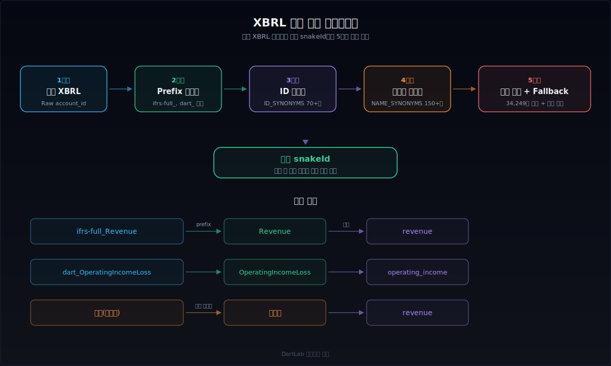
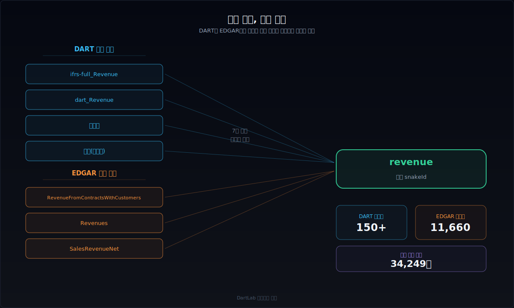
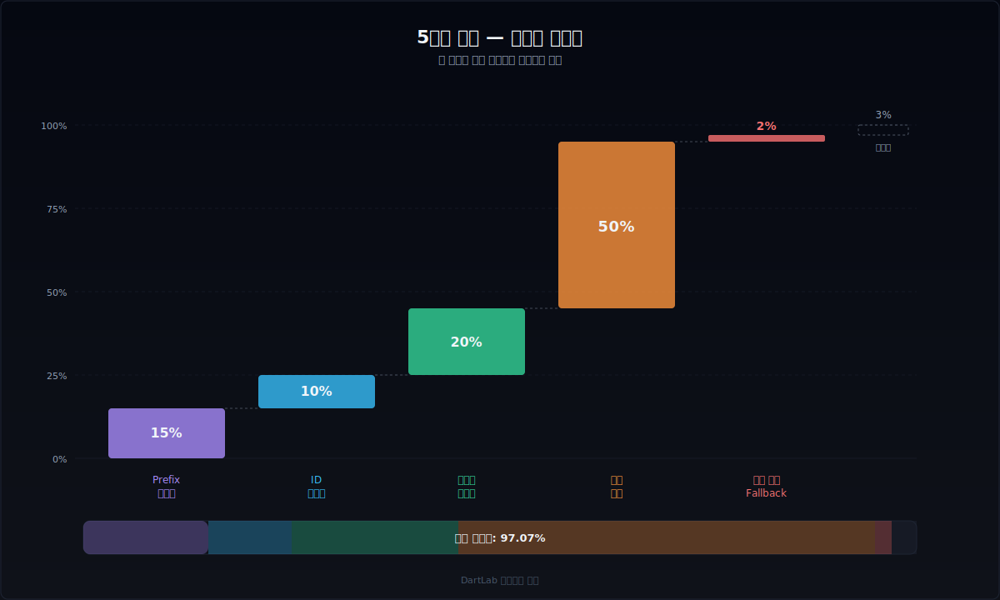
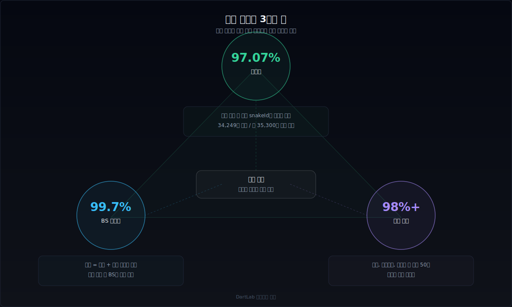
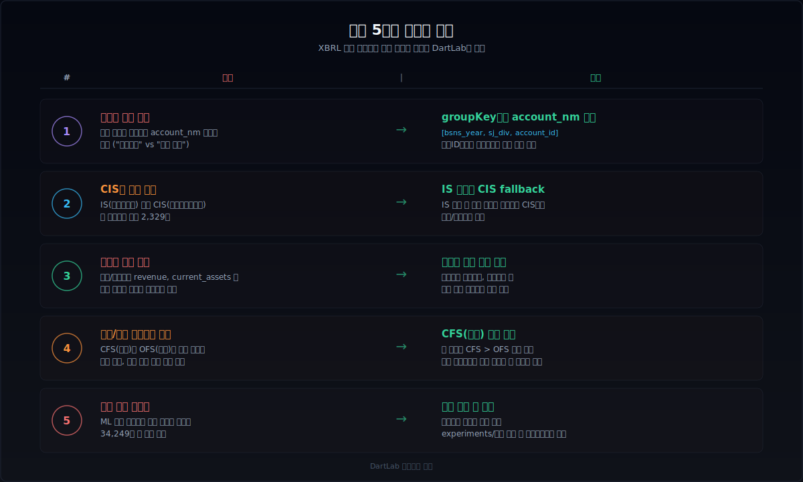

# XBRL 파싱과 계정 매핑은 왜 어렵고 어떻게 풀어야 하나

재무제표 데이터를 자동으로 수집하면, 곧바로 부딪히는 벽이 있다. **회사마다 같은 항목을 다른 이름으로 보고한다.** 삼성전자의 '매출액'과 현대차의 '수익(매출액)'과 SK하이닉스의 'Revenue'는 모두 같은 매출인데, XBRL 파일에서는 전부 다른 계정 ID와 계정명으로 들어온다. 이 문제를 풀지 않으면 기업 간 비교는 불가능하고, 수집한 데이터는 쓸모없는 숫자 더미로 남는다.

XBRL(eXtensible Business Reporting Language)은 재무 데이터를 구조화된 형태로 보고하기 위한 국제 표준이다. DART는 K-IFRS 기반의 XBRL 택소노미를 사용하고, EDGAR는 US-GAAP 기반 택소노미를 사용한다. 이론적으로는 같은 택소노미를 쓰면 계정이 통일되어야 하지만, 실무에서는 **확장 택소노미(extension taxonomy)**를 회사마다 자유롭게 만들 수 있어서 계정명이 폭발적으로 다양해진다.

이 글은 XBRL 파싱부터 계정 매핑까지의 전체 파이프라인을 `원본 구조 이해 → prefix 정규화 → 동의어 사전 → 학습 기반 매퍼 → 검증과 모니터링` 순서로 정리한다. dartlab이 34,000개 이상의 계정을 97% 이상 매핑률로 처리하는 실전 구조를 기반으로, 같은 문제를 풀려는 사람이 어디서 시작해서 어디까지 확인해야 하는지를 보여준다.



---

## XBRL 원본 구조를 먼저 이해해야 하는 이유

매핑 로직을 짜기 전에, XBRL 원본 데이터가 어떤 형태로 들어오는지부터 정확히 알아야 한다. 구조를 모르면 정규화 규칙을 만들 수 없고, 정규화가 안 되면 매핑이 시작조차 안 된다.

### DART XBRL 구조

DART의 재무제표 XBRL은 OpenDART API를 통해 받을 수 있다. 핵심 필드는 다음과 같다.

- **`account_id`**: XBRL 계정 ID. `ifrs-full_Revenue`, `dart_OperatingIncomeLoss`, `ifrs_ProfitLoss` 같은 형태. 네 가지 prefix가 혼재한다: `ifrs-full_`, `dart_`, `ifrs_`, `ifrs-smes_`.
- **`account_nm`**: 한글 계정명. '매출액', '수익(매출액)', '영업이익(손실)' 같은 형태. 같은 `account_id`라도 회사마다 한글명이 다를 수 있다.
- **`sj_div`**: 재무제표 구분. `BS`(재무상태표), `IS`(손익계산서), `CIS`(포괄손익계산서), `CF`(현금흐름표), `SCE`(자본변동표).
- **`fs_div`**: 연결/별도 구분. `CFS`(연결), `OFS`(별도).
- **`bsns_year`**, **`reprt_code`**: 사업연도와 보고서 구분(1분기/반기/3분기/사업보고서).

여기서 핵심 문제는 `account_id`와 `account_nm`의 다양성이다. 같은 '매출액'이라도 `ifrs-full_Revenue`, `ifrs_Revenue`, `dart_Revenue` 등 다양한 prefix로 들어올 수 있고, 한글명도 '매출액', '수익(매출액)', '매출', '영업수익' 등으로 흩어진다.

### EDGAR XBRL 구조

EDGAR는 구조가 더 복잡하다. 10-K/10-Q에 포함된 XBRL 인스턴스 문서에서 재무 데이터를 추출해야 한다.

- **태그명(tag)**: `us-gaap:Revenue`, `us-gaap:Revenues`, `us-gaap:RevenueFromContractWithCustomerExcludingAssessedTax` 같은 형태. US-GAAP 표준 태그와 회사별 확장 태그가 혼재.
- **확장 태그**: 회사가 독자적으로 만든 태그. `aapl:ProductSalesNet` 같은 형태. 표준 택소노미에 없는 세부 항목을 보고할 때 사용.
- **단위(unit)**: USD, EUR 등. 다국적 기업은 보고 통화가 다를 수 있다.
- **기간(period)**: instant(시점) vs duration(기간). BS는 instant, IS/CF는 duration.

EDGAR의 고유한 어려움은 **확장 태그의 비율이 높다**는 점이다. 대형 기술 기업들은 표준 태그만으로 자사의 세부 항목을 표현하기 어려워서 확장 태그를 적극적으로 사용한다. 이 확장 태그를 표준 snakeId로 매핑하는 것이 EDGAR 매핑의 핵심 난이도다.

### 공통 문제: 같은 항목, 다른 이름

DART와 EDGAR 모두에서 발생하는 근본 문제는 **같은 경제적 의미를 가진 항목이 수십~수백 가지 이름으로 보고된다**는 것이다.

예를 들어 '매출'이라는 단일 개념에 대해:
- DART: `ifrs-full_Revenue`, `ifrs_Revenue`, `dart_Revenue`, `ifrs-full_RevenueFromContractsWithCustomers`
- EDGAR: `us-gaap:Revenue`, `us-gaap:Revenues`, `us-gaap:RevenueFromContractWithCustomerExcludingAssessedTax`, `us-gaap:RevenueFromContractWithCustomerIncludingAssessedTax`

이 모든 것을 하나의 표준 ID(예: `revenue`)로 매핑해야 기업 간 비교가 가능해진다.



---

## 매핑 파이프라인 5단계

dartlab의 계정 매핑은 5단계 파이프라인으로 구성된다. 각 단계는 이전 단계에서 매핑되지 않은 항목을 점진적으로 해결한다.

### 1단계: prefix 정규화

가장 먼저, `account_id`에서 불필요한 prefix를 제거한다.

```
ifrs-full_Revenue       →  Revenue
dart_OperatingIncome    →  OperatingIncome
ifrs_ProfitLoss         →  ProfitLoss
ifrs-smes_Revenue       →  Revenue
```

DART에서는 `ifrs-full_`, `dart_`, `ifrs_`, `ifrs-smes_` 네 가지 prefix를 제거한다. EDGAR에서는 `us-gaap:` prefix를 제거하고, 회사별 확장 태그(예: `aapl:`)는 별도 처리한다.

이 단계만으로도 `ifrs-full_Revenue`와 `ifrs_Revenue`가 같은 `Revenue`로 합쳐진다. 간단하지만 효과가 크다.

### 2단계: ID 동의어 사전 (ID_SYNONYMS)

prefix를 제거해도 남는 ID 차이를 해결한다. IFRS 택소노미는 같은 개념에 여러 ID를 부여하는 경우가 있다.

```python
ID_SYNONYMS = {
    "RevenueFromContractsWithCustomers": "Revenue",
    "RevenueFromContractWithCustomerExcludingAssessedTax": "Revenue",
    "GrossProfit": "GrossProfit",
    "ProfitLossFromOperatingActivities": "OperatingIncomeLoss",
    ...  # 70개 이상
}
```

이 사전은 **영문 ID 수준의 동의어**를 통합한다. `RevenueFromContractsWithCustomers`와 `Revenue`가 같다는 것은 IFRS 택소노미 문서를 읽어보면 알 수 있지만, 자동으로 추론하기는 어렵다. 수작업으로 구축하되, 한번 만들면 거의 변하지 않는 안정적인 계층이다.

### 3단계: 계정명 동의어 사전 (ACCOUNT_NAME_SYNONYMS)

한글 계정명의 다양성을 해결한다. 같은 계정인데 회사마다 다른 한글명을 쓰는 경우가 매우 많다.

```python
ACCOUNT_NAME_SYNONYMS = {
    "수익(매출액)": "매출액",
    "영업이익(손실)": "영업이익",
    "영업이익": "영업이익",
    "당기순이익(손실)": "당기순이익",
    "법인세비용차감전순이익(손실)": "법인세비용차감전순이익",
    ...  # 150개 이상
}
```

한글 계정명 동의어는 영문 ID보다 훨씬 다양하다. '영업이익', '영업이익(손실)', '영업손익', '계속영업이익' 등이 모두 같은 개념을 가리킬 수 있다. 괄호 안의 '(손실)' 표기, 공백 차이, 조사 차이 등을 모두 흡수해야 한다.

### 4단계: 학습 기반 매퍼 (accountMappings.json)

앞의 세 단계로도 매핑되지 않는 항목들을 처리한다. **34,000개 이상의 매핑 규칙**이 누적된 대형 사전이다.

```json
{
  "standardAccounts": {
    "매출액": "revenue",
    "매출원가": "cost_of_sales",
    "...": "..."
  },
  "learnedSynonyms": {
    "제품매출액": "revenue",
    "상품매출원가": "cost_of_sales",
    "...": "..."
  }
}
```

이 사전의 핵심은 **학습 기반**이라는 점이다. 새로운 회사의 재무제표를 처리할 때마다, 기존에 없던 계정명이 등장하면 어떤 표준 ID에 매핑되는지를 학습하고 사전에 추가한다. dartlab에서는 이 과정을 반자동으로 관리한다. 완전 자동 학습은 오매핑 위험이 있어서, 실험 기반 검증 후에만 사전에 반영한다.

**구성:**
- `standardAccounts` (13,243개): 표준 계정명 → snakeId 매핑
- `learnedSynonyms` (31,489개): 다양한 변형 계정명 → snakeId 매핑
- 합산 34,249개 규칙

### 5단계: 괄호 제거 fallback

4단계까지 매핑되지 않은 항목에 대해, 계정명에서 괄호와 괄호 안 내용을 제거하고 다시 4단계 사전을 조회한다.

```
"기타포괄손익-공정가치측정금융자산평가이익(손실)"
→ 괄호 제거 → "기타포괄손익-공정가치측정금융자산평가이익"
→ 사전 재조회
```

이 fallback은 **괄호가 있는 변형과 없는 변형이 동시에 존재하는 경우**를 해결한다. 사전에 괄호 없는 버전만 등록되어 있어도 매핑이 성공한다.



---

## 정규화: 시계열 피벗과 standalone 변환

계정 매핑이 끝나면, 원본 데이터를 **분기별 시계열**로 변환해야 한다. 이 과정에서 재무제표 유형별로 다른 정규화 로직이 필요하다.

### IS/CIS: 누적 → standalone 변환

DART의 손익계산서는 **누적 금액**으로 보고된다. 1분기 보고서에는 1분기 금액이, 반기 보고서에는 1~2분기 누적 금액이, 3분기 보고서에는 1~3분기 누적 금액이, 사업보고서에는 연간 금액이 들어간다.

분기별 standalone 금액을 구하려면:
- Q1: 1분기 보고서 금액 그대로
- Q2: 반기 - Q1
- Q3: 3분기 - 반기
- Q4: 연간 - 3분기

이 변환에서 `thstrm_add_amount`(당기 누적) 필드를 사용한다. 전기 대비가 아니라 당기 내 분기 차분이다.

### CF: 동일한 누적 → standalone 변환

현금흐름표도 IS와 마찬가지로 누적 금액이다. `thstrm_amount` 필드를 기준으로 같은 차분 로직을 적용한다.

### BS: 시점 잔액이므로 변환 불필요

재무상태표는 특정 시점의 잔액이므로 누적 개념이 없다. 그대로 사용한다.

### CFS 우선 규칙

같은 계정이 연결(CFS)과 별도(OFS)에 모두 있으면, **연결을 우선**한다. 행 단위로 CFS/OFS 중복을 제거한다.

### groupKey 설계

시계열을 만들 때 행을 어떤 기준으로 묶느냐가 중요하다. dartlab은 `[bsns_year, sj_div, account_id]`를 groupKey로 사용한다. **`account_nm`은 의도적으로 제외**한다. 같은 `account_id`인데 분기마다 한글명의 공백이 미세하게 다른 경우가 있어서, `account_nm`을 groupKey에 넣으면 같은 계정이 여러 행으로 분리된다.

---

## 검증: 매핑이 맞는지 어떻게 확인하나

매핑 파이프라인을 만들었으면, 결과가 맞는지 검증해야 한다. 매핑률이 높아도 오매핑이 섞여 있으면 의미가 없다.

### 매핑률 측정

가장 기본적인 지표다.

```
매핑률 = 매핑된 행 수 / 전체 행 수
```

dartlab의 DART finance 매핑률은 **97.07%**다. 나머지 3%는 극히 드문 회사 고유 계정이거나, 금융업/보험업 등 특수 업종의 비표준 계정이다.

### BS 항등식 검증

매핑이 제대로 됐는지 확인하는 가장 강력한 방법은 **재무상태표 항등식**을 검증하는 것이다.

```
자산총계 = 부채총계 + 자본총계
```

매핑된 snakeId 기준으로 `total_assets`와 `total_liabilities + total_equity`가 일치하는지 확인한다. dartlab에서 이 검증의 정확도는 **99.7%**다. 0.3%의 불일치는 반올림 오차이거나 극소수의 오매핑이다.

### 핵심 계정 커버리지

매출, 영업이익, 당기순이익 등 핵심 계정이 전 종목에서 매핑되는지 확인한다.

| 계정 | 커버리지 | 비고 |
|---|---|---|
| revenue (매출) | 98.5% | 금융업은 다른 수익 구조 |
| operating_income (영업이익) | 99.1% | 거의 전 종목 |
| net_income (당기순이익) | 99.8% | 가장 높음 |
| total_assets (자산총계) | 99.9% | BS 기본 항목 |
| total_equity (자본총계) | 99.9% | BS 기본 항목 |

### 이상치 탐지

매핑은 맞는데 숫자가 이상한 경우를 잡아내야 한다. 매출이 음수이거나, 자산총계가 0이거나, 전기 대비 100배 이상 변동한 경우 등을 플래그한다.



---

## DART vs EDGAR: 매핑 난이도가 다른 이유

같은 XBRL이지만 DART와 EDGAR의 매핑 난이도는 상당히 다르다.

### DART의 특징

- **prefix 4종**: `ifrs-full_`, `dart_`, `ifrs_`, `ifrs-smes_`. 정규화 단계에서 대부분 해결.
- **한글 계정명 다양성**: 같은 ID라도 한글명이 회사마다 다름. 동의어 사전이 핵심.
- **확장 태그 비율 낮음**: DART 표준 택소노미를 대부분 그대로 사용. 확장 태그는 주로 주석 항목에서 발생.
- **CIS 문제**: 일부 회사는 IS 없이 CIS(포괄손익계산서)만 제출. IS와 CIS의 매출/영업이익 라인이 같은지 확인 필요.
- **금융업 차이**: 은행, 보험사는 일반 제조업과 완전히 다른 계정 체계 사용. `revenue`, `current_assets` 등 일반 계정이 없을 수 있음.

### EDGAR의 특징

- **확장 태그 비율 높음**: 대형 기술 기업들이 적극적으로 확장 태그 사용. 매핑 대상이 많아짐.
- **태그 수 자체가 많음**: US-GAAP 택소노미의 태그 수가 K-IFRS보다 훨씬 많음.
- **영문 단일 언어**: 한글 동의어 문제는 없지만, 태그명 자체가 매우 길고 세밀함.
- **DEI(Document and Entity Information)**: 재무 데이터 외에 문서 메타데이터가 섞여 있어서 분리 필요.
- **계산 관계(calculation linkbase)**: 택소노미에 계정 간 합계 관계가 정의되어 있어서 검증에 활용 가능.

### 매핑 수치 비교

| 지표 | DART | EDGAR |
|---|---|---|
| 매핑 사전 크기 | 34,249개 | 11,660개 + 344 commonTags |
| 매핑률 | 97.07% | 90%+ (핵심 21개 기준) |
| 핵심 계정 커버리지 | 99%+ | 70~90% (계정별 차이 큼) |
| BS 항등식 정확도 | 99.7% | 파생 공식으로 보완 |

EDGAR는 DART보다 매핑률이 낮은 대신, **파생 공식**으로 보완한다. 예를 들어 `total_liabilities`가 직접 보고되지 않은 회사에서는 `total_assets - total_equity`로 역산한다.

---

## 실전 함정과 해결 패턴

### 함정 1: 분기별 계정명 공백 차이

같은 회사의 같은 계정인데, Q1에는 `"영업이익"`, Q2에는 `"영업이익 "`(뒤에 공백)으로 보고되는 경우가 실제로 존재한다. groupKey에 `account_nm`을 넣으면 이 두 개가 다른 행으로 분리된다.

**해결**: groupKey에서 `account_nm`을 제외하고 `account_id`만 사용한다.

### 함정 2: CIS만 있는 회사

2,329개 회사가 IS 없이 CIS만 제출한다. IS와 CIS를 따로 처리하면 이 회사들의 매출/영업이익이 누락된다.

**해결**: IS를 먼저 찾고, 없으면 CIS에서 같은 계정을 찾는 fallback 로직을 적용한다.

### 함정 3: 금융업 계정 누락

은행의 `revenue`는 이자수익과 수수료수익의 합이지, 일반적인 '매출액'이 아니다. `revenue` snakeId로 매핑하면 빈 값이 나온다.

**해결**: 금융업은 별도의 계정 매핑 규칙을 적용하거나, 해당 계정이 없을 수 있음을 인지하고 처리한다. [금융업 사업보고서는 무엇이 다른가](/blog/financial-company-filings)에서 이 구조적 차이를 상세히 다뤘다.

### 함정 4: 영업권과 연결 조정

연결재무제표에서 자회사 인수 시 발생하는 영업권(goodwill)은 별도재무제표에는 없다. 연결과 별도를 비교할 때 이 차이를 인지해야 한다.

**해결**: CFS/OFS를 구분해서 처리하고, 연결 우선 규칙을 적용한다.

### 함정 5: 학습 사전의 오매핑

학습으로 사전을 확장할 때, 잘못된 매핑이 섞일 수 있다. 예를 들어 '리스부채'를 `long_term_borrowings`에 매핑하면 차입금이 과대 계상된다.

**해결**: 무분별한 수작업 추가를 금지하고, 실험 기반 검증 후에만 사전에 반영한다. BS 항등식 검증으로 오매핑을 탐지한다.



---

## DART와 EDGAR 매핑의 성숙 단계

계정 매핑 시스템은 한 번에 완성되지 않는다. 수작업에서 시작해서 자동화로, 자동화에서 운영 체계로 진화하는 단계가 있다. 어디까지 만들어야 하는지 모르면 투자 시간이 낭비되고, 반대로 너무 일찍 멈추면 종목 수가 늘어날 때 시스템이 무너진다. dartlab이 지나온 경로를 기준으로, 매핑 시스템의 성숙 단계를 Level 0~3으로 정리한다.

### Level 0: 수작업 매핑 (Excel 기반, ~100종목)

가장 원시적인 형태다. 재무제표를 다운로드하고, 계정명을 눈으로 읽고, Excel에서 수작업으로 표준명을 붙인다. 10개 회사까지는 이걸로 충분하다. 50개를 넘기면 같은 계정인데 다른 이름으로 들어오는 케이스가 쌓이기 시작하고, 100개를 넘기면 Excel 시트가 관리 불능 상태가 된다. 투자 시간은 종목당 30분~1시간. 종목이 늘어날수록 선형으로 증가하므로 확장성이 없다.

### Level 1: 규칙 기반 자동 매핑 (prefix + 동의어, ~500종목)

prefix 정규화와 동의어 사전을 코드로 작성하는 단계다. `ifrs-full_Revenue → Revenue → revenue` 같은 변환 파이프라인을 만들고, 한글 동의어 150개 정도를 수작업으로 구축한다. 이 단계에서 매핑률 80~85%에 도달할 수 있다. 500종목까지는 이걸로 버틸 수 있지만, 미매핑 15~20%가 꾸준히 쌓이면서 수작업 개입이 다시 필요해진다. 초기 구축에 2~3주, 이후 종목 추가 시 사전 보완에 종목당 5~10분.

### Level 2: 학습 기반 자동 매핑 (사전 누적, 2000종목+)

동의어 사전을 수작업이 아니라 데이터에서 학습해서 키우는 단계다. 새로운 회사를 처리할 때 기존에 없던 계정명이 등장하면, 같은 account_id의 다른 회사 매핑을 참조해서 사전에 추가한다. dartlab의 `accountMappings.json` 34,249개가 이 방식으로 만들어졌다. 매핑률 95~97%에 도달하고, 미매핑은 극히 드문 업종 특화 계정에만 남는다. 사전 구축 자체보다 **오매핑 방지**가 핵심 과제가 된다. 학습 파이프라인 구축에 1~2개월, 이후 유지보수는 분기당 수 시간.

### Level 3: 모니터링 기반 운영 (매핑률 추적, 이상 알림, 전 종목)

매핑 사전이 충분히 커지면, 새로운 종목을 추가해도 매핑률이 거의 떨어지지 않는 정상 상태에 도달한다. 이 단계의 핵심은 사전 확장이 아니라 **모니터링**이다. 분기마다 전 종목의 매핑률, BS 항등식 정확도, 핵심 계정 커버리지를 자동으로 측정하고, 기준선 이하로 떨어지면 알림을 발생시킨다. IFRS 택소노미 개정이나 새로운 업종의 대량 편입 같은 이벤트를 사전에 포착할 수 있다. 모니터링 인프라 구축에 1~2주, 이후 유지보수는 분기당 1~2시간.

### dartlab의 현재 위치

DART는 Level 2와 3 사이에 있다. 사전은 34,249개로 충분히 크고 매핑률 97.07%에 BS 항등식 99.7%다. 전 종목 자동 매핑이 동작하고, 실험 기반 검증으로 오매핑을 통제한다. 다만 택소노미 개정 시 자동 알림까지는 아직 구축하지 않았다.

EDGAR는 Level 2에 있다. commonTags 344개와 learnedSynonyms 11,660개로 핵심 21개 계정 기준 70~90% 커버리지를 달성했지만, 확장 태그 비율이 높아서 사전 확장이 아직 진행 중이다.

### 레벨 간 전환에서 가장 중요한 것

어떤 레벨에서든 다음 레벨로 올라가는 데 가장 큰 지렛대는 **BS 항등식 검증 인프라**다. `자산 = 부채 + 자본`이 맞는지 자동으로 확인할 수 있으면, 매핑 사전을 안전하게 확장할 수 있다. 이 검증이 없으면 사전이 커질수록 오매핑이 섞여 들어오는데, 어디가 틀렸는지 찾을 방법이 없다. Level 0에서 1로 갈 때도, Level 2에서 3으로 갈 때도, 항등식 검증이 안전망 역할을 한다. 매핑 파이프라인보다 검증 파이프라인을 먼저 만드는 것이 장기적으로 더 빠르다.

---

## 매퍼를 직접 만들 때 권장 순서

XBRL 계정 매핑 시스템을 직접 만들고 싶다면, 아래 순서를 권장한다.

**1단계 — 핵심 20개 계정부터 시작**
매출, 매출원가, 매출총이익, 영업이익, 당기순이익, 자산총계, 부채총계, 자본총계, 유동자산, 비유동자산, 유동부채, 비유동부채, 영업CF, 투자CF, 재무CF 등 핵심 20개부터 매핑한다. 이것만 해도 기본 분석이 가능하다.

**2단계 — BS 항등식으로 검증**
핵심 계정 매핑이 끝나면 `자산 = 부채 + 자본`을 검증한다. 불일치가 크면 매핑에 오류가 있다.

**3단계 — prefix 정규화와 ID 동의어 구축**
DART라면 4개 prefix 제거, EDGAR라면 namespace 제거. 그 위에 IFRS/US-GAAP 택소노미 문서를 보고 동의어를 수작업으로 추가한다.

**4단계 — 한글명(또는 영문 확장 태그) 동의어 확장**
실제 데이터를 돌려보면서 미매핑 항목을 확인하고, 동의어 사전을 점진적으로 키운다. 한 번에 완벽하게 만들 수 없고, 새로운 회사를 만날 때마다 사전이 커진다.

**5단계 — 대량 종목 검증으로 매핑률 모니터링**
10개 종목 → 100개 → 전 종목으로 점진적으로 확대하면서 매핑률, BS 항등식, 핵심 계정 커버리지를 모니터링한다.

---

## 비교 체크리스트

| 확인 항목 | 기준선 | 위험 신호 |
|---|---|---|
| 전체 매핑률 | > 95% | &lt; 90% |
| BS 항등식 정확도 | > 99% | &lt; 95% |
| 핵심 20개 커버리지 | > 98% | &lt; 90% |
| 금융업 처리 | 별도 규칙 있음 | 일괄 처리 시도 |
| CIS 전용 회사 처리 | fallback 있음 | IS만 처리 |
| 학습 사전 갱신 주기 | 실험 기반 | 무분별 수작업 |
| 오매핑 탐지 | 항등식+이상치 | 매핑률만 확인 |

---

## FAQ

**XBRL을 직접 파싱해야 하나, API로 받으면 되지 않나?**

DART는 OpenDART API가 재무제표 데이터를 JSON으로 제공하므로 XBRL을 직접 파싱하지 않아도 된다. 하지만 API가 제공하는 필드가 제한적이어서, 주석 수준의 세부 데이터가 필요하면 XBRL 인스턴스 문서를 직접 파싱해야 한다. EDGAR는 SEC XBRL API가 있지만, 전체 데이터를 받으려면 FULL-INDEX에서 직접 다운로드하는 것이 효율적이다.

**매핑 사전을 공개할 수는 없나?**

dartlab의 `accountMappings.json`은 프로젝트에 포함되어 있어서 공개되어 있다. 다만 이 사전은 K-IFRS 기준으로 만들어졌기 때문에, US-GAAP 기반의 EDGAR에는 직접 쓸 수 없다. EDGAR용 매핑은 별도로 구축해야 한다.

**왜 머신러닝으로 자동 매핑하지 않나?**

시도할 수 있지만, 재무제표 계정 매핑은 **정확성이 매우 중요**해서 확률적 모델의 오류를 허용하기 어렵다. '영업이익'을 '영업손실'에 매핑하면 숫자의 의미가 완전히 뒤집힌다. 현재는 규칙 기반 + 학습 사전 조합이 가장 안정적이다. 다만 미매핑 항목의 후보를 추천하는 용도로 임베딩 기반 유사도 검색을 보조적으로 활용할 수 있다.

**매핑 사전은 얼마나 자주 업데이트해야 하나?**

새로운 회사가 추가되거나, IFRS/US-GAAP 택소노미가 개정될 때 사전을 업데이트해야 한다. 실무적으로는 분기마다 미매핑 비율을 모니터링하고, 미매핑이 0.5% 이상 증가하면 사전을 갱신하는 것이 적절하다. 택소노미 대개정(IFRS 17 도입 등) 시에는 대규모 업데이트가 필요하다.

**은행/보험사는 어떻게 처리하나?**

금융업은 일반 제조업과 계정 체계가 근본적으로 다르다. `revenue`(매출) 대신 `interest_income`(이자수익), `current_assets`(유동자산) 대신 `loans_and_receivables`(대출채권) 같은 업종 특화 계정을 사용한다. 현재 dartlab은 금융업 매핑을 제한적으로 지원하며, 해당 계정이 없으면 빈 값을 반환한다.

---

## 기존 글로 더 깊이 들어가기

**재무제표 구조 이해**
- [숫자만 보면 왜 자주 틀리나](/blog/beyond-the-numbers) — 재무제표 해석의 기본 프레임
- [금융업 사업보고서는 무엇이 다른가](/blog/financial-company-filings) — 금융업 고유 계정 구조

**데이터 파이프라인**
- [sections 기반 전자공시 기간 비교](/blog/sections-compare-dart-edgar) — XBRL 이후의 텍스트 수평화
- [show(topic) 구조와 실전 활용](/blog/show-topic-one-line-company-data) — 매핑된 데이터의 소비 경로

**검증과 해석**
- [매출 인식 시점은 어디서 조작 신호가 나오나](/blog/revenue-recognition-timing-signals) — 매출 계정 매핑의 회계적 맥락

---

## 출처

- K-IFRS 택소노미 — 금융감독원 XBRL 택소노미 공시
- US-GAAP 택소노미 — SEC EDGAR XBRL 택소노미
- OpenDART API 문서 — 재무제표 조회 API 스펙
- SEC EDGAR FULL-INDEX — XBRL 인스턴스 문서 접근 구조

---

## 한 줄 정리

XBRL 계정 매핑은 `prefix 정규화 → ID 동의어 → 계정명 동의어 → 학습 사전 → 괄호 제거 fallback`의 5단계 파이프라인으로 풀고, **BS 항등식과 핵심 계정 커버리지로 검증**해야 한다. 매핑률 97%는 어렵지 않지만, 나머지 3%와 오매핑 0%가 진짜 어려운 부분이다.
