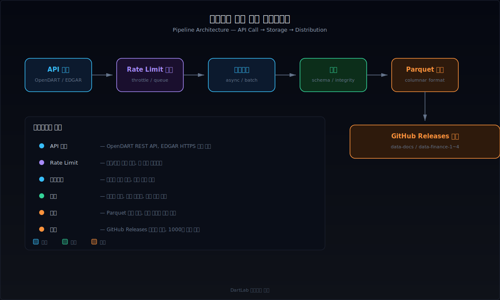
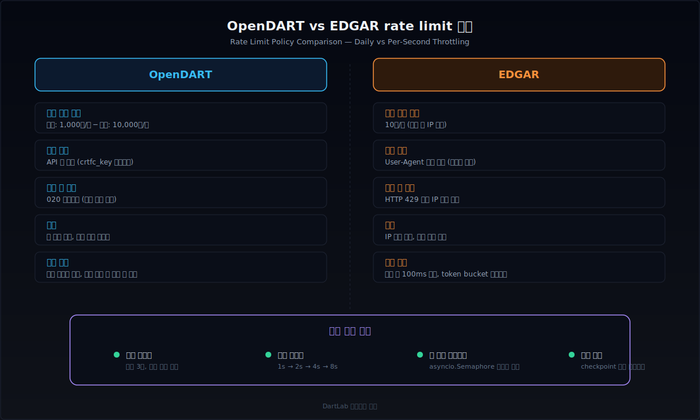
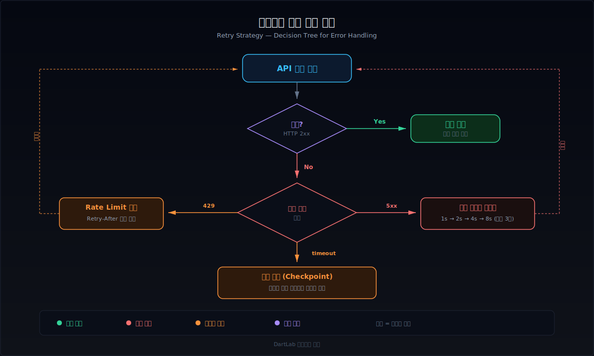
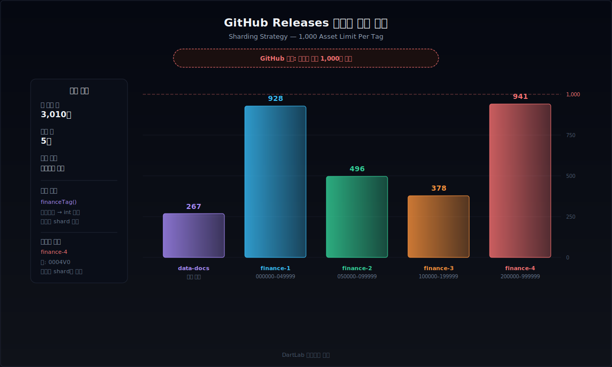
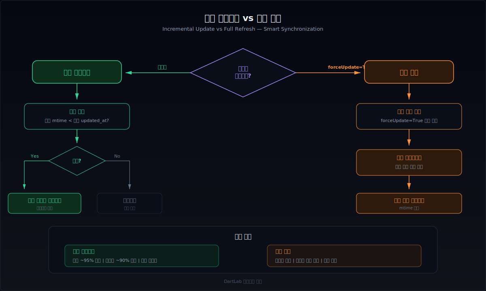

# 전자공시 대량 수집은 왜 느리고 어디서 막히나

종목 하나의 재무제표를 가져오는 건 쉽다. API를 호출하고 JSON을 파싱하면 끝이다. 문제는 2,700개 종목을 전부 수집하려 할 때 시작된다. OpenDART는 하루 호출 횟수에 벽이 있고, EDGAR는 초당 속도에 벽이 있다. 벽에 부딪히면 수집이 멈추는 것이 아니라 **차단**을 당한다. 차단 해제에 며칠이 걸릴 수 있다.

대량 수집은 단순 반복 호출이 아니다. rate limit을 인식하고, 실패를 분류하고, 중단된 지점에서 이어받고, 수집한 데이터를 검증하는 파이프라인을 설계해야 한다. 이 글은 OpenDART와 EDGAR 양쪽을 대상으로, 수천 종목 규모의 수집에서 실제로 부딪히는 병목과 그에 대응하는 실전 전략을 정리한다.



---

## 단건 조회와 대량 수집은 왜 근본적으로 다른가

API 문서만 보면, 대량 수집은 단건 조회를 N번 반복하면 될 것 같다. 실제로는 전혀 다른 문제를 풀어야 한다.

단건 조회는 **요청 → 응답 → 끝**이다. 실패하면 한 번 더 시도하면 된다. 대량 수집에서는 다음과 같은 문제가 동시에 터진다.

- **할당량 소진**: 2,700개 종목 × 4개 API = 10,800건. OpenDART 일일 한도 10,000건을 초과한다. 하루에 끝나지 않는다.
- **속도 제한**: EDGAR에서 초당 11건을 보내면 IP가 차단된다. 한 번 차단되면 SEC에 이메일을 보내고 며칠을 기다려야 한다.
- **중간 실패**: 1,847번째 종목에서 네트워크가 끊기면, 앞서 수집한 1,846건은 어디에 있는가? 체크포인트가 없으면 처음부터 다시 시작해야 한다.
- **데이터 정합성**: 수집 도중 원본 데이터가 갱신되면, 앞서 받은 데이터와 나중에 받은 데이터의 시점이 다르다.
- **저장소 관리**: 수천 개 파일을 어떻게 분류하고, 업데이트가 필요한 파일만 골라내는가?

이 문제들은 단건 조회 로직을 for문으로 감싸는 것만으로는 해결되지 않는다. 수집, 검증, 저장, 복구를 분리한 파이프라인 아키텍처가 필요하다.

---

## OpenDART와 EDGAR의 rate limit 정책은 근본적으로 다르다

같은 "공시 API"지만 DART와 EDGAR의 제한 방식은 완전히 다르다. 하나의 수집 코드로 양쪽을 처리하면 반드시 한쪽에서 문제가 생긴다.



### OpenDART: 일일 총량이 병목

OpenDART API는 API key 하나당 **하루 10,000건**의 요청을 허용한다. [DART 전자공시](/blog/everything-about-dart) 관련 모든 API가 이 한도를 공유한다. 무료 키(미등록)는 하루 1,000건으로 더 제한적이다.

핵심적인 차이는 **초과 시 응답 방식**이다. OpenDART는 HTTP 429를 반환하지 않는다. 대신 HTTP 200에 JSON 본문의 `status` 필드로 에러를 알려준다. 일반적인 HTTP 에러 핸들링으로는 잡을 수 없다.

```python
import httpx

DART_API_KEY = "your_api_key"
BASE_URL = "https://opendart.fss.or.kr/api"

def fetch_dart(endpoint: str, params: dict) -> dict | None:
    """OpenDART API 호출 — 에러코드 기반 핸들링"""
    params["crtfc_key"] = DART_API_KEY
    response = httpx.get(f"{BASE_URL}/{endpoint}.json", params=params)
    data = response.json()

    status = data.get("status")
    if status == "000":
        return data  # 정상
    if status == "020":
        # 일일 한도 초과 — 재시도 무의미, 다음 날까지 대기
        return None
    if status == "013":
        # 조회된 데이터 없음 — 정상적 빈 응답
        return {"list": []}
    return None
```

`status == "020"`이 뜨면 오늘은 끝이다. 같은 key로 몇 번을 재시도해도 같은 응답이 돌아온다. 이 시점에서 체크포인트를 저장하고 다음 날 이어받아야 한다.

분당 제한은 공식적으로 공개되어 있지 않지만, 실측 기준 분당 600건을 넘기면 응답 속도가 눈에 띄게 느려진다. 분당 300건 수준(요청당 0.2초 간격)이면 안정적이다.

### EDGAR: 초당 속도가 병목

SEC EDGAR는 일일 제한이 없는 대신 **초당 10건**을 넘기면 즉시 HTTP 429를 반환한다. 반복적으로 위반하면 IP 자체를 차단한다. 차단이 걸리면 SEC 웹마스터(webmaster@sec.gov)에 이메일로 해제를 요청해야 하는데, 1~3 영업일이 걸린다.

EDGAR는 반드시 `User-Agent` 헤더에 조직명과 연락처 이메일을 포함해야 한다. 이 헤더가 없거나 브라우저를 흉내낸 값이면 요청 자체가 403으로 거부된다.

```python
import httpx
import asyncio

EDGAR_HEADERS = {
    "User-Agent": "MyCompany admin@mycompany.com",
    "Accept-Encoding": "gzip, deflate",
}

async def fetch_edgar(client: httpx.AsyncClient, url: str) -> bytes | None:
    """EDGAR 요청 — User-Agent 필수, 429 핸들링"""
    response = await client.get(url, headers=EDGAR_HEADERS)

    if response.status_code == 200:
        return response.content
    if response.status_code == 429:
        retry_after = int(response.headers.get("Retry-After", "10"))
        await asyncio.sleep(retry_after)
        return None
    if response.status_code == 403:
        # User-Agent 누락 또는 IP 차단
        return None
    return None
```

### 비교 테이블: OpenDART vs EDGAR

| 항목 | OpenDART | EDGAR |
|------|----------|-------|
| 일일 한도 | 10,000건 (등록 key) / 1,000건 (미등록) | 없음 |
| 초당 한도 | 공식 없음 (체감 분당 600건) | 10건/초 (공식) |
| 초과 시 응답 | HTTP 200 + JSON status "020" | HTTP 429 + Retry-After 헤더 |
| 인증 방식 | API key (쿼리 파라미터) | User-Agent 헤더 (조직명 + 이메일) |
| 차단 해제 | 다음 날 자동 리셋 | SEC 이메일 요청 (1~3일) |
| 병렬 수집 효과 | 낮음 (총량 병목) | 높음 (속도 병목) |
| 주요 에러코드 | "020" 한도초과, "013" 데이터없음, "800" 시스템오류 | 429 속도초과, 403 인증실패, 503 서버과부하 |
| 데이터 형식 | JSON (API 응답) | SGML/HTML/XBRL (filing 원문) |

이 차이 때문에 DART 수집기와 EDGAR 수집기는 별도로 설계해야 한다. DART는 순차 처리 + 일일 할당량 관리가 핵심이고, EDGAR는 병렬 처리 + 초당 속도 제어가 핵심이다.

---

## HTTP 429 핸들링과 지수 백오프 재시도

API가 "느려지라"는 신호를 보냈는데 같은 속도로 재시도하면 상황만 악화된다. 지수 백오프(exponential backoff)는 실패할 때마다 대기 시간을 2배로 늘려서 서버에 가하는 압력을 점진적으로 줄이는 전략이다.



```python
import random
import time
from typing import Callable, TypeVar

T = TypeVar("T")

def with_retry(
    fn: Callable[..., T],
    *args,
    max_retries: int = 5,
    base_wait: float = 1.0,
    max_wait: float = 60.0,
) -> T | None:
    """지수 백오프 + jitter 재시도 래퍼"""
    for attempt in range(max_retries + 1):
        try:
            result = fn(*args)
            if result is not None:
                return result
        except httpx.HTTPStatusError as e:
            if e.response.status_code == 429:
                retry_after = e.response.headers.get("Retry-After")
                if retry_after:
                    wait = int(retry_after)
                else:
                    wait = min(
                        base_wait * (2 ** attempt) + random.uniform(0, 1),
                        max_wait,
                    )
                time.sleep(wait)
                continue
            raise
        except (httpx.ConnectError, httpx.ReadTimeout):
            wait = min(
                base_wait * (2 ** attempt) + random.uniform(0, 1),
                max_wait,
            )
            time.sleep(wait)
            continue
    return None
```

jitter(무작위 지연)가 핵심이다. 10개 클라이언트가 동시에 실패하면, jitter 없이는 모두 정확히 2초 후에 재시도를 보낸다. `random.uniform(0, 1)`이면 재시도 시점이 흩어져서 서버에 가해지는 순간 부하가 줄어든다.

### Retry-After 헤더가 있으면 백오프보다 우선한다

EDGAR는 429 응답에 `Retry-After` 헤더를 포함한다. 이 값이 있으면 계산된 백오프 시간을 무시하고 서버가 지정한 시간만큼 대기해야 한다. OpenDART는 429를 반환하지 않으므로 이 헤더 자체가 없다. OpenDART에서의 재시도 판단은 JSON 본문의 `status` 코드에 의존한다.

### 네트워크 장애 유형별 대응

대량 수집에서 만나는 장애는 rate limit만이 아니다.

| 장애 유형 | 증상 | 대응 전략 |
|-----------|------|-----------|
| 연결 타임아웃 | `ConnectTimeout` | 지수 백오프 재시도 (네트워크 일시 불안정) |
| 읽기 타임아웃 | `ReadTimeout` | 타임아웃 값 늘리고 재시도 |
| 부분 다운로드 | 응답 body가 잘림 | Content-Length 대비 실제 크기 검증 후 재시도 |
| DNS 실패 | `ConnectError` | 잠시 대기 후 재시도 (DNS 서버 일시 장애) |
| SSL 핸드셰이크 실패 | `SSLError` | 재시도 (서버측 인증서 갱신 중) 또는 환경 점검 |
| 서버 503 | `Service Unavailable` | 장시간 대기 후 재시도 (서버 점검) |

부분 다운로드는 특히 EDGAR에서 자주 발생한다. filing 파일이 수십 MB에 달하기 때문이다. 응답의 `Content-Length` 헤더와 실제 수신 바이트 수를 비교하는 검증이 필요하다.

```python
def validate_download(response: httpx.Response) -> bool:
    """다운로드 완전성 검증"""
    content_length = response.headers.get("Content-Length")
    if content_length is None:
        return True  # 서버가 길이를 안 알려주면 검증 불가
    expected = int(content_length)
    actual = len(response.content)
    return actual == expected
```

---

## GitHub Releases를 데이터 배포 레이어로 활용하기

대량 수집의 결과물을 어떻게 배포하는가도 중요한 문제다. 수천 개의 parquet 파일을 사용자에게 전달하려면 별도의 파일 서버나 CDN이 필요하다. dartlab은 **GitHub Releases**를 데이터 배포 레이어로 사용한다.



### GitHub Releases의 제약과 분할 전략

GitHub Release 하나의 태그에는 **최대 1,000개 에셋**을 첨부할 수 있다. 이것은 GitHub 플랫폼의 하드 제한이다. 종목 수가 1,000개를 넘으면 하나의 태그에 모든 파일을 올릴 수 없다.

dartlab의 분할 전략은 다음과 같다.

- **docs**: 단일 태그 `data-docs` (272개 파일, 1,000개 이하이므로 분할 불필요)
- **finance**: 종목코드 범위별 4개 shard로 분할
  - `data-finance-1`: 종목코드 000000~049999 (928개)
  - `data-finance-2`: 종목코드 050000~099999 (496개)
  - `data-finance-3`: 종목코드 100000~199999 (378개)
  - `data-finance-4`: 종목코드 200000~999999 + 비숫자 코드 (941개)

종목코드를 정수로 변환해서 범위에 맞는 태그에 업로드한다. 비숫자 종목코드(예: `0004V0`)는 마지막 shard에 포함된다.

```python
def finance_tag(stock_code: str) -> str:
    """종목코드 → GitHub Release 태그 결정"""
    try:
        code_int = int(stock_code)
    except ValueError:
        return "data-finance-4"  # 비숫자 코드

    if code_int < 50_000:
        return "data-finance-1"
    if code_int < 100_000:
        return "data-finance-2"
    if code_int < 200_000:
        return "data-finance-3"
    return "data-finance-4"
```

이 분할 로직은 중앙 config(`dataConfig.py`)에서 관리한다. shard를 추가하거나 범위를 바꿀 때 이 config 한 곳만 수정하면 업로드, 다운로드, 문서가 전부 반영된다.

### 에셋 업로드와 다운로드

GitHub Release 에셋은 `gh release upload` CLI로 올리고, HTTP GET으로 다운로드한다. 대량 업로드 시에도 GitHub API의 rate limit(5,000 req/hour for authenticated)을 고려해야 한다.

```python
import subprocess

def upload_to_release(tag: str, file_path: str) -> bool:
    """GitHub Release에 parquet 파일 업로드"""
    result = subprocess.run(
        ["gh", "release", "upload", tag, file_path, "--clobber"],
        capture_output=True,
        text=True,
    )
    return result.returncode == 0
```

`--clobber` 옵션은 같은 이름의 에셋이 이미 있으면 덮어쓴다. 증분 업데이트 시 유용하다.

### 왜 GitHub Releases인가

전용 파일 서버, S3, GCS 같은 클라우드 스토리지도 선택지다. GitHub Releases를 쓰는 이유는 세 가지다.

1. **무료**: 오픈소스 프로젝트에서 추가 비용이 없다.
2. **CDN 내장**: GitHub의 글로벌 CDN을 통해 다운로드가 분산된다.
3. **버전 관리**: 태그별로 에셋이 묶이므로, 과거 버전의 데이터도 보존된다.

단점은 에셋당 2GB 제한과 태그당 1,000개 에셋 제한이다. 재무 데이터처럼 종목별 수 KB~수 MB인 경우에는 문제가 되지 않지만, 대용량 원문 파일을 통째로 올리기에는 부적합하다.

---

## 증분 업데이트 vs 전체 갱신: 언제 무엇을 선택하나

초기 전수 수집이 끝나면, 이후에는 변경분만 가져와야 효율적이다. 하지만 증분 업데이트만으로는 데이터 정합성을 보장할 수 없는 경우도 있다.



### mtime 비교 방식

dartlab의 `downloadAll(forceUpdate=True)` 함수는 로컬 파일의 수정 시각(mtime)과 GitHub Release 에셋의 `updated_at` 타임스탬프를 비교한다. 로컬이 더 오래됐으면 재다운로드한다.

```python
import os
from datetime import datetime, timezone
from pathlib import Path

def needs_update(local_path: Path, remote_updated_at: str) -> bool:
    """로컬 파일이 원격보다 오래됐는지 판단"""
    if not local_path.exists():
        return True  # 로컬에 없으면 무조건 다운로드

    local_mtime = datetime.fromtimestamp(
        os.path.getmtime(local_path), tz=timezone.utc
    )
    remote_time = datetime.fromisoformat(
        remote_updated_at.replace("Z", "+00:00")
    )
    return local_mtime < remote_time
```

이 방식은 대부분의 경우 충분하다. 하지만 다음 상황에서는 전체 갱신이 필요하다.

### 전체 갱신이 필요한 경우

| 상황 | 이유 | 대응 |
|------|------|------|
| 매핑 로직 변경 | 과거 파일의 계정 매핑이 달라짐 | 전체 재파싱 + 재업로드 |
| 스키마 변경 | parquet 컬럼 구조가 바뀜 | 전체 재생성 |
| 원본 데이터 소급 수정 | DART/EDGAR가 과거 filing을 수정 | 변경 감지 어려움, 주기적 전체 갱신 필요 |
| shard 재분배 | 종목코드 범위가 바뀜 | 전체 재업로드 |

실전에서는 **일상적으로 증분, 분기마다 전체 갱신**이 현실적인 전략이다. 증분으로 놓친 변경이 있어도 분기 전체 갱신에서 복구된다.

### forceUpdate 플래그

```python
def download_all(
    data_dir: Path,
    force_update: bool = False,
) -> dict:
    """전체 데이터 다운로드 — 증분 또는 전체 갱신"""
    assets = list_release_assets()  # GitHub API로 에셋 목록 조회
    downloaded = 0
    skipped = 0

    for asset in assets:
        local_path = data_dir / asset["name"]

        if not force_update and not needs_update(local_path, asset["updated_at"]):
            skipped += 1
            continue

        content = download_asset(asset["url"])
        if content and validate_parquet_bytes(content):
            local_path.write_bytes(content)
            downloaded += 1

    return {"downloaded": downloaded, "skipped": skipped}
```

`force_update=False`(기본값)이면 mtime 비교로 필요한 것만 받고, `True`이면 전부 다시 받는다. 매핑이나 스키마를 바꿨을 때 `True`로 돌리면 된다.

---

## 병렬 처리 전략: async vs threading vs 순차

"병렬이 빠르니까 무조건 병렬"은 대량 수집에서 위험한 생각이다. rate limit이 있는 API에서 병렬 요청은 한도를 순식간에 소진시킨다.

### 순차가 맞는 경우: DART 일일 수집

OpenDART의 병목은 초당 속도가 아니라 **일일 총량**이다. 10개를 동시에 보내든 1개씩 보내든 하루 10,000건에서 멈춘다. 병렬로 보내면 할당량을 10배 빨리 소진할 뿐이고, 중간 에러 추적도 어려워진다.

```python
def collect_sequential(
    stock_codes: list[str],
    checkpoint: dict,
    delay: float = 0.2,
) -> None:
    """순차 수집 — DART에 적합"""
    completed = set(checkpoint.get("completed", []))
    remaining = [c for c in stock_codes if c not in completed]

    with httpx.Client(timeout=30.0) as client:
        for code in remaining:
            result = fetch_dart_with_retry(client, code)
            if result is not None:
                save_parquet(code, result)
                completed.add(code)
                update_checkpoint(checkpoint, completed)
            time.sleep(delay)
```

### 병렬이 맞는 경우: EDGAR 파일 다운로드

EDGAR는 일일 제한이 없고 초당 10건만 지키면 된다. 대용량 filing 파일은 다운로드에 수 초가 걸리므로, 순차로 처리하면 네트워크 대기 시간이 전부 직렬화된다. `asyncio.Semaphore`로 동시 요청 수를 제한하면 rate limit 안에서 처리량을 극대화할 수 있다.

```python
import asyncio
import httpx

async def collect_parallel(
    urls: list[str],
    max_concurrent: int = 8,
    delay: float = 0.12,
) -> list[bytes]:
    """병렬 수집 — EDGAR에 적합 (초당 ~8건 유지)"""
    semaphore = asyncio.Semaphore(max_concurrent)
    results = []

    async def fetch_one(url: str) -> bytes | None:
        async with semaphore:
            async with httpx.AsyncClient(headers=EDGAR_HEADERS) as client:
                result = await fetch_edgar(client, url)
                await asyncio.sleep(delay)
                return result

    tasks = [fetch_one(url) for url in urls]
    results = await asyncio.gather(*tasks, return_exceptions=True)
    return [r for r in results if isinstance(r, bytes)]
```

`max_concurrent=8`에 `delay=0.12`면 초당 약 8건이다. EDGAR의 10 req/sec 한도에서 20% 안전 마진을 둔 수치다.

### 세션 재사용과 연결 풀링

2,700건을 순차로 가져오면 HTTP 연결을 2,700번 열고 닫는다. TCP 핸드셰이크와 TLS 협상이 매번 반복되면서 요청당 수백 밀리초가 낭비된다.

`httpx.Client`(동기)나 `httpx.AsyncClient`(비동기)로 연결 풀을 유지하면 이 오버헤드가 사라진다. 한 세션으로 전체 수집을 돌리면 네트워크 레벨에서 20~30% 빨라진다. HTTPS가 기본인 OpenDART와 EDGAR에서 TLS 재사용 효과가 특히 크다.

```python
with httpx.Client(
    timeout=httpx.Timeout(30.0, connect=10.0),
    limits=httpx.Limits(max_connections=10, max_keepalive_connections=5),
) as client:
    for code in stock_codes:
        # 같은 client 인스턴스로 모든 요청
        response = client.get(url, params=params)
```

### 비교 체크리스트: 병렬 vs 순차

| 기준 | 순차 수집 | async 병렬 수집 |
|------|-----------|-----------------|
| 적합 대상 | 일일 총량 병목 (DART) | 초당 속도 병목 (EDGAR) |
| 구현 복잡도 | 낮음 | 중간 (Semaphore, 에러 수집) |
| 디버깅 | 쉬움 (순서 보장) | 어려움 (비동기 스택 트레이스) |
| rate limit 관리 | `time.sleep()` 한 줄 | Semaphore + per-request delay |
| 체크포인트 | 동기적 즉시 저장 | 비동기 콜백 또는 완료 후 일괄 |
| 처리량 (EDGAR 기준) | ~2건/초 (네트워크 대기 포함) | ~8건/초 |
| 처리량 (DART 기준) | ~5건/초 (API 응답 빠름) | 같음 (총량 병목이므로 차이 없음) |

---

## 체크포인트와 중단 복구

2,743개 종목을 수집하다가 중간에 멈추면 어떻게 될까? 체크포인트가 없으면 처음부터 다시 시작해야 한다. 이미 소비한 API 호출 횟수는 돌아오지 않는다.

### 건별 즉시 기록

체크포인트의 핵심은 **건별 즉시 기록**이다. 100건 모아서 한 번에 쓰면 99건째에서 중단됐을 때 100건을 다시 해야 한다.

```python
import json
from pathlib import Path

CHECKPOINT_PATH = Path("checkpoint.json")

def load_checkpoint() -> dict:
    if CHECKPOINT_PATH.exists():
        return json.loads(CHECKPOINT_PATH.read_text(encoding="utf-8"))
    return {
        "completed": [],
        "failed": [],
        "api_calls_today": 0,
        "last_date": None,
    }

def update_checkpoint(checkpoint: dict, completed: set) -> None:
    """원자적 체크포인트 갱신"""
    from datetime import datetime

    checkpoint["completed"] = sorted(completed)
    checkpoint["last_updated"] = datetime.now().isoformat()

    # tmp 파일에 쓰고 rename — 쓰는 도중 중단돼도 원본이 안 깨진다
    tmp_path = CHECKPOINT_PATH.with_suffix(".tmp")
    tmp_path.write_text(
        json.dumps(checkpoint, ensure_ascii=False, indent=2),
        encoding="utf-8",
    )
    tmp_path.rename(CHECKPOINT_PATH)
```

원자적 쓰기(atomic write)가 중요하다. `checkpoint.json`에 직접 쓰다가 프로세스가 죽으면 JSON이 깨진다. tmp 파일에 완전히 쓴 다음 `rename`하면 파일시스템 레벨에서 원자적으로 교체된다.

### 실패 건 분류

실패한 종목은 원인별로 분류해야 한다. "일일 한도 초과"로 실패한 건은 다음 날 재시도하면 되지만, "존재하지 않는 종목코드"로 실패한 건은 재시도해도 소용없다.

```python
def categorize_failure(code: str, status: str, checkpoint: dict) -> None:
    """실패 건을 원인별로 분류"""
    if status == "020":  # DART 일일 한도
        checkpoint.setdefault("quota_exceeded", []).append(code)
    elif status == "013":  # 데이터 없음
        checkpoint.setdefault("no_data", []).append(code)
    else:  # 네트워크 오류 등
        checkpoint.setdefault("transient_failure", []).append(code)
```

`quota_exceeded`는 다음 날 자동 재시도, `no_data`는 재시도 대상에서 제외, `transient_failure`는 즉시 또는 잠시 후 재시도 대상이다.

---

## 저장 포맷: 왜 Parquet인가

수집한 재무 데이터를 어떤 형식으로 저장할지는 이후 분석 성능에 직결된다. dartlab은 [Parquet](https://parquet.apache.org/)을 사용한다.

### Parquet의 장점

| 특성 | Parquet | CSV | JSON |
|------|---------|-----|------|
| 압축률 | 높음 (열 단위 압축) | 없음 | 없음 |
| 파일 크기 (동일 데이터) | 1x | 5~10x | 8~15x |
| 읽기 속도 | 빠름 (필요한 컬럼만) | 느림 (전체 파싱) | 매우 느림 |
| 타입 보존 | 정수, 실수, 문자열, 날짜 등 원본 그대로 | 전부 문자열 | 제한적 |
| 스키마 내장 | 포함 | 없음 (첫 행 추론) | 없음 |
| 부분 읽기 | 가능 (row group + 컬럼 필터) | 불가 (전체 로드) | 불가 |

재무 데이터는 컬럼이 많고(계정 ID, 계정명, 재무제표 구분, 사업연도, 보고서 구분, 금액 등), 같은 종목의 여러 기간 데이터가 반복 구조를 가진다. Parquet의 열 단위 압축이 이 패턴에서 높은 압축률을 보인다.

### 종목별 분리 저장

dartlab은 종목코드별로 개별 parquet 파일을 유지한다. 하나의 거대한 파일 대신 종목별로 분리하면 다음 이점이 있다.

1. **증분 업데이트**: 변경된 종목 파일만 교체하면 된다.
2. **병렬 접근**: 여러 종목을 동시에 읽어도 파일 락이 없다.
3. **장애 격리**: 한 파일이 깨져도 다른 종목에 영향이 없다.
4. **배포 효율**: GitHub Release 에셋 단위로 개별 업로드/다운로드 가능.

```python
import polars as pl
from pathlib import Path

DATA_DIR = Path("data/finance")

def save_parquet(stock_code: str, data: dict) -> None:
    """종목별 parquet 저장 — 기존 데이터와 병합"""
    file_path = DATA_DIR / f"{stock_code}.parquet"
    new_df = pl.DataFrame(data["list"])

    if file_path.exists():
        existing = pl.read_parquet(file_path)
        merged = pl.concat([existing, new_df]).unique(
            subset=["bsns_year", "reprt_code", "sj_div", "account_id"]
        )
    else:
        merged = new_df

    merged.write_parquet(file_path)
```

저장 후에는 반드시 read-back 검증을 한다. 디스크 공간 부족이나 권한 문제로 파일이 깨질 수 있다.

```python
def verify_parquet(file_path: Path) -> bool:
    """parquet 무결성 — read-back 테스트"""
    try:
        df = pl.read_parquet(file_path)
        return len(df) > 0
    except (pl.exceptions.ComputeError, FileNotFoundError, OSError):
        return False
```

---

## 실전 파이프라인 아키텍처: download → validate → store → index

지금까지 다룬 개별 패턴을 하나의 파이프라인으로 조합하면 다음과 같은 구조가 된다.

```
1. Download    API 호출 + 재시도 + rate limit 준수
      ↓
2. Validate    응답 검증 (스키마, 필수 필드, 데이터 타입)
      ↓
3. Store       종목별 parquet 저장 + read-back 검증
      ↓
4. Index       메타데이터 갱신 (종목 목록, 수집 날짜, 파일 크기)
```

각 단계가 분리되어 있으므로, 한 단계에서 실패해도 이전 단계의 결과가 보존된다.

### 일일 수집 파이프라인 전체 코드

```python
import time
from datetime import date
from pathlib import Path

def run_daily_pipeline(
    stock_codes: list[str],
    data_dir: Path,
) -> dict:
    """일일 수집 파이프라인 — download → validate → store → index"""
    checkpoint = load_checkpoint()
    quota = QuotaTracker(daily_limit=10_000, buffer=500)

    # 오늘 이미 쓴 할당량 반영
    if checkpoint.get("last_date") == str(date.today()):
        quota.calls_today = checkpoint.get("api_calls_today", 0)

    completed = set(checkpoint.get("completed", []))

    with httpx.Client(timeout=30.0) as client:
        for code in stock_codes:
            if code in completed:
                continue
            if not quota.can_call():
                break  # 할당량 소진 — 내일 이어받기

            # 1. Download
            result = with_retry(fetch_dart, client, code)
            quota.record_call()

            if result is None:
                categorize_failure(code, "network", checkpoint)
                continue

            # 2. Validate
            if not validate_response(result):
                categorize_failure(code, "invalid", checkpoint)
                continue

            # 3. Store
            save_parquet(code, result)
            if not verify_parquet(data_dir / f"{code}.parquet"):
                categorize_failure(code, "storage", checkpoint)
                continue

            # 4. Index (체크포인트 = 인덱스)
            completed.add(code)
            checkpoint["completed"] = sorted(completed)
            checkpoint["api_calls_today"] = quota.calls_today
            checkpoint["last_date"] = str(date.today())
            update_checkpoint(checkpoint, completed)

            time.sleep(0.2)

    return {
        "completed": len(completed),
        "remaining": len(stock_codes) - len(completed),
        "quota_remaining": quota.remaining,
    }
```

이 파이프라인의 특징은 세 가지다.

1. **건별 체크포인트** — 1건 처리마다 진행 상황을 저장한다. 어디서 중단돼도 이어받는다.
2. **할당량 인식** — 남은 호출 횟수를 추적해서 한도 전에 스스로 멈춘다. 다음 날 자동으로 이어진다.
3. **4단계 분리** — download, validate, store, index 실패를 구분해서 원인별로 다른 재시도 전략을 적용한다.

### 할당량 추적 클래스

```python
from datetime import date

class QuotaTracker:
    """DART API 일일 할당량 추적"""

    def __init__(self, daily_limit: int = 10_000, buffer: int = 500):
        self.daily_limit = daily_limit
        self.buffer = buffer
        self.calls_today = 0
        self.current_date = date.today()

    def can_call(self) -> bool:
        if date.today() != self.current_date:
            self.calls_today = 0
            self.current_date = date.today()
        return self.calls_today < (self.daily_limit - self.buffer)

    def record_call(self) -> None:
        self.calls_today += 1

    @property
    def remaining(self) -> int:
        return max(0, self.daily_limit - self.buffer - self.calls_today)
```

`buffer=500`은 안전 마진이다. 카운트가 정확하지 않을 수 있고, 다른 프로세스가 같은 key를 쓸 수도 있으므로 9,500에서 멈추고 다음 날 이어받는 것이 안전하다.

---

## FAQ

### OpenDART 미등록 key와 등록 key의 차이는 무엇인가요?

미등록 key(공시정보활용마당에 앱 등록을 하지 않은 상태)는 일일 1,000건으로 제한된다. 앱 등록을 하면 10,000건으로 늘어난다. 앱 등록은 [공시정보활용마당](https://opendart.fss.or.kr/)에서 인증 후 무료로 할 수 있다. 대량 수집을 계획한다면 등록 key는 필수다.

### EDGAR에서 IP가 차단되면 어떻게 해야 하나요?

SEC 웹마스터(webmaster@sec.gov)에 이메일로 차단 해제를 요청해야 한다. IP 주소, 사용한 User-Agent, 사용 목적을 설명하고, 향후 10 req/sec 제한을 준수하겠다는 약속을 포함하면 보통 1~3 영업일 내에 해제된다. 차단 중에는 해당 IP에서 EDGAR 전체 접근이 불가능하므로, VPN이나 프록시로 우회하는 것은 추가 차단 사유가 될 수 있어 권장하지 않는다.

### Semaphore 대신 토큰 버킷을 써야 하나요?

Semaphore는 "동시에 N개"를 제한하지만, "초당 정확히 N건"을 보장하지는 않는다. 정밀한 속도 제어가 필요하면 토큰 버킷(token bucket)이 더 적합하다. 하지만 실전에서는 `Semaphore(8) + sleep(0.12)`만으로도 EDGAR의 10 req/sec을 안정적으로 지킬 수 있다. 토큰 버킷은 동시 요청이 수백 개 이상인 대규모 시스템에서 의미가 있고, 종목 수천 개 수준에서는 과잉 설계다.

### 증분 업데이트만으로 데이터 정합성이 보장되나요?

보장되지 않는다. [XBRL 파싱과 매핑](/blog/xbrl-parsing-and-account-mapping)에서 다뤘듯이 매핑 로직이 바뀌면 과거에 매핑한 결과도 달라진다. 또한 DART/EDGAR가 과거 filing을 소급 수정하는 경우도 드물지만 있다. 일상적으로 증분 업데이트를 하되, 분기마다 한 번씩 전체 갱신(`forceUpdate=True`)을 돌리는 것이 현실적인 전략이다.

### 수집한 데이터의 품질을 어떻게 검증하나요?

[데이터 품질 검증](/blog/data-quality-validation) 글에서 상세히 다루겠지만, 최소한 다음 세 가지는 수집 직후에 확인해야 한다. (1) parquet read-back이 성공하는지, (2) 필수 컬럼(`bsns_year`, `sj_div`, `account_id`, 금액 컬럼)이 있는지, (3) 행 수가 0이 아닌지. 이 세 가지만 통과해도 깨진 파일이 파이프라인을 오염시키는 것을 막을 수 있다.

---

## 비교 체크리스트

대량 수집 파이프라인을 설계할 때 점검해야 할 항목을 정리한다.

| 점검 항목 | DART 수집기 | EDGAR 수집기 |
|-----------|-------------|--------------|
| rate limit 인식 | 일일 10,000건 카운터 | 초당 10건 Semaphore |
| 에러 감지 | JSON status 필드 파싱 | HTTP status code |
| 재시도 전략 | 에러코드별 분기 ("020"이면 중단) | 지수 백오프 + Retry-After |
| 인증 | API key (쿼리 파라미터) | User-Agent 헤더 |
| 병렬 여부 | 순차 (총량 병목) | async 병렬 (속도 병목) |
| 체크포인트 | 건별 즉시 JSON 저장 | 건별 즉시 JSON 저장 |
| 저장 형식 | 종목별 parquet | filing별 파일 또는 종목별 parquet |
| 증분 기준 | 마지막 수집일 이후 공시 목록 | 분기별 FULL-INDEX 신규 filing |
| 배포 방식 | GitHub Release shard (4개) | GitHub Release 또는 직접 서빙 |
| 무결성 검증 | parquet read-back + 행 수 | Content-Length 비교 + 파일 파싱 |

---

## 출처

- [OpenDART 개발가이드](https://opendart.fss.or.kr/guide/main.do) — API 규격, 에러코드, 일일 한도 설명
- [SEC EDGAR Developer Resources](https://www.sec.gov/search#/q=EDGAR&dateRange=custom) — EDGAR 접근 정책
- [SEC Internet Security Policy](https://www.sec.gov/about/privacy-information#security) — fair access policy, User-Agent 요건, 10 req/sec 제한
- [EDGAR FULL-INDEX](https://www.sec.gov/Archives/edgar/full-index/) — 분기별 filing 인덱스
- [Apache Parquet Format](https://parquet.apache.org/documentation/latest/) — 열 지향 스토리지 사양
- [GitHub Releases API](https://docs.github.com/en/rest/releases) — 에셋 업로드/다운로드, 태그당 1,000개 제한
- [httpx 공식 문서](https://www.python-httpx.org/) — 비동기 HTTP 클라이언트, 연결 풀링, 타임아웃 설정

---

## 한 줄 정리

대량 수집은 "빠르게"가 아니라 **"안전하게, 이어서"**가 본질이다. rate limit을 인식하고, 실패를 분류하고, 건별 체크포인트를 기록하면 며칠에 걸쳐서라도 수천 종목 데이터를 빠짐없이 수집할 수 있다. 이 파이프라인이 있어야 [XBRL 매핑](/blog/xbrl-parsing-and-account-mapping)이나 [sections 수평화](/blog/sections-compare-dart-edgar)가 비로소 동작한다.
