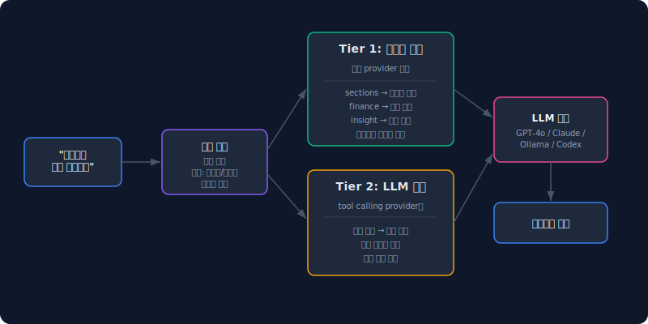
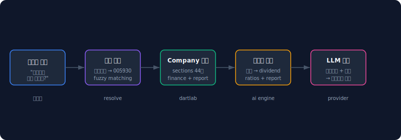
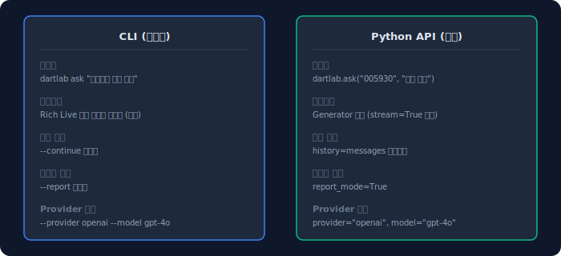
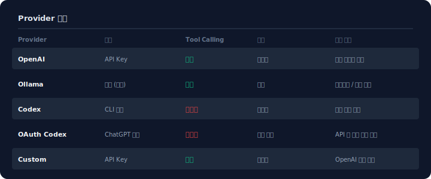

전자공시시스템을 열고, 200페이지짜리 사업보고서를 스크롤하고, 재무제표 숫자를 하나씩 비교하고, 감사보고서에서 의견을 찾는다. 한 종목만 해도 30분이다.

`dartlab ask`는 이 과정을 한 줄로 줄인다. 종목 이름과 질문을 던지면 — 재무제표, 사업보고서, 감사보고서, 인사이트 등급까지 엔진이 자동으로 수집하고, LLM이 종합 분석한 결과를 스트리밍으로 돌려준다.

## dartlab ask는 어떻게 동작하는가

ask의 내부 구조는 2단계다. **Tier 1**에서 시스템이 데이터를 수집·계산하고, **Tier 2**에서 LLM이 해석한다.



**Tier 1: 시스템 주도** — 모든 LLM provider에서 동작한다.

1. 질문을 분류한다 (건전성, 수익성, 성장성, 배당, 지배구조, 리스크, 종합)
2. 분류에 맞는 **분석 패키지**를 선택한다 (financial, valuation, risk, dividend 등)
3. 패키지가 지정한 엔진들을 병렬로 실행한다 — sections에서 공시 텍스트, finance에서 재무제표, insight에서 등급, rank에서 시장 순위
4. 결과를 하나의 **컨텍스트 패키지**로 조립해서 LLM에 전달한다

**Tier 2: LLM 주도** — tool calling을 지원하는 provider(OpenAI, Ollama)에서만 추가 동작한다.

Tier 1 결과를 본 LLM이 "데이터가 부족하다"고 판단하면 저수준 도구를 직접 호출한다. 특정 계정의 시계열, 공시 서술형 텍스트 검색, 복수 기업 비교 등을 LLM이 스스로 결정한다.

핵심은 **LLM이 계산하지 않는다**는 것이다. 재무비율, 등급 판정, 이상치 감지는 모두 dartlab 엔진이 수행하고, LLM은 그 결과를 해석하고 설명하는 역할만 맡는다.

## 5분 만에 첫 질문 던지기

```bash
# 1. 설치
pip install dartlab

# 2. API 키 설정 (OpenAI 예시)
dartlab setup openai
# → API key를 입력하면 로컬에 저장된다

# 3. 첫 질문
dartlab ask "삼성전자 재무건전성 분석해줘"
```

설치와 설정이 끝이다. API 키가 없다면 ChatGPT Plus 구독 계정으로도 시작할 수 있다.

```bash
# ChatGPT 구독 계정으로 시작
dartlab setup oauth-codex
# → 브라우저에서 로그인하면 완료

dartlab ask "현대차 배당 추세 분석해줘"
```



어떤 provider를 선택하든 흐름은 같다. 자연어 → 종목 추출 → Company 로드 → 패키지 조립 → LLM 분석 → 스트리밍 답변.

## CLI로 터미널에서 바로 분석하기

가장 빠른 경로는 CLI다. 질문에 종목 이름을 포함하면 자동으로 분리한다.

```bash
# 종목 이름 포함 (자동 추출)
dartlab ask "삼성전자 재무건전성 분석해줘"

# 종목코드 명시
dartlab ask --company 005930 "영업이익률 추세는?"

# provider/model 지정
dartlab ask "현대차 배당" --provider openai --model gpt-4o
```

답변은 터미널에 마크다운으로 실시간 렌더링된다. Rich Live 콘솔이 청크 단위로 출력하므로 첫 글자가 나올 때까지 기다리는 시간이 짧다.

```bash
# 데이터 필터링 — 특정 topic만 포함
dartlab ask "삼성전자 분석" --include BS IS ratios

# 특정 topic 제외
dartlab ask "삼성전자 분석" --exclude report
```

## Python API로 분석 파이프라인 붙이기

스크립트나 노트북에서는 Python API를 쓴다.

```python
import dartlab

# 기본: 스트리밍 (Generator 반환)
for chunk in dartlab.ask("삼성전자 재무건전성 분석해줘"):
    print(chunk, end="")
```

`dartlab.ask()`는 기본적으로 **스트리밍 제너레이터**를 반환한다. for 루프로 청크를 소비하면 된다.

```python
# 종목 + 질문 분리
for chunk in dartlab.ask("005930", "배당 추세는?"):
    print(chunk, end="")

# 데이터 필터링
for chunk in dartlab.ask("현대차", "분석해줘", include=["BS", "IS", "ratios"]):
    print(chunk, end="")

# 분석 패턴 지정
for chunk in dartlab.ask("삼성전자", "분석", pattern="financial"):
    print(chunk, end="")
```



CLI와 Python API는 같은 엔진을 소비한다. 차이는 진입점뿐이다.

## 대화를 이어가면 무엇이 달라지는가

한 번의 질문으로 끝나지 않는 분석이 있다. "재무건전성을 분석해줘" 다음에 "그러면 영업이익률은?" — 이전 맥락이 이어져야 의미 있는 답이 나온다.

```bash
# CLI: --continue 플래그
dartlab ask "삼성전자 재무건전성 분석해줘"
dartlab ask "그러면 영업이익률 추세는?" --continue
dartlab ask "동종 업계와 비교하면?" --continue
```

`--continue`를 붙이면 이전 세션의 메시지 히스토리를 자동으로 불러온다. LLM이 이전 답변을 기억한 상태에서 후속 질문에 답한다.

Python API에서는 `history` 파라미터로 같은 효과를 낸다.

```python
messages = []

# 첫 질문
answer1 = dartlab.ask("삼성전자", "재무건전성 분석해줘", stream=False)
messages.append({"role": "user", "content": "재무건전성 분석해줘"})
messages.append({"role": "assistant", "content": answer1})

# 후속 질문 — 이전 대화 전달
answer2 = dartlab.ask("삼성전자", "영업이익률은?", history=messages, stream=False)
```

## 보고서 모드 — 7섹션 구조화 분석

일반 ask가 "질문에 대한 답변"이라면, 보고서 모드는 **종합 분석 리포트**다. 7개 섹션으로 구조화된 전문 보고서를 생성한다.

```bash
# CLI
dartlab ask "삼성전자 종합 분석" --report
```

```python
# Python API
for chunk in dartlab.ask("삼성전자", "종합 분석", report_mode=True):
    print(chunk, end="")
```


보고서 모드는 질문 유형과 무관하게 7개 섹션을 모두 채운다. 기업 개요, 재무 분석, 수익성, 건전성, 성장성, 리스크, 종합 의견 — 하나의 종목에 대해 전방위 분석이 필요할 때 쓴다.

## 실제 분석 데모

아래는 dartlab ask로 전자공시를 AI 분석하는 실제 데모다.

[](https://www.threads.com/@eddmpython/post/DWKRORQktkC)

> [Threads에서 전체 영상 보기 →](https://www.threads.com/@eddmpython/post/DWKRORQktkC)

GPT 구독 계정 하나만으로 사업보고서를 분석하는 전체 과정을 보여준다. 전자공시시스템을 하나하나 열어서 읽던 방식과 비교하면, 같은 분석을 한 줄 명령어로 끝내는 차이가 드러난다.

## 놓치기 쉬운 예외

**Provider별 차이가 있다.** OpenAI와 Ollama는 tool calling을 지원해서 Tier 2까지 동작한다. Codex와 OAuth-Codex는 Tier 1만 동작한다. Tier 1만으로도 대부분의 분석은 충분하지만, "특정 계정의 5년 시계열을 보여줘" 같은 세밀한 요청은 tool calling이 필요하다.



**데이터가 없는 종목이 있다.** dartlab은 DART 공시를 기반으로 하므로, 공시를 제출하지 않은 종목(비상장, 외국 기업 중 일부)은 분석할 수 없다. EDGAR 종목(미국)은 베타 지원 중이다.

**첫 로딩이 느릴 수 있다.** Company 객체를 처음 생성할 때 공시 데이터를 다운로드한다. 두 번째 질문부터는 캐시가 동작해서 빠르다.

## 빠른 점검 체크리스트

- [ ] `pip install dartlab` (또는 `uv add dartlab`)
- [ ] `dartlab setup openai` (또는 `dartlab setup oauth-codex`)
- [ ] `dartlab status` — provider 가용성 확인
- [ ] `dartlab ask "삼성전자 분석해줘"` — 첫 질문 테스트
- [ ] 답변이 스트리밍으로 나오는지 확인
- [ ] `--continue`로 후속 질문 테스트

## FAQ

### dartlab ask에 OpenAI API 키가 꼭 필요한가요?

아니다. ChatGPT Plus 구독 계정이 있으면 `dartlab setup oauth-codex`로 API 키 없이 시작할 수 있다. Ollama를 설치하면 완전히 무료로 로컬에서 실행할 수도 있다.

### 무료 모델(Ollama)로도 쓸 수 있나요?

가능하다. `dartlab setup ollama`로 설정하면 로컬 LLM(Llama, Mistral 등)을 사용한다. tool calling도 지원하므로 Tier 2까지 동작한다. 다만 답변 품질은 GPT-4o 대비 떨어질 수 있다.

### 한 번에 분석할 수 있는 데이터 범위는?

기본적으로 해당 종목의 전체 sections(44개 모듈)과 최근 재무제표를 분석 대상으로 삼는다. `--include`나 `--exclude`로 범위를 조절할 수 있다.

### 질문에 종목코드를 꼭 넣어야 하나요?

종목 이름으로도 된다. "삼성전자 분석해줘"라고 하면 자동으로 종목코드(005930)를 추출한다. 모호한 이름이면 `--company 005930`으로 명시할 수 있다.

### ask로 미국 기업(EDGAR)도 분석할 수 있나요?

가능하다. `dartlab.ask("AAPL", "financial health analysis")`처럼 ticker를 넣으면 EDGAR Company로 분석한다. 현재 베타 단계이며 10-K/10-Q 기반 분석을 지원한다.

### 스트리밍을 끄면 무엇이 달라지나요?

`stream=False`로 설정하면 전체 답변이 완성된 후 한 번에 문자열로 반환된다. 파이프라인에서 후처리가 필요할 때 유용하지만, 사용자 대면 환경에서는 스트리밍이 체감 속도가 훨씬 빠르다.

### 보고서 모드와 일반 모드의 차이는?

일반 모드는 질문에 초점을 맞춘 답변이다. 보고서 모드(`--report`)는 질문과 무관하게 7개 섹션(기업 개요, 재무 분석, 수익성, 건전성, 성장성, 리스크, 종합 의견)을 모두 채운 전문 보고서를 생성한다.

## 참고 자료

- [dartlab 설치 및 설정 가이드](https://eddmpython.github.io/dartlab/docs/getting-started)
- [show(topic) — 공시 데이터를 한 줄로 꺼내는 구조](/blog/show-topic-one-line-company-data) — ask가 내부적으로 소비하는 데이터 구조
- [파이썬으로 재무제표 분석하기](/blog/python-financial-analysis) — dartlab의 기본 사용법
- [dartlab MCP — Claude Desktop에서 전자공시 바로 조회하는 법](/blog/dartlab-mcp-claude-desktop-disclosure) — ask의 반대편, IDE 안에서 같은 기능

## 핵심 구조 요약

dartlab ask의 구조는 세 문장으로 요약된다.

1. **시스템이 데이터를 준비한다** — 질문 분류 → 분석 패키지 선택 → 엔진 병렬 실행 → 컨텍스트 조립.
2. **LLM은 해석만 한다** — 계산은 dartlab 엔진, 설명은 LLM. 역할이 분리되어 있다.
3. **진입점만 다르고 엔진은 같다** — CLI, Python API, 서버 API, MCP 모두 같은 `analyze()` 파이프라인을 소비한다.
