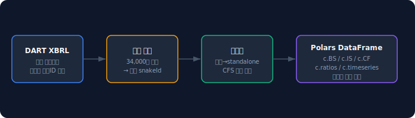
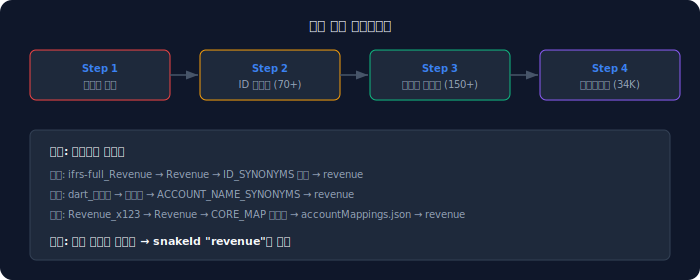
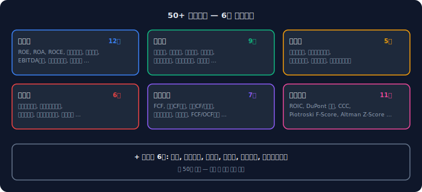
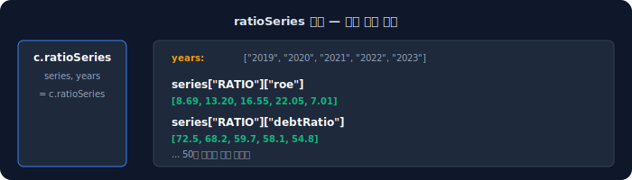
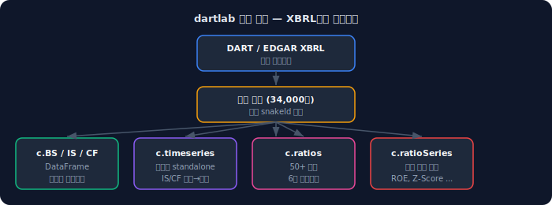

DART에서 재무제표를 다운로드하고, 엑셀에서 열고, 수식을 넣어 비율을 만들고, 분기별로 정렬한다. 종목 하나에 30분, 10개면 하루다.

dartlab은 이 과정을 한 줄로 줄인다. `c.BS`로 재무상태표, `c.IS`로 손익계산서, `c.CF`로 현금흐름표를 Polars DataFrame으로 즉시 꺼낸다. `c.ratios`는 50개 이상의 재무비율을 자동 계산해서 시계열로 돌려준다.

## 재무제표가 한 줄인 이유

dartlab의 `Company` 객체는 생성 시점에 XBRL 원본 데이터를 자동으로 다운로드하고 정규화한다. 사용자가 할 일은 종목코드를 넣는 것뿐이다.

```python
from dartlab import Company

c = Company("005930")  # 삼성전자

# 재무제표 3종 — Polars DataFrame
c.BS  # 재무상태표
c.IS  # 손익계산서
c.CF  # 현금흐름표
```

반환되는 DataFrame은 XBRL 원본에서 정규화된 결과다. 계정명이 `snakeId`로 통일되어 있어서 회사 간 비교가 바로 가능하다.



## 정규화는 어떻게 작동하는가

DART 원본 재무제표는 회사마다 계정ID와 계정명이 다르다. 같은 "매출액"이 `ifrs-full_Revenue`, `dart_Revenue`, `Revenue` 등으로 표기된다. dartlab은 4단계 파이프라인으로 이를 통일한다.

1. **접두사 제거** — `ifrs-full_`, `dart_`, `ifrs_`, `ifrs-smes_` 등 제거
2. **ID 동의어 통합** — 70개 이상의 영문 동의어를 하나의 표준ID로 매핑
3. **계정명 동의어 통합** — 150개 이상의 한글 변형을 하나로 통합
4. **매핑 테이블 조회** — 34,000개 이상의 학습된 매핑으로 최종 변환

결과적으로 모든 회사의 재무제표가 동일한 `snakeId` 체계로 나온다. `totalAssets`, `revenue`, `operatingIncome` — 회사가 달라도 같은 이름이다.



## 분기별 standalone 시계열

`c.timeseries`는 분기별 standalone 시계열을 반환한다. "standalone"이란 누적값이 아닌 해당 분기만의 순수 값이라는 뜻이다.

```python
series, periods = c.timeseries

# periods = ["2016-Q1", "2016-Q2", ..., "2024-Q4"]
# series["IS"]["revenue"]  → 분기별 매출액 리스트
# series["BS"]["totalAssets"]  → 분기별 총자산 리스트
# series["CF"]["operatingCashflow"]  → 분기별 영업현금흐름 리스트
```

변환 로직은 재무제표 유형에 따라 다르다.

| 재무제표 | 원본 형태 | 변환 방식 |
|---|---|---|
| IS (손익) | 분기 누적 | 이전 누적분을 차감해 standalone 추출 |
| CF (현금흐름) | 분기 누적 | 이전 누적분을 차감해 standalone 추출 |
| BS (재무상태) | 시점 잔액 | 변환 없이 그대로 사용 |

연결(CFS)과 별도(OFS) 재무제표가 모두 있으면 연결 우선이다.

## 50개 재무비율 — 6개 카테고리

`c.ratios`는 50개 이상의 재무비율을 6개 카테고리로 분류해서 시계열 DataFrame으로 반환한다.

```python
c.ratios  # 전체 비율 시계열 DataFrame
```



**수익성 (12개):** ROE, ROA, ROCE, 영업이익률, 순이익률, 세전이익률, 매출총이익률, EBITDA 마진, 매출원가율, 판관비율, 유효세율, 이익의질

**안정성 (9개):** 부채비율, 유동비율, 당좌비율, 현금비율, 자기자본비율, 이자보상배수, 순부채비율, 비유동비율, 운전자본

**성장성 (5개):** 매출성장률, 영업이익성장률, 순이익성장률, 자산성장률, 자기자본성장률

**효율성 (6개):** 총자산회전율, 고정자산회전율, 재고자산회전율, 매출채권회전율, 매입채무회전율, 영업주기

**현금흐름 (7개):** FCF, 영업CF마진, 영업CF/순이익, 영업CF/유동부채, 설비투자비율, 배당성향, FCF/OCF비율

**복합지표 (11개):** ROIC, DuPont 분해, 부채/EBITDA, CCC(현금전환주기), DSO, DIO, DPO, **Piotroski F-Score**, **Altman Z-Score**

## Piotroski F-Score와 Altman Z-Score

일반적으로 이 두 지표를 계산하려면 직접 수식을 구현해야 한다. dartlab은 자동으로 계산한다.

**Piotroski F-Score** (0~9점) — 재무 건전성 종합 점수:
- 수익성 4개 (ROA, 영업CF, ROA 개선, 이익의질)
- 레버리지 3개 (부채 감소, 유동성 개선, 신주 미발행)
- 효율성 2개 (매출총이익률 개선, 자산회전율 개선)

**Altman Z-Score** — 부도 예측:
- Z가 2.99 초과: 안전 구간
- Z가 1.81~2.99: 회색 구간
- Z가 1.81 미만: 위험 구간

```python
series, periods = c.timeseries
from dartlab.engines.common.finance.ratios import calcRatios

result = calcRatios(series)
result.piotroskiFScore  # 예: 7
result.altmanZScore     # 예: 3.42
```

## 연간 비율 시계열

`c.ratioSeries`는 연도별 비율 추이를 반환한다. 특정 비율이 몇 년간 어떻게 변했는지 추적할 때 쓴다.

```python
series, years = c.ratioSeries

# years = ["2019", "2020", "2021", "2022", "2023"]
# series["RATIO"]["roe"]  → [8.69, 13.20, 16.55, 22.05, 7.01]
# series["RATIO"]["debtRatio"]  → [72.5, 68.2, 59.7, 58.1, 54.8]
```



## 은행·금융업은 다르게 계산된다

금융업은 일반 제조업과 재무구조가 근본적으로 다르다. dartlab은 이를 자동으로 감지해서 처리한다.

- `revenue`, `currentAssets` 등 일반 제조업 계정이 없을 수 있음
- 금융업 전용 archetype으로 전환해서 비율 계산
- `calcRatios(series, archetypeOverride="financial")`로 수동 지정도 가능

## 어디에서 왜곡이 생기나

**미매핑 계정.** 34,000개 매핑 테이블로 대부분 커버하지만, 드물게 새로운 계정이 등장한다. 미매핑 계정은 비율 계산에서 자동으로 제외된다.

**분기 데이터 누락.** 일부 종목은 특정 분기의 XBRL 제출이 누락되어 있다. 이 경우 해당 분기의 standalone 값이 None이 된다.

**TTM 계산.** IS/CF의 최근 4분기 합산(Trailing Twelve Months)이 기본이다. 4분기가 모두 없으면 TTM도 None이다.

## 놓치기 쉬운 예외

**CIS와 IS의 차이.** 포괄손익계산서(CIS)와 손익계산서(IS)가 모두 존재할 수 있다. dartlab은 IS를 기본으로 사용하고, IS가 없을 때만 CIS를 fallback으로 쓴다.

**자본변동표(SCE).** `c.BS`, `c.IS`, `c.CF` 외에 자본변동표도 별도로 지원한다. `buildSceMatrix()`로 접근 가능하다.

**EDGAR도 같은 구조.** 미국 기업도 동일한 방식으로 동작한다. 종목코드 대신 ticker를 넣으면 된다.

```python
c = Company("AAPL")
c.BS  # Apple 재무상태표 (SEC XBRL 기반)
```

## 빠른 점검 체크리스트

- [ ] `pip install dartlab` (재무 분석은 기본 패키지에 포함)
- [ ] `Company("005930")` 생성 후 `c.BS` 확인
- [ ] `c.IS`, `c.CF` DataFrame 확인
- [ ] `c.timeseries` — 분기별 시계열 반환 확인
- [ ] `c.ratios` — 비율 시계열 DataFrame 확인
- [ ] `c.ratioSeries` — 연간 비율 추이 확인

## FAQ

### Polars DataFrame인데 pandas로 변환할 수 있나요?

`c.BS.to_pandas()`로 즉시 변환된다. 하지만 Polars가 더 빠르고 메모리 효율적이므로, 가능하면 Polars 그대로 쓰는 것을 권장한다.

### 재무비율을 직접 커스텀할 수 있나요?

`c.timeseries`로 원본 시계열을 꺼내면 어떤 비율이든 직접 계산할 수 있다. dartlab의 50개 비율은 가장 보편적인 것들을 자동화한 것이다.

### 전체 상장사 비율을 한번에 뽑을 수 있나요?

`dartlab.screen()` 또는 `dartlab.benchmark()`를 쓰면 된다. 전체 상장사의 비율을 미리 계산한 결과를 섹터별로 비교할 수 있다. 자세한 내용은 [스크리닝 가이드](/blog/dartlab-screen-benchmark-2700-stock-screening)에서 다룬다.

### 연결재무제표와 별도재무제표 중 어떤 것을 쓰나요?

연결(CFS) 우선이다. 연결이 없는 종목에만 별도(OFS)를 사용한다. 현재 수동 전환은 지원하지 않는다.

### Altman Z-Score가 None으로 나옵니다.

Altman Z-Score는 매출, 총자산, 운전자본, 이익잉여금, EBIT, 시가총액이 모두 필요하다. 하나라도 None이면 계산할 수 없어서 None을 반환한다. 금융업은 구조적으로 계산이 불가능한 경우가 많다.

### 분기별이 아닌 연간 데이터만 필요합니다.

`ratioSeries`가 연간 비율 추이를 제공한다. 원본 연간 시계열이 필요하면 내부 `buildAnnual()` 함수를 직접 호출할 수 있다.

### EDGAR(미국)와 DART(한국) 비율 체계가 같나요?

같다. 두 소스 모두 같은 `calcRatios()` 함수를 거치므로 동일한 50개 비율이 나온다. 다만 XBRL 계정 매핑 테이블은 소스별로 별도 관리한다.

## 참고 자료

- [파이썬으로 재무제표 분석하기](/blog/python-financial-analysis) — dartlab 기본 사용법
- [XBRL 파싱과 계정 매핑](/blog/xbrl-parsing-and-account-mapping) — 매핑 파이프라인 상세
- [dartlab ask — AI 분석](/blog/dartlab-ask-ai-disclosure-analysis) — 재무 데이터 기반 AI 분석
- [dartlab 인사이트 등급](/blog/dartlab-insights-7area-company-grading) — 비율 위에 올라가는 등급 시스템

## 핵심 구조 요약



dartlab 재무 엔진의 구조는 세 문장으로 요약된다.

1. **XBRL → 표준 snakeId → Polars DataFrame** — 34,000개 매핑으로 회사 간 계정을 통일하고, 한 줄로 꺼낸다.
2. **누적 → standalone → 시계열** — IS/CF의 누적값을 분기 순수값으로 변환하고, 수년간의 시계열을 자동 구축한다.
3. **50개 비율 × 6카테고리** — ROE부터 Altman Z-Score까지, 수작업 없이 자동 계산된다.
